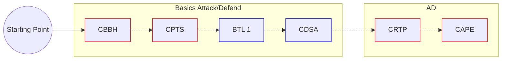

# Nebenjob

Zugang Alex - https://wikare.de/s/jkENHLqYjtgLd4d

# TODO

- Doku für:
  - Linux Fundamentals
  - Windwos Fundamentals

- Attack cycle / workflow with clickable links
  - Cyber Kill Chain / MITRE Attack Chain

# Certs

Red:

1. CBBH
2. CPTS/OSCP
3. CRTP
4. CAPE
5. CRTO
6. CRTO 2
7. OSEP

Blue:

1. BTL 1
2. CDSA
3. CCD

**Gedachter Verlauf**:

