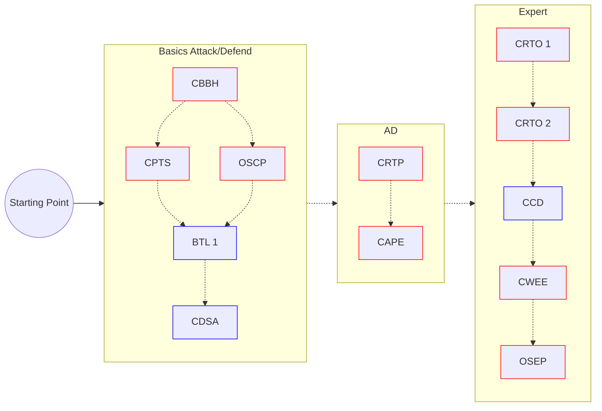

# Nebenjob

Zugang Alex - https://wikare.de/s/jkENHLqYjtgLd4d

# TODO

- Gespielte Boxen (_im Wesentlichen die Initial Accesses und generische PrivEscs_) in Notizen einpflegen

- setup
  - Terminal Emulator: Kitty, Wave, wezterm, ghostty
  - shell: zsh (_ohmyzsh_)
  - tmux

- Attack cycle / workflow with clickable links
  - Cyber Kill Chain / MITRE Attack Chain

- Templates
  - BBH

- pt_process.md
  - Anpassen von mermaid

- Module für CPTS
  - Footprinting
  - OSINT Corporate Recon
  - Shells & Payloads
  - Password Attacks
  - Attacking Common Services
  - Pivoting, Tunneling, Port Forwarding
  - AD Enum & Attacks
  - Attacking common apps
  - linux privesc
  - wind privesc
  - documentation and reporting
  - attacking enterprise networks

# Certs

**Gedachter Verlauf**:

