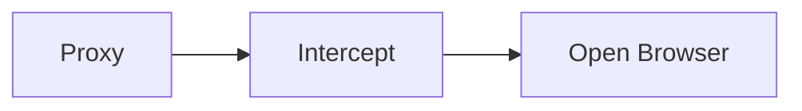
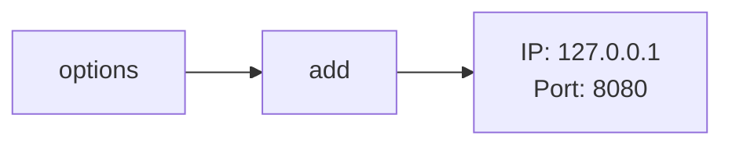
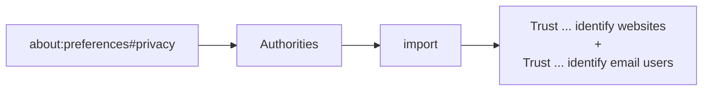
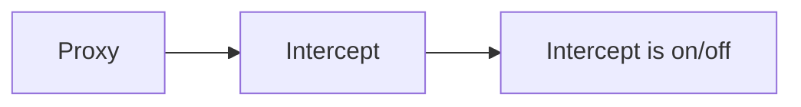
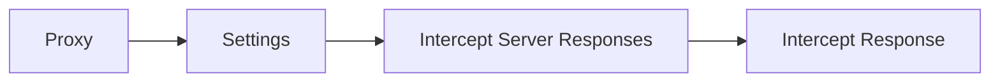
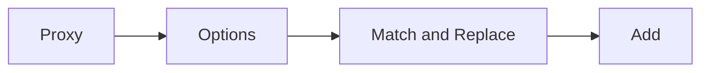
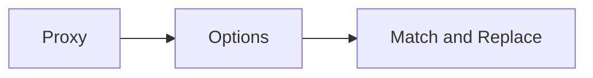

- [Web Proxies](#web-proxies)
  - [Web Proxies](#web-proxies-1)
    - [Setup](#setup)
      - [Burp](#burp)
      - [ZAP](#zap)
      - [Proxy Setup](#proxy-setup)
      - [CA Certificate](#ca-certificate)
    - [Intercepting Web Requests](#intercepting-web-requests)
      - [Burp](#burp-1)
      - [ZAP](#zap-1)
      - [Manipulating Web Requests](#manipulating-web-requests)
    - [Intercepting Responses](#intercepting-responses)
      - [Burp](#burp-2)
      - [ZAP](#zap-2)
    - [Automatic Request Modification](#automatic-request-modification)
      - [Burp](#burp-3)
      - [ZAP](#zap-3)
    - [Automatic Response Modification](#automatic-response-modification)
      - [Burp](#burp-4)
    - [Repeating Requests](#repeating-requests)
      - [Burp](#burp-5)
      - [ZAP](#zap-4)
    - [Off-Topic: Encoding/Decoding](#off-topic-encodingdecoding)
    - [Off-Topic: Proxying Tools](#off-topic-proxying-tools)
  - [Web Fuzzer](#web-fuzzer)
    - [Burp Intruder](#burp-intruder)
      - [Target](#target)
      - [Positions](#positions)
      - [Payload Sets](#payload-sets)
      - [Payload Options](#payload-options)
      - [Payload Processing](#payload-processing)
      - [Payload Encoding](#payload-encoding)
      - [Options](#options)
    - [ZAP Fuzzer](#zap-fuzzer)
      - [Fuzz Locations](#fuzz-locations)
      - [Payload](#payload)
      - [Processors](#processors)
      - [Options](#options-1)
  - [Web Scanner](#web-scanner)
    - [Burp Scanner](#burp-scanner)
    - [ZAP Scanner](#zap-scanner)
      - [ZAP Spider](#zap-spider)
      - [ZAP Passive Scanner](#zap-passive-scanner)
      - [ZAP Active Scanner](#zap-active-scanner)
      - [ZAP Reporting](#zap-reporting)

---

# Web Proxies

... are specialized tools that can be set up between a browser/mobile application and a back-end server to capture and view all the web requests being sent between both ends, essentially acting as MitM tools. They mainly work with web ports, such as HTTP/80 and HTTPS/443.

## Web Proxies

To use Burp or ZAP as web proxies, you must configure your browser proxy settings to use them as the proxy or use the pre-configured browser.

### Setup

#### Burp

_Pre-configured_:



#### ZAP

_Pre-configured_:

Click on the browser icon at the end of the top bar.

#### Proxy Setup

In cases you want to use a real browser, you can utilize the Firefox extension [FoxyProxy](https://addons.mozilla.org/en-US/firefox/addon/foxyproxy-standard/).



#### CA Certificate

If you don't install the CA Cert, some HTTPS traffic may not get properly routed, or you may need to click 'accept' every time firefox needs to send an HTTPS request.

- [Installing Burp's CA certificate](https://portswigger.net/burp/documentation/desktop/external-browser-config/certificate) <br>
- [Server Certificates - Zed Attack Proxy (ZAP)](https://www.zaproxy.org/docs/desktop/addons/network/options/servercertificates/)



### Intercepting Web Requests

#### Burp



#### ZAP

Click the green button on the top bar to turn 'Request Interception' on/off.

#### Manipulating Web Requests

Once you intercepted the request, it will remain hanging until you forward it. You can examine the request, manipulate it to make any changes you want, and then send it to its destination.

Possibilities:

- SQLi
- Command injections
- Upload bypasses
- Authentication bypass
- XSS
- XXE
- Error handling
- Deserialization
- ...

### Intercepting Responses

#### Burp



#### ZAP

You can click 'Step' and ZAP will automatically intercept the response.

### Automatic Request Modification

You may want to apply certain modifications to all outgoing HTTP requests in certain situations.

#### Burp



_Options in 'Add'_:

| Options | Example | Description |
| ------- | ------- | ----------- |
| **Type** | _Request header_ | since the change you want to make will be in the request header and not in its body |
| **Match** | _^User-Agent.*$_ | the regex pattern that matches the entire line with User-Agent in it |
| **Replace** | _User-Agent: HackTheBox Agent 1.0_ | this is the value that will replace the line we matched above |
| **Regex match** | _True_ | you don't know the exact User-Agent string you want to replace, so you'll use regex to match any value that matches the pattern we specified above |

#### ZAP

Using the 'Replacer' by clicking on it or pressing ```[CRTL+R]```.

_Options in Replacer_:

| Options | Example | Description |
| ------- | ------- | ----------- |
| **Description** | _HTB User-Agent_ | |
| **Match Type** | _Request Header_ | |
| **Match String** | _User-Agent_ | You can select the header you want from the drop-down menu, and ZAP will replace its value |
| **Replacement String** | _HackTheBox Agent 1.0_ | |
| **Enable** | _True_ | |

### Automatic Response Modification

You may want to apply certain modifications to all incoming HTTP responses in certain situations.

#### Burp



_Options in 'Add'_:

| Options | Example |
| ------- | ------- |
| **Type** | _Response body_ |
| **Match** | _type="number"_ |
| **Replace** | _type="text"_ |
| **Regex match** | _False_ |

### Repeating Requests

#### Burp

Once you located the request you want to repeat, you can click ```[CTRL+R]``` and then you can navigate to the 'Repeater' tab. Once in 'Repeater' you cand click 'Send' to send the request.

#### ZAP

Once you located the request you want to repeat, right-click on it and select 'Open/Resend with Request Editor'.

### Off-Topic: Encoding/Decoding

As you modify and send custom HTTP requests, you may have to perform various types of encoding and decoding to interact with the webserver properly. Both Burp and ZAP have built-in encoders that can help you in quickly encoding and decoding various types of text.

Otherwise: [CyberChef](https://gchq.github.io/CyberChef/)

### Off-Topic: Proxying Tools

An important aspect of using web proxies is enabling the interception of web requests made by the command-line tools and thick client applications. This gives you transparency into the web requests made by the applications and allows you to utilize all of the different proxy features you have used with web applications.

To route all web requests made by a specific tool through your web proxy tools, you have to set them up as the tool's proxy.

Possibilites:

- Proxychains
- Nmap
- Metasploit

## Web Fuzzer

### Burp Intruder

Burp's web fuzzer is called 'Intruder', and can be used to fuzz pages, directories, sub-domains, parameters, paramater values, and many other things. Community version is throttled at a speed of 1 request per second.

#### Target

On the first tab, 'Target', you see the details of the target you will be fuzzing, which is fed from the request we sent to 'Intruder'.

#### Positions

The second tab, 'Positions', is where you place the payload position pointer, which is the point where words from our wordlist will be placed and iterated over.

[More on Attack Types!](https://portswigger.net/burp/documentation/desktop/tools/intruder/configure-attack/attack-types)

#### Payload Sets

The 'Payload set' identifies the Payload number, depending on the attack type and number of payloads you used in the payload position pointers.

The 'Payload type' is the type of payloads/wordlists you will be using:

| Type | Description |
| ---- | ----------- |
| **Simple List** | the 'Intruder' iterates over each line |
| **Runtime file** | similar to simple list, but loads line-by-line as the scan runs to avoid excessive memory usage by Burp |
| **Character Substitution** | lets you specify a list of characters and their replacements, and Burp tries all potential permutations |

#### Payload Options

Differs for each payload type.

#### Payload Processing

... allows you to determine fuzzing rules over the loaded wordlist.

#### Payload Encoding

... enables you to enable or disable payload URL-encoding.

#### Options

... can be used to customize your attack.

'Grep - Match' for example enables you to flag specific requests depending on their responses. As you are fuzzing web directories, you are only interested in responses with HTTP code '200 OK'.

### ZAP Fuzzer

ZAP's fuzzer is called 'ZAP Fuzzer'. It can be very powerful for fuzzing various web end-points, though it is missing some of the features provided by Burp's Intruder.

#### Fuzz Locations

... is where the payload will be placed. To place our location on a certain word, you can select it and click on the 'Add' button on the right pane.

#### Payload

8 different payload types in total. Some are:

| Type | Description |
| ---- | ----------- |
| **File** | this allows you to select a payload wordlist from a file |
| **File Fuzzers** | this allows you to select wordlists from built-in databases of wordlists |
| **Numberzz** | generates sequences of numbers with custom increments |

#### Processors

You may also want to perform some processing on each word in your payload wordlist. The following are some of the payload processors you can use:

- Base64 Decode/Encode
- MD5 Hash
- Postfix String
- Prefix String
- SHA-1/256/512 Hash
- URL Decode/Encode
- Script

#### Options

You can set a few options for your fuzzer.

## Web Scanner

### Burp Scanner

_Pro-Only Feature_

... a powerful scanner various types of web vulnerabilities, using a Crawler for building the website structure, and scanner for passive and active scanning.

### ZAP Scanner

#### ZAP Spider

... is capable of building site maps using ZAP Spider and performing both passive and active scans to look for various types of vulnerabilities.

After starting a spider scan, the scan spiders the website by looking for links and validating them.

A possible outcome:


#### ZAP Passive Scanner

... runs and makes requests to various end-points, it is automatically running its passive scanner on each response to see if it can identify potential issues from the source code, like missing security headers or DOM-based XSS vulnerabilities.

#### ZAP Active Scanner

... will try various tyoes of attacks against all identified pages and HTTP parameters to identify as many vulnerabilities as it can. As the active Scan runs, you will see the alerts button start to get populated with more alers as ZAP uncovers more issues.

#### ZAP Reporting

You can generate a report with all of the findings identified by ZAP through its various scans and can be exported in other formats like XML or Markdown.

Looks like:

