- [Hardware / ICS Fundamentals](#hardware--ics-fundamentals)
  - [Gerber](#gerber)
  - [Logic Gates](#logic-gates)
    - [Gate Types](#gate-types)
      - [AND Gate](#and-gate)
      - [NOT Gate](#not-gate)
      - [OR Gate](#or-gate)
      - [NAND Gate](#nand-gate)
      - [NOR Gate](#nor-gate)
      - [XOR Gate](#xor-gate)
      - [XNOR Gate](#xnor-gate)
  - [Modbus](#modbus)
    - [Modbus TCP](#modbus-tcp)
    - [Register Types](#register-types)
    - [Function Codes](#function-codes)
  - [PJL Commands](#pjl-commands)
    - [Basic Commands](#basic-commands)
  - [SAL](#sal)
    - [Analysis](#analysis)
    - [Handling Framing Errors](#handling-framing-errors)
  - [VHDL (_VHSIC Hardware Description Language_)](#vhdl-vhsic-hardware-description-language)

---

# Hardware / ICS Fundamentals

## Gerber

_.grb_

Gerber files are open ASCII vector format files that contain information on each phyiscal board layer of your PCB (_Print Circuit Board_) design. Circuit board objects, like copper traces, vias, pads, solder masks, and silkscreen images, are all represented by a flash or draw code and defined by a series of vector coordinates. PCB manufacturers use these files to translate the details of a design into the physical properties of the PCB. The PCB design software typically generates Gerber files, although the process will vary with each CAD tool. Gerber data does not have a specific identifying file name as a text file but has a common extension such as .gb or .gbr.

Further readings:

- [Gerber files: what are they & how are they used by your PCB manufacturer?](https://www.proto-electronics.com/blog/gerber-files-what-are-they)

## Logic Gates

... are an electronic circuit that are designed by using electrical components like diodes, transistors, resistors, and more. It is used to perform logical operations based on the inputs provided to it and gives a logical output that can either be high (_1_) or low (_0_). The operation of logic gates is based on boolean algebra or mathematics.

They are constructed from so-called transistors. Transistors are electronic components that are essentially switches. Unlike manual switches, which are operated by hand, electronic switches can be controlled by an electrical input signal.

### Gate Types

#### AND Gate

... takes two (_or more_) inputs and gives out a 1 if all the inputs are 1. Otherwise, it gives out a 0.

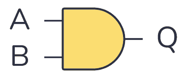

| Input A | Input B | Output Q |
| ------- | ------- | -------- |
| 0 | 0 | 0 |
| 0 | 1 | 0 |
| 1 | 0 | 0 |
| 1 | 1 | 1 |

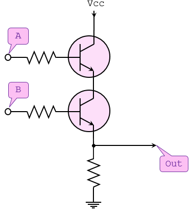

#### NOT Gate

... takes one bit as input and gives back an output which is NOT the input.


| Input A | Output Q |
| ------- | -------- |
| 0 | 1 |
| 1 | 0 |

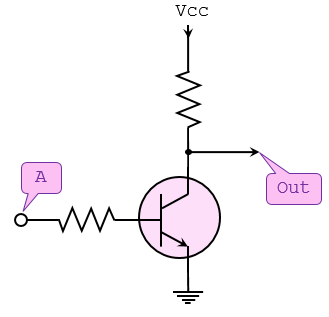

#### OR Gate

... takes two (_or more_) inputs and gives out a 1 if any of the inputs are 1.

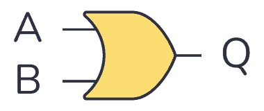

| Input A | Input B | Output Q |
| ------- | ------- | -------- |
| 0 | 0 | 0 |
| 0 | 1 | 1 |
| 1 | 0 | 1 |
| 1 | 1 | 1 |

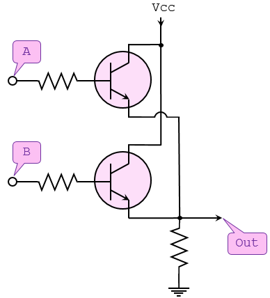

#### NAND Gate

... operates in the oppposite way of the AND gate.

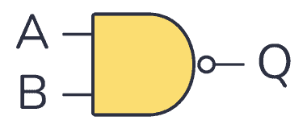


| Input A | Input B | Output Q |
| ------- | ------- | -------- |
| 0 | 0 | 1 |
| 0 | 1 | 1 |
| 1 | 0 | 1 |
| 1 | 1 | 0 |

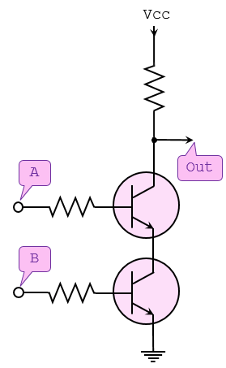

#### NOR Gate

... operates in the opposite way of the OR gate.

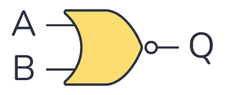

| Input A | Input B | Output Q |
| ------- | ------- | -------- |
| 0 | 0 | 1 |
| 0 | 1 | 0 |
| 1 | 0 | 0 |
| 1 | 1 | 0 |

#### XOR Gate

... outputs 1 if one of its two inputs is 1 - but not both.

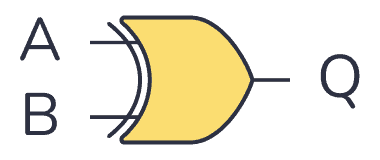

| Input A | Input B | Output Q |
| ------- | ------- | -------- |
| 0 | 0 | 0 |
| 0 | 1 | 1 |
| 1 | 0 | 1 |
| 1 | 1 | 0 |

#### XNOR Gate

... works like an XOR gate with an inverter on the output.


| Input A | Input B | Output Q |
| ------- | ------- | -------- |
| 0 | 0 | 1 |
| 0 | 1 | 0 |
| 1 | 0 | 0 |
| 1 | 1 | 1 |

## Modbus

Modbus is an industrial protocol standard that was created by Modicon, now Schneider Electric, in the late 1970s for communication among programmable logic controllers (_PLC_). Modbus remains the most widely available protocol for connecting industrial devices. The Modbus protocol specification is openly published and use of the protocol is royalty-free.

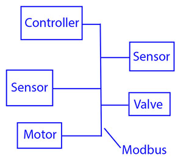

Modbus protocol is defined as a master/slave protocol, meaning a device operating a master will poll one or more devices operating as a slave. This means a slave device cannot volunteer information; it must wait to be asked for it. The master will write data to a slave device's registers, and read data from a slave device's registers. A register address or register reference is always in the context of the slave's registers.

The most commonly used form of Modbus protocol is RTU over RS-485. Modbus RTU is a relatively simple serial protocol that can be transmitted via traditional UART technology. Data is transmitted in 8-bit bytes, one bit at a time, at baud rates ranging from 1200 bits per second to 115200 bits per second. The majority of Modbus RTU devices only support speeds up to 38400 bits per second.

A Modbus RTU network has one master and one or more slaves. Each slave has a unique 8-bit device address or unit number. Packets sent by the master include the address of the slave the message is intended for. The slave must respond only if its address is recognized, and must respond within a certain time period or the master will call it a "no response" error.

Each exchange of data consists of a request from the master, followed by a response from the slave. Each data packet, whether request or response, begins with the device address or slave address, followed by function code, followed by parameters defining what is being asked for or provided. The exact formats of the request and response are documented in detail in the Modbus protocol specification. The general outline of each request and response is illustrated below.

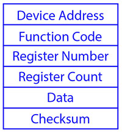

Modbus data is most often read and written as "registers" which are 16-bit pieces of data. Most often, the register is either a signed or unsigned 16-bit integer. If a 32-bit integer or floating point is required, these values are actually read as a pair of registers. The most commonly used register is called a Holding Register, and these can be read or written. The other possible type is Input Register, which is read-only.

The exceptions to registers being 16 bits are the coil and the discrete input, which are each 1 bit only. Coils can be read or written, while discrete inputs are read-only. Coils are usually associated with relay outputs.

The type of register being addressed by a Modbus request is determined by the function code. The most common codes include 3 for "real holding registers", and may read 1 or more. Function code 6 is used to write a single holding register. Function code 16 is used to write one or more holding registers.

### Modbus TCP

Modbus encapsulates Modbus RTU request and response data packets in a TCP packet transmitted over standard Ethernet networks. The unit number is still included and its interpretation varies by application - the unit or slave address is not the primary means of addressing in TCP. The address of most importance here is the IP address. The **standard port for Modbus TCP is 502**, but port number can often be reassigned if desired.

The checksum field normally found at the end of an RTU packet is omitted from the TCP packet. Checksum and error handlind are handled by Ethernet in the case of Modbus TCP.

Modbus TCP makes the definition of master and slave less obvious because Ethernet allows peer to peer communication. The definition of client and server are better known entities in Ethernet based networking. In this context, the slave becomes the server and the master becomes the client. There can be more than one client obtaining data from a server. In Modbus terms, this means there can be multiple masters as well as multiple slaves. Rather than defining master and slave on a physical device bases, it now becomes the system designer's responsibility to create logical associations between master and slave functonality.

### Register Types

The types of registers referenced in Modbus devices include the following:

| Register Type | Function | Size | R/W |
| ------------- | -------- | ---- | --- |
| Coil (_Discrete Output_) | used to control discrete outputs | 1-bit | R/W |
| Discrete Input (_or Status Input_) | used as inputs | 1-bit | R |
| Input Register | used for input | 16-bit | R |
| Holding Register | used for a variety of things including inputs, outputs, config data, or any requirement for "holding data" | 16-bit | R/W |

### Function Codes

Modbus protocol defines several function codes for accessing Modbus registers. There are four different data blocks defined by Modbus, and the addresses or register numbers in each of those overlap. Therefore, a complete definition of where to find a piece of data requires both the address and function code.

The function codes most commonly reconized by Modbus devices are indicated in the table below. This is only a subset of the codes available - several of the codes have special applications that most often do not apply.

| Function Code | Register Type |
| ------------- | ------------- |
| 1 | Read Coil |
| 2 | Read Discrete Input |
| 3 | Read Holding Registers |
| 4 | Read Input Registers |
| 5 | Write Single Coil |
| 6 | Write Single Holding Register |
| 15 | Write Multiple Coils |
| 16 | Write Multiple Holding Registers |

## PJL Commands

PJL stands for Printer Job Language developed by Hewlett-Packard. A documentation can be found [here](https://h10032.www1.hp.com/ctg/Manual/bpl13208.pdf). It allows:

- Control print jobs
- Query printer status, configurations
- Switch between languages
- Set environment variables
- Manage print job separation

### Basic Commands

| Command | Description |
| ------- | ----------- |
| ```FSAPPEND``` | Appends data to an existing file or creates a new file. |
| ```FSDELETE``` | Deletes printer mass storage files. |
| ```FSDIRLIST``` | Lists PJL file system files and dirs. |
| ```FSDOWNLOAD``` | Downloads files to the printer mass storage system. |
| ```FSINIT``` | Initializes the printer mass storage file system. |
| ```FSMKDIR``` | Creates a dir on the printer mass storage file system. |
| ```FSQUERY``` | Queries existence if dirs and files and returns file size. |
| ```FSUPLOAD``` | Uploads all or part of a file from the printer to the host. |

## SAL

_.sal_

A SAL file is a capture file in Saleae Logic Analyzer. A .sal capture itself is a zip file containing:

- ```meta.json``` - _a json file describing the capture_
- ```digital-#.bin``` - _raw digital data_
- ```analog-#.bin``` - _raw analog data_

### Analysis

... can be done using Saleae's Logic Analyzer [Logic 2](https://www.saleae.com/de/pages/downloads).

To start Logic 2:

```bash
chmod +x ./Logic-x.x.x-master.AppImage
./Logic-x.x.x-master.AppImage
```

1. Inside the analyzer, click "Open a capture" and select the target file
2. Open "Analyzer" tab on the right and click on "Async Serial"
3. A dialogue opens and configuration needs to be done (_BitRate_)
4. Save
5. Convert values into ASCII to read data

> [!NOTE]
> Async Serial _or_ Asynchronous serial communication is a form of serial communication in which the communicating endpoints' interfaces are not continuously synchronized by a common clock signal.

### Handling Framing Errors

A framing error happens when a receiver in a serial communication system fails to correctly identify the boundaries of a byte or character. If the bits are being read too fast or too slow, the bits will give different values. To fix this, find the shortest interval.

> [!TIP]
> Think of it like this: You're trying to read words from someone who is speaking, but their pauses between words are messed up:<br>
> ```Th isis af rame in ge rro r.```<br>
> _Logic 2 will warn you if there are framing errors present._

To calculate the actual bit rate:

```
Bit rate (bit/s) = 1 second / (interval(microseconds) x 10^(-6)) seconds
# ignore decimals
```

## VHDL (_VHSIC Hardware Description Language_)

_.vhd_

... is a hardware description language that can model the behaviour and structure of digital systems at multiple levels of abstraction, ranging from the system level down to that of logic gates, for design entry, documentation, and verification purposes.

The following code will be creating a VHDL file that describes an AND gate:

```
signal and_gate : std_logic;
and_gate <= input_1 and input_2;
```

The first line of code defines a signal of type ```std_logic``` and it is called ```and_gate```. ```Std_logic``` is the type that is most commonly used to define signals, but there are others too. This code will generate an AND gate with a single output and two inputs. The keyword "and" is reserved in VHDL. The ```<=``` operator is known as the assignment operator. When you verballly parse the code above, you can say out load, "The signal and_gate GETS input_1 and-ed with input_2".

Input and outputs are defined in an entity. An entity contains a port that defines all inputs and outputs to a file:

```
entity example_and is
  port (
    input_1    : in  std_logic;
    input_2    : in  std_logic;
    and_result : out std_logic
  );
end example_and;
```

This is a basic entity. It defines an entity called ```example_and``` and three signals, two inputs, and one output, all of which are of type ```std_logic```. One other VHDL keyword is needed to make this complete, namely architecture. An architecture is used to describe the functionality of a particular entity. Think of it as a thesis paper: the entity is the table of contents and the architecture is the content.

```
architecture rtl of example_and is
  signal and_gate : std_logic;
begin
  and_gate <= input_1 and input_2;
  and_result <= and_gate;
end rtl;
```

The above code defines an architecture called rtl of entity ```example_and```. All signals that are used by the architecture must be defined between the "is" and the "begin" keywords. The actual architecture logic comes between the "begin" and "end" keywords. One last thing you need to tell the tool is which library to use. A library defines how certain keywords behave in your file.

```
library ieee;
use ieee.std_logic_1164.all;
```

Results in:

```
library ieee;
use ieee.std_logic_1164.all;
 
entity example_and is
  port (
    input_1    : in  std_logic;
    input_2    : in  std_logic;
    and_result : out std_logic
    );
end example_and;
 
architecture rtl of example_and is
  signal and_gate : std_logic;
begin
  and_gate   <= input_1 and input_2;
  and_result <= and_gate;
end rtl;
```