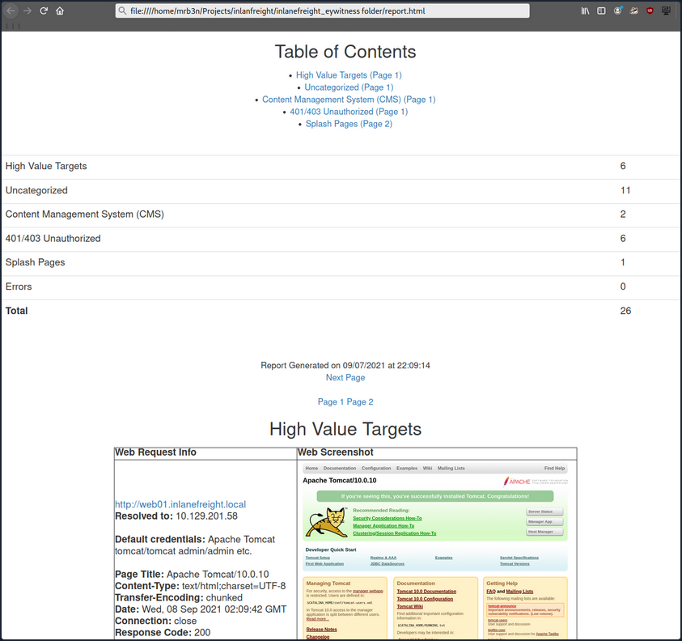

- [Application Discovery \& Enumeration](#application-discovery--enumeration)
  - [Initial Enum](#initial-enum)
  - [Using EyeWitness](#using-eyewitness)
  - [Using Aquatone](#using-aquatone)
  - [Interpreting the Results](#interpreting-the-results)

---

# Application Discovery & Enumeration

## Initial Enum

Assuming your client provided you with the following scope:

```bash
d41y@htb[/htb]$ cat scope_list 

app.inlanefreight.local
dev.inlanefreight.local
drupal-dev.inlanefreight.local
drupal-qa.inlanefreight.local
drupal-acc.inlanefreight.local
drupal.inlanefreight.local
blog-dev.inlanefreight.local
blog.inlanefreight.local
app-dev.inlanefreight.local
jenkins-dev.inlanefreight.local
jenkins.inlanefreight.local
web01.inlanefreight.local
gitlab-dev.inlanefreight.local
gitlab.inlanefreight.local
support-dev.inlanefreight.local
support.inlanefreight.local
inlanefreight.local
10.129.201.50
```

You can start with an Nmap scan of common web ports (_for example with 80, 443, 8000, 8080, 8180, 8888, 10000_) and then run either EyeWitness or Aquatone against this inital scan. While reviewing the screenshot of the most common ports, you may run a more thorough Nmap scan against the top 10,000 ports or all TCP ports, depending on the size of the scope. Since enumeration is an iterative process, you will run a web screenshotting tool against any subsequent Nmap scans you perform to ensure maximum coverage.

On a non-evase full scope pentest, you will usually run a Nessus scan too to give the client the most bang for their buck, but you must be able to perform assessments without relying on scannig tools. Even though most assessments are time-limited, you can provide your clients maximum value by establishing a repeatable and thorough enumeration methodology that can be applied to all environments you cover. You need to be efficient during the information gathering/discovery stage while not taking shortcuts that could leave critical flaws undiscovered. Everyone's methodology and preferred tools will vary a bit, and you should strive to create one that works for you while still arriving at the same end goal.

All scans you perform during a non-evasive engagement are to gather data as inputs to your manual validation and manual testing process. You should not rely solely on scanners as the human element in pentesting is essential. You often find the most unique and severe vulns and misconfigs only through thorough manual testing.

```bash
d41y@htb[/htb]$ sudo  nmap -p 80,443,8000,8080,8180,8888,10000 --open -oA web_discovery -iL scope_list 

Starting Nmap 7.80 ( https://nmap.org ) at 2021-09-07 21:49 EDT
Stats: 0:00:07 elapsed; 1 hosts completed (4 up), 4 undergoing SYN Stealth Scan
SYN Stealth Scan Timing: About 81.24% done; ETC: 21:49 (0:00:01 remaining)

Nmap scan report for app.inlanefreight.local (10.129.42.195)
Host is up (0.12s latency).
Not shown: 998 closed ports
PORT   STATE SERVICE
22/tcp open  ssh
80/tcp open  http

Nmap scan report for app-dev.inlanefreight.local (10.129.201.58)
Host is up (0.12s latency).
Not shown: 993 closed ports
PORT     STATE SERVICE
22/tcp   open  ssh
80/tcp   open  http
8000/tcp open  http-alt
8009/tcp open  ajp13
8080/tcp open  http-proxy
8180/tcp open  unknown
8888/tcp open  sun-answerbook

Nmap scan report for gitlab-dev.inlanefreight.local (10.129.201.88)
Host is up (0.12s latency).
Not shown: 997 closed ports
PORT     STATE SERVICE
22/tcp   open  ssh
80/tcp   open  http
8081/tcp open  blackice-icecap

Nmap scan report for 10.129.201.50
Host is up (0.13s latency).
Not shown: 991 closed ports
PORT     STATE SERVICE
80/tcp   open  http
135/tcp  open  msrpc
139/tcp  open  netbios-ssn
445/tcp  open  microsoft-ds
3389/tcp open  ms-wbt-server
5357/tcp open  wsdapi
8000/tcp open  http-alt
8080/tcp open  http-proxy
8089/tcp open  unknown

<SNIP>
```

As you can see, you identified several hosts running web servers on various ports. From the results, you can infer that one of the hosts is Windows and the remainder are Linux. Pay particularly close attention to the hostnames as well. In this lab, you are utilizing Vhosts to simulate the subdomains of a company. Hosts with ```dev``` as part of the FQDN are worth noting down as they may be running untested features or have things like debug mode enabled. Sometimes the hostnames won't tell you too much, such as ```app.inlanefreight.local```. You can infer that it is an application server but would need to perform further enumeration to identify which application(s) are running on it.

You would also want to add ```gitlab-dev.inlanefreight.local``` to your "interesting hosts" list to dig into once you complete the discovery phase. You may be able to access public Git repos that could contain sensitive information such as credentials or clues that may lead you to other subdomains/Vhosts. It is not uncommon to find Gitlab instances that allow you to register a user without requiring admin approval to activate the account. You may find additional repos after logging in. It would also be worth checking previous commits for data such as credentials.

Enumerating one of the hosts further using Nmap services scan against the default top 1,000 ports can tell you more about what is running on the webserver.

```bash
d41y@htb[/htb]$ sudo nmap --open -sV 10.129.201.50

Starting Nmap 7.80 ( https://nmap.org ) at 2021-09-07 21:58 EDT
Nmap scan report for 10.129.201.50
Host is up (0.13s latency).
Not shown: 991 closed ports
PORT     STATE SERVICE       VERSION
80/tcp   open  http          Microsoft IIS httpd 10.0
135/tcp  open  msrpc         Microsoft Windows RPC
139/tcp  open  netbios-ssn   Microsoft Windows netbios-ssn
445/tcp  open  microsoft-ds?
3389/tcp open  ms-wbt-server Microsoft Terminal Services
5357/tcp open  http          Microsoft HTTPAPI httpd 2.0 (SSDP/UPnP)
8000/tcp open  http          Splunkd httpd
8080/tcp open  http          Indy httpd 17.3.33.2830 (Paessler PRTG bandwidth monitor)
8089/tcp open  ssl/http      Splunkd httpd (free license; remote login disabled)
Service Info: OS: Windows; CPE: cpe:/o:microsoft:windows

Service detection performed. Please report any incorrect results at https://nmap.org/submit/ .
Nmap done: 1 IP address (1 host up) scanned in 38.63 seconds
```

From the output above, you can see that an IIS web server is running on the default port 80, and it appears that Splunk is running on port 8000/8089, while PRTG Network Monitor is present on port 8080. If you were in a medium to large-sized environment, this type of enumeration would be inefficient. It could result in you missing a web application that may prove critical to the engagement's success.

## Using EyeWitness

EyeWitness can take the XML output from both Nmap and Nessus scans and create a report with screenshots of each web application present on the various ports using Selenium. It will also take things a step furhter and categorize the applications where possible, fingerprint them, and suggest default credentials based on the application. It can also be given a list of IP addresses and URLs and be told to pre-pend ```http://``` and ```https://``` to the front of each. It will perform DNS resolution for IPs and can be given a specific set of ports to attempt to connect to and screenshot.

Running ```eyewitness -h``` will show you the options available to you:

```bash
d41y@htb[/htb]$ eyewitness -h

usage: EyeWitness.py [--web] [-f Filename] [-x Filename.xml]
                     [--single Single URL] [--no-dns] [--timeout Timeout]
                     [--jitter # of Seconds] [--delay # of Seconds]
                     [--threads # of Threads]
                     [--max-retries Max retries on a timeout]
                     [-d Directory Name] [--results Hosts Per Page]
                     [--no-prompt] [--user-agent User Agent]
                     [--difference Difference Threshold]
                     [--proxy-ip 127.0.0.1] [--proxy-port 8080]
                     [--proxy-type socks5] [--show-selenium] [--resolve]
                     [--add-http-ports ADD_HTTP_PORTS]
                     [--add-https-ports ADD_HTTPS_PORTS]
                     [--only-ports ONLY_PORTS] [--prepend-https]
                     [--selenium-log-path SELENIUM_LOG_PATH] [--resume ew.db]
                     [--ocr]

EyeWitness is a tool used to capture screenshots from a list of URLs

Protocols:
  --web                 HTTP Screenshot using Selenium

Input Options:
  -f Filename           Line-separated file containing URLs to capture
  -x Filename.xml       Nmap XML or .Nessus file
  --single Single URL   Single URL/Host to capture
  --no-dns              Skip DNS resolution when connecting to websites

Timing Options:
  --timeout Timeout     Maximum number of seconds to wait while requesting a
                        web page (Default: 7)
  --jitter # of Seconds
                        Randomize URLs and add a random delay between requests
  --delay # of Seconds  Delay between the opening of the navigator and taking
                        the screenshot
  --threads # of Threads
                        Number of threads to use while using file based input
  --max-retries Max retries on a timeout
                        Max retries on timeouts

<SNIP>
``` 

Run the default ```--web``` option to take screenshots using the Nmap XML output from the discovery scan as input.

```bash
d41y@htb[/htb]$ eyewitness --web -x web_discovery.xml -d inlanefreight_eyewitness

################################################################################
#                                  EyeWitness                                  #
################################################################################
#           FortyNorth Security - https://www.fortynorthsecurity.com           #
################################################################################

Starting Web Requests (26 Hosts)
Attempting to screenshot http://app.inlanefreight.local
Attempting to screenshot http://app-dev.inlanefreight.local
Attempting to screenshot http://app-dev.inlanefreight.local:8000
Attempting to screenshot http://app-dev.inlanefreight.local:8080
Attempting to screenshot http://gitlab-dev.inlanefreight.local
Attempting to screenshot http://10.129.201.50
Attempting to screenshot http://10.129.201.50:8000
Attempting to screenshot http://10.129.201.50:8080
Attempting to screenshot http://dev.inlanefreight.local
Attempting to screenshot http://jenkins-dev.inlanefreight.local
Attempting to screenshot http://jenkins-dev.inlanefreight.local:8000
Attempting to screenshot http://jenkins-dev.inlanefreight.local:8080
Attempting to screenshot http://support-dev.inlanefreight.local
Attempting to screenshot http://drupal-dev.inlanefreight.local
[*] Hit timeout limit when connecting to http://10.129.201.50:8000, retrying
Attempting to screenshot http://jenkins.inlanefreight.local
Attempting to screenshot http://jenkins.inlanefreight.local:8000
Attempting to screenshot http://jenkins.inlanefreight.local:8080
Attempting to screenshot http://support.inlanefreight.local
[*] Completed 15 out of 26 services
Attempting to screenshot http://drupal-qa.inlanefreight.local
Attempting to screenshot http://web01.inlanefreight.local
Attempting to screenshot http://web01.inlanefreight.local:8000
Attempting to screenshot http://web01.inlanefreight.local:8080
Attempting to screenshot http://inlanefreight.local
Attempting to screenshot http://drupal-acc.inlanefreight.local
Attempting to screenshot http://drupal.inlanefreight.local
Attempting to screenshot http://blog-dev.inlanefreight.local
Finished in 57.859838008880615 seconds

[*] Done! Report written in the /home/mrb3n/Projects/inlanfreight/inlanefreight_eyewitness folder!
Would you like to open the report now? [Y/n]
```

## Using Aquatone

Aquatone is similar to EyeWitness and can take screenshots when provided a .txt file of hosts or an Nmap .xml file with the ```-nmap``` flag. You can compile Aquatone on your own or download a precompiled binary.

In this example, you provide the tool the same web_discovery.xml Nmap output specifying the ```-nmap``` flag, and you're off to the races.

```bash
d41y@htb[/htb]$ cat web_discovery.xml | ./aquatone -nmap

aquatone v1.7.0 started at 2021-09-07T22:31:03-04:00

Targets    : 65
Threads    : 6
Ports      : 80, 443, 8000, 8080, 8443
Output dir : .

http://web01.inlanefreight.local:8000/: 403 Forbidden
http://app.inlanefreight.local/: 200 OK
http://jenkins.inlanefreight.local/: 403 Forbidden
http://app-dev.inlanefreight.local/: 200 
http://app-dev.inlanefreight.local/: 200 
http://app-dev.inlanefreight.local:8000/: 403 Forbidden
http://jenkins.inlanefreight.local:8000/: 403 Forbidden
http://web01.inlanefreight.local:8080/: 200 
http://app-dev.inlanefreight.local:8000/: 403 Forbidden
http://10.129.201.50:8000/: 200 OK

<SNIP>

http://web01.inlanefreight.local:8000/: screenshot successful
http://app.inlanefreight.local/: screenshot successful
http://app-dev.inlanefreight.local/: screenshot successful
http://jenkins.inlanefreight.local/: screenshot successful
http://app-dev.inlanefreight.local/: screenshot successful
http://app-dev.inlanefreight.local:8000/: screenshot successful
http://jenkins.inlanefreight.local:8000/: screenshot successful
http://app-dev.inlanefreight.local:8000/: screenshot successful
http://app-dev.inlanefreight.local:8080/: screenshot successful
http://app.inlanefreight.local/: screenshot successful

<SNIP>

Calculating page structures... done
Clustering similar pages... done
Generating HTML report... done

Writing session file...Time:
 - Started at  : 2021-09-07T22:31:03-04:00
 - Finished at : 2021-09-07T22:31:36-04:00
 - Duration    : 33s

Requests:
 - Successful : 65
 - Failed     : 0

 - 2xx : 47
 - 3xx : 0
 - 4xx : 18
 - 5xx : 0

Screenshots:
 - Successful : 65
 - Failed     : 0

Wrote HTML report to: aquatone_report.html
```

## Interpreting the Results

Even with the 26 hosts above, this report will save you time. Now imagine an environment with 500 or 5,000 hosts! After opening the report, you see that the report is organized into categories, with high value targets being first and typically the most "juicy" hosts to go after.

In the below report, you would be immediately excited to see Tomcat on any assessment and would try default credentials on the ```/manager``` and ```/host-manager``` endpoints. If you can access either, you can upload a malicious WAR file and achieve RCE on the underlying host using JSP code.



Continuing through the report, it looks like the main ```http://inlanefreight.local``` website is next. Custom web apps are always worth testing as they may contain a wide variety of vulns. Here you would also be interested to see if the website was running a popular CMS such as WordPress, Joomla, or Drupal. The next application, ```http://support-dev.inlanefreight.local```, is interesting because it appears to be running osTicket, which has suffered from various severe vulns over the years. Support ticketing systems are of particular interest because you be able to log in and gain access to sensitive information. If social engineering is in scope, you may be able to interact with customer support personnel or even manipulate the system to register a valid email address for the company's domain which you may be able to leverage to gain access to other services.

During an assessment, you would continue reviewing the report, noting down interesting hosts, including the URL and application name/version for later. It is important at this point to remember that you are still in the information gathering phase, and very little detail could make or break your assessment. You should not get careless and begin attacking hosts right away, as you may and up down a rabbit hole and miss something crucial later in the report. During an external pentest, you would expect to see a mix of custom apps, some CMS, perhaps apps such as Tomcat, Jenkins, and Splunk, remote access portals such as Remote Desktop Services, SSL VPN endpoints, Outlook Web Access, O365, perhaps some sort of edge network device login page, etc.

Your mileage may vary, and sometimes you will come across apps that absolutely should not be exposed, such as a single page with a file upload button.

During internal pentests, you will see much of the same but often also see many printer login pages, ESXi and vCenter login portals, iLO and iDRAC login pages, a plethora of network devices, IoT devices, IP phones, internal code repos, SharePoint custom intranet portals, security appliances, and much more.