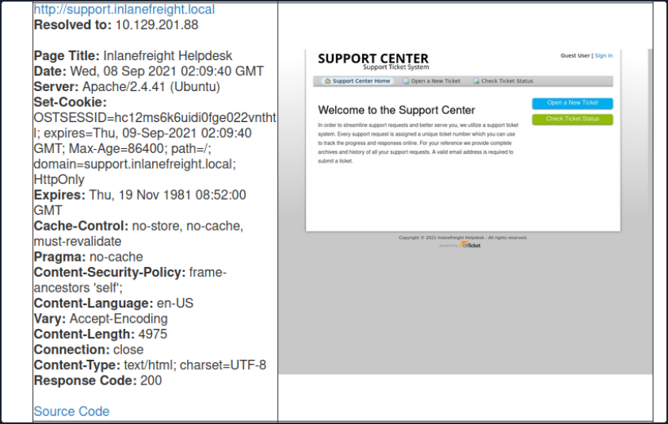
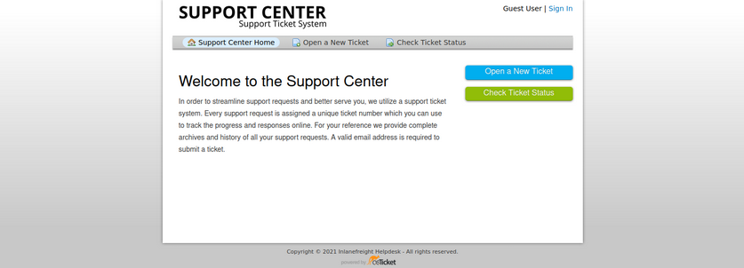
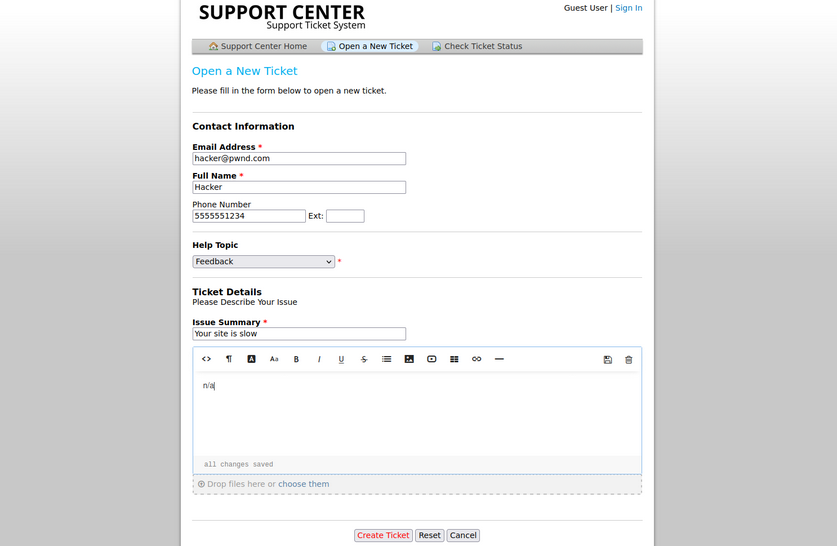
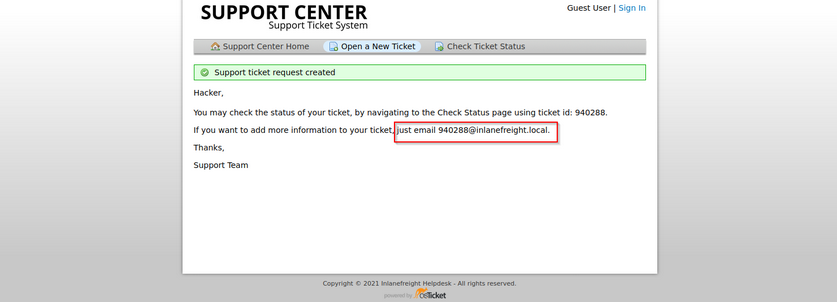
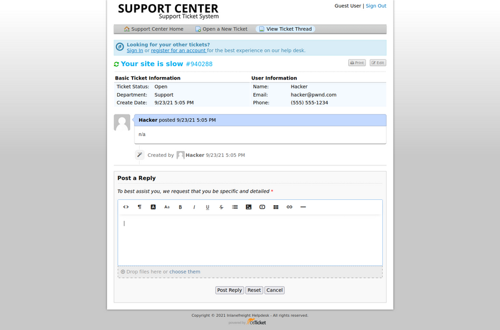
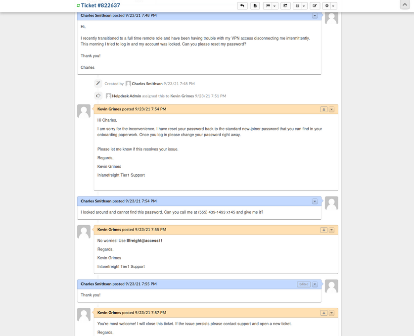

- [Attacking Customer Service / Configuration Management](#attacking-customer-service--configuration-management)
  - [osTicket](#osticket)
    - [Footprinting/Discovery/Enumeration](#footprintingdiscoveryenumeration)
      - [User Input](#user-input)
      - [Processing](#processing)
      - [Solution](#solution)
    - [Attacking osTicket](#attacking-osticket)
      - [osTicket - Sensitive Data Exposure](#osticket---sensitive-data-exposure)

---

# Attacking Customer Service / Configuration Management

## osTicket

... is an open-source support ticketing system. It can be compared to systems such as Jira, OTRS, Request Tracker, and Spiceworks. osTicket can integrate user inquiries from email, phone, and web-based froms into a web interface. osTicket is written in PHP and uses a MySQL backend. It can be installed on Windows or Linux. Though there is not a considerable amount of market information readily available about osTicket, a quick Google search for "Helpdesk software - powered by osTicket" returns about 44,000 results, many of which to be companies, school systems, universities, local government, etc., using the application.

### Footprinting/Discovery/Enumeration

Looking back at your EyeWitness scan from earlier, you notice a screenshot of an osTicket instance which also shows that a cookie named ```OSTSESSID``` was set when visiting the page.



Also, most osTicket installs will showcase the osTicket logo with the phrase "powered by" in front of it in the page's footer. The footer may also contain the words "Support Ticket System".



An Nmap scan will just show information about the webserver, such as Apache or IIS, and will not help you footprint the application.

osTicket is a web application that is highly maintained and serviced. If you look at the CVEs found over decades, you will not find many vulns and exploits that osTicket could have. This is an excellent example to show how important it is to understand how a web application works. Even if the application is not vulnerable, it can still be used for your purpose. Here you can break down the main functions into the layers:

1. User input
2. Processing
3. Solution

#### User Input

The core function of osTicket is to inform the company's employees about a problem so that a problem can be solved with the service or other components. A significant advantage you have here is that the application is open-source. Therefore, you have many tutorials and examples available to take a closer look at the application. For instance, from the osTicket documentation, you can see that only staff and users with administrator privileges can access the admin panel. So if your target company uses this or a similar application, you can cause a problem and "play dumb" and contact the company's staff. The simulated "lack of" knowledge about the services offered by the company in combination with a technical problem is widespread social engineering approach to get more information from the company.

#### Processing

As staff or administrators, they try to reproduce significant errors to find the core of the problem. Processing is finally done internally in an isolated environment that will have very similar settings to the systems in production. Suppose staff and administrators suspect that there is an internal bug that may be affecting the business. In that case, they will go into more detail to uncover possible code errors and address more significant issues.

#### Solution

Depending on the depth of the problem, it is very likely that other staff members from the technical departments will be involved in the email correspondence. This will give you new email addresses to use against the osTicket admin panel and potential usernames with which you can perform OSINT on or try to apply to other company services.

### Attacking osTicket

A search for osTicket on exploit-db shows various various issues, including remote file inclusion, SQLi, arbitrary file upload, XSS, etc. osTicket version 1.14.1 suffers from CVE-2020-24881 which was an SSRF vuln. If exploited, this type of flaw may be leveraged to gain access to internal resources or perform internal port scanning.

Aside from web application-related vulns, support portals can sometimes be used to obtain an email address for a company domain, which can be used to sign up for other exposed applications requiring an email verification to be sent.

Suppose you find an exposed service such as a company's Slack server or GitLab, which requires a valid company email address to join. Many companies have a support email such as support@inlanefreight.local, and emails sent to this are available in online support portals that may range from Zendesk to an internal custom tool. Furthermore, a support portal may assign a temporary internal email address to a new ticket so users can quickly check its status.

If you come across a customer support portal during your assessment and can submit a new ticket, you may be able to obtain a valid company email adress.



This is a modified version of osTicket as an example, but you can see that an email address was provided.



Now, if you log in, you can see information about the ticket and ways to post a reply. If the company set up their helpdesk software to correlate ticket numbers with emails, then any email sent to the email you received when registering, ```940288@inlanefreight.local```, would show up here. With this setup, if you can find an external portal such as a Wiki, chat service, or a Git repo such as GitLab or Bitbucket, you may be able to use this email to register an account and the help desk support portal to receive a sign-up confirmation email.



#### osTicket - Sensitive Data Exposure

Say you are on an external pentest. During your OSINT and information gathering, you discover several user creds using the tool [Dehashed](http://dehashed.com/).

```bash
d41y@htb[/htb]$ sudo python3 dehashed.py -q inlanefreight.local -p

id : 5996447501
email : julie.clayton@inlanefreight.local
username : jclayton
password : JulieC8765!
hashed_password : 
name : Julie Clayton
vin : 
address : 
phone : 
database_name : ModBSolutions


id : 7344467234
email : kevin@inlanefreight.local
username : kgrimes
password : Fish1ng_s3ason!
hashed_password : 
name : Kevin Grimes
vin : 
address : 
phone : 
database_name : MyFitnessPal

<SNIP>
```

This dump shows cleartext passwords for two different users ```jclayton``` and ```kgrimes```. At this point, you have also performed subdomain enumeration and come across interesting ones.

```bash
d41y@htb[/htb]$ cat ilfreight_subdomains

vpn.inlanefreight.local
support.inlanefreight.local
ns1.inlanefreight.local
mail.inlanefreight.local
apps.inlanefreight.local
ftp.inlanefreight.local
dev.inlanefreight.local
ir.inlanefreight.local
auth.inlanefreight.local
careers.inlanefreight.local
portal-stage.inlanefreight.local
dns1.inlanefreight.local
dns2.inlanefreight.local
meet.inlanefreight.local
portal-test.inlanefreight.local
home.inlanefreight.local
legacy.inlanefreight.local
```

You browse to each subdomain and find many are defunct, but the ```support.inlanefreight.local``` and ```vpn.inlanefreight.local``` are active and very promising. ```support.inlanefreight.local``` is hosting an osTicket instance, and ```vpn.inlanefreight.local``` is a Barracuda SSL VPN web portal that does not appear to be using multi-factor authentication.

Trying ```kevin@inlanefreight.local``` gets you a successful login.

The user kevin appears to be a support agent but does not have any open tickets. Perhaps they are not longer active? In a busy enterprise, you would expect to see some open tickets. Digging around a bit, you find one closed ticket, a conversation between a remote employee and the support agent.



The employee states that they were locked out of their VPN account and asks the agent to reset it. The agent then tells the user that the password was reset to the standard new joiner password. The user does not have this password and asks the agent to call them to provide them with the password. The agent then commits an error and sends the password to the user directly via the portal. From here, you could try this password against the exposed VPN portal as the user may not have changed it.

Furthermore, the support agent states that this is the standard password given to new joiners and sets the user's password to this value. You may have been in many organizations where the helpdesk uses a standard password for new users and password resets. Often the domain password policy is lax and does not force the user to change at the next login. If this is the case, it may work for other users.

Many applications such as osTicket also contain an address book. It would also be worth exporting all emails/usernames from the address book as part of your enumeration as they could also prove helpful in an attack such as password spraying.