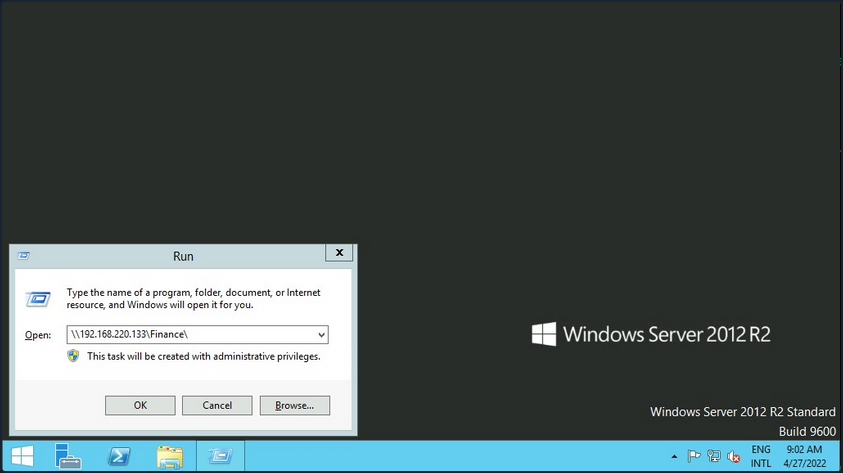
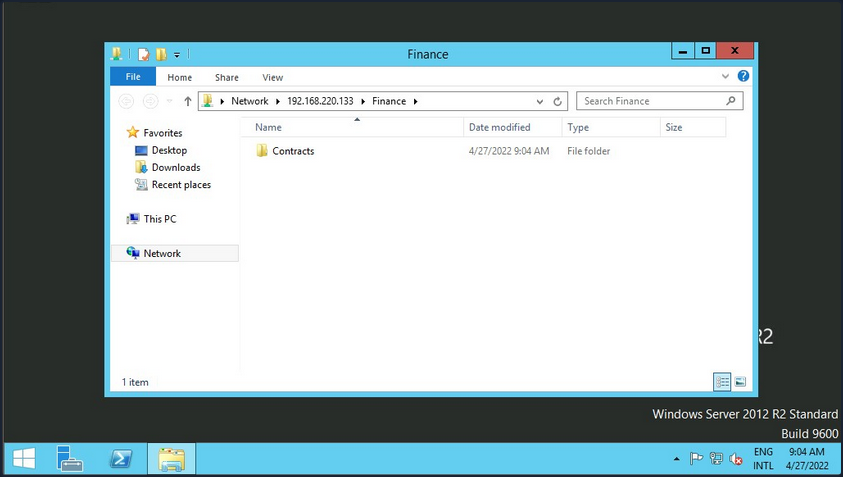
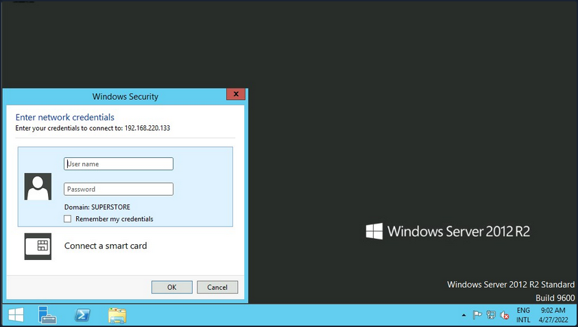
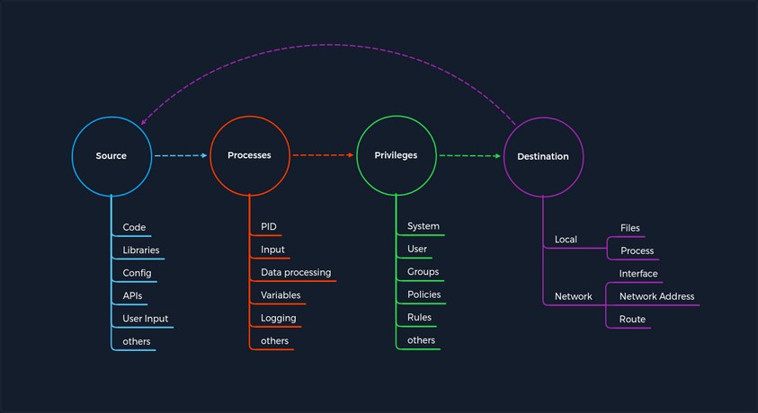

- [Attacking Common Services Fundamentals](#attacking-common-services-fundamentals)
  - [Interacting with Common Services](#interacting-with-common-services)
    - [File Share Services](#file-share-services)
      - [SMB](#smb)
        - [Windows](#windows)
          - [Command Shell](#command-shell)
          - [PowerShell](#powershell)
        - [Linux](#linux)
    - [Other Services](#other-services)
      - [Email](#email)
      - [Databases](#databases)
        - [Command Line Utilities](#command-line-utilities)
          - [MSSQL](#mssql)
          - [MySQL](#mysql)
          - [GUI App](#gui-app)
      - [Tools](#tools)
          - [Tools to Interact with Common Services](#tools-to-interact-with-common-services)
  - [Concept of Attacks](#concept-of-attacks)
  - [Service Misconfigurations](#service-misconfigurations)
    - [Authentication](#authentication)
      - [Anonymous Authentication](#anonymous-authentication)
      - [Misconfigured Access Rights](#misconfigured-access-rights)
    - [Unnecessary Defaults](#unnecessary-defaults)
    - [Preventing Misconfigurations](#preventing-misconfigurations)

---

# Attacking Common Services Fundamentals

## Interacting with Common Services

### File Share Services

A file share service is a type of service that provides, mediates, and monitors the transfer of computer files. Years ago, business commonly used only internal services for file sharing, such as SMB, NFS, FTP, TFTP, SFTP, but as cloud adoption grows, most companies now also have third-party cloud services such as Dropbox, Google Drive, OneDrive, SharePoint, or other forms of file storage such as AWS S3, Azure Blob Storage, or Google Cloud Storage.

#### SMB

##### Windows

There are different ways you can interact with a shared folder using Windows. On Windows GUI, you can press ```[WINKEY] + [R]``` to open the Run dialog box and type the file share location, e. g.: ```\\192.168.220.129\Finance\```.



Suppose the shared folder allows anonymous authentication, or you are authenticated with a user who has privilege over that shared folder. In that case, you will not receive any form of authentication request, and it will display the content of the shared folder.



If you do not have access, you will receive an authentication request.



Windows has two command-line shells: the Command shell and PowerShell. Each shell is a software program that provides direct communication between you and the OS or application, providing an environment to automate IT operations.

###### Command Shell

```
C:\htb> dir \\192.168.220.129\Finance\

Volume in drive \\192.168.220.129\Finance has no label.
Volume Serial Number is ABCD-EFAA

Directory of \\192.168.220.129\Finance

02/23/2022  11:35 AM    <DIR>          Contracts
               0 File(s)          4,096 bytes
               1 Dir(s)  15,207,469,056 bytes free
```

The command ```net use``` connects a computer to or disconnects a computer from a shared resource or displays information about computer connections. You can connect to a file share with the following command and map its content to the drive letter ```n```.

```
C:\htb> net use n: \\192.168.220.129\Finance

The command completed successfully.
```

You can also provide a username and password to authenticate to the share.

```
C:\htb> net use n: \\192.168.220.129\Finance /user:plaintext Password123

The command completed successfully.
```

With the shared folder mapped as the ```n``` drive, you can execute Windows commands as if this shared folder is on your local computer. To find how many files the shared folder and its subdirectories contain:

```
C:\htb> dir n: /a-d /s /b | find /c ":\"

29302

# n: = directory or drive to search
# /a-d = attribute and not directories
# /s = displays files in a specific directory and all subdirectories
# /b = uses bare format
```

With ```dir``` you can search for specific names in files such as:

- cred
- password
- users
- secrets
- key
- common file extensions

```
C:\htb>dir n:\*cred* /s /b

n:\Contracts\private\credentials.txt


C:\htb>dir n:\*secret* /s /b

n:\Contracts\private\secret.txt
```

If you want to search for a specific word within a text file, you can use ```findstr```.

```
c:\htb>findstr /s /i cred n:\*.*

n:\Contracts\private\secret.txt:file with all credentials
n:\Contracts\private\credentials.txt:admin:SecureCredentials!
```

###### PowerShell

PowerShell was designed to extend the capabilities of the Command shell to run PowerShell commands called cmdlets. Cmdlets are similar to Windows commands but provide a more extensible scripting language. You can run both Windows commands and PowerShell cmdlets in PowerShell, but the Command shell can only run Windows commands and not PowerShell cmdlets.

```powershell
PS C:\htb> Get-ChildItem \\192.168.220.129\Finance\

    Directory: \\192.168.220.129\Finance

Mode                 LastWriteTime         Length Name
----                 -------------         ------ ----
d-----         2/23/2022   3:27 PM                Contracts
```

Instead of ```net use```, you can use ```New-PSDrive``` in PowerShell.

```powershell
PS C:\htb> New-PSDrive -Name "N" -Root "\\192.168.220.129\Finance" -PSProvider "FileSystem"

Name           Used (GB)     Free (GB) Provider      Root                                               CurrentLocation
----           ---------     --------- --------      ----                                               ---------------
N                                      FileSystem    \\192.168.220.129\Finance
```

To provide a username and password with PowerShell, you need to create a PSCredential object. It offers a centralized way to manage usernames, passwords, and credentials.

```powershell
PS C:\htb> $username = 'plaintext'
PS C:\htb> $password = 'Password123'
PS C:\htb> $secpassword = ConvertTo-SecureString $password -AsPlainText -Force
PS C:\htb> $cred = New-Object System.Management.Automation.PSCredential $username, $secpassword
PS C:\htb> New-PSDrive -Name "N" -Root "\\192.168.220.129\Finance" -PSProvider "FileSystem" -Credential $cred

Name           Used (GB)     Free (GB) Provider      Root                                                              CurrentLocation
----           ---------     --------- --------      ----                                                              ---------------
N                                      FileSystem    \\192.168.220.129\Finance
```

In PowerShell, you can use the command ```Get-ChildItem``` or the short variant ```gci``` instead of the command ```dir```.

```powershell
PS C:\htb> N:
PS N:\> (Get-ChildItem -File -Recurse | Measure-Object).Count

29302
```

You can use the property ```-Include``` to find specific items from the directory specified by the Path parameter.

```powershell
PS C:\htb> Get-ChildItem -Recurse -Path N:\ -Include *cred* -File

    Directory: N:\Contracts\private

Mode                 LastWriteTime         Length Name
----                 -------------         ------ ----
-a----         2/23/2022   4:36 PM             25 credentials.txt
```

The ```Select-String``` cmdlet uses regular expression matching to search for text patterns in input strings and files. You can use ```Select-String``` simila to grep in UNIX or ```findstr.exe``` in Windows.

```powershell
PS C:\htb> Get-ChildItem -Recurse -Path N:\ | Select-String "cred" -List

N:\Contracts\private\secret.txt:1:file with all credentials
N:\Contracts\private\credentials.txt:1:admin:SecureCredentials!
```

CLI enables IT operations to automate routine tasks like user account management, nightly backups, or interaction with many files. You can perform operations more efficiently by using scripts than the user interface or GUI.

##### Linux

Linux can also be used to browse and mount SMB shares. Note that this can be done whether the target server is a Windows machine or a Samba server.

```bash
d41y@htb[/htb]$ sudo mkdir /mnt/Finance
d41y@htb[/htb]$ sudo mount -t cifs -o username=plaintext,password=Password123,domain=. //192.168.220.129/Finance /mnt/Finance
```

As an alternative, you can use a credential file.

```bash
d41y@htb[/htb]$ mount -t cifs //192.168.220.129/Finance /mnt/Finance -o credentials=/path/credentialfile
```

The file ```credentialfile``` has to be structured like this:

```bash
username=plaintext
password=Password123
domain=.
```

Once a shared folder is mounted, you can use common Linux tools such as ```find``` or ```grep``` to interact with the file structure.

```bash
d41y@htb[/htb]$ find /mnt/Finance/ -name *cred*

/mnt/Finance/Contracts/private/credentials.txt
```

Next, find files that contain the string ```cred```:

```bash
d41y@htb[/htb]$ grep -rn /mnt/Finance/ -ie cred

/mnt/Finance/Contracts/private/credentials.txt:1:admin:SecureCredentials!
/mnt/Finance/Contracts/private/secret.txt:1:file with all credentials
```

### Other Services

#### Email

You typically need two protocols to send and receive messages, one for sending and another for receiving. The SMTP is an email delivery protocol used to send mail over the internet. Likewise, a supporting protocol must be used to retrieve an email from a service. There are two main protocols you can use POP3 and IMAP.

You can use a mail client such as Evolution, the official personal information manager, and mail client for the GNOME Desktop Environment. You can interact with an email server to send or receive messages with a mail client.

You can use the domain name or IP address of the mail server. If the server uses SMTPS or IMAPS, you'll need the appropriate encryption method. You can use the ```Check for Supported Types``` option under authentication to confirm if the server supports your selected method.

#### Databases

... are typically used in enterprise, and most companies use them to store and manage information. There are different types of databases, such as hierarchical databases, NoSQL databases, and SQL relational databases.

##### Command Line Utilities

###### MSSQL

To interact with MSSQL with Linux you can use sqsh or sqlcmd if you are using Windows. Sqsh is much more than a friendly prompt. It is intended to provide much of the functionality provided by a command shell, such as variables, aliasing, redirection, pipes, back-grounding, job control, history, command substitution, and dynamic config. You can start an interactive SQL session as follows:

```bash
d41y@htb[/htb]$ sqsh -S 10.129.20.13 -U username -P Password123
```

The sqlcmd utility lets you enter Transact-SQL statements, system procedures, and script files through a variety of available modes:

- at the command prompt
- in query editor in SQLCMD mode
- in a Windows script file
- in an OS job step of a SQL Server Agent job

```
C:\htb> sqlcmd -S 10.129.20.13 -U username -P Password123
```

###### MySQL

To interact with MySQL, you can use MySQL binaries for Linux or Windows. MySQL comes preinstalled on some Linux distros. Start an interactive SQL session using Linux:

```bash
d41y@htb[/htb]$ mysql -u username -pPassword123 -h 10.129.20.13
```

You can easily an interactive SQL session using Windows:

```
C:\htb> mysql.exe -u username -pPassword123 -h 10.129.20.13
```

###### GUI App

Database engines commonly have their own GUI app. MySQL has [MySQL Workbench](https://dev.mysql.com/downloads/workbench/) and MSSQL has [SQL Server Management Studio or SMSS](https://docs.microsoft.com/en-us/sql/ssms/download-sql-server-management-studio-ssms), you can install those tools in your attack host and connect to the database. SSMS is only supported in Windows. An alternative is to use community tools such as [dbeaver](https://github.com/dbeaver/dbeaver). Dbeaver is multi-platform database tool for Linux, macOS, and Windows that supports connecting to multiple database engines such as MSSQL, MySQL, PostgreSQL, among others, making it easy for you, an attacker, to interact with common database servers.

To start the app use:

```bash
d41y@htb[/htb]$ dbeaver &
```

To connect to a database, you will need a set of credentials, the target IP and port number of the database, and the database engine you are trying to connect to.

Once you have access to the database using a command-line utility or a GUI app, you can use common Transact-SQL statements to enumerate databases and tables containing sensitive information such as usernames and passwords. If you have the correct privileges, you could potentially execute commands as the MSSQL service account.

#### Tools

It is crucial to get familiar with the default command-line utilities available to interact with different services.

###### Tools to Interact with Common Services

| SMB | FTP | Email | Database |
| --- | --- | ----- | -------- |
| smbclient | ftp | Thunderbird | mssql-cli |
| CrackMapExec | lftp | Claws | mycli |
| SMBMap | ncftp | Geary | mssqlclient.py |
| Impacket | filezilla | Mailspring | dbeaver |
| psexec.py | crossftp | mutt | MySQL Workbench |
| smbexec | | mailutils | SQL Server Management Studio or SSMS |
| | | sendEmail | |
| | | swaks | |
| | | sendmail | |

## Concept of Attacks



The concept is based on four categories that occur for each vulnerability. First, you have a Source that performs the specific request to a Process where the vulnerability gets triggered. Each process has a specific set of Privileges with which it is executed. Each process has a task with a specific goal or Destinantion to either compute new data or forward it. However, the individual and unique specifications under these categories may differ from service to service.

Every task and piece of information follows a specific pattern, a cycle, which you have deliberately made linear. This is because the Destination does not always serve as a Source and is therefore not treated as a source of a new task.

For any task to come into existence at all, it needs an idea, information, a planned process for it, and a specific goal to be achieved. Therefore, the category of Privileges is necessary to control information processing appropriately.

## Service Misconfigurations

Misconfigs usually happen when a system admin, technical support, or dev does not correctly configure the security framework of an app, website, or server leading to dangerous open pathways for unauthorized users.

### Authentication

Nowadays, most software asks users to set up credentials upon installation, which is better than default credentials. However, keep in mind that you will still find vendors using default credentials, especially on older applications.

Even when the service does not have a set of default credentials, an admin may use weak passwords or no passwords when setting up services with the idea that they will change the password once the service is set up and running.

As admins, you need to define password policies that apply to software tested or installed in your environment. Admins should be required to comply with a minimum password complexity to avoid user and password combinations that are weak.

Once you grab the service banner, the next step should be to identify possible default credentials. If there are no default credentials, you can try weak username and password combinations.

#### Anonymous Authentication

Another misconfiguration that can exist in common services is anonymous authentication. The service can be configured to allow anonymous authentication, allowing anyone with network connectivity to the service without being prompted for authentication.

#### Misconfigured Access Rights

... are when user accounts have incorrect permissions. The bigger problem could be giving people lower down the chain of command access to private information that only managers or admins should have.

Admins need to plan their access rights strategy, and there are some alternatives such as Role-based access control, Access control lists.

### Unnecessary Defaults

The initial configuration of devices and software may include but is not limited to settings, features, files, and credentials. Those default values are usually aimed at usability rather than security. Leaving it default is not a good security practice for a production environment. Unnecessary defaults are those settings you need to change to secure a system by reducing its attack surface.

### Preventing Misconfigurations

Once you have configured out your environment, the most straightforward strategy to control risk is to lock down the most critical infrastructure and only allow desired behavior. Any communcation that is not required by the program should be disabled. This may include things like:

- admin interfaces should be disabled
- debugging is turned off
- disable the use of default usernames and passwords
- set up the server to prevent unauthorized access, directory listing, and other issues
- run scans and audits regularly to help discover future misconfigurations or missing fixes