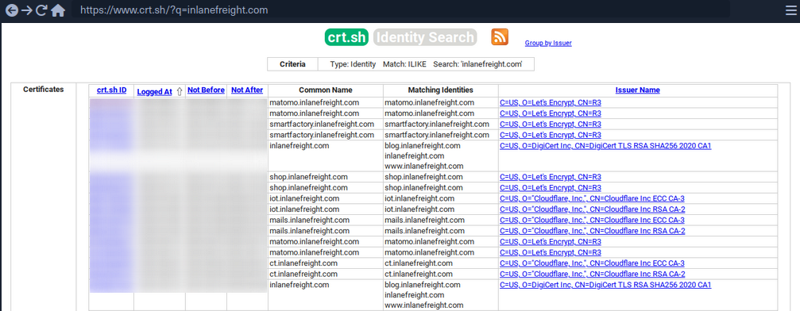
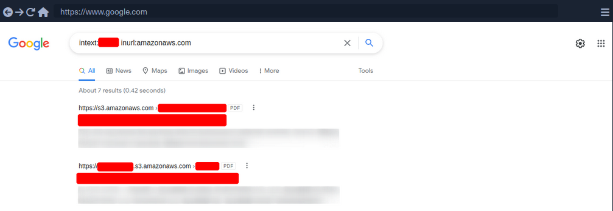

- [Footprinting](#footprinting)
  - [Methodology](#methodology)
    - [Layers](#layers)
      - [1 - Internet Presence](#1---internet-presence)
      - [2 - Gateway](#2---gateway)
      - [3 - Accessible Services](#3---accessible-services)
      - [4 - Processes](#4---processes)
      - [5 - Privileges](#5---privileges)
      - [6 - OS Setup](#6---os-setup)
  - [Infrastructure-Based Enumeration](#infrastructure-based-enumeration)
    - [Domain Information](#domain-information)
      - [Certificate Transparency](#certificate-transparency)
      - [Company Hosted Servers](#company-hosted-servers)
      - [Shodan - IP List](#shodan---ip-list)
      - [DNS Records](#dns-records)
    - [Cloud Resources](#cloud-resources)
      - [Company Hosted Servers](#company-hosted-servers-1)
        - [Google Search for AWS](#google-search-for-aws)
        - [Google Search for Azure](#google-search-for-azure)
      - [Domain.Glass](#domainglass)
      - [GrayHatWarfare](#grayhatwarfare)
    - [Staff](#staff)
      - [Job Post](#job-post)
  - [Host-Based Enumeration](#host-based-enumeration)
    - [File Transfer Protocol (_FTP_)](#file-transfer-protocol-ftp)
      - [Trivial File Transfer Protocl (_TFTP_)](#trivial-file-transfer-protocl-tftp)
    - [Enum - FTP](#enum---ftp)
      - [Nmap](#nmap)
      - [Nmap FTP Scripts](#nmap-ftp-scripts)
      - [Nmap Script Trace](#nmap-script-trace)
      - [Service Interaction](#service-interaction)
    - [Server Message Block (_SMB_)](#server-message-block-smb)
      - [Samba](#samba)
    - [Enum - SMB](#enum---smb)
      - [Nmap](#nmap-1)
      - [RPC](#rpc)
      - [RPCclient](#rpcclient)
      - [Impacket](#impacket)
      - [SMBmap](#smbmap)
      - [CrackMapExec](#crackmapexec)
      - [Enum4Linux-ng](#enum4linux-ng)
    - [Network File System (_NFS_)](#network-file-system-nfs)
    - [Enum - NFS](#enum---nfs)
      - [Nmap](#nmap-2)
      - [Show Shares, Mounting, List Content, Unmounting](#show-shares-mounting-list-content-unmounting)
    - [Domain Name System (_DNS_)](#domain-name-system-dns)
    - [Enum - DNS](#enum---dns)
      - [dig - ns](#dig---ns)
      - [dig - version](#dig---version)
      - [dig - any](#dig---any)
      - [dig - zone transfer](#dig---zone-transfer)
      - [Subdomain Brute Forcing](#subdomain-brute-forcing)
    - [Simple Mail Transfer Protocol (_SMTP_)](#simple-mail-transfer-protocol-smtp)
    - [Enum - SMTP](#enum---smtp)
      - [Nmap](#nmap-3)

---

# Footprinting

## Methodology

The whole enumeration process can be divided into three different levels:

- Infrastructure-based enumeration
- Host-based enumeration
- OS-based enumeration

Which can be separated into layers:

| Level | Layer | Description | Information Categories |
| ----- | ----- | ----------- | ---------------------- |
| Infrastructure | Internet Presence | identification of internet presence and externally accessible infrastructure | Domains, Subdomains, vHosts, Netblocks, IP Addresses, Cloud Instances, Security Measures |
| | Gateway | identify the possible measures to protect the company's external and internal infrastructure | Firewall, DMZ, IPS/IDS, Proxies, NAC, Network Segmentation, VPN, Cloudflare |
| Host | Accessible Services | identify accessible interfaces and services that are hosted externally or internally | Service Type, Functionality, Configuration, Port, Version, Interface |
| | Processes | identify the internal processes, sources, and destinations associated with the service | PID, Processed Data, Tasks, Source, Destination |
| OS | Privileges | identification of the internal permissions and privileges to the accessible services | Groups, Users, Permissions, Restrictions, Environment |
| | OS Setup | identification of the internal components and systems setup | OS Type, Patch Level, Network Config, OS Environment, Configuration Files, sensitive private Files |

### Layers

#### 1 - Internet Presence

The first layer you have to pass. Focus is on finding the targets you can investigate. If the scope in the contract allows you to look for additional hosts, this layer is even more critical than for fixed targets only. In this layer, you use different techniques to find domains, subdomains, netblocks, and many other components and information that present the presence of the company and its infrastructure on the internet.

_The goal of this layer is to identify all possible target systems and interfaces that can be tested._

#### 2 - Gateway

Here you try to understand the interface of the reachable target, how it is protected, and where it is located in the network.

_The goal is to understand what you are dealing with and what you have to watch out for._

#### 3 - Accessible Services

In the case of accessible services, you examine each destination for all the services it offers. Each of these services has a specific purpose that has been installed for a particular reason by the administrator. Each service has certain functions, which therefore also lead to specific results.

_This layer aims to understand the reason and functionality of the target sytem and gain the necessary knowledge to communicate with it and exploit it for your purposes effectively._

#### 4 - Processes

Every time a command of function is executed, data is processed, whether entered by the user or generated by the system. This starts a process that has to perform specific tasks, and such tasks have at least one source and one target.

_The goal here is to understand these factors and identify the dependencies between them._

#### 5 - Privileges

Each service runs through a specific user in a particular group with permissions and privileges defined by the administrator or the system. These privileges often provide you with functions that administrators overlook. This often happens in AD infrastructures and many other case-specific administration environments and servers where users are responsible for multiple administration areas.

_It is crucial to identify these and understand what is and is not possible with these privileges._

#### 6 - OS Setup

Here you collect information about the actual OS and its setup using internal access. This gives you a good overview of the internal security of the systems and reflects the skills and capabilities of the company's administrative teams.

_The goal here is to see how the administrators manage the systems and what sensitive internal information you can glean from them._

## Infrastructure-Based Enumeration

### Domain Information

... is a core component of any pentest, and it is not just about the subdomains but about the entire presence on the internet. Therefore, you gather information and try to understand the company's functionality and which technologies and structures are necessary for services to be offered successfully and efficiently.

This type of information is gathered passively without direct and active scans.

However, when passively gathering information, you can use third-party services to understand the company better. The first thing you should do is scrutinize the company's main website. Then, you should read through the texts, keeping in mind what technologies and structures are needed for these services.

Once you have a basic understanding of the company and its services, you can get a first impression of its presence on the internet.

#### Certificate Transparency

The first point of presence on the internet may be the SSL certificate from the company's main website that you can examine. Often, such a certificate includes more than just a subdomain, and this means that the certificate is used for several domains, and these are most likely still active.


Another source to find more subdomains is [crt.sh](https://crt.sh/). This source is Certificate Transparency logs. Certificate Transparency is a process that is intended to enable the verification of issued digital certificates for encrypted internet connections. The standard (_RFC 6962_) provides for the logging of all digital certificates issued by a certificate authority in audit-proof logs. This is intended to enable the detection of false or maliciously issued certificates for a domain. SSL certificate providers like Let's Encrypt share this with the web interface of crt.sh, which stores the new entries in the database to be accessed later.



You can also output the results in JSON format:

```bash
d41y@htb[/htb]$ curl -s https://crt.sh/\?q\=inlanefreight.com\&output\=json | jq .

[
  {
    "issuer_ca_id": 23451835427,
    "issuer_name": "C=US, O=Let's Encrypt, CN=R3",
    "common_name": "matomo.inlanefreight.com",
    "name_value": "matomo.inlanefreight.com",
    "id": 50815783237226155,
    "entry_timestamp": "2021-08-21T06:00:17.173",
    "not_before": "2021-08-21T05:00:16",
    "not_after": "2021-11-19T05:00:15",
    "serial_number": "03abe9017d6de5eda90"
  },
  {
    "issuer_ca_id": 6864563267,
    "issuer_name": "C=US, O=Let's Encrypt, CN=R3",
    "common_name": "matomo.inlanefreight.com",
    "name_value": "matomo.inlanefreight.com",
    "id": 5081529377,
    "entry_timestamp": "2021-08-21T06:00:16.932",
    "not_before": "2021-08-21T05:00:16",
    "not_after": "2021-11-19T05:00:15",
    "serial_number": "03abe90104e271c98a90"
  },
  {
    "issuer_ca_id": 113123452,
    "issuer_name": "C=US, O=Let's Encrypt, CN=R3",
    "common_name": "smartfactory.inlanefreight.com",
    "name_value": "smartfactory.inlanefreight.com",
    "id": 4941235512141012357,
    "entry_timestamp": "2021-07-27T00:32:48.071",
    "not_before": "2021-07-26T23:32:47",
    "not_after": "2021-10-24T23:32:45",
    "serial_number": "044bac5fcc4d59329ecbbe9043dd9d5d0878"
  },
  { ... SNIP ...
```

If needed, you can also have them filtered by the unique subdomains:

```bash
d41y@htb[/htb]$ curl -s https://crt.sh/\?q\=inlanefreight.com\&output\=json | jq . | grep name | cut -d":" -f2 | grep -v "CN=" | cut -d'"' -f2 | awk '{gsub(/\\n/,"\n");}1;' | sort -u

account.ttn.inlanefreight.com
blog.inlanefreight.com
bots.inlanefreight.com
console.ttn.inlanefreight.com
ct.inlanefreight.com
data.ttn.inlanefreight.com
*.inlanefreight.com
inlanefreight.com
integrations.ttn.inlanefreight.com
iot.inlanefreight.com
mails.inlanefreight.com
marina.inlanefreight.com
marina-live.inlanefreight.com
matomo.inlanefreight.com
next.inlanefreight.com
noc.ttn.inlanefreight.com
preview.inlanefreight.com
shop.inlanefreight.com
smartfactory.inlanefreight.com
ttn.inlanefreight.com
vx.inlanefreight.com
www.inlanefreight.com
```

Next, you can identify the hosts directly accessible from the internet and not hosted by third-party providers. This is because you are not allowed to test the hosts without the permission of third-party providers.

#### Company Hosted Servers

```bash
d41y@htb[/htb]$ for i in $(cat subdomainlist);do host $i | grep "has address" | grep inlanefreight.com | cut -d" " -f1,4;done

blog.inlanefreight.com 10.129.24.93
inlanefreight.com 10.129.27.33
matomo.inlanefreight.com 10.129.127.22
www.inlanefreight.com 10.129.127.33
s3-website-us-west-2.amazonaws.com 10.129.95.250
```

Once you see which hosts can be investigated further, you can generate a list of IP addresses and run them through Shodan.

#### Shodan - IP List

```bash
d41y@htb[/htb]$ for i in $(cat subdomainlist);do host $i | grep "has address" | grep inlanefreight.com | cut -d" " -f4 >> ip-addresses.txt;done
d41y@htb[/htb]$ for i in $(cat ip-addresses.txt);do shodan host $i;done

10.129.24.93
City:                    Berlin
Country:                 Germany
Organization:            InlaneFreight
Updated:                 2021-09-01T09:02:11.370085
Number of open ports:    2

Ports:
     80/tcp nginx 
    443/tcp nginx 
	
10.129.27.33
City:                    Berlin
Country:                 Germany
Organization:            InlaneFreight
Updated:                 2021-08-30T22:25:31.572717
Number of open ports:    3

Ports:
     22/tcp OpenSSH (7.6p1 Ubuntu-4ubuntu0.3)
     80/tcp nginx 
    443/tcp nginx 
        |-- SSL Versions: -SSLv2, -SSLv3, -TLSv1, -TLSv1.1, -TLSv1.3, TLSv1.2
        |-- Diffie-Hellman Parameters:
                Bits:          2048
                Generator:     2
				
10.129.27.22
City:                    Berlin
Country:                 Germany
Organization:            InlaneFreight
Updated:                 2021-09-01T15:39:55.446281
Number of open ports:    8

Ports:
     25/tcp  
        |-- SSL Versions: -SSLv2, -SSLv3, -TLSv1, -TLSv1.1, TLSv1.2, TLSv1.3
     53/tcp  
     53/udp  
     80/tcp Apache httpd 
     81/tcp Apache httpd 
    110/tcp  
        |-- SSL Versions: -SSLv2, -SSLv3, -TLSv1, -TLSv1.1, TLSv1.2
    111/tcp  
    443/tcp Apache httpd 
        |-- SSL Versions: -SSLv2, -SSLv3, -TLSv1, -TLSv1.1, TLSv1.2, TLSv1.3
        |-- Diffie-Hellman Parameters:
                Bits:          2048
                Generator:     2
                Fingerprint:   RFC3526/Oakley Group 14
    444/tcp  
		
10.129.27.33
City:                    Berlin
Country:                 Germany
Organization:            InlaneFreight
Updated:                 2021-08-30T22:25:31.572717
Number of open ports:    3

Ports:
     22/tcp OpenSSH (7.6p1 Ubuntu-4ubuntu0.3)
     80/tcp nginx 
    443/tcp nginx 
        |-- SSL Versions: -SSLv2, -SSLv3, -TLSv1, -TLSv1.1, -TLSv1.3, TLSv1.2
        |-- Diffie-Hellman Parameters:
                Bits:          2048
                Generator:     2
```

Now, you can display all the available DNS records where you might find more hosts.

#### DNS Records

```bash
d41y@htb[/htb]$ dig any inlanefreight.com

; <<>> DiG 9.16.1-Ubuntu <<>> any inlanefreight.com
;; global options: +cmd
;; Got answer:
;; ->>HEADER<<- opcode: QUERY, status: NOERROR, id: 52058
;; flags: qr rd ra; QUERY: 1, ANSWER: 17, AUTHORITY: 0, ADDITIONAL: 1

;; OPT PSEUDOSECTION:
; EDNS: version: 0, flags:; udp: 65494
;; QUESTION SECTION:
;inlanefreight.com.             IN      ANY

;; ANSWER SECTION:
inlanefreight.com.      300     IN      A       10.129.27.33
inlanefreight.com.      300     IN      A       10.129.95.250
inlanefreight.com.      3600    IN      MX      1 aspmx.l.google.com.
inlanefreight.com.      3600    IN      MX      10 aspmx2.googlemail.com.
inlanefreight.com.      3600    IN      MX      10 aspmx3.googlemail.com.
inlanefreight.com.      3600    IN      MX      5 alt1.aspmx.l.google.com.
inlanefreight.com.      3600    IN      MX      5 alt2.aspmx.l.google.com.
inlanefreight.com.      21600   IN      NS      ns.inwx.net.
inlanefreight.com.      21600   IN      NS      ns2.inwx.net.
inlanefreight.com.      21600   IN      NS      ns3.inwx.eu.
inlanefreight.com.      3600    IN      TXT     "MS=ms92346782372"
inlanefreight.com.      21600   IN      TXT     "atlassian-domain-verification=IJdXMt1rKCy68JFszSdCKVpwPN"
inlanefreight.com.      3600    IN      TXT     "google-site-verification=O7zV5-xFh_jn7JQ31"
inlanefreight.com.      300     IN      TXT     "google-site-verification=bow47-er9LdgoUeah"
inlanefreight.com.      3600    IN      TXT     "google-site-verification=gZsCG-BINLopf4hr2"
inlanefreight.com.      3600    IN      TXT     "logmein-verification-code=87123gff5a479e-61d4325gddkbvc1-b2bnfghfsed1-3c789427sdjirew63fc"
inlanefreight.com.      300     IN      TXT     "v=spf1 include:mailgun.org include:_spf.google.com include:spf.protection.outlook.com include:_spf.atlassian.net ip4:10.129.24.8 ip4:10.129.27.2 ip4:10.72.82.106 ~all"
inlanefreight.com.      21600   IN      SOA     ns.inwx.net. hostmaster.inwx.net. 2021072600 10800 3600 604800 3600

;; Query time: 332 msec
;; SERVER: 127.0.0.53#53(127.0.0.53)
;; WHEN: Mi Sep 01 18:27:22 CEST 2021
;; MSG SIZE  rcvd: 940
```

> [!TIP]
> Always have a look at the complete result of your ```dig```. For example, They txt records from the above snippet helps further enumerating the company, including services used.

### Cloud Resources

The use of cloud is now one of the essential components for many companies nowadays.

Even though cloud providers secure their infrastructure centrall, this does not mean that companies are free from vulnerabilities. The configurations made by the administrators may nevertheless make the company's cloud resources vulnerable. This often starts with the S3 buckets (_AWS_), blobs (_Azure_), cloud storage (_GCP_), which can be accessed without authentication if configured incorrectly.

#### Company Hosted Servers

```bash
d41y@htb[/htb]$ for i in $(cat subdomainlist);do host $i | grep "has address" | grep inlanefreight.com | cut -d" " -f1,4;done

blog.inlanefreight.com 10.129.24.93
inlanefreight.com 10.129.27.33
matomo.inlanefreight.com 10.129.127.22
www.inlanefreight.com 10.129.127.33
s3-website-us-west-2.amazonaws.com 10.129.95.250
```

Often cloud storage is added to the DNS list when used for administrative purposes by other employees. This step makes it much easier for the employees to reach and manage them. ```s3-website-us-west-2.amazonaws.com``` is on example.

However, there are many different ways to find such cloud storage. One of the easiest and most used is Google search combined with Google Dorks. You can use the Google Dorks ```inurl:``` and ```intext:``` to narrow your search to specific terms.

##### Google Search for AWS



##### Google Search for Azure


#### Domain.Glass

Third-party providers such as [https://domain.glass/](https://domain.glass/) can also tell you a lot about the company's infrastructure. As a positive side effect, you can also see that Cloudflare's security assessment status has been classified as "Safe". This means you have already found a security measure that can be noted for the second layer.


#### GrayHatWarfare

Another very useful provider is [GrayHatWarfare](https://buckets.grayhatwarfare.com/). You can do many different searches, discover AWS, Azure, and GCP cloud storage, and even sort and filter by file format. Therefore, once you have found them through Google, you can also search for them on GrayHatWarfare and passively discover what files are stored on the given cloud storage.


Many companies also use abbreviations of the company's name, which are then used accordingly within the IT infrastructure. Such terms are also part of an excellent approach to discovering new cloud storage from the company. You can also search for files simultaneously to see the files that can be accessed at the same time.


Sometimes when employees are overworked or under high pressure, mistakes can be fatal for the entire company. These errors can even lead to SSH private keys being leaked, which anyone can download and log onto one or even more machines in the company without using a password.


### Staff

Searching for and identifying employees on social media platforms can also reveal a lot about the teams' infrastructure and maekup. This, in turn, can lead to you identifying which technologies, programming languages, and even software applications are being used. To a large extent, you will also be able to assess each person's focus based on their skills. The posts and material shared with others are also a great indicator of what the person is currently engaged in and what that person currently feels is important to share with others.

Employees can be identified on various business networks such as LinkedIn or Xing. Job postings from companies can also tell you a lot about their infrastructure and give you clues about what you should be looking for.

#### Job Post

```
* 3-10+ years of experience on professional software development projects.

« An active US Government TS/SCI Security Clearance (current SSBI) or eligibility to obtain TS/SCI within nine months.
« Bachelor's degree in computer science/computer engineering with an engineering/math focus or another equivalent field of discipline.
« Experience with one or more object-oriented languages (e.g., Java, C#, C++).
« Experience with one or more scripting languages (e.g., Python, Ruby, PHP, Perl).
« Experience using SQL databases (e.g., PostgreSQL, MySQL, SQL Server, Oracle).
« Experience using ORM frameworks (e.g., SQLAIchemy, Hibernate, Entity Framework).
« Experience using Web frameworks (e.g., Flask, Django, Spring, ASP.NET MVC).
« Proficient with unit testing and test frameworks (e.g., pytest, JUnit, NUnit, xUnit).
« Service-Oriented Architecture (SOA)/microservices & RESTful API design/implementation.
« Familiar and comfortable with Agile Development Processes.
« Familiar and comfortable with Continuous Integration environments.
« Experience with version control systems (e.g., Git, SVN, Mercurial, Perforce).

Desired Skills/Knowledge/ Experience:

« CompTIA Security+ certification (or equivalent).
« Experience with Atlassian suite (Confluence, Jira, Bitbucket).
« Algorithm Development (e.g., Image Processing algorithms).
« Software security.
« Containerization and container orchestration (Docker, Kubernetes, etc.)
« Redis.
« NumPy.
```

From a job post like this, you can see which programming languages are preferred. It is also required that the applicant is familiar with different databases. In addition, you know that different frameworks are used for web applications development.


People try to make business contacts on social media sites and prove to visitors what skills they bring to the table, which inevitably leads them to sharing with the public what they know and what they have learned so far.

Furthermore, showing projects can, of course, be of great advantage to make new business contacts and possibly even get a new job, but on the other hand, it can lead to mistakes that will be very difficult to fix.

## Host-Based Enumeration

### File Transfer Protocol (_FTP_)

FTP is one of the oldest protocols on the internet. It runs within the application layer of the TCP/IP protocol stack. Thus, it is on the same layer as HTTP or POP. These protocols also work with the support of browsers or email clients to perform their services.

In an FTP connection, two channels are opened. First, the client and server establish a control channel through TCP port 21. The client sends commands to the server, and the server returns status codes. Then both communication participants can establish the data channel via TCP port 20. This channel is used exclusively for data transmission, and the protocol watches for errors during this process. If a connection is broken off during transmission, the transport can be resumed after re-established contact.

A distinction is made between active and passive FTP. In the active variant, the client establishes the connection as described via TCP port 21 and thus informs the server via which client-side port the server can transmit its responses. However, if a firewall protects the client, the server cannot reply because all external connections are blocked. For this purpose, the passive mode has been developed. Here, the server announces a port through which the client can establish the data channel. Since the client initiates the conncetion in this method, the firewall does not block the transfer.

FTP knows different [commands](https://web.archive.org/web/20230326204635/https://www.smartfile.com/blog/the-ultimate-ftp-commands-list/) and [status codes](https://en.wikipedia.org/wiki/List_of_FTP_server_return_codes). Not all of these commands are consistently implemented on the server.

Usually, you need credentials to use FTP on a server. You also need to know that FTP is a clear-text protocol that can sometimes be sniffed if conditions on the network are right. However, there is also the possibility that a server offers anonymous FTP. The server operator then allows any user to upload or download file via FTP without using a password. Since there are security risks associated with such a public FTP server, the options for users are usually limited.

#### Trivial File Transfer Protocl (_TFTP_)

... is simpler than FTP and performs file transfers between client and server processes. However, it does not provide user authentication and other valuable features supported by FTP. In addition, while FTP uses TCP, TFTP uses UDP, making it an unreliable protocol and causing it to use UDP-assissted application layer recovery.

It does not support protected login via passwords and sets limits on access based solely on the read and write permissions of a file in the OS. Practically, this lead to TFTP operating exclusively in directories and with files that have been shared with all users and can be read and written globally. Because of the lack of security, TFTP may only be used in local and protected networks.

### Enum - FTP

#### Nmap

As you already know, the FTP server usually runs on the standard TCP port 21, which you can scan using Nmap.

```bash
d41y@htb[/htb]$ sudo nmap -sV -p21 -sC -A 10.129.14.136

Starting Nmap 7.80 ( https://nmap.org ) at 2021-09-16 18:12 CEST
Nmap scan report for 10.129.14.136
Host is up (0.00013s latency).

PORT   STATE SERVICE VERSION
21/tcp open  ftp     vsftpd 2.0.8 or later
| ftp-anon: Anonymous FTP login allowed (FTP code 230)
| -rwxrwxrwx    1 ftp      ftp       8138592 Sep 16 17:24 Calendar.pptx [NSE: writeable]
| drwxrwxrwx    4 ftp      ftp          4096 Sep 16 17:57 Clients [NSE: writeable]
| drwxrwxrwx    2 ftp      ftp          4096 Sep 16 18:05 Documents [NSE: writeable]
| drwxrwxrwx    2 ftp      ftp          4096 Sep 16 17:24 Employees [NSE: writeable]
| -rwxrwxrwx    1 ftp      ftp            41 Sep 16 17:24 Important Notes.txt [NSE: writeable]
|_-rwxrwxrwx    1 ftp      ftp             0 Sep 15 14:57 testupload.txt [NSE: writeable]
| ftp-syst: 
|   STAT: 
| FTP server status:
|      Connected to 10.10.14.4
|      Logged in as ftp
|      TYPE: ASCII
|      No session bandwidth limit
|      Session timeout in seconds is 300
|      Control connection is plain text
|      Data connections will be plain text
|      At session startup, client count was 2
|      vsFTPd 3.0.3 - secure, fast, stable
|_End of status
```

#### Nmap FTP Scripts

```bash
d41y@htb[/htb]$ sudo nmap --script-updatedb

Starting Nmap 7.80 ( https://nmap.org ) at 2021-09-19 13:49 CEST
NSE: Updating rule database.
NSE: Script Database updated successfully.
Nmap done: 0 IP addresses (0 hosts up) scanned in 0.28 seconds
```

To find all Nmap FTP NSE scripts:

```bash
d41y@htb[/htb]$ find / -type f -name ftp* 2>/dev/null | grep scripts

/usr/share/nmap/scripts/ftp-syst.nse
/usr/share/nmap/scripts/ftp-vsftpd-backdoor.nse
/usr/share/nmap/scripts/ftp-vuln-cve2010-4221.nse
/usr/share/nmap/scripts/ftp-proftpd-backdoor.nse
/usr/share/nmap/scripts/ftp-bounce.nse
/usr/share/nmap/scripts/ftp-libopie.nse
/usr/share/nmap/scripts/ftp-anon.nse
/usr/share/nmap/scripts/ftp-brute.nse
```

#### Nmap Script Trace

Nmap provides the ability to trace the progress of NSE scripts at the network level if you use the ```--script-trace``` option in your scans. This lets you see what commands Nmap sends, what ports are used, and what responses you receive from the scanned server.

```bash
d41y@htb[/htb]$ sudo nmap -sV -p21 -sC -A 10.129.14.136 --script-trace

Starting Nmap 7.80 ( https://nmap.org ) at 2021-09-19 13:54 CEST                                                                                                                                                   
NSOCK INFO [11.4640s] nsock_trace_handler_callback(): Callback: CONNECT SUCCESS for EID 8 [10.129.14.136:21]                                   
NSOCK INFO [11.4640s] nsock_trace_handler_callback(): Callback: CONNECT SUCCESS for EID 16 [10.129.14.136:21]             
NSOCK INFO [11.4640s] nsock_trace_handler_callback(): Callback: CONNECT SUCCESS for EID 24 [10.129.14.136:21]
NSOCK INFO [11.4640s] nsock_trace_handler_callback(): Callback: CONNECT SUCCESS for EID 32 [10.129.14.136:21]
NSOCK INFO [11.4640s] nsock_read(): Read request from IOD #1 [10.129.14.136:21] (timeout: 7000ms) EID 42
NSOCK INFO [11.4640s] nsock_read(): Read request from IOD #2 [10.129.14.136:21] (timeout: 9000ms) EID 50
NSOCK INFO [11.4640s] nsock_read(): Read request from IOD #3 [10.129.14.136:21] (timeout: 7000ms) EID 58
NSOCK INFO [11.4640s] nsock_read(): Read request from IOD #4 [10.129.14.136:21] (timeout: 11000ms) EID 66
NSE: TCP 10.10.14.4:54226 > 10.129.14.136:21 | CONNECT
NSE: TCP 10.10.14.4:54228 > 10.129.14.136:21 | CONNECT
NSE: TCP 10.10.14.4:54230 > 10.129.14.136:21 | CONNECT
NSE: TCP 10.10.14.4:54232 > 10.129.14.136:21 | CONNECT
NSOCK INFO [11.4660s] nsock_trace_handler_callback(): Callback: READ SUCCESS for EID 50 [10.129.14.136:21] (41 bytes): 220 Welcome to HTB-Academy FTP service...
NSOCK INFO [11.4660s] nsock_trace_handler_callback(): Callback: READ SUCCESS for EID 58 [10.129.14.136:21] (41 bytes): 220 Welcome to HTB-Academy FTP service...
NSE: TCP 10.10.14.4:54228 < 10.129.14.136:21 | 220 Welcome to HTB-Academy FTP service.
```

The scan history shows that four different parallel scans are running against the service, with various timeouts. For the NSE scripts, you see that your local machine uses other ports and first initiates the connection with the ```CONNECT``` command. From the first response from the server, you can see that you are receiving the banner from the server to you second NSE script from the target FTP server.

#### Service Interaction

```bash
d41y@htb[/htb]$ nc -nv 10.129.14.136 21
```

... or:

```bash
d41y@htb[/htb]$ telnet 10.129.14.136 21
```

It looks slightly different if the FTP server runs with TLS/SSL encryption. Because then you need a client that can handle TLS/SSL. For this you can use the client ```openssl``` and communicate with the FTP server. The good thing about using openssl is that you can see the SSL certificate which can also be helpful.

```bash
d41y@htb[/htb]$ openssl s_client -connect 10.129.14.136:21 -starttls ftp

CONNECTED(00000003)                                                                                      
Can't use SSL_get_servername                        
depth=0 C = US, ST = California, L = Sacramento, O = Inlanefreight, OU = Dev, CN = master.inlanefreight.htb, emailAddress = admin@inlanefreight.htb
verify error:num=18:self signed certificate
verify return:1

depth=0 C = US, ST = California, L = Sacramento, O = Inlanefreight, OU = Dev, CN = master.inlanefreight.htb, emailAddress = admin@inlanefreight.htb
verify return:1
---                                                 
Certificate chain
 0 s:C = US, ST = California, L = Sacramento, O = Inlanefreight, OU = Dev, CN = master.inlanefreight.htb, emailAddress = admin@inlanefreight.htb
 
 i:C = US, ST = California, L = Sacramento, O = Inlanefreight, OU = Dev, CN = master.inlanefreight.htb, emailAddress = admin@inlanefreight.htb
---
 
Server certificate

-----BEGIN CERTIFICATE-----

MIIENTCCAx2gAwIBAgIUD+SlFZAWzX5yLs2q3ZcfdsRQqMYwDQYJKoZIhvcNAQEL
...SNIP...
```

This is because the SSL certificate allows you to recognize the hostname, for example, and in most cases also an email address for the organization or company. In addition, if the company has several locations worldwide, certificates can also be created for specific locations, which can also be identified usnig the SSL certificate.

### Server Message Block (_SMB_)

... is a client-server protocol that regulates access to files and entire directories and other network resources such as printers, routers, or interfaces released for the network. Information exchange between different system processes can also be handled based on the SMB protocol. SMB first became available to a broader public, for example, as part of the OS/2 network OS LAN Manager and LAN Server. Since then, the main application are of the protocol has been the Windows OS series in particular, whose network services support SMB in a downward-compatible manner - which means that devices with newer editions can easily communicate with devices that have an older Microsoft OS installed. With the free software project Samba, there is also a solution that enables the use of SMB in Linux and Unix distros and thus cross-platform communications via SMB.

The SMB protocol enables the client to communicate with other participants in the same network to access files or services shared with it on the network. The other system must also have implemented the network protocol and received and processed the client request using an SMB server application. Before that, however, both parties must establish a connection, which is why they first exchange corresponding messages.

In IP networks, SMB uses TCP protocol for this purpose, which provides for a three-way handshake between client and server before a connection is finally established. The specifications of the TCP protocol also govern the subsequent transport of data.

An SMB server can provide arbitrary parts of its local file systems as shares. Therefore the hierarchy visible to a client is partially independent of the structure on the server. Access rights are defined by ACL. They can be controlled in a fine-grained manner based on attributes such as execute, read, and full access for individual users or user groups. The ACLs are defined based on the shares and therefore do not correspond to the rights assigned locally on the server.

#### Samba

There is an alternative implementation of the SMB server called Samba, which is developed for Unix-based OS. Samba implements the Common Internet File System (_CIFS_) network protocol. CIFS is a dialect of SMB, meaning it is a specific implementation of the SMB protocol originally created by Microsoft. This allows Samba to communicate effectively with newer Windows systems. Therefore, it is often referred to as SMB/CIFS.

However, CIFS is considered a specific version of SMB protocol, primarily aligning with SMB version 1. When SMB commands are transmitted over Samba to an older NetBIOS service, connections typically occur over TCP ports 137, 138, and 139. In contrast, CIFS operates over TCP port 445 exclusively. There are several versions of SMB, including newer versions like SMB 2, and SMB 3, which offer improvements and are preffered in modern infrastructures, while oder versions like SMB 1 are considered outdated but may still be used in specific environments.

With version 3, the Samba server gained the ability to be a full member of an AD. With version 4, Samba even provides an AD DC. It contains several so-called daemons for this purpose - which are Unix background programs. The SMB server daemon (_smbd_) belonging to Samba provides the first two functionalities, while the NetBIOS message block daemon (_nmbd_) implements the last two functionalities. The SMB service controls these two background programs.

You know that Samba is suitable for both Linux and Windows systems. In a network, each host participates in the same workgroup. A workgroup is a group name that identifies an arbitrary collection of computers and their resources on an SMB network. There can be multiple workgroups on the network at any given time. IBM developed an application programming interface (_API_) for networking computers called the Network Basic Input/Ouput System (_NetBIOS_). The NetBIOS API provided a blueprint for an application to connect and share data with other computers. In a NetBIOS environment, when a machine goes online, it needs a name, which is done through the so-called name registration procedure. Either each host reserves its hostname on the network, or the NetBIOS Name Server (_NBNS_) is used for this purpose. It has also been enhanced to Windows Internet Name Service (_WINS_).

> [!TIP]
> ```smbclient``` allows to execute local system commands using an exclamation mark at the beginning (```!<cmd>```) without interrupting the connection.

### Enum - SMB

#### Nmap

```bash
d41y@htb[/htb]$ sudo nmap 10.129.14.128 -sV -sC -p139,445

Starting Nmap 7.80 ( https://nmap.org ) at 2021-09-19 15:15 CEST
Nmap scan report for sharing.inlanefreight.htb (10.129.14.128)
Host is up (0.00024s latency).

PORT    STATE SERVICE     VERSION
139/tcp open  netbios-ssn Samba smbd 4.6.2
445/tcp open  netbios-ssn Samba smbd 4.6.2
MAC Address: 00:00:00:00:00:00 (VMware)

Host script results:
|_nbstat: NetBIOS name: HTB, NetBIOS user: <unknown>, NetBIOS MAC: <unknown> (unknown)
| smb2-security-mode: 
|   2.02: 
|_    Message signing enabled but not required
| smb2-time: 
|   date: 2021-09-19T13:16:04
|_  start_date: N/A

Service detection performed. Please report any incorrect results at https://nmap.org/submit/ .
Nmap done: 1 IP address (1 host up) scanned in 11.35 seconds
```

You can see from the results that it is not very much that Nmap provided you with. Therefore, you should resort to other tools that allow you to interact manually with the SMB and send specific requests for the information.

#### RPC

The Remote Procedure Call (_RPC_) is a concept and, therefore, also a central tool to realize operational and work-sharing structures in networks and client-server architectures. The communication process via RPC includes passing parameters and the return of a function value.

```bash
d41y@htb[/htb]$ rpcclient -U "" 10.129.14.128

Enter WORKGROUP\'s password:
rpcclient $> 
```

All functions can be found [here](https://www.samba.org/samba/docs/current/man-html/rpcclient.1.html). Some are listed below:

| Query | Description |
| ----- | ----------- |
| ```srvinfo``` | server information |
| ```enumdomains``` | enumerate all domains that are deployed in the network |
| ```querydominfo``` | provides domain, server, and user information of deployed domains |
| ```netshareenumall``` | enumerates all available shares |
| ```netsharegetinfo <share>``` | provides information about a specific share |
| ```enumdomusers``` | enumerates all domain users |
| ```queryuser <RID>``` | provides information about a specific user |

#### RPCclient

```bash
rpcclient $> srvinfo

        DEVSMB         Wk Sv PrQ Unx NT SNT DEVSM
        platform_id     :       500
        os version      :       6.1
        server type     :       0x809a03
		
		
rpcclient $> enumdomains

name:[DEVSMB] idx:[0x0]
name:[Builtin] idx:[0x1]


rpcclient $> querydominfo

Domain:         DEVOPS
Server:         DEVSMB
Comment:        DEVSM
Total Users:    2
Total Groups:   0
Total Aliases:  0
Sequence No:    1632361158
Force Logoff:   -1
Domain Server State:    0x1
Server Role:    ROLE_DOMAIN_PDC
Unknown 3:      0x1


rpcclient $> netshareenumall

netname: print$
        remark: Printer Drivers
        path:   C:\var\lib\samba\printers
        password:
netname: home
        remark: INFREIGHT Samba
        path:   C:\home\
        password:
netname: dev
        remark: DEVenv
        path:   C:\home\sambauser\dev\
        password:
netname: notes
        remark: CheckIT
        path:   C:\mnt\notes\
        password:
netname: IPC$
        remark: IPC Service (DEVSM)
        path:   C:\tmp
        password:
		
		
rpcclient $> netsharegetinfo notes

netname: notes
        remark: CheckIT
        path:   C:\mnt\notes\
        password:
        type:   0x0
        perms:  0
        max_uses:       -1
        num_uses:       1
revision: 1
type: 0x8004: SEC_DESC_DACL_PRESENT SEC_DESC_SELF_RELATIVE 
DACL
        ACL     Num ACEs:       1       revision:       2
        ---
        ACE
                type: ACCESS ALLOWED (0) flags: 0x00 
                Specific bits: 0x1ff
                Permissions: 0x101f01ff: Generic all access SYNCHRONIZE_ACCESS WRITE_OWNER_ACCESS WRITE_DAC_ACCESS READ_CONTROL_ACCESS DELETE_ACCESS 
                SID: S-1-1-0
```

... and:

```bash
rpcclient $> enumdomusers

user:[mrb3n] rid:[0x3e8]
user:[cry0l1t3] rid:[0x3e9]


rpcclient $> queryuser 0x3e9

        User Name   :   cry0l1t3
        Full Name   :   cry0l1t3
        Home Drive  :   \\devsmb\cry0l1t3
        Dir Drive   :
        Profile Path:   \\devsmb\cry0l1t3\profile
        Logon Script:
        Description :
        Workstations:
        Comment     :
        Remote Dial :
        Logon Time               :      Do, 01 Jan 1970 01:00:00 CET
        Logoff Time              :      Mi, 06 Feb 2036 16:06:39 CET
        Kickoff Time             :      Mi, 06 Feb 2036 16:06:39 CET
        Password last set Time   :      Mi, 22 Sep 2021 17:50:56 CEST
        Password can change Time :      Mi, 22 Sep 2021 17:50:56 CEST
        Password must change Time:      Do, 14 Sep 30828 04:48:05 CEST
        unknown_2[0..31]...
        user_rid :      0x3e9
        group_rid:      0x201
        acb_info :      0x00000014
        fields_present: 0x00ffffff
        logon_divs:     168
        bad_password_count:     0x00000000
        logon_count:    0x00000000
        padding1[0..7]...
        logon_hrs[0..21]...


rpcclient $> queryuser 0x3e8

        User Name   :   mrb3n
        Full Name   :
        Home Drive  :   \\devsmb\mrb3n
        Dir Drive   :
        Profile Path:   \\devsmb\mrb3n\profile
        Logon Script:
        Description :
        Workstations:
        Comment     :
        Remote Dial :
        Logon Time               :      Do, 01 Jan 1970 01:00:00 CET
        Logoff Time              :      Mi, 06 Feb 2036 16:06:39 CET
        Kickoff Time             :      Mi, 06 Feb 2036 16:06:39 CET
        Password last set Time   :      Mi, 22 Sep 2021 17:47:59 CEST
        Password can change Time :      Mi, 22 Sep 2021 17:47:59 CEST
        Password must change Time:      Do, 14 Sep 30828 04:48:05 CEST
        unknown_2[0..31]...
        user_rid :      0x3e8
        group_rid:      0x201
        acb_info :      0x00000010
        fields_present: 0x00ffffff
        logon_divs:     168
        bad_password_count:     0x00000000
        logon_count:    0x00000000
        padding1[0..7]...
        logon_hrs[0..21]...
```

You can then use the results to identify the group's RID, which you can then use to retrieve information from the entire group.

```bash
rpcclient $> querygroup 0x201

        Group Name:     None
        Description:    Ordinary Users
        Group Attribute:7
        Num Members:2
```

However, it can also happen that not all commands are available to you, and you have certain restrictions based on the user. However, the query ```queryuser <RID>``` is mostly allowed based on the RID. So you can use the rpcclient to brute force the RIDs to get information. Because you may not know who has been assigned which RID, you know that you will get information about it as soon as you query an assigned RID. There are several ways and tools you can use for this.

```bash
d41y@htb[/htb]$ for i in $(seq 500 1100);do rpcclient -N -U "" 10.129.14.128 -c "queryuser 0x$(printf '%x\n' $i)" | grep "User Name\|user_rid\|group_rid" && echo "";done

        User Name   :   sambauser
        user_rid :      0x1f5
        group_rid:      0x201
		
        User Name   :   mrb3n
        user_rid :      0x3e8
        group_rid:      0x201
		
        User Name   :   cry0l1t3
        user_rid :      0x3e9
        group_rid:      0x201
```

#### Impacket

An alternative would be a Python script from Impacket called samrdump.py.

```bash
d41y@htb[/htb]$ samrdump.py 10.129.14.128

Impacket v0.9.22 - Copyright 2020 SecureAuth Corporation

[*] Retrieving endpoint list from 10.129.14.128
Found domain(s):
 . DEVSMB
 . Builtin
[*] Looking up users in domain DEVSMB
Found user: mrb3n, uid = 1000
Found user: cry0l1t3, uid = 1001
mrb3n (1000)/FullName: 
mrb3n (1000)/UserComment: 
mrb3n (1000)/PrimaryGroupId: 513
mrb3n (1000)/BadPasswordCount: 0
mrb3n (1000)/LogonCount: 0
mrb3n (1000)/PasswordLastSet: 2021-09-22 17:47:59
mrb3n (1000)/PasswordDoesNotExpire: False
mrb3n (1000)/AccountIsDisabled: False
mrb3n (1000)/ScriptPath: 
cry0l1t3 (1001)/FullName: cry0l1t3
cry0l1t3 (1001)/UserComment: 
cry0l1t3 (1001)/PrimaryGroupId: 513
cry0l1t3 (1001)/BadPasswordCount: 0
cry0l1t3 (1001)/LogonCount: 0
cry0l1t3 (1001)/PasswordLastSet: 2021-09-22 17:50:56
cry0l1t3 (1001)/PasswordDoesNotExpire: False
cry0l1t3 (1001)/AccountIsDisabled: False
cry0l1t3 (1001)/ScriptPath: 
[*] Received 2 entries.
```

#### SMBmap

Can get you the information already obtained with rpcclient.

```bash
d41y@htb[/htb]$ smbmap -H 10.129.14.128

[+] Finding open SMB ports....
[+] User SMB session established on 10.129.14.128...
[+] IP: 10.129.14.128:445       Name: 10.129.14.128                                     
        Disk                                                    Permissions     Comment
        ----                                                    -----------     -------
        print$                                                  NO ACCESS       Printer Drivers
        home                                                    NO ACCESS       INFREIGHT Samba
        dev                                                     NO ACCESS       DEVenv
        notes                                                   NO ACCESS       CheckIT
        IPC$                                                    NO ACCESS       IPC Service (DEVSM)
```

#### CrackMapExec

Can get you the information already obtained with rpcclient.

```bash
d41y@htb[/htb]$ crackmapexec smb 10.129.14.128 --shares -u '' -p ''

SMB         10.129.14.128   445    DEVSMB           [*] Windows 6.1 Build 0 (name:DEVSMB) (domain:) (signing:False) (SMBv1:False)
SMB         10.129.14.128   445    DEVSMB           [+] \: 
SMB         10.129.14.128   445    DEVSMB           [+] Enumerated shares
SMB         10.129.14.128   445    DEVSMB           Share           Permissions     Remark
SMB         10.129.14.128   445    DEVSMB           -----           -----------     ------
SMB         10.129.14.128   445    DEVSMB           print$                          Printer Drivers
SMB         10.129.14.128   445    DEVSMB           home                            INFREIGHT Samba
SMB         10.129.14.128   445    DEVSMB           dev                             DEVenv
SMB         10.129.14.128   445    DEVSMB           notes           READ,WRITE      CheckIT
SMB         10.129.14.128   445    DEVSMB           IPC$                            IPC Service (DEVSM)
```

#### Enum4Linux-ng

... is another tool worth mentioning, which is based on an older tool, enum4linux. This tool automates many of the queries, but not all, and can return a large amount of information.

```bash
d41y@htb[/htb]$ git clone https://github.com/cddmp/enum4linux-ng.git
d41y@htb[/htb]$ cd enum4linux-ng
d41y@htb[/htb]$ pip3 install -r requirements.txt

...

d41y@htb[/htb]$ ./enum4linux-ng.py 10.129.14.128 -A

ENUM4LINUX - next generation

 ==========================
|    Target Information    |
 ==========================
[*] Target ........... 10.129.14.128
[*] Username ......... ''
[*] Random Username .. 'juzgtcsu'
[*] Password ......... ''
[*] Timeout .......... 5 second(s)

 =====================================
|    Service Scan on 10.129.14.128    |
 =====================================
[*] Checking LDAP
[-] Could not connect to LDAP on 389/tcp: connection refused
[*] Checking LDAPS
[-] Could not connect to LDAPS on 636/tcp: connection refused
[*] Checking SMB
[+] SMB is accessible on 445/tcp
[*] Checking SMB over NetBIOS
[+] SMB over NetBIOS is accessible on 139/tcp

 =====================================================
|    NetBIOS Names and Workgroup for 10.129.14.128    |
 =====================================================
[+] Got domain/workgroup name: DEVOPS
[+] Full NetBIOS names information:
- DEVSMB          <00> -         H <ACTIVE>  Workstation Service
- DEVSMB          <03> -         H <ACTIVE>  Messenger Service
- DEVSMB          <20> -         H <ACTIVE>  File Server Service
- ..__MSBROWSE__. <01> - <GROUP> H <ACTIVE>  Master Browser
- DEVOPS          <00> - <GROUP> H <ACTIVE>  Domain/Workgroup Name
- DEVOPS          <1d> -         H <ACTIVE>  Master Browser
- DEVOPS          <1e> - <GROUP> H <ACTIVE>  Browser Service Elections
- MAC Address = 00-00-00-00-00-00

 ==========================================
|    SMB Dialect Check on 10.129.14.128    |
 ==========================================
[*] Trying on 445/tcp
[+] Supported dialects and settings:
SMB 1.0: false
SMB 2.02: true
SMB 2.1: true
SMB 3.0: true
SMB1 only: false
Preferred dialect: SMB 3.0
SMB signing required: false

 ==========================================
|    RPC Session Check on 10.129.14.128    |
 ==========================================
[*] Check for null session
[+] Server allows session using username '', password ''
[*] Check for random user session
[+] Server allows session using username 'juzgtcsu', password ''
[H] Rerunning enumeration with user 'juzgtcsu' might give more results

 ====================================================
|    Domain Information via RPC for 10.129.14.128    |
 ====================================================
[+] Domain: DEVOPS
[+] SID: NULL SID
[+] Host is part of a workgroup (not a domain)

 ============================================================
|    Domain Information via SMB session for 10.129.14.128    |
 ============================================================
[*] Enumerating via unauthenticated SMB session on 445/tcp
[+] Found domain information via SMB
NetBIOS computer name: DEVSMB
NetBIOS domain name: ''
DNS domain: ''
FQDN: htb

 ================================================
|    OS Information via RPC for 10.129.14.128    |
 ================================================
[*] Enumerating via unauthenticated SMB session on 445/tcp
[+] Found OS information via SMB
[*] Enumerating via 'srvinfo'
[+] Found OS information via 'srvinfo'
[+] After merging OS information we have the following result:
OS: Windows 7, Windows Server 2008 R2
OS version: '6.1'
OS release: ''
OS build: '0'
Native OS: not supported
Native LAN manager: not supported
Platform id: '500'
Server type: '0x809a03'
Server type string: Wk Sv PrQ Unx NT SNT DEVSM

 ======================================
|    Users via RPC on 10.129.14.128    |
 ======================================
[*] Enumerating users via 'querydispinfo'
[+] Found 2 users via 'querydispinfo'
[*] Enumerating users via 'enumdomusers'
[+] Found 2 users via 'enumdomusers'
[+] After merging user results we have 2 users total:
'1000':
  username: mrb3n
  name: ''
  acb: '0x00000010'
  description: ''
'1001':
  username: cry0l1t3
  name: cry0l1t3
  acb: '0x00000014'
  description: ''

 =======================================
|    Groups via RPC on 10.129.14.128    |
 =======================================
[*] Enumerating local groups
[+] Found 0 group(s) via 'enumalsgroups domain'
[*] Enumerating builtin groups
[+] Found 0 group(s) via 'enumalsgroups builtin'
[*] Enumerating domain groups
[+] Found 0 group(s) via 'enumdomgroups'

 =======================================
|    Shares via RPC on 10.129.14.128    |
 =======================================
[*] Enumerating shares
[+] Found 5 share(s):
IPC$:
  comment: IPC Service (DEVSM)
  type: IPC
dev:
  comment: DEVenv
  type: Disk
home:
  comment: INFREIGHT Samba
  type: Disk
notes:
  comment: CheckIT
  type: Disk
print$:
  comment: Printer Drivers
  type: Disk
[*] Testing share IPC$
[-] Could not check share: STATUS_OBJECT_NAME_NOT_FOUND
[*] Testing share dev
[-] Share doesn't exist
[*] Testing share home
[+] Mapping: OK, Listing: OK
[*] Testing share notes
[+] Mapping: OK, Listing: OK
[*] Testing share print$
[+] Mapping: DENIED, Listing: N/A

 ==========================================
|    Policies via RPC for 10.129.14.128    |
 ==========================================
[*] Trying port 445/tcp
[+] Found policy:
domain_password_information:
  pw_history_length: None
  min_pw_length: 5
  min_pw_age: none
  max_pw_age: 49710 days 6 hours 21 minutes
  pw_properties:
  - DOMAIN_PASSWORD_COMPLEX: false
  - DOMAIN_PASSWORD_NO_ANON_CHANGE: false
  - DOMAIN_PASSWORD_NO_CLEAR_CHANGE: false
  - DOMAIN_PASSWORD_LOCKOUT_ADMINS: false
  - DOMAIN_PASSWORD_PASSWORD_STORE_CLEARTEXT: false
  - DOMAIN_PASSWORD_REFUSE_PASSWORD_CHANGE: false
domain_lockout_information:
  lockout_observation_window: 30 minutes
  lockout_duration: 30 minutes
  lockout_threshold: None
domain_logoff_information:
  force_logoff_time: 49710 days 6 hours 21 minutes

 ==========================================
|    Printers via RPC for 10.129.14.128    |
 ==========================================
[+] No printers returned (this is not an error)

Completed after 0.61 seconds
```

### Network File System (_NFS_)

... is a network file system developed by Sun Mircosystems and has the same purpose as SMB. Its purpose is to access file systems over a network as if they were local. However, it uses an entirely different protocol. NFS is used between Linux and Unix systems. This means that NFS clients cannot communicate directly with SMB servers. NFS is an internet standard that governs the procedures in a distributed file system. While NFS protocol version 3.0 (_NFSv3_), which has been in use for many years, authenticates the client computer, this changes with NFSv4. Here, as with the Windows SMB protocol, the user must authenticate.

NFS version 4.1 aims to provide protocol support to leverage cluster server deployments, including the ability to provide scalable parallel access to files distributed across multiple servers. In addition, NFSv4.1 includes a session trunking mechanism, also known as NFS multipathing. A significant advantage of NFSv4 over its predecessors is that only one UDP or TCP port 2049 is used to run the service, which simplifies the use of the protocol across firewalls.

NFS is based on the Open Network Computing Remote Procedure Call protocol exposed on TCP and UDP ports 111, which uses External Data Reprensentation for the system-independent exchange of data. The NFS protocol has no mechanism for authentication or authorization. Instead, authentication is completely shifted to the RPC protocol's options. The authorization is derived from the available file system information. In this process, the server is responsible for translating the client's user information into the file system's format and converting the corresponding authorization details into the required UNIX syntax as accurately as possible.

The most common authentication is via UNIX UID/GID and group membership, which is why this syntax is most likely to be applied to the NFS protocol. One problem is that the client and server do not necessarily have to have the same mappings of UID/GID to users and groups, and the server does not need to do anything further. No further checks can be made on the part of the server. This is why NFS should only be used with this authentication method in trusted networks.

### Enum - NFS

#### Nmap

```bash
d41y@htb[/htb]$ sudo nmap 10.129.14.128 -p111,2049 -sV -sC

Starting Nmap 7.80 ( https://nmap.org ) at 2021-09-19 17:12 CEST
Nmap scan report for 10.129.14.128
Host is up (0.00018s latency).

PORT    STATE SERVICE VERSION
111/tcp open  rpcbind 2-4 (RPC #100000)
| rpcinfo: 
|   program version    port/proto  service
|   100000  2,3,4        111/tcp   rpcbind
|   100000  2,3,4        111/udp   rpcbind
|   100000  3,4          111/tcp6  rpcbind
|   100000  3,4          111/udp6  rpcbind
|   100003  3           2049/udp   nfs
|   100003  3           2049/udp6  nfs
|   100003  3,4         2049/tcp   nfs
|   100003  3,4         2049/tcp6  nfs
|   100005  1,2,3      41982/udp6  mountd
|   100005  1,2,3      45837/tcp   mountd
|   100005  1,2,3      47217/tcp6  mountd
|   100005  1,2,3      58830/udp   mountd
|   100021  1,3,4      39542/udp   nlockmgr
|   100021  1,3,4      44629/tcp   nlockmgr
|   100021  1,3,4      45273/tcp6  nlockmgr
|   100021  1,3,4      47524/udp6  nlockmgr
|   100227  3           2049/tcp   nfs_acl
|   100227  3           2049/tcp6  nfs_acl
|   100227  3           2049/udp   nfs_acl
|_  100227  3           2049/udp6  nfs_acl
2049/tcp open  nfs_acl 3 (RPC #100227)
MAC Address: 00:00:00:00:00:00 (VMware)

Service detection performed. Please report any incorrect results at https://nmap.org/submit/ .
Nmap done: 1 IP address (1 host up) scanned in 6.58 seconds
```

The ```rpcinfo``` NSE script retrieves a list of all currently running RPC services, their name and descriptions, and the ports they use. This lets you check whether the target share is connected to the network on all required ports. Also, Nmap has some NSE scripts that can be used for the scans.

```bash
d41y@htb[/htb]$ sudo nmap --script nfs* 10.129.14.128 -sV -p111,2049

Starting Nmap 7.80 ( https://nmap.org ) at 2021-09-19 17:37 CEST
Nmap scan report for 10.129.14.128
Host is up (0.00021s latency).

PORT     STATE SERVICE VERSION
111/tcp  open  rpcbind 2-4 (RPC #100000)
| nfs-ls: Volume /mnt/nfs
|   access: Read Lookup NoModify NoExtend NoDelete NoExecute
| PERMISSION  UID    GID    SIZE  TIME                 FILENAME
| rwxrwxrwx   65534  65534  4096  2021-09-19T15:28:17  .
| ??????????  ?      ?      ?     ?                    ..
| rw-r--r--   0      0      1872  2021-09-19T15:27:42  id_rsa
| rw-r--r--   0      0      348   2021-09-19T15:28:17  id_rsa.pub
| rw-r--r--   0      0      0     2021-09-19T15:22:30  nfs.share
|_
| nfs-showmount: 
|_  /mnt/nfs 10.129.14.0/24
| nfs-statfs: 
|   Filesystem  1K-blocks   Used       Available   Use%  Maxfilesize  Maxlink
|_  /mnt/nfs    30313412.0  8074868.0  20675664.0  29%   16.0T        32000
| rpcinfo: 
|   program version    port/proto  service
|   100000  2,3,4        111/tcp   rpcbind
|   100000  2,3,4        111/udp   rpcbind
|   100000  3,4          111/tcp6  rpcbind
|   100000  3,4          111/udp6  rpcbind
|   100003  3           2049/udp   nfs
|   100003  3           2049/udp6  nfs
|   100003  3,4         2049/tcp   nfs
|   100003  3,4         2049/tcp6  nfs
|   100005  1,2,3      41982/udp6  mountd
|   100005  1,2,3      45837/tcp   mountd
|   100005  1,2,3      47217/tcp6  mountd
|   100005  1,2,3      58830/udp   mountd
|   100021  1,3,4      39542/udp   nlockmgr
|   100021  1,3,4      44629/tcp   nlockmgr
|   100021  1,3,4      45273/tcp6  nlockmgr
|   100021  1,3,4      47524/udp6  nlockmgr
|   100227  3           2049/tcp   nfs_acl
|   100227  3           2049/tcp6  nfs_acl
|   100227  3           2049/udp   nfs_acl
|_  100227  3           2049/udp6  nfs_acl
2049/tcp open  nfs_acl 3 (RPC #100227)
MAC Address: 00:00:00:00:00:00 (VMware)

Service detection performed. Please report any incorrect results at https://nmap.org/submit/ .
Nmap done: 1 IP address (1 host up) scanned in 0.45 seconds
```

#### Show Shares, Mounting, List Content, Unmounting

Once you have discovered such an NFS service, you can mount it on your local machine. For this, you can create a new empty folder to which the NFS share will be mounted. Once mounted, you can navigate it and view the contents just like your local system.

Show available shares:

```bash
d41y@htb[/htb]$ showmount -e 10.129.14.128

Export list for 10.129.14.128:
/mnt/nfs 10.129.14.0/24
```

Mounting NFS shares:

```bash
d41y@htb[/htb]$ mkdir target-NFS
d41y@htb[/htb]$ sudo mount -t nfs 10.129.14.128:/ ./target-NFS/ -o nolock
d41y@htb[/htb]$ cd target-NFS
d41y@htb[/htb]$ tree .

.
└── mnt
    └── nfs
        ├── id_rsa
        ├── id_rsa.pub
        └── nfs.share

2 directories, 3 files
```

There you will have the opportunity to access the rights and the usernames and groups to whom the shown and viewable files belong. Because once you have the usernames, group names, UIDs, and GUIDs, you can create them on your system and adapt them to the NFS share to view and modify the files.

```bash
d41y@htb[/htb]$ ls -l mnt/nfs/

total 16
-rw-r--r-- 1 cry0l1t3 cry0l1t3 1872 Sep 25 00:55 cry0l1t3.priv
-rw-r--r-- 1 cry0l1t3 cry0l1t3  348 Sep 25 00:55 cry0l1t3.pub
-rw-r--r-- 1 root     root     1872 Sep 19 17:27 id_rsa
-rw-r--r-- 1 root     root      348 Sep 19 17:28 id_rsa.pub
-rw-r--r-- 1 root     root        0 Sep 19 17:22 nfs.share

...

d41y@htb[/htb]$ ls -n mnt/nfs/

total 16
-rw-r--r-- 1 1000 1000 1872 Sep 25 00:55 cry0l1t3.priv
-rw-r--r-- 1 1000 1000  348 Sep 25 00:55 cry0l1t3.pub
-rw-r--r-- 1    0 1000 1221 Sep 19 18:21 backup.sh
-rw-r--r-- 1    0    0 1872 Sep 19 17:27 id_rsa
-rw-r--r-- 1    0    0  348 Sep 19 17:28 id_rsa.pub
-rw-r--r-- 1    0    0    0 Sep 19 17:22 nfs.share
```

> [!NOTE]
> If the ```root_squash``` option is set, you cannot edit the ```backup.sh``` file even as root.

You can also use NFS for further escalation. For example, if you have access to the system via SSH and want to read files from another folder that a specific user can read, you would need to upload a shell to the NFS share that has the SUID of that user and then run the shell via the SSH user.

Unmounting:

```bash
d41y@htb[/htb]$ cd ..
d41y@htb[/htb]$ sudo umount ./target-NFS
```

### Domain Name System (_DNS_)

... is an integral part of the Internet. For example, through domain names, such as ```academy.hackthebox.com``` or ```www.hackthebox.com```, you can reach the web servers that the hosting provider has assigned oner or more specific IP addresses. DNS is a system for resolving computer names into IP addresses, and it does not have a central database. Simplified, you can imagine it like a library with many different phone books. The information is distributed over many thousands of name servers. Globally distributed DNS servers translate domain names into IP addresses and thus control which server a user can reach via a particular domain. There are several types of DNS servers that are used worldwide:

| Server Type | Description |
| ----------- | ----------- |
| DNS Root Server | the root servers of the DNS are responsible for the top-level domains; as the last instance, they are only requested if the name server does not respond; thus, a root server is a central interface between users and content on the internet, as it links domain and IP addresses; the ICANN coordinates the work of the root name servers; there are 13 such root servers around the globe |
| Authoritative Nameserver | authoritative nameservers hold authority for a particular zone; they only answer queries from their area of responsibility, and their information is binding; if an authoritative name server cannot answer a client's query, the root name server takes over at that point; based on the country, company, etc., authoritative nameservers provide answers to recursive DNS nameservers, assisting in finding the specific web server(s) |
| Non-authoritative Nameserver | non-authoritative nameserver are not responsible for a particular DNS zone; instead, they collect information on specific DNS zones themselves, which is done using recursive or iterative DNS querying |
| Caching DNS Server | caching DNS servers cache information from other name servers for a specified period; the authoritative name server determines the duration of this storage |
| Forwarding Server | forwarding servers perform only one function: they forward DNS queries to another DNS server |
| Resolver | resolvers are not authoritative DNS servers but perform name resolution locally in the computer or router |

DNS is mainly unencrypted. Devices on the local WLAN and internet providers can therefore hack in and spy on DNS queries. Since this poses a privacy risk, there are now some solutions for DNS encryption. By default, IT security professionals apply DNS over TLS or DNS over HTTPS here. In addition, the network protocol DNSCrypt also encrypts the traffic between the computer and the name server.

However, the DNS does not only link computer names and IP addresses. It also stores and outputs additional information about the services associated with a domain. A DNS query can therefore also be used, for example, to determine which computer serves as the e-mail server for the domain in question or what the domain's name servers are called.

### Enum - DNS

The footprinting at DNS servers is done as a result of the requests you send. So, first of all, the DNS server can be queried as to which other name servers are known. You do this using the NS record and the specification of the DNS server you want to query using ```@```. This is because if there are other DNS servers, you can also use them and query the records. However, other DNS servers may be configured differently, in addition, may be permanent for other zones.

#### dig - ns

```bash
d41y@htb[/htb]$ dig ns inlanefreight.htb @10.129.14.128

; <<>> DiG 9.16.1-Ubuntu <<>> ns inlanefreight.htb @10.129.14.128
;; global options: +cmd
;; Got answer:
;; ->>HEADER<<- opcode: QUERY, status: NOERROR, id: 45010
;; flags: qr aa rd ra; QUERY: 1, ANSWER: 1, AUTHORITY: 0, ADDITIONAL: 2

;; OPT PSEUDOSECTION:
; EDNS: version: 0, flags:; udp: 4096
; COOKIE: ce4d8681b32abaea0100000061475f73842c401c391690c7 (good)
;; QUESTION SECTION:
;inlanefreight.htb.             IN      NS

;; ANSWER SECTION:
inlanefreight.htb.      604800  IN      NS      ns.inlanefreight.htb.

;; ADDITIONAL SECTION:
ns.inlanefreight.htb.   604800  IN      A       10.129.34.136

;; Query time: 0 msec
;; SERVER: 10.129.14.128#53(10.129.14.128)
;; WHEN: So Sep 19 18:04:03 CEST 2021
;; MSG SIZE  rcvd: 107
```

#### dig - version

Sometimes it is also possible to query a DNS server's version using a class CHAOS query and type TXT. However, this entry must exist on the DNS server:

```bash
d41y@htb[/htb]$ dig CH TXT version.bind 10.129.120.85

; <<>> DiG 9.10.6 <<>> CH TXT version.bind
;; global options: +cmd
;; Got answer:
;; ->>HEADER<<- opcode: QUERY, status: NOERROR, id: 47786
;; flags: qr aa rd; QUERY: 1, ANSWER: 1, AUTHORITY: 0, ADDITIONAL: 1

;; ANSWER SECTION:
version.bind.       0       CH      TXT     "9.10.6-P1"

;; ADDITIONAL SECTION:
version.bind.       0       CH      TXT     "9.10.6-P1-Debian"

;; Query time: 2 msec
;; SERVER: 10.129.120.85#53(10.129.120.85)
;; WHEN: Wed Jan 05 20:23:14 UTC 2023
;; MSG SIZE  rcvd: 101
```

#### dig - any

You can use the option ```ANY``` to view all available records. This will cause the server to show you all available entries that it is willing to disclose. It is important to note that not all entries from the zones will be shown.

```bash
d41y@htb[/htb]$ dig any inlanefreight.htb @10.129.14.128

; <<>> DiG 9.16.1-Ubuntu <<>> any inlanefreight.htb @10.129.14.128
;; global options: +cmd
;; Got answer:
;; ->>HEADER<<- opcode: QUERY, status: NOERROR, id: 7649
;; flags: qr aa rd ra; QUERY: 1, ANSWER: 5, AUTHORITY: 0, ADDITIONAL: 2

;; OPT PSEUDOSECTION:
; EDNS: version: 0, flags:; udp: 4096
; COOKIE: 064b7e1f091b95120100000061476865a6026d01f87d10ca (good)
;; QUESTION SECTION:
;inlanefreight.htb.             IN      ANY

;; ANSWER SECTION:
inlanefreight.htb.      604800  IN      TXT     "v=spf1 include:mailgun.org include:_spf.google.com include:spf.protection.outlook.com include:_spf.atlassian.net ip4:10.129.124.8 ip4:10.129.127.2 ip4:10.129.42.106 ~all"
inlanefreight.htb.      604800  IN      TXT     "atlassian-domain-verification=t1rKCy68JFszSdCKVpw64A1QksWdXuYFUeSXKU"
inlanefreight.htb.      604800  IN      TXT     "MS=ms97310371"
inlanefreight.htb.      604800  IN      SOA     inlanefreight.htb. root.inlanefreight.htb. 2 604800 86400 2419200 604800
inlanefreight.htb.      604800  IN      NS      ns.inlanefreight.htb.

;; ADDITIONAL SECTION:
ns.inlanefreight.htb.   604800  IN      A       10.129.34.136

;; Query time: 0 msec
;; SERVER: 10.129.14.128#53(10.129.14.128)
;; WHEN: So Sep 19 18:42:13 CEST 2021
;; MSG SIZE  rcvd: 437
```

#### dig - zone transfer

Zone transfers refers to the transfer of zones to another server in DNS, which generally happens over TCP port 53. This procedure is abbreviated Asynchronous Full Transfer Zone. Since a DNS failure usually has severe consequences for a company, the zone file is almost invariably kept identical on several name servers. When changes are made, it must be ensured that all servers have the same data. Synchronization between the servers involved is realized by zone transfers. Using a secret key ```rndc-key``` the servers make sure that they communicate with their own master or slave. Zone transfer involves the mere transfer of files or records and the detection of discrepancies in the data of the servers involved.

The original data of a zone is located on a DNS server, which is called the primary name server for this zone. However, to increase the reliability, realize a simple load distribution, or protect the primary from attacks, one or more additional servers are installed in practice in almost all cases, which are called secondary name servers for this zone. For some TLD, making zone files for the Second Level Domain accessible on at least two servers is mandatory.

The slave fetches the SOA record of the relevant zone from the master at certain intervals, the so-called refresh time, usually one hour, and compares the serial numbers. If the serial number of the SOA record or the master is greater than that of the slave, the data sets no longer match.

```bash
d41y@htb[/htb]$ dig axfr inlanefreight.htb @10.129.14.128

; <<>> DiG 9.16.1-Ubuntu <<>> axfr inlanefreight.htb @10.129.14.128
;; global options: +cmd
inlanefreight.htb.      604800  IN      SOA     inlanefreight.htb. root.inlanefreight.htb. 2 604800 86400 2419200 604800
inlanefreight.htb.      604800  IN      TXT     "MS=ms97310371"
inlanefreight.htb.      604800  IN      TXT     "atlassian-domain-verification=t1rKCy68JFszSdCKVpw64A1QksWdXuYFUeSXKU"
inlanefreight.htb.      604800  IN      TXT     "v=spf1 include:mailgun.org include:_spf.google.com include:spf.protection.outlook.com include:_spf.atlassian.net ip4:10.129.124.8 ip4:10.129.127.2 ip4:10.129.42.106 ~all"
inlanefreight.htb.      604800  IN      NS      ns.inlanefreight.htb.
app.inlanefreight.htb.  604800  IN      A       10.129.18.15
internal.inlanefreight.htb. 604800 IN   A       10.129.1.6
mail1.inlanefreight.htb. 604800 IN      A       10.129.18.201
ns.inlanefreight.htb.   604800  IN      A       10.129.34.136
inlanefreight.htb.      604800  IN      SOA     inlanefreight.htb. root.inlanefreight.htb. 2 604800 86400 2419200 604800
;; Query time: 4 msec
;; SERVER: 10.129.14.128#53(10.129.14.128)
;; WHEN: So Sep 19 18:51:19 CEST 2021
;; XFR size: 9 records (messages 1, bytes 520)
```

If the admin used a subnet for the ```allow-transfer``` option for testing purposes or as a workaround solution or set it to any, everyone would query the entire zone file at the DNS server. In addition, other zones can be queried, which may even show internal IP addresses and hostnames.

```bash
d41y@htb[/htb]$ dig axfr internal.inlanefreight.htb @10.129.14.128

; <<>> DiG 9.16.1-Ubuntu <<>> axfr internal.inlanefreight.htb @10.129.14.128
;; global options: +cmd
internal.inlanefreight.htb. 604800 IN   SOA     inlanefreight.htb. root.inlanefreight.htb. 2 604800 86400 2419200 604800
internal.inlanefreight.htb. 604800 IN   TXT     "MS=ms97310371"
internal.inlanefreight.htb. 604800 IN   TXT     "atlassian-domain-verification=t1rKCy68JFszSdCKVpw64A1QksWdXuYFUeSXKU"
internal.inlanefreight.htb. 604800 IN   TXT     "v=spf1 include:mailgun.org include:_spf.google.com include:spf.protection.outlook.com include:_spf.atlassian.net ip4:10.129.124.8 ip4:10.129.127.2 ip4:10.129.42.106 ~all"
internal.inlanefreight.htb. 604800 IN   NS      ns.inlanefreight.htb.
dc1.internal.inlanefreight.htb. 604800 IN A     10.129.34.16
dc2.internal.inlanefreight.htb. 604800 IN A     10.129.34.11
mail1.internal.inlanefreight.htb. 604800 IN A   10.129.18.200
ns.internal.inlanefreight.htb. 604800 IN A      10.129.34.136
vpn.internal.inlanefreight.htb. 604800 IN A     10.129.1.6
ws1.internal.inlanefreight.htb. 604800 IN A     10.129.1.34
ws2.internal.inlanefreight.htb. 604800 IN A     10.129.1.35
wsus.internal.inlanefreight.htb. 604800 IN A    10.129.18.2
internal.inlanefreight.htb. 604800 IN   SOA     inlanefreight.htb. root.inlanefreight.htb. 2 604800 86400 2419200 604800
;; Query time: 0 msec
;; SERVER: 10.129.14.128#53(10.129.14.128)
;; WHEN: So Sep 19 18:53:11 CEST 2021
;; XFR size: 15 records (messages 1, bytes 664)
```

#### Subdomain Brute Forcing

The individual A records with the hostnames can also be found out with the help of a brute-force attack. To do this, you need a list of possible hostnames, which you use to send requests in order.

An option would be to execute a for-loop in Bash that lists these entries and sends the corresponding query to the desired DNS server.

```bash
d41y@htb[/htb]$ for sub in $(cat /opt/useful/seclists/Discovery/DNS/subdomains-top1million-110000.txt);do dig $sub.inlanefreight.htb @10.129.14.128 | grep -v ';\|SOA' | sed -r '/^\s*$/d' | grep $sub | tee -a subdomains.txt;done

ns.inlanefreight.htb.   604800  IN      A       10.129.34.136
mail1.inlanefreight.htb. 604800 IN      A       10.129.18.201
app.inlanefreight.htb.  604800  IN      A       10.129.18.15
```

### Simple Mail Transfer Protocol (_SMTP_)

... is a protocol for sending emails in an IP network. It can be used between an email client and an outgoing mail server or between two SMTP servers. SMTP is often combined with the IMAP or POP3 protocols, which can fetch emails and send emails. In principle, it is a client-server-based protocol, although SMTP can be used between a client and a server and between two SMTP servers. In this case, a server effectively acts as a client.

By default, SMTP servers accept connection requests on port 25. However, newer SMTP servers also use other ports such as TCP port 587. This port is used to receive mail from authenticated users/servers, usually using the STARTTLS command to switch the existing plaintext connection to an encrypted connection. The authentication data is protected and no longer visible in plaintext over the network. At the beginning of the connection, authentication occurs when the client confirms its identity with a user name and password. The emails can then be transmitted. For this purpose, the client sends the server sender and recipient addresses, the email's content, and other information and parameters. After the email has been transmitted, the connection is terminated again. The email server then starts sending the email to another SMTP server.

SMTP works unencrypted without any further measures and transmits all commands, data, or authentication information in plain text. To prevent unauthorized reading of data, the SMTP is used in conjunction with SSL/TLS encryption. Under certain circumstances, a server uses a port other than the standard TCP port 25 for the encrypted connection, for example, TCP port 465.

An essential function of an SMTP server is preventing spam using authentication mechanisms that allow only authorized users to send emails. For this purpose, most modern SMTP servers support the protocol extension ESMTP with SMTP-Auth. After sending his email, the SMTP client, also known as Mail User Agent (_MUA_), converts it into a header and a body and uploads both to the SMTP server. This has a so-called Mail Transfer Agent (_MTA_), the software basis for sending and receiving emails. The MTA checks the email for size and spam and then stores it. To relieve the MTA, it is occasionally preceded by a Mail Submission Agent (_MSA_), which checks the validity, i. e., the origin of the email. This MSA is also called Relay server.

On arrival at the destination SMTP server, the data packets are reassembled to form a complete email. From there, the Mail delivery agent (_MDA_) transfers it to the recipient's mailbox.


But SMTP has two disadvantages inherent to the network protocol:

1. Sending an email using SMTP does not return a usable delivery information. Although the specifications of the protocol provide for this type of notification, its formatting is not specified by default, so that usually only english-language error message, including the header of the undelivered message, is returned.
2. Users are not authenticated when a connection is established, and the sender of an email is therefore unreliable. As a result, open SMTP relays are often misused to send spam en masse. The originators use arbitrary fake sender addresses for this purpose to not be traced. Today, many different security techniques are used to prevent the misuse of SMTP servers. For example, suspicious emails are rejected or moved to quarantine.

For this purpose, an extension for SMTP has been developed called Extended SMTP (_ESMTP_). When people talk about SMTP in general, they usually mean ESMTP. ESMTP uses TLS, which is done after the ```EHLO``` command by sending ```STARTTLS```. This initializes the SSL-protected SMTP connection, and from this moment on, the entire connection is encrypted, and therefore more or less secure.

### Enum - SMTP

#### Nmap

The default Nmap scripts include smtp-commands, which uses the ```EHLO``` command to list all possible commands that can be executed on the target SMTP server.

```bash
d41y@htb[/htb]$ sudo nmap 10.129.14.128 -sC -sV -p25

Starting Nmap 7.80 ( https://nmap.org ) at 2021-09-27 17:56 CEST
Nmap scan report for 10.129.14.128
Host is up (0.00025s latency).

PORT   STATE SERVICE VERSION
25/tcp open  smtp    Postfix smtpd
|_smtp-commands: mail1.inlanefreight.htb, PIPELINING, SIZE 10240000, VRFY, ETRN, ENHANCEDSTATUSCODES, 8BITMIME, DSN, SMTPUTF8, CHUNKING, 
MAC Address: 00:00:00:00:00:00 (VMware)

Service detection performed. Please report any incorrect results at https://nmap.org/submit/ .
Nmap done: 1 IP address (1 host up) scanned in 14.09 seconds
```

However, you can also use the smtp-open-relay NSE script to identify the target SMTP server as an open relay using 16 different tests. If you also print out the output of the scan in detail, you will also be able to see which tests the script is running.

```bash
d41y@htb[/htb]$ sudo nmap 10.129.14.128 -p25 --script smtp-open-relay -v

Starting Nmap 7.80 ( https://nmap.org ) at 2021-09-30 02:29 CEST
NSE: Loaded 1 scripts for scanning.
NSE: Script Pre-scanning.
Initiating NSE at 02:29
Completed NSE at 02:29, 0.00s elapsed
Initiating ARP Ping Scan at 02:29
Scanning 10.129.14.128 [1 port]
Completed ARP Ping Scan at 02:29, 0.06s elapsed (1 total hosts)
Initiating Parallel DNS resolution of 1 host. at 02:29
Completed Parallel DNS resolution of 1 host. at 02:29, 0.03s elapsed
Initiating SYN Stealth Scan at 02:29
Scanning 10.129.14.128 [1 port]
Discovered open port 25/tcp on 10.129.14.128
Completed SYN Stealth Scan at 02:29, 0.06s elapsed (1 total ports)
NSE: Script scanning 10.129.14.128.
Initiating NSE at 02:29
Completed NSE at 02:29, 0.07s elapsed
Nmap scan report for 10.129.14.128
Host is up (0.00020s latency).

PORT   STATE SERVICE
25/tcp open  smtp
| smtp-open-relay: Server is an open relay (16/16 tests)
|  MAIL FROM:<> -> RCPT TO:<relaytest@nmap.scanme.org>
|  MAIL FROM:<antispam@nmap.scanme.org> -> RCPT TO:<relaytest@nmap.scanme.org>
|  MAIL FROM:<antispam@ESMTP> -> RCPT TO:<relaytest@nmap.scanme.org>
|  MAIL FROM:<antispam@[10.129.14.128]> -> RCPT TO:<relaytest@nmap.scanme.org>
|  MAIL FROM:<antispam@[10.129.14.128]> -> RCPT TO:<relaytest%nmap.scanme.org@[10.129.14.128]>
|  MAIL FROM:<antispam@[10.129.14.128]> -> RCPT TO:<relaytest%nmap.scanme.org@ESMTP>
|  MAIL FROM:<antispam@[10.129.14.128]> -> RCPT TO:<"relaytest@nmap.scanme.org">
|  MAIL FROM:<antispam@[10.129.14.128]> -> RCPT TO:<"relaytest%nmap.scanme.org">
|  MAIL FROM:<antispam@[10.129.14.128]> -> RCPT TO:<relaytest@nmap.scanme.org@[10.129.14.128]>
|  MAIL FROM:<antispam@[10.129.14.128]> -> RCPT TO:<"relaytest@nmap.scanme.org"@[10.129.14.128]>
|  MAIL FROM:<antispam@[10.129.14.128]> -> RCPT TO:<relaytest@nmap.scanme.org@ESMTP>
|  MAIL FROM:<antispam@[10.129.14.128]> -> RCPT TO:<@[10.129.14.128]:relaytest@nmap.scanme.org>
|  MAIL FROM:<antispam@[10.129.14.128]> -> RCPT TO:<@ESMTP:relaytest@nmap.scanme.org>
|  MAIL FROM:<antispam@[10.129.14.128]> -> RCPT TO:<nmap.scanme.org!relaytest>
|  MAIL FROM:<antispam@[10.129.14.128]> -> RCPT TO:<nmap.scanme.org!relaytest@[10.129.14.128]>
|_ MAIL FROM:<antispam@[10.129.14.128]> -> RCPT TO:<nmap.scanme.org!relaytest@ESMTP>
MAC Address: 00:00:00:00:00:00 (VMware)

NSE: Script Post-scanning.
Initiating NSE at 02:29
Completed NSE at 02:29, 0.00s elapsed
Read data files from: /usr/bin/../share/nmap
Nmap done: 1 IP address (1 host up) scanned in 0.48 seconds
           Raw packets sent: 2 (72B) | Rcvd: 2 (72B)
```

