# MacOS Fundamentals

## Intro

### OS & Architecture Info

**Kernel**: XNU

- The Mach kernel is the basis of the macOS and iOS XNU Kernel architecture, which handles your memory, processors, drivers, and other low-level processes.

**OS Base**: Darwin, a FreeBSD Derivative open-sourced by Apple

- Darwin is the base of the macOS OS. Apple has released Darwin for open-source use. Darwin, combined with several other components such as Aqua, Finder, and other custom components, make up the macOS as you know it.

MacOS recently shifted to mainly support Apple Silicon while still supporting Intel processors for the time being.

### Core Components

**GUI**: Aqua is the basis for the GUI and visual theme for macOS. As technology has advanced, so has Aqua, providing more and more support for other displays, rendering technologies, and much more. It is known for its flowy style, animations, and transparency with windows and taskbars.

**File Manager**: Finder is the component of macOS that provides the Desktop experience and File management functions within the OS. Aqua is also responsible for the launching of other applications.

**Application Sandbox**: By default, macOS and any apps within it utilize the concept of sandboxing, which restricts the application's access outside of the resources necessary for it to run. This security feature would limit the risk of a vuln to the application itself and prevent harm to the macOS system or other files/apps within it.

**Cocoa**: Cocoa is the application management layer and API used with macOS. It is responsible for the behavior of many built-in applications within the macOS. Cocoa is also a development framework made for bringing applications into the Apple ecosystem. Things like notifications, Siri, and more, function because of Cocoa.

## Basic Usage

### GUI

Like most common OS, macOS has a powerful GUI. Understanding the components that make up the GUI and how you can use them is the key to efficiency while completing your tasks.

A quick glance at the main components that make up macOS:

| Component | Description |
| --------- | ----------- |
| Apple Menu | This is your main point of reference for critical host operations such as System Settings, locking your screen, shutting down the host, etc. |
| Finder | Finder is the component of macOS that provides the Desktop experience and File management functions with th OS. |
| Spotlight | Spotlight serves as a helper of sorts on your system. It can search the filesystem and your iCloud, perform mathematical conversions, and more. |
| Dock | The Dock at the bottom of the your scree, by default, acts as the holder for any apps you frequently use and where your currently open apps will appear. |
| Launchpad | This is the application menu where you can search for and launch applications. |
| Control Center | Control Center is where you manage your network settings, sound and display options, notification, and more at a glance. |

#### Apple Menu

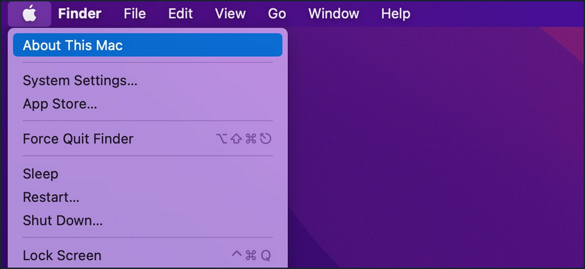

From this menu, you can perform quick admin functions such as shutting down/restarting the host or accessing System Settings. If you click on "About this Mac" and then "More Info", you can view basic information about the host, such as storage capacity, system information, and more.

#### Finder

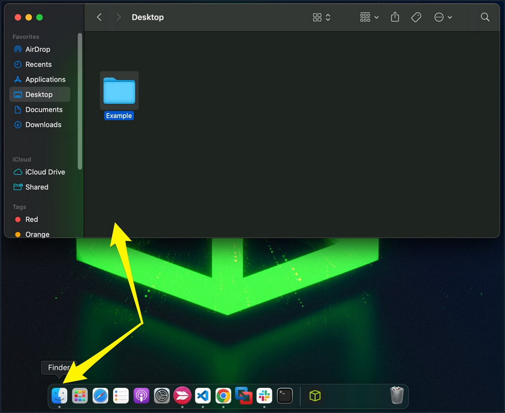

Finder is the macOS file manager through which you can manage and access your files. It provides:

- the initial desktop experience
- file management
- the menu bar at the top of your desktop
- the sidebars within your windows

#### Spotlight

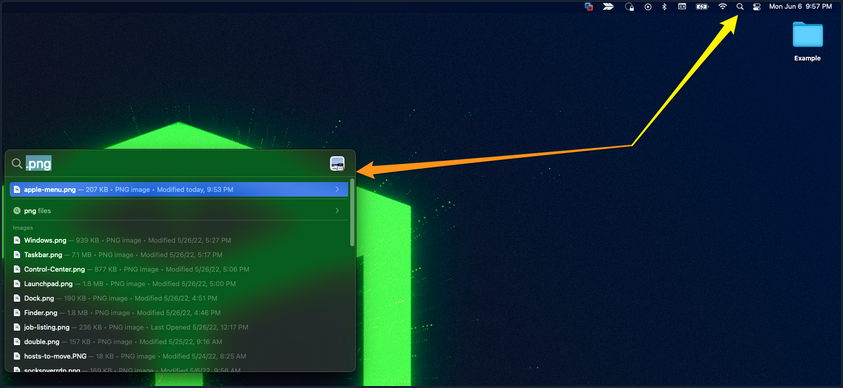

Spotlight provides an indexing and searching service on your host. It can search for documents, media, emails, applications, and anything else on your local system and in connected cloud services like iCloud. Spotlight can also perform quick mathematical conversions and calculations in the search window. When connected with Siri, Spotlight can even feed you information pertaining to news and other info. To access it, click on the magnifying glass in the top right corner, and it will open a window like the one seen below. You can see a search for ```.png``` was run, and it returned any png formatted files that could be found on the host.

#### Dock

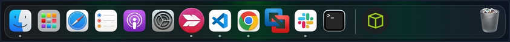

The Dock provides a customizable place to store applications and folder shortcuts for you to access them when needed quickly. By default, it is located at the bottom of your desktop but can be moved to any edge that works best for you. This is where you will find quick access to Finder, Trash, and any other macOS application you pin to the Dock or even recently opened ones.

#### Launchpad

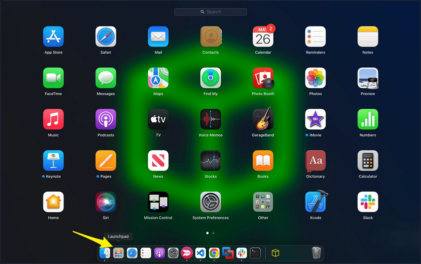

Launchpad provides users with a quick way to access, organize, and launch applications. Any apps installed on the host in the Applications directory will appear here. You can quickly scroll through to find the app you need or start typing, and launchpad will filter based on your text, showing you relevant applications. To access Launchpad, you can pinch with five fingers on the trackpad. You can also access it by searching for it in Spotlight or even pin it to the Dock, as shown in the screenshot above.

#### Control Center

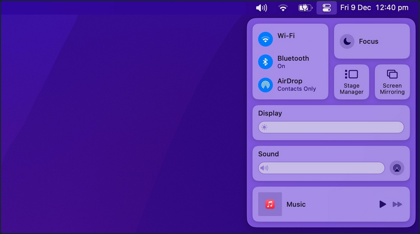

Control Center allows quick access to settings you commonly tweak, such as audio volume, screen brightness, wireless connection settings, and other settings. You can customize the control center to fit your needs as well.

### Navigating Around the OS

#### Using Finder

Finder is the component of macOS that provides the File management functions within the OS. You can use Finder to find and browse files present inside your Mac.

##### View Root Directory

One way to view the root directory is to launch the Finder app from the Dock, click on the Go Pane at the top, select "Computer" & click on "Storage".

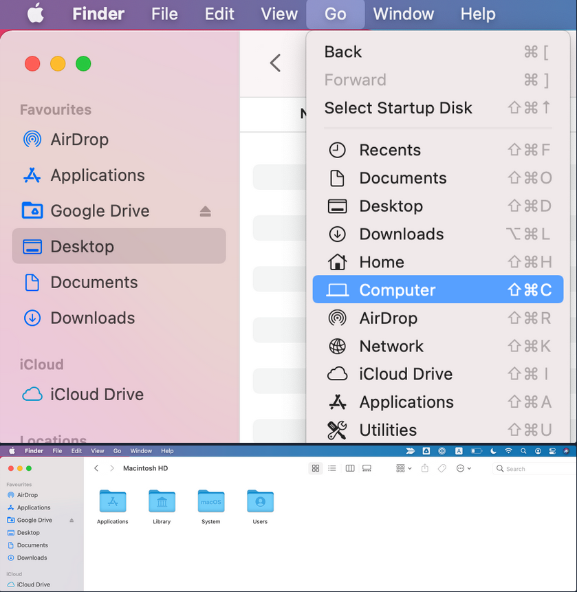

Another way to open the root directory is to launch the Finder app from Dock; enter the keyboard shortcut ```Command + Shift + G```, type ```/```, and hit "Go".

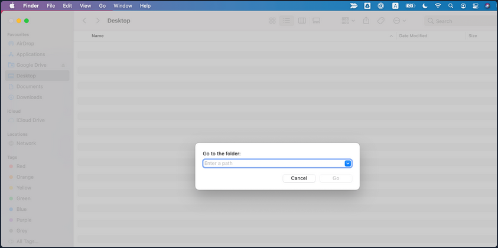

You may also go up and down directories in Finder using the Command with the up and down arrows.

##### Copy and Paste Files & Folders

Just like any other OS, you may copy/paste items in Finder with the right-click menu or the ```Command + C``` and ```Command + v``` keyboard shortcuts.

You can also move items by dragging them from one folder to another or even duplicate any item by holding the ```option``` key while dragging them.

#### Cut and Paste (_Move_) Files & Folders

MacOS does not offer a direct GUI feature to cut and paste files & folders using Finder. But you can use the keyboard shortcut ```Command + Option + V``` to move the file.

Another way to move files in macOS is using the ```mv``` command in the terminal, which must be used with caution as it is an irreversible command. To do so, open a terminal from Dock & run the following command to move the "Test" folder from the Users Document directory into the User's Desktop directory.

```
[root@htb]/Users$ mv /Users/htb-student/Documents/Test /Users/htb-student/Desktop/Test
```

#### View Hidden Files and Folders

There are lots of hidden files and folders present on macOS that prevent users from accidentally deleting files used by the OS. However, there are multiple ways to view hidden files on a Mac using the GUI and terminal.

To view hidden files and folders using the GUI:

1. Open the folder where you want to see hidden files

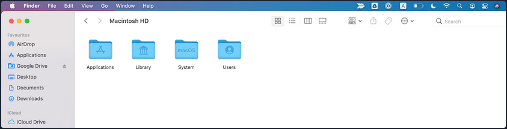

2. Hold down ```Command + Shift + .```

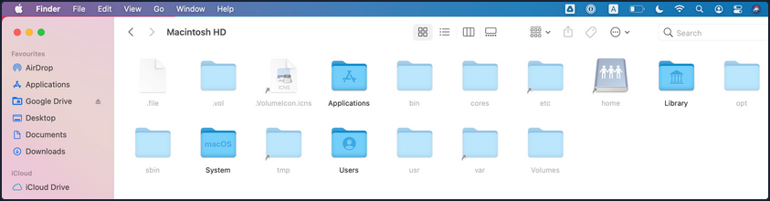

You may also change the default view of Finder to show hidden files, as follows:

1. Open a terminal from Dock & run the following commands in terminal

```
[root@htb]/Users$ defaults write com.apple.Finder AppleShowAllFiles true
[root@htb]/Users$ killall Finder
```

### Using Preview Pane

The Preview Pane within Finder allows you to glance at what files and images look like before opening them. It provides instant previews of what's in each file you highlight with additional information about the file such as Creation Date & Time, Last Modified Date & Time, Last Opened Date & Time, etc.

Enable Preview Pane inside Finder to look at the file preview.

1. Launch the Finder app from the Dock
2. Click on the "View" Pane at the top & select "Show Preview"

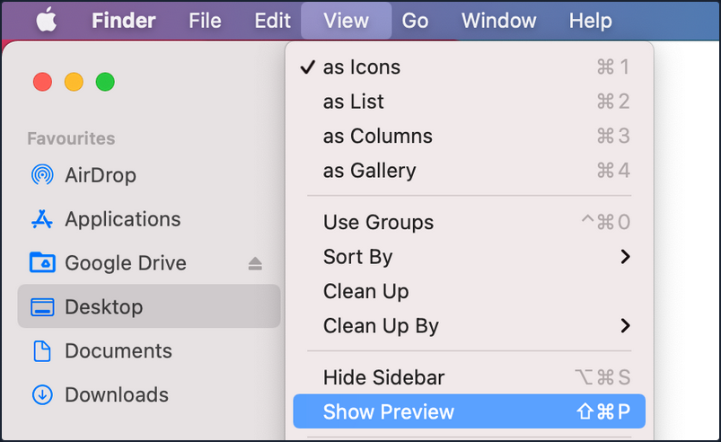

3. Now, you can click on any file and see the file's contents on the right side with additional information regarding the file.

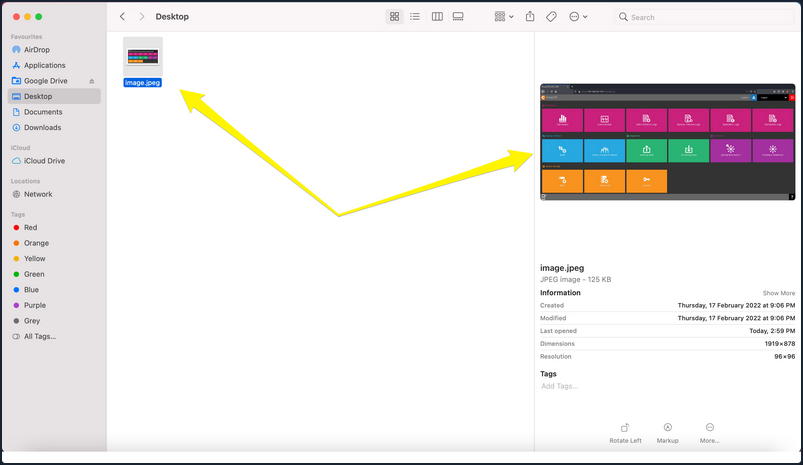

### Finding What you Need

Spotlight is a system-wide desktop search feature of Apple's macOS and iOS OS. Spotlight can help you quickly find items present on your Mac.

1. Click on the magnifying glass icon at the top-right corner of the desktop or use the keyboard shortcut (```Command + Space bar```) to open spotlight.

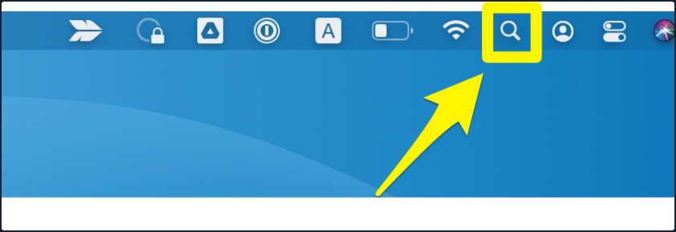

2. Type the keyword "dictionary" inside the Spotlight search bar and click on the Dictionary app to open a Dictionary instance.

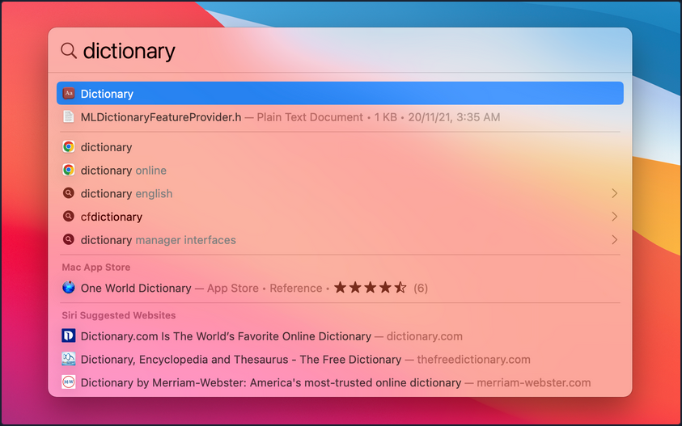

### How to Move Around Apps

Moving and switchting from one app to another can be tedious, especially if there is a frequent need to split apps every few seconds. To improve efficiency while working on multiple apps, macOS provides features like Mission Control & Split view.

#### Mission Control

MacOS provides a feature named Mission Control, which ofers a bird's eye view of all open windows, desktop spaces, and apps, making switching between them easy.

There are multiple ways to open the bird's eye view on your Mac.

1. Swipe up using three fingers on your trackpad.

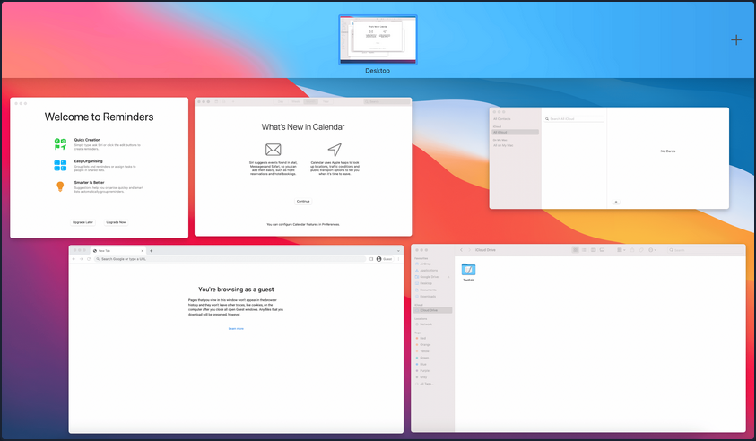

2. Open the Mission Control app manually from the Launchpad.

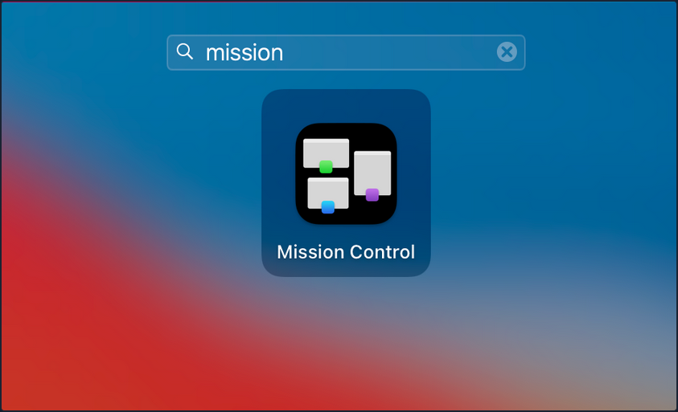

#### Split View

By using Split View, you can split your Mac screen between two apps. It would automatically resize the screen without manually moving and resizing windows. Split view only works if you already have two or more apps running in the background.

To use Split View with apps, hover the mouse pointer over the full-screen button on the top-left, and you will be presented with three options to select from:

1. Enter full screen
2. Tile window to left of screen
3. Tile window to right of screen

