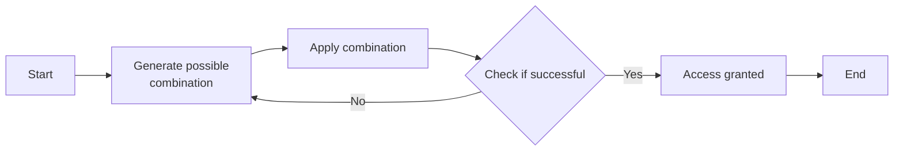
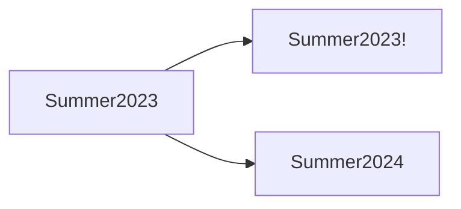
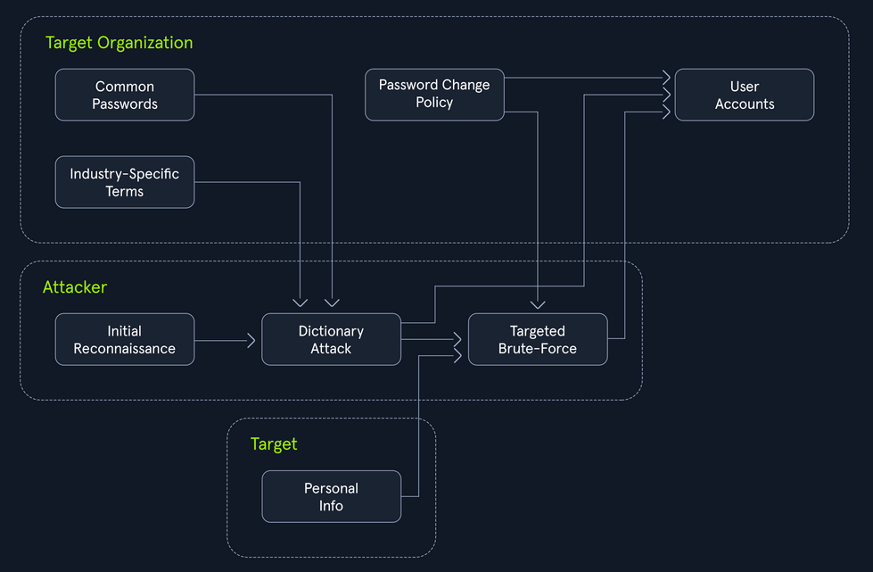

- [Login Brute Forcing](#login-brute-forcing)
  - [Intro](#intro)
    - [Types of Brute Forcing](#types-of-brute-forcing)
    - [Anatomy of a Strong Password](#anatomy-of-a-strong-password)
    - [Common Password Weaknesses](#common-password-weaknesses)
    - [Common Password Policies](#common-password-policies)
  - [Brute Force Attacks](#brute-force-attacks)
  - [Dictionary Attacks](#dictionary-attacks)
  - [Hybrid Attacks](#hybrid-attacks)
    - [The Power of Hybrid Attacks](#the-power-of-hybrid-attacks)
  - [Hydra](#hydra)
    - [Basic Usage](#basic-usage)

---

[Cheatsheet Login Brute Forcing](../../../cheatsheets/Login_Brute_Forcing_Module_Cheat_Sheet.pdf)

# Login Brute Forcing

## Intro

In cybersecurity, brute forcing is a trial-and-error method used to crack passwords, login credentials, or encryption keys. It involves systematically trying every possible combination of characters until the correct one is found. The process can be linkened to a thief trying every key on a giant keyring until they find the one that unlocks the treasure chest.

The success of a brute force attack depends on several factors, including:

- complexity of the password or key
- computational power available to the attacker
- security measures in place



### Types of Brute Forcing

| Method | Description | Exmaple | Best used when... |
| ------ | ----------- | ------- | ----------------- |
| **Simple Brute Force** | systematically tries all possible combinations of characters within a defined character set and length range | _trying all combinations of lowercase letters from 'a' to 'z' for passwords of length 4 to 6_ | no prior information about the password is available, and computational resources are abundant |
| **Dictionary Attack** | uses a pre-compiled list of common words, phrases, and passwords | _trying passwords from a list like 'rockyou.txt' against a login form_ | the target will likely use a weak or easily guessable password based on common patterns |
| **Hybrid Attack** | combines elements of simple brute force and dictionary attacks, often appending or prepending characters to dictionary words | _adding numbers or special characters to the end of words from a dictionary list_ | the target might use a slightly modified version of a common password |
| **Credential Stuffing** | leverages leaked credentials from one service to attempt access to other services, assuming users reuse passwords | _using a list of usernames and passwords leaked from a data breach to try logging into various online accounts_ | a large set of leaked credentials is available, and the target is suspected of reusing passwords across multiple services |
| **Password Spraying** | attempts a small set of commonly used passwords against a large number of usernames | _trying passwords like 'password123' or 'qwerty' against all usernames in an organization_ | account lockout policies are in place, and the attacker aims to avoid detection by spreading attempts across multiple accounts |
| **Rainbow Table Attack** | uses pre-computed tables of password hashes to reverse hashes and recover plaintext passwords quickly | _pre-computing hashes for all possible passwords of a certain length and character set, then comparing captured hashes against the table to find matches_ | a large number of password hashes need to be cracked, and storage space for the rainbow table is available |
| **Reverse Brute Force** | targets a single password against multiple usernames, often used in conjunction with credential stuffing attacks | _using a leaked password from one service to try logging into multiple accounts with different usernames_ | a strong suspicion exists that a particular password is being reused across multiple accounts |
| **Distributed Brute Force** | distributes the brute forcing workload across multiple computers or devices to accerlerate the process | _using a cluster of computers to perform a bruteforce attack significantly increases the number of combinations that can be tried per second_ | the target password or key is highly complex, and a single machine lacks the computational power to crack it within a reasonable timeframe |

### Anatomy of a Strong Password

- Length
- Complexity
- Uniqueness
- Randomness

### Common Password Weaknesses

- Short passwords
- Common Words and Phrases
- Personal Information
- Reusing Passwords
- Predictable Patterns

### Common Password Policies

- Minimum Length
- Complexity
- Password Expiration
- Password History

## Brute Force Attacks

The following formula determines the total number of possible combinations for a password:

```
Possible Combinations = Character Set Size^Password Length
```

For exmaple, a 6-character password using only lowercase letters has 26^6 possible combinations. Adding uppercase letters, numbers, and symbols to the character set further expands the search space exponentially.

## Dictionary Attacks

The effectiveness of a dictionary attack lies in its ability to exploit the human tendency to prioritize memorable passwords over secure ones.

A well-crafted wordlist tailored to the target audience or system can significantly increase the probability of a successful breach. For instance, if the target is a system frequented by gamers, a wordlist enriched with gaming-related terminology and jargon would prove more effective than a generic dictionary.

Wordlists can be obtained from various sources:

- Publicly available lists
- Custom-built lists
- Specialized lists
- Pre-existing lists

## Hybrid Attacks

Many organizations implement policies requiring users to change their passwords periodically to enhance security. However, these policies can inadvertently breed predictable password patterns if users are not adequately educated on proper password hygiene.

Bad example:



Consider an attacker targeting an organization known to enforce regular password changes.



### The Power of Hybrid Attacks

The effectiveness of hybrid attacks lies in their adaptability and efficiency. They leverage the strength of both dictionary and brute-force techniques, maximizing the chances of cracking passwords, especially in scenarios where users fall into predictable patterns.

To extract only the passwords that adhere to a specific policy (_e.g. minlength:8, mustinclude:oneupper,onelower,onenumber_), you can leverage the powerful command-line tools available on most Linux/Unix-based systems by default, specifically ```grep``` paired with regex.

```bash
d41y@htb[/htb]$ grep -E '^.{8,}$' darkweb2017-top10000.txt > darkweb2017-minlength.txt
d41y@htb[/htb]$ grep -E '[A-Z]' darkweb2017-minlength.txt > darkweb2017-uppercase.txt
d41y@htb[/htb]$ grep -E '[a-z]' darkweb2017-uppercase.txt > darkweb2017-lowercase.txt
d41y@htb[/htb]$ grep -E '[0-9]' darkweb2017-lowercase.txt > darkweb2017-number.txt
d41y@htb[/htb]$ wc -l darkweb2017-number.txt

89 darkweb2017-number.txt
```

Meticulously filtering the extensive 10,000-password list against the password policy has dramatically narrowed down your potential passwords to 89. A smaller, targeted list translates to a faster and more focused attack, optimizing the use of computational resources and increasing the likelihood of a successful breach.

## Hydra

... is a fast network login cracker that supports numerous attack protocols.

### Basic Usage

```bash
d41y@htb[/htb]$ hydra [login_options] [password_options] [attack_options] [service_options]
```

| Parameter | Example | Explanation |
| --------- | ------- | ----------- |
| ```-l LOGIN``` or ```-L FILE``` | ```hydra -l admin ...``` or ```hydra -L usernames.txt ...``` | login options: specify either a single username or a file containing a list of usernames |
| ```-p PASS``` or ```-P FILE``` | ```hydra -p password123 ...``` or ```hydra -P FILE``` | password options: provide either a single password or a file containing a list of passwords |
| ``` ``` | ``` ``` |  |
| ``` ``` | ``` ``` |  |
| ``` ``` | ``` ``` |  |
| ``` ``` | ``` ``` |  |
| ``` ``` | ``` ``` |  |
| ``` ``` | ``` ``` |  |