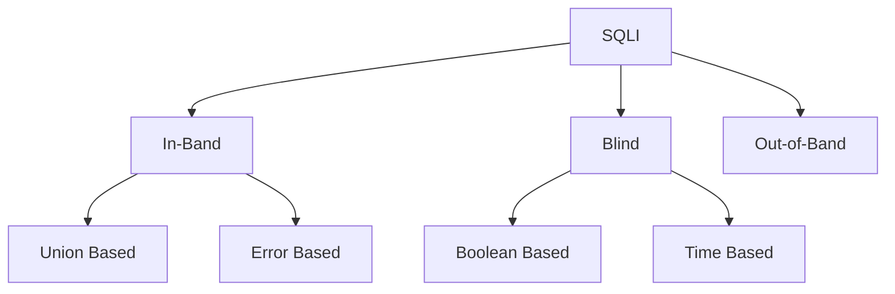

- [SQL Injection (SQLi)](#sql-injection-sqli)
  - [Use of SQL in Web Apps](#use-of-sql-in-web-apps)
  - [SQLi](#sqli)
  - [Syntax Errors](#syntax-errors)
  - [Types of SQLi](#types-of-sqli)
  - [Subverting Query Logic](#subverting-query-logic)
    - [Authentication Bypass](#authentication-bypass)
    - [SQLi Discovery](#sqli-discovery)

---

# SQL Injection (SQLi)

... refers to attacks against relational databases such as MySQL. An SQLi occurs when a malicious user attempts to pass input that changes the final SQL query sent by the web application to the database, enabling the user to perform other unintended SQL queries directly against the database.

## Use of SQL in Web Apps

Once a DBMS is installed and set up on the back-end server and is up running, the web app can start utilizing it to store and retrieve data.

For example, within a PHP web app, you can connect to your database, and start using the MySQL database through MySQL syntax, right within PHP. You can then print it to the page or use it in any other way.

```php
$conn = new mysqli("localhost", "root", "password", "users");
$query = "select * from logins";
$result = $conn->query($query);

while($row = $result->fetch_assoc() ){
	echo $row["name"]."<br>";
} // prints all returned results of the SQL query in new lines

```

Web apps also usually use user-input when retrieving data. For example, when a user uses the search function to search for other users, their search input is passed to the web app, which uses the input to search within the database.

```php
$searchInput =  $_POST['findUser'];
$query = "select * from logins where username like '%$searchInput'";
$result = $conn->query($query);
```

## SQLi

... occurs when user-input is inputted into the SQL query string without properly sanitizing or filtering the input.

No input sanitization example:

```php
$searchInput =  $_POST['findUser'];
$query = "select * from logins where username like '%$searchInput'";
$result = $conn->query($query);
```

In this case you can add a single quote ```'```, which will end the user-input field, and after it, we can write actual SQL code. If you search for ```1'; DROP TABLE users;```, the search input would be:

```sql
select * from logins where username like '%1'; DROP TABLE users;'
```

Once the query is run, the table will get deleted.

## Syntax Errors

The previous example of SQLi would return an error.

```php
Error: near line 1: near "'": syntax error
```

This is because of the last trailing character, where you have a single quote that is not closed, which causes a SQL syntax error when executed. In this case, you had only one trailing character, as your input from the search query was near the end of the SQL query. However, the user input usually goes in the middle of the SQL query, and the rest of the original SQL query comes after it.

To have a successful injection, you must ensure that the newly modified SQL query is still valid and does not have any syntax errors after your injection.

One answer to that problem is using **comments**. Another is to make the query syntax work by passing in multiple single quotes.

## Types of SQLi



- **In-Band** (_the output of both the intended and the new query may be printed directly on the front end_)
  - **Union Based** (_you may have to specify the exact location, so the query will direct the output to be printed there_)
  - **Error Based** (_is used when you can get the PHP or SQL erros in the front-end, so that you may intentionally cause an SQL error that returns the output of your query_)
- **Blind** (_you may not get the output printed, so you may utilize SQL logic to retrieve the output character by character_)
  - **Booleand Based** (_you can use SQL conditional statements to control whether the page returns any output at all if your condition statements returns 'true'_)
  - **Time Based** (_you use SQL conditional statements that delay the page response if the conditional statement returns 'true' using the 'Sleep()' function_)
- **Out-of-Band** (_you may not have direct access to the output whatsoever, so you may have to direct the output to a remote location, and then attempt to retrieve it from there_)

## Subverting Query Logic

### Authentication Bypass


You can log in with the admin creds ```admin:p@ssw0rd```.


The current SQL query being executed:

```sql
SELECT * FROM logins WHERE username='admin' AND password = 'p@ssw0rd';
```

The page takes in the credentials, then uses the AND operator to select records matching the given username and password. If the MySQL database returns matched records, the credentials are valid, so the PHP code would evaluate the login attempt condition as 'true'. If the condition evaluates to 'true', the admin record is returned. and your login is validated.

Example with wrong creds:


### SQLi Discovery

Before you start subverting the web app's logic and attempting to bypass the authentication, you first have to test whether the login form is vulnerable to SQLi. To do that, you can try to add one of the below payloads after your username and see if it causes any errors or changes how the page behaves:

| Payload | URL Encoded |
| ------- | ----------- |
| ```'``` | %27 |
| ```"``` | %22 |
| ```#``` | %23 |
| ```;``` | %3B |
| ```)``` | %29 |

Example for ```'```:


The quote you entered resulted in an odd number of quotes, causing a syntax error. One option would be to comment out the rest of the query and write the remainder of the query as part of your injection to form a workin query. Another option is to use an even number of quotes within your injected query, such that the final query would still work.