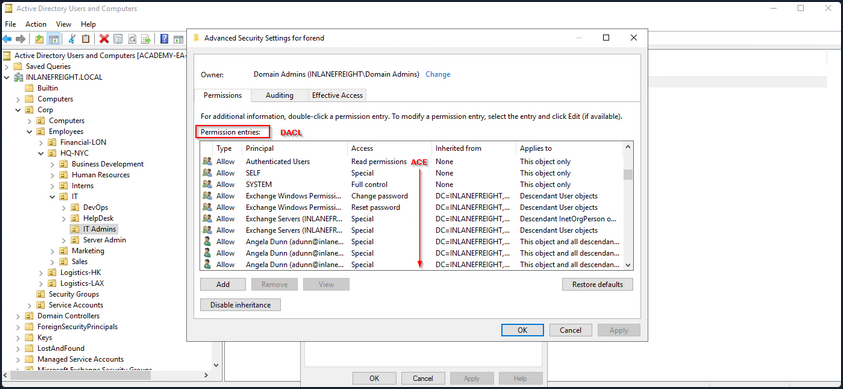
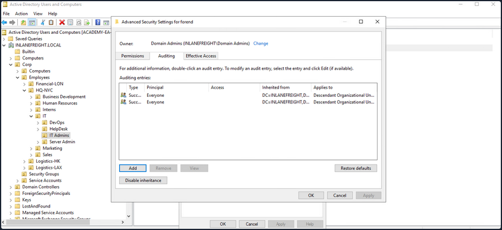
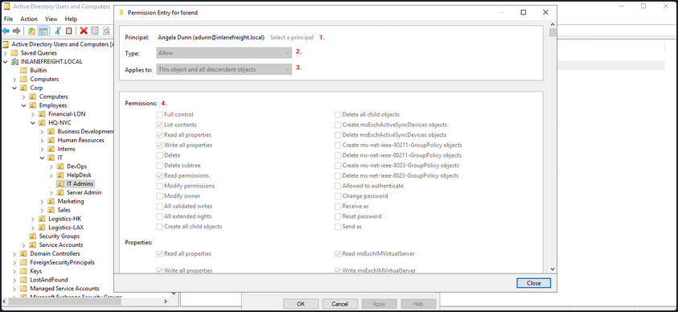
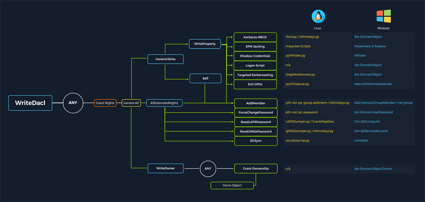

- [ACL Abuse](#acl-abuse)
  - [Primer](#primer)
    - [ACL Overview](#acl-overview)
    - [Access Control Entries (_ACEs_)](#access-control-entries-aces)
    - [Importance of ACEs](#importance-of-aces)
    - [ACL Attacks in the Wild](#acl-attacks-in-the-wild)
  - [ACL Enumeration](#acl-enumeration)
    - [Enumerating with PowerView](#enumerating-with-powerview)
      - [Find-InterestingDomainAcl](#find-interestingdomainacl)
      - [Get-DomainObjectACL](#get-domainobjectacl)
      - [Performing a Reverse Search \& Mapping to a GUID Value](#performing-a-reverse-search--mapping-to-a-guid-value)
      - [-ResolveGUIDs Flag](#-resolveguids-flag)
      - [Get-Acl \& Get-ADUser](#get-acl--get-aduser)
      - [Further Enumeration of Rights](#further-enumeration-of-rights)
    - [Enumerating ACLs with BloodHound](#enumerating-acls-with-bloodhound)


# ACL Abuse

## Primer

### ACL Overview

In their simplest form, ACLs are lists that define who has access to which asset/resource and the level of access they are provisioned. The settings themselves in an ACL are called Access Control Entries (_ACEs_). Each ACE maps back to a user, group, or process and defines the rights granted to that prinicpal. Every object has an ACL, but can have multiple ACEs because multiple security principals can access objects in AD. ACLs can also be used for auditing access within AD.

Two types of ACLs:

1. **Discretionary Access Control List (_DACL_)**: defines which security principals are granted or denied access to an object. DACLs are made up of ACEs that either allow or deny access. When someone attempts to access an object, the system will check the DACL for the level of access that is permitted. If a DACL does not exist for an object, all who attempt to access the object are granted full rights. If a DACL exists, but does not have any ACE entries specifying specific security settings, the system will deny access to all users, groups, or processes, attempting to access it.
2. **System Access Control List (_SACL_)**: allow administrators to log access attempts made to secured objects.

You see that ACL for the user account forend in the image below. Each item under ```Permission entries``` make up the DACL for the user account, while the individual entries are ACE entries showing rights granted over this user object to various users and groups.



The SACLs can be seen within the ```Auditing``` tab.



### Access Control Entries (_ACEs_)

As stated previously, ACLs contain ACE entries that name a user or group and the level of access they have over a given securable object. There are three main types of ACEs that can be applied to all securable objects.

| ACE | Description |
| --- | ----------- |
| Access denied ACE | Used within a DACL to show that a user or group is explicitly denied access to an object. |
| Access allowed ACE | Used within a DACL to show that a user or group is explicitly granted access to an object. |
| System audit ACE | Used within a SACL to generate audit logs when a user or group attempts to access an object. It records whether access was granted or not and what type of access occured. |

Each ACE is made up of the following four components:

1. The security identifier (_SID_) of the user/group that has access to the object
2. A flag denoting the type of ACE
3. A set of flags that specify whether or not child containers/objects can inherit the given ACE entry from the primary or parent object
4. An access mask which is a 32-bit value that defines the rights granted to an object

You can view this graphically in AD Users and Computers. In the example image below, you can see the following for the ACE entry for the user forend.



1. The security principal is Angela Dunn
2. The ACE type is ```Allow```
3. Inheritance applies to the "This object and all descendant objects", meaning any child objects of the forend object would have the same permissions granted
4. The rights granted to the object, again shown graphically in this example

When ACLs are checked to determine permissions, they are checked from top to bottom until an access denied is found in the list.

### Importance of ACEs

Attackers utilize ACE entries to either further access or establish persistence. These can be great for you as pentesters as many organizations are unaware of the ACEs applied to each object or the impact that these can have if applied incorrectly. They cannot be detected by vulnerability scanning tools, and often go unchecked for many years, especially in large and complex environments. During an assessment where the client has taken care of all of the "low hanging fruit" AD flaws/misconfigs, ACL abuse can be a great way for you to move laterally/vertically and even achieve full domain compromise. Some example AD object security permissions are as follows. These can be enumerated using a tool such as BloodHound, and are full abusable with PowerView, among other tools:

- ```ForcedChangePassword``` abused with ```Set-DomainUserPassword```
- ```Add Members``` abused with ```Set-DomainGroupMember```
- ```GenericAll``` abused with ```Set-DomainUserPassword``` or ```Add-DomainGroupMember```
- ```GenericWrite``` abused with ```Set-DomainObject```
- ```WriteOwner``` abused with ```Set-DomainObjectOwner```
- ```WriteDACL``` abused with ```Add-DomainObjectACL```
- ```AllExtendedRights``` abused with ```Set-DomainUserPassword``` or ```Add-DomainGroupMember```
- ```AddSelf``` abused with ```Add-DomainGroupMember```

Read more about it [here](https://bloodhound.specterops.io/resources/edges/overview#about-bloodhound-edges).



### ACL Attacks in the Wild

You can use ACL attacks for:

- Lateral Movement
- Privilege Escalation
- Persistence

Some common attack scenarios may include:

| Attack | Description |
| ------ | ----------- |
| Abusing forgot password permissions | Help Desk and other IT users are often granted permissions to perform password resets and other privileged tasks. If you can take over an account with these privileges, you may be able to perform a password reset for a more privileged account in the domain. |
| Abusing group membership management | It's also common to see Help Desk and other staff that have the right to add/remove users from a given group. It is always worth enumerating this further, as sometimes you may be able to add an account that you control into a privileged built-in AD group or a group that grants you some sort of interesting privilege. |
| Excessive user rights | You also commonly see user, computer, and group objects with excessive rights that a client is likely unaware of. This could occur after some sort of software install or some kind of legacy or accidental configuration that gives a user unintended rights. Sometimes you may take over an account that was given certain rights out of convenience or to solve a nagging problem more quickly. |

## ACL Enumeration

### Enumerating with PowerView

#### Find-InterestingDomainAcl

You can use PowerView to enumerate ACLs, but the task of digging through all of the results will be extremely time-consuming and likely inaccurate. For example, if you run the command ```Find-InterestingDomainAcl``` you will receive a massive amount of information back that you would need to dig through to make any sense of:

```powershell
PS C:\htb> Find-InterestingDomainAcl

ObjectDN                : DC=INLANEFREIGHT,DC=LOCAL
AceQualifier            : AccessAllowed
ActiveDirectoryRights   : ExtendedRight
ObjectAceType           : ab721a53-1e2f-11d0-9819-00aa0040529b
AceFlags                : ContainerInherit
AceType                 : AccessAllowedObject
InheritanceFlags        : ContainerInherit
SecurityIdentifier      : S-1-5-21-3842939050-3880317879-2865463114-5189
IdentityReferenceName   : Exchange Windows Permissions
IdentityReferenceDomain : INLANEFREIGHT.LOCAL
IdentityReferenceDN     : CN=Exchange Windows Permissions,OU=Microsoft Exchange Security 
                          Groups,DC=INLANEFREIGHT,DC=LOCAL
IdentityReferenceClass  : group

ObjectDN                : DC=INLANEFREIGHT,DC=LOCAL
AceQualifier            : AccessAllowed
ActiveDirectoryRights   : ExtendedRight
ObjectAceType           : 00299570-246d-11d0-a768-00aa006e0529
AceFlags                : ContainerInherit
AceType                 : AccessAllowedObject
InheritanceFlags        : ContainerInherit
SecurityIdentifier      : S-1-5-21-3842939050-3880317879-2865463114-5189
IdentityReferenceName   : Exchange Windows Permissions
IdentityReferenceDomain : INLANEFREIGHT.LOCAL
IdentityReferenceDN     : CN=Exchange Windows Permissions,OU=Microsoft Exchange Security 
                          Groups,DC=INLANEFREIGHT,DC=LOCAL
IdentityReferenceClass  : group

<SNIP>
```

If you try to dig through all of this data during a time-boxed assessment, you will likely never get through it all or find anything interesting before the assessment is over. Now, there is a way to use a tool such as PowerView more effectively - by performing targeted enumeration starting with a user that you have control over.

#### Get-DomainObjectACL

Dig in and see if this user (_wley_) has any interesting ACL rights that you could take advantage of. You first need to get the SID of your target user to search effectively.

```powershell
PS C:\htb> Import-Module .\PowerView.ps1
PS C:\htb> $sid = Convert-NameToSid wley
```

You can then use the ```Get-DomainObjectACL``` function to perform your targeted search. In the below example, you are using this function to find all domain objects that your user has rights over by mapping the user's SID using the ```$sid``` variable thing to the ```SecurityIdentifier``` property which is what tells you who has the given right over an object. One important thing to note is that if you search without the flag ```ResolveGUIDs```, you will see results like the below, where the right ```ExtendedRight``` does not give you a clear picture of what ACE entry the user wley has over damundsen. This is because the ```ObcetAceType``` property is returning a GUID value that is not human readable.

Note that this command will take a while to run, especially in a large environment.

```powershell
PS C:\htb> Get-DomainObjectACL -Identity * | ? {$_.SecurityIdentifier -eq $sid}

ObjectDN               : CN=Dana Amundsen,OU=DevOps,OU=IT,OU=HQ-NYC,OU=Employees,OU=Corp,DC=INLANEFREIGHT,DC=LOCAL
ObjectSID              : S-1-5-21-3842939050-3880317879-2865463114-1176
ActiveDirectoryRights  : ExtendedRight
ObjectAceFlags         : ObjectAceTypePresent
ObjectAceType          : 00299570-246d-11d0-a768-00aa006e0529
InheritedObjectAceType : 00000000-0000-0000-0000-000000000000
BinaryLength           : 56
AceQualifier           : AccessAllowed
IsCallback             : False
OpaqueLength           : 0
AccessMask             : 256
SecurityIdentifier     : S-1-5-21-3842939050-3880317879-2865463114-1181
AceType                : AccessAllowedObject
AceFlags               : ContainerInherit
IsInherited            : False
InheritanceFlags       : ContainerInherit
PropagationFlags       : None
AuditFlags             : None
```

#### Performing a Reverse Search & Mapping to a GUID Value

You could Google for the GUID value and uncover [this](https://docs.microsoft.com/en-us/windows/win32/adschema/r-user-force-change-password) page showing that the user has the right to force change the other user's password. Alternatively, you could do a reverse search using PowerShell to map the right name back th the GUID value.

```powershell
PS C:\htb> $guid= "00299570-246d-11d0-a768-00aa006e0529"
PS C:\htb> Get-ADObject -SearchBase "CN=Extended-Rights,$((Get-ADRootDSE).ConfigurationNamingContext)" -Filter {ObjectClass -like 'ControlAccessRight'} -Properties * |Select Name,DisplayName,DistinguishedName,rightsGuid| ?{$_.rightsGuid -eq $guid} | fl

Name              : User-Force-Change-Password
DisplayName       : Reset Password
DistinguishedName : CN=User-Force-Change-Password,CN=Extended-Rights,CN=Configuration,DC=INLANEFREIGHT,DC=LOCAL
rightsGuid        : 00299570-246d-11d0-a768-00aa006e0529
```

This gave you an answer, but would be highly inefficient during an assessment.

#### -ResolveGUIDs Flag

PowerView has the ```ResolveGUIDs``` flag, which does this very thing for you. Notice how the output changes when you include this flag to show the human-readable format of the ```ObjectAceType``` property as ```User-Force-Change-Password```.

```powershell
PS C:\htb> Get-DomainObjectACL -ResolveGUIDs -Identity * | ? {$_.SecurityIdentifier -eq $sid} 

AceQualifier           : AccessAllowed
ObjectDN               : CN=Dana Amundsen,OU=DevOps,OU=IT,OU=HQ-NYC,OU=Employees,OU=Corp,DC=INLANEFREIGHT,DC=LOCAL
ActiveDirectoryRights  : ExtendedRight
ObjectAceType          : User-Force-Change-Password
ObjectSID              : S-1-5-21-3842939050-3880317879-2865463114-1176
InheritanceFlags       : ContainerInherit
BinaryLength           : 56
AceType                : AccessAllowedObject
ObjectAceFlags         : ObjectAceTypePresent
IsCallback             : False
PropagationFlags       : None
SecurityIdentifier     : S-1-5-21-3842939050-3880317879-2865463114-1181
AccessMask             : 256
AuditFlags             : None
IsInherited            : False
AceFlags               : ContainerInherit
InheritedObjectAceType : All
OpaqueLength           : 0
```

#### Get-Acl & Get-ADUser

Knowing how to perform this type of search without using a tool such as PowerView is greatly beneficial and could set you apart from your peers. You may be able to use this knowledge to achieve results when a client has you to work from one of their systems, and you are restricted down to what tools are readily available on the system without the ability to pull in any of your own.

This example is not very efficient, and the command can take a long time to run, especially in a large environment. It will take much longer than the equivalent command using PowerView. In this command, you've made a list of all domain users with the following command:

```powershell
PS C:\htb> Get-ADUser -Filter * | Select-Object -ExpandProperty SamAccountName > ad_users.txt
```

You then read each line of the file using a foreach loop, and use the ```Get-Acl``` cmdlet to retrieve ACL information for each domain user by feeding each line of the ```ad_users.txt``` file to the ```Get-ADUser``` cmdlet. You then select just the ```Acess property```, which will give you information about access rights. Finally, you set the ```IdentityReference``` propery to the user you are in control of.

```powershell
PS C:\htb> foreach($line in [System.IO.File]::ReadLines("C:\Users\htb-student\Desktop\ad_users.txt")) {get-acl  "AD:\$(Get-ADUser $line)" | Select-Object Path -ExpandProperty Access | Where-Object {$_.IdentityReference -match 'INLANEFREIGHT\\wley'}}

Path                  : Microsoft.ActiveDirectory.Management.dll\ActiveDirectory:://RootDSE/CN=Dana 
                        Amundsen,OU=DevOps,OU=IT,OU=HQ-NYC,OU=Employees,OU=Corp,DC=INLANEFREIGHT,DC=LOCAL
ActiveDirectoryRights : ExtendedRight
InheritanceType       : All
ObjectType            : 00299570-246d-11d0-a768-00aa006e0529
InheritedObjectType   : 00000000-0000-0000-0000-000000000000
ObjectFlags           : ObjectAceTypePresent
AccessControlType     : Allow
IdentityReference     : INLANEFREIGHT\wley
IsInherited           : False
InheritanceFlags      : ContainerInherit
PropagationFlags      : None
``` 

Once you have this data, you could follow the same methods shown above to convert the GUID to a human-readable format to understand what rights you have over the target user.

#### Further Enumeration of Rights

So, to recap, you started with the user wley and now have control over the user damundsen via the ```User-Force-Change-Password``` extended right. Use PowerView to hunt for where, if anywhere, control over the damundsen account could take you.

```powershell
PS C:\htb> $sid2 = Convert-NameToSid damundsen
PS C:\htb> Get-DomainObjectACL -ResolveGUIDs -Identity * | ? {$_.SecurityIdentifier -eq $sid2} -Verbose

AceType               : AccessAllowed
ObjectDN              : CN=Help Desk Level 1,OU=Security Groups,OU=Corp,DC=INLANEFREIGHT,DC=LOCAL
ActiveDirectoryRights : ListChildren, ReadProperty, GenericWrite
OpaqueLength          : 0
ObjectSID             : S-1-5-21-3842939050-3880317879-2865463114-4022
InheritanceFlags      : ContainerInherit
BinaryLength          : 36
IsInherited           : False
IsCallback            : False
PropagationFlags      : None
SecurityIdentifier    : S-1-5-21-3842939050-3880317879-2865463114-1176
AccessMask            : 131132
AuditFlags            : None
AceFlags              : ContainerInherit
AceQualifier          : AccessAllowed
```

Now you can see that your user damundsen has ```GenericWrite``` privileges over the Help Desk Level 1 group. This means, among other things, that you can add any user to this group and inherit any rights that this group has applied to it. A search for rights conferred upon this group does not return anything interesting.

Look and see if this group is nested into any other groups, remembering that nested group membership will mean that any user in group A will inherit all rights of any group that group A is nested into. A quick search shows you that the Help Desk Level 1 group is nested into the Information Technology group, meaning that you can obtain any rights that the Information Technology group grants to its members if you just add yourself to the Help Desk Level 1 group where your user damundsem has ```GenericWrite``` privileges.

```powershell
PS C:\htb> Get-DomainGroup -Identity "Help Desk Level 1" | select memberof

memberof                                                                      
--------                                                                      
CN=Information Technology,OU=Security Groups,OU=Corp,DC=INLANEFREIGHT,DC=LOCAL
```

In summary:

- You have control over the user wley whose hash you retrieved earlier using Responder and cracked offline using Hashcat to reveal the cleartext password value
- You enumerated objects that the user wley has control over and fount that you could force change the password of the user damundsen
- From here, you found that the damundsen user can add a member to the Help Desk Level 1 group using GenericWrite privileges
- The Help Desk Level 1 group is nested into the Information Technology group, which grants members of that group any rights provisioned to the Information Technology group

Now look around and see if members of Information Technology can do anything interesting. Once again, doing your search using ```Get-DomainObectAcl``` shows you that members of the Information Technology group have ```GenericAll``` rights over the user adunn, which means you could:

- Modify group membership
- Force change a password
- Perform a targeted Kerberoasting attack and attempt to crakc the user's password if it is weak

```powershell
PS C:\htb> $itgroupsid = Convert-NameToSid "Information Technology"
PS C:\htb> Get-DomainObjectACL -ResolveGUIDs -Identity * | ? {$_.SecurityIdentifier -eq $itgroupsid} -Verbose

AceType               : AccessAllowed
ObjectDN              : CN=Angela Dunn,OU=Server Admin,OU=IT,OU=HQ-NYC,OU=Employees,OU=Corp,DC=INLANEFREIGHT,DC=LOCAL
ActiveDirectoryRights : GenericAll
OpaqueLength          : 0
ObjectSID             : S-1-5-21-3842939050-3880317879-2865463114-1164
InheritanceFlags      : ContainerInherit
BinaryLength          : 36
IsInherited           : False
IsCallback            : False
PropagationFlags      : None
SecurityIdentifier    : S-1-5-21-3842939050-3880317879-2865463114-4016
AccessMask            : 983551
AuditFlags            : None
AceFlags              : ContainerInherit
AceQualifier          : AccessAllowed
```

Finally, see if the adunn user has any type of interesting access that may be able to leverage to get closer to your goal.

```powershell
PS C:\htb> $adunnsid = Convert-NameToSid adunn 
PS C:\htb> Get-DomainObjectACL -ResolveGUIDs -Identity * | ? {$_.SecurityIdentifier -eq $adunnsid} -Verbose

AceQualifier           : AccessAllowed
ObjectDN               : DC=INLANEFREIGHT,DC=LOCAL
ActiveDirectoryRights  : ExtendedRight
ObjectAceType          : DS-Replication-Get-Changes-In-Filtered-Set
ObjectSID              : S-1-5-21-3842939050-3880317879-2865463114
InheritanceFlags       : ContainerInherit
BinaryLength           : 56
AceType                : AccessAllowedObject
ObjectAceFlags         : ObjectAceTypePresent
IsCallback             : False
PropagationFlags       : None
SecurityIdentifier     : S-1-5-21-3842939050-3880317879-2865463114-1164
AccessMask             : 256
AuditFlags             : None
IsInherited            : False
AceFlags               : ContainerInherit
InheritedObjectAceType : All
OpaqueLength           : 0

AceQualifier           : AccessAllowed
ObjectDN               : DC=INLANEFREIGHT,DC=LOCAL
ActiveDirectoryRights  : ExtendedRight
ObjectAceType          : DS-Replication-Get-Changes
ObjectSID              : S-1-5-21-3842939050-3880317879-2865463114
InheritanceFlags       : ContainerInherit
BinaryLength           : 56
AceType                : AccessAllowedObject
ObjectAceFlags         : ObjectAceTypePresent
IsCallback             : False
PropagationFlags       : None
SecurityIdentifier     : S-1-5-21-3842939050-3880317879-2865463114-1164
AccessMask             : 256
AuditFlags             : None
IsInherited            : False
AceFlags               : ContainerInherit
InheritedObjectAceType : All
OpaqueLength           : 0

<SNIP>
```

The output above shows that your adunn user has ```DS-Replication-Get-Changes``` and ```DS-Replication-Get-Changes-In-Filtered-Set``` rights over the domain object. This means that this user can be leveraged to perform a DCSync attack.

### Enumerating ACLs with BloodHound

