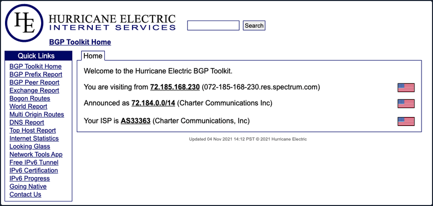
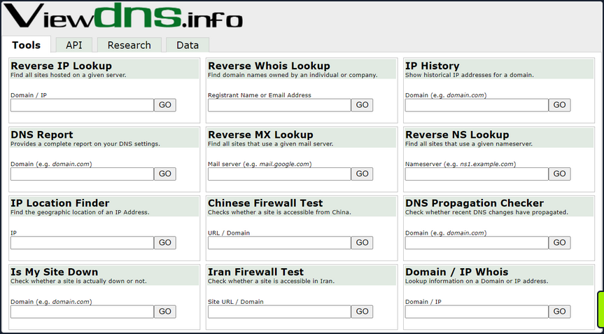
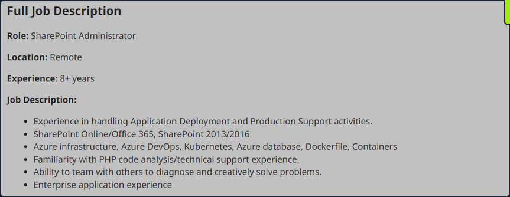
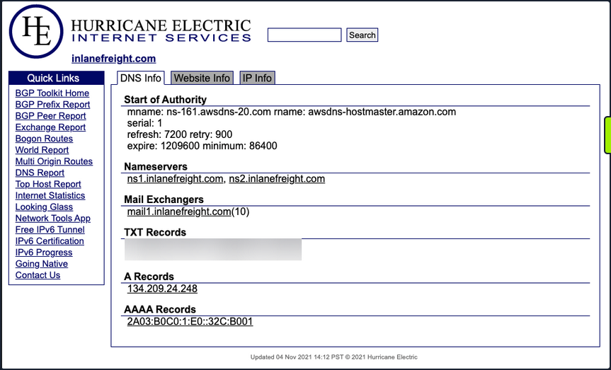
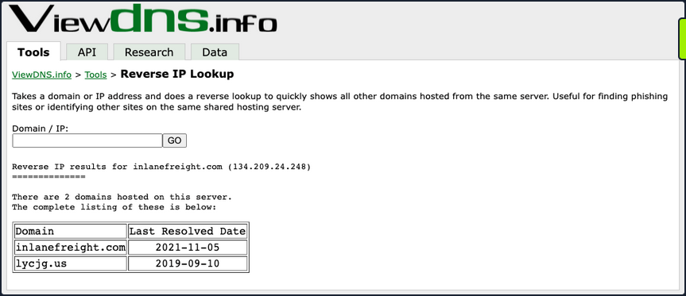
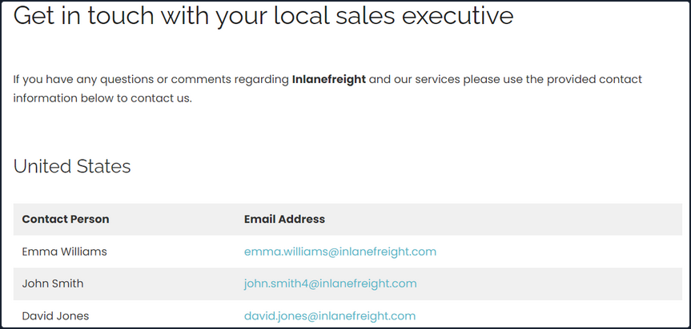
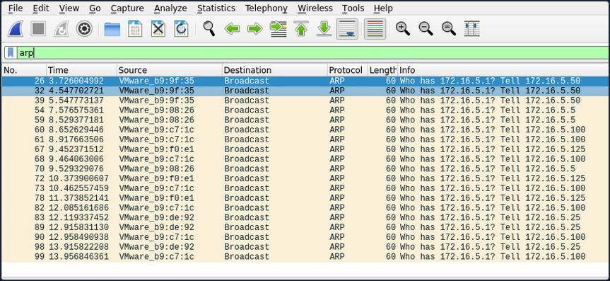
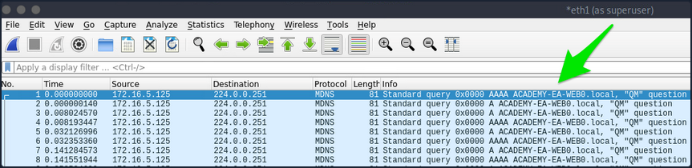

- [Initial Enumeration](#initial-enumeration)
  - [External Recon and Enumeration Principles](#external-recon-and-enumeration-principles)
    - [What and where to look for?](#what-and-where-to-look-for)
      - [Finding Address Spaces](#finding-address-spaces)
      - [DNS](#dns)
      - [Public Data](#public-data)
    - [Overarching Enum Principles](#overarching-enum-principles)
    - [Example Enum Process](#example-enum-process)
      - [Check for ASN/IP \& Domain Data](#check-for-asnip--domain-data)
      - [Hunting for Files and Email Addresses](#hunting-for-files-and-email-addresses)
      - [Username Harvesting](#username-harvesting)
      - [Credential Hunting](#credential-hunting)
  - [Initial Enumeration of the Domain](#initial-enumeration-of-the-domain)
    - [Identifying Hosts](#identifying-hosts)
      - [Wireshark](#wireshark)
      - [TCPDump](#tcpdump)
      - [Responder](#responder)
      - [FPing](#fping)
      - [Nmap](#nmap)

---

# Initial Enumeration

## External Recon and Enumeration Principles

### What and where to look for?

When conducting your external recon, there are several key items that you should be looking for. This information may not always be publicly accessible, but it would be prudent to see what is out there. If you get stuck, during a pentest, looking back at what could be obtained through passive recon can give you a nudge needed to move forward, such as password breach data that could be used to access a VPN or other externally facing service. The table below highlights the **WHAT** in what you would be searching for during this phase of your engagement.

| Data Point | Description |
| ---------- | ----------- |
| IP Space | Valid ASN for your target, netblocks in use for the organization's public facing infra, cloud presence and the hosting providers, DNS record entries, etc. |
| Domain Information | Based on IP data, DNS, and site registrations. Who administers the domain? Are there any subdomains tied to your target? Are there any publicly accessible domain services present? Can you determine what kind of defenses are in place? |
| Schema Format | Can you discover the organization's email accounts, AD usernames, and even password policies? Anything that will give you information you can use to build a valid username list to test external-facing services for password spraying, credential stuffing, brute forcing, etc. |
| Data Disclosures | For data disclosures you will be looking for publicly accessible files for any information that helps shed light on the target. For example, any published files that contain ```intranet``` site listings, user metadata, shares, or other critical software or hardware in the environment. |
| Breach Data | Any publicly released usernames, passwords, or other critical information that can help an attacker gain a foothold. |

The list of data points above can be gathered in many different ways. There are many different websites and tools that can provide you with some or all of the information above that you could use to obtain information vital to your assessment. The table below lists a few potential resources and examples that can be used.

| Resource | Examples |
| -------- | -------- |
| ASN / IP registrars | [IANA](https://www.iana.org/), [arin](https://www.arin.net/) for searching the Americas, [RIPE](https://www.ripe.net/) for searching in Europe, [BGP Toolkit](https://bgp.he.net/) |
| Domain Registrars & DNS | [Domaintools](https://www.domaintools.com/), [PTRArchive](http://ptrarchive.com/), [ICANN](https://lookup.icann.org/lookup), manual DNS record requests against the domain in question or against well known DNS servers, such as 8.8.8.8. |
| Social Media | Searching Linkedin, Twitter, Facebook, your region's major social media sites, news articles, and any relevant info you can find about the organization. |
| Public-Facing Company Websites | Often, the public websites for a corporation will have relevant info embedded. News articles, embedded documents, and the "About us" and "Contact us" pages can also be gold mines. |
| Cloud & Dev Storage Spaces | [GitHub](https://github.com/), [AWS S3 buckets & Azure Blog Storage containers](https://grayhatwarfare.com/), Google searches using "Dorks" |
| Breach Data Sources | [HaveIBeenPwned](https://haveibeenpwned.com/) to determine if any corporate email accounts appear in public data, [Dehashed](https://www.dehashed.com/) to search for corporate emails with cleartext passwords or hashes you can try to crack offline. You can then try these passwords against any exposed login portals that may use AD authentication. |

#### Finding Address Spaces



The BGP-Toolkit is a fantastic resource for researching what address blocks are assigned to an organization and what ASN they reside within. Many large corporations will often self-host their infra, and since they have such a large footprint, they will have their own ASN. This will typically not be the case for smaller organizations or fledging companies. As you research, keep this in mind since smaller organizations will often host their websites and other infra in someone else's space.

#### DNS

... is a great way to validate your scope and find out about reachable hosts the customer did not disclose in their scoping document. Sites like [domaintools](https://whois.domaintools.com/), and [viewdns.info](https://viewdns.info/) are great spots to start. You can get back many records and other data ranging from DNS resolution to testing for DNSSEC and if the site is accessible in more restricted countries. Sometimes you may find additional hosts out of scope, but looking interesting. In that case, you could bring this list to your client to see if any of them should indeed be included in the scope. You may also find interesting subdomains that were not listed in the scoping documents, but reside on in-scope IP addresses and therefore are fair game.



There is also a great way to validate some of the data found from your IP/ASN searches. Not all information about the domain found will be current, and running checks that can validate what you see is always good practice.

#### Public Data

Social media can be a treasure trove in interesting data that can clue you in to how the organization is structured, what kind of equipment they operate, potential software and security implementations, their schema, and more. On top of that list are job-related sites like Linkedin, Indeed.com, and Glassdoor. Simple job postings often reveal a lot about the company. For example, take a look at the job listing below. It's for a SharePoint Admin and can key you in on many things. You can tell from the listing that the company has been using SharePoint for a while and has a mature program since they are talking about security programs, backups & disaster recovery, and more. What is interesting to you in this posting is that you can see the company likely uses SharePoint 2013 and SharePoint 2016. That means they may have upgraded in place, potentially leaving vulnerabilities in play that may not exist in newer versions. This also means you may run into different versions of SharePoint during your engagements.



Websites hostes by the organization are also great places to dig for information. You can gather contact emails, phone numbers, organizational charts, published documents, etc. These sites, specifically the embedded documents, can often have links to internal infra or intranet sites that you would not otherwise know about. Checking any publicly accessible information for those types of details can be quick wins when trying to formulate a picture of the domain structure. With the growing use of sites such as GitHub, AWS cloud storage, and other web-hosted platforms, data can also be leaked unintentionally. For example, a dev working on a project may accidently leave some credentials or notes hardcoded into a code release. If you know where to look for that data, it can give you an easy win. It could mean the difference between having to password spray and brute-force credentials for hours or days or gaining a quick foothold with developer credentials, which may also have elevated permissions.

### Overarching Enum Principles

Keeping in mind that your goal is to understand your target better, you are looking for every possible avenue you can find that will provide you with a potential route to the inside. Enum itself if an iterative process you will repeat several times throughout a pentest. Besides the customer's scoping document, this is your primary source of information, so you want to ensure you are leaving no stone unturned. When starting your enum, you will first use passive resources, starting wide in scope and narrowing down. Once you exhaust your initial run of passive enum, you will need to examine the results and then move into your active enum phase.

### Example Enum Process

#### Check for ASN/IP & Domain Data

Start first by checking netblocks data and seeing what you can find.



From this look, you have already gleaned some interesting info.

- IP Address: 134.209.24.248
- Mail Server: mail1.inlanefreight.com
- Nameservers: NS1.inlanefreight.com & NS2.inlanefreight.com

For now, this is what you care about from its output. Inlanefreight is not a large corporation, so you didn't expect to find that it had its own ASN. Validate:



In the request above, you utilized viewdns.info to validate the IP address of your target. Both results match, which is a good sign.

```bash
d41y@htb[/htb]$ nslookup ns1.inlanefreight.com

Server:		192.168.186.1
Address:	192.168.186.1#53

Non-authoritative answer:
Name:	ns1.inlanefreight.com
Address: 178.128.39.165

nslookup ns2.inlanefreight.com
Server:		192.168.86.1
Address:	192.168.86.1#53

Non-authoritative answer:
Name:	ns2.inlanefreight.com
Address: 206.189.119.186 
```

You now have two new IP addresses to add to your list for validation and testing. Before taking any further action with them, ensure they are in-scope for your test.

#### Hunting for Files and Email Addresses

Moving on to examining the website ```inlanefreight.com``` by first checking for leaked documents and email addresses via Google Dorks.

```
# on google

filetype:pdf inurl:inlanefreight.com
intext:"@inlanefreight.com" inurl:inlanefreight.com
```

Browsing the contact page, you can several emails for staff in different offices around the globe. You now have an idea of their email naming convention and where some people work in the organization. This could be handy in later password spraying attacks or if social engineering / phishing were part of your engagement scope.



#### Username Harvesting

You can use a tool such as linkedin2username to scrape data from a company's Linkedin page and create various mashups of usernames that can be added to your list of potential password spraying targets.

#### Credential Hunting

Dehashed is an excellent tool for hunting for cleartext credentials and password hashes in breach data. You can search either on the site or using a script that performs queries via the API. Typically you will find many old passwords for users that do not work on externally-facing portals that use AD auth, but you may get lucky. This is another tool that can be useful for creating a user list for external or internal password spraying.

```bash
d41y@htb[/htb]$ sudo python3 dehashed.py -q inlanefreight.local -p

id : 5996447501
email : roger.grimes@inlanefreight.local
username : rgrimes
password : Ilovefishing!
hashed_password : 
name : Roger Grimes
vin : 
address : 
phone : 
database_name : ModBSolutions

id : 7344467234
email : jane.yu@inlanefreight.local
username : jyu
password : Starlight1982_!
hashed_password : 
name : Jane Yu
vin : 
address : 
phone : 
database_name : MyFitnessPal

<SNIP>
```

## Initial Enumeration of the Domain

### Identifying Hosts

First, take some time to listen to the network and see what's going on. You can use Wireshark and TCPDump to "put your ear to the wire" and see what hosts and types of network traffic you can capture. This is particularly helpful if the assessment approach is "black box". You notice some ARP requests and replies, MDNS, and other basic layer two packets some of which you can see below. This is a great start that gives you a few bits of information about the customer's network setup.

#### Wireshark

```bash
┌─[htb-student@ea-attack01]─[~]
└──╼ $sudo -E wireshark

11:28:20.487     Main Warn QStandardPaths: runtime directory '/run/user/1001' is not owned by UID 0, but a directory permissions 0700 owned by UID 1001 GID 1002
<SNIP>
```



ARP packets make you aware of the hosts: .5, .25, .50, .100, .125.



MDNS makes you aware of the ACADEMY-EA-WEB01 host.

#### TCPDump

If you are on a host without a GUI, you can use tcpdump, net-creds, and NetMiner, etc., to perform the same functions. You can also use tcpdump to save a capture to a .pcap file, transfer it to another host, and open it in Wireshark.

```bash
d41y@htb[/htb]$ sudo tcpdump -i ens224 
```

There is no one right way to listen and capture network traffic. There are plenty of tools that can process network data. Wireshark and tcpdump are just a few of the easiest to use and most widely known. Depending on the host you are on, you may already have a network monitoring tool built-in, such as pktmon.exe, which was added to all editions of Windows 10. As a note for testing, it's always a good idea to save the PCAP traffic you capture. You can review it again later to look for more hints, and it makes for great additional information to include while writing your reports.

#### Responder

Your first look at network traffic pointed you to a couple of hosts via MDNS and ARP. Utilize Responder to analyze network traffic and determine if anything else in the domain pops up.

[Responder](https://github.com/lgandx/Responder-Windows) is a tool built to listen, analyze, and poison LLMNR, NBT-NS, and MDNS requests and responses. It has many more functions, but for now, all you are utilizing is the tool in its Analyze mode. This will passively listen to the network and not send any poisoned packets.

```bash
sudo responder -I ens224 -A 
```

As you start Responder with passive analysis mode enabled, you will requests flow in your session. Notice below that you found a few unique hosts not previously mentioned in your Wireshark captures. It's wort noting these down as you are starting to build a nice target list of IPs and DNS hostnames.

#### FPing

Your passive checks have given you a few hosts to note down for a more in-depth enumeration. Now perform some active checks starting with a quick ICMP sweep of the subnet using fping.

[Fping](https://fping.org/) provides you with a similar capability as the standard ping application in that it utilizes ICMP requests and replies to reach out and interact with a host. Where fping shines is in its ability to issue ICMP packets against a list of multiple hosts at once and its scriptability. Also, it works in a round-robin fashion, querying hosts in a cyclical manner instead of waiting for multiple requests to a single host to return before moving on. These checks will help you determine if anything else is active on the internal network. ICMP is not a one-stop-show, but it is an easy way to get initial idea of what exists. Other open ports and active protocols may point to new hosts for later targeting.

Here you'll start fping with a few flags: ```a``` to show targets that are alive, ```s``` to print stats at the end of the scan, ```g``` to generate a target list from the CIDR network, and ```q``` to not show per-target results.

```bash
d41y@htb[/htb]$ fping -asgq 172.16.5.0/23

172.16.5.5
172.16.5.25
172.16.5.50
172.16.5.100
172.16.5.125
172.16.5.200
172.16.5.225
172.16.5.238
172.16.5.240

     510 targets
       9 alive
     501 unreachable
       0 unknown addresses

    2004 timeouts (waiting for response)
    2013 ICMP Echos sent
       9 ICMP Echo Replies received
    2004 other ICMP received

 0.029 ms (min round trip time)
 0.396 ms (avg round trip time)
 0.799 ms (max round trip time)
       15.366 sec (elapsed real time)
```

The command above validates which hosts are active in the /23 network and does it quietly instead of spamming the terminal with results for each IP in the target list. You can combine the successful results and the information you gleaned from your passive checks into a list for a more detailed scan with Nmap. From the fping command, you can see 9 live hosts, including your attack host.

#### Nmap

Now that you have a list of active hosts within your network, you can enumerate those hosts further. You are looking to determine what services each host is running, identify critical hosts such as DCs and web servers, and identify potentially vulnerable hosts to probe later. With your focus on AD, after doing a broad sweep, it would be wise of you to focus on standard protocols typically seen accompanying AD services, such as DNS, SMB, LDAP, and Kerberos name a few.

```bash
sudo nmap -v -A -iL hosts.txt -oN /home/htb-student/Documents/host-enum

...
Nmap scan report for inlanefreight.local (172.16.5.5)
Host is up (0.069s latency).
Not shown: 987 closed tcp ports (conn-refused)
PORT     STATE SERVICE       VERSION
53/tcp   open  domain        Simple DNS Plus
88/tcp   open  kerberos-sec  Microsoft Windows Kerberos (server time: 2022-04-04 15:12:06Z)
135/tcp  open  msrpc         Microsoft Windows RPC
139/tcp  open  netbios-ssn   Microsoft Windows netbios-ssn
389/tcp  open  ldap          Microsoft Windows Active Directory LDAP (Domain: INLANEFREIGHT.LOCAL0., Site: Default-First-Site-Name)
|_ssl-date: 2022-04-04T15:12:53+00:00; -1s from scanner time.
| ssl-cert: Subject:
| Subject Alternative Name: DNS:ACADEMY-EA-DC01.INLANEFREIGHT.LOCAL
| Issuer: commonName=INLANEFREIGHT-CA
| Public Key type: rsa
| Public Key bits: 2048
| Signature Algorithm: sha256WithRSAEncryption
| Not valid before: 2022-03-30T22:40:24
| Not valid after:  2023-03-30T22:40:24
| MD5:   3a09 d87a 9ccb 5498 2533 e339 ebe3 443f
|_SHA-1: 9731 d8ec b219 4301 c231 793e f913 6868 d39f 7920
445/tcp  open  microsoft-ds?
464/tcp  open  kpasswd5?
593/tcp  open  ncacn_http    Microsoft Windows RPC over HTTP 1.0
636/tcp  open  ssl/ldap      Microsoft Windows Active Directory LDAP (Domain: INLANEFREIGHT.LOCAL0., Site: Default-First-Site-Name)
<SNIP>  
3268/tcp open  ldap          Microsoft Windows Active Directory LDAP (Domain: INLANEFREIGHT.LOCAL0., Site: Default-First-Site-Name)
3269/tcp open  ssl/ldap      Microsoft Windows Active Directory LDAP (Domain: INLANEFREIGHT.LOCAL0., Site: Default-First-Site-Name)
3389/tcp open  ms-wbt-server Microsoft Terminal Services
| rdp-ntlm-info:
|   Target_Name: INLANEFREIGHT
|   NetBIOS_Domain_Name: INLANEFREIGHT
|   NetBIOS_Computer_Name: ACADEMY-EA-DC01
|   DNS_Domain_Name: INLANEFREIGHT.LOCAL
|   DNS_Computer_Name: ACADEMY-EA-DC01.INLANEFREIGHT.LOCAL
|   DNS_Tree_Name: INLANEFREIGHT.LOCAL
|   Product_Version: 10.0.17763
|_  System_Time: 2022-04-04T15:12:45+00:00
<SNIP>
5357/tcp open  http          Microsoft HTTPAPI httpd 2.0 (SSDP/UPnP)
|_http-title: Service Unavailable
|_http-server-header: Microsoft-HTTPAPI/2.0
Service Info: Host: ACADEMY-EA-DC01; OS: Windows; CPE: cpe:/o:microsoft:windows
```

Your scans have provided you with the naming standard used by NetBIOS and DNS, you can see some hosts have RDP open, and they have pointed you in the direction of the primary DC for the INLANEFREIGHT.LOCAL domain. The results below show some interesting results surrounding a possible outdated host.

```bash
d41y@htb[/htb]$ nmap -A 172.16.5.100

Starting Nmap 7.92 ( https://nmap.org ) at 2022-04-08 13:42 EDT
Nmap scan report for 172.16.5.100
Host is up (0.071s latency).
Not shown: 989 closed tcp ports (conn-refused)
PORT      STATE SERVICE      VERSION
80/tcp    open  http         Microsoft IIS httpd 7.5
|_http-title: Site doesn't have a title (text/html).
|_http-server-header: Microsoft-IIS/7.5
| http-methods: 
|_  Potentially risky methods: TRACE
135/tcp   open  msrpc        Microsoft Windows RPC
139/tcp   open  netbios-ssn  Microsoft Windows netbios-ssn
443/tcp   open  https?
445/tcp   open  microsoft-ds Windows Server 2008 R2 Standard 7600 microsoft-ds
1433/tcp  open  ms-sql-s     Microsoft SQL Server 2008 R2 10.50.1600.00; RTM
| ssl-cert: Subject: commonName=SSL_Self_Signed_Fallback
| Not valid before: 2022-04-08T17:38:25
|_Not valid after:  2052-04-08T17:38:25
|_ssl-date: 2022-04-08T17:43:53+00:00; 0s from scanner time.
| ms-sql-ntlm-info: 
|   Target_Name: INLANEFREIGHT
|   NetBIOS_Domain_Name: INLANEFREIGHT
|   NetBIOS_Computer_Name: ACADEMY-EA-CTX1
|   DNS_Domain_Name: INLANEFREIGHT.LOCAL
|   DNS_Computer_Name: ACADEMY-EA-CTX1.INLANEFREIGHT.LOCAL
|_  Product_Version: 6.1.7600
Host script results:
| smb2-security-mode: 
|   2.1: 
|_    Message signing enabled but not required
| ms-sql-info: 
|   172.16.5.100:1433: 
|     Version: 
|       name: Microsoft SQL Server 2008 R2 RTM
|       number: 10.50.1600.00
|       Product: Microsoft SQL Server 2008 R2
|       Service pack level: RTM
|       Post-SP patches applied: false
|_    TCP port: 1433
|_nbstat: NetBIOS name: ACADEMY-EA-CTX1, NetBIOS user: <unknown>, NetBIOS MAC: 00:50:56:b9:c7:1c (VMware)
| smb-os-discovery: 
|   OS: Windows Server 2008 R2 Standard 7600 (Windows Server 2008 R2 Standard 6.1)
|   OS CPE: cpe:/o:microsoft:windows_server_2008::-
|   Computer name: ACADEMY-EA-CTX1
|   NetBIOS computer name: ACADEMY-EA-CTX1\x00
|   Domain name: INLANEFREIGHT.LOCAL
|   Forest name: INLANEFREIGHT.LOCAL
|   FQDN: ACADEMY-EA-CTX1.INLANEFREIGHT.LOCAL
|_  System time: 2022-04-08T10:43:48-07:00

<SNIP>
```

You can see from the output above that you have a potential host running an outdated OS. This is of interest to you since it means there are legacy OS running in this AD environment. It also means there is potential for older exploits like EternalBlue, MS08-067, and others to work and provide you with a SYSTEM level shell. As weird as it sounds to have hosts running legacy software or end-of-life OS, it is still common in large enterprise environments. You will often have some process or equipment such as a production line or the HVAC built on the older OS and has been in place for a long time. Taking equipment like that offline is costly and can hurt an organization, so legacy hosts are often left in place. They will likely try to build a hard outer shell of Firewalls, IDS/IPS, and other monitoring and protection solutions around those systems. If you can find your way into one, it is a big deal and can be a quick and easy foothold. Before exploiting legacy systems, however, you should alert your client and get their approval in writing in case an attack results in system instability or brings a service or the host down. They may prefer that you just observe, report, and move on without actively exploiting the system.

The results of these scans will clue you into where you will start looking for potential domain enumeration avenues, not just host scanning. You need to find your way to a domain user account. Looking at your resulsts, you found several servers that host domain services. Now that you know what exists and what services are running, you can poll those servers and attempt to enumerate users. Be sure to use the ```-oA``` flag as a best practice when performing Nmap scans. This will ensure that you have your scan results in several formats for logging purposes and formats that can be manipulated and fed into other tools.

You need to be aware of what scans you run and how they work. Some of the Nmap scripted scans run active vulnerability checks against a host that could cause system instability or take it offline, causing issues for the customer or worse. For example, running a large discovery scan against a network with devices such as sensors or logic controllers could potentially overload them and disrupt the customer's industrial equipment causing a loss of product or capability.

