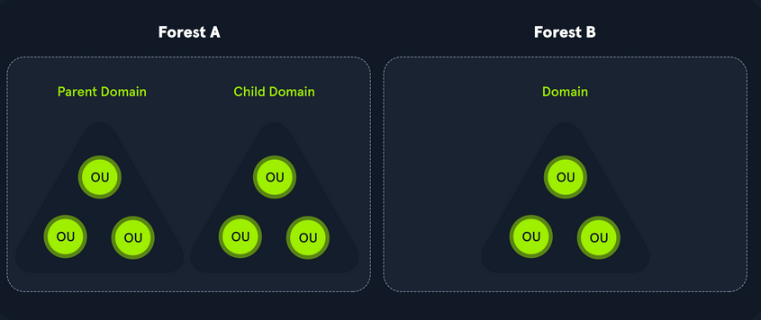
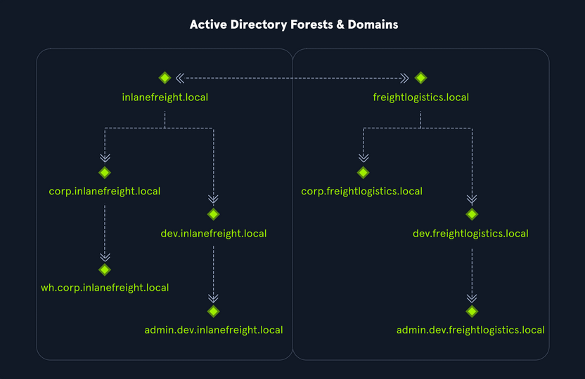
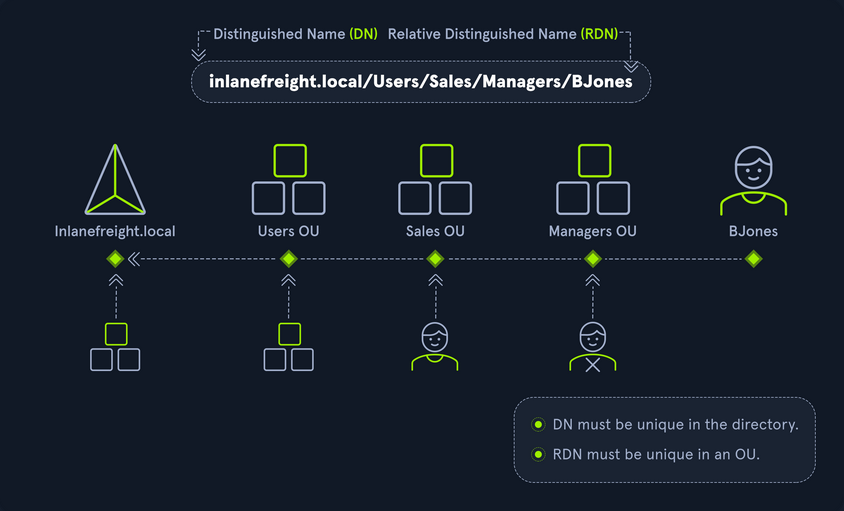
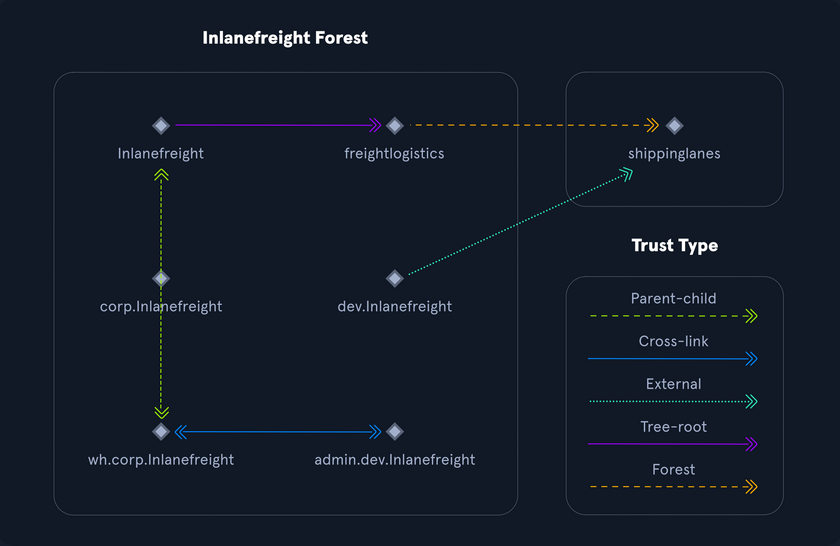
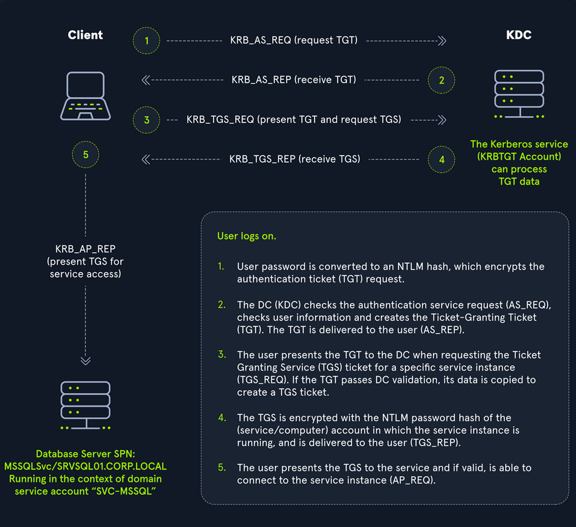
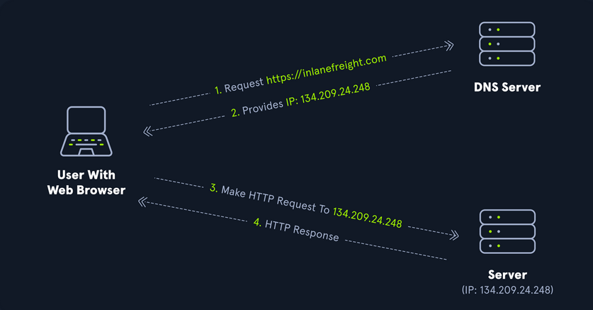
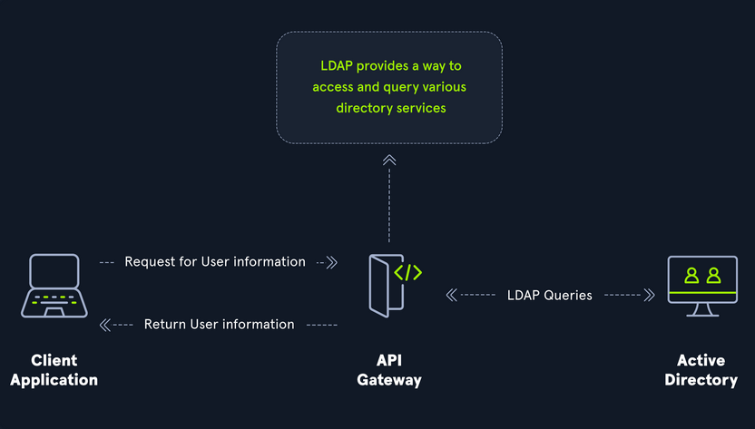

- [Introduction to Active Directory](#introduction-to-active-directory)
  - [Fundamentals](#fundamentals)
    - [Structure](#structure)
    - [Terminology](#terminology)
      - [Object](#object)
      - [Attributes](#attributes)
      - [Schema](#schema)
      - [Domain](#domain)
      - [Forest](#forest)
      - [Tree](#tree)
      - [Container](#container)
      - [Leaf](#leaf)
      - [Global Unique Identifier (_GUID_)](#global-unique-identifier-guid)
      - [Security Principals](#security-principals)
      - [Security Identifier (_SID_)](#security-identifier-sid)
      - [Distinguished Name (_DN_)](#distinguished-name-dn)
      - [Relative Distinguished Name (_RND_)](#relative-distinguished-name-rnd)
      - [sAMAccountName](#samaccountname)
      - [userPrincipalName](#userprincipalname)
      - [FSMO Roles](#fsmo-roles)
      - [Global Catalog](#global-catalog)
      - [Read-Only Domain Controller (_RODC_)](#read-only-domain-controller-rodc)
      - [Replication](#replication)
      - [Service Principal Name (_SPN_)](#service-principal-name-spn)
      - [Group Policy Object (_GPO_)](#group-policy-object-gpo)
      - [Access Control List (_ACL_)](#access-control-list-acl)
      - [Access Control Entries (_ACEs_)](#access-control-entries-aces)
      - [Discretionary Access Control List (_DACL_)](#discretionary-access-control-list-dacl)
      - [System Access Control Lists (_SACL_)](#system-access-control-lists-sacl)
      - [Fully Qualified Domain Name (_FQDN_)](#fully-qualified-domain-name-fqdn)
      - [Tombstone](#tombstone)
      - [AD Recycle Bin](#ad-recycle-bin)
      - [SYSVOL](#sysvol)
      - [AdminSDHolder](#adminsdholder)
      - [dsHeuristics](#dsheuristics)
      - [adminCount](#admincount)
      - [AD Users and Computer (_ADUC_)](#ad-users-and-computer-aduc)
      - [ADSI Edit](#adsi-edit)
      - [sIDHistory](#sidhistory)
      - [NTDS.DIT](#ntdsdit)
      - [MSBROWSE](#msbrowse)
    - [AD Objects](#ad-objects)
      - [Users](#users)
      - [Contacts](#contacts)
      - [Printers](#printers)
      - [Computers](#computers)
      - [Shared Folders](#shared-folders)
      - [Groups](#groups)
      - [OUs](#ous)
      - [Domain](#domain-1)
      - [Domain Controllers](#domain-controllers)
      - [Sites](#sites)
      - [Built-In](#built-in)
      - [Foreign Security Principals](#foreign-security-principals)
    - [AD Functionality](#ad-functionality)
      - [Domain and Forest Functional Levels](#domain-and-forest-functional-levels)
      - [Trusts](#trusts)
  - [Protocols](#protocols)
    - [Kerberos, DNS, LDAP, MSRPC](#kerberos-dns-ldap-msrpc)
      - [Kerberos](#kerberos)
        - [Kerberos Authentication Process](#kerberos-authentication-process)
      - [DNS](#dns)
        - [Forward DNS Lookup](#forward-dns-lookup)
        - [Reverse DNS Lookup](#reverse-dns-lookup)
        - [Finding IP Address of a Host](#finding-ip-address-of-a-host)
      - [LDAP](#ldap)
        - [AD LDAP Authentication](#ad-ldap-authentication)
      - [MSRPC](#msrpc)

---

# Introduction to Active Directory

Active Directory (_AD_) is a directory service for Windows network environments. It is a distributed, hierarchical structure that allows for centralized management of an organization's resources, including users, computers, groups, network devices, file shares, group policies, devices and trusts. AD provides authentication and authorization functions within a Windows domain environment. It has come under increasing attack in recent years. It is designed to be backward-compatible, and many features are arguably not "secure by default", and it can be easily misconfigured. This weakness can be leveraged to move laterally and vertically within a network and gain unauthorized access. AD is essentially a sizeable read-only database accessible to all users within the domain, regardless of their privilege level. A basic AD user account with no added privileges can enumerate most objects within AD. This fact makes it extremely important to properly secure an AD environment because ANY user account, regardless of their privilege level, can be used to enumerate the domain and hunt for misconfigurations and flaws thoroughly. Also, multiple attacks can be performed with only a standard domain user accout, showing the importance of a defense-in-depth strategy and careful planning focusing on security and hardening AD, network segmentation, and least privilege.

AD makes information easy to find and use for admins and users. AD is highly scalable, supports millions of objects per domain, and allows the creation of additional domains as an organization grows.

## Fundamentals

### Structure

AD is arranged in a hierarchical tree structure, with a forest at the top containing one or more domains, which can themselves have nested subdomains. A forest is the security within which all objects are under administrative control. A forest may contain multiple domains, and a domain may include further child or sub-domains. A domain is a structure within which contained objects (_users, computers, groups_) are accessible. It has many built-in Organizational Units (_OUs_), such as "Domain Controllers", "Users", "Computers", and new OUs can be created as required. OUs may contain objects and sub-OUs, allowing for the assignment of different group policies.

At a very simplistic high level, an AD structure may look as follows:

```
INLANEFREIGHT.LOCAL/
├── ADMIN.INLANEFREIGHT.LOCAL
│   ├── GPOs
│   └── OU
│       └── EMPLOYEES
│           ├── COMPUTERS
│           │   └── FILE01
│           ├── GROUPS
│           │   └── HQ Staff
│           └── USERS
│               └── barbara.jones
├── CORP.INLANEFREIGHT.LOCAL
└── DEV.INLANEFREIGHT.LOCAL
```

Here you could say that ```INLANEFREIGHT.LOCAL``` is the root domain and contains the subdomains ```ADMIN.INLANEFREIGHT.LOCAL```, ```CORP.INLANEFREIGHT.LOCAL```, and ```DEV.INLANEFREIGHT.LOCAL``` as well as the other objects that make up a domain such as users, groups, computers, and more as you will see in detail below. It is common to see multiple domains (_or forests_) linked together via trust relationships with another domain/forest than recreate all new users in the current domain. Domain trusts can introduce a slew of security issues if not appropriately administered.



The graphic below shows two forests, ```INLANEFREIGHT.LOCAL``` and ```FREIGHTLOGISTICS.LOCAL```. The two-way arrow represents a bidirectional trust between the two forests, meaning that users in ```INLANEFREIGHT.LOCAL``` can access resources in ```FREIGHTLOGISTICS.LOCAL``` and vice versa. You can also see multiple child domains under each root domain. In this example, you can see that the root domain trusts each of the child domains, but the child domains in forest A do not necessarily have trusts established with the child domains in forest B. This means that a user that is part of ```admin.dev.freightlogistics.local``` would not be able to authenticate to machines in the ```wh.corp.inlanefreight.local``` domain by default even though a bidirectional trust exists between the top-level ```inlanefreight.local``` and ```freightlogistics.local``` domains. To allow direct communication from ```admin.dev.freightlogistics.local``` and ```wh.corp.inlanefreight.local``` another trust would need to be set up.



### Terminology

#### Object

... can be defined as ANY resource present within an AD environment such as OUs, printers, users, domain controller, etc.

#### Attributes

Every object in AD has an associated set of attributes used to define characteristics of the given object. A computer object contains attributes such as the hostname and DNS name. All attributes in AD have an associated LDAP name that can be used when performing LDAP queries, such as ```displayName``` for ```Full Name``` and ```given name``` for ```First Name```.

#### Schema

The AD schema is essentially the blueprint of any enterprise environment. It defines what types of objects can exist in the AD database and their associated attributes. It lists definitions corresponding to AD objects and holds information about each object. For example, users in AD belong to the class "user", and computer objects to "computer", and so on. Each object has its own information that are stored in Attributes. When an object is created from a class, this is called instantiation, and an object created from a specific class is called an instance of that class. For example, if you take the computer RDS01. This computer object is an instance of the "computer" class in AD.

#### Domain

... is a logical group of objects such as computers, users, OUs, grous, etc. You can think of each domain as a different city within a state or country. Domains can operate entirely independently of one another or be connected via trust relationships.

#### Forest

... is a collection of AD domains. It is the topmost container and contains all of the AD objects introducec below, including but not limited to domains, users, groups, computers, and Group Policy objects. A forest can contain one or multiple domains and be thought of as a state in the US or a country within the EU. Each forest operates independently but may have various trust relationships with other forests.

#### Tree

... is a collection of AD domains that begins at a single root domain. A forest is a collection of AD trees. Each domain in a tree shares a boundary with the other domains. A parent-child trust relationship is formed when a domain is added under another domain in a tree. Two trees in the same forest cannot share a name. Say you have two trees in an AD forest: ```inlanefreight.local``` and ```ilfreight.local```. A child domain of the first would be ```corp.inlanefreight.local``` while a child domain of the second could be ```corp.ilfreight.local```. All domains in a tree share a standard Global Catalog which contains all information about objects that belong to the tree.

#### Container

Container objects hold other objects and have a defined place in the directory subtree hierarchy.

#### Leaf

Leaf objects do not contain other objects and are found at the end of the subtree hierarchy.

#### Global Unique Identifier (_GUID_)

a GUID is a unique 128-bit value assigned when a domain user or group is created. This GUID value is uniqu across the enterprise, similar to a MAC address. Every single object created by AD is assigned a GUID, not only user and group objects. The GUID is stored in the ```ObjectGUID``` attribute. When querying for an AD object, you can query for its ```objectGUID``` value using PowerShell or search for it by specifying its distinguished name, GUID, SID, or SAM account name. GUIDs are used by AD to identify objects internally. Searching in AD by GUID value is probably the most accurate and reliable way to find the exact object you are looking for, especially if the global catalog may contain similar matches for an object name. Specifying the ```ObjectGUID``` value when performing AD enumeration will ensure that you get the most accurate results pertaining to the object you are searching for information about. The ```ObjectGUID``` property never changes and is associated with the object for as long as that object exists in the domain.

#### Security Principals

... are anything that the OS can authenticate, including users, computers, accounts, or even threads/processes that run in the context of a user or computer account. In AD, security principals are domain objects that can manage access to other resources within the domain. You can also have local user accounts and security groups used to control access to resources on only that specific computer. These are not managed by AD but rather by the Security Accouns Manager (_SAM_).

#### Security Identifier (_SID_)

... is used as a unique identifier for a security principal or security group. Every account, group, or process has its own unique SID, which, in an AD environment, is issued by the domain controller and stored in a secure database. A SID can only be used once. When a user logs in, the system creates an access token for them which contains the user's SID, the rights they have been granted, and the SIDs for any groups that the user is a member of. This token is used to check rights whenever the user performs an action on the computer. There are also well-known SIDs that are used to identify generic users and groups. These are the same across all OS.

#### Distinguished Name (_DN_)

... describes the full path to an object in AD (_such as ```cn=bjones, ou=IT, ou=Employees, dc=inlanefreight, dc=local```_). In this example, the user ```bjones``` works in the IT department of the company Inlanefreight, and his account is created in an OU that holds accounts for company employees. The Common Name (_CN_) ```bjones``` is just one way the user object could be searched for or accessed within the domain.

#### Relative Distinguished Name (_RND_)

... is a single component of the DN that identifies the object as unique from other objects at the current level in the naming hierarchy. In your example, ```bjones``` is the Relative Distinguished Name of the object. AD does not allow two objects with the same name under the same parent container, but there can be two objects with the same RDNs that are still unique in the domain because they have different DNs. For example, the object ```cn=bjones,dc=dev,dc=inlanefreight,dc=local``` would be recognized as different from ```cn=bjones,dc=inlanefreight,dc=local```.



#### sAMAccountName

... is the user's logon name. Here it would just be ```bjones```. It must be a unique value and 20 or fewer chars.

#### userPrincipalName

... attribute is another way to identify users in AD. This attribute consists of a prefix and a suffix in the format of ```bjones@inlanefreight.local```. This attribute is not mandatory.

#### FSMO Roles

In the early days of AD, if you had multiple DCs in an environment, they would fight over which DC gets to make changes, and sometimes changes would not be made properly. Microsoft then implemented "last writer wins", which could introduce its own problems if the last change breaks things. They then introduced a model in which a single "master" DC could apply changes to the domain while the others merely fulfilled authentication requests. This was a flawed design because if the master DC went down, no changes could be made to the environment until it was restored. To resolve this single point of failure model, Microsoft separated the various responsibilities that a DC can have into Flexible Single Master Operation (_FSMO_) roles. These give DCs the ability to continue authenticating users and granting permissions without interruption. There are five FSMO roles: Schema Master and Domain Naming Master (_one of each per forest_), Relative ID (RID) Master (_one per domain_), Primary Domain Controller (PDC) Emulator (_one per domain_), and Infrastructure Master (_one per domain_). All five roles are assigned to the first DC in the forest root domain in a new AD forest. Each time a new domain is added to a forest, only the RID Master, PDC Emulator, and Infrastructure Master roles are assigned to the new domain. FSMO roles are typically set when domain controllers are created, but sysadmins can transfer these roles if needed. These roles help replication in AD to run smoothly and ensure that critical services are operating correctly.

#### Global Catalog

... is a domain that stores copies of ALL objects in an AD forest. The GC stores a full copy of all objects in the current domain and a partial copy of objects that belong to other domains in the forest. Standard domain controllers hold a complete replica of objects belonging to its domain but not those of different domains in the forest. The GC allows both users and apps to find information about any objects in ANY domain in the forest. GC is a feature that is enabled on a domain controller and performs the following functions:

- Authentication
- Object Search

#### Read-Only Domain Controller (_RODC_)

... has a read-only AD database. No AD account passwords are cached on an RODC. No changes are pushed out via an RODC's AD database, SYSVOL, or DNS. RODCs also include a read-only DNS server, allow for administrator separation, reduce replication traffic in the environment, and prevent SYSVOL modifications from being replicated.

#### Replication

... happens in AD when AD objects are updated and transferred from one DC to another. Whenever a DC is added, connection objects are created to manage replication between them. These connections are made by the Knowledge Consistency Checker (_KCC_) service, which is present on all DCs. Replication ensures that changes are synchronized with all other DCs in a forest, helping to create a backup in case on DC fails.

#### Service Principal Name (_SPN_)

... uniquely identifies a service instance. They are used by Kerberos authentication to associate an instance of a service with a logon account, allowing a client application to request the service to authenticate an account without needing to know the account name.

#### Group Policy Object (_GPO_)

... are virtual collections of policy settings. Each GPO has a unique GUID. A GPO can contain local file system settings or AD settings. GPO settings can be applied to both user and computer objects. They can be applied to all users and computers within the domain or defined more granularly at the OU level.

#### Access Control List (_ACL_)

... is the ordered collection of Access Control Entries (_ACEs_) that apply to an object.

#### Access Control Entries (_ACEs_)

Each ACE in an ACL identifies a trustee (_user account, group account, or logon session_) and lists the access rights that are allowed, denied, or audited for the given trustee.

#### Discretionary Access Control List (_DACL_)

... defines which security principles are granted or denied access to an object; it contains a list of ACEs. When a process tries to access a securable object, the system checks the ACEs in the object's DACL to determine whether or not to grant access. If an object does not have a DACL, then the system will grant full access to everyone, but if the DACL has no ACE entries, the system will deny all access attempts. ACEs in the DACL are checked in sequence until a match is found that allows the requested rights until access is denied.

#### System Access Control Lists (_SACL_)

Allows for admins to log access attempts that are made to secured objects. ACEs specify the types of access attempts that cause the system to generate a record in the security event log.

#### Fully Qualified Domain Name (_FQDN_)

... is the complete name for a specific computer or host. It is written with the hostname and domain name in the format [host name].[domain name].[tld]. This is used to specify an object's location in the tree hierarchy of DNS. The FQDN can be used to locate hosts in an AD without knowing the IP address, much like when browsing to a website such as google.com instead of typing the associated IP address. An example would be the host ```DC01``` in the domain ```INLANEFREIGHT.LOCAL```. The FQDN here would be DC01.INLANEFREIGHT.LOCAL.

#### Tombstone

... is a container object in AD that holds deleted AD objects. When an object is deleted from AD, the object remains for a set period of time known as the Tombstone Lifetime, and the ```isDeleted``` attribute is set to ```TRUE```. Once an object exceeds the Tombstone Lifetime, it will be entirely removed. Microsoft recommends a tombstone lifetime of 180 days to increase the usefulness of backups, but this value may differ across environments. Depending on the DC OS version, this value will default to 60 or 180 days. If an object is deleted in a domain that does not have an AD Recycle Bin, it will become a tombstone object. When this happens, the object is stripped of most of its attributes and placed in the ```Deleted Objects``` container for the duration of the ```tombstoneLifetime```. It can be recovered, but any attributes that were lost can no longer be recovered.

#### AD Recycle Bin

... was introduced to facilitate the recovery of deleted AD objects. This made it easier for admins to restore objects, avoiding the need to restore from backups, restarting AD DS, or rebooting a DC. When the AD Recycle Bin is enabled, any deleted objects are preserved for a period of time, facilitating restoration if needed. Sysadmins can set how long an object remains in a deleted, recoverable state. If this is not specified, the object will be restorable for a default value of 60 days. The biggest advantage of using the AD Recycle Bin is that most of a deleted object's attributes are preserved, which makes it far easier to fully restore a deleted object to its previous state.

#### SYSVOL

The SYSVOL folder, or share, stores copies of public files in the domain such as system policies, Group Policy settings, logon/logoff scripts, and often contains other types of scripts that are executed to perform various tasks in the AD environment. The contents of the SYSVOL folder are replicated to all DCs within the environment using File Replication Services (_FRS_).

#### AdminSDHolder

The AdminSDHolder object is used to manage ACLs for members of built-in groups in AD marked as privileged. It acts as a container that holds the Security Descriptor applied to members of protected groups. The SDProp (_SD Propagator_) process runs on a schedule on the PDC Emulator DC. When this process runs, it checks members of protected groups to ensure that the correct ACL is applied to them. It runs every hour by default. For example, suppose an attacker is able to create a malicious ACL entry to grant a user certain rights over a member of the Domain Admins group. In that case, unless they modify other settings in AD, these rights will be removed when the SDProp process runs on the set interval.

#### dsHeuristics

The dsHeuristics attribute is a string value set on the Directory Service object used to define multiple forest-wide configuration settings. One of these settings is to exclude built-in groups from the Protected Groups list. Groups in this list are protected from modification via the AdminSDHolder object. If a group is excluded via the dsHeuristics attribute, then any changes that affect it will not be reverted when the SDProp process runs.

#### adminCount

The adminCount attribute determines whether or not the SDProp process protects a user. If the value is set to 0 or not specified, the user is not protected. If the attribute is set to 1, the user is protected. Attackers will often look for accounts with the ```adminCount``` attribute set to 1 to target in an internal environment. These are often privileged accounts and may lead to further access or full domain compromise.

#### AD Users and Computer (_ADUC_)

... is a GUI console commonly used for managing users, groups, computers, and contacts in AD. Changes made in ADUC can be done via PowerShell as well.

#### ADSI Edit

ADSI Edit is a GUI tool used to manage objects in AD. It provides access to far more than is available in ADUC and can be used to set or delete any attribute available on an object, add, remove, and move objects as well. It is a powerful tool that allows a user to access AD at a much deeper level. Great care should be taken when using this tool, as changes here could cause major problems in AD.

#### sIDHistory

This attribute holds any SIDs that an object was assigned previously. It is usually used in migrations so a user can maintain the same level of access when migrated from one domain to another. This attribute can potentially be abused if set insecurely, allowing an attacker to gain prior elevated access that an account had before a migration if SID filtering is not enabled.

#### NTDS.DIT

The NTDS.DIT file can be considered the heart of AD. It is stored on a DC at ```C:\Windows\NTDS\``` and is a database that stores AD data such as information about user and group objects, group membership, and, most important to attackers and pentesters, the password hashes for all users in the domain. Once full domain compromise is reached, an attacker can retrieve this file, extract the hashes, and either use them to perform a pass-the-hash attack or crack them offline to access additional resources in the domain. If the setting "Store password with reversible encryption" is enabled, then the NTDS.DIT will also store the cleartext passwords for all users created or who changed their passwords after this policy was set. While rare, some organizations may enable this setting if they use apps or protocols that need to use a user's existing password for authentication.

#### MSBROWSE

... is a Microsoft networking protocol that was used in early versions of Windows-based local area networks to provide browsing services. It was used to maintain a list of resources, such as shared printers and files, that were available on the network, and to allow users to easily browse and access these resources.

In older versions of Windows you could use ```nbtstat -A ip-address``` to search for the Master Browser. If you see MSBROWSE it means that's the Master Browser. Additionally you could use ```nltest``` utility to query a Windows Master Browser for the names of the DCs.

Today, MSBROWSE is largely obsolete and is no longer in widespread use. Modern Windows-based LANs use the Server Message Block (_SMB_) protocol for file and printer sharing, and the Common Internet File System (_CIFS_) protocol for browsing services.

### AD Objects

#### Users

These are the users within the organization's AD. Users are considered leaf objects, which means that they cannot contain any other objects within them. An user object is considered a security principal and has a security identifier and a global unique identifier. User objects have many possible attributes, such as their display name, last login time, date of last password change, email address, account description, manager, address, and more. Depending on how a particular AD envinronment is set up, there can be over 800 possible user attributes when accounting for all possible attributes. They are a crucial target for attackers since gaining access to even a low privileged user can grant access to many objects and resources and allow for detailed enumeration of the entire domain (_or forest_).

#### Contacts

A contact object is usually used to represent an external user and contains informational attributes such as first name, last name, email address, telephone number, etc. They are leaf objects and are not security principals, so they don't have a SID, only a GUID. An example would be a contact card for a third-party vendor or a customer.

#### Printers

A printer object points to a printer accessible within the AD network. Like a contact, a printer is a leaf object and not a security principal, so it only has a GUID. Printers have attributes such as the printer's name, driver information, port number, etc.

#### Computers

A computer object is any computer joined to the AD network. Computers are leaf objects because they do not contain other objects. However, they are considered security principals and have a SID and a GUID. Like users, they are prime targets for attackers since full administrative access to a computer grants similar rights to a standard domain user and can be used to perform the majority of the enumeration tasks that a user account can.

#### Shared Folders

A shared folder object points to a shared folder on a specific computer where the folder resides. Shared folders can have stringent access control applied to them and can either be accessible to everyone, open to only authenticated users, or be locked down to only allow certain users/groups access. Anyone not explicitly allowed access will be denied from listing or reading its contents. Shared folders are not security principals and only have a GUID. A shared folder's attribute can include the name, location on the system, security access rights.

#### Groups

a group is considered a container object because it can contain other objects, including users, computers, and even other groups. A group is regarded as a security principal and has a SID and a GUID. In AD, groups are a way to manage user permissions and access to other securable objects. Say you want to give 20 help desk users access to tthe Remote Management Users group on a jump host. Instead of adding the users one by one, you could add the group, and the users would inherit the intended permissions via their membership in the group. In AD, you commonly see what are called "nested groups", which can lead to a user(s) obtaining unintended rights. Nested groups membership is something you see and often leverage during penetration tests. The tool BloodHound helps to discover attack paths within a network and illustrate them in a graphical interface. It is excellent for auditing group membership and unvovering/seeing the sometimes unintended impacts of nested group membership. Groups in AD can have many attributes, the most common being the name, description, membership, and other groups that the group belongs to. Many other attributes can be set.

#### OUs

... are containers that system administrators can use to store similar objects for ease of administration. OUs are often used for administrative delegation of tasks without granting a user account full administrative rights. For example, you may have a top-level OU called "Employees" and then child OUs under it for various departments such as "Marketing", "HR", "Finance", "Help Desk", etc. If an account were given the right to reset passwords over the top-level OU, this user would have the right to reset passwords for all users in the company. However, if the OU structure were such that specific departments were child OUs of the "Help Desk" OU, then any user placed in the "Help Desk" OU would have this right delegated to them if granted. Other tasks that may be delegated at the OU level include creating/deleting users, modifying group membership, managing Group Policy links, and performing password resets. OUs are very useful for managing Group Policy settings across a subset of users and groups within a domain. For example, you may want to set a specific policy for privileged service accounts so these accounts could be placed in a particular OU and then have a Group Policy object assigned to it, which would enforce this password policy on all accounts placed inside of it. A few OU attributes include its name, members, security settings, and more.

#### Domain

a domain is the structure of an AD network. Domains contain objects such as users and computers, which are organized into container objects: groups, and OUs. Every domain has its own separate database and sets of policies that can be applied to any and all objects within the domain. Some policies are set by default, such as the domain password policy. In contrast, others are created and applied based on the organization's need, such as blocking access to cmd.exe for all-non administrative users or mapping shared drives at log in.

#### Domain Controllers

... are essentially the brains of an AD network. They handle authentication requests, verify users on the network, and control who can access the various resources in the domain. All access requests are validated via the DC and privileged access requests are based on predetermined roles assigned to users. It also enforces security policies and stores information about every other object in the domain.

#### Sites

A site in AD is a set of compuers across one or more subnets connected using high-speed links. They are used to make replication across domain controllers run efficiently.

#### Built-In

In AD, built-in is a container that holds default groups in an AD domain. They are predefined when an AD domain is created.

#### Foreign Security Principals

A foreign security principal (_FSP_) is an object created in AD to represent a security principal that belongs to a trusted external forest. They are created when an object such as a user, group, or computer from an external forest is added to a group in the current domain. They are created automatically after adding a security principal to a group. Every foreign security principal is a placeholder object that holds the SID of the foreign object. Windows uses this SID to resolve to object's name via the trust relationship. FSPs are created in a specific container named ForeignSecurityPrincipals with a distinguished name like ```cn=ForeignSecurityPrincipals,dc=inlanefreight,dc=local```.

### AD Functionality

There are five Flexible Single Master Operation roles. These roles can be defined as follows:

| Role | Description |
| ---- | ----------- |
| Schema Master | manages the read/write copy of the AD schema, which defines all attributes that can apply to an object in AD |
| Domain Naming Master | manages domain names and ensures that two domains of the the same name are not created in the same forest |
| Relative ID Master | assigns blocks of RIDs to other DCs within the domain that can be used for new objects; the RID master helps ensure that multiple objects are not assigned the same SID. Domain object SIDs are the domain SID combined with the RID number assigned to the object to make the unique SID |
| PDC Emulator | the host with this role would be the authoritive DC in the domain and respond to authentication requests, password changes, and manage Group Policy Objects (_GPOs_); the PDC Emulator also maintains time within the domain |
| Infrastructure Master | this role translates GUIDs, SIDs, and DNs between networks; this role is used in organizations with multiple domains in a single forest; helps them to communicate; if this role is not functioning properly, ACLs will show SIDs instead of fully resolved names |

#### Domain and Forest Functional Levels

Microsoft introduced functional levels to determine the various features and capabilities available in AD DS at the domain and forest level. They are also used to specify which Windows Server OS can run a DC in a domain or forest.

| Domain Functional Level | Featues Available | Supported DC OS |
| ----------------------- | ----------------- | --------------- |
| Windows 2000 native | universal groups for distribution and security groups, group nesting , group conversion, SID history | Windows Server 2008 R2, Windows Server 2008, Windows Server 2003, Windows 2000 |
| Windows Server 2003 | Netdom.exe domain management tool, lastLogonTimestamp attribute introduced, well-known users and computers containers, constrained delegation, selective authentication | Windows Server 2012 R2, Windwos Server 2012, Windows Server 2008 R2, Windows Server 2008, Windows Server 2003 |
| Windows Server 2008 | Distributed File System replication support, Advanced Encryption Standard support for the Kerberos protocol, fine-grained password policies | Windows Server 2012 R2, Windows Server 2012, Windows Server 2008 R2, Windows Server 2008 |
| Windows Server 2008 R2 | authentication mechanism assurance, managed service accounts | Windows Server 2012 R2, Windows Server 2012, Windows Server 2008 R2 |
| Windows Server 2012 | KDC support for claims, compound authentication, and Kerberos armoring | Windows Server 2012 R2, Windows Server 2012 |
| Windows Server 2012 R2 | extra protections for members of the Protected Users group, authentication policies, authentication policy silos | Windows Server 2012 R2 |
| Windows Server 2016 | smart card required for interactive logon new Kerberos features and new credential protection features | Windows Server 2019 and Windows Server 2016 |

A new functional level was not added with the release of Windows Server 2019. However, Windows Server 2008 functional level is the minimum requirement for adding Server 2019 DC to an environment. Also, the target domain has to use DFS-R for SYSVOL replication.

Forest functional levels have introduced a few key capabilties over the years:

| Version | Capabilities |
| ------- | ------------ |
| Windows Server 2003 | saw the introduction of the forest trust, domain renaming, read-only DCs, and more |
| Windows Server 2008 | all new domains added to the forest default to the Server 2008 domain functional level; no additional new features |
| Windows Server 2008 R2 | AD Recycle Bin provides the ability to restore deleted objects when AD DS is running |
| Windows Server 2012 | all new domains added to the forest default to the Server 2012 domain functional level; no additional new features |
| Windows Server 2012 R2 | all new domains added to the forest default to the Server 2012 R2 functional level; no additional new features |
| Windows Server 2016 | privileged access management using Microsoft Identity Manager |

#### Trusts

A trust is used to establish forest-forest or domain-domain authentication, allowing users to access resources in another domain outside of the domain their account resides in. A trust creates a link between the authentication systems of two domains.

There a several trust types:

| Trust Type | Description |
| ---------- | ----------- |
| Parent-Child | domains within the same forest; the child domain has two-way transitive trust with the parent domain |
| Cross-link | a trust between child domains to speed up authentication |
| External | a non-transitive trust between two separate domains in separate forests which are not already joined by a forest trust; this type of trust utilizes SID filtering |
| Tree-root | a two-way transitive trust between a forest root domain and a new tree root domain; they are created by design when you set up a new tree root domain within a forest |
| Forest | a transitive trust between two forest root domains |



Trusts can be transitive or non-transitive:

- a transitive trust means that trust is extended to objects that the child domain trusts
- in a non-transitive trust, only the child domain itself is trusted

Trusts can be set up one-way or two-way

- in bidirectional trusts, users from both trusting domains can access resources
- in a one-way trust, only users in a trusted domain can access resources in a trusting domain, not vice-versa; the direction of trust is opposite to the direction of access

Often, domain trusts are set up improperly and provide unintended attack paths. Also, trusts set up for ease of use may not be reviewed later for potential security implications. Mergers and acquisitions can result in bidirectional trusts with acquired companies, unknowingly introducing risk into the acquiring company's environment. It is not uncommon to be able to perform an attack such as Kerberoasting against a domain outside the principal domain and obtain a user that has administrative access within the principal domain.

## Protocols

### Kerberos, DNS, LDAP, MSRPC

#### Kerberos

... has been the default authentication protocol for domain accounts since Windows 2000. Kerberos is an open standard and allows for interoperability with other systems using the same standard. When a user logs into their PC, Kerberos is used to authenticate them via mutual authentication, or both the user and the server verify their identity. Kerberos is a stateless authentication protocol based on tickets instead of transmitting user passwords over the network. As part of AD DS, DCs have a Kerberos Key Distribution Center (_KDC_) that issues tickets. When a user initiates a login request to a system, the client they are using to authenticate to requests a ticket from the KDC, encrypting the request with the user's password. If the KDC can decrypt the request using their password, it will create a Ticket Granting Ticket (_TGT_) and transmit it to the user. The user then presents its TGT to a DC to request a Ticket Granting Service (_TGS_) ticket, encrypted with the associated service's NTLM password hash. Finally, the client requests access to the required service by presenting the TGS to the application or service, which decrypts it with its password hash. If the entire process completes appropriately, the user will be permitted to access the requested service or application.

##### Kerberos Authentication Process

1. When a user logs in, their password is used to encrypt a timestamp, which is sent to the KDC to verify the integrity of the authentication by decrypting it. The KDC then issues a TGT, encrypting it with the secret key of the KRBTGT account. This TGT is used to request service tickets for accessing network resources, allowing authentication without repeatedly transmitting the user's creds. This process decouples the user's creds from requests to resources.
2. The KDC service on the DC checks the authentication service request, verifies the user information, and creates a TGT, which is delivered to the user.
3. The user presents the TGT to the DC, requesting a TGS ticket for a specific service. This is the TGS-REQ. If the TGT is successfully validated, its data is copied to create a TGS ticket.
4. The TGS is encrypted with the NTLM password hash of the service or computer account in whose context the service instance is running and is delivered to the user in the TGS_REP.
5. The user presents the TGS to the service, and if it is valid, the user is permitted to connect to the resource (_AP\_REQ_).



The Kerberos protocol uses port 88 (_both TCP and UDP_). When enumerating an AD environment, you can often locate DCs by performing port scans looking for open port 88 using nmap.

#### DNS

AD DS uses DNS to allow clients to locate DCs and for DCs that host the directory service to communicate amongst themselves. DNS is used to resolve hostnames to IP addresses and is broadly used across internal networks and the internet. Private internal networks use AD DNS namespaces to facilitate communications between servers, clients, and peers. AD maintains a database of services running on the network in the form of service records (_SRV_). These service records allow clients in an AD environment to locate services that they need, such as file server, printer, or DC. Dynamic DNS is used to make changes in the DNS database automatically should a system's IP address change. Making these entries manually would be very time-consuming and leave room for error. If the DNS database does not have the correct IP address for a host, clients will not be able to locate and communicate with it on the network. When a client joins the network, it locates the DC by sending a query to the DNS service, retrieving an SRV record from the DNS database, and transmitting the DC's hostname to the client. The client then uses this hostname to obtain the IP address of the DC. DNS uses TCO and UDP port 53. UDP port 53 is the default, but it falls back to TCP when no longer able to communicate and DNS messages are larger than 512 bytes.



##### Forward DNS Lookup

You can perform a ```nslookup``` for the domain name and retrieve all DCs' IP addresses in a domain:

```ps
PS C:\htb> nslookup INLANEFREIGHT.LOCAL

Server:  172.16.6.5
Address:  172.16.6.5

Name:    INLANEFREIGHT.LOCAL
Address:  172.16.6.5
```

##### Reverse DNS Lookup

If you would like to obtain DNS name of a single host using the IP address, you can to this as follows:

```ps
PS C:\htb> nslookup 172.16.6.5

Server:  172.16.6.5
Address:  172.16.6.5

Name:    ACADEMY-EA-DC01.INLANEFREIGHT.LOCAL
Address:  172.16.6.5
```

##### Finding IP Address of a Host

If you would like to find the IP address of a single host, you can do this in reverse. You can do this with or without specifying the FQDN.

```ps
PS C:\htb> nslookup ACADEMY-EA-DC01

Server:   172.16.6.5
Address:  172.16.6.5

Name:    ACADEMY-EA-DC01.INLANEFREIGHT.LOCAL
Address:  172.16.6.5
```

#### LDAP

AD supports Lightweight Directory Access Protocol for directory lookups. LDAP is an open-source and cross-platform protocol used for authentication against various directory services. The latest LDAP specification is Version 3, published as RFC 4511. A firm understanding of how LDAP works in an AD environment is crucial for attackers and defenders. LDAP uses port 389, and LDAP over SSL (_LDAPS_) communicates over port 636.

AD stores user account information and security information such as passwords and facilitates sharing this information with other devices on the network. LDAP is the language that applications use to communicate with other servers that provide directory services. In other words, LDAP is how systems in the network environment can "speak" to AD.

An LDAP session begins by first connecting to an LDAP server, also known as a Directory System Agent. The DC in AD actively listens for LDAP requests, such as security authentication requests.



The relationship between AD and LDAP can be compared to Apache and HTTP. The same way Apache is a web server that uses HTTP protocol, AD is a directory server that uses the LDAP protocol.

While uncommon, you may come across organizations while performing an assessment that do not have AD but are using LDAP, meaning that they most likely use another type of LDAP server such as OpenLDAP.

##### AD LDAP Authentication

LDAP is set up to authenticate creds against AD using a "BIND" operation to set the authentication state for an LDAP session. There are two types of LDAP authentication:

1. Simple Authentication
   1. This includes anonymous authentication, unauthenticated authenticationm and username/password authentication. Simple authentication means that a username and password create a BIND request to authenticate to the LDAP server.
2. SASL Authentications
   1. The Simple Authentication and Security Layer framework uses other authentication services, such as Kerberos, to bind to the LDAP server and then uses this authentication service to authenticate to LDAP. The LDAP server uses the LDAP protocol to send an LDAP message to the authorizaton service, which initiates a series of challenge/response messages resulting in either successful or unsuccessful authentication. SASL can provide additional security due to the separation of authentication methods from application protocols.

#### MSRPC

MSRPC is Microsoft's implementation of Remote Procedure Call (_RPC_), an interprocess communication technique used for client-server model-based applications. Windows systems use MSRPC to access systems in AD using four key RPC interfaces.

| Interface Name | Description |
| -------------- | ----------- |
| lsarpc | a set of RPC calls to the Local Security Authority system which manages the local security policy on a computer, controls the audit policy, and provides interactive authentication services; LSARPC is used to perform management on domain security policies |
| netlogon | is a Windows process used to authenticate users and other services in the domain environment; it is a service that continuously runs in the background |
| samr | remote SAM provides management functionality for the domain account database, storing information about users and groups; IT admins use the protocol to manage users, groups, and computers by enabling admins to create, read, update, and delete information about security principles; attackers can use the samr protocol to perform reconnaissance about the internal domain using tools like BloodHound to visually map out the AD network and create "attack paths" to illustrate visually how administrative access or full domain compromise could be achieved; organizations can protect against this type of reconnaissance by changing a Windwos registry key to only allow admins to perform remote SAM queries, by default, all authenticated domain users can make these queries to gather a considerable amount of information about the AD domain |
| drsuapi | drsuapi is the Microsoft API that implements the Directory Replication Service Remote Protocol which is used to perform replication-related tasks across DCs in a multi-DC environment; attackers can utilize drsuapi to create a copy of the AD domain database file to retrieve password hashes for all accounts in the domain, which can then be used to perform Pass-the-Hash attacks to access more systems or cracked offline to obtain the cleartext password to log in to systems using remote management protocols such as RDP and WinRM |

