- [Windows Fundamentals](#windows-fundamentals)
  - [Intro](#intro)
    - [Versions](#versions)
    - [Accessing Windows](#accessing-windows)
      - [Local Access Concepts](#local-access-concepts)
      - [Remote Access Concepts](#remote-access-concepts)
        - [RDP](#rdp)
  - [Operating System](#operating-system)
    - [Structure](#structure)
      - [Exploring Dirs using the Command Line](#exploring-dirs-using-the-command-line)
    - [File System](#file-system)
      - [Permissions](#permissions)
      - [Integrity Control Access List (_icacls_)](#integrity-control-access-list-icacls)
    - [NTFS vs. Share Permissions](#ntfs-vs-share-permissions)
      - [Share Permissions](#share-permissions)
      - [NTFS Basic Permissions](#ntfs-basic-permissions)
      - [NTFS Special Permissions](#ntfs-special-permissions)
      - [Creating a Network Share](#creating-a-network-share)
      - [Windows Firewall Considerations](#windows-firewall-considerations)
      - [Mounting to the Share](#mounting-to-the-share)
      - [Displaying Shares using net share](#displaying-shares-using-net-share)
      - [Viewing Share Access Logs in Event Viewer](#viewing-share-access-logs-in-event-viewer)
  - [Services \& Processes](#services--processes)
    - [Services](#services)
    - [Processes](#processes)
      - [Local Security Authority Subsystem Service (_LSASS_)](#local-security-authority-subsystem-service-lsass)
      - [Sysinternals Tools](#sysinternals-tools)
      - [Task Manager](#task-manager)
      - [Process Explorer](#process-explorer)
    - [Service Permissions](#service-permissions)
      - [Examining Services using services.msc](#examining-services-using-servicesmsc)
      - [Examining Services using sc](#examining-services-using-sc)
      - [Examining Service Permissions using PowerShell](#examining-service-permissions-using-powershell)
  - [Interaction](#interaction)
    - [Windows Sessions](#windows-sessions)
      - [Interactive](#interactive)
      - [Non-Interactive](#non-interactive)
    - [Interacting with the Windows OS](#interacting-with-the-windows-os)
      - [CMD](#cmd)
      - [PowerShell](#powershell)
        - [Cmdlets](#cmdlets)
        - [Aliases](#aliases)
        - [help](#help)
        - [Running Scripts](#running-scripts)
        - [Execution Policy](#execution-policy)
    - [Windows Management Instrumentation (_WMI_)](#windows-management-instrumentation-wmi)
  - [Further Windows Usage](#further-windows-usage)
    - [Microsoft Management Console (_MMC_)](#microsoft-management-console-mmc)
    - [Windows Subsystem for Linux (_WSL_)](#windows-subsystem-for-linux-wsl)
    - [Server Core](#server-core)
  - [Windows Security](#windows-security)
    - [Security Identifier (_SID_)](#security-identifier-sid)
    - [Security Accounts Manager (_SAM_) and Access Control Entries (_ACE_)](#security-accounts-manager-sam-and-access-control-entries-ace)
    - [User Account Control (_UAC_)](#user-account-control-uac)
    - [Registry](#registry)
    - [Run and RunOnce Registry Keys](#run-and-runonce-registry-keys)
    - [Application Whitelisting](#application-whitelisting)
    - [AppLocker](#applocker)
    - [Local Group Policy](#local-group-policy)
    - [Windows Defender Antivirus](#windows-defender-antivirus)

---

# Windows Fundamentals

## Intro

Microsoft first introduced the Windows OS on November 20, 1985. The first version of Windows was a graphical OS shell for MS-DOS. Later versions of Windows Desktop introduced the Windows File Manager, Program Manager, and Print Manager programs.

As new versions of Windows are introduced, older versions are deprecated and no longer receive Microsoft updates.

Many versions are now deemed "legacy" and are no longer supported. Organizations often find themselves running various older OS to support critical applications or due to operational or budgetary concerns. An assessor needs to understand the differences between versions and the various misconfigurations and vulnerabilities inherent to each.

### Versions

| OS Name | Version Number |
| ------- | -------------- |
| Windows NT 4 | 4.0 |
| Windows 2000 | 5.0 |
| Windows XP | 5.1 |
| Windows Server 2003, 2003 R2 | 5.2 |
| Windows Vista, Server 2008 | 6.0 |
| Windows 7, Server 2008 R2 | 6.1 |
| Windows 8, Server 2012 | 6.2 |
| Windows 8.1, Server 2012 R2 | 6.3 |
| Windows 10, Server 2016, Server 2019 | 10.0 |

You can use the Get-WmiObject cmdlet to find information about the OS. This cmdlet can be used to get instances of WMI classes or information about available WMI classes. There are a variety of ways to find the version and build number of your system. You can easily obtain this information using the ```win32_OperatingSystem``` class.

```ps
PS C:\htb> Get-WmiObject -Class win32_OperatingSystem | select Version,BuildNumber

Version    BuildNumber
-------    -----------
10.0.19041 19041
```

### Accessing Windows

#### Local Access Concepts

Local access is the most common way to access any computer, including computers running Windows.

#### Remote Access Concepts

Remote Access is accessing a computer over a network. Local access to a computer is neede before one can access another computer remotely. There are countless methods for remote access.

Some of the most common remote access technologies include these:

- Virtual Private Networks (_VPN_)
- Secure Shell (_SSH_)
- File Transfer Protocol (_FTP_)
- Virtual Network Computing (_VNC_)
- Windows Remote Management (_WinRM_)
- Remote Desktop Protocol (_RDP_)

##### RDP

... uses a client/server architecture where a client-side application is used to specify a computer's target IP address or hostname over a network where RDP access is enabled. The target computer where RDP remote access is enabled is considered the server. It is important to note that RDP listens by default on logical port 3389. Keep in mind that an IP address is used as a logical identifier for a computer on a network, and a logical port is an identifier assigned to an application.

Once a request has reached a destination computer via its IP address, the request will be directed to an application hosted on the computer based on the port specified in that request.

If you are connecting to a Windows target from a Windows host, you can use the built-in RDP client application called RDP.

For this to work, remote access must already be allowed on the target Windows system. By default, remote access is not allowed on Windows OS.

RDP also allows you to save connection profiles. This is a common habit among IT admins because it makes connecting to remote systems more convenient.

From a Linux-based attack host you can use a tool called xfreerdp to remotely access Windows targets.

```bash
d41y@htb[/htb]$ xfreerdp /v:<targetIp> /u:htb-student /p:Password
```

## Operating System

### Structure

In Windows OS, the root directory is ```<drive_letter>:\(commonly C drive)```. The root directory is where the OS is installed. Other phyiscal and virtual drives are assigned other letters. The directory structure of the boot partition is as follows:

| Directory | Function |
| --------- | -------- |
| Perflogs | can hold Windows performance logs but is empty by default |
| Program Files | on 32-bit systems, all 16-bit and 32-bit programs are installed here; on 64-bit systems, only 64-bit programs are installed here |
| Program Files (x86) | 32-bit and 16-bit programs are installed here on 64-bit editions of Windows |
| Program Data | this is a hidden folder that contains data that is essential for certain installed programs to run; this data is accessible by the program no matter what user is running it |
| Users | this folder contains user profiles for each user that logs onto the system and contains the two folders Public and Default |
| Default | this is the default user profile template for all created users; whenever a new user is added to the system, their profile is based on the Default profile |
| Public | this folder is intended for computer users to share files and is accessible to all users by default; this folder is shared over the network by default but requires a valid network account to access |
| AppData | per user application data and settings are stored in a hidden user subfolder; each of these folders contains three subfolders; the roaming folder contains machine-independent data that should follow the user's profile, such as custom dictionaries; the local folder is specific to the computer itself and is never synchronized across the network; LocalLow is similar to the Local folder, but it has a lower data integrity level; therefore it can be used, for example, by a web browser set to protected or safe mode |
| Windows | the majority of the files required for the Windows OS are contained here |
| System, System32, SysWOW64 | contains all DLLs required for the core features of Windows and the Windows API; the OS searches these folders any time a program asks to load a DLL without specifying an absolute path |
| WinSxS | the Windows Component Store contains a copy of all Windows components, updates, and service packs |

#### Exploring Dirs using the Command Line

```code
C:\htb> dir c:\ /a
 Volume in drive C has no label.
 Volume Serial Number is F416-77BE

 Directory of c:\

08/16/2020  10:33 AM    <DIR>          $Recycle.Bin
06/25/2020  06:25 PM    <DIR>          $WinREAgent
07/02/2020  12:55 PM             1,024 AMTAG.BIN
06/25/2020  03:38 PM    <JUNCTION>     Documents and Settings [C:\Users]
08/13/2020  06:03 PM             8,192 DumpStack.log
08/17/2020  12:11 PM             8,192 DumpStack.log.tmp
08/27/2020  10:42 AM    37,752,373,248 hiberfil.sys
08/17/2020  12:11 PM    13,421,772,800 pagefile.sys
12/07/2019  05:14 AM    <DIR>          PerfLogs
08/24/2020  10:38 AM    <DIR>          Program Files
07/09/2020  06:08 PM    <DIR>          Program Files (x86)
08/24/2020  10:41 AM    <DIR>          ProgramData
06/25/2020  03:38 PM    <DIR>          Recovery
06/25/2020  03:57 PM             2,918 RHDSetup.log
08/17/2020  12:11 PM        16,777,216 swapfile.sys
08/26/2020  02:51 PM    <DIR>          System Volume Information
08/16/2020  10:33 AM    <DIR>          Users
08/17/2020  11:38 PM    <DIR>          Windows
               7 File(s) 51,190,943,590 bytes
              13 Dir(s)  261,310,697,472 bytes free
```

The tree utility is useful for graphically displaying the directory structure of a path or disk.

```code
C:\htb> tree "c:\Program Files (x86)\VMware"
Folder PATH listing
Volume serial number is F416-77BE
C:\PROGRAM FILES (X86)\VMWARE
├───VMware VIX
│   ├───doc
│   │   ├───errors
│   │   ├───features
│   │   ├───lang
│   │   │   └───c
│   │   │       └───functions
│   │   └───types
│   ├───samples
│   └───Workstation-15.0.0
│       ├───32bit
│       └───64bit
└───VMware Workstation
    ├───env
    ├───hostd
    │   ├───coreLocale
    │   │   └───en
    │   ├───docroot
    │   │   ├───client
    │   │   └───sdk
    │   ├───extensions
    │   │   └───hostdiag
    │   │       └───locale
    │   │           └───en
    │   └───vimLocale
    │       └───en
    ├───ico
    ├───messages
    │   ├───ja
    │   └───zh_CN
    ├───OVFTool
    │   ├───env
    │   │   └───en
    │   └───schemas
    │       ├───DMTF
    │       └───vmware
    ├───Resources
    ├───tools-upgraders
    └───x64
```

### File System

There are 5 types of Windows file systems: FAT12, FAT16, FAT32, NTFS, and exFAT.

FAT32 is widely used across many types of storage devices such as USB memory sticks and SD cards but can also be used to format hard drives. The "32" in the name refers to the fact that FAT32 uses 32 bits of data for identifying data clusters on a storage device.

NTFS is the default Windows File System since Windows NT 3.1. In addition to making up for the shortcomings of FAT32, NTFS also has better support for metadata and better performance due to improved data structuring.

#### Permissions

The NTFS file system has many basic and advanced permissions. Some of the key permissions are:

| Permission Type | Description |
| --------------- | ----------- |
| Full Control | allows reading, writing, changing, deleting of files/folders |
| Modify | allows reading, writing, and deleting of files/folders |
| List Folder Contents | allows for viewing and listing folders and subfolders as well as executing files; folders only inherit this permission |
| Read and Execute | allows for viewing and listing files and subfolders as well as executing files; files and folders inherit this permission |
| Write | allows for adding files to folders and subfolders and writing to a file |
| Read | allows for viewing and listing of folders and subfolders and viewing a file's content |
| Traverse Folder | this allows or denies the ability to move through folders to reach other files or folders |

Files and folders inherit the NFTS permissions of their parent folder for ease of administration, so administrators do not need to explicitly set permissions for each file and folder, as this would be extremely time-consuming. If permissions do need to be set explicitly, an admin can disable permissions inheritance for the necessary files and folders and then set the permissions directly on each.

#### Integrity Control Access List (_icacls_)

NTFS permissions on files and folders in Windows can be managed using the File Explorer GUI under the security tab. Apart from the GUI, you can also achieve a fine level of granularity over NTFS file permissions in Windows from the command line using the icacls utility.

You can list out the NTFS permissions on a specific directory by running either icacls from within the working directory or ```icacls C:\Windows``` against a directory not currently in.

```code
C:\htb> icacls c:\windows
c:\windows NT SERVICE\TrustedInstaller:(F)
           NT SERVICE\TrustedInstaller:(CI)(IO)(F)
           NT AUTHORITY\SYSTEM:(M)
           NT AUTHORITY\SYSTEM:(OI)(CI)(IO)(F)
           BUILTIN\Administrators:(M)
           BUILTIN\Administrators:(OI)(CI)(IO)(F)
           BUILTIN\Users:(RX)
           BUILTIN\Users:(OI)(CI)(IO)(GR,GE)
           CREATOR OWNER:(OI)(CI)(IO)(F)
           APPLICATION PACKAGE AUTHORITY\ALL APPLICATION PACKAGES:(RX)
           APPLICATION PACKAGE AUTHORITY\ALL APPLICATION PACKAGES:(OI)(CI)(IO)(GR,GE)
           APPLICATION PACKAGE AUTHORITY\ALL RESTRICTED APPLICATION PACKAGES:(RX)
           APPLICATION PACKAGE AUTHORITY\ALL RESTRICTED APPLICATION PACKAGES:(OI)(CI)(IO)(GR,GE)

Successfully processed 1 files; Failed processing 0 files
```

Possible inheritance settings are:

- ```(CI)```: container inherit
- ```(OI)```: object inherit
- ```(IO)```: inherit only
- ```(NP)```: do not propagate inherit
- ```(I)```: permission inherited from parent container

In the above example, the ```NT AUTHORITY\SYSTEM``` account has object inherit, container inherit, inherit only, and full access permissions. This means that this account has full control over all file system objects in this directory and subdirectories.

Basic access permissions are as follows:

- ```F```: full access
- ```D```: delete access
- ```N```: no access
- ```M```: modify access
- ```RX```: read and execute
- ```R```: read-only access
- ```W```: write-only access

You can add and remove permissions via the command line using ```icacls```. Here you are executing ```icacls``` in the context of a local admin account showing the ```C:\users``` directory when the ```joe``` user does not have any write permissions.

```code
C:\htb> icacls c:\Users
c:\Users NT AUTHORITY\SYSTEM:(OI)(CI)(F)
         BUILTIN\Administrators:(OI)(CI)(F)
         BUILTIN\Users:(RX)
         BUILTIN\Users:(OI)(CI)(IO)(GR,GE)
         Everyone:(RX)
         Everyone:(OI)(CI)(IO)(GR,GE)

Successfully processed 1 files; Failed processing 0 files
```

Using the command ```icacls c:\users /grant joe:f``` you can grant the joe user full control over the directory, but given ```(oi)``` and ```(ci)``` were not included in the command line, the joe user will only have rights over the ```c:\users``` folder but not over the user subdirectories and files contained within them.

```code
C:\htb> icacls c:\users /grant joe:f
processed file: c:\users
Successfully processed 1 files; Failed processing 0 files

...

C:\htb> >icacls c:\users
c:\users WS01\joe:(F)
         NT AUTHORITY\SYSTEM:(OI)(CI)(F)
         BUILTIN\Administrators:(OI)(CI)(F)
         BUILTIN\Users:(RX)
         BUILTIN\Users:(OI)(CI)(IO)(GR,GE)
         Everyone:(RX)
         Everyone:(OI)(CI)(IO)(GR,GE)

Successfully processed 1 files; Failed processing 0 files
```

These permissions can be revoked using the command ```icacls c:\users /remove joe```.

### NTFS vs. Share Permissions

NTFS permissions and share permissions are often understood to be the same. Know that they are not the same but often apply to the same shared resource.

#### Share Permissions

| Permission | Description |
| ---------- | ----------- |
| Full Control | users are permitted to perform all actions given by Change and Read permissions as well as change permissions for NTFS files and subfolders |
| Change | users are permitted to read, edit, delete, and add files and subfolders |
| Read | users are allowed to view file & subfolder contents |


#### NTFS Basic Permissions

| Permission | Description |
| ---------- | ----------- |
| Full Control | users are permitted to add, edit, move, delete files & folders as well as change NTFS permissions that apply to all allowed folders |
| Modify | users are permitted or denied to permissions to view and modify files and folders; this includes adding or deleting files |
| Read & Execute | users are permitted or denied permissions to read the contents of files and execute programs |
| List Folder contents | users are permitted or denied permissions to view a listing of files and subfolders |
| Read | users are permitted or denied permissions to read the contents of files |
| Write | users are permitted or denied permissions to write changes to a file and add new files to a folder |
| Special Permissions | a variety of permission options |

#### NTFS Special Permissions

- Full control
- Traverse folder / execute file
- List folder / read data
- Read attributes
- Read extended attributes
- Create files / write data
- Create folders / append data
- Write attributes
- Write extended attributes
- Delete subfolders and files
- Delete
- Read permissions
- Change permissions
- Take ownership

Keep in mind that NTFS permissions apply to the system where the folder and files are hosted. Folders created in NTFS inherit permissions from parent folders by default. It is possible to disable inheritance to set custom permissions on parent and subfolders. The share permissions apply when the folder is being accessed through SMB, typically from a different system over the network. The permissions at the NTFS level provide administrators much more granular control over what users can do within a folder or file.

#### Creating a Network Share

1. new folder
2. folder properties
3. "share this folder"
4. setting permissions ACL

To test it:

```bash
d41y@htb[/htb]$ smbclient -L SERVER_IP -U htb-student
Enter WORKGROUP\htb-student's password: 

	Sharename       Type      Comment
	---------       ----      -------
	ADMIN$          Disk      Remote Admin
	C$              Disk      Default share
	Company Data    Disk      
	IPC$            IPC       Remote IPC

...

d41y@htb[/htb]$ smbclient '\\SERVER_IP\Company Data' -U htb-student
Password for [WORKGROUP\htb-student]:
Try "help" to get a list of possible commands.

smb: \> 
```

#### Windows Firewall Considerations

It is the Windows Defender Firewall that could potentially be blocking access to the SMB share.

In terms of the firewall blocking connections, this can be tested by completely deactivating each firewall profile in Windows or by enabling specific predefined inbound firewall rules in the Windows Defender Firewall advanced security settings. Like most firewalls, Windows Defender Firewall permits or denies traffic flowing inbound and/or outbound.

The different inbound and outbound rules are associated with the different firewall profiles in defender:

- Public
- Private
- Domain

It is a best practice to enable predefined rules or add custom exceptions rather than deactivating the firewall altogether. Unfortunately, it is very common for firewalls to be left completely deactivated for the sake of convenience or lack of understanding. Firewall rules on desktop systems can be centrally managed when joined to a Windows Domain environment through the use of Group Policy.

Once the proper inbound firewall rules are enabled you will successfully connect to the share. Keep in mind that you can only connect to the share because the user account you are using is in the Everyone Group. Recall that you left the specific share permissions for the Everyone Group set to Read (_picture not included_), which quite literally means you will only be able to read files on this share. Once a connection is established with a share, you can create a mount point from your machine. This is where you must also consider that NTFS permissions apply alongside share permissions.

There is a more granular control with NTFS permissions that can be applied to users and groups. Anytime you see a gray checkmark next to a permission, it was inherited from a parent directory. By default, all NTFS permissions are inherited from the parent directory. In the Windows world, the ```C:\``` drive is the parent directory to rule all directories unless a system admin were to disable inheritance inside a newly created folder's advanced security settings.

#### Mounting to the Share

```bash
d41y@htb[/htb]$ sudo mount -t cifs -o username=htb-student,password=Academy_WinFun! //ipaddoftarget/"Company Data" /home/user/Desktop/
```

Once you have successfully created the mount point on the Desktop on your machine, you should look at a couple of tools built-in to Windows that will allow you to track and monitor what you have done.

The ```net share``` command allows you to view all the shared folders on the system.

#### Displaying Shares using net share

```code
C:\Users\htb-student> net share

Share name   Resource                        Remark

-------------------------------------------------------------------------------
C$           C:\                             Default share
IPC$                                         Remote IPC
ADMIN$       C:\WINDOWS                      Remote Admin
Company Data C:\Users\htb-student\Desktop\Company Data

The command completed successfully.
```

> [!NOTE]
> ```Computer Management``` is another tool you can use to identify and monitor shared resources on a Windows system.

#### Viewing Share Access Logs in Event Viewer

Event Viewer is another good place to investigate actions completed on Windows. Almost every operating system has a logging mechanism and a utility to view the logs that were captured. Know that a log is like a journal entry for a computer, where the computer writes down all the actions that were performed and numerous details associated with that action.

## Services & Processes

### Services

Services are a major component of the Windows OS. They allow for the creation and management of long-running processes. Windows services can be started automatically at system boot without user invervention. These services can continue to run in the background even after the user logs out of their account on the system.

Applications can also be created as a service, such as a network monitoring app installed on a server. Services on Windows are responsible for many functions within the Windows OS, such as networking functions, performing system diagnostics, managing user credentials, controlling Windows updates, and more.

Windows services are managed via the Service Control Manager (_SCM_) system, accessible via the ```services.msc``` MMC add-in.

This add-in provides a GUI interface for interacting with and managing services and displays information about each installed service. This information includes the service name, description, status, startup tree, and the user that the service runs under.

It is also possible to query and manage services via the command line using ```sc.exe``` using PowerShell cmdlets such as ```Get-Service```.

```ps
PS C:\htb> Get-Service | ? {$_.Status -eq "Running"} | select -First 2 |fl


Name                : AdobeARMservice
DisplayName         : Adobe Acrobat Update Service
Status              : Running
DependentServices   : {}
ServicesDependedOn  : {}
CanPauseAndContinue : False
CanShutdown         : False
CanStop             : True
ServiceType         : Win32OwnProcess

Name                : Appinfo
DisplayName         : Application Information
Status              : Running
DependentServices   : {}
ServicesDependedOn  : {RpcSs, ProfSvc}
CanPauseAndContinue : False
CanShutdown         : False
CanStop             : True
ServiceType         : Win32OwnProcess, Win32ShareProcess
```

Service statuses can appear as running, stopped, or paused, and they can be set to start manually, automatically, or on a delay at system boot. Services can also be shown in the state of Starting or Stopping if some action has triggered them to either start or stop. Windows has three categories of services: Local Services, Network Services, and System Services. Services can usually only be created, modified, and deleted by users with administrative privileges. Misconfigurations around service permissions are a common PrivEsc vector on Windows systems.

In Windows, you have some critical system services that cannot be stopped and restarted without a system restart. If you update any file or resource in use by one of these services, you must restart the system:

- smss.exe
- csrss.exe
- wininit.exe
- logonui.exe
- lsass.exe
- services.exe
- winlogon.exe
- System
- svchost.exe with RPCSS
- svchost.exe with Dcom/PnP

Click [here](https://en.wikipedia.org/wiki/List_of_Microsoft_Windows_components#Services) to see more!

### Processes

... run in the background on Windows systems. They either run automatically as part of the Windows OS or are started by other installed apps.

Processes associated with installed applications can often be terminated without causing a severer impact on the OS. Certain processes are critical and, if terminated, will stop certain components of the OS from running properly. Some examples include the Windows Logon Application, System, System Idle Process, Windows Start-Up Application, Client Server Runtime, Windows Session Manager, Service Host, and Local Security Authority Subsystem Service process.

#### Local Security Authority Subsystem Service (_LSASS_)

```lsass.exe``` is the process that is responsible for enforcing the security policy on Windows systems. When a user attempts to log on to the system, this process verifies their log on attempt and creates access tokens based on the user's permission levels. LSASS is also responsible for user account password changes. All events associated with this process are logged within the Windows Security Log. LSASS is an extremely high-value target as several tools exist to extract both cleartext and hashed credentials stored in memory by this process.

#### Sysinternals Tools

... is a set of portable Windows apps that can be used to administer Windows systems. The tools can be either downloaded from the Microsoft website or by loading them directly from an internet-accessible file share by typing ```\\live.sysinternals.com\tools``` into a Windows Explorer window.

```code
C:\htb> \\live.sysinternals.com\tools\procdump.exe -accepteula

ProcDump v9.0 - Sysinternals process dump utility
Copyright (C) 2009-2017 Mark Russinovich and Andrew Richards
Sysinternals - www.sysinternals.com

Monitors a process and writes a dump file when the process exceeds the
specified criteria or has an exception.

Capture Usage:
   procdump.exe [-mm] [-ma] [-mp] [-mc Mask] [-md Callback_DLL] [-mk]
                [-n Count]
                [-s Seconds]
                [-c|-cl CPU_Usage [-u]]
                [-m|-ml Commit_Usage]
                [-p|-pl Counter_Threshold]
                [-h]
                [-e [1 [-g] [-b]]]
                [-l]
                [-t]
                [-f  Include_Filter, ...]
                [-fx Exclude_Filter, ...]
                [-o]
                [-r [1..5] [-a]]
                [-wer]
                [-64]
                {
                 {{[-w] Process_Name | Service_Name | PID} [Dump_File | Dump_Folder]}
                |
                 {-x Dump_Folder Image_File [Argument, ...]}
                }
				
<SNIP>
```

The suite includes tools such as Process Explorer, an enhanced version of Task Manager, and Process Monitor, which can be used to monitor file systems, registry, and network activitiy related to any process running on the system. Some additional tools are TCPView, which is used to monitor internet activity, and PSExec, which can be used to manage/connect to systems via the SMB protocol remotely.

#### Task Manager

Windows Task Manager is a powerful tool for managing Windows systems. It provides information about running processes, system performance, running services, startup programs, logged-in users / logged in user processes, and services. Task Manager can be opened by right-clicking on the taskbar and selecting "Task Manager", pressing ```[CTRL] + [SHIFT] + ESC```, pressing ```[CTRL] + [ALT] + [DEL]``` and selecting Task Manager, opening the start menu and typing "Task Manager", or typing ```taskmngr``` from a CMD or PowerShell console.

| Tab | Description |
| --- | ----------- |
| Process Tab | shows a list of running apps and background processes along with the CPU, memory, disk, network, and power usage for each |
| Performance Tab | shows graphs and data such as CPU utilization, system uptime, memory usage, disk and, networking, and CPU usage; you can also open the Resource Monitor, which gives you a much more in-depth view of the current CPU, Memory, Disk, and Network resource usage |

#### Process Explorer

... is part of the Sysinternals tool suite. This tool can show which handles and DLL processes are loaded when a program runs. Process Explorer shows a list of currently running processes, and from there, you can see what handles the process has selected in one view of the DLLs and memory-swapped files that have been loaded in another view. You can also search within the tool to show which processes tie back to a specific handle or DLL. The tool can also be used to analyze parent-child process relationships to see what child processes are spawned by an app and help troubleshoot any issues as orphaned that can be left behind when a process is terminated.

### Service Permissions

#### Examining Services using services.msc

You can use ```services.msc``` to view and manage just about every detail regarding all services. Take a look at the service associated with Windows Update (```wuauserv```).

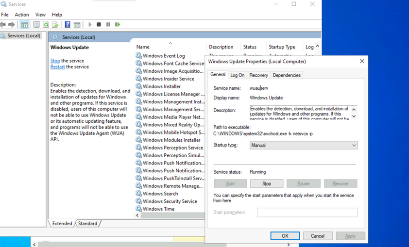

Make a note of the different properties available for viewing and configuration. Knowing the service name is especially useful when using command-line tools to examine and manage services. Path to the executable is the full path to the program and command to execute when the service starts. If the NFTS permissions of the destination directory are configured with weak permissions, an attacker could replace the original executable with one created for malicious purposes.

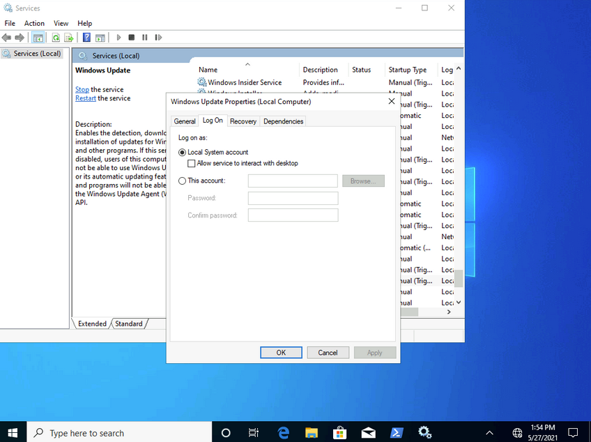

Most services run with LocalSystem privileges by default which is the highest level of access allowed on an individual Windows OS. Not all apps need LocalSystem account-level permissions, so it is beneficial to perform research on a case-by-case basis when considering installing new apps in a Windows environment. It is a good practice to identify applications that can run with the least privileges possible to align with the principle of least privilege.

Notable built-in service accounts in Windows:

- LocalService
- NetworkService
- LocalSystem

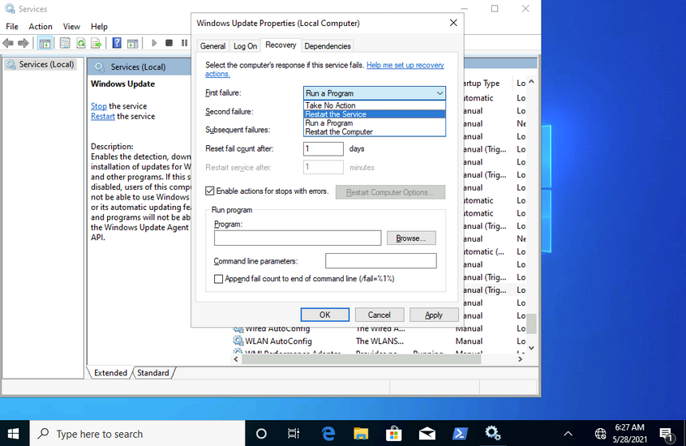

The recovery tab allows steps to be configured should a service fail. Notice how this service can be set to run a program after the first failure. This is yet another vector that an attacker could use to run malicious programs by utilizing a legitimate service.

#### Examining Services using sc

```sc``` can also be used to configure and manage services.

```code
C:\Users\htb-student>sc qc wuauserv
[SC] QueryServiceConfig SUCCESS

SERVICE_NAME: wuauserv
        TYPE               : 20  WIN32_SHARE_PROCESS
        START_TYPE         : 3   DEMAND_START
        ERROR_CONTROL      : 1   NORMAL
        BINARY_PATH_NAME   : C:\WINDOWS\system32\svchost.exe -k netsvcs -p
        LOAD_ORDER_GROUP   :
        TAG                : 0
        DISPLAY_NAME       : Windows Update
        DEPENDENCIES       : rpcss
        SERVICE_START_NAME : LocalSystem

...

C:\Users\htb-student>sc //hostname or ip of box query ServiceName
```

```sc qc``` is used to query the service. This is where the names of services can come in handy. If you want to query a service on a device over the network, you could specify the hostname or IP address immediately after ```sc```.

```code
C:\Users\htb-student> sc stop wuauserv

[SC] OpenService FAILED 5:

Access is denied.
```

You can also use ```sc``` to start and stop services.

Notice how you are denied access from performing this action without running it within an administrative context. If you run a command prompt with elevated privileges, you will be permitted to complete this action.

```code
C:\WINDOWS\system32> sc config wuauserv binPath=C:\Winbows\Perfectlylegitprogram.exe

[SC] ChangeServiceConfig SUCCESS

C:\WINDOWS\system32> sc qc wuauserv

[SC] QueryServiceConfig SUCCESS

SERVICE_NAME: wuauserv
        TYPE               : 20  WIN32_SHARE_PROCESS
        START_TYPE         : 3   DEMAND_START
        ERROR_CONTROL      : 1   NORMAL
        BINARY_PATH_NAME   : C:\Winbows\Perfectlylegitprogram.exe
        LOAD_ORDER_GROUP   :
        TAG                : 0
        DISPLAY_NAME       : Windows Update
        DEPENDENCIES       : rpcss
        SERVICE_START_NAME : LocalSystem
```

If you were to investigate a situation where you suspected that the system had malware, ```sc``` would give you the ability to quickly search and analyze commonly targeted services and newly created services. It's also much more script-friendly than utilizing GUI tools.

Another helpful way you can examine service permissions using ```sc``` is through the ```sdshow``` command.

```code
C:\WINDOWS\system32> sc sdshow wuauserv

D:(A;;CCLCSWRPLORC;;;AU)(A;;CCDCLCSWRPWPDTLOCRSDRCWDWO;;;BA)(A;;CCDCLCSWRPWPDTLOCRSDRCWDWO;;;SY)S:(AU;FA;CCDCLCSWRPWPDTLOSDRCWDWO;;;WD)
```

Every named object in Windows is a securable object, and even some unnamed objects are securable. If it's securable in a Windows OS, it will have a security descriptor. Security descriptors identify the object's owner and a primary group containing a Discretionary Access Control List (_DACL_) and a System Access Control List (_SACL_).

Generally, a DACL is used for controlling access to an object, and a SACL is used to account for and log access attempts.

```
D:(A;;CCLCSWRPLORC;;;AU)(A;;CCDCLCSWRPWPDTLOCRSDRCWDWO;;;BA)(A;;CCDCLCSWRPWPDTLOCRSDRCWDWO;;;SY)
```

This amalgamation of chars crunched together and delimited by opened and closed parantheses is in a format known as the Security Descriptor Definition Language (_SDDL_).

```
D: (A;;CCLCSWRPLORC;;;AU)
```

1. D: - the proceeding chars are DACL permissions
2. AU: - defines the security principal Authenticated Users
3. A;; - access is allowed
4. CC - SERVICE_QUERY_CONFIG is the full name, and it is a query to the service control manager (_SCM_) for the service configuration
5. LC - SERVICE_QUERY_STATUS is the full name, and it is a query to the service control manager (_SCM_) for the current status of the service
6. SW - SERVICE_ENUMERATE_DEPENDENTS is the full name, and it will enumerate a list of dependent services
7. RP - SERVICE_START is the full name, and it will start the service
8. LO - SERVICE_INTERROGATE is the full name, and it will query the service for its current status
9. RC - READ_CONTROL is the full name, and it will query the security descriptor of the service

Each set of 2 chars between the semi-colons represents actions allowed to be performed by a specific user or group.

```
;;CCLCSWRPLORC;;;
```

After the last set of semi-colons, the chars specify the security principal that is permitted to perform those actions.

```
;;;AU
```

The char immediately after the opening parantheses and before the first set of semi-colons defines whether the actions are Allowed or Denied.

```
A;;
```

This entire security descriptor associated with the Windows Update (```wuauserv```) service has three sets of access control entries because there are three different security principals. Each security principal has specific permissions applied.

#### Examining Service Permissions using PowerShell

Using the ```Get-Acl``` PowerShell cmdlet, you can examine service permissions by targeting the path of a specific service in the registry.

```ps
PS C:\Users\htb-student> Get-ACL -Path HKLM:\System\CurrentControlSet\Services\wuauserv | Format-List

Path   : Microsoft.PowerShell.Core\Registry::HKEY_LOCAL_MACHINE\System\CurrentControlSet\Services\wuauserv
Owner  : NT AUTHORITY\SYSTEM
Group  : NT AUTHORITY\SYSTEM
Access : BUILTIN\Users Allow  ReadKey
         BUILTIN\Users Allow  -2147483648
         BUILTIN\Administrators Allow  FullControl
         BUILTIN\Administrators Allow  268435456
         NT AUTHORITY\SYSTEM Allow  FullControl
         NT AUTHORITY\SYSTEM Allow  268435456
         CREATOR OWNER Allow  268435456
         APPLICATION PACKAGE AUTHORITY\ALL APPLICATION PACKAGES Allow  ReadKey
         APPLICATION PACKAGE AUTHORITY\ALL APPLICATION PACKAGES Allow  -2147483648
         S-1-15-3-1024-1065365936-1281604716-3511738428-1654721687-432734479-3232135806-4053264122-3456934681 Allow
         ReadKey
         S-1-15-3-1024-1065365936-1281604716-3511738428-1654721687-432734479-3232135806-4053264122-3456934681 Allow
         -2147483648
Audit  :
Sddl   : O:SYG:SYD:AI(A;ID;KR;;;BU)(A;CIIOID;GR;;;BU)(A;ID;KA;;;BA)(A;CIIOID;GA;;;BA)(A;ID;KA;;;SY)(A;CIIOID;GA;;;SY)(A
         ;CIIOID;GA;;;CO)(A;ID;KR;;;AC)(A;CIIOID;GR;;;AC)(A;ID;KR;;;S-1-15-3-1024-1065365936-1281604716-3511738428-1654
         721687-432734479-3232135806-4053264122-3456934681)(A;CIIOID;GR;;;S-1-15-3-1024-1065365936-1281604716-351173842
         8-1654721687-432734479-3232135806-4053264122-3456934681)
```

## Interaction

### Windows Sessions

#### Interactive

An interactive, or local logon session, is initiated by a user authenticating to a local or domain system by entering their creds. An interactive logon can be initiated by logging directly into the system, by requesting a secondary logon session using the ```runas``` command via the command line, or through a Remote Desktop connection.

#### Non-Interactive

Non-interactive accounts in Windows differ from standard user accounts as they do not require login creds. There are 3 types of non-interactive accounts: the Local System Account, Local Service Account, and the Network Service Account. Non-interactive accounts are generally used by the Windows OS to automatically start services and apps without requiring user interaction. These accounts have no password associated with them and are usually used to start services when the system boots or to run scheduled tasks.

| Account | Description |
| ------- | ----------- |
| Local System Account | also known as the ```NT AUTHORITY\SYSTEM``` account, this is the most powerful account in Windows systems; it is used for a variety of OS-related tasks, such as starting Windows services; this account is more powerful than accounts in the local administrators group |
| Local Service Account | known as the ```NT AUTHORITY\LocalService``` account, this is a less privileged version of the SYSTEM account and has similar privileges to a local user account; it is granted limited functionality and can start some services |
| Network Service Account | is known as the ```NT AUTHORITY\NetworkService``` account and is similar to a standard domain user account; it has similar privileges to the Local Service Account on the local machine; it can establish authenticated sessions for certain network services |

### Interacting with the Windows OS

- GUI
- RDP
- CMD
- PowerShell

#### CMD

```code
C:\htb> help
For more information on a specific command, type HELP command-name
ASSOC          Displays or modifies file extension associations.
ATTRIB         Displays or changes file attributes.
BREAK          Sets or clears extended CTRL+C checking.
BCDEDIT        Sets properties in boot database to control boot loading.
CACLS          Displays or modifies access control lists (ACLs) of files.
CALL           Calls one batch program from another.
CD             Displays the name of or changes the current directory.
CHCP           Displays or sets the active code page number.
CHDIR          Displays the name of or changes the current directory.
CHKDSK         Checks a disk and displays a status report.
CHKNTFS        Displays or modifies the checking of disk at boot time.
CLS            Clears the screen.
CMD            Starts a new instance of the Windows command interpreter.
COLOR          Sets the default console foreground and background colors.
COMP           Compares the contents of two files or sets of files.
COMPACT        Displays or alters the compression of files on NTFS partitions.
CONVERT        Converts FAT volumes to NTFS.  You cannot convert the
               current drive.
COPY           Copies one or more files to another location.

<SNIP>

...

C:\htb> help schtasks

SCHTASKS /parameter [arguments]

Description:
    Enables an administrator to create, delete, query, change, run and
    end scheduled tasks on a local or remote system.

Parameter List:
    /Create         Creates a new scheduled task.

    /Delete         Deletes the scheduled task(s).

    /Query          Displays all scheduled tasks.

    /Change         Changes the properties of scheduled task.

    /Run            Runs the scheduled task on demand.

    /End            Stops the currently running scheduled task.

    /ShowSid        Shows the security identifier corresponding to a scheduled task name.

    /?              Displays this help message.

Examples:
    SCHTASKS
    SCHTASKS /?
    SCHTASKS /Run /?
    SCHTASKS /End /?
    SCHTASKS /Create /?
    SCHTASKS /Delete /?
    SCHTASKS /Query  /?
    SCHTASKS /Change /?
    SCHTASKS /ShowSid /?

...

C:\htb> ipconfig /?

USAGE:
    ipconfig [/allcompartments] [/? | /all |
                                 /renew [adapter] | /release [adapter] |
                                 /renew6 [adapter] | /release6 [adapter] |
                                 /flushdns | /displaydns | /registerdns |
                                 /showclassid adapter |
                                 /setclassid adapter [classid] |
                                 /showclassid6 adapter |
                                 /setclassid6 adapter [classid] ]

where
    adapter             Connection name
                       (wildcard characters * and ? allowed, see examples)

    Options:
       /?               Display this help message
       /all             Display full configuration information.
       /release         Release the IPv4 address for the specified adapter.
       /release6        Release the IPv6 address for the specified adapter.
       /renew           Renew the IPv4 address for the specified adapter.
       /renew6          Renew the IPv6 address for the specified adapter.
       /flushdns        Purges the DNS Resolver cache.
       /registerdns     Refreshes all DHCP leases and re-registers DNS names
       /displaydns      Display the contents of the DNS Resolver Cache.
       /showclassid     Displays all the dhcp class IDs allowed for adapter.
       /setclassid      Modifies the dhcp class id.
       /showclassid6    Displays all the IPv6 DHCP class IDs allowed for adapter.
       /setclassid6     Modifies the IPv6 DHCP class id.

<SNIP
```

#### PowerShell

##### Cmdlets

... are small single-function tools built into the shell. They are in form of Verb-Noun.

Example:

```ps
Get-ChildItem -Path C:\Users\Administrator\Downloads -Recurse
```

##### Aliases

```ps
PS C:\htb> get-alias

CommandType     Name                                               Version    Source
-----------     ----                                               -------    ------
Alias           % -> ForEach-Object
Alias           ? -> Where-Object
Alias           ac -> Add-Content
Alias           asnp -> Add-PSSnapin
Alias           cat -> Get-Content
Alias           cd -> Set-Location
Alias           CFS -> ConvertFrom-String                          3.1.0.0    Microsoft.PowerShell.Utility
Alias           chdir -> Set-Location
Alias           clc -> Clear-Content
Alias           clear -> Clear-Host
Alias           clhy -> Clear-History
Alias           cli -> Clear-Item
Alias           clp -> Clear-ItemProperty

...

PS C:\htb> New-Alias -Name "Show-Files" Get-ChildItem
PS C:\> Get-Alias -Name "Show-Files"

CommandType     Name                                               Version    Source
-----------     ----                                               -------    ------
Alias           Show-Files
```

##### help

```ps
PS C:\htb>  Get-Help Get-AppPackage

NAME
    Get-AppxPackage

SYNTAX
    Get-AppxPackage [[-Name] <string>] [[-Publisher] <string>] [-AllUsers] [-PackageTypeFilter {None | Main |
    Framework | Resource | Bundle | Xap | Optional | All}] [-User <string>] [-Volume <AppxVolume>]
    [<CommonParameters>]


ALIASES
    Get-AppPackage


REMARKS
    Get-Help cannot find the Help files for this cmdlet on this computer. It is displaying only partial help.
        -- To download and install Help files for the module that includes this cmdlet, use Update-Help.
```

##### Running Scripts

You can run PowerShell scripts in a variety of ways. If you know the functions, you can run the script either locally or after loading into memory with a download cradle like the below example.

```ps
PS C:\htb> .\PowerView.ps1;Get-LocalGroup |fl

Description     : Users of Docker Desktop
Name            : docker-users
SID             : S-1-5-21-674899381-4069889467-2080702030-1004
PrincipalSource : Local
ObjectClass     : Group

Description     : VMware User Group
Name            : __vmware__
SID             : S-1-5-21-674899381-4069889467-2080702030-1003
PrincipalSource : Local
ObjectClass     : Group

Description     : Members of this group can remotely query authorization attributes and permissions for resources on
                  this computer.
Name            : Access Control Assistance Operators
SID             : S-1-5-32-579
PrincipalSource : Local
ObjectClass     : Group

Description     : Administrators have complete and unrestricted access to the computer/domain
Name            : Administrators
SID             : S-1-5-32-544
PrincipalSource : Local

<SNIP>
```

One common way to work with a script in PowerShell is to import it so that all functions are then available within your current PowerShell console session: ```Import-Module .\PowerView.ps1```. You can then either start a command and cycle through the options or type ```Get-Module``` to list all loaded modules and their associated commands.

```ps
PS C:\htb> Get-Module | select Name,ExportedCommands | fl


Name             : Appx
ExportedCommands : {[Add-AppxPackage, Add-AppxPackage], [Add-AppxVolume, Add-AppxVolume], [Dismount-AppxVolume,
                   Dismount-AppxVolume], [Get-AppxDefaultVolume, Get-AppxDefaultVolume]...}

Name             : Microsoft.PowerShell.LocalAccounts
ExportedCommands : {[Add-LocalGroupMember, Add-LocalGroupMember], [Disable-LocalUser, Disable-LocalUser],
                   [Enable-LocalUser, Enable-LocalUser], [Get-LocalGroup, Get-LocalGroup]...}

Name             : Microsoft.PowerShell.Management
ExportedCommands : {[Add-Computer, Add-Computer], [Add-Content, Add-Content], [Checkpoint-Computer,
                   Checkpoint-Computer], [Clear-Content, Clear-Content]...}

Name             : Microsoft.PowerShell.Utility
ExportedCommands : {[Add-Member, Add-Member], [Add-Type, Add-Type], [Clear-Variable, Clear-Variable], [Compare-Object,
                   Compare-Object]...}

Name             : PSReadline
ExportedCommands : {[Get-PSReadLineKeyHandler, Get-PSReadLineKeyHandler], [Get-PSReadLineOption,
                   Get-PSReadLineOption], [Remove-PSReadLineKeyHandler, Remove-PSReadLineKeyHandler],
                   [Set-PSReadLineKeyHandler, Set-PSReadLineKeyHandler]...}
```

##### Execution Policy

Sometimes you will find that you are unable to run scripts on a system. This is due to a security feature called the execution policy, which attempts to prevent the execution of malicious scripts. The possible polices are:

| Policy | Description |
| ------ | ----------- |
| AllSigned | all scripts can run, but a trusted publisher must sign scripts and configuration files; this includes both remote and local scripts; you receive a prompt before running scripts signed by publishers that you have not yet listed as either trusted or untrusted |
| Bypass | no scripts or configuration files are blocked, and the user receives no warnings or prompts |
| Default | this sets the default execution policy, Restricted for Windows desktop machines and RemoteSigned for Windows servers |
| RemoteSigned | scripts can run but requires a digital signature on scripts that are downloaded from the internet; digital signatures are not required for scripsts that are written locally |
| Restricted | this allows individual commands but does not allow scripts to be run; all script file types, including configuration files, module script files, and PowerShell profiles are blocked |
| Undefined | no execution policy is set for the current scope; if the execution policy for ALL scopes is set to undefined, then the default execution policy of Restricted will be used |
| Unrestricted | this is the default execution policy for non-Windows computers, and it cannot be changed; this policy allows for usigned scripts to be run but warns the user before running scripts that are not from the local intranet zone |

Example:

```ps
PS C:\htb> Get-ExecutionPolicy -List

        Scope ExecutionPolicy
        ----- ---------------
MachinePolicy       Undefined
   UserPolicy       Undefined
      Process       Undefined
  CurrentUser       Undefined
 LocalMachine    RemoteSigned
```

The execution policy is not meant to be a security control that restricts user actions. A user can easily bypass the policy by either typing the script contents directly into the PowerShell window, downloading and invoking the script, or specifying the script as an encoded command. It can also be bypassed by adjusting the execution policy or setting the execution policy for the current process scope.

Below is an example of changing the execution policy for the current process.

```ps
PS C:\htb> Set-ExecutionPolicy Bypass -Scope Process

Execution Policy Change
The execution policy helps protect you from scripts that you do not trust. Changing the execution policy might expose
you to the security risks described in the about_Execution_Policies help topic at
https:/go.microsoft.com/fwlink/?LinkID=135170. Do you want to change the execution policy?
[Y] Yes  [A] Yes to All  [N] No  [L] No to All  [S] Suspend  [?] Help (default is "N"): Y
```

You can now see that the execution policy has been changed.

```ps
PS C:\htb>  Get-ExecutionPolicy -List

        Scope ExecutionPolicy
        ----- ---------------
MachinePolicy       Undefined
   UserPolicy       Undefined
      Process          Bypass
  CurrentUser       Undefined
 LocalMachine    RemoteSigned
```

### Windows Management Instrumentation (_WMI_)

... is a subsystem of PowerShell that provides system administration with powerful tools for system monitoring. The goal of WMI is to consolidate device and application management across corporate networks. WMI is a core part of the Windows OS and has come pre-installed since Windows 2000. It is made up of the following components:

| Component Name | Description |
| -------------- | ----------- |
| WMI service | the WMI process, which runs automatically at boot and acts as an intermediary bewteen WMI providers, the WMI repository, and managing apps |
| Managed objects | any logical or physical component that can be managed by WMI |
| WMI providers | objects that monitor events/data related to a specific object |
| Classes | these are used by the WMI providers to pass data to the WMI service |
| Methods | these are attached to classes and allow actions to be performed |
| WMI repository | a database that stores all static data related to WMI |
| CIM Object Manager | the system that requests data from WMI providers and returns it to the app requesting it |
| WMI API | enables apps to acces the WMI infrastructure |
| WMI Consumer | sends queries to objects via the CIM Object Manager |

Some of the uses for WMI are:

- status information for local/remote systems
- configuring security settings on remote machines/apps
- setting and changing user and group permissions
- setting/modifying system properties
- code executioon
- scheduling processes
- setting up logging

These tasks can all be performed using a combination of PowerShell and the WMI CLI.

```code
C:\htb> wmic /?

WMIC is deprecated.

[global switches] <command>

The following global switches are available:
/NAMESPACE           Path for the namespace the alias operate against.
/ROLE                Path for the role containing the alias definitions.
/NODE                Servers the alias will operate against.
/IMPLEVEL            Client impersonation level.
/AUTHLEVEL           Client authentication level.
/LOCALE              Language id the client should use.
/PRIVILEGES          Enable or disable all privileges.
/TRACE               Outputs debugging information to stderr.
/RECORD              Logs all input commands and output.
/INTERACTIVE         Sets or resets the interactive mode.
/FAILFAST            Sets or resets the FailFast mode.
/USER                User to be used during the session.
/PASSWORD            Password to be used for session login.
/OUTPUT              Specifies the mode for output redirection.
/APPEND              Specifies the mode for output redirection.
/AGGREGATE           Sets or resets aggregate mode.
/AUTHORITY           Specifies the <authority type> for the connection.
/?[:<BRIEF|FULL>]    Usage information.

For more information on a specific global switch, type: switch-name /?

Press any key to continue, or press the ESCAPE key to stop
```

Example:

```code
C:\htb> wmic os list brief

BuildNumber  Organization  RegisteredUser  SerialNumber             SystemDirectory      Version
19041                      Owner           00123-00123-00123-AAOEM  C:\Windows\system32  10.0.19041
```

WMIC uses aliases and associated verbs, adverbs, and switches. The above command example uses LIST to show data and the adverb BRIEF to provide just the core set of properties. WMI can be used with PowerShell.

```ps
PS C:\htb> Get-WmiObject -Class Win32_OperatingSystem | select SystemDirectory,BuildNumber,SerialNumber,Version | ft

SystemDirectory     BuildNumber SerialNumber            Version
---------------     ----------- ------------            -------
C:\Windows\system32 19041       00123-00123-00123-AAOEM 10.0.19041
```

## Further Windows Usage

### Microsoft Management Console (_MMC_)

... can be used to group snap-ins, or administrative tools, to manage hardware, software, and network components within a Windows Host.

You can open MMC by just typing ```mmc``` in the start menu.

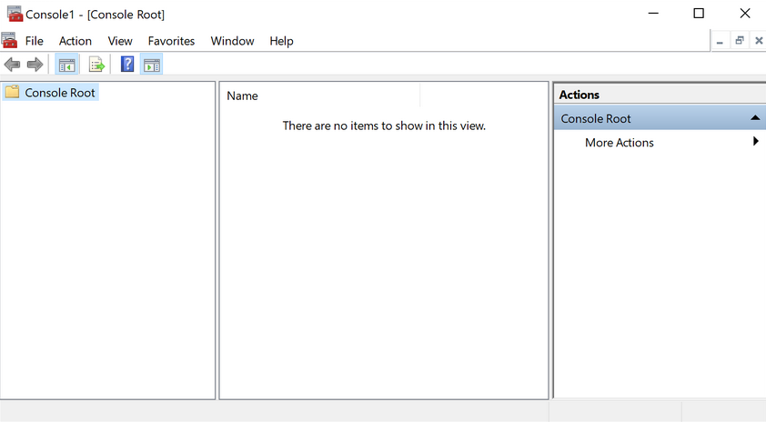

From here, you can browse to File --> ```Add or Remove Snap-ins```, and begin customizing your administrative console.

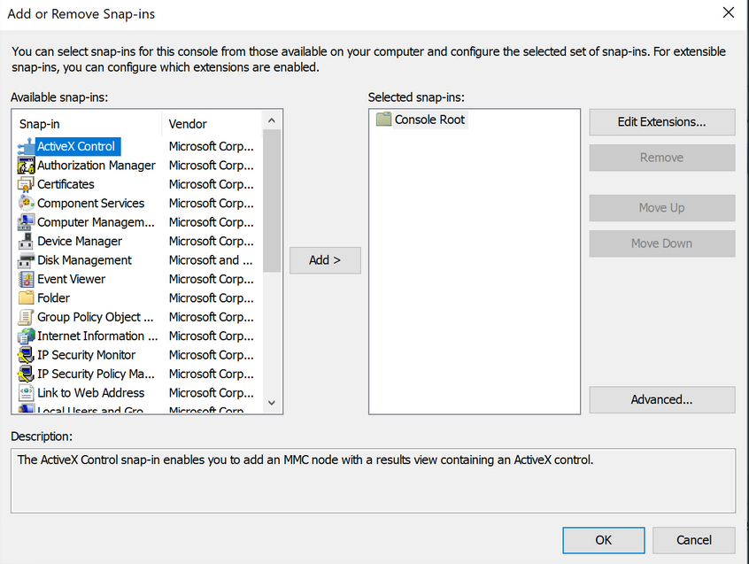

As you begin adding snap-ins, you will be asked if you want to add the snap-in to manage just the local computer or if it will be used to manage another computer on the network.

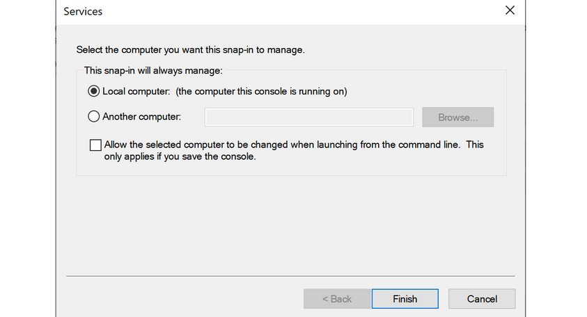

Once you have finished adding snap-ins, they will appear on the left-hand side of MMC. From here, you can save the set of snap-ins as a ```.msc``` file, so they will be loaded the next time you open MMC. By default, they are saved in the Windows Administrative Tools directory under the Start menu. Next time you open MMC, you can choose to load any of the views that you have captured.

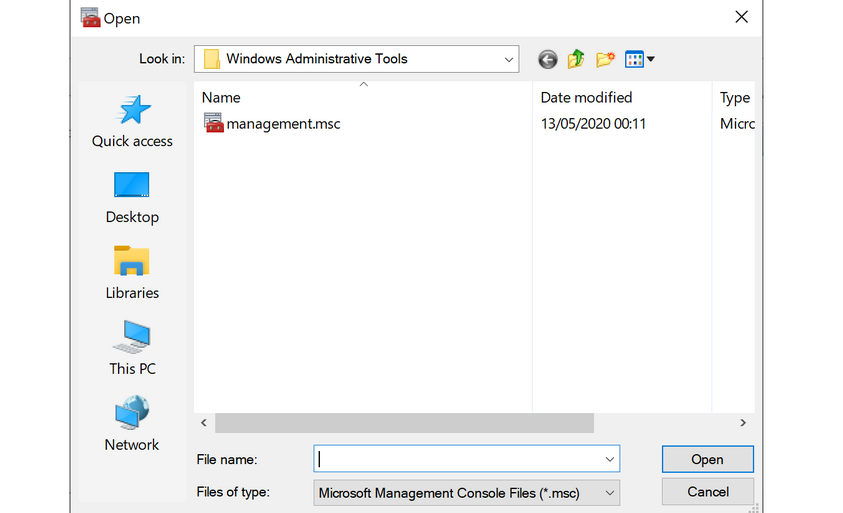

### Windows Subsystem for Linux (_WSL_)

... is a feature that allows Linux binaries to be run natively on Windows 10 and Windows Server 2019. It was originally intended for devs who needed to run Bash, Ruby, and native Linuc command-line tools such as sed, awk, grep, etc., directly on their Windows workstation.

```ps
PS C:\htb> ls /

bin dev home lib lLib64 media opt root sbin srv tmp var
boot etc init 1lib32 Libx32 mnt proc run Snap sys usr

...

PS C:\htb> uname -a

Linux WS01 4.4.0-18362-Microsoft #476-Microsoft Frit Nov 01 16:53:00
PST 2019 x86_64 x86 _64 x86_64 GNU/Linux
```

### Server Core

... is a minimalistic Server environment only containing key Server functionality. As a result, Server Core has lower management requirements, a smaller attack surface, and uses less disk space and memory than its Desktop Experience counterpart. In Server Core, all configuration and maintenance tasks are performed via the command-line, PowerShell, or remote management with MMC or Remote Server Administration Tools.

## Windows Security

### Security Identifier (_SID_)

Each of the security principals on the system has a unique security identifier. The system automatically generates SIDs. This means that even if, for example, you have two identical users on the system, Windows can distinguish the two and their rights based on their SIDs. SIDs are string values with different lengths, which are stored in the security database. These SIDs are added to the user's access token to identify all actions that the user is authorized to take.

A SID consists of the Identifier Authority and the Relative ID (_RID_). In an AD domain environment, the SID also includes the domain SID.

```ps
PS C:\htb> whoami /user

USER INFORMATION
----------------

User Name           SID
=================== =============================================
ws01\bob S-1-5-21-674899381-4069889467-2080702030-1002
```

The SID is broken down into this pattern.

```ps
(SID)-(revision level)-(identifier-authority)-(subauthority1)-(subauthority2)-(etc)
```

| Number | Meaning | Description |
| ------ | ------- | ----------- |
| S | SID | identifies the string as a SID |
| 1 | Revision Level | to date, this has never be changed and has always been 1 |
| 5 | Identifier Authority | a 48-bit string that identifies the authority that created the SID |
| 21 | Subauthority 1 | this is a variable number that identifies the user's relation or group described by the SID to the authority that created it; it tells you in what order this authority created the user's account |
| 674899381-4069889467-2080702030 | Subauthority 2 | tells you which computer (_or domain_) created the number |
| 1002 | Subauthority 3 | the RID that distinguishes one account from another; tells you whether this user is a normal user, a guest, an admin, or part of some other group |

### Security Accounts Manager (_SAM_) and Access Control Entries (_ACE_)

SAM grants rights to a network to execute specific processes.

The access rights themselves are managed by ACE in Access Control Lists (_ACL_). The ACLs contain ACEs that define which users, groups, or processes have access to a file or to execute a process, for example.

The permissions to access a securable object are given by the security descriptor, classified into two types of ACLs: the Discretionary Access Control List (_DACL_) or System Access Control List (_SACL_). Every thread and process started or initiated by a user goes through an authorization process. An integral part of this process is access tokens, validated by the Local Security Authority (_LSA_). In addition to the SID, these access tokens contain other security-relevant information. Understanding these functionalities is an essential part of learning how to use and work around these security mechanisms during the PrivEsc phase.

### User Account Control (_UAC_)

... is a security feature in Windows to prevent malware from running or manipulating processes that could damage the computer or its contents. There is the Admin Approval Mode in UAC, which is designed to prevent unwanted software from being installed without the administrator's knowledge or to prevent system-wide changes from being made. Surely you have already seen the consent prompt if you have installed a specific software, and your system has asked for confirmation if you want to have it installed. Since the installation requires administrator rights, a window pops up, asking you if you want to confirm the installation. With a standard user who has no rights for the installation, execution will be denied, or you will be asked for the administrator password. This consent prompt interrupts the execution of scripts or binaries that malware or attackers try to execute until the user enters the password or confirs execution. To understand how UAC works, you need to know how it is structured and how it works, and what triggers the consent prompt. The following diagram illustrates how UAC works.

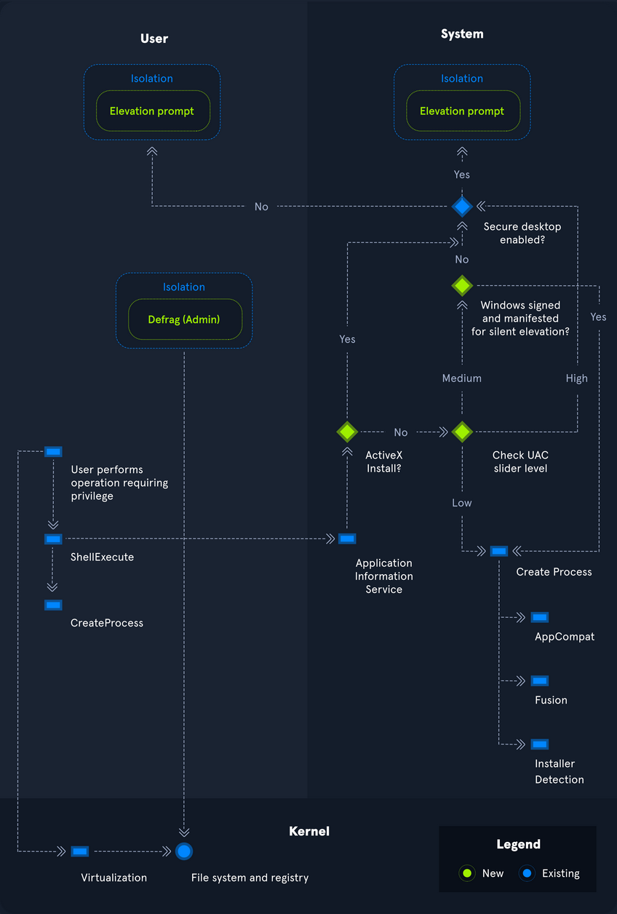

### Registry

... is a hierarchical database in Windows critical for the OS. It stores low-level settings for the Windows OS and apps that choose to use it. It is divided into computer-specific and user-specific data. You can open the RegEditor by typing ```regedit``` from the command line or Windows search bar.

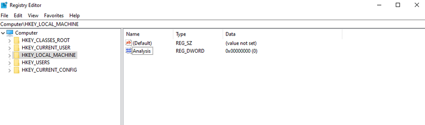

The tree-structure consists of main folders in which subfolders with their entries/files are located. There are 11 different types of values that can be entered in a subkey.

| Value | Type |
| ----- | ---- |
| REG_BINARY | binary data in any form |
| REG_DWORD |a 32-bit number |
| REG_DWORD_LITTLE_ENDIAN |  a 32-bit number in little-endian format; Windows is designed to run on little-endian computer architectures; therefore, this value is defined as REG_DWORD in the Windows header files |
| REG_DWORD_BIG_ENDIAN | a 32-bit number in big-endian format; some UNIX systems support big-endian architectures |
| REG_EXPAND_SZ | a null-terminated string that contains unexpanded references to environment variables; it will be a Unicode or ANSI string depending on whether you use the Unicode or ANSI functions; to expand the environment variable references, use the ExpandEnvironmentStrings function |
| REG_LINK | a null-terminated Unicode string containing the target path of a symbolic link created by calling the RegCreateKeyEx function with REG_OPTION_CREATE_LINK |
| REG_MULTI_SZ | a sequence of null-terminated strings, terminated by an empty string |
| REG_NONE | do defined value type |
| REG_QWORD | a 64-bit number |
| REG_QWORD_LITTLE_ENDIAN | a 64-bit number in little-endian format; Windows is designed to run on little-endian computer architectures; therefore, this value is defined as REG_QWORD in the Windows header files |
| REG_SZ | a null-terminated string; this will be either a Unicode or an ANSI string, depending on whether you use the Unicode or ANSI functions |

Each folder under Computer is a key. The root keys all start with ```HKEY```. A key such as ```HKEY-LOCAL-MACHINE``` is abbreviated to ```HKLM```. HKLM contains all settings that are relevant to the local system. This root key contains six subkeys like ```SAM```, ```Security```, ```SYSTEM```, ```SOFTWARE```, ```HARDWARE```, and ```BCD```, loaded into memory at boot time.

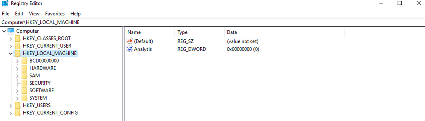

The entire system registry is stored in several files on the OS. You can find these under ```C:\Windows\System32\Config\```.

```ps
PS C:\htb> ls

    Directory: C:\Windows\system32\config

Mode                 LastWriteTime         Length Name
----                 -------------         ------ ----
d-----         12/7/2019   4:14 AM                Journal
d-----         12/7/2019   4:14 AM                RegBack
d-----         12/7/2019   4:14 AM                systemprofile
d-----         8/12/2020   1:43 AM                TxR
-a----         8/13/2020   6:02 PM        1048576 BBI
-a----         6/25/2020   4:36 PM          28672 BCD-Template
-a----         8/30/2020  12:17 PM       33816576 COMPONENTS
-a----         8/13/2020   6:02 PM         524288 DEFAULT
-a----         8/26/2020   7:51 PM        4603904 DRIVERS
-a----         6/25/2020   3:37 PM          32768 ELAM
-a----         8/13/2020   6:02 PM          65536 SAM
-a----         8/13/2020   6:02 PM          65536 SECURITY
-a----         8/13/2020   6:02 PM       87818240 SOFTWARE
-a----         8/13/2020   6:02 PM       17039360 SYSTEM
```

The user-specific registry hive (_HKCU_) is stored in the user folder (_```C:\Users\<USERNAME>\Ntuser.dat```_).

```ps
PS C:\htb> gci -Hidden

    Directory: C:\Users\bob

Mode                 LastWriteTime         Length Name
----                 -------------         ------ ----
d--h--         6/25/2020   5:12 PM                AppData
d--hsl         6/25/2020   5:12 PM                Application Data
d--hsl         6/25/2020   5:12 PM                Cookies
d--hsl         6/25/2020   5:12 PM                Local Settings
d--h--         6/25/2020   5:12 PM                MicrosoftEdgeBackups
d--hsl         6/25/2020   5:12 PM                My Documents
d--hsl         6/25/2020   5:12 PM                NetHood
d--hsl         6/25/2020   5:12 PM                PrintHood
d--hsl         6/25/2020   5:12 PM                Recent
d--hsl         6/25/2020   5:12 PM                SendTo
d--hsl         6/25/2020   5:12 PM                Start Menu
d--hsl         6/25/2020   5:12 PM                Templates
-a-h--         8/13/2020   6:01 PM        2883584 NTUSER.DAT
-a-hs-         6/25/2020   5:12 PM         524288 ntuser.dat.LOG1
-a-hs-         6/25/2020   5:12 PM        1011712 ntuser.dat.LOG2
-a-hs-         8/17/2020   5:46 PM        1048576 NTUSER.DAT{53b39e87-18c4-11ea-a811-000d3aa4692b}.TxR.0.regtrans-ms
-a-hs-         8/17/2020  12:13 PM        1048576 NTUSER.DAT{53b39e87-18c4-11ea-a811-000d3aa4692b}.TxR.1.regtrans-ms
-a-hs-         8/17/2020  12:13 PM        1048576 NTUSER.DAT{53b39e87-18c4-11ea-a811-000d3aa4692b}.TxR.2.regtrans-ms
-a-hs-         8/17/2020   5:46 PM          65536 NTUSER.DAT{53b39e87-18c4-11ea-a811-000d3aa4692b}.TxR.blf
-a-hs-         6/25/2020   5:15 PM          65536 NTUSER.DAT{53b39e88-18c4-11ea-a811-000d3aa4692b}.TM.blf
-a-hs-         6/25/2020   5:12 PM         524288 NTUSER.DAT{53b39e88-18c4-11ea-a811-000d3aa4692b}.TMContainer000000000
                                                  00000000001.regtrans-ms
-a-hs-         6/25/2020   5:12 PM         524288 NTUSER.DAT{53b39e88-18c4-11ea-a811-000d3aa4692b}.TMContainer000000000
                                                  00000000002.regtrans-ms
---hs-         6/25/2020   5:12 PM             20 ntuser.ini
```

### Run and RunOnce Registry Keys

There are also so-called registry hives, which contain a logical group of keys, subkeys, and values to support software and files loaded into memory when the OS is started or a user logs in. These hives are useful for maintaining access to the system. These are called Rund and RunOnce registry keys.

The Windows registry includes the following four keys:

```ps
HKEY_LOCAL_MACHINE\Software\Microsoft\Windows\CurrentVersion\Run
HKEY_CURRENT_USER\Software\Microsoft\Windows\CurrentVersion\Run
HKEY_LOCAL_MACHINE\Software\Microsoft\Windows\CurrentVersion\RunOnce
HKEY_CURRENT_USER\Software\Microsoft\Windows\CurrentVersion\RunOnce
```

### Application Whitelisting

An application whitelist is a list of approved software applications or executables allowed to be present and run on a system. The goal is to protect the environment from harmful malware and unapproved software that does not align with the specific business needs of an organization. Implementing an enforced whitelist can be a challenge, especially in a large network. An organization should implement a whitelist in audit mode intially to make sure that all necessary apps are whitelisted and not blocked by an error of omission, which can cause more problems than it fixes.

Blacklisting, in contrast, specifies a list of harmful or disallowed software/applications to block, and all others are allowed to run/be installed. Whitelisting is based on a "zero trust" principle in which all software/apps are deemed "bad" except for those specifically allowed. Maintaining a whitelist generally has less overhead as a system administrator will only need to specify what is allowed and not constantly update a "blacklist" with new malicious apps.

### AppLocker

... is a Microsoft's application whitelisting solution and was first introduced in Windows 7. AppLocker gives system administrators control over which applications and files users can run. It gives granular control over executables, scripts, Windows installer files, DLLs, packaged apps, and app installers.

It allows for creating rules based on file attributes such as the publisher's name, product name, file name, and version. Rules can also be set up based on file paths and hashes. Rules can be applied to either security groups or individual users, based on the business need. AppLocker can be deployed in audit mode first to test the impact before enforcing all of the rules.

### Local Group Policy

Group Policy allows administrators to set, configure, and adjust a variety of setings. In a domain environment, group policies are pushed down from a Domain Controller onto all domain-joined machines that Group Policy objects are linked to. These settings can also be defined on individual machines using Local Group Policy.

Group Policy can be configured locally, in both domain environments and non-domain environments. Local Group Policy can be used to tweak certain graphical and network settins that are otherwise not accessible via the Control Panel. It can also be used to lock down an individual computer policy with stringent security settings, such as only allowing certain programs to be installed/run or enforcing strict user account password requirements.

You can open the Local Group Policy Editor by opening the Start menu and typing ```gpedit.msc```. The editor is split into two categories under Local Computer Policy - Computer Configuration and User Configuration.

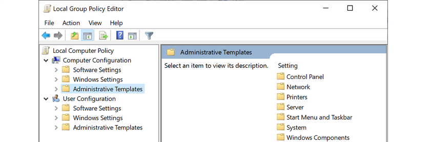

For example, you can open the Local Computer Policy to enable Credential Guard by enabling the setting "Turn On Virtualization Based Security". Credential Guard is a feature in Windows 10 that protects agains credential theft attacks by isolating the OS's LSA process.

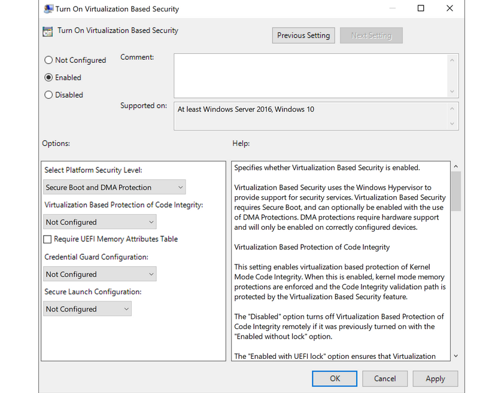

You can also enable fine-tuned account auditing and configure AppLocker from the Local Group Policy Editor. It is worth exploring Local Group Policy and learning about the wide variety of ways it can be used to lock down a Windows system.

### Windows Defender Antivirus

... is built-in antivirus that ships for free with Windows OS. It was first released as a downloadable anti-spyware tool for Windows XP and Server 2003. Defender started coming prepackaged as part of the OS with Windows Vista/Server 2008. The program was renamed to Windows Defender Antivirus with the Windows 10 Creators Update.

Defenders come with several features such as real-time protection, which protects the devide from known threats in real-time and cloud-delivered protection, which works in conjunction with automatic sample submission to upload suspicious files for analysis. When files are submitted to the cloud protection service, they are "locked" to prevent any potentially malicious behavior until the analysis is complete. Another feature is Tamper Protection, which prevents security settings from being changed through the registry, PowerShell cmdlets, or group policy.

Windows Defender is managed from the Security Center, from which a variety of additional security features and settings can be enabled and managed.

Real-time protection settings can be tweaked to add files, folders, and memory areas to controlled folder access to prevent unauthorized changes. You can also add files or folders to an exclusion list, so they are not scanned. An example would be excluding a folder of tools used for penetration testing from scanning as they will be flagged malicious and quarantined or removed from the system. Controlled folder access is Defender's built-in Ransomware protection.

You can use the PowerShell cmdlet ```Get-MpComputerStatus``` to check which protection settings are enabled.

```ps
PS C:\htb> Get-MpComputerStatus | findstr "True"
AMServiceEnabled                : True
AntispywareEnabled              : True
AntivirusEnabled                : True
BehaviorMonitorEnabled          : True
IoavProtectionEnabled           : True
IsTamperProtected               : True
NISEnabled                      : True
OnAccessProtectionEnabled       : True
RealTimeProtectionEnabled       : True
```

While no antivirus solution is perfect, Windows Defender does very well in monthly detection rate tests compared to other solutions, even paid ones. Also, since it comes preinstalled as part of the OS, it does not introduced "bloat" to the system, such as other programs that add browser extensions and trackers. Other products are known to slow down the system due to the way they hook into the OS.

Windows Defender is not without its flaws and should be part of a defense-in-depth strategy built around core principles of configuration and patch management, not treated as a silver bullet for protecting your systems. Definitions are updated constantly, and new versions of Windows Defender are built-in to major operating releases such as Windows 10, version 1909, which is the most recent version at the time of writing.

Windows Defender will pick up payloads from common open-source frameworks such as Metasploit or unaltered versions of tools such as Mimikatz.