- [Windows Event Logs](#windows-event-logs)
  - [Intro](#intro)
    - [Anatomy of an Event Log](#anatomy-of-an-event-log)
    - [Leveraging Custom XML Queries](#leveraging-custom-xml-queries)
    - [Useful Windows Event Logs](#useful-windows-event-logs)
  - [Sysmon \& Event Logs](#sysmon--event-logs)
    - [Sysmon Basics](#sysmon-basics)
    - [Detection Example 1: Detecting DLL Hijacking](#detection-example-1-detecting-dll-hijacking)
    - [Detection Example 2: Detecting Unmanaged PowerShell/C-Sharp Injection](#detection-example-2-detecting-unmanaged-powershellc-sharp-injection)
    - [Detection Example 3: Detecting Credential Dumping](#detection-example-3-detecting-credential-dumping)

---

# Windows Event Logs

... are an intrinsic part of the Windows OS, storing logs from different components of the system including the system itself, apps running on it, ETW providers, services, and others.

Windows event logging offers comprehensive logging capabilities for application errors, security events, and diagnostic information. As cybersecurity professionals, you leverage these logs extensively for analysis and intrusion detection.

The logs are categorized into different event logs, such as "Application", "System", "Security", and others, to organize events based on their source or purpose.

Event logs can be accesses using the Event Viewer application or programmatically using APIs such as the Windows Event Log API.

Accessing the Windows Event Viewer as an administrative user allows you to explore the various log files available.


The default Windows event logs consist of Application, Security, Setup, and Forwarded Events. While the first four logs cover application errors, security events, system setup activities, and general information, the "Forwarded Events" section is unique, showcasing event log data forwarded from other machines. This central logging feature proves valuable for system admins who desire a consolidated view. In your current analysis, you focus on event logs from a single machine.

It should be noted, that the Windows Event Viewer has the ability to open and display previously saved ```.evtx``` files, which can be then found in the "Saved Logs" section.


## Intro

### Anatomy of an Event Log

When examining Application logs, you encounter two distinct levels of events: information and error.

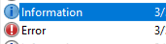

Information events provide general usage details about the application, such as its start or stop events. Conversely, error events highlight specific errors and often offer detailed insights into the encountered issues.

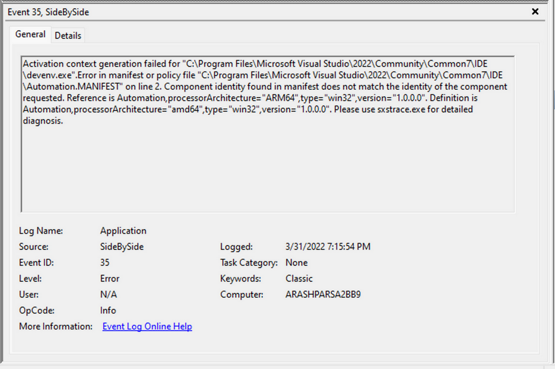


Each entry in the Windows Event Log is an "Event" and contains the following primary components:

1. **Log Name**: The name of the event log.
2. **Source**: The software that logged the event.
3. **Event ID**: A unique identifier for the event.
4. **Task Category**: This often contains a value or name that can help you understand the purpose or use of the event.
5. **Level**: The severity of the event.
6. **Keywords**: Keywords are flags that allow you to categorize events in ways beyond the other classification options. These are generally broad categories, such as "Audit Success" or "Audit Failure" in the Security log.
7. **User**: The user account that was logged on when the event occured.
8. **OpCode**: This field can identify the specific operation that the event reports.
9. **Logged**: The date and time when the event was logged.
10. **Computer**: The name of the computer where the event occured.
11. **XML Data**: All the above information is also included in an XML format along with additional event data.

The Keywords field is particularly useful when filtering event logs for specific types of events. It can significantly enhance the precision of search queries allowing you to specify events of interest, thus making log management more efficient and effective.

Taking a closer look at the event log above, you can observe several crucial elements. The Event ID in the top left corner serves as a unique identifier, which can be further researched on Microsoft's website to gather additional information. The "SideBySide" label next to the event ID represents the event source. Below, you find the general error description, often containing rich details. By clicking on the details, you can further analyze the event's impact using XML or a well-formatted view.


Additionally, you can extract supplementary information from the event log, such as the process ID where the error occured, enabling more precise analysis.


Switching your focus to security logs, consider event ID 4624, a commonly occuring event.


According to Microsoft's documentation, this event signifies the creation of a logon session on the destination machine, originating from the accessed computer where the session was established. Within this log, you find crucial details, including the "Logon ID", which allows you to correlate this logon with other events sharing the same "Logon ID". Another important detail is the "Logon Type", indicating the type of logon. In this case, it specifies a Service logon type, suggesting that "SYSTEM" initiated a new service. However, further investigation is required to determine the specific service involved, utilizing correlation techniques with additional data like the "Logon ID".

### Leveraging Custom XML Queries

To streamline your analysis, you can create custom XML queries to identify related events using the "Logon ID" as a starting point. By navigating to "Filter Current Log" -> "XML" -> "Edit Query Manually", you gain access to a custom XML query language that enables more granular log searches.

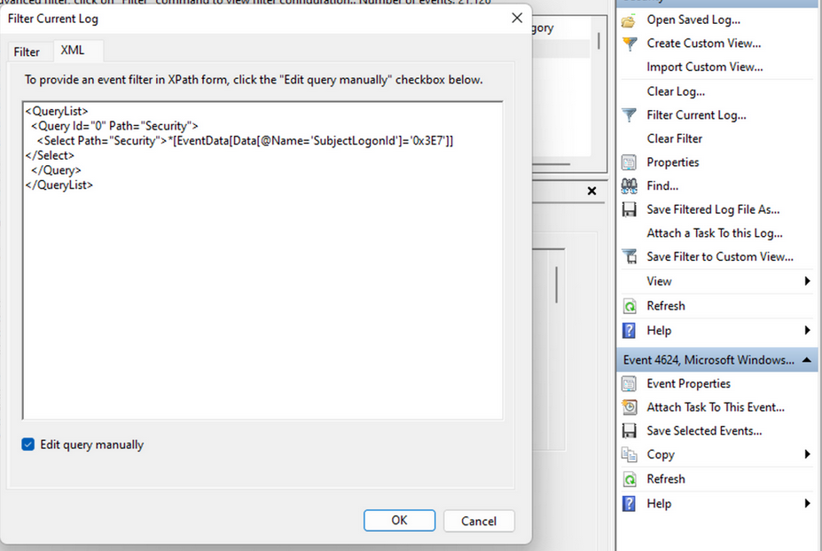

In the example query, you focus on events containing the "SubjectLogonId" field with a value of "0x3E7". The selection of this value stems from the need to correlate events associated with a specific "Logon ID" and understand the relevant details within those events.


It is worth noting that if assistance is required in crafting the query, automatic filters can be enabled, allowing exploration of their impact on the XML representation. For further guidance, Microsoft offers informative articles on [advanced XML filtering in the Windows Event Manager](https://techcommunity.microsoft.com/t5/ask-the-directory-services-team/advanced-xml-filtering-in-the-windows-event-viewer/ba-p/399761).

By constructing such queries, you can narrow down your focus to the account responsible for initiating the service and eliminate unnecessary details. This approach helps unveil a clearer picture of recent logon activities associated with the specified Logon ID. However, even with this refinement, the amount of data remains significant.

Delving into the log details progressively reveals a narrative. For instance, the analysis begins with Event ID 4907, which signifies an audit policy change.

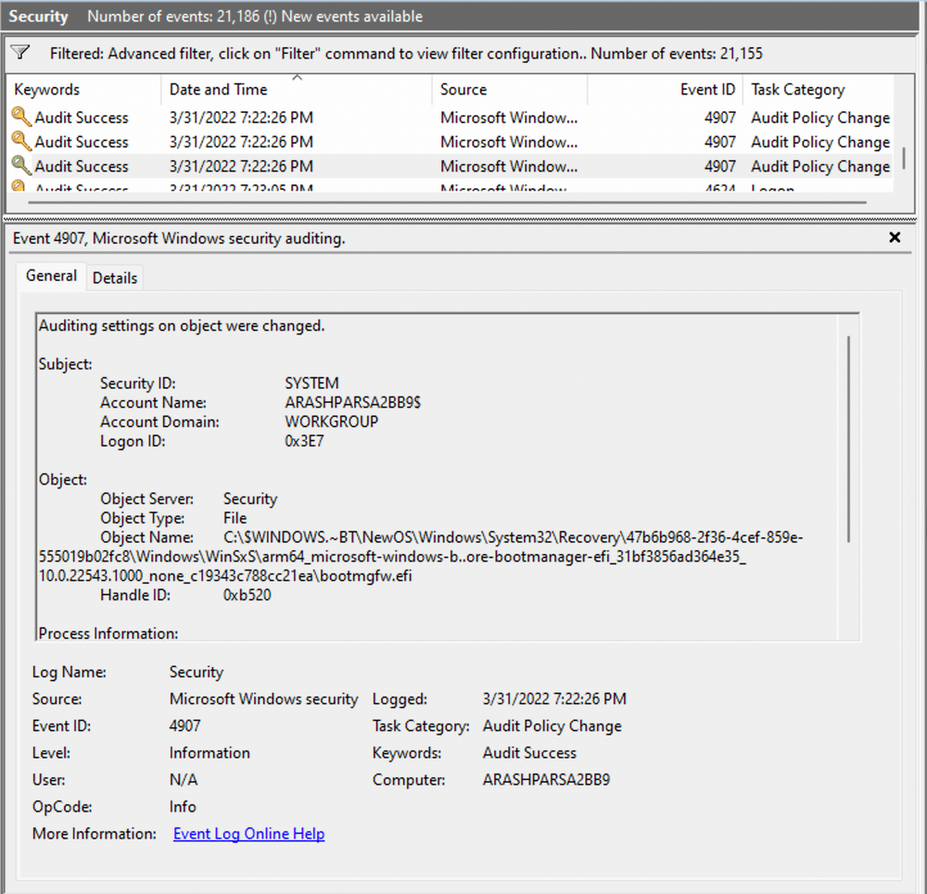

Within the event description, you find valuable insights, such as "This event generates when the SACL of an object was changed".

Based on this information, it becomes apparent that the permissions of a file were altered to modify the logging or auditing of access attempts. Further exploration of the event details reveals additional intriguing aspects.

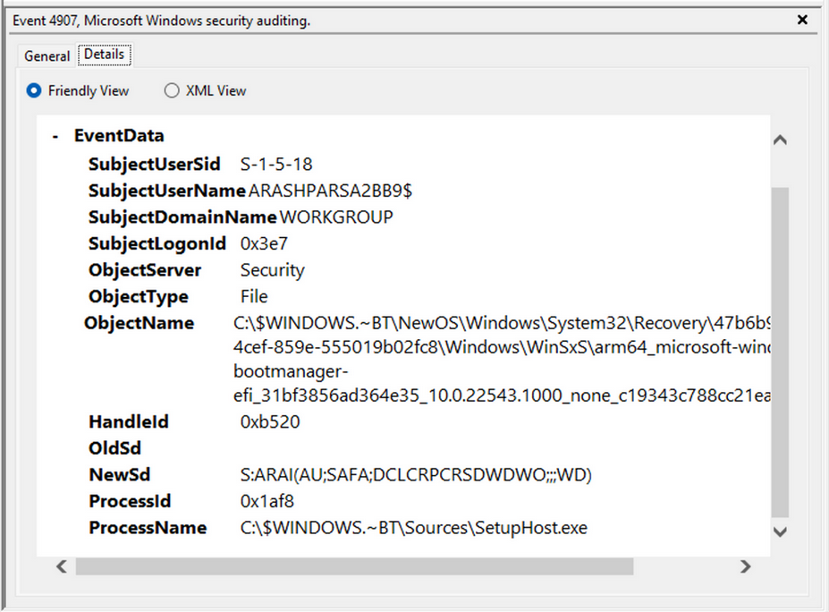

For example, the process responsible for the change is identified as "SetupHost.exe", indicating a potential setup process. The object name impacted appears to be the "bootmanager", and you can examine the new and old security descriptors to identify the changes. Understanding the meaning of each field in the security descriptor can be accomplished through references such as the article ACE Strings and Understanding SDDL Syntax.

From the observed events, you can infer that a setup process occured, involving the creation of a new file and the initial configuration of security permissions for auditing purposes. Subsequently, you encounter the logon event, followed by a "special logon" event.


Analyzing the special logon event, you gain insights into token permission granted to the user upon a successful logon.

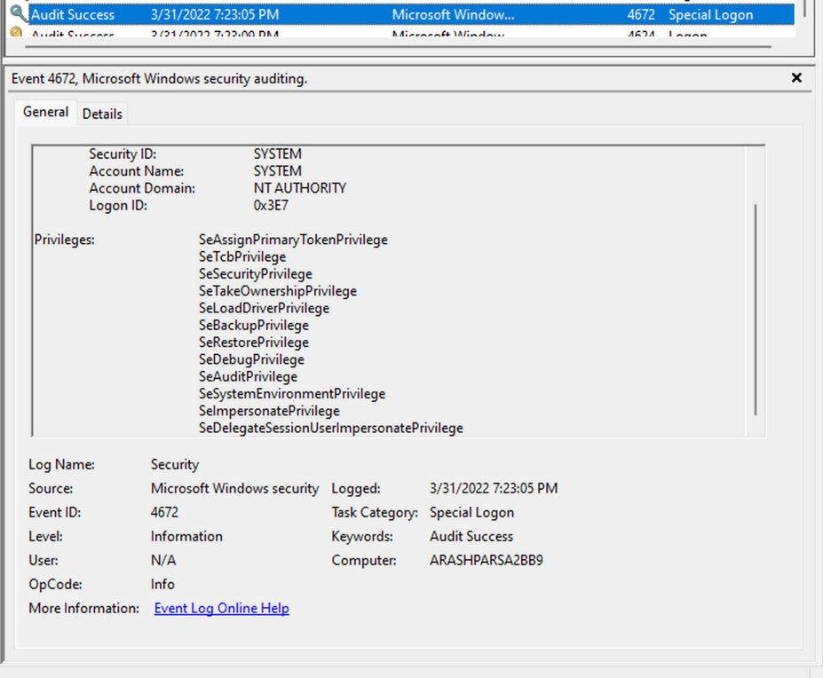

A comprehensive list of privileges can be found in the documentation on [privilege constants](https://docs.microsoft.com/en-us/windows/win32/secauthz/privilege-constants). For instance, the "SeDebugPrivilege" privilege indicates that the user possesses the ability to tamper with memory that does not belong to them.

### Useful Windows Event Logs

... can be found [here](https://www.ultimatewindowssecurity.com/securitylog/encyclopedia/).

## Sysmon & Event Logs

### Sysmon Basics

System Monitor (_Sysmon_) is a Windows system service and device driver that remains resident across system reboots to monitor and log systems to the Windows event log. Sysmon provides detailed information about process creation, network connections, changes to file creation time, and more.

Sysmon's primary components include:

- A windows service for monitoring system activity.
- A device driver that assists in capturing the system activity data.
- An event log to display captured activity data.

Sysmon's unique capability lies in its ability to log information that typically doesn't appear in the Security Event logs, and this makes it a powerful tool for deep system monitoring and cybersecurity forensic analysis.

Sysmon categorizes different types of system activity using event IDs, where each ID corresponds to a specific type of event. The full list of Sysmon event IDs can be found [here](https://learn.microsoft.com/en-us/sysinternals/downloads/sysmon).

For more granular control over what events get logged, Sysmon uses an XML-based configuration file. This file allows you to include or exclude certain types of events based on different attributes like process names, IP addresses, etc. You can refer to popular examples of useful Sysmon config files:

- for a comprehensive config, you can visit [this](https://github.com/SwiftOnSecurity/sysmon-config)
- another option is [this](https://github.com/olafhartong/sysmon-modular), which provides a modular approach

To get started, you can install Sysmon by downloading it from the [official Microsoft doc](https://docs.microsoft.com/en-us/sysinternals/downloads/sysmon). Once downloaded, open an administrator command prompt and execute the following command to install Sysmon:

```
C:\Tools\Sysmon> sysmon.exe -i -accepteula -h md5,sha256,imphash -l -n
```

To utilize a custom Sysmon config, execute the following after installing Sysmon:

```
C:\Tools\Sysmon> sysmon.exe -c filename.xml
```

### Detection Example 1: Detecting DLL Hijacking

To detect a DLL hijack, you need to focus on Event Type 7, which corresponds to module load events. To achieve this, you need to modify the ```sysmonconfig-export.xml``` Sysmon config file you dowloaded from the link above.

By examining the modified config, you can observe that the "include" comment signifies events that should be included.

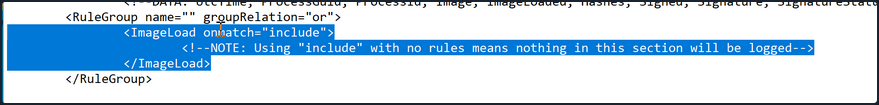

In the case of detecting DLL hijacks, you change the "include" to "exclude" to ensure that nothing is excluded, allowing you to capture the necessary data.

To utilize the updated Sysmon config, execute the following:

```
C:\Tools\Sysmon> sysmon.exe -c sysmonconfig-export.xml
```

With the modified Sysmon config, you can start observing image load events. To view these events, navigate to the Event Viewer and access "Applications and Services" -> "Microsoft" -> "Windows" -> "Sysmon". A quick check will reveal the presence of the targeted event ID.


Now see how a Sysmon event ID 7 looks like.

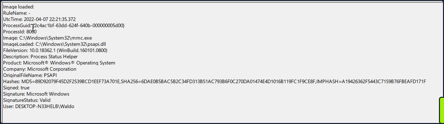

The event log contains the DLL's signing status, the process or image responsible for loading the DLL, and the specific DLL that was loaded. In your example, you observe that "MMC.exe" loaded "psapi.dll", which is also Microsoft-signed. Both files are located in the System32 directory.

**To build a detection mechanism**: Research is needed. You stumble upon an informative [blog post](https://www.wietzebeukema.nl/blog/hijacking-dlls-in-windows) that provides an exhaustive list of various DLL hijack techniques. For example:

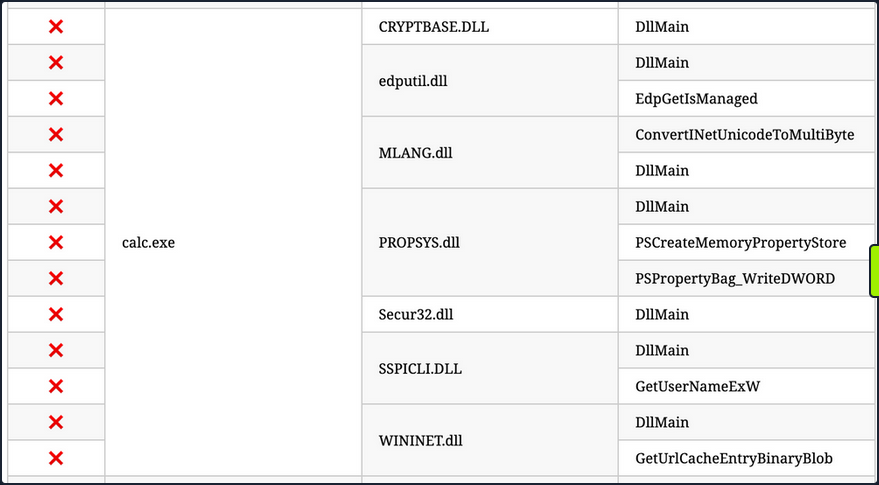

**Recreation (_using "calc.exe" and "WININET.dll"_)**: You can utilize Stephen Fewer's "hello world" [reflective DLL](https://github.com/stephenfewer/ReflectiveDLLInjection/tree/master/bin). It should be noted that DLL hijacking does not require reflective DLLs.

By following the required steps, which involve renaming ```reflective_dll.x64.dll``` to ```WININET.dll```, moving ```calc.exe``` from ```C:\Windows\System32``` along with ```WININET.dll``` to a writable directory, and executing ```calc.exe```, you achieve success. Instead of the Calculator app, a MessageBox is displayed.


Next, you analyze the impact of the hijack. First, you filter the event logs to focus on Event ID 7, which represents module load events, by clicking "Filter Current Log...".


Subsequently, you search for instances of "calc.exe", by clicking "Find ...", to identify the DLL load associated with your hijack.


The output from Sysmon provides valuable insights. Now, you can observe several indicators of compromise to create effective detection rules. Before moving forward though, compare this to an authenticate load of "wininet.dll" by "calc.exe".


Exploring these IOCs:

1. "calc.exe", originally located in System32, should not be found in a writable directory. Therefore, a copy of "calc.exe" in a writable directory serves as an IOC, as it should always reside in System32 or potentially Syswow64.
2. "WININET.dll", originally located in System32, should not be loaded outside of System32 by calc.exe. If instances of "WININET.dll" loading occur outside of System32 with "calc.exe" as the parent process, it indicates a DLL hijack within calc.exe. While caution is necessary when alerting on all instances of "WININET.dll" loading outside of System32, in the case of "calc.exe", you can confidently assert a hijack due to the DLL's unchanging name, which attackers cannot modify to evade detection.
3. The original "WININET.dll" is Microsoft-signed, while your injected DLL remains unsigned.

These three powerful IOCs provide an effective means of detecting a DLL hijack involving calc.exe. It's important to note that while Sysmon and event logs offer valuable telemetry for hunting and creating alert rules, they are not the sole sources of information.

### Detection Example 2: Detecting Unmanaged PowerShell/C-Sharp Injection

C# is considered a "managed" language, meaning it requires a backend runtime to execute its code. The Common Language Runtime (_CLR_) serves as this runtime environment. Managed code does not directly run as assembly; instead, it is compiled inty a bytecode format that the runtime processes and executes. Consequently, a managed process relies on the CLR to execute C# code.

As defenders, you can leverage this knowledge to detect unusual C# injections or executions within your environment. To accomplish this, you can utilize a useful utility called [Process Hacker](C:\Windows\System32).

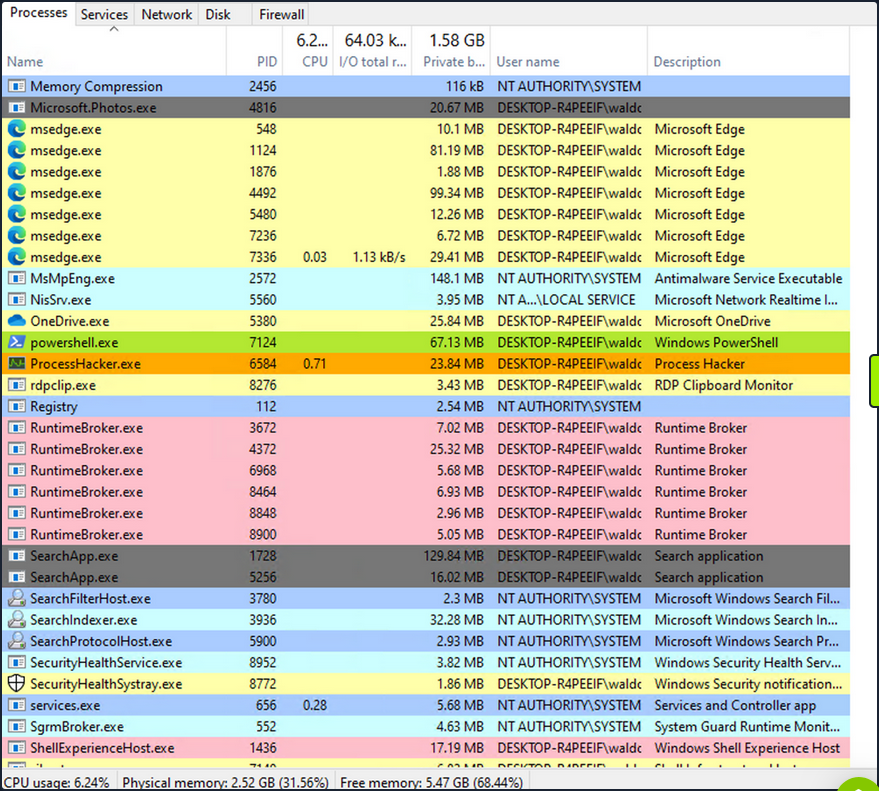

By using Process Hacker, you can observe a range of processes within your environment. Sorting the processes by name, you can identify color-coded distinctions. Notably, "powershell.exe", a managed process, is highlighted in green compared to other processes. Hovering over "powershell.exe" reveals the label "Process is managed (_.NET_)," confirming its managed status.

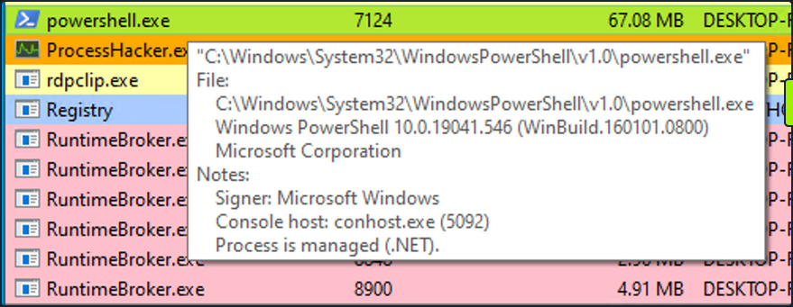

Examining the module loads for ```powershell.exe```, by right-clicking on ```powershell.exe```, clicking "Properties", and navigating to "Modules", you can find relevant information.

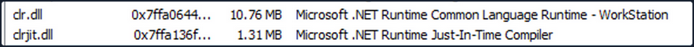

The presence of "Microsoft .NET Runtime ...", ```clr.dll```, and ```clrjit.dll``` should attract your attention. These 2 DLLs are used when C# code is ran as part of the runtime to execute the bytecode. If you observe these DLLs loaded in processes that typically to not reuqire them, it suggests a potential execute-assembly or unmanaged PowerShell injection attack.

To showcase unmanaged PowerShell injection, you can inject an unmanaged PowerShell-like DLL into a random process, such as ```spoolsv.exe```. You can do that by utilizing the [PSInject project](https://github.com/EmpireProject/PSInject) in the following manner:

```ps
powershell -ep bypass
Import-Module .\Invoke-PSInject.ps1
Invoke-PSInject -ProcId [Process ID of spoolsv.exe] -PoshCode "V3JpdGUtSG9zdCAiSGVsbG8sIEd1cnU5OSEi"
```

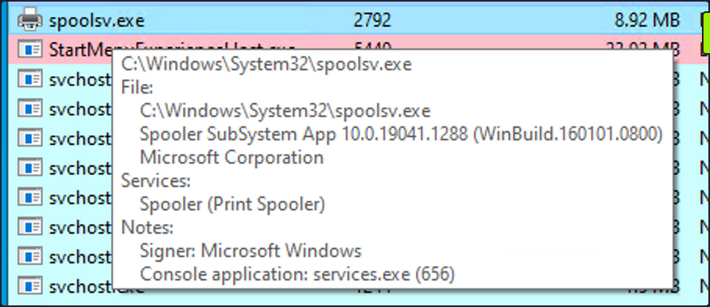

After the injection, you observe that "spoolsv.exe" transitions from an unmanaged to a managed state.

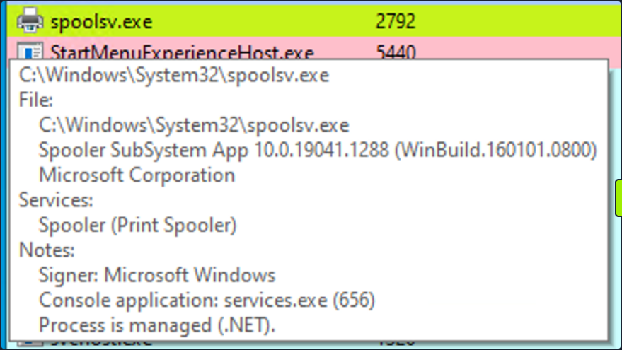

Additionally, by referring to both the related "Modules" tab of Process Hacker and Sysmon Event ID 7, you can examine the DLL load information to validate the presence of the aforementioned DLLs.

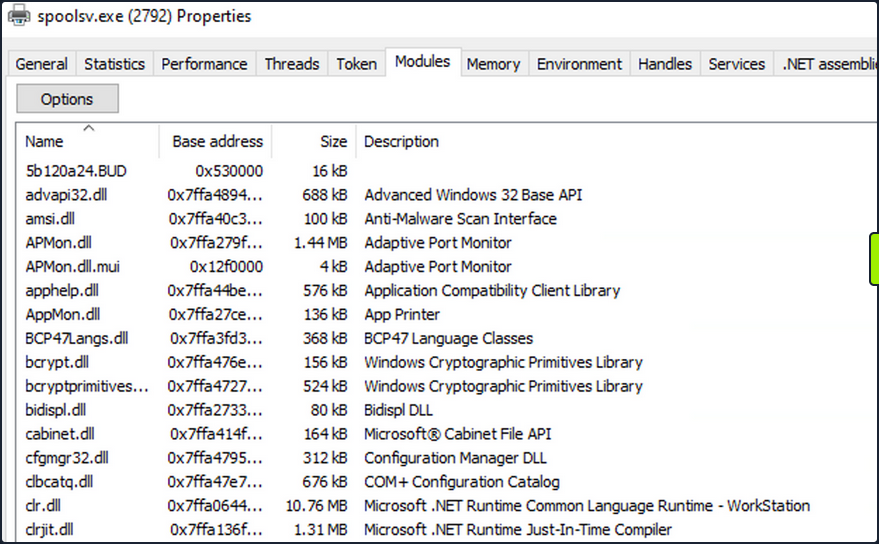

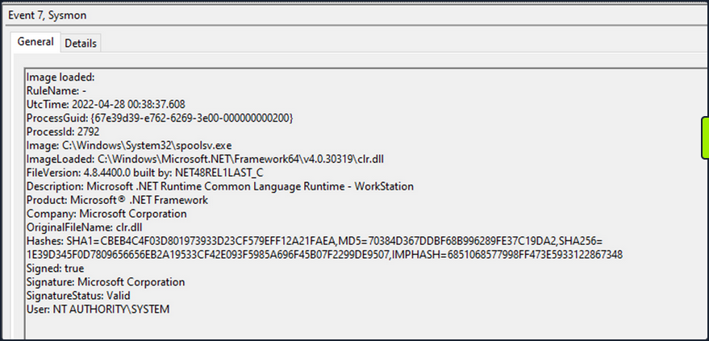

### Detection Example 3: Detecting Credential Dumping

Another critical aspect of cybersecurity is detecting credential dumping activities. One widely used tool for credential dumping is Mimikatz, offering various methods for extracting Windows credentials. One specifc command, ```sekurlsa::logonpasswords```, enables the dumping of password hashes or plaintext passwords by accessing the Local Security Authority Subsystem Service. LSASS is responsible for managing user credentials and is a primary target for credential-dumping tools like Mimikatz.

To detect this activity, you can rely on a different Sysmon event. Instead of focusing on DLL loads, you shift your attention to process access events. By checking Sysmon Event ID 10, which represents "ProcessAccess" events, you can identify any suspicious attempts to access LSASS.


For instance, if you observe a random file (_"AgentEXE" in this case_) from a random folder attempting to access LSASS, it indicates unusual behavior. Additionally, the ```SourceUser``` being different from the ```TargetUser``` further emphasizes the abnormality. It's also worth noting that as part of the mimikatz-based credential dumping process, the user must request SeDebugPrivileges. As the name suggests, it's primarily used for debugging. This can be another IOC.