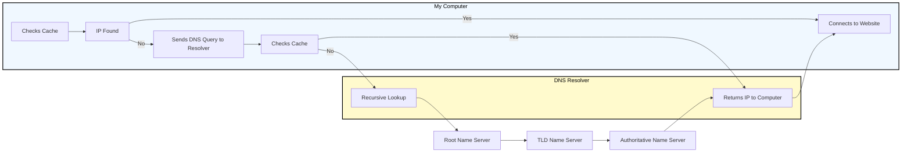

- [Web Reconnaissance](#web-reconnaissance)
  - [WHOIS](#whois)
  - [Domain Name System (DNS)](#domain-name-system-dns)
  - [Subdomains](#subdomains)
  - [Fingerprinting](#fingerprinting)
  - [Crawling](#crawling)
  - [Search Engines](#search-engines)
  - [Web Archives](#web-archives)


# Web Reconnaissance

... is the foundation of a thorough security assessment and involves systematically and meticulously collecting information about a target website or web application.

Some primary goals:

- Identifying Assets
- Discovering Hidden Information
- Analysing the Attack Surface
- Gathering Intelligence

In **active recon**, the attacker **directly interacts** with the target system to gather information:

| Technique | Example | Description | Tools | Risk of Detection |
| --------- | ------- | ----------- | ----- | ----------------- |
| **Port Scanning** | _using Nmap to scan a web server for open ports_ | identifying open ports and services running on the target | Nmap, Masscan, Unicornscan | **HIGH**: Direct interaction with the target can trigger IDS and firewalls |
| **Vulnerability Scanning** | _tunning Nessus against a web application to check for SQLi flaws or XSS vulns_ | probing the target for known vulns, such as outdated software or misconfigurations | Nessus, OpenVAS, Nikto | **HIGH**: Vulnerability scanners send exploit payloads that security solutions can detect |
| **Network Mapping** | _using traceroute to determine the path packets take to reach the target server, revealing potential network hops and infrastructure_ | mapping the target's network topology, including connected devices and their relationships | Traceroute, Nmap | **MEDIUM to HIGH**: Excessive or unusual network traffic can raise suspicion |
| **Banner Grabbing** | _connecting to a web server on port 80 and examining the HTTP banner to identify the web server software and version_ | retrieving information from banners displayed by services running on the target | Netcat, curl | **LOW**: Banner grabbing typically involves minimal interaction that can still be logged |
| **OS Fingerprinting** | _using Nmap's OS detection capabilities (```-O```) to determine if the target is running Windows, Linux, or another OS_ | identifying the OS running on the target | Nmap, Xprobe2 | **LOW**: OS fingerprinting is usually passive, but some advanced techniques can be detected |
| **Service Enumeration** | _using Nmap's service version detection (```-sV```) to determine if a web server is running Apache 2.4.50 or Nginx 1.18.0_ | determining the specific versions of services running on open ports | Nmap | **LOW**: Similar to banner grabbing, service enumeration can be logged but is less likely to trigger alerts |
| **Web Spidering** | _running a web crawler like Burp Spider or OWASP ZAP Spider to map out the structure of a website and discover hidden resources_ | crawling the target website to identify web pages, directories, and files | Burp Suite Spider, OWASP ZAP Spider, Scrapy | **LOW to MEDIUM**: Can be detected if the crawler's behaviour is not carefully configured to mimic legitimate traffic |

In **passive recon** information about the target is gathered **without directly interacting** with it.

| Technique | Example | Description | Tools | Risk of Detection |
| --------- | ------- | ----------- | ----- | ----------------- |
| Search Engine Queries | _searching Google for "[Target Name] Employees" to find employee information or social media profiles_ | utilising search engines to uncover information about the target, including websites, social media, profiles, social media profiles, and news article | Google, DuckDuckGo, Bing, Shodan, ... | **VERY LOW**: Search engine queries are normal internet activity and unlikely to trigger alerts |
| **WHOIS Lookup** | _performing a WHOIS lookup on a target domain to find the registrant's name, contact information, and name servers_ | querying WHOIS databases to retrieve domain registration details | whois command-line tool, online WHOIS lookup services | **VERY LOW**: WHOIS queries are legitimate and do not raise suspicion |
| **DNS** | _using dig to enumerate subdomains of a target domain_ | analysing DNS records to identify subdomains, mail servers, and other infrastructure | dig, nslookup, host, dnsenum, fierce, dnsrecon | **VERY LOW**: DNS queries are essential for internet browsing and are not typically flaggedd as suspicious |
| **Web Archive Analysis** | _using the wayback machine to view past versions of a target website to see how it has changed over time_ | examining historical snapshots of the target's website to identify vulnerabilities, or hidden information | Wayback Machine | **VERY LOW**: Accessing archived versions of a website is a normal activity |
| **Social Media Analysis** | _searching LinkedIn for employees of a target organisation to learn about their roles, responsibilities, and potential social engineering targets_ | gathering information from social media platforms like LinkedIn, Twitter, and Facebook | LinkedIn, Twitter, Facebook, specialised OSINT Tools | **VERY LOW**: Accessing public social media profiles is not considered intrusive |
| **Code Repos** | _searching GitHub for code snippets or repos related to the target that might contain sensitive information or code vulnerabilities_ | analysing publicly accessible code repos like GitHub for exposed credentials or vulns | GitHub, GitLab | **VERY LOW**: Code repos are meant for public access, and searching them is not suspicious |

## WHOIS

... is a widely used query and response protocol designed to access databases that store information about registered internet resources.

Example:

```bash
d41y@htb[/htb]$ whois inlanefreight.com

[...]
Domain Name: inlanefreight.com
Registry Domain ID: 2420436757_DOMAIN_COM-VRSN
Registrar WHOIS Server: whois.registrar.amazon
Registrar URL: https://registrar.amazon.com
Updated Date: 2023-07-03T01:11:15Z
Creation Date: 2019-08-05T22:43:09Z
[...]
```

A WHOIS record typically contains:

- **Domain Name**: domain name itself
- **Registrar**: company where the domain was registered
- **Registrant Contact**: person or organization that registered the domain
- **Administrative Contact**: person responsible for managing the domain
- **Technical Contact**: person handling technical issues related to the domain
- **Creation and Expiration Dates**: when the domain was registered and when it's set to expire
- **Name Servers**: servers that translate the domain name into an IP address

Facebook Example:

```bash
d41y@htb[/htb]$ whois facebook.com

   Domain Name: FACEBOOK.COM
   Registry Domain ID: 2320948_DOMAIN_COM-VRSN
   Registrar WHOIS Server: whois.registrarsafe.com
   Registrar URL: http://www.registrarsafe.com
   Updated Date: 2024-04-24T19:06:12Z
   Creation Date: 1997-03-29T05:00:00Z
   Registry Expiry Date: 2033-03-30T04:00:00Z
   Registrar: RegistrarSafe, LLC
   Registrar IANA ID: 3237
   Registrar Abuse Contact Email: abusecomplaints@registrarsafe.com
   Registrar Abuse Contact Phone: +1-650-308-7004
   Domain Status: clientDeleteProhibited https://icann.org/epp#clientDeleteProhibited
   Domain Status: clientTransferProhibited https://icann.org/epp#clientTransferProhibited
   Domain Status: clientUpdateProhibited https://icann.org/epp#clientUpdateProhibited
   Domain Status: serverDeleteProhibited https://icann.org/epp#serverDeleteProhibited
   Domain Status: serverTransferProhibited https://icann.org/epp#serverTransferProhibited
   Domain Status: serverUpdateProhibited https://icann.org/epp#serverUpdateProhibited
   Name Server: A.NS.FACEBOOK.COM
   Name Server: B.NS.FACEBOOK.COM
   Name Server: C.NS.FACEBOOK.COM
   Name Server: D.NS.FACEBOOK.COM
   DNSSEC: unsigned
   URL of the ICANN Whois Inaccuracy Complaint Form: https://www.icann.org/wicf/
>>> Last update of whois database: 2024-06-01T11:24:10Z <<<

[...]
Registry Registrant ID:
Registrant Name: Domain Admin
Registrant Organization: Meta Platforms, Inc.
[...]
```

## Domain Name System (DNS)

... acts as the internet's GPS, guiding your online journey from memorable landmarks (_domain names_) to precise numerical coordinates (_IP addresses_).



## Subdomains

## Fingerprinting

## Crawling

## Search Engines

## Web Archives
