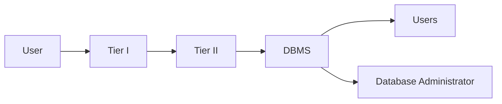
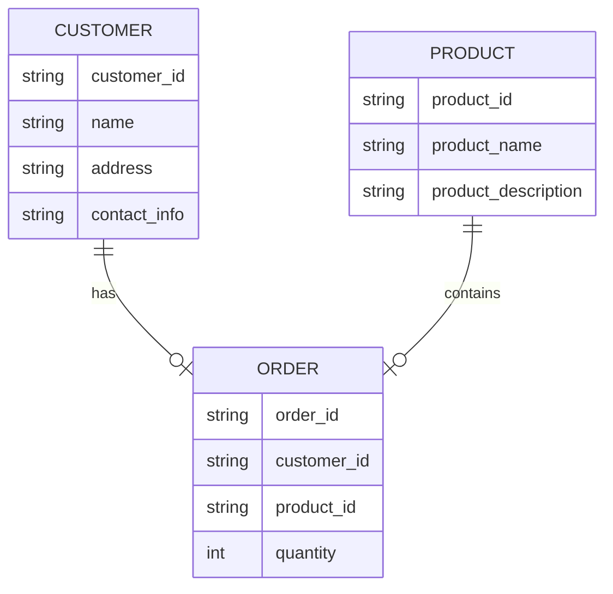
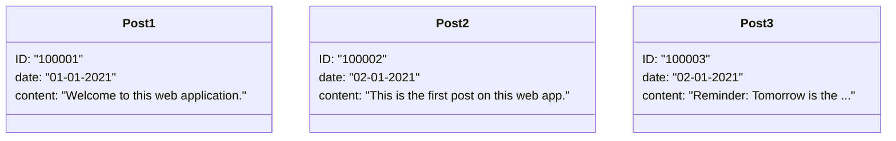

- [Database Management Systems](#database-management-systems)
  - [DBMSs](#dbmss)
  - [Architecture](#architecture)
  - [Relational Databases](#relational-databases)
  - [Non-relational Databases](#non-relational-databases)

---

# Database Management Systems

... help create, define, host, and manage databases. Various kinds of DBMS were designed over time, such as file-based, Relational DBMS (RDBMS), NoSQL, Graph based, and Key/Value stores.

## DBMSs

Some essential features of a DBMS include:

| Feature | Description |
| ------- | ----------- |
| **Concurrency** | a real world application might have multiple users interacting with it simultaneously; a DBMS makes sure that these concurrent interactions succeed without corrupting or losing any data |
| **Consistency** | with so many concurrent interactions, the DBMS needs to ensure that the data remains consistent and valid throughout the database |
| **Security** | DBMS provide fine-grained security controls through user authentication and permissions; this will prevent unauthorized viewing or editing of sensitive data |
| **Reliability** | it is easy to backup databases and rolls them back to a previous state in case of data loss or a breach |
| **Structured Query Language** | SQL simplifies user interaction with the database with an intuitive syntax supporting various operations |

## Architecture



**Tier I** usually consists of client-side applications such as websites or GUI programs. These applications consist of high-level interactions such as user login or commenting. The data from these interactions is passed to **Tier II** through API calls or requests.


## Relational Databases

... uses a schema, a template, to dictate the data structure stored in the database. Tables in relational databases are associated with keys that provide a quick database summary or access to the specific row or column when specific data needs to be reviewed. These tables, also called entities, are all related to each other. The concept required to link one table to another using its keys, is called a **relational database management system (RDBMS)**.



## Non-relational Databases

... also called a NoSQL database, does not use tables, rows, and columns or primary keys, relationships, or schemas. Instead, a NoSQL database stores data using various storage models, depending on the type of data stored. Four common storage models are:

- Key-Value
- Document-Based
- Wide-Column
- Graph



The above example can be represented using JSON as:

```json
{
  "100001": {
    "date": "01-01-2021",
    "content": "Welcome to this web application."
  },
  "100002": {
    "date": "02-01-2021",
    "content": "This is the first post on this web app."
  },
  "100003": {
    "date": "02-01-2021",
    "content": "Reminder: Tomorrow is the ..."
  }
}
```