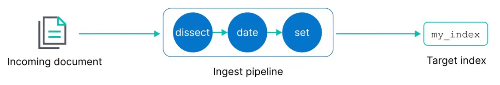
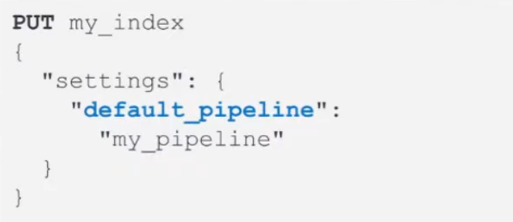
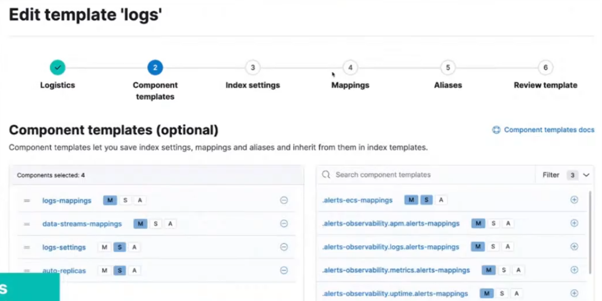

- [Configuring Elasticsearch Index for Time Series Data](#configuring-elasticsearch-index-for-time-series-data)
  - [Index Fundamentals](#index-fundamentals)
    - [Documents are indexed into an index](#documents-are-indexed-into-an-index)
    - [Managing data](#managing-data)
    - [Different indices, different data](#different-indices-different-data)
    - [Index summary](#index-summary)
    - [How to configure an index up front?](#how-to-configure-an-index-up-front)
  - [Ingest Pipeline](#ingest-pipeline)
    - [Ingest Pipelines](#ingest-pipelines)
    - [Exmaple: Dissect processor](#exmaple-dissect-processor)
    - [Adding processors](#adding-processors)
    - [Using your pipeline](#using-your-pipeline)
  - [Index Lifecycle Policy](#index-lifecycle-policy)
    - [Time series data management](#time-series-data-management)
    - [Rollover index](#rollover-index)
    - [Using rollover processes](#using-rollover-processes)
    - [IL policy example](#il-policy-example)
    - [What are index templates?](#what-are-index-templates)
    - [Logistics](#logistics)
    - [Naming schemes](#naming-schemes)
    - [Example of naming convention](#example-of-naming-convention)
    - [Data streams](#data-streams)
    - [How is the data stream name created?](#how-is-the-data-stream-name-created)
    - [Component template example](#component-template-example)
    - [Index settings](#index-settings)
    - [Mappings](#mappings)
    - [Index alias](#index-alias)
  - [Bootstrap to create index using rollover alias](#bootstrap-to-create-index-using-rollover-alias)
    - [Adding index alias to data stream](#adding-index-alias-to-data-stream)

---

# Configuring Elasticsearch Index for Time Series Data

## Index Fundamentals

### Documents are indexed into an index

- In ES, a document is indexed into an index
  - you use index as a verb and a noun
- An index is a logical way of grouping data
  - an index can be thought of as an optimized collection of documents

### Managing data

- Data management needs differ depending on the type of data you are collecting:

|   | Static data | Time series data |
| - | ----------- | ---------------- |
| **Data grows ...** | slowly | fast |
| **Updates ...** | may happen | never happen |
| **Old data is read ...** | frequently | infrequently |

### Different indices, different data

Agents installed on your hosts use different integrations to send different types of data to ES.

- Metrics
- Logs
- Network Packets
- Custom Logs

### Index summary

An index is compromised of multiple parts:

- Settings
  - control what comes in with an ingest pipeline
  - manage older data with an IL policy
  - and many more...
- Mappings
  - field names and data types
- Aliases
  - namend resource used to communicate with indices

### How to configure an index up front?

Configure index setting preferences before the index is created using an index template.

- Configure index settings and mappings
- Add ingest pipeline
- Add IL policy
- The default settings will be applied to any setting not configured in the index template

## Ingest Pipeline

### Ingest Pipelines

- perform common transformations on your data before indexing
- consist of a series of processors



### Exmaple: Dissect processor

- The dissect processor extracts structured fields out of a single text field within a document

### Adding processors

- Add as many processors as you need
- Optionally add on-failure processors
- Test your pipeline with sample documents

### Using your pipeline

- Set a default pipeline



## Index Lifecycle Policy

### Time series data management

- Time series data typically grows quickly and is almost never updated

### Rollover index

- A rollover creates a new index
  - Set conditions based on age or size
  - which becomes the new write index

### Using rollover processes

- Use rollover aliases to automate communicating with the indices
  - with a single write index

### IL policy example

- During the hot phase you might:
  - create a new index every two weeks
- In the warm phase you might:
  - make the index read-only and move to warm for one week
- In the cold phase you might:
  - convert to snapshot, decrease the number of replicas, and move to cold for three weeks
- In the delete phase:
  - the only action allowed is to delete the 28-days-old index

### What are index templates?

- Use an index template to configure index options before an index is created
- An index template can contain the following sections:
  - logistics
  - component templates
  - settings
  - mappings
  - aliases

### Logistics

- Use a naming convention that matches an index pattern
  - templates match an index pattern
  - if a new index matches the pattern, then the template is applied

### Naming schemes

- Managed index templates follow a specific naming scheme:
  - **type**, to describe the generic data type
  - **dataset**, to describe the specific subset of data
  - **namespace**, for user-specific details
- Include ```constant_keyword``` fields for queries:
  - ```index_name.type```
  - ```index_name.dataset```
  - ```index_name.namespace```
- ```constant_keyword``` has the same value for all documents

### Example of naming convention

- Log data separated by **app** and **env**
- Each datasets can have separate IL policies

### Data streams

- A data stream option performs a rollover of your index without using an IL policy
  - use a with an IL policy to bypass default rollover settings
  - the stream routes the request to the appropriate backing index

### How is the data stream name created?

The index that matches the index pattern will be the name of the data stream.

- Defined in the index template

### Component template example

- Use the component in an index template:



### Index settings

Include some of the following options:

- Routing allocation
  - route your index to "hot" phase
- Shard size
  - number of shards
  - number of replicas
- IL policy name
  - assign any created IL policy to this index
- Default pipeline
  - assign any created ingest pipeline to this index

### Mappings

Include some of the following options:

- Field names
  - define field names based on ES common schema guidelines
- Field data types
  - assign analyzers and create multi-fields
- Time series data must include data field
  - @timestamp field required for data streams

### Index alias

- An index alias lets you use a single named resource to index docs into a single index and search across multiple indices
  - can be used to point to a rollover alias or a data stream
  - must configure write requests to a single resource

## Bootstrap to create index using rollover alias

Bootstrap the initial index by designating it as the write index and add an index alias that matches the rollover alias name specified in your IL policy.

- Bootstrapping the index is not required on data streams
- The name of this index must match the index template and end with -00001

### Adding index alias to data stream

Create an index alias for a data stream by designating it as the write index.

- This will add an index alias to use for indexing and searching