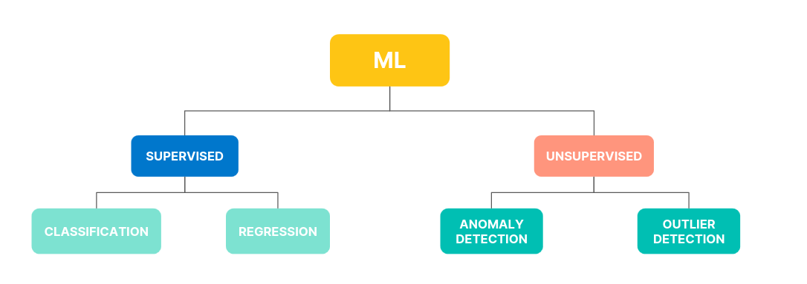
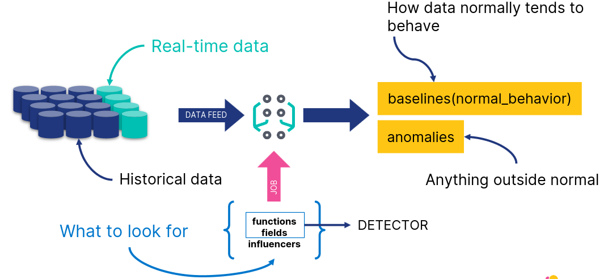
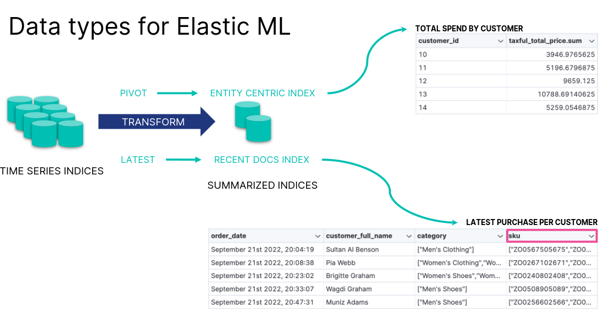

- [Analyze Your Data With Machine Learning](#analyze-your-data-with-machine-learning)
  - [Introduction to Elastic Machine Learning](#introduction-to-elastic-machine-learning)
    - [Machine Learning in the Elastic Stack](#machine-learning-in-the-elastic-stack)
    - [Elastic ML](#elastic-ml)
    - [Anomaly Detection](#anomaly-detection)
    - [Creating a Job](#creating-a-job)
    - [Restore Model Snapshots](#restore-model-snapshots)
    - [Forecasting](#forecasting)
  - [Analyze Anomaly Detection Results](#analyze-anomaly-detection-results)
    - [Actionable ML](#actionable-ml)
    - [Tools for Analysis](#tools-for-analysis)
    - [Annotations](#annotations)
  - [Data Frame Analytics](#data-frame-analytics)
    - [Data Types in Elastic ML](#data-types-in-elastic-ml)
    - [Outlier Detection Example](#outlier-detection-example)
    - [Detect Outliers](#detect-outliers)
  - [AIOps Labs](#aiops-labs)
    - [AIOps](#aiops)
    - [Explain Log Rate Spikes](#explain-log-rate-spikes)
    - [Log Pattern Analysis](#log-pattern-analysis)
    - [Change Point Detection](#change-point-detection)

---

# Analyze Your Data With Machine Learning

## Introduction to Elastic Machine Learning

### Machine Learning in the Elastic Stack

- The Elastic Stack supports several data analysis use cases using supervised and unsupervised ML
  - anomaly detection
  - forecasting
  - language identification
- The goal is to operationalize and simplify data science

### Elastic ML

### Anomaly Detection

- Identify patterns and unusual behavior in historical and streaming time series data

### Creating a Job

1. Choose a job type from the available wizards
2. Define the time range
3. Choose field and metric
4. Define bucket span
5. Create job and view results

### Restore Model Snapshots

- Snapshot saved frequently to an index
- Revert to a snapshot in case of
  - system failure
  - undesirable model change due to one off events

### Forecasting

- Given a model, predict future behavior

## Analyze Anomaly Detection Results

### Actionable ML

- After you have created a model of your data, and detected anomalies, you may want to:
  - analyze and enrich the results
  - share your results within a Dashboard

### Tools for Analysis

- Single Metric Viewer
  - Display single time series
  - Chart of Actual vs. Expected
    - Blue line
    - Blue shade
- Anomaly Explorer
  - Swimlanes for different job results
    - Overall score
    - Shared influencers

### Annotations

- When you run a machine learning job, its algorithm is trying to find anomalies - but it doesn't know what the data itself is about
- User annotations offer a way to augment the results with the knowledge you as a user have about the data

## Data Frame Analytics

### Data Types in Elastic ML

### Outlier Detection Example

- Based on the eCommerce orders, which customers are unusual?
  - customers who show fraudulent behavior
  - "VIP" customers who spend much more than others
- First, transform the data to a customer-centric index
- Next, detect outliers based on the relevant features

### Detect Outliers

- Select the fields you want to analyze
- Review the results

## AIOps Labs

### AIOps

- Reduce the time to understand your data
- Automate IT operations by leveraging AI and machine learning
  - explain log rate spikes
  - log pattern analysis
  - change point detection

### Explain Log Rate Spikes

- Identify reasons for increases in log rates

### Log Pattern Analysis

- Find patterns in unstructured log messages

### Change Point Detection

- Detect distribution or trend changes