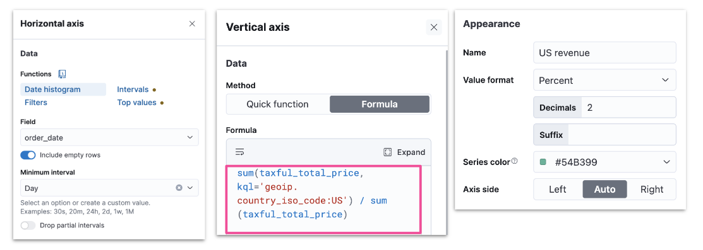
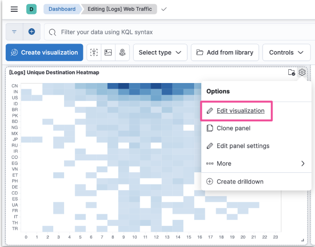

- [Advanced Kibana](#advanced-kibana)
  - [Formulas](#formulas)
    - [Lens Formulas](#lens-formulas)
    - [Formulas Categories](#formulas-categories)
    - [Formula Example: filter radio](#formula-example-filter-radio)
  - [Runtime Fields](#runtime-fields)
    - [The Need for Runtime Fields](#the-need-for-runtime-fields)
    - [Schema On Write vs On Read](#schema-on-write-vs-on-read)
    - [Schema On Write in Detail](#schema-on-write-in-detail)
    - [Schema On Read in Detail](#schema-on-read-in-detail)
    - [Runtime Fields and Painless Scripts](#runtime-fields-and-painless-scripts)
    - [Add a Runtime Field](#add-a-runtime-field)
    - [Create a Runtime Field](#create-a-runtime-field)
    - [Create a Custom Label](#create-a-custom-label)
    - [Set a Value](#set-a-value)
    - [Set a Format](#set-a-format)
    - [Preview and Save](#preview-and-save)
    - [Notes on Using Runtime Fields](#notes-on-using-runtime-fields)
  - [Vega](#vega)
    - [Vega and Vega-Lite](#vega-and-vega-lite)
    - [Vega-Lite Visualization](#vega-lite-visualization)
    - [Getting Started with Vega-Lite](#getting-started-with-vega-lite)
    - [Creating a Custom Vega-Lite Visualization](#creating-a-custom-vega-lite-visualization)
    - [Retrieve Data from ES](#retrieve-data-from-es)
    - [Vega-Lite in Sample Dashboards](#vega-lite-in-sample-dashboards)
    - [Editing the Sample Visualization](#editing-the-sample-visualization)
    - [Body Example](#body-example)
    - [Transform Example](#transform-example)
    - [Encoding Example](#encoding-example)
    - [Editing the Sample Visualization](#editing-the-sample-visualization-1)

---

# Advanced Kibana

## Formulas

### Lens Formulas

- Divide two values to produce a percent
  - Metric for subset of docs over entire dataset
  - This week metric over last week metric
  - Metric for individual group over all groups

### Formulas Categories

- ES metrics
  - average, min, max, sum, etc
- Time series functions that use ES metrics
  - cumulative_sum, moving_average, etc
- Math functions
  - abs, round, sqrt, etc

1. Pick and edit dashboard
2. Edit lens
3. Understand context
4. Examine formula

### Formula Example: filter radio



## Runtime Fields

### The Need for Runtime Fields

- ES stores data in indices
- Kibana queries data stored in ES indices
- To run fast queries ES uses structured data by default
- There are some situations that require querying unstructured data
  - Add fields to existing documents without reindexing your data
  - Work with your data without understanding how it's structured
  - Override the value returned from an indexed field at query time
  - Define fields for a specific use without modifying its structure

### Schema On Write vs On Read

- ES uses schema on write by default
  - All fields in a document are indexed upon ingest
- Runtime fields allow ES to also support schema on read
  - Data can be quickly ingested in raw form without any indexing
  - Except for certain necessary fields such as timestamp or response codes
  - Other fields can be created on the fly when queries are run against the data

### Schema On Write in Detail

- Applied during data storage
- Better search performance
- Need to know data structure before writing
- Not flexible as the schema cannot be changed

### Schema On Read in Detail

- Applied during data retrieval
- Better write perfomance
- No need to know data structure before writing
- More flexible as the schema can be changed

### Runtime Fields and Painless Scripts

- Use Painless scripts to
  - retrieve a value of fields in doc
  - compute something on the fly
  - to emit a value into a field
- Use the created field in
  - queries
  - visualizations
- Can impact Kibana performance

### Add a Runtime Field

- Discover
- Lens
- Data view

### Create a Runtime Field

- Provide a name
- Define the output type

### Create a Custom Label

- Optionally customize how to display your runtime field in Kibana

### Set a Value

- Define a Painless script to compute a value

### Set a Format

- Optionally set a format to display the runtime field in the way you like

### Preview and Save

- Save your runtime field when it looks good
- You can preview any documents you want through the arrows

### Notes on Using Runtime Fields

- Benefits
  - Add fields after ingest
  - Does not increase index size
  - Increases ingestion speed
  - Readily available for use
  - Promotable to indexed field
- Compromises
  - Can impact search performance
    - based on script
  - Index frequently searched fields
    - e.g., @timestamp
  - Balance performance and flexibility
    - indexed fields + runtime fields

## Vega

### Vega and Vega-Lite

- Vega
  - Open source visualization grammar
  - Declarative language for visualization
  - Uses JSON for describing
- Vega-Lite
  - Higher level language
  - Built on top of Vega
  - Used to rapidly create common statistical graphics

### Vega-Lite Visualization

- Panel can use data from
  - ES
  - Elastic Map Service
  - URL
  - Static data
- Kibana panel supports HJSON, though both Vega-Lite and Vega use JSON

### Getting Started with Vega-Lite

- Visit the Vega-Lite example gallery: http://vega.github.io/vega-lite/examples
- Select any example to see its JSON specification

### Creating a Custom Vega-Lite Visualization

- To see the visualization in Vega or Vega-Lite in Kibana
  - copy the JSON specification of a Vega-Lite example
  - create a new custom visualization in Kibana
  - paste the specification in the editor
  - click "Update"

### Retrieve Data from ES

- Use the data clause to retrieve data from ES
- Specify a url clause with a ```%timefield%```, ```index```, and ```body```
- And a format clause with a property

```
"data": {
    "url": {
        "%timefield%": "...",
        "index": "...",
        "body": {
            ...
        }
    },
    "format": {
        "property": "..."
    }
}
```

### Vega-Lite in Sample Dashboards

- Color intensity shows the number of unique visitors
- X-axis shows daily hours
- Y-axis shows countries



### Editing the Sample Visualization

- You can check the JSON used to create the custom visualization

### Body Example

```
body: {
    aggs: {
        countries: {
            terms: {
                field: geo.dest
                size: 25
            }
            aggs: {
                hours: {
                    histogram: {
                        field: hour_of_day
                        interval: 1
                    }
                aggs: {
                    unique: {
                        cardinality: {
                            field: clientip
    ...
    size: 0
}
```

### Transform Example

```
transform: [
    {
        flatten: ["hours.buckets"],
        as: ["buckets"]
    },
    {
        filter: "datum.buckets.unique.value > 0"
    }
]

mark: {
    type: rect
    tooltip: {
        expr: "{
            \"Unique Visitors\": datum.buckets.unique.value,
            \"geo.src\": datum.key,
            \"Hour\": datum.buckets.key}"
    }
}
```

### Encoding Example

```
    encoding: {
        x: {
            field: buckets.key
            type: nominal
            scale: {
                domain: {
                    expr: "sequence(0, 24)"
                }
            }
            axis: {         
                title: false
                labelAngle: 0
            }
        },
        y: {
            field: key
            type: nominal
            sort: {
                field: -buckets.unique.value
            }
            axis: {title: false}
        },
        color: {
            field: buckets.unique.value
            type: quantitative
            axis: {title: false}
            scale: {
                    scheme: blues
            }
        },
}
```

### Editing the Sample Visualization

- Relies on tokens to render data dynamically based on Dashboard filters

```
url: {
    ...
    %timefield%: @timestamp
    ...
    %context%: true
    index: ...
    body: {
        ...
        range: {
            @timestamp: {
                ...
                "%timefilter%": true
                ...
}
```