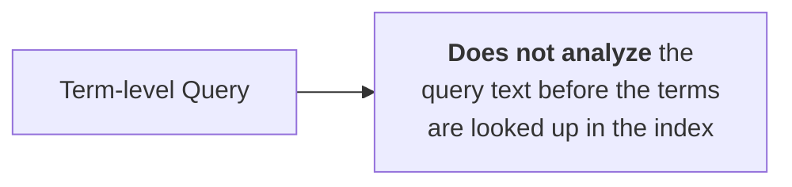
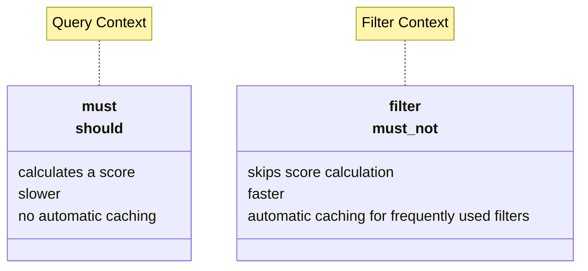

- [Search](#search)
  - [Full Text Queries](#full-text-queries)
    - [Query DSL Overview](#query-dsl-overview)
    - [match Query](#match-query)
    - [match Query - Using AND Logic](#match-query---using-and-logic)
    - [match Query - Return More Relevant Results](#match-query---return-more-relevant-results)
    - [match Query - Searching for Terms](#match-query---searching-for-terms)
    - [match\_phrase Query](#match_phrase-query)
    - [Searching Multiple Fields](#searching-multiple-fields)
    - [multi\_match and Scoring](#multi_match-and-scoring)
    - [multi\_match and Phrases](#multi_match-and-phrases)
    - [The Response](#the-response)
      - [Score](#score)
      - [Query Response](#query-response)
      - [Changing the Response](#changing-the-response)
      - [Sorting](#sorting)
      - [Retrieve Selected Fields](#retrieve-selected-fields)
  - [Term-level Queries](#term-level-queries)
    - [Matching Exact Terms](#matching-exact-terms)
    - [Term-level Queries](#term-level-queries-1)
    - [Matching on a Keyword Field](#matching-on-a-keyword-field)
    - [range Query](#range-query)
    - [Date Math](#date-math)
    - [range Query - Date Math Example](#range-query---date-math-example)
    - [exists Query](#exists-query)
    - [Async Search](#async-search)
      - [Retrieve the Results](#retrieve-the-results)
  - [Combining Queries](#combining-queries)
    - [Combining Queries using Boolean Logic](#combining-queries-using-boolean-logic)
    - [bool Query](#bool-query)
      - [must Clause](#must-clause)
      - [filter Clause](#filter-clause)
      - [must\_not Clause](#must_not-clause)
      - [should Clause](#should-clause)
    - [Comparing Query and Filter Contexts](#comparing-query-and-filter-contexts)
    - [Query vs. Filter Context - Ranking](#query-vs-filter-context---ranking)
      - [Query Context](#query-context)
      - [Filter Context](#filter-context)
    - [bool Query Summary](#bool-query-summary)

---

# Search

## Full Text Queries

### Query DSL Overview

- A search language for Elasticsearch
  - query
  - aggregate
  - sort
  - filter
  - manipulate responses

```
GET blogs/_search
{
    "query": {
        "match": {
            "title": "community team"
        }
    }
}
```

### match Query

- Returns documents that match a provided text, number, date, or boolean value
- By default, the match query
  - uses OR logic if multiple terms appear in the search query
  - is case-insensitive

Request:

```
GET blogs/_search
{
    "query": {
        "match": {
            "title":
                "community team"
        }
    }
}
```

Response:

```
"title" : "Meet the team behind the Elastic Community Conference"
"title" : "Introducing Endgame Red Team Automation"
"title" : "Welcome Insight.io to the Elastic Team"
"title" : "Welcome Prelert to the Elastic Team"
. . .
```

### match Query - Using AND Logic

- The operator parameter
  - defines the logic to interpret text
  - specify OR or AND

```
GET blogs/_search
{
    "query": {
        "match": {
            "title": {
                "query": "community team",
                "operator": "and"
            }
        }
    }
}
```

### match Query - Return More Relevant Results

- The OR or AND options might be too wide or too strict
- Use the ```minimum_should_match``` parameter
  - specifies the minimum number of clauses that must match
  - trims the long tail of less relevant results

```
GET blogs/_search
{
    "query": {
        "match": {
            "title": {
                "query": "elastic community team",
                "minimum_should_match": 2
            }
        }
    }
}
```

### match Query - Searching for Terms

- The ```match``` query does not consider
  - the order of terms
  - how far apart the terms are

Request:

```
GET blogs/_search
{
    "query": {
        "match": {
            "title": {
                "query": "community team",
                "operator": "and"
        }
    }
}
```

Response:

```
"title" : "Meet the team behind the Elastic
Community Conference"
```

### match_phrase Query

- The ```match_phrase``` searches for the exact sequence of terms specified in the query
  - terms in the phrase must appear in the exact order
  - use the ```slop``` parameter to specify how far apart terms are allowed for it to be considered a match (_default is 0_)

Request:

```
GET blogs/_search
{
    "query": {
        "match_phrase": {
            "title": "team community"
        }
    }
}
```

Request:

```
GET blogs/_search
{
    "query": {
        "match_phrase": {
            "title":{
                "query": "team community",
                "slop": 3
        }
    }
}}
```

### Searching Multiple Fields

- Use the ```multi_match``` query
  - specify the comma-delimited list of fields using square brackets

```
GET blogs/_search
{
    "query": {
        "multi_match": {
            "query": "agent",
            "fields": [
                "title",
                "content"
            ]
        }
    }
}
```

### multi_match and Scoring

- By default, the best scoring field will determine the score
  - set ```type``` to ```most_fields``` to let the score be the sum of the scores of the individual fields instead

```
GET blogs/_search
{
    "query": {
        "multi_match": {
            "type": "most_fields",
            "query": "agent",
            "fields": [
                "title",
                "content"
            ]
        }
    }
}
```

>[!TIP]
> The more fields contain the word "agent", the highter the score.

### multi_match and Phrases

- You can search for phrases with the multi_match query
  - set ```type``` to ```phrase```

```
GET blogs/_search
{
    "query": {
        "multi_match": {
            "type": "phrase",
            "query": "elastic agent",
            "fields": [
                "title",
                "content"
            ]
        }
    }
}
```

### The Response

#### Score

- Calculate a ```score``` for each document that is a hit
  - ranks search results based on relevance
  - represents how well a document matches a given search query
- BM25
  - default scoring algorithm
  - determines a document's score using:
    - **TF (_term frequency_)**: the more a term appears in a field, the more important it is
    - **IDF (_inverse document frequency_)**: The more documents that contain the term, the less important the term is
    - **field length**: shorter fields are more likely to be relevant than longer fields

#### Query Response

- by default the query response will return:
  - the top 10 documents that match the query
  - sorted by ```_score``` in descending order

```
GET blogs/_search
{
    "from": 0,
    "size": 10,
    "sort": {
        "_score": {
        "order": "desc"
        }
    },
    "query": {
        ...
    }
}
```

#### Changing the Response

- Set ```from``` and ```size``` to paginate through the search results
- Set ```sort``` to sort on one or more fields instead of ```_score```

```
GET blogs/_search
{
    "from": 100,
    "size": 50,
    "sort": [
        {
            "publish_date": {
                "order": "asc"
            }
        },
        "_score"
    ],
    "query": {
        ...
    }
}
```

>[!NOTE]
> Retrieves 50 hits, starting from hit 100.

#### Sorting

- Use keyword fields to sort on field values
- Results are not scored
  - ```_score``` has no impact on sorting
  - ```_score```: null

```
GET blogs/_search
{
    "query": {
        "match": {
            "title": "Elastic"
        }
    },
    "sort": {
        "title.keyword": {
            "order": "asc"
        }
    }
}
```

#### Retrieve Selected Fields

- By default, each hit in the response includes the document's ```_source```
  - the original data that was passed at index time
- Use ```fields``` to only retrieve specific fields

```
GET blogs/_search
{
    "_source": false,
    "fields": [
        "publish_date",
        "title"
    ]
    ...
}
```

## Term-level Queries

### Matching Exact Terms

- Recall that full text queries are analyzed and then searched within the index


- Term-level queries are used for exact searches
  - term-level queries do not analyze search terms
  - Returns the exact match of the original string as it occurs in the documents



### Term-level Queries

- Find documents based on precise values in structured data
  - queries are matched on the exact terms stored in a field
  
| Full text queries | Term-level queries | Many more |
| ----------------- | ------------------ | --------- |
| match | term | script |
| match_phrase | range | percolate |
| multi_match | exists | span_queries |
| query_string | fuzzy | geo_queries |
| ... | regexp | nested |
| | wildcard | ... |
| | ids | |
| | ... | |

### Matching on a Keyword Field

- use the ```keyword``` field to match on an exact term
  - the term must exactly match the field value, including whitespace and capitalization
- Recall that keyword types are commonly used for:
  - structured content such as IDs, email, hostnames, or zip codes
  - sorting and aggregations

```
GET blogs/_search
{
    "query": {
        "term": {
            "authors.job_title.keyword": "Senior Software Engineer"
        }
    }
}
```

### range Query

- Use the following parameters to specify a range:
  - **gt**: greater than
  - **gte**: greater than or equal to
  - **lt**: less than
  - **lte**: less than or equal to
- Ranges can be open-ended

```
GET blogs/_search
{
    "query": {
        "range": {
            "publish_date": {
                "gte": "2023-01-01",
                "lte": "2023-12-31"
            }
        }
    }
}
```

### Date Math

- Use date math to express relative dates in range queries

|   |   |
| - | - |
| **y** | years |
| **M** | months |
| **w** | weeks |
| **d** | days |
| **h / H** | hours |
| **m** | minutes |
| **s** | seconds |

Example for now = 2023-10-19T11:56:22

|   |   |
| - | - |
| **now-1h** | 2023-10-19T10:56:22 |
| **now+1h+30m** | 2023-10-19T13:26:22 |
| **now/d+1d** | 2023-10-20T00:00:00 |
| **2024-01-15\|\|+1M** | 2024-02-15T00:00:00 |

### range Query - Date Math Example

```
GET blogs/_search
{
    "query": {
        "range": {
            "publish_date": {
                "gte": "now-1y"
            }
        }
    }
}
```

### exists Query

- Returns documents that contain an indexed value for a field
- Empty strings also indicate that a field exists

Example "How many documents have a category?":

```
GET blogs/_count
{
    "query": {
        "exists": {
            "field": "category"
        }
    }
}
```

### Async Search

- Searches asynchronously
- Useful for slow queries and aggregations
  - monitor the progress
  - retrieve partial results as they become available

Request:

```
POST blogs/_async_search?wait_for_completion_timeout=0s
{
    "query": {
        "match": {
            "title": "community team"
        }
    }
}
```

Response:

```
{
    "id" : "Fk0tWm1LM1hmVHA2bGNvMHF6alRhM3ccZWZ0Uk9NcFVUR3VDTzc3OENmYUcyQToyMDYyMQ==",
    "is_partial" : true,
    "is_running" : true,
    "start_time_in_millis" : 1649075069466,
    "expiration_time_in_millis" : 1649507069466,
    "response" : {
        ...
        "hits" : {
            "total" : {
                "value" : 0,
                "relation" : "gte"
            },
            "max_score" : null,
            "hits" : [ ]
        }
    }   
}
```

>[!NOTE]
> The **id** can be used to retrieve the results later.<br>
> **is_partial** indicates whether the current set of results is partial.<br>
> **is_running** indicates whether the query is still running.<br>
> You can retrieve the results until **expiration_time_in_millis**.

#### Retrieve the Results

- Use the ```id``` to retrieve search results
- The response will tell you whether
  - the query is still running (_is\_running_)
  - the results are partial (_is\_partial_)

Request:

```
GET/_async_search/Fk0tWm1LM1hmVHA2bGNvMHF6alRhM3ccZWZ0Uk9NcFVUR3VDT...
```

## Combining Queries

### Combining Queries using Boolean Logic

- Suppose you want to write the following query:
  - **find blogs about "agent" written in english**
- This search is actually a combination of two queries
  - "agent" needs to be in the ```content``` or ```title``` field
  - and "en-us" in the ```locale``` field
- How can you combine these two queries?
  - by using Boolean logic and the ```bool``` query

### bool Query

- The ```bool``` query combines one or more boolean clauses:
  - **must**
  - **filter**
  - **must_not**
  - **should**
- Each of the clauses is optional
- Clauses can be combined
- Any clause accepts one or more queries

```
GET blogs/_search
{
    "query": {
        "bool": {
            "must": [ ... ],
            "filter": [ ... ],
            "must_not": [ ... ],
            "should": [ ... ]
        }
    }
}
```

#### must Clause

- Any query in a ```must``` clause must match for a document to be a hit
- Every query contributes to the score

```
GET blogs/_search
{
    "query": {
        "bool": {
            "must": [
                {
                    "match": {
                        "content": "agent"
                    }
                },
                {
                    "match": {
                        "locale": "en-us"
                    }
                }
            ]
        }
    }
}
```

#### filter Clause

- Filters are like ```must``` clauses: any query in a ```filter``` clause has to match for a document to be a hit
- But, queries in a ```filter``` clause do not contribute to the score

```
GET blogs/_search
{
    "query": {
        "bool": {
            "must": [
                {
                    "match": {
                        "content": "agent"
                    }
                }
            ],
            "filter": [
                {
                    "match": {
                        "locale": "en-us"
                    }
                }
            ]
        }
    }
}
```

>[!TIP]
> Filters are great for **yes / no** type queries.

#### must_not Clause

- Use ```must_not``` to exclude documents that match a query
- Queries in a ```must_not``` clause do not contribute to the score

```
GET blogs/_search
{
    "query": {
        "bool": {
            "must": [
                {
                    "match": {
                        "content": "agent"
                    }
                }
            ],
            "must_not": [
                {
                    "match": {
                        "locale": "en-us"
                    }
                }
            ]
        }
    }
}
```

#### should Clause

- Use ```should``` to boost documents that match a query
  - queries in a ```should``` clause contribute to the score
  - documents that do not match the queries in a ```should``` clause are returned as hits too
- Use ```minimum_should_match``` to specify the number of percentage of should clauses returned

```
GET blogs/_search
{
    "query": {
        "bool": {
            "must": [
                {"match": {"content":"agent"}}
            ],
            "should": [
                {"match":{"locale": “en-us"}},
                {"match":{"locale": “fr-fr"}}
            ],
            "minimum_should_match": 1
        }
    }
}
```

### Comparing Query and Filter Contexts



### Query vs. Filter Context - Ranking

#### Query Context

Request:

```
"bool": {
    "must": [
        {"match": {"title": "community"} }
    ]
}
```

Response:

```json
"hits" : {
    "total" : {
        "value" : 28,
        "relation" : "eq"
    },
    "max_score" : 6.1514335,
    "hits" : [
```

#### Filter Context

Request:

```
"bool": {
    "filter": [
        {"match": {"title": "community"} }
    ]
}
```

Response:

```json
"hits" : {
    "total" : {
        "value" : 28,
        "relation" : "eq"
    },
    "max_score" : 0.0,
    "hits" : [
```

### bool Query Summary

| Clause | Exclude docs | Scoring |
| ------ | ------------ | ------- |
| **must** | YES | YES |
| **must_not** | YES | NO |
| **should** | NO | YES |
| **filter** | YES | NO |