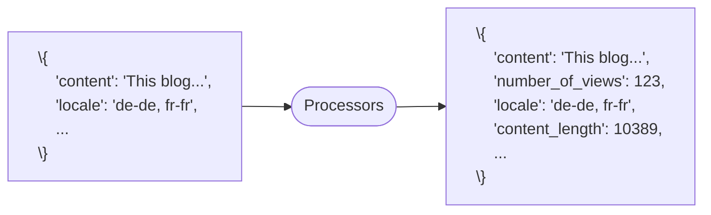

- [Data Processing](#data-processing)
  - [Changing Data](#changing-data)
    - [Processors](#processors)
      - [Ingest Node Pipelines](#ingest-node-pipelines)
      - [Create Pipelines](#create-pipelines)
      - [Using a Pipeline](#using-a-pipeline)
      - [Dissect Processor](#dissect-processor)
      - [Pipeline Processor](#pipeline-processor)
    - [Updating Documents](#updating-documents)
      - [Changing Data](#changing-data-1)
      - [Reindex API](#reindex-api)
      - [Apply a Pipeline](#apply-a-pipeline)
      - [Reindex from a Remote Cluster](#reindex-from-a-remote-cluster)
      - [Update by Query](#update-by-query)
      - [Delete by Query API](#delete-by-query-api)
  - [Enriching Data](#enriching-data)
    - [Denormalize your Data](#denormalize-your-data)
    - [Enrich Processor](#enrich-processor)
      - [Enrich your Data](#enrich-your-data)
        - [Step 1 - Set up an Enrich Policy](#step-1---set-up-an-enrich-policy)
        - [Step 2 - Create an Enrich Index for the Policy](#step-2---create-an-enrich-index-for-the-policy)
        - [Step 3 - Create Ingest Pipeline with Enrich Processor](#step-3---create-ingest-pipeline-with-enrich-processor)
        - [Step 4 - Use the Pipeline](#step-4---use-the-pipeline)
      - [Updating the Policy](#updating-the-policy)
      - [Updating an Enrich Policy](#updating-an-enrich-policy)
      - [Performance Considerations](#performance-considerations)
  - [Runtime Fields](#runtime-fields)
    - [Painless Scripting](#painless-scripting)
      - [Scripting](#scripting)
      - [Painless Scripting](#painless-scripting-1)
      - [Example](#example)
    - [Runtime Fields](#runtime-fields-1)
      - ["Schema on read" with Runtime Fields](#schema-on-read-with-runtime-fields)
      - [Creating a Runtime Field](#creating-a-runtime-field)
      - [Runtime Fields and Painless Tips](#runtime-fields-and-painless-tips)
      - [Mapping a Runtime Field](#mapping-a-runtime-field)
      - [Searching a Runtime Field](#searching-a-runtime-field)
      - [Runtime Fields in a Search Request](#runtime-fields-in-a-search-request)

---

# Data Processing

## Changing Data

### Processors

- Processors can be used to transform documents before being indexed or reindexed into Elasticsearch
- There are different ways to deploy processors:
  - Elastic Agent
  - Logstash
  - Ingest node pipelines



- Elastic Agent processors, Logstash filters, and ingest pipelines all have their own set of processors
  - several commonly used processors are in all three tools

| Manipulate Fields | Manipulate Values | Special Operations |
| ----------------- | ----------------- | ------------------ |
| set | split/join | csv/json |
| remove | grok | geoip |
| rename | dissect | user_agent |
| dot_expander | gsub | script |
| ... | ... | pipeline |
|  |  | ... |

#### Ingest Node Pipelines

- Ingest node pipelines
  - perform custom transformations on your data before indexing
  - consist of a series of processors running sequentially
  - are executed on ingest nodes

#### Create Pipelines

- Use Kibana Ingest Pipelines UI to create and manage pipelines
  - view a list of your pipelines and drill down into details
  - edit or clone existing pipelines
  - delete pipelines

#### Using a Pipeline

Apply a pipeline to documents in indexing requests:

```
POST new_index/_doc?pipeline=set_views
{"foo": "bar"}
```

Set a default pipeline:

```
PUT new_index
{
    "settings": {
        "default_pipeline":
            "set_views"
    }
}
```

Set a final pipeline:

```
PUT new_index
{
    "settings": {
        "final_pipeline":
            "set_views"
    }
}
```

#### Dissect Processor

- The dissect processor extracts structured fields out of a single text field within a document

#### Pipeline Processor

- Create a pipeline that references other pipelines
  - can be used with conditional statements

```
PUT _ingest/pipeline/blogs_pipeline
{
    "processors" : [
        {
            "pipeline" : { "name": "inner_pipeline" }
        },
        {
            "set" : {
                "field": "outer_pipeline_set",
                "value": "outer_value",
            }
        }
    ]
}
```

### Updating Documents

#### Changing Data

- You can modify the ```_source``` using various Elasticsearch APIs:
  - ```_reindex```
  - ```_update_by_query```

#### Reindex API

- The Reindex API indexes source documents into a destination index
  - source and destination indices must be different
- To reindex only a subset of the source index:
  - use ```max_docs```
  - add a ```query```

```
POST _reindex
{
    "max_docs": 100,
    "source": {
    "index": "blogs",
    "query": {
        "match": {
            "versions": "6"
        }
    }
    },
    "dest": {
        "index": "blogs_fixed"
    }
}
```

#### Apply a Pipeline

- All the documents from ```old_index``` will go through the pipeline before being indexed to ```new_index```

```
POST _reindex
{
    "source": {
        "index": "old_index"
    },
    "dest": {
        "index": "new_index",
        "pipeline": "set_views"
    }
}
```

#### Reindex from a Remote Cluster

- Connect to the remote Elasticsearch node using basic auth or API key
- Remote hosts have to be explicitly allowed in elasticsearch.yml using the reindex.remote.whitelist property

```
POST _reindex
{
    "source": {
        "remote": {
            "host": "http://otherhost:9200",
            "username": "user",
            "password": "pass"
        },
        "index": "remote_index",
    },
    "dest": {
        "index": "local_index"
    }
}
```

#### Update by Query

- To change all the documents in an existing index use the Update by Query API
  - reindexes every document into the same index
  - update by query has many of the same features as reindex
  - use a pipeline to update the ```_source```

```
POST blogs/_update_by_query?pipeline=set_views
{
    "query": {
        "match": { "category" : "customers" }
    }
}
```

#### Delete by Query API

- Use the Delete by Query API to delete documents that match a specified query
  - deletes every document in the index that is a hit for the query

Request:

```
POST blogs_fixed/_delete_by_query
{
    "query": {
        "match": {
            "author.title.keyword": "David Kravets"
        }
    }
}
```

## Enriching Data

### Denormalize your Data

- At its heart, Elasticsearch is a flat hierarchy and trying to force relational data into it can be very challenging
- Documents should be modeled so that search-time operations are as cheap as possible
- Denormalization gives you the most power and flexibility
  - Optimize for reads
  - No need to perform expensive joins
- Denormalizing your data refers to "flattening" your data
  - storing redundant copies of data in each document instead of using some type of relationship
- There are various ways to denormalize your data
  - Outside Elasticsearch
    - Write your own application-side join
    - Logstash filters
  - Inside Elasticsearch
    - Enrich processor in ingest node pipelines

### Enrich Processor

#### Enrich your Data

- Use the enrich processor to add data from your existing indices to incoming documents during ingest
- There are several steps to enriching your data
  1. Set up an enrich policy
  2. Create an enrich index for the policy
  3. Create an ingest pipeline with an enrich processor
  4. Use the pipeline

##### Step 1 - Set up an Enrich Policy

```
PUT _enrich/policy/cat_policy
{
    "match": {
        "indices": "categories",
        "match_field": "uid",
        "enrich_fields": ["title"]
    }
}
```

>[!NOTE]
> Once created, you can't update or change an enrich policy.

##### Step 2 - Create an Enrich Index for the Policy

- Execute the enrich policy to create the enrich index for your policy

```
POST _enrich/policy/cat_policy/_execute
```

- When executed, the enrich policy create a system index called the enrich index
  - the processor uses this index to match and enrich incoming documents
  - it is read-only, meaning you can't directly change it
  - more efficient than directly matching incoming document to the source indices

##### Step 3 - Create Ingest Pipeline with Enrich Processor

```
PUT /_ingest/pipeline/categories_pipeline
{
    "processors" : [
        {
            "enrich" : {
                "policy_name": "cat_policy",
                "field" : "category",
                "target_field": "cat_title"
            }
        },
        ...
    ]
}
```

##### Step 4 - Use the Pipeline

- Finally update each document with the enriched data

```
POST blogs_fixed/_update_by_query?pipeline=categories_pipeline
```

#### Updating the Policy

- Once created, you can't update or change an enrich policy; instead, you can:
  1. create and execute a new enrich policy
  2. replace the previous enrich policy with the new enrich policy in any in-use enrich processors
  3. use the delete enrich policy API or Index Management in Kibana to delete the previous enrich policy

#### Updating an Enrich Policy

- Once created, you can't update or index documents to an enrich index; instead,
  - update your source indices and execute the enrich policy again
  - this creates a new enrich index from your updated source indices
  - previous enrich index will deleted with a delayed maintenance job, by default this is done every 15 minutes
- you can reindex or update any already ingested documents using your ingest pipeline

#### Performance Considerations

- The enrich processor performs several operations and may impact the speed of your ingest pipeline
- **Recommended**: testing and benchmarking your enrich processors before deploying them in production
- **Not recommended**: using the enrich processor to append real-time data

## Runtime Fields

### Painless Scripting

#### Scripting

- Wherever scripting is supported in the Elasticsearch APIs, the syntax follows the same pattern
- Elasticsearch compiles new scripts and stores the compiled version in a cache

```
"script": {
    "lang": "...",
    "source" | "id" : "...",
    "params": { ... }
}
```

#### Painless Scripting

- Painless is a performant, secure scripting language designed specifically for Elasticsearch
- Painless is the default language
  - you don't need to specify the language if you're writing a Painless script
- Use Painless to
  - process reindexed data
  - create runtime fields which are evaluated at query time

#### Example

- Painless has a Java-like syntax
- Fields of a document can be accessed using a Map named doc or ctx

```
PUT _ingest/pipeline/url_parser
{
    "processors": [
        {
            "script": {
                "source": "ctx['new_field'] = ctx['url'].splitOnToken('/')[2]"
            }
        }
    ]
}
```

### Runtime Fields

#### "Schema on read" with Runtime Fields

- Ideally, your schema is defined at index time
- However, there are situations, where you may want to define a schema on read:
  - to fix errors in your data
  - to structure or parse your data
  - to change the way Elasticsearch returns data
  - to add new fields to your documents
  - _... without having to reindex your data_

#### Creating a Runtime Field

- Configure
  - a name for the field
  - a type
  - a custom label
  - a description
  - a value 
  - a format

#### Runtime Fields and Painless Tips

- Avoid runtime fields if you can
  - They are computationally expensive
  - Fix data at ingest time instead
- Avoid errory by checking for null values
- Use the Preview pane to validate your script

#### Mapping a Runtime Field

- ```runtime``` section defines the field in the mapping
- Use a Painless script to emit a field of a given type

```
PUT blogs/_mapping
{
    "runtime": {
        "day_of_week": {
            "type": "keyword",
            "script": {
                "source": "emit(doc['publish_date'].value.getDayOfWeekEnum().toString())"
            }
        }
    }
}
```

#### Searching a Runtime Field

- You access runtime fields from the search API like any other field
  - Elasticsearch sees runtime fields no differently

```
GET blogs/_search
{
    "query": {
        "match": {
            "day_of_week": "MONDAY"
        }
    }
}
```

#### Runtime Fields in a Search Request

- ```runtime_mappings``` section defines the field at query time
- Use a Painless script to emit a field of a given type

```
GET blogs/_search
{
    "runtime_mappings": {
        "day_of_week": {
            "type": "keyword",
            "script": {
                "source": "emit(doc['publish_date'].value.getDayOfWeekEnum().toString())"
            }
        }
    },
    "aggs": {
        "my_agg": {
            "terms": {
                "field": "day_of_week"
            }
        }
    }
}
```