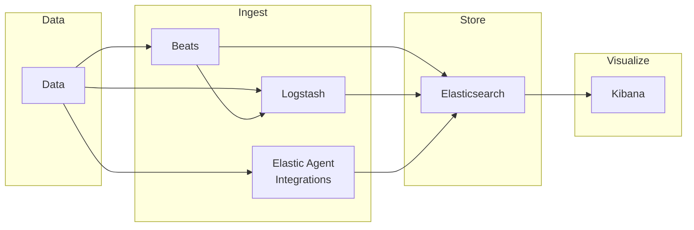

- [Introduction Elasticsearch Engineer](#introduction-elasticsearch-engineer)
  - [Stack Introduction](#stack-introduction)
    - [Elasticsearch Platform](#elasticsearch-platform)
      - [Out-of-the-Box Solutions](#out-of-the-box-solutions)
      - [Build your own](#build-your-own)
      - [Elasticsearch AI Platform](#elasticsearch-ai-platform)
        - [Kibana](#kibana)
        - [Elasticsearch](#elasticsearch)
        - [Integrations](#integrations)
    - [Elasticsearch Data Journey](#elasticsearch-data-journey)
    - [Elasticsearch is a Document Store](#elasticsearch-is-a-document-store)
    - [Kibana](#kibana-1)
    - [Exploring and Querying Data with Kibana](#exploring-and-querying-data-with-kibana)
  - [Installation Options](#installation-options)
    - [Elastic Cloud](#elastic-cloud)
    - [Elastic Self-Managed](#elastic-self-managed)
  - [Index Operations](#index-operations)
    - [Documents are Indexed into an Index](#documents-are-indexed-into-an-index)
    - [Index a Document: curl Example](#index-a-document-curl-example)
    - [Index a Document: Dev Tools \> Console](#index-a-document-dev-tools--console)
    - [Index a Document: PUT vs. POST](#index-a-document-put-vs-post)
    - [Retrieve a Document](#retrieve-a-document)
    - [Create a Document](#create-a-document)
    - [Update Specific Fields](#update-specific-fields)
    - [Delete a Document](#delete-a-document)
    - [Cheaper in Bulk](#cheaper-in-bulk)
    - [Bulk API Example](#bulk-api-example)
    - [Upload a File in Kibana](#upload-a-file-in-kibana)
    - [Understanding Data](#understanding-data)

---

# Introduction Elasticsearch Engineer

## Stack Introduction

### Elasticsearch Platform

#### Out-of-the-Box Solutions

- Elastic Observability
- Elastic Security

#### Build your own

- Elastic Search

#### Elasticsearch AI Platform

- Ingest and Secure Storage
- AI / ML and Search
- Visualization and Automation

##### Kibana

- Explore
- Visualize
- Engage

##### Elasticsearch

- Store
- Analyze
- Machine Learning
- Generative AI

##### Integrations

- Connect
- Collect
- Alert

### Elasticsearch Data Journey

Collect, connect, and visualize your data from any source.



### Elasticsearch is a Document Store

- Elasticsearch is a distributed document store
- Documents are serialized JSON objects that are:
  - stored in Elasticsearch under a unique Document ID
  - distributed across the cluster and can be accessed immediately from any node

### Kibana

- Kibana is a front-end app that sits on top of the Elastic Stack
- It provides search and data visualization capabilities for data in Elasticsearch

### Exploring and Querying Data with Kibana

- Start with ```Discover```
  - Create a ```data view``` to access your data
  - Explore the ```fields``` in your data
  - Examine popular ```values```
  - Use the ```query bar``` and ```filters``` to see subsets of your data

## Installation Options

### Elastic Cloud

- Elastic Cloud Hosted
- Elastic Cloud Serverless

### Elastic Self-Managed

- Elastic Stack
- Elastic Cloud on Kubernetes
- Elastic Cloud Enterprise

## Index Operations

### Documents are Indexed into an Index

- In Elasticsearch a document is indexed into an index
- An index:
  - is a logical way of grouping data
  - can be thought of as an optimized collection of documents
  - is used as a verb and a noun

### Index a Document: curl Example

- To create an index, send a request using POST that specifies:
  - ```index_name```
  - ```_doc``` resource
  - ```document```
- By default, Elasticsearch generates the ID for you

```bash
$ curl -X POST "localhost:9200/my_blogs/_doc" -H 'Content-Type: application/json' -d'
{
    "title": "Fighting Ebola with Elastic",
    "category": "Engineering",
    "author": {
        "first_name": "Emily",
        "last_name": "Mosher"
} } '
```

### Index a Document: Dev Tools > Console

- Console providing Elasticsearch & Kibana REST interaction
- User-friendly interface to create and submit requests
- View API docs

### Index a Document: PUT vs. POST

- When you index a document using:
  - **PUT**: you pass in a document ID with the request if the document ID already exists, the index will be updated and the _version incremented by 1
  - **POST**: the document ID is automatically generated with a unique ID for the document

Request:

```
PUT my_blogs/_doc/6OCz5pEBqWhDYCLiWpe5
{
    "title" : "Fighting Ebola with Elastic",
    "category": "User Stories",
    “Author” : {
        “first name” : “Emily”,
        “last name” : “Mosher”
        }
}
```

Response:

```json
{
    "_index" : "my_blogs",
    "_type" : "_doc",
    "_id" : "6OCz5pEBqWhDYCLiWpe5",
    "_version" : 2,
    "result" : "updated",
    ...
}
```

### Retrieve a Document

- Use a GET request with the document's unique ID

Request:

```
GET my_blogs/_doc/6OCz5pEBqWhDYCLiWpe5
```

Response:

```json
{
    ...
    "_id" : "6OCz5pEBqWhDYCLiWpe5",
    "_source": {
        "title": "Fighting Ebola with Elastic",
        "category": "User Stories",
        "author": {
            "first_name": "Emily",
            "last_name": "Mosher"
        }
```

### Create a Document

- Index a new JSON document with the ```_create``` resource
  - guarantees that the document is only indexed if it does not already exist
  - can not be used to update an existing document

Request:

```
POST my_blogs/_create/4
{
    "title" : "Fighting Ebola with Elastic",
    "category": "Engineering",
    “Author” : {
        “first name” : “Emily”,
        “last name” : “Mosher”
        }
}
```

Response:

```json
{
    "_index" : "my_blogs",
    "_type" : "_doc",
    "_id" : "4",
    "_version" : 1,
    "result" : "created",
    ...
}
```

### Update Specific Fields

- Use the ```_update``` resource to modify specific fields in a document
  - add the ```doc``` context
  - ```_version``` is incremented by 1

Request:

```
POST my_blogs/_update/4
{
    "doc" : {
        "category": "User Stories"
    }
}
```

Response:

```json
{
    "_index" : "my_blogs",
    "_type" : "_doc",
    "_id" : "4",
    "_version" : 2,
    "result" : "updated",
    ...
}
```

### Delete a Document

- Use DELETE to delete an indexed document

Request:

```
DELETE my_blogs/_doc/4
```

Response:

```json
{
"_index": "my_blogs",
    "_type": "_doc",
    "_id": "4",
    "_version": 3,
    "result": "deleted",
    "_shards": {
        "total": 2,
        "successful": 2,
        "failed": 0
    },
    "_seq_no": 3,
    "_primary_term": 1
}
```

### Cheaper in Bulk

- Use the BULK API to index many documents in a single API call
  - increases the indexing speed
  - useful if you need to index a data stream such as log events
- Four actions
  - create, index, update, and delete
- The response is a large JSON structure
  - returns individual results of each action that was performed
  - failure of a single action does not affect the remaining actions

### Bulk API Example

- Newline delimited JSON (_NDJSON_) structure
  - increases the indexing speed
  - index, create, update actions expect a newline followed by a JSON object on a single line

Example:

```
POST comments/_bulk
{"index" : {}}
{"title": "Tuning Go Apps with Metricbeat", "category": "Engineering"}
{"index" : {"_id":4}}
{"title": "Elasticsearch Released", "category": "Releases"}
{"create" : {"_id":5}}
{"title": "Searching for needle in", "category": "User Stories"}
{"update" : {"_id":2}}
{"doc": {"title": "Searching for needle in haystack"}}
{"delete": {"_id":1}}
```

### Upload a File in Kibana

- Quickly upload a log file or delimited CSV, TSV, or JSON file
  - used for initial exploration of your data
  - not intended as part of production process

### Understanding Data

- Most data can be categorized into:
  - **(relatively) static data**: data set that may grow or change, but slowly or infrequently, like a catalog or inventory of items
  - **times series data**: event data associated with a moment in time that (_usually_) grows rapidly, like log files or metrics
- Elastic Stack works well with either type of data


**DO LABS 1.1 AND 1.2 FIRST**