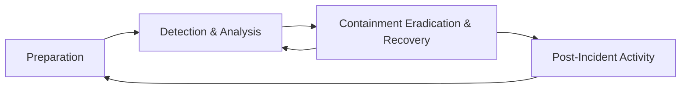

- [Incident Handling Process](#incident-handling-process)
  - [Basic Terms](#basic-terms)
    - [Event](#event)
    - [Incident](#incident)
    - [Incident Handling](#incident-handling)
  - [Cyber Kill Chain](#cyber-kill-chain)
    - [Recon](#recon)
    - [Weaponize](#weaponize)
    - [Delivery](#delivery)
    - [Exploitation](#exploitation)
    - [Installation](#installation)
    - [C2](#c2)
    - [Action](#action)
  - [Incident Handling Process](#incident-handling-process-1)
    - [Overview](#overview)
    - [Preparation Stage](#preparation-stage)
      - [Prerequisites](#prerequisites)
      - [Clear Policies \& Documentation](#clear-policies--documentation)
      - [Tools](#tools)
      - [DMARC](#dmarc)

---

# Incident Handling Process

## Basic Terms

### Event

... is an action occuring in a system or network. Examples are:

- a user sending an email
- a mouse click
- a firewall allowing a connection request

### Incident

... is an event with a negative consequence. Once example of an incident is a system crash. Another example is unauthorized access to sensitive data. Incidents can also occur due to natural disasters, power failures.

There is no clear definition for what an IT security incident is. You can define an IT security incident as an event with a clear intent to cause harm that is performed against a computer system. Examples are:

- data theft
- funds theft
- unauthorized access to data
- installation and usage of malware and remote access tools

### Incident Handling

... is a clearly defined set of procedures to manage and respond to security incidents in a computer or network environment.

It is important to note that incident handling is not limited to intrusion incidents alone.

Other types of incidents, such as those caused by malicious insiders, availability issues, and loss of intellectual property also fall within the scope of incident handling. A comprehensive incident handling plan should address various types of incidents and provide appropriate measures to identify, contain, eradicate, and recover from them to restore normal business operations as quickly and efficiently as possible.

## Cyber Kill Chain

This cycle describes how attacks manifest themselves. Understanding this cycle will provide you with valuable insights on how far in the network an attacker is and what they may have access to during the investigation phase of an incident.

It consists of 7 stages.

### Recon

... is the initial stage, and it involves the part where an attacker chooses their target. Additionally, the attacker then performs information gathering to become more familiar with the target and gathers as much useful data as possible, which can be used in not only this stage but also in other stages of this chain. Some attackers prefer to perform passive information gathering from web sources such as LinkedIn and Instagram but also from documentation on the target organization's web pages. They can provide extremely specific information about AV tools, OS, and networking tech. Other attackers go a step further; they start poking and actively scan external web apps and IP addresses that belong to the target organization.

### Weaponize

In this stage, the malware to be used for initial access is developed and embedded into some type of exploit or deliverable payload. This malware is crafted to be extremely lightweight and undetectable by the AV and detection tools. It is likely that the attacker has gathered information to identify the present AV or EDR tech in the target organization. On a large, the sole purpose of this initial stage is to provide remote access to a compromised machine in the target environment, which also has the capability to persist through machine reboots and the ability to deploy additional tools and functionality on demand.

### Delivery

In this stage, the exploit or payload is delivered to the victim(s). Traditional approaches are phishing emails that either contain a malicious attachment or a link to a web page. The web page can be twofold: either containing an exploit or hosting the malicious payload to avoid sending it through email scanning tools. In all fairness, the page can also mimic a legit website used by the target organization in an attempt to trick the victim into entering their credentials and collect them. Some attackers call the victim on the phone with a social engineering pretext in an attempt to convince the victim to run the payload. The payload in these trust-gaining cases is hosted on an attacker-controlled web site that mimics a well-known web site to the victim. It is extremely rare to deliver a payload that requires the victim to do more than double-click an executable file or a script. Finally, there are cases where a physical interaction is utilized to deliver the payload via USB tokens and similar storage tools, that are purposely left around.

### Exploitation

This stage is the moment when an exploit or a delivered payload is triggered. During the exploitation stage of the cyber kill chain, the attacker typically attempts to execute code on the target system in order to gain access or control.

### Installation

In this stage, the initial stager is executed and is running on the compromised machine. As already discussed, the installation stage can be carried out in various ways, depending on the attacker's goals and the nature of the compromise. Some common techniques in the installation stage include:

- **Droppers**
  - Attackers may use droppers to deliver malware onto the target system. A dropper is a small piece of code that is designed to install malware on the system and execute it. The dropper my be delivered through various means, such as email attachments, malicious websites, or social engineering attacks.
- **Backdoors**
  - A backdoor is a type of malware that is designed to provide the attacker with ongoing access to the compromised system. The backdoor may be installed by the attacker during the exploitation stage or delivered through a dropper. Once installed, the backdoor can be used to execute further attacks or steal data from the compromised system.
- **Rootkits**
  - A rootkit is a type of malware that is designed to hide its presence on a compromised system. Rootkits are often used in the installation stage to evade detection by AV software and other security tools. The rootkit may be installed by the attacker during the exploitation stage or delivered through a dropper.
  
### C2

In this stage, the attacker establishes a remote access capability to the compromised machine. It is not uncommon, to use a modular initial stager that loads additional scripts on-the-fly. However, advanced groups will utilize separate tools in order to ensure that multiple variants of their malware live in a compromised network, and if one of them gets discovered and contained, they still have the means to return to the environment.

### Action

The final stage of the chain. The objective of each attack can vary. Some adversaries may go after exfiltrating confidential data, while others may want to obtain the highest level of access possible within a network to deploy ransomware.

## Incident Handling Process

### Overview

There are different stages, when responding to an incident, defined as the incident handling process. The incident handling process defines a capability for organizations to prepare, detect, and respond to malicious events.

As defined by NIST, the incident handling process consists of the following 4 distinct stages:

Incident handlers spend most of their time in the first two stages, preparation and detection & analysis. This is where you spend a lot of time improving yourself and looking for the next malicious event. When a malicious event is detected, you then move on to the next stage and respond to the event. The process is not linear, but cyclic. The main point to understand at this point is that as new evidence is discovered, the next steps may change as well. It is vital to ensure that you don't skip steps in the process and that you complete a step before moving onto the next one. For example, if you discover ten infected machines, you should certainly not proceed with containing just five of them and starting eradication while the remaining five stay in infected stage. Such an approach can be ineffective because you are notifying an attacker that you have discovered them and that you are hunting them down, which, as you could imagine, can have unpredictable consequences.

So, incident handling has two main activities, which are investigating and recovering. The investigation aims to:

- discover the initial patient zero and create an incident timeline
- determine what tools and malware the adversary used
- document the compromised systems and what the adversary has done

Following the investigation, the recovery activity involves creating and implementing a recovery plan. When the plan is implemented, the business should resume normal business operations, if the incident caused any disruptions.

When an incident is fully handled, a report is issued that details the cause of and cost of the incident. Additionally, lessons learned activities are performed, among other, to understand what the organization should do to prevent incidents of similar type from occuring again.

### Preparation Stage

In the preparation stage, you have two separate objectives. The first one is the establishment of incident handling capability within the organization. The second is the ability to protect against and prevent IT security incidents by implementing appropriate protective measures. Such measures include endpoint and server hardening, AD tiering, mulit-factor authentication, privileged access management, and so on and so forth. While protecting against incidents is not the responsibility of the incident handling team, this activity is fundamental to the overall success of that team.

#### Prerequisites

During the preparation, you need to ensure you have:

- skilled incident handling team members
- trained workforce
- clear policies and documentation
- tools

#### Clear Policies & Documentation

Some of the written policies and documentation should contain an up-to-date version of the following information:

- contact information and roles of the incident handling team members
- contact information for the legal and comliance department, management team, IT support, communications and media relations department, law enforcement, internet serive providers, facility management, and external incident response team
- incident response policy, plan, and procedures
- incident information sharing policy and procedures
- baselines of systems and networks, out of a golden image and a clean state environment
- network diagrams
- organization-wide asset management database
- user accounts with excessive privileges that can be used on-demand by the team when necessary; these user accounts are normally enabled when an incident is confirmed during the initial investigation and then disabled once it is over
- ability to acquire hardware, software, or an external resource without a complete procurement process; the last thing you need during an incident is to wait for weeks for the approval of a 500 dollar tool
- forensic/investigative cheat sheets

Some of the non-severe cases may be handled relatively quickly and without too much friction within the organization or outside of it. Other cases may require law enforcement notification and external communication to customers and third-party vendors, especially in cases of legal concerns arising from the incident. For example, a data breach involving customer data has to be reported to law enforcement within a certain time threshold in accordance with GPDR. There may be many compliance requirements depending on the location and/or branches where the incident has occured, so the best way to understand these is to discuss them with your legal and compliance teams on a per-incident basis.

While having documentation in place is vital, it is also important to document the incident as you investigate. Therefore, during this stage you will also have to establish an effective reporting capability. Incidents can be extremely stressful, and it becomes easy to forget this part as the incident unfolds itself, especially when you are focused and going extremely fast in order to solve it as soon as possible. Try to remain calm, take notes, and ensure that these notes contain timestamps, the activity performed, the result of it, and who did it. Overall, you should seek answers to who, what, when, why, and how.

#### Tools

You need to ensure you have the right tools to perform the job. These include, but are not limited to:

- additional laptop or forensic workstation for each incident handling team member to preserve disk images and log files, perform data analysis, and investigate without any restrictions; these devices should be handled appropriately and not in a way that introduces risks to the organization
- digital forensic image acquisition and analysis tools
- memory capture and analysis tools
- live response capture and analysis
- log analysis tools
- network capture and analysis tools
- network cables and switches
- write blockers
- hard drives for forensic imaging
- power cables
- screwdrivers, tweezers, and other relevant tools to repair or disassemble hardware devices if needed
- indicator of compromise (_IOC_) creator and the ability to search for IOCs across the organization
- chain of custody forms
- encryption software
- ticket tracing system
- secure facility for storage and investigation
- incident handling system independent of your organization's infrastructure

Many of the tools mentioned above will be part of what is known as a jump bag - always ready with the necessary tools to be picked up and leave immediately. Without this prepared bag, gathering all necessary tools on the fly may take days or weeks before you are ready to respond.

>[!TIP]
> Have your documentation system completely independent from your organization's infrastructure and properly secured.

#### DMARC

