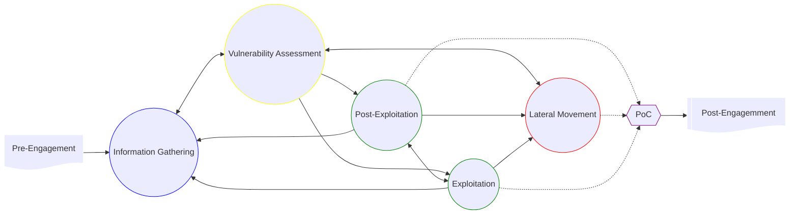

- [Penetration Testing Process](#penetration-testing-process)

---

# Penetration Testing Process

## Steps

### Pre-Engagment

### Information Gathering

### Vulnerability Assessment

### Exploitation

### Post-Exploitation

### Lateral Movement

### Proof-of-Concept

### Post-Engagement

## Overview

### Risk Management

### Testing Methods

#### External Pentest

#### Internal Pentest

### Types of Pentests

### Types of Testing Environments

## Precautionary Measures during Pentests

## Pentest Phases

### Pre-Engagement

### Information Gathering

### Vulnerability Assessment

### Exploitation

### Post-Exploitation

### Lateral Movement

### PoC

### Post-Engagement