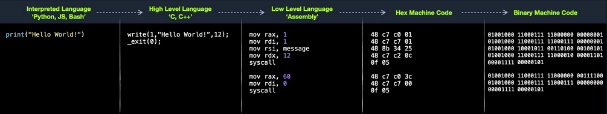
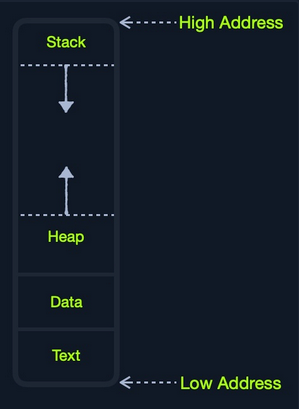
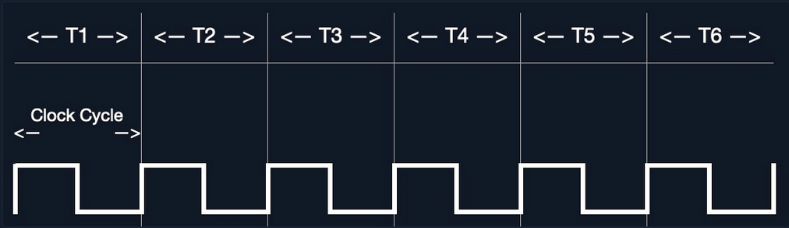
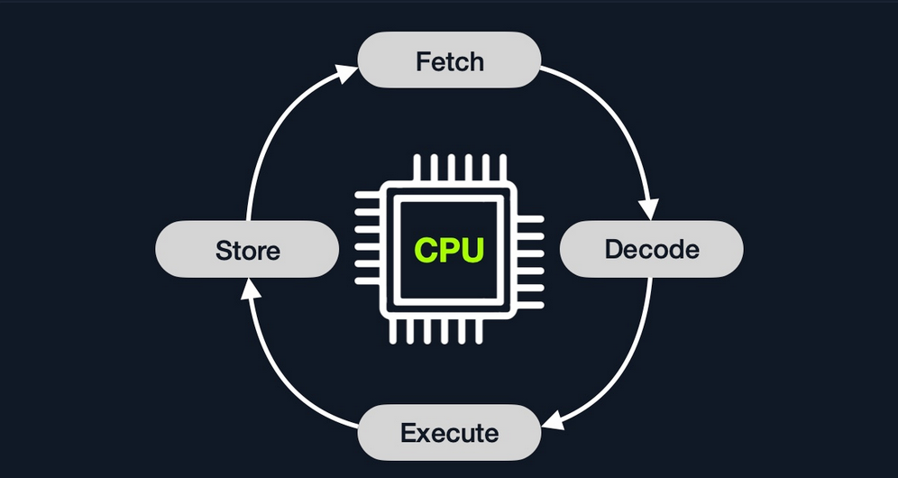
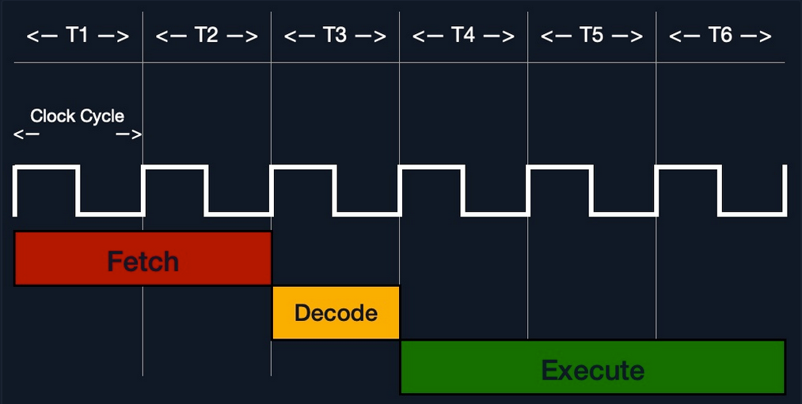
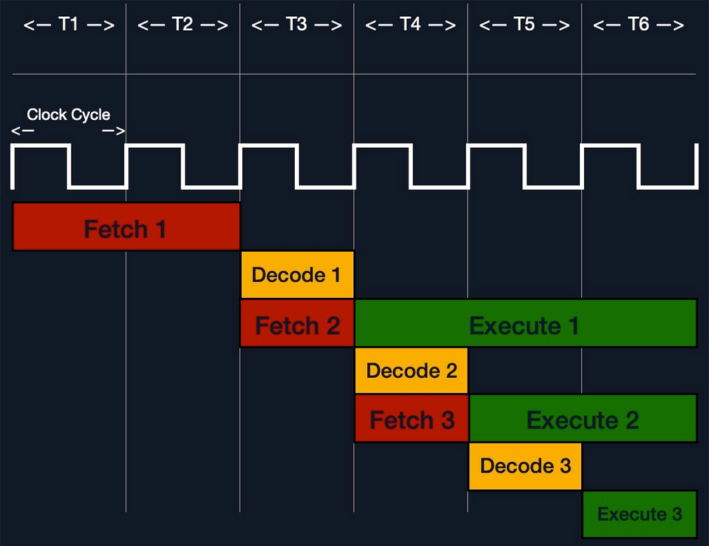
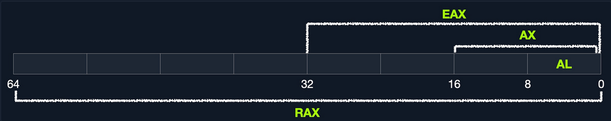
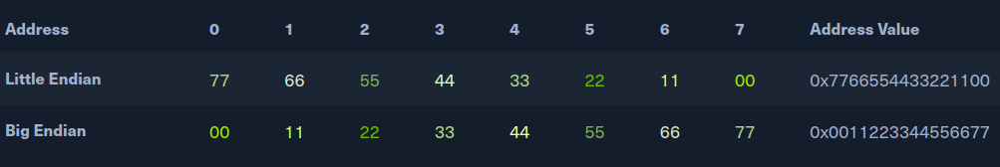
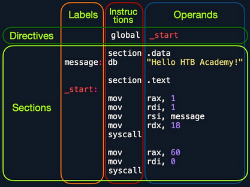

- [Assembly](#assembly)
  - [Architecture](#architecture)
    - [Assembly Language](#assembly-language)
    - [High-Level vs. Low-Level](#high-level-vs-low-level)
    - [Compilation Stages](#compilation-stages)
  - [Computer Architecture](#computer-architecture)
    - [Memory](#memory)
      - [Cache](#cache)
      - [RAM](#ram)
    - [IO/Storage](#iostorage)
    - [Speed](#speed)
  - [CPU Architecture](#cpu-architecture)
    - [Clock Speed \& Clock Cycle](#clock-speed--clock-cycle)
    - [Instruction Cycle](#instruction-cycle)
    - [Processor Specific](#processor-specific)
  - [Instruction Set Architecture (ISA)](#instruction-set-architecture-isa)
    - [CISC](#cisc)
    - [RISC](#risc)
    - [CISC vs RISC](#cisc-vs-risc)
  - [Registers, Addresses, and Data Types](#registers-addresses-and-data-types)
    - [Registers](#registers)
    - [Sub-Registers](#sub-registers)
    - [Memory Addresses](#memory-addresses)
    - [Address Endianness](#address-endianness)
    - [Data Types](#data-types)
  - [Assembling \& Debugging](#assembling--debugging)
    - [Assembly File Structure](#assembly-file-structure)
    - [Directives](#directives)
    - [Variables](#variables)
    - [Code](#code)
    - [Assembling](#assembling)
    - [Linking](#linking)
    - [Disassembling](#disassembling)
    - [GNU Debugger (GDB)](#gnu-debugger-gdb)
      - [Installation](#installation)
      - [Getting Started](#getting-started)
      - [Disassemble](#disassemble)
    - [Debugging with GDB](#debugging-with-gdb)
      - [Break](#break)
      - [Examine](#examine)
        - [Instructions](#instructions)
        - [Strings](#strings)
        - [Addresses](#addresses)
      - [Step](#step)
        - [Step Instruction](#step-instruction)
        - [Step Count](#step-count)
        - [Step](#step-1)
      - [Modify](#modify)
        - [Addresses](#addresses-1)
        - [Registers](#registers-1)
  - [Basic Instructions](#basic-instructions)
    - [Moving Data](#moving-data)
    - [Loading Data](#loading-data)
    - [Address Pointers](#address-pointers)
    - [Moving Pointer Values](#moving-pointer-values)
    - [Loading Value Pointer](#loading-value-pointer)
    - [Unary Instructions](#unary-instructions)
    - [Binary Instructions](#binary-instructions)
    - [Bitwise Instructions](#bitwise-instructions)
  - [Control Instructions](#control-instructions)
    - [Loops](#loops)

---

# Assembly

## Architecture

### Assembly Language

Most of your interaction with your personal computers and smartphones is done through the OS and other applications. These applications are usually developed using high-level languages. You also know that each of these devices has a core processor that runs all of the necessary processes to execute systems and applications, along with Random Access Memory, Video Memory, and other similar components.

However, these physical components cannot interpret or understand high-level languages, as they can essentially only process 1s and 0s. This is where Assembly language comes in, as a low-level language that can write direct instructions the processor can understand. Since the processor can only process binary data, it would be challenging for humans to interact with processors without referring to manuals to know which hex code runs which instruction.

This is why low-level assembly languages were built. By using Assembly, developers can write human-readbale machine instructions, which are then assembled into their machine code equivalent, so that the processor can directly run them. This is why some refer to Assembly language as symbolic machine code.

Machine code is often represented as Shellcode, a hex representation of machine code bytes. Shellcode can be translated back to its Assembly counterpart and can also be loaded directly into memory as binary instructions to be executed.

### High-Level vs. Low-Level

As there are different processor designs, each processor understands a different set of machine instructions and a different Assembly language. In the past, applications had to be written in assembly for each processor, so it was not easy to develop an application for multiple processors. In the early 1970's, high-level languages were developed to make it possible to write a single easy to understand code that can work on any processor without rewriting it for each processor. To be more specific, this was made possible by creating compilers for each language.

When high-level code is compiled, it is translated into assembly instructions for the processor it is being compiled for, which is then assembled into machine code to run on the processor. This is why compilers are built for various languages and various processors to convert the high-level code into assembly code and then machine code that matches the running processor.

Later on, interpreted languages were developed, which are usually not compiled but are interpreted during run time. These types of languages utilize pre-built libraries to run their instructions. These libraries are typically written and compiled in other high-level languages like C or C++. So when you issue a command in an interpreted language, it would use the compiled library to run that command, which uses its assembly code/machine code to perform all the instructions necessary to run this command on the processor.

### Compilation Stages



## Computer Architecture

Today most modern computers are built on the Von Neumann Architecture, which was developed back in 1945 by Von Neumann to enable the creation of "General Purpose Computers".

This architecture executes machine code to perform specific algorithms. It mainly consists of the following elements:

- Central Processing Unit (_CPU_)
- Memory Unit
- Input/Output Devices
  - Mass Storage Unit
  - Keyboard
  - Display

The CPU itself consists of:

- Control Unit (_CU_)
- Arithmetic/Logic Unit (_ALU_)
- Registers

Assembly languages mainly work with the CPU and memory.

### Memory

A computer's memory is where the temporary data and instructions of currently running programs are located. A computer's memory ism also known as Primary Memory. It is the primary location the CPU uses to retrieve and process data. It does so very frequently, so the memory must be extremely fast in storing and retrieving data and instructions.

Two main types of memory:

 - Cache
 - Random Access Memory (_RAM_)

#### Cache

... memory is usually located within the CPU itself and hence is extremely fast compared to RAM, as it runs at the same clock speed as the CPU. However, it is very limited in size and very sophisticated, and expensive to manufacture due to it being so close to the CPU.

Since RAM clock speed is usually much slower than the CPU cores, in addition to it being far from the CPU, if a CPU hat to wait for the RAM to retrieve each instruction, it would effectivley be running at much lower clock speeds. This is the main benefit of cache memory. It enables the CPU to access the upcoming instructions and data quicker than retrieving them from RAM.

There are usually three levels of cache memory, depending on their closeness to the CPU core:

| Level | Description |
| ----- | ----------- |
| Level 1 Cache | usually in kilobytes, the fastest memory available, located in each CPU core |
| Level 2 Cache | usually in megabytes, extremely fast, shared between all CPU cores |
| Level 3 Cache | usually in megabytes, faster than RAM but slower than L1/L2 |


#### RAM

... is much larger than cache memory, coming in sizes ranging from gigabytes up to terabytes. RAM is also located far away from the CPU cores and is much slower than cache memory. Accessing data from RAM addresses takes many more instructions.

For example, retrieving an instruction from the registers takes only one clock cycle, and retrieving it from the L1 cache takes a few cycles, while retrieving it from RAM takes around 200 cycles. When this is done billions of times in a second, it makes a massive difference in the overall execution speed.

In the past, with 32-bit addresses, memory addresses were limited from ```0x00000000``` to ```0xffffffff```. This meant the maximum possible RAM size was 2^32 bytes, which is only 4 gigabytes, at which point you run out of unique addresses. With 64-bit addresses, the range is now up to ```0xffffffffffffffff```, with a theoretical maximum RAM size of 2^64, which is around 18.5 exabytes, so you shouldn't be running out of memory addresses anytime soon.

When a program is run, all of its data and instructions are moved from the storage unit to the RAM to be accessed when needed by the CPU. This happens because accessing them from the storage unit is much slower and will increase data processing time. When a program is closed, its data is removed or made availabe to re-use from the RAM.

The RAM is split into four main segments:



| Segment | Description |
| ------- | ----------- |
| Stack | has a last-in-first-out design and is fixed in size; data in it can only be accessed in a specific order by pushing and popping data |
| Heap | has a hierachical design and is therefore much larger and more versatile in storing data, as data can be stored and retrieved in any order; however, this makes the heap slower than the stack |
| Data | has two parts: 1) data, which is used to hold variables and 2) ```.bss```, which is used to hold unassigend variables |
| Text | main assembly instructions are loaded into this segment to be fetched and executed by the CPU |

Although this segmentation applies to the entire RAM, each application is allocated its Virtual Memory when it is run. This means that each application would have its own stack, heap, data, text segments.

### IO/Storage

... like the keyboard, the screen, or the long-term storage unit, also known as Secondary Memory. The processor can access and control IO devices using Bus Interfaces, which act as 'highways' to transfer data and addresses, using electrical charges for binary data.

Each bus has capacity of bits it can carry simultaneously. This usually is a multiple of 4-bits, ranging up to 128-bits. Bus interfaces are also usually used to access memory and other components outside the CPU itself.

Unlike primary memory that is volatile and stores temporary data and instructions as the programs are running, the storage unit stores permanent data, like the OS files or entire applications and their data.

The storage unit is the slowest to access. First, because they are the farthest away from the CPU, accessing them through bus interfaces like SATA or USB takes much longer to store and retrieve the data. They are also slower in their design to allow more data storage. As long as there is more data to go through, they will be slower.

SSDs utilize a similar design to RAMs, using non-volatile circuitry that retains data even without electricity. This made storage units much faster in storing and retrieving data. Still, since they are far away from the CPU and connected through special interfaces they are the slowest unit to access.

### Speed

| Component | Speed | Size |
| --------- | ----- | ---- |
| Registers | fastest | Bytes |
| L1 Cache | fastest, other than Registers | Kilobytes |
| L2 Caches | very fast | Megabytes |
| L3 Caches | fast, but slower than the above | Megabytes |
| RAM | much slower than all of the above | Gigabytes-Terabytes |
| Storage | slowest | Terabytes and more |

## CPU Architecture

The CPU is the main processing unit wihtin a computer. The CPU contains both the Control Unit, which is in charge of moving and controlling data, and the Arithmetic/Logic Unit, which is in charge of performing various arithmetics and logical calculations as requested by a program through the assembly instructions.

The manner in which and how efficiently a CPU processes its instructions depends on its Instruction Set Architecture (_ISA_). There are multiple ISAs in the industry, each having its way of processing data. RISC architecture is based on processing more simple instructions, which takes more cycles, but each cycle is shorter and takes less power. The CISC architecture is based on fewer, more complex instructions, which can finish the requested instructions in fewer cycles, but each instruction takes more time and power to be processed.

### Clock Speed & Clock Cycle

Each CPU has a clock speed that indicates its overall speed. Every tick of the clock runs a clock cycle that processes a basic instruction, such as fetching an address or storing an address. Specifically, this is done by the CU or ALU.

The frequency in which the cycles occur is counted is cycles per second (_Hertz_). If a CPU has a speed of 3.0 GHz, it can run 3 billion cycles every second (_per core_).



Modern processors have a multi-core design, allowing them to have multiple cycles at the same time.

### Instruction Cycle

... is the cycle it takes the CPU to process a single machine instruction.



An instruction cycle consists of four stages: **fetch**, **decode**, **execute**, and **store**:

| Instruction | Description |
| ----------- | ----------- |
| 1. Fetch | takes the next instruction's address from the Instruction Address Register (_IRA_), which tells it where the next instruction is located |
| 2. Decode | takes the instruction from the IAR, and decodes it from binary to see what is required to be executed |
| 3. Execute | fetch instruction operands from register/memory, and process the instruction in the ALU or CU |
| 4. Store | Store the new value in the destination operand |

Each Instruction Cycle takes multiple clock cycles to finish, depending on the CPU architecture and the complexity of the instruction. Once a single instruction cycle ends, the CU increments to the next instruction and runs the same cycle on it, and so on.



For example, if you were to execute the assembly instruction ```add rax, 1```, it would run through an instruction cycle:

1. Fetch the instruction from the ```rip``` register, ```48 83 C0 01``` (_in binary_).
2. Decode '```48 83 C0 01```' to know it needs to perform an ```add``` of ```1``` to the value at ```rax```.
3. Get the current value at ```rax``` (_by ```CU```_), add ```1``` to it (_by the ```ALU```_).
4. Store the new value back to ```rax```.

In the past, processors used to process instructions sequentially, so they had to wait for one instruction to finish to start the next. On the other hand, modern processors can process multiple instructions in parallel by having multiple instruction/clock cycles running at the same time. This is made possible by having a multi-thread and multi-core design.



### Processor Specific

Each processor understands a different set of instructions. For example, while an Intel processor based on the 64-bit x86 architecture may interpret the machine code ```4883C001``` as ```add rax, 1```, ARM processor translates the same machine code as the ```biceq r8, r0, r8, asr #6``` instruction.

This is because each processor type has a different low-level assembly language architecture known as Instruction Set Architectures (_ISA_). For example, the add instruction seen above, ```add rax, 1```, is for Intel x86 64-bit processors. The same instruction written for the ARM processor assembly language is represented as ```add r1, r1, 1```.

It is important to understand that each processor has its own set of instructions and corresponding machine code.

Furthermore, a single Instruction Set Architecture may have several syntax interpretations for the same assembly code. For example, the above ```add``` instruction is based on the x86 architecture, which is supported by multiple processors like Intel, AMD, and legacy AT&T processors. The instruction is written as ```add rax, 1``` with intel syntax, and written as ```addb $0x1, %rax``` with AT&T syntax.

Even though you can tell that both instructions are similar and do the same thing, their syntax is different, and the location of the source and destination operands are swapped as well. Still, both codes assemble the same machine code and perform the same instruction.

If you want to know whether your Linux system supports ```x86_64``` architecture, you can use the ```lscpu``` command:

```bash
d41y@htb[/htb]$ lscpu

Architecture:                    x86_64
CPU op-mode(s):                  32-bit, 64-bit
Byte Order:                      Little Endian

<SNIP>
```

## Instruction Set Architecture (ISA)

... specifies the syntax and semantics of the assembly language on each architecture. It is not just a different syntax but is built in the core of a processor, as it affects the way and order instructions are executed and their level of complexity. ISA mainly consists of the following components:

- Instructions
- Registers
- Memory Addresses
- Data Types

| Component | Example | Description |
| --------- | ------- | ----------- |
| Instructions | ```add rax, 1```, ```mov rsp, rax```, ```push rax``` | the instruction to be processed in the ```opcode operand_list``` format; there are usually 1, 2, or 3 comma-separated operands |
| Registers | ```rax```, ```rsp```, ```rip``` | used to store operands, addresses, or instructions temporarily |
| Memory Addresses | ```0xffffffffaa8a25ff```, ```0x44d0```, ```$rax``` | the address in which data or instructions are atored; may point to memory or registers |
| Data Types | _byte, word, double word_ | the type of data stored |

There are two main Instruction Set Architectures:

1. Complex Instruction Set Computer (_CISC_)
   - used in Intel and AMD processors in most computers and servers
2. Reduced Instruction Set Computer (_RISC_)
   - used in ARM and Apple processors, in most smartphones, and some laptops

### CISC

... architecture was one of the earliest ISA's ever developed. It favors more complex instructions to be run at a time to reduce the overall number of instructions. This is done to rely as much as possible on the CPU by combining minor instructions into more complex ones.

Suppose you were to add two registers with the ```add rax, rbx``` instruction. In that case, a CISC processor can do this in a single 'Fetch-Decode-Execute-Store' cycle, without having to split into multiple instructions to fetch ```rax```, then fetch ```rbx```, then add them, and then store them in ```rax```, each of which would take its own 'Fetch-Decode-Execute-Store' cycle.

Two main reasons:

1. To enable more instructions to be executed at once by designing the processor to run more advanced instructions in its core.
2. In the past, memory and transistors were limited, so it was preferred to write shorter programs by combining multiple instructions into one.

To enable the processors to execute complex instructions, the processor's design becomes more complicated, as it is designed to execute a vast amount of different complex instructions, each of which has its own unit to execute it.

Furthermore, even though it takes a single instruction cycle to execute a single instruction, as the instructions are more complex, each instruction cycle takes more clock cycles. This fact leads to more power consumption and heat to execute each instruction.

### RISC

... favors splittin instructions into minor instructions, and so the CPU is designed only to handle simple instructions. This is done to relay the optimization to the software by writing the most optimized Assembly code.

The same previous ```add r1, r2, r3``` instruction on a RISC processor would fetch ```r2```, then fetch ```r3```, add them, and finally store them in ```r1```. Every instruction of these takes an entire 'Fetch-Decode-Execute-Store' instruction cycle, which leads to a larger number of total instructions per program, and hence a longer Assembly code.

By not supporting various types of complex instructions, RISC processors only support a limited number of instructions (~200) compared to CISC processors (~1500). So, to execute complex instructions, this has to be done through a combination of minor instructions through Assembly.

An advantage of splitting complex instructions into minor ones is having all instructions of the same length either 32-bit or 64-bit long. This enables designing the CPU clock speed around the instruction length so that executing each stage in the instruction cycle would always take precisely one machine clock cycle.

Executing each instruction stage in a single clock cycle and only executing simple instructions leads to RISC processors consuming a fraction of the power consumed by CISC processors, which makes these processors ideal for devices that run on batteries, like smartphones or laptops.

### CISC vs RISC

| Area | CISC | RISC |
| ---- | ---- | ---- |
| **Complexity** | favors complex instructions  | favors simple instructions |
| **Length of instructions** | longer instructions - variable length 'mulitple of 8 bits' | shorter instructions - fixed length '32-bit/64-bit' |
| **Total instructions per program** | fewer total instructions - shorter code | more total instructions - longer code |
| **Optimization** | relies on hardware optimization (_in CPU_) | relies on software optimization (_in Assembly_) |
| **Instruction Execution Time** | variable - mulitple of clock cycles | fixed - one clock cycle |
| **Instructions supported by CPU** | many instructiosn (~1500) | fewer instructions (~200) |
| **Power Consumption** | high | very low |
| **Examples** | Intel, AMD | ARM, Apple |

## Registers, Addresses, and Data Types

### Registers

Each CPU has a set of registers. The registers are the fastest components in any computer, as they are built within the CPU core. However, registers are very limited in size and can only hold a few bytes of data at a time.

There are two main types of registers:

| Data Registers | Pointer Registers |
| -------------- | ----------------- |
| ```rax``` | ```rbp``` |
| ```rbx``` | ```rsp``` |
| ```rcx``` | ```rip``` |
| ```rdx``` | |
| ```r8``` | |
| ```r9``` | |
| ```r10``` | |

- Data Registers
  - are usually used for storing instructions/syscall arguments
  - primary data registers are:
    - ```rax```
    - ```rbx```
    - ```rcx```
    - ```rdx```
    - ```rdi```, but usually for the instruction destination
    - ```rsi```, but usually for the instruction source
  - secondary registers, that can be used when all previous registers are in use:
    - ```r8```
    - ```r9```
    - ```r10```
- Pointer Registers
  - used to store specific important address pointers
  - main pointer registers:
    - Base Stack Pointer ```rbp```, which points to the beginning of the Stack
    - Current Stack Pointer ```rsp```, which points to the current location within the Stack
    - Instruction Pointer ```rip```, which holds the address of the next instruction

### Sub-Registers

Each 64-bit register can be further divided into smaller sub-registers containing the lower bits, at ony byte 8-bits, 2 bytes 16 bits, and 4 bytes 32 bits. Each sub-register can be used and accessed on its own, so you don't have to consume the full 64-bits if you have a smaller amount of data.



Sub-registers can be accessed as:

| Size in bits | Size in bytes | Name | Example |
| ------------ | ------------- | ---- | ------- |
| 16-bit | 2 byte | the base name | ```ax``` |
| 8-bit | 1 byte | base name and/or ends with 'l' | ```ax``` |
| 32-bit | 4 byte | base name + starts with the 'e' prefix | ```eax``` |
| 64-bit | 8 byte | base name + starts with the 'r' prefix | ```rax``` |

Take a look: [All Sub-Registers for all the essential registers in an x86_64 architecture](./assembly_x86_64_sub_registers.md)

### Memory Addresses

x86 64-bit processors have 64-bit wide addresses that range from ```0x0``` to ```0xffffffffffffffff```, so you expect the addresses to be in this range. However, RAM is segmented into various regions, like the Stack, the heap, and other program and kernel-specific regions. Each memory region has specific read, write, execute permissions that specify whether you can read from it, write to it, or call an address in it.

Whenever an instruction goes through the Instruction Cycle to be executed, the first step is to fetch the instruction from the address it's located at. There are several types of address fetching in the x86 architecture.

| Addressing Mode | Description | Example |
| --------------- | ----------- | ------- |
| **Immediate** | the value is given within the instruction | ```add 2``` |
| **Register** | the register name that holds the value is given in the instruction | ```add rax``` |
| **Direct** | the direct full address is given in the instruction | ```call 0xffffffffaa8a25ff``` |
| **Indirect** | a reference pointer is given in the instruction | ```call 0x44d000``` or ```call [rax]``` |
| **Stack** | address is on top of the stack | ```add rsp``` |

> [!NOTE]
> The less immediate the value is, the slower it is to fetch!

### Address Endianness

... is the order of its bytes in which they are stored or retrieved from memory. There are two types of endianness: **Little-Endian** and **Big-Endian**. With Little-Endian processors, the little-end byte of the address is filled/retrieved first right-to-left, while with Big-Endian processors, the big-end byte is filled/retrieved first left-to-right.

If you have the address ```0x0011223344556677``` to be stored in memory, little-endian processors would store the ```0x00``` byte on the right-most bytes, and then the ```0x11``` byte would be filled after it, so it becomes ```0x1100```, and then the ```0x22``` byte, so it becomes ```0x221100```, and so on. Once all bytes are in place, they would look like ```0x7766554433221100```, which is the reverse of the original value. Of course, when retrieving the value back, the processor will also use little-endian retrieval, so the value retrieved would be the same as the original value.

Another example that shows how this can affect the stored values in binary. If you had the 2-byte integer ```426```, its binary representation is ```00000001 10101010```. The order in which these two bytes are stored would change its value. If you stored it in reverse as ```10101010 00000001```, its value becomes ```43521```.

The big-endian processors would store these bytes as ```00000001 10101010``` left-to-right, while little-endian processors store them as ```10101010 00000001``` right-to-left. When retrieving the value, the processor has to use the same endianness used when storing them, or it will get the wrong value. This indicates that the order in which the bytes are stored/retrieved makes a big difference.



> [!NOTE]
> Little-endian byte order is used with Intel/AMD x86 in most modern OS, so the shellcode is always represented right-to-left.

### Data Types

The x86 architecture supports many types of data sizes, which can be used with various instructions. The following are the most common data types:

| Component | Length | Example |
| --------- | ------ | ------- |
| byte | 8 bits | ```0xab``` |
| word | 16 bits - 2 bytes | ```0xabcd``` |
| double word (dword) | 32 bits - 4 bytes | ```0xabcdef12``` |
| quad word (qword) | 64 bits - 8 bytes | ```0xabcdef1234567890``` |

> [!IMPORTANT]
> Whenever you use a variable with a certain data type or use a data type with an instruction, both operands should be of the same size.

For example, you can't use a variable defined as byte with ```rax```, as ```rax``` has a size of 8 bytes. In this case, you would have to use ```al```, which has the same size of 1 byte.

| Sub-Register | Data Type |
| ------------ | --------- |
| ```al``` | byte |
| ```ax``` | word |
| ```eax``` | dword |
| ```rax``` | qword |

## Assembling & Debugging

### Assembly File Structure

```x86asm
         global  _start

         section .data
message: db      "Hello HTB Academy!"

         section .text
_start:
         mov     rax, 1
         mov     rdi, 1
         mov     rsi, message
         mov     rdx, 18
         syscall

         mov     rax, 60
         mov     rdi, 0
         syscall
```

This Assembly code should print the string "Hello HTB Academy!" to the screen.

First, examine the way the code is distributed:



Looking at the vertical parts of the code, each line can have three elements:

1. Labels
  - each label can be referred to by instructions or by directives
2. Instructions
3. Operands

Next, if you look at the code line-by-line, you see three main parts:

1. ```global _start```
   - is a directive that directs the code to start executing at the ```_start``` label defined below
2. ```section .data```
   - is the data section, which should contain all of the variables
3. ```section .text```
   - is the text section containing all of the code to be executed

Both the ```.data``` and ```.text``` sections refer to the data and text memory segments, in which these instructions will be stored.


### Directives

An Assembly code is line-based, which means that the file is processed line-by-line, executing the instruction of each line. You see at the first line a directive ```global _start```, which instructs the machine to start processing the instructions after the ```_start``` label. So, the machine goes to the ```_start``` label and starts executing the instructions there, which will print the message on the screen.

### Variables

The data section holds your variable to make it easier for you to define variables and reuse them without writing them multiple times. Once you run your program, all of your variables will be loaded into memory in the data segment.

When you run the program, it will load any variables you have defined into memory so that they will be ready for usage when you call them.

You can define variables using ```db``` for a list of bytes, ```dw``` for a list of words, ```dd``` for a list of digits, and so on. You can also label any of your variables so you can call it or reference it later. The following are some examples of defining veriables:

| Instruction | Description |
| ----------- | ----------- |
| ```db 0x0a``` | defines the byte ```0x0a```, which is a new line |
| ```message db 0x41, 0x42, 0x43, 0x0a``` | defines the label ```message => abc\n``` |
| ```message db "Hello World!", 0x0a``` | defines the label ```message => Hello World!\n``` |

Furthermore, you can use the ```equ``` instruction with the ```$``` token to evaluate an expression, like the length of a defined variable's string. However, the labels defined with the ```equ``` instruction are constants, and they cannot be changed later.

For example, the following code defines a variable and then defines a constant for its length.

```x86asm
section .data
    message db "Hello World!", 0x0a
    length  equ $-message
```

### Code

The second section is the ```.text``` section. This section holds all of the Assembly instructions and loads them to the text memory segment. Once all instructions are loaded into the text segment, the processor starts executing them one after another.

The default convention is to have the ```_start``` label at the beginning of the ```.text``` section, which starts the main code that will be executed as the program runs.

The text segment within the memory is read-only, so you cannot write any variables within it. The data section, on the other hand, is read/write, which is why we write your variables to it. However, the data segment within the memory is not executable, so any code you write to it cannot be executed. This separation is part of memory protections to mitigate things like buffer overflows and other types of binary exploitation.

> [!NOTE]
> You can add comments to your Assembly code with a ```;```.

### Assembling

First, you copy the code below into a file called ```helloWorld.s```.

```x86asm
global _start

section .data
    message db "Hello HTB Academy!"
    length equ $-message

section .text
_start:
    mov rax, 1
    mov rdi, 1
    mov rsi, message
    mov rdx, length
    syscall

    mov rax, 60
    mov rdi, 0
    syscall
```

Note the usage of ```equ``` to dynamically calculate the length of message, instead of using a static 18. Assemble the file using ```nasm```:

```bash
d41y@htb[/htb]$ nasm -f elf64 helloWorld.s
```

> [!NOTE]
> The ```-f elf64``` flag is used to note that you want to assemble a 64-bit Assembly code. If you wanted to assemble a 32-bit code, you would use ```-f elf```.

This should output a ```helloWorld.o``` object file, which is then assembled into machine code, along with the details of all variables and sections. This file is not executable just yet.

### Linking

The final step is to link your file using ```ld```. The ```helloWorld.o``` object file, though assembled, still cannot be executed. This is because many references and labels used by nasm need to be resolved into actual addresses, along with linking the file with various OS libraries that may be needed.

This is why a Linux binary is called ELF, which stands for an Executable and Linkable Format. To link a file using ```ld```, you can use the following command:

```bash
d41y@htb[/htb]$ ld -o helloWorld helloWorld.o
```

> [!NOTE]
> To assemble a 32-bit binary, you need to add the ```-m elf_i386```.

Once you link the file with ```ld```, you should have the final executable file:

```bash
d41y@htb[/htb]$ ./helloWorld
Hello HTB Academy!
```

### Disassembling

To disassemble a file, you can use the ```objdump``` tool, which dumps machine code from a file and interprets the Assembly instruction of each hex code. You can disassemble a binary using the ```-D``` flag.

> [!NOTE]
> You can use the ```-M intel``` flag, so that ```objdump``` would write the instructions in the Intel syntax.

```bash
d41y@htb[/htb]$ objdump -M intel -d helloWorld

helloWorld:     file format elf64-x86-64

Disassembly of section .text:

0000000000401000 <_start>:
  401000:	b8 01 00 00 00       	mov    eax,0x1
  401005:	bf 01 00 00 00       	mov    edi,0x1
  40100a:	48 be 00 20 40 00 00 	movabs rsi,0x402000
  401011:	00 00 00
  401014:	ba 12 00 00 00       	mov    edx,0x12
  401019:	0f 05                	syscall
  40101b:	b8 3c 00 00 00       	mov    eax,0x3c
  401020:	bf 00 00 00 00       	mov    edi,0x0
  401025:	0f 05                	syscall
```

The ```-d``` flag will only disassemble the ```.text``` section of your code. To dump any strings, you can use the ```-s``` flag, and add ```-j .data``` to only examine the ```.data``` section. This means that you also do not need to add ```-M intel```. The final command is as follows:

```bash
d41y@htb[/htb]$ objdump -sj .data helloWorld

helloWorld:     file format elf64-x86-64

Contents of section .data:
 402000 48656c6c 6f204854 42204163 6164656d  Hello HTB Academ
 402010 7921                                 y!
```

As you can see, the ```.data``` section indeed contains the message variable with the string "Hello HTB Academy!".

### GNU Debugger (GDB)

> [!NOTE]
> Debugging is a term used for finding and removing issues from your code. When you develop a program, you will very frequently run into bugs in your code. It is not efficient to keep changing your code until it does what you expect of it. Instead, you perform debugging by setting breakpoints and seeing how your program acts on each of them and how your input changes between them, which should give you a clear idea of what is causing the bug.<br>
> Programs written in high-level languages can set breakpoints on specific lines and run the program through a debugger to monitor how they act. With Assembly, you deal with machine code represented as Assembly instructions, so your breakpoints are set in the memory location in which your machine code is loaded.

#### Installation

```bash
d41y@htb[/htb]$ sudo apt-get update
d41y@htb[/htb]$ sudo apt-get install gdb
```

An excellent plugin that is well maintained and has good documentation is GEF. To add GEF:

```bash
d41y@htb[/htb]$ wget -O ~/.gdbinit-gef.py -q https://gef.blah.cat/py
d41y@htb[/htb]$ echo source ~/.gdbinit-gef.py >> ~/.gdbinit
```

#### Getting Started

To debug your HelloWorld binary:

```bash
d41y@htb[/htb]$ gdb -q ./helloWorld
...SNIP...
gef➤
```

Once GDB is started, you can use the ```info``` command to view general information about the program, like its functions or variables.

```bash
gef➤  info functions

All defined functions:

Non-debugging symbols:
0x0000000000401000  _start

...

gef➤  info variables

All defined variables:

Non-debugging symbols:
0x0000000000402000  message
0x0000000000402012  __bss_start
0x0000000000402012  _edata
0x0000000000402018  _end
```

You found the main ```_start``` function, and the ```message```, along with some other default variables that define memory segments.

#### Disassemble

To view the instructions within a specific function, you can use the ```disassemble``` or ```disas``` command along with the function name:

```bash
gef➤  disas _start

Dump of assembler code for function _start:
   0x0000000000401000 <+0>:	mov    eax,0x1
   0x0000000000401005 <+5>:	mov    edi,0x1
   0x000000000040100a <+10>:	movabs rsi,0x402000
   0x0000000000401014 <+20>:	mov    edx,0x12
   0x0000000000401019 <+25>:	syscall
   0x000000000040101b <+27>:	mov    eax,0x3c
   0x0000000000401020 <+32>:	mov    edi,0x0
   0x0000000000401025 <+37>:	syscall
End of assembler dump.
```

The output closely resembles your Assembly code and the disassembly output you got from ```objdump```.

Having the memory address is critical for examning the variables/operands and setting breakpoints for a certain instruction.

### Debugging with GDB

Debugging mainly consists of four steps:

1. **Break**
   - setting breakpoints at various points of interest
2. **Examine**
   - running the program and examining the state of the program at these points
3. **Step**
   - moving through the program to examine how it acts with each instruction and with user input
4. **Modify**
   - modify values in specific registers or addresses at specific breakpoints, to study how it would affect the execution

#### Break

The first step of debugging is setting breakpoints to stop the execution at a specific location when a particular condition is met. This helps in examining the state of the program and the value of registers at that point. Breakpoints also allow you to stop the program's execution at that point so that you can step into each instruction and examine how it changes the program and values.

You can set breakpoints at a specific address or for a particular function. To set a breakpoint, you can use the ```break``` or ```b``` command along with the address or function name you want to break at. For example, to follow all instructions run by your program, break at the ```_start``` function:

```bash
gef➤  b _start

Breakpoint 1 at 0x401000
```

Now, in order to start your program, you can use the ```run``` or ```r``` command:

```bash
gef➤  b _start
Breakpoint 1 at 0x401000
gef➤  r
Starting program: ./helloWorld 

Breakpoint 1, 0x0000000000401000 in _start ()
[ Legend: Modified register | Code | Heap | Stack | String ]
───────────────────────────────────────────────────────────────────────────────────── registers ────
$rax   : 0x0               
$rbx   : 0x0               
$rcx   : 0x0               
$rdx   : 0x0               
$rsp   : 0x00007fffffffe310  →  0x0000000000000001
$rbp   : 0x0               
$rsi   : 0x0               
$rdi   : 0x0               
$rip   : 0x0000000000401000  →  <_start+0> mov eax, 0x1
...SNIP...
───────────────────────────────────────────────────────────────────────────────────────── stack ────
0x00007fffffffe310│+0x0000: 0x0000000000000001	 ← $rsp
0x00007fffffffe318│+0x0008: 0x00007fffffffe5a0  →  "./helloWorld"
...SNIP...
─────────────────────────────────────────────────────────────────────────────────── code:x86:64 ────
     0x400ffa                  add    BYTE PTR [rax], al
     0x400ffc                  add    BYTE PTR [rax], al
     0x400ffe                  add    BYTE PTR [rax], al
 →   0x401000 <_start+0>       mov    eax, 0x1
     0x401005 <_start+5>       mov    edi, 0x1
     0x40100a <_start+10>      movabs rsi, 0x402000
     0x401014 <_start+20>      mov    edx, 0x12
     0x401019 <_start+25>      syscall 
     0x40101b <_start+27>      mov    eax, 0x3c
─────────────────────────────────────────────────────────────────────────────────────── threads ────
[#0] Id 1, Name: "helloWorld", stopped 0x401000 in _start (), reason: BREAKPOINT
───────────────────────────────────────────────────────────────────────────────────────── trace ────
[#0] 0x401000 → _start()
```

If you want to set a breakpoint at a certain address, like ```_start+10```, you can either ```b *_start+10``` or ```b *0x40100a```:

```bash
gef➤  b *0x40100a
Breakpoint 1 at 0x40100a
```

> [!NOTE]
> To continue the execution of your programm, you can use ```continue``` or ```c```. If you use ```run``` or ```r``` again, it will run the program frm the start.

If you want to see what breakpoints you have at any point of the execution, you can use the ```info breakpoint``` comman. You can also ```disable```, ```enable```, or ```delete``` any breakpoint. Furthermore, GDB also supports setting conditional breaks that stop the execution when a specific condition is met.

#### Examine

The next step of debugging is examinig the values in registers and addresses. GEF automatically gives you a lot of helpful information when you hit your breakpoint.

To manually examine any of the addresses or registers or examine any other, you can use the ```x``` command in the format of ```x/FMT ADDRESS```, as ```help x``` would tell you. The ```ADDRESS``` is the address or register you want to examine, while ```FMT``` is the examine format. The examine format ```FMT``` can have three parts:

| Argument | Description | Example |
| -------- | ----------- | ------- |
| **Count** | the number of times you want to repeat the examine | ```2```, ```3```, ```10``` |
| **Format** | the format you want the result to be represented in | ```x(hex)```, ```s(string)```, ```i(instruction)``` |
| **Size** | the size of memory you want to examine | ```b(byte)```, ```h(halfword)```, ```w(word)```, ```g(giant, 8 bytes)``` |

##### Instructions

If you wanted to examine the next four instructions in line, you will have to examine the ```$rip``` register, and use ```4``` for the count, ```i``` for the format, and ```g``` for the size as follows:

```bash
gef➤  x/4ig $rip

=> 0x401000 <_start>:	mov    eax,0x1
   0x401005 <_start+5>:	mov    edi,0x1
   0x40100a <_start+10>:	movabs rsi,0x402000
   0x401014 <_start+20>:	mov    edx,0x12
```

##### Strings

You can also examine variables stored at a specific memory address. You know that your ```message``` variable is stored at the ```.data``` section on address ```0x402000```. You also see the upcoming command ```movabs rsi, 0x402000```, so you may want to examine what is being moved from ```0x402000```. 

```bash
gef➤  x/s 0x402000

0x402000:	"Hello HTB Academy!"
```

##### Addresses

The most common format of examining is hex ```x```. You often need to examine addresses and registers containing hex data, such as memory addresses, instructions, or binary data.

```bash
gef➤  x/wx 0x401000

0x401000 <_start>:	0x000001b8
```

You see instead of ```mov eax,0x1```, you get ```0x000001b8```, which is the hex representation of the ```mov eax,0x1``` machine command in little-endian formatting:

- it is read as: **b8 01 00 00**

You can also use GEF features to examine certain addresses. For example, at any point you can use the ```registers``` command to print out the current value of all registers:

```bash
gef➤  registers
$rax   : 0x0               
$rbx   : 0x0               
$rcx   : 0x0               
$rdx   : 0x0               
$rsp   : 0x00007fffffffe310  →  0x0000000000000001
$rbp   : 0x0               
$rsi   : 0x0               
$rdi   : 0x0               
$rip   : 0x0000000000401000  →  <_start+0> mov eax, 0x1
...SNIP...
```

#### Step

The third step of debugging is stepping through the program one instruction or line of code at a time. You are currently at the very first instruction in your helloWorld program:

```bash
─────────────────────────────────────────────────────────────────────────────────── code:x86:64 ────
     0x400ffe                  add    BYTE PTR [rax], al
 →   0x401000 <_start+0>       mov    eax, 0x1
     0x401005 <_start+5>       mov    edi, 0x1
```

To move through the program, there are different commands you can use: ```stepi``` or ```step```.

##### Step Instruction

The ```stepi``` or ```si``` command will step through the Assembly instruction one by one, which is the smallest level of steps possible while debugging:

```bash
─────────────────────────────────────────────────────────────────────────────────── code:x86:64 ────
gef➤  si
0x0000000000401005 in _start ()
   0x400fff                  add    BYTE PTR [rax+0x1], bh
 →   0x401005 <_start+5>       mov    edi, 0x1
     0x40100a <_start+10>      movabs rsi, 0x402000
     0x401014 <_start+20>      mov    edx, 0x12
     0x401019 <_start+25>      syscall 
─────────────────────────────────────────────────────────────────────────────────────── threads ────
     [#0] Id 1, Name: "helloWorld", stopped 0x401005 in _start (), reason: SINGLE STEP
```

##### Step Count

Similarliy to examine, you can repeat the ```si``` command by adding a number after it. If you wanted to move 3 steps to reach the ```syscall``` instruction, you can do as follows:

```bash
gef➤  si 3
0x0000000000401019 in _start ()
─────────────────────────────────────────────────────────────────────────────────── code:x86:64 ────
     0x401004 <_start+4>       add    BYTE PTR [rdi+0x1], bh
     0x40100a <_start+10>      movabs rsi, 0x402000
     0x401014 <_start+20>      mov    edx, 0x12
 →   0x401019 <_start+25>      syscall 
     0x40101b <_start+27>      mov    eax, 0x3c
     0x401020 <_start+32>      mov    edi, 0x0
     0x401025 <_start+37>      syscall 
─────────────────────────────────────────────────────────────────────────────────────── threads ────
[#0] Id 1, Name: "helloWorld", stopped 0x401019 in _start (), reason: SINGLE STEP
```

##### Step

The ```step``` or ```s``` command will continue until the following line of code is reached or until it exits from the current function. If you run an Assembly code, it will break when you exit the current function ```_start```.

If there's a call to another function within this function, it'll break at the beginning of that function. Otherwise, it'll break after you exit this function after the program's end.

```bash
gef➤  step

Single stepping until exit from function _start,
which has no line number information.
Hello HTB Academy!
[Inferior 1 (process 14732) exited normally]
```

You see that the execution continued until you reached the exit from the ```_start``` function, so you reached the end of the program and ```exited normally``` without any errors. You also see that GDB printed the program's output ```Hello HTB Academy!``` as well.

> [!NOTE]
> There's also the ```next``` or ```n``` command, which will also continue until the next line, but will skip any functions called in the same line of code, instead of breaking at them like ```step```. There's also the ```nexti``` or ```ni```, which is similar to ```si```, but skips function calls.

#### Modify

The final step of debugging is modifying values in registers and addresses at a certain point of execution. This helps ypu in seeing how this would affect the execution of the program.

##### Addresses

To modify values in GDB, you can use the ```set``` command. However, you will utiliue the ```patch``` command in GEF to make this step much easier.

```bash
gef➤  help patch

Write specified values to the specified address.
Syntax: patch (qword|dword|word|byte) LOCATION VALUES
patch string LOCATION "double-escaped string"
...SNIP...
```

You have to provide the type/size of the new value, the location to be storedm and the value you want to use. Changing the string stored in the ```.data``` section to the string ```Patched!\n``` looks like this:

```bash
gef➤  break *0x401019

Breakpoint 1 at 0x401019
gef➤  r
gef➤  patch string 0x402000 "Patched!\\x0a"
gef➤  c

Continuing.
Patched!
 Academy!
```

##### Registers

You note that you did not replace the entire string. This is because you only modified the chars up to the length of your string and left the remainder of the old string. Finally, the ```write``` system call specified a length of ```ox12``` of bytes to be printed.

To fix this, modify the value stored in ```$rdx``` to the length of your string, which is ```0x9```. You will only patch a size of one byte.

```bash
gef➤  break *0x401019

Breakpoint 1 at 0x401019
gef➤  r
gef➤  patch string 0x402000 "Patched!\\x0a"
gef➤  set $rdx=0x9
gef➤  c

Continuing.
Patched!
```

## Basic Instructions

### Moving Data

The main data movement instructions are:

| Instruction | Description | Example |
| ----------- | ----------- | ------- |
| ```mov``` | move data or load immediate | ```mov rax, 1``` -> ```rax = 1``` |
| ```lea``` | load an address pointing to the value | ```lea rax, [rsp+5]``` -> ```rax = rsp+5``` |
| ```xchg``` | swap data between two registers or addresses | ```xchg rax, rbx``` -> ```rax = rbx, rbx = rax``` |

To load initial values into ```rax``` and ```rbx``` (_file = fib.s_):

```x86asm
global  _start

section .text
_start:
    mov rax, 0
    mov rbx, 1
```

Assembling this code and running it with GDB to see how the ```mov``` instruction works in action:

```bash
$ ./assembler.sh fib.s -g
gef➤  b _start
Breakpoint 1 at 0x401000
gef➤  r
─────────────────────────────────────────────────────────────────────────────────── code:x86:64 ────
 →   0x401000 <_start+0>       mov    eax, 0x0
     0x401005 <_start+5>       mov    ebx, 0x1
───────────────────────────────────────────────────────────────────────────────────── registers ────
$rax   : 0x0
$rbx   : 0x0

...SNIP...

─────────────────────────────────────────────────────────────────────────────────── code:x86:64 ────
     0x401000 <_start+0>       mov    eax, 0x0
 →   0x401005 <_start+5>       mov    ebx, 0x1
───────────────────────────────────────────────────────────────────────────────────── registers ────
$rax   : 0x0
$rbx   : 0x1
```

### Loading Data

You can load immediate data using the ```mov``` instruction. You can load the value of 1 into the ```rax``` register using the ```mov rax, 1``` instruction. You have to remember here that the size of the loaded data depends on the size of the destination register. For example, in the above ```mov rax, 1``` instruction, since you used the 64-bit register ```rax```, it will be moving a 64-bit representation of the number 1 (_0x00000001_), which is not very efficient.

This is why it is more efficient to use a register size that matches your data size. For example, you will get the same result as the above example if you use the ```mov al, 1```, since you are moving 1-byte into a 1-byte register, which is much more efficient. This is evident when you look at the disassembly of both instructions in ```objdump```.

Assembly code:

```x86asm
global  _start

section .text
_start:
    mov rax, 0
	mov rbx, 1
    mov bl, 1
```

```objdump```:

```bash
d41y@htb[/htb]$ nasm -f elf64 fib.s && objdump -M intel -d fib.o
...SNIP...
0000000000000000 <_start>:
   0:	b8 00 00 00 00       	mov    eax,0x0
   5:	bb 01 00 00 00       	mov    ebx,0x1
   a:	b3 01                	mov    bl,0x1
```

Modifying the code and using sub-registers to make it more efficient:

```x86asm
global  _start

section .text
_start:
    mov al, 0
    mov bl, 1
```

> [!NOTE]
> The ```xchg``` instruction will swap the data between the two registers when using ```xchg rax, rbx```.

### Address Pointers

In many cases, you would see that the first register or address you are using does not immediately contain the final value but contains another address that poits to the final value. This is always the case with pointer registers, but is also used with any other register or memory address.

```bash
gdb -q ./fib
gef➤  b _start
Breakpoint 1 at 0x401000
gef➤  r
...SNIP...
$rsp   : 0x00007fffffffe490  →  0x0000000000000001
$rip   : 0x0000000000401000  →  <_start+0> mov eax, 0x0
```

You see that both registers contain pointer addresses to other locations. GEF does an excellent job of showing you the final destination value.

### Moving Pointer Values

You can see that the ```rsp``` register holds the final value of ```0x1```, and its immediate value is a pointer address to to ```0x1```. So, if you were to use ```mov rax, rsp```, you won't be moving the value ```0x1``` to ```rax```, but you will be moving the pointer address ```0x00007fffffffe490``` to ```rax```.

To move the actual value, you will have to use square brackets, which in x85_64 Assembly and Intel syntax means "load value at address". So, in the same above example, if you wanted to move the final value ```rsp``` is pointing to, you can wrap ```rsp``` in square brackets, like ```mov rax, [rsp]```, and this ```mov``` instruction will move the final value rather than the immediate value.

> [!TIP]
> You can use square brackets to compute an address offset relative to a register or another address. For example, you can do ```mov rax, [rsp+10]``` to move the value stored 10 addresses away from ```rsp```.

Example:

```x86asm
global  _start

section .text
_start:
    mov rax, rsp
    mov rax, [rsp]
```

... leads to:

```bash
$ ./assembler.sh rsp.s -g
gef➤  b _start
Breakpoint 1 at 0x401000
gef➤  r
...SNIP...
─────────────────────────────────────────────────────────────────────────────────── code:x86:64 ────
 →   0x401000 <_start+0>       mov    rax, rsp
───────────────────────────────────────────────────────────────────────────────────── registers ────
$rax   : 0x00007fffffffe490  →  0x0000000000000001
$rsp   : 0x00007fffffffe490  →  0x0000000000000001
```

As you can see, the ```mov rax, rsp``` moved the immediate value stored at ```rsp``` to the ```rax``` register. Pressing ```si``` and checking how ```rax``` will look after the second instruction:

```bash
$ ./assembler.sh rsp.s -g
gef➤  b _start
Breakpoint 1 at 0x401000
gef➤  r
...SNIP...
─────────────────────────────────────────────────────────────────────────────────── code:x86:64 ────
 →   0x401003 <_start+3>       mov    rax, QWORD PTR [rsp]
───────────────────────────────────────────────────────────────────────────────────── registers ────
$rax   : 0x1               
$rsp   : 0x00007fffffffe490  →  0x0000000000000001
```

### Loading Value Pointer

Finally, you need to understand how to load a pointer address to a value, using the ```lea``` (_Load Effective Address_) instruction, which loads a pointer to the specified value, as in ```lea rax, [rsp]```.

In some instances, you need to load the address of a value to a certain register rather than directly load the value in that register. This is usually done when the data is large and would not fit in one register, so the data is placed on the stack or in the heap, and a pointer to its location is stored in the register.

For example, the ```write``` syscall you used in your HelloWorld program requires a pointer to the text to be printed, instead of directly providing the text, which may not fit in its entirety in the register, as the register is only 64-bits or 8 bytes.

First, if you wanted to load a direct pointer to a variable or a label, you can still use the ```mov``` instructions. Since the variable name is a pointer to where it is located in memory, ```mov``` will store this pointer to the destination address. For example, both ```mov rax, rsp``` and ```lea rax, [rsp]``` will do the same thing of storing the pointer to ```message``` at ```rax```.

However, if you wanted to load a pointer with an offset, you should use ```lea```. This is why with ```lea``` the source operand is usually a variable, a label, or an address wrapped in square brackets, as in ```lea rax, [rsp+10]```. This enables using offsets.

Example:

```x86asm
global  _start

section .text
_start:
    lea rax, [rsp+10]
    mov rax, [rsp+10]
```

... leads to:

```bash
$ ./assembler.sh lea.s -g
gef➤  b _start
Breakpoint 1 at 0x401000
gef➤  r
...SNIP...
─────────────────────────────────────────────────────────────────────────────────── code:x86:64 ────
 →   0x401003 <_start+0>       lea    rax, [rsp+0xa]
───────────────────────────────────────────────────────────────────────────────────── registers ────
$rax   : 0x00007fffffffe49a  →  0x000000007fffffff
$rsp   : 0x00007fffffffe490  →  0x0000000000000001
```

You see that ```lea rax, [rsp+10]``` loaded the address that is 10 addresses away from ```rsp```. Using ```si```:

```bash
─────────────────────────────────────────────────────────────────────────────────── code:x86:64 ────
 →   0x401008 <_start+8>       mov    rax, QWORD PTR [rsp+0xa]
───────────────────────────────────────────────────────────────────────────────────── registers ────
$rax   : 0x7fffffff        
$rsp   : 0x00007fffffffe490  →  0x0000000000000001
```

### Unary Instructions

The following are the main Unary Arithmetic Instructions:

| Instruction | Description | Example |
| ----------- | ----------- | ------- |
| ```inc``` | increment by 1 | ```inc rax``` -> ```rax++``` -> ```rax=2``` |
| ```dec``` | decrement by 1 | ```dec rax``` -> ```rax--``` -> ```rax=0``` |

```fib.s``` example:

```x86asm
global  _start
section .text
_start:
    mov al, 0
    mov bl, 0
    inc bl
```

... leads to:

```bash
$ ./assembler.sh fib.s -g
...SNIP...

─────────────────────────────────────────────────────────────────────────────────── code:x86:64 ────
 →   0x401005 <_start+5>      mov    al, 0x0
───────────────────────────────────────────────────────────────────────────────────── registers ────
$rbx   : 0x0

...SNIP...

─────────────────────────────────────────────────────────────────────────────────── code:x86:64 ────
 →   0x40100a <_start+10>      inc    bl
───────────────────────────────────────────────────────────────────────────────────── registers ────
$rbx   : 0x1
```

### Binary Instructions

The main ones are (_assuming that both ```rax``` and ```rbx``` start as 1_):

| Instruction | Description | Example |
| ----------- | ----------- | ------- |
| ```add``` | add both operands | ```add rax, rbx``` -> ```rax = 1 + 1``` -> 2 |
| ```sub``` | subtract source from destination | ```sub rax, rbx``` -> ```rax = 1 - 1``` -> 0 |
| ```imul``` | multiply both operands | ```imul rax, rbx``` -> ```rax = 1 * 1``` -> 1 |

Adding to ```fib.s```:

```x86asm
global  _start

section .text
_start:
   mov al, 0
   mov bl, 0
   inc bl
   add rax, rbx
```

... leads to:

```bash
$ ./assembler.sh fib.s -g
gef➤  b _start
Breakpoint 1 at 0x401000
gef➤  r
...SNIP...

─────────────────────────────────────────────────────────────────────────────────── code:x86:64 ────
     0x401004 <_start+4>       inc    bl
 →   0x401006 <_start+6>       add    rax, rbx
───────────────────────────────────────────────────────────────────────────────────── registers ────
$rax   : 0x1
$rbx   : 0x1
```

### Bitwise Instructions

... are instructions that work on the bit level.

| Instruction | Description | Example |
| ----------- | ----------- | ------- |
| ```not``` | bitwise NOT (_inverts all bits_) | ```not rax``` -> ```NOT 00000001``` -> ```11111110``` |
| ```and``` | bitwise AND (_if both bis are 1 -> 1_) | ```and rax, rbx``` -> ```00000001 AND 00000010``` -> ```00000000``` |
| ```or``` | bitwise OR (_if either bit is 1 -> 1_) | ```or rax, rbx``` -> ```00000001 OR 00000010``` -> ```00000011``` |
| ```xor``` | bitwise XOR (_if bits are the same -> 0_) | ```xor rax, rbx``` -> ```00000001 XOR 00000010``` -> ```00000011``` |

The instruction you will using the most is ```xor```. It has various use cases, but since it zeros similar bits, you can use it to turn any value to 0 by xoring a value with itself.

If you want to turn the ```rax``` register to 0, the most efficient way to do it is ```xor rax, rax```, which will make ```rax = 0```. This is simply because all bits of ```rax``` are the similar, and so ```xor``` will turn all of them to 0.

```fib.s``` example:

```x86asm
global  _start

section .text
_start:
    xor rax, rax
    xor rbx, rbx
    inc rbx
    add rax, rbx
```

... leads to:

```bash
$ ./assembler.sh fib.s -g
gef➤  b _start
Breakpoint 1 at 0x401000
gef➤  r
...SNIP...

─────────────────────────────────────────────────────────────────────────────────── code:x86:64 ────
 →   0x401001 <_start+1>       xor    eax, eax
     0x401003 <_start+3>       xor    ebx, ebx
───────────────────────────────────────────────────────────────────────────────────── registers ────
$rax   : 0x0
$rbx   : 0x0

...SNIP...

─────────────────────────────────────────────────────────────────────────────────── code:x86:64 ────
 →   0x40100c                  add    BYTE PTR [rax], al
───────────────────────────────────────────────────────────────────────────────────── registers ────
$rax   : 0x1
$rbx   : 0x1
```

## Control Instructions

... allow you to change the flow of the program and direct it to another line.

### Loops

A loop in Assembly is a set of instructions that repeat for ```rcx``` times.

```x86asm
exampleLoop:
    instruction 1
    instruction 2
    instruction 3
    instruction 4
    instruction 5
    loop exampleLoop
```

Once the Assembly code reaches ```exampleLoop```, it will start the instructions under it. You should set the number of iterations you want the loop to go through in the ```rcx``` register. Every time the loop reaches the loop instruction, it will decrease ```rcx``` by 1 and jump back to the specified label, ```exampleLoop``` in that case. So, before you enter any loop, you should ```mov``` the number of loop iterations you want to the ```rcx``` register.

| Instruction | Description | Example |
| ----------- | ----------- | ------- |
| ```mov rcx, x``` | sets loop counter to x | ```mov rcx, 3``` |
| ```loop``` | jumps back to the start of ```loop``` until counter reaches 0 | ```loop exampleLoop``` |

```fib.s``` example:

```x86asm
global  _start

section .text
_start:
global  _start

section .text
_start:
    xor rax, rax    ; initialize rax to 0
    xor rbx, rbx    ; initialize rbx to 0
    inc rbx         ; increment rbx to 1
    mov rcx, 10     ; set to the count you want
loopFib:
    add rax, rbx    ; get the next number
    xchg rax, rbx   ; swap values
    loop loopFib
```

... leads to:

```bash
$ ./assembler.sh fib.s -g
gef➤  b loopFib
Breakpoint 1 at 0x40100e
gef➤  r
───────────────────────────────────────────────────────────────────────────────────── registers ────
$rax   : 0x0
$rbx   : 0x1
$rcx   : 0xa

...

$rax   : 0x1
$rbx   : 0x2
$rcx   : 0x8

...

───────────────────────────────────────────────────────────────────────────────────── registers ────
$rax   : 0x2
$rbx   : 0x3
$rcx   : 0x7
───────────────────────────────────────────────────────────────────────────────────── registers ────
$rax   : 0x3
$rbx   : 0x5
$rcx   : 0x6
───────────────────────────────────────────────────────────────────────────────────── registers ────
$rax   : 0x5
$rbx   : 0x8
$rcx   : 0x5

...

$rax   : 0x22
$rbx   : 0x37
$rcx   : 0x1
```

... to verify:

```bash
gef➤  p/d $rbx

$3 = 55
```

