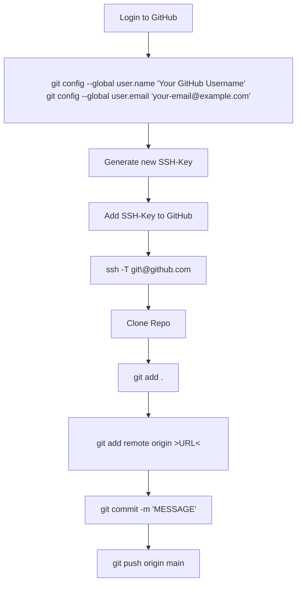

# GitHub - Cloning Repo, Committing and Pushing

```mermaid
flowchart TD

    A[Login to GitHub]
    B[git config --global user.name 'Your GitHub Username'<br>git config --global user.email 'your-email@example.com']
    C[Generate new SSH-Key]
    D[Add SSH-Key to GitHub]
    E[ssh -T git\@github.com]
    F[Clone Repo]
    G[git add .]
    H[git add remote origin >URL<]
    I[git commit -m 'MESSAGE']
    J[git push origin main]

    A --> B:::wide
    B --> C
    C --> D
    D --> E
    E --> F
    F --> G
    G --> H:::kinda_wide
    H --> I
    I --> J

    classDef wide padding: 500px;
    classDef kinda_wide padding: 250px;

```