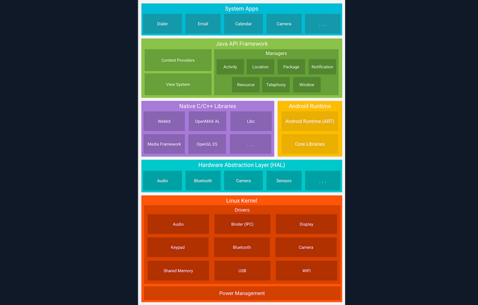
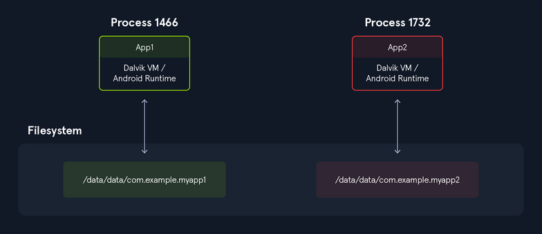

# Android Fundamentals

## Introduction

### About Android

Android is a mobile OS created for touchscreen devices like phones and tablets. Based on a modified version of the Linux Kernel, it was developed by the Open Handset Alliance consortium and commercially sponsored by Google. Most Android devices come pre-installed with Google Mobile Services (_GMS_), a proprietary software suite that includes apps like Google Play and Google Chrome. Google collaborates with various vendors, such as Samsung and HTC, to allow customization of user interfaces and software features. Beyond smartphones and tablets, Android OS is also used in smart TVs and wearables developed by Google. Android applications are distributed through various app stores, including Google Play Store, Amazon Appstore, Samsung Galaxy Store, Huawei AppGallery, and open-source platforms such as Aptoide, F-Droid, APKPure, and APKMirror.

### Versions

|**Name**|**Version**|**API Level**|**Release Date**|
|---|---|---|---|
|Android 1.0|1.0|1|September 23, 2008|
|Android 1.1|1.1|2|February 9, 2009|
|Android Cupcake|1.5|3|April 27, 2009|
|Android Donut|1.6|4|September 15, 2009|
|Android Eclair|2.0|5|October 27, 2009|
|Android Eclair|2.0.1|6|December 3, 2009|
|Android Eclair|2.1|7|January 11, 2010|
|Android Froyo|2.2 – 2.2.3|8|May 20, 2010|
|Android Gingerbread|2.3 – 2.3.2|9|December 6, 2010|
|Android Gingerbread|2.3.3 – 2.3.7|10|February 9, 2011|
|Android Honeycomb|3.0|11|February 22, 2011|
|Android Honeycomb|3.1|12|May 10, 2011|
|Android Honeycomb|3.2 – 3.2.6|13|July 15, 2011|
|Android Ice Cream Sandwich|4.0 – 4.0.2|14|October 18, 2011|
|Android Ice Cream Sandwich|4.0.3 – 4.0.4|15|December 16, 2011|
|Android Jelly Bean|4.1 – 4.1.2|16|July 9, 2012|
|Android Jelly Bean|4.2 – 4.2.2|17|November 13, 2012|
|Android Jelly Bean|test|18|July 24, 2013|
|Android KitKat|4.4 – 4.4.4|19|October 31, 2013|
|Android KitKat|4.4W – 4.4W.2|20|June 25, 2014|
|Android Lollipop|5.0 – 5.0.2|21|November 4, 2014|
|Android Lollipop|5.1 – 5.1.1|22|March 2, 2015|
|Android Marshmallow|6.0 – 6.0.1|23|October 2, 2015|
|Android Nougat|7.0|24|August 22, 2016|
|Android Nougat|7.1 – 7.1.2|25|October 4, 2016|
|Android Oreo|8.0|26|August 21, 2017|
|Android Oreo|8.1|27|December 5, 2017|
|Android Pie|9|28|August 6, 2018|
|Android 10|10|29|September 3, 2019|
|Android 11|11|30|September 8, 2020|
|Android 12|12|31|October 4, 2021|
|Android 12L|12.1|32|March 7, 2022|
|Android 13|13|33|August 15, 2022|
|Android 14|14|34|October 4, 2023|
|Android 15|15|35|September 3, 2024|
|Android 16|16 Beta|36|March 13, 2025|

### Hardware

Although Android supports a range of hardware architectures, the majority of devices use the ARM (_AArch64_) architecture. Architectures such as x86 and x86-64 have also been supported, primarily in later Android versions that included Intel processors. The unofficial project Android-x86 provided support for the x86 architecture even before it was officially supported by Android. Non-native architectures like x86 can also run on the Android Emulator included with the SDK, as well as on various third-party emulators. Android devices typically include a variety of hardware components, such as video cameras, GPS, orientation sensors, dedicated gaming controls, accelerometers, gyroscopes, barometers, magnetometers, proximity sensors, pressure sensors, thermometers, and touchscreens.

### Android OS

Android is a Linux-based OS, and once someone gains access to a shell on the device, Linux commands can be executed. The Linux shell will provide a text-based I/O interface between users and the system kernel. The example below shows how to navigate the file system and list the contents of the directory `/sdcard/`.

```bash
emu64x:/ # cd /sdcard/
emu64x:/sdcard # ls -l

total 104
drwxrws--- 2 u0_a143  media_rw 4096 2022-12-28 11:48 Alarms
drwxrws--x 5 media_rw media_rw 4096 2022-12-28 11:47 Android
drwxrws--- 2 u0_a143  media_rw 4096 2022-12-28 11:48 Audiobooks
drwxrws--- 2 u0_a143  media_rw 4096 2022-12-28 11:48 DCIM
drwxrws--- 2 u0_a143  media_rw 4096 2022-12-28 11:48 Documents
drwxrws--- 2 u0_a143  media_rw 4096 2023-04-19 01:18 Download
drwxrws--- 3 u0_a143  media_rw 4096 2022-12-28 11:48 Movies
drwxrws--- 3 u0_a143  media_rw 4096 2022-12-28 11:48 Music
drwxrws--- 2 u0_a143  media_rw 4096 2022-12-28 11:48 Notifications
drwxrws--- 4 u0_a143  media_rw 4096 2022-12-30 15:09 Pictures
drwxrws--- 2 u0_a143  media_rw 4096 2022-12-28 11:48 Podcasts
drwxrws--- 2 u0_a143  media_rw 4096 2022-12-28 11:48 Recordings
drwxrws--- 2 u0_a143  media_rw 4096 2022-12-28 11:48 Ringtones
```

### Android Software Stack

The Android platform consists of six components. The image below shows the Linux-based software stack Android uses, which contains these components.



_[Further read!](https://developer.android.com/guide/platform?hl=de)_

#### Linux Kernel

The Linux kernel is the foundation of the Android platform, and is responsible for managing device hardware such as the display, camera, bluetooth, wifi, audio, USB, and more. Android Runtime also relies on this layer to perform functionalities like threading and memory management.

Additionally, the Linux kernel allows Android to take advantage of numerous security features that:

- prevent users from reading each other's file
- prevent users from exhausting each other's memory
- prevent users from exhausting CPU resources
- prevent users from exhausting devices resources, like telephony, GPS, and Bluetooth

#### Hardware Abstraction Layer (_HAL_)

The HAL is a software layer that provides the Android OS with a standardized interface with hardware components, such as cameras, Bluetooth, sensors, and input devices. Acting as a bridge between hardware and the higher-level software layers, HAL ensures consistency in how software accesses hardware features. Because different hardware components may have unique requirements and capabilities, writing portable software that works across devices can be challenging. HAL addresses this by isolating hardware-specific implementation details from the Android framework. It is implemented as a collection of shared libraries that are dynamically loaded by the Android framework at runtime. This architecture allows device manufacturers to implement custom support for their hardware while maintaining compatibility with the broader Android platform.

#### Android Runtime

Android Runtime (_ART_) is the managed runtime environment used by the Android OS to execute appplications. Introduced in Android 5.0 Lollipop as a replacement for the Dalvik virtual machine, ART brought significant architectural improvements to app execution. The primary distinction between ART and Dalvik lies in their compilation strategies: ART uses Ahead-of-Time (_AOT_) compilation, while Dalvik relied on Just-in-Time (_JIT_) compilation. With AOT, application code is compiled into native machine code at install time, resulting in faster app launch times and improved runtime performance.

ART is capable of running multiple virtual machines concurrently, even on low-memory devices, and it executes applications packaged in the DEX (_Dalvik Executable_) format. Importantly, ART maintains backward compatibility with applications originally built for Dalvik. Some of the core features and benefits of Android Runtime include:

- improved gargabe collection
- better memory management
- better debugging support
- optimized compression of the DEX file

#### Native C/C++ Libraries

The Native C/C++ Libraries component is a set of libraries written in the C and C++ programming languages, and are included in the Android OS. Developers generally use these libraries to achieve high performance or write low-level code to interact with the hardware. Hardening techniques for increasing security can also be implemented using native C++ code.

Android components like ART and HAL are created using native code, and in order for these components to work, access to native libraries is needed. Applications can access these libraries through the Java Native Interface (_JNI_), while programmers can use the Android NDK to access native libraries directly from their native code.

#### Java API Framework

Another essential part of the Android platform architecture is Java API Framework. This component provides software tools and interfaces for building Android applications. Below are some of the components that Java API Framework provides:

- view system
- resource manager
- notification manager
- activity manager
- content providers
- location manager
- package manager

#### System Apps

System Apps is the top layer core component of the platform architecture. This component includes all the pre-installed applications that come with the Android OS. Such apps include:

- contacts
- messaging
- camera
- browser
- calendar
- maps
- settings

Pre-installed apps can only be modified on rooted devices. However, developers can use them in their applications using the provided APIs. For example, a developer could create an app that uses the camera to scan a QR code.

### Dalvik VM

The Dalvik Virtual Machine (_DVM_) was developed by Google and introduced with the first version of Android in 2008. Android applications written in Java or Kotlin are compiled into Java bytecode and then transformed into Dalvik bytecode, packaged in .dex (_dalvik executable_) or .odex (_optimized dalvik executable_) file formats. Unlike the Java Virtual Machine (_JVM_), which is stack-based, the Dalvik VM is a register-based virtual machine. This architectural difference allows for more efficient execution on devices with limited CPU and memory resources, which is ideal for mobile environments.

Dalvik was the default runtime environment in Android versions prior to API level 21 (_Lollipop_). It was eventually replaced by the Android Runtime (_ART_), which was introduced as a preview in Anroid 4.4 (_KitKat_) and became the default in Android 5.0. ART maintains compatibility by using the same .dex bytecode format as Dalvik, but differs significantly in its execution model. While Dalvik used Just-in-Time compilation, ART initially used Ahead-of-Time compilation - compiling bytecode into native machine code at install time, resulting in faster startup and improved performance. In later Android versions, ART evolved to include hybrid JIT + AOT and Profile-Guided Optimizations (_PGO_), further enhancing runtime efficiency and battery performance.

### Rooting

Android separates the flash storage into the following two main partitions:

- `/system/`
- `/data/`

The partition `/system/` is used by the OS, and the partition `/data/` is used for user data and application installations. In Android, users don't have root access to the OS, and some partitions are read-only. However, rooting the device can be achieved by exploiting security flaws. Having a rooted device enhances the capabilities and customizability of the device, and helps with debugging and overall security assessments. Rooted Anroid devices are also more susceptible to malicious viruses and malware, since the rooting process disables some of the built-in security features of the OS. In some models like Google Pixel and OnePlus, rooting can also be achieved by unlocking the bootloader via the OEM Unlocking option.

### Important Directories

Android's file structure is very similar to other Linux distros. The directories listed below are some of the most important to consider while conducting Android app assessments:

|**Directory**|**Description**|
|---|---|
|`/data/data`|Contains all the applications that are installed by the user|
|`/data/user/0`|Contains data that only the app can access|
|`/data/app`|Contains the APKs of the applications that are installed by the user|
|`/system/app`|Contains the pre-installed applications of the device|
|`/system/bin`|Contains binary files|
|`/data/local/tmp`|A world-writable directory|
|`/data/system`|Contains system configuration files|
|`/etc/apns-conf.xml`|Contains the default Access Point Name (APN) configurations. APN is used in order for the device to connect with our current carrier’s network|
|`/data/misc/wifi`|Contains WiFi configuration files|
|`/data/misc/user/0/cacerts-added`|User certificate store. It contains certificates added by the user|
|`/etc/security/cacerts/`|System certificate store. Permission to non-root users is not permitted|
|`/sdcard`|Contains a symbolic link to the directories DCIM, Downloads, Music, Pictures, etc.|

## Android Apps & OS Security

### Android Security Features

Kotlin and Java are the two primary languages used to develop Android applications. The Android SKD tools compile application source code along with resource files and assets into an Android Package (_APK_). An APK is an archive file with a `.apk` extension that contains all the components needed to install and run an Android app, including compiled bytecode (_`.dex`_), manifest metadata, resources, and native libraries.

Each Android application runs within its own isolated security sandbox, enforced by the underlying Linux-based architecture. This sandboxing model is supported by several core Android security features:

|**Security Features**|
|---|
|Android is a multi-user Linux system where each application is treated as a separate user.|
|By default, the system assigns each app a unique Linux user ID (UID). This UID is used by the system for access control, but is not exposed to the app itself.|
|File system permissions ensure that only the app assigned a particular UID can access its own files.|
|Each app runs in its own process, and each process runs in a separate instance of the Android Runtime (ART) virtual machine, ensuring memory isolation.|
|The system launches the app's process as needed and terminates it when no longer required or when reclaiming system resources.|
|Android enforces the principle of least privilege, meaning apps only receive the permissions necessary to perform their core functionality. Additional privileges must be explicitly declared in the app's manifest and approved by the user (or system, depending on the API level).|
#### Application Sandbox

Android uses Linux's user-based security model to isolate applications by assigning each app a unique user ID (_UID_) and running it in its own process. This creates a kernel-level application sandbox that enforces strict boundaries between apps and the system, preventing unauthorized data access or code execution across app boundaries. Apps cannot interact with each other or access system resources beyond their privileges unless explicit permissions are granted. Because the sandbox is enforced by the Linux kernel, these protections apply uniformly to all code running above the kernel, including native binaries, OS services, libraries, and user applications. Escaping this sandbox requires compromising the kernel itself, typically through a privesc exploit.



Executing the following command, you can see that all applications have a different UID.

```bash
root:/# ls -l /data/data/

<SNIP>
drwx------  4 system         system         4096 2022-12-28 11:47 android
drwx------  4 bluetooth      bluetooth      4096 2022-12-28 11:47 com.android.bluetooth
drwx------  5 radio          radio          4096 2022-12-28 11:48 com.android.ons
drwx------  5 shell          shell          4096 2022-12-28 11:49 com.android.shell
drwx------ 11 u0_a114        u0_a114        4096 2022-12-30 12:41 com.android.chrome
drwx------  5 u0_a119        u0_a119        4096 2022-12-28 11:49 com.android.camera2
```

In addition to the UID-based discretionary access control (_DAC_) sandboxing that Android uses, many other protections have been introduced to strengthen app and system isolation. The following protections were introduced in previous Android releases:

|**Additional Protections**|
|---|
|SELinux Mandatory Access Control (MAC): Separates the system from the apps.|
|SELinux sandbox extension: Isolates apps across physical users.|
|Filter `seccomp-bpf`: Sets a limit to the `syscalls` that apps are allowed to use.|
|Individual SELinux sandboxes and Mandatory Access Control (MAC): Exists for all non-privileged apps with `targetSdkVersion >= 28`.|
|Limited raw view of the filesystem: No direct access to paths like `/sdcard/DCIM`.|

Sharing files between applications also requires strong security practices and implementation. Setting app data as world accessible has been disallowed since `targetSdkVersion >= 28` due to the inability to specify the desired recipient, and thus, malicious apps could potentially gain access to sensitive information from other apps.

#### Application Signing


### APK Structure