# Android Fundamentals

## Introduction

### About Android

Android is a mobile OS created for touchscreen devices like phones and tablets. Based on a modified version of the Linux Kernel, it was developed by the Open Handset Alliance consortium and commercially sponsored by Google. Most Android devices come pre-installed with Google Mobile Services (_GMS_), a proprietary software suite that includes apps like Google Play and Google Chrome. Google collaborates with various vendors, such as Samsung and HTC, to allow customization of user interfaces and software features. Beyond smartphones and tablets, Android OS is also used in smart TVs and wearables developed by Google. Android applications are distributed through various app stores, including Google Play Store, Amazon Appstore, Samsung Galaxy Store, Huawei AppGallery, and open-source platforms such as Aptoide, F-Droid, APKPure, and APKMirror.

### Versions

|**Name**|**Version**|**API Level**|**Release Date**|
|---|---|---|---|
|Android 1.0|1.0|1|September 23, 2008|
|Android 1.1|1.1|2|February 9, 2009|
|Android Cupcake|1.5|3|April 27, 2009|
|Android Donut|1.6|4|September 15, 2009|
|Android Eclair|2.0|5|October 27, 2009|
|Android Eclair|2.0.1|6|December 3, 2009|
|Android Eclair|2.1|7|January 11, 2010|
|Android Froyo|2.2 – 2.2.3|8|May 20, 2010|
|Android Gingerbread|2.3 – 2.3.2|9|December 6, 2010|
|Android Gingerbread|2.3.3 – 2.3.7|10|February 9, 2011|
|Android Honeycomb|3.0|11|February 22, 2011|
|Android Honeycomb|3.1|12|May 10, 2011|
|Android Honeycomb|3.2 – 3.2.6|13|July 15, 2011|
|Android Ice Cream Sandwich|4.0 – 4.0.2|14|October 18, 2011|
|Android Ice Cream Sandwich|4.0.3 – 4.0.4|15|December 16, 2011|
|Android Jelly Bean|4.1 – 4.1.2|16|July 9, 2012|
|Android Jelly Bean|4.2 – 4.2.2|17|November 13, 2012|
|Android Jelly Bean|test|18|July 24, 2013|
|Android KitKat|4.4 – 4.4.4|19|October 31, 2013|
|Android KitKat|4.4W – 4.4W.2|20|June 25, 2014|
|Android Lollipop|5.0 – 5.0.2|21|November 4, 2014|
|Android Lollipop|5.1 – 5.1.1|22|March 2, 2015|
|Android Marshmallow|6.0 – 6.0.1|23|October 2, 2015|
|Android Nougat|7.0|24|August 22, 2016|
|Android Nougat|7.1 – 7.1.2|25|October 4, 2016|
|Android Oreo|8.0|26|August 21, 2017|
|Android Oreo|8.1|27|December 5, 2017|
|Android Pie|9|28|August 6, 2018|
|Android 10|10|29|September 3, 2019|
|Android 11|11|30|September 8, 2020|
|Android 12|12|31|October 4, 2021|
|Android 12L|12.1|32|March 7, 2022|
|Android 13|13|33|August 15, 2022|
|Android 14|14|34|October 4, 2023|
|Android 15|15|35|September 3, 2024|
|Android 16|16 Beta|36|March 13, 2025|

### Hardware

Although Android supports a range of hardware architectures, the majority of devices use the ARM (_AArch64_) architecture. Architectures such as x86 and x86-64 have also been supported, primarily in later Android versions that included Intel processors. The unofficial project Android-x86 provided support for the x86 architecture even before it was officially supported by Android. Non-native architectures like x86 can also run on the Android Emulator included with the SDK, as well as on various third-party emulators. Android devices typically include a variety of hardware components, such as video cameras, GPS, orientation sensors, dedicated gaming controls, accelerometers, gyroscopes, barometers, magnetometers, proximity sensors, pressure sensors, thermometers, and touchscreens.

### Android OS

Android is a Linux-based OS, and once someone gains access to a shell on the device, Linux commands can be executed. The Linux shell will provide a text-based I/O interface between users and the system kernel. The example below shows how to navigate the file system and list the contents of the directory `/sdcard/`.

```bash
emu64x:/ # cd /sdcard/
emu64x:/sdcard # ls -l

total 104
drwxrws--- 2 u0_a143  media_rw 4096 2022-12-28 11:48 Alarms
drwxrws--x 5 media_rw media_rw 4096 2022-12-28 11:47 Android
drwxrws--- 2 u0_a143  media_rw 4096 2022-12-28 11:48 Audiobooks
drwxrws--- 2 u0_a143  media_rw 4096 2022-12-28 11:48 DCIM
drwxrws--- 2 u0_a143  media_rw 4096 2022-12-28 11:48 Documents
drwxrws--- 2 u0_a143  media_rw 4096 2023-04-19 01:18 Download
drwxrws--- 3 u0_a143  media_rw 4096 2022-12-28 11:48 Movies
drwxrws--- 3 u0_a143  media_rw 4096 2022-12-28 11:48 Music
drwxrws--- 2 u0_a143  media_rw 4096 2022-12-28 11:48 Notifications
drwxrws--- 4 u0_a143  media_rw 4096 2022-12-30 15:09 Pictures
drwxrws--- 2 u0_a143  media_rw 4096 2022-12-28 11:48 Podcasts
drwxrws--- 2 u0_a143  media_rw 4096 2022-12-28 11:48 Recordings
drwxrws--- 2 u0_a143  media_rw 4096 2022-12-28 11:48 Ringtones
```

### Android Software Stack

The Android platform consists of six components. The image below shows the Linux-based software stack Android uses, which contains these components.


_[Further read!](https://developer.android.com/guide/platform?hl=de)_

#### Linux Kernel

The Linux kernel is the foundation of the Android platform, and is responsible for managing device hardware such as the display, camera, bluetooth, wifi, audio, USB, and more. Android Runtime also relies on this layer to perform functionalities like threading and memory management.

Additionally, the Linux kernel allows Android to take advantage of numerous security features that:

- prevent users from reading each other's file
- prevent users from exhausting each other's memory
- prevent users from exhausting CPU resources
- prevent users from exhausting devices resources, like telephony, GPS, and Bluetooth

#### Hardware Abstraction Layer (_HAL_)

The HAL is a software layer that provides the Android OS with a standardized interface with hardware components, such as cameras, Bluetooth, sensors, and input devices. Acting as a bridge between hardware and the higher-level software layers, HAL ensures consistency in how software accesses hardware features. Because different hardware components may have unique requirements and capabilities, writing portable software that works across devices can be challenging. HAL addresses this by isolating hardware-specific implementation details from the Android framework. It is implemented as a collection of shared libraries that are dynamically loaded by the Android framework at runtime. This architecture allows device manufacturers to implement custom support for their hardware while maintaining compatibility with the broader Android platform.

#### Android Runtime

Android Runtime (_ART_) is the managed runtime environment used by the Android OS to execute appplications. Introduced in Android 5.0 Lollipop as a replacement for the Dalvik virtual machine, ART brought significant architectural improvements to app execution. The primary distinction between ART and Dalvik lies in their compilation strategies: ART uses Ahead-of-Time (_AOT_) compilation, while Dalvik relied on Just-in-Time (_JIT_) compilation. With AOT, application code is compiled into native machine code at install time, resulting in faster app launch times and improved runtime performance.

ART is capable of running multiple virtual machines concurrently, even on low-memory devices, and it executes applications packaged in the DEX (_Dalvik Executable_) format. Importantly, ART maintains backward compatibility with applications originally built for Dalvik. Some of the core features and benefits of Android Runtime include:

- improved gargabe collection
- better memory management
- better debugging support
- optimized compression of the DEX file

#### Native C/C++ Libraries

The Native C/C++ Libraries component is a set of libraries written in the C and C++ programming languages, and are included in the Android OS. Developers generally use these libraries to achieve high performance or write low-level code to interact with the hardware. Hardening techniques for increasing security can also be implemented using native C++ code.

Android components like ART and HAL are created using native code, and in order for these components to work, access to native libraries is needed. Applications can access these libraries through the Java Native Interface (_JNI_), while programmers can use the Android NDK to access native libraries directly from their native code.

#### Java API Framework

Another essential part of the Android platform architecture is Java API Framework. This component provides software tools and interfaces for building Android applications. Below are some of the components that Java API Framework provides:

- view system
- resource manager
- notification manager
- activity manager
- content providers
- location manager
- package manager

#### System Apps

System Apps is the top layer core component of the platform architecture. This component includes all the pre-installed applications that come with the Android OS. Such apps include:

- contacts
- messaging
- camera
- browser
- calendar
- maps
- settings

Pre-installed apps can only be modified on rooted devices. However, developers can use them in their applications using the provided APIs. For example, a developer could create an app that uses the camera to scan a QR code.

### Dalvik VM

The Dalvik Virtual Machine (_DVM_) was developed by Google and introduced with the first version of Android in 2008. Android applications written in Java or Kotlin are compiled into Java bytecode and then transformed into Dalvik bytecode, packaged in .dex (_dalvik executable_) or .odex (_optimized dalvik executable_) file formats. Unlike the Java Virtual Machine (_JVM_), which is stack-based, the Dalvik VM is a register-based virtual machine. This architectural difference allows for more efficient execution on devices with limited CPU and memory resources, which is ideal for mobile environments.

Dalvik was the default runtime environment in Android versions prior to API level 21 (_Lollipop_). It was eventually replaced by the Android Runtime (_ART_), which was introduced as a preview in Anroid 4.4 (_KitKat_) and became the default in Android 5.0. ART maintains compatibility by using the same .dex bytecode format as Dalvik, but differs significantly in its execution model. While Dalvik used Just-in-Time compilation, ART initially used Ahead-of-Time compilation - compiling bytecode into native machine code at install time, resulting in faster startup and improved performance. In later Android versions, ART evolved to include hybrid JIT + AOT and Profile-Guided Optimizations (_PGO_), further enhancing runtime efficiency and battery performance.

### Rooting

Android separates the flash storage into the following two main partitions:

- `/system/`
- `/data/`

The partition `/system/` is used by the OS, and the partition `/data/` is used for user data and application installations. In Android, users don't have root access to the OS, and some partitions are read-only. However, rooting the device can be achieved by exploiting security flaws. Having a rooted device enhances the capabilities and customizability of the device, and helps with debugging and overall security assessments. Rooted Anroid devices are also more susceptible to malicious viruses and malware, since the rooting process disables some of the built-in security features of the OS. In some models like Google Pixel and OnePlus, rooting can also be achieved by unlocking the bootloader via the OEM Unlocking option.

### Important Directories

Android's file structure is very similar to other Linux distros. The directories listed below are some of the most important to consider while conducting Android app assessments:

|**Directory**|**Description**|
|---|---|
|`/data/data`|Contains all the applications that are installed by the user|
|`/data/user/0`|Contains data that only the app can access|
|`/data/app`|Contains the APKs of the applications that are installed by the user|
|`/system/app`|Contains the pre-installed applications of the device|
|`/system/bin`|Contains binary files|
|`/data/local/tmp`|A world-writable directory|
|`/data/system`|Contains system configuration files|
|`/etc/apns-conf.xml`|Contains the default Access Point Name (APN) configurations. APN is used in order for the device to connect with our current carrier’s network|
|`/data/misc/wifi`|Contains WiFi configuration files|
|`/data/misc/user/0/cacerts-added`|User certificate store. It contains certificates added by the user|
|`/etc/security/cacerts/`|System certificate store. Permission to non-root users is not permitted|
|`/sdcard`|Contains a symbolic link to the directories DCIM, Downloads, Music, Pictures, etc.|

## Android Apps & OS Security

### Android Security Features

Kotlin and Java are the two primary languages used to develop Android applications. The Android SKD tools compile application source code along with resource files and assets into an Android Package (_APK_). An APK is an archive file with a `.apk` extension that contains all the components needed to install and run an Android app, including compiled bytecode (_`.dex`_), manifest metadata, resources, and native libraries.

Each Android application runs within its own isolated security sandbox, enforced by the underlying Linux-based architecture. This sandboxing model is supported by several core Android security features:

|**Security Features**|
|---|
|Android is a multi-user Linux system where each application is treated as a separate user.|
|By default, the system assigns each app a unique Linux user ID (UID). This UID is used by the system for access control, but is not exposed to the app itself.|
|File system permissions ensure that only the app assigned a particular UID can access its own files.|
|Each app runs in its own process, and each process runs in a separate instance of the Android Runtime (ART) virtual machine, ensuring memory isolation.|
|The system launches the app's process as needed and terminates it when no longer required or when reclaiming system resources.|
|Android enforces the principle of least privilege, meaning apps only receive the permissions necessary to perform their core functionality. Additional privileges must be explicitly declared in the app's manifest and approved by the user (or system, depending on the API level).|
#### Application Sandbox

Android uses Linux's user-based security model to isolate applications by assigning each app a unique user ID (_UID_) and running it in its own process. This creates a kernel-level application sandbox that enforces strict boundaries between apps and the system, preventing unauthorized data access or code execution across app boundaries. Apps cannot interact with each other or access system resources beyond their privileges unless explicit permissions are granted. Because the sandbox is enforced by the Linux kernel, these protections apply uniformly to all code running above the kernel, including native binaries, OS services, libraries, and user applications. Escaping this sandbox requires compromising the kernel itself, typically through a privesc exploit.


Executing the following command, you can see that all applications have a different UID.

```bash
root:/# ls -l /data/data/

<SNIP>
drwx------  4 system         system         4096 2022-12-28 11:47 android
drwx------  4 bluetooth      bluetooth      4096 2022-12-28 11:47 com.android.bluetooth
drwx------  5 radio          radio          4096 2022-12-28 11:48 com.android.ons
drwx------  5 shell          shell          4096 2022-12-28 11:49 com.android.shell
drwx------ 11 u0_a114        u0_a114        4096 2022-12-30 12:41 com.android.chrome
drwx------  5 u0_a119        u0_a119        4096 2022-12-28 11:49 com.android.camera2
```

In addition to the UID-based discretionary access control (_DAC_) sandboxing that Android uses, many other protections have been introduced to strengthen app and system isolation. The following protections were introduced in previous Android releases:

|**Additional Protections**|
|---|
|SELinux Mandatory Access Control (MAC): Separates the system from the apps.|
|SELinux sandbox extension: Isolates apps across physical users.|
|Filter `seccomp-bpf`: Sets a limit to the `syscalls` that apps are allowed to use.|
|Individual SELinux sandboxes and Mandatory Access Control (MAC): Exists for all non-privileged apps with `targetSdkVersion >= 28`.|
|Limited raw view of the filesystem: No direct access to paths like `/sdcard/DCIM`.|

Sharing files between applications also requires strong security practices and implementation. Setting app data as world accessible has been disallowed since `targetSdkVersion >= 28` due to the inability to specify the desired recipient, and thus, malicious apps could potentially gain access to sensitive information from other apps.

#### Application Signing

To install an application on a device or upload it to the Play Store, the APK file must be signed. Signing the APK is crucial for security, as it protects the package from malicious modifications. Devices running Android 7.0 and earlier support JAR signing, but this method does not offer complete protection - certain paths of the APK, such as ZIP metadata, are not covered by the signature.

Signature Schema v2 was introduced in Android 7.0 and later to improve APK integrity and guard against unauthorized changes. Signature Scheme v3, introduced in Android 9, added support for including additional metadata in the signing block. Starting with Android 11, APK Signature Scheme v4 is used, which employs a Merkle hash tree calculated over all bytes of the APK and follows the structure of an fs-verity hash tree. The v4 signature is stored in a separate file and requires a corresponding v2 or v3 signature. The image below shows the flow of signature validation when an application is installed.

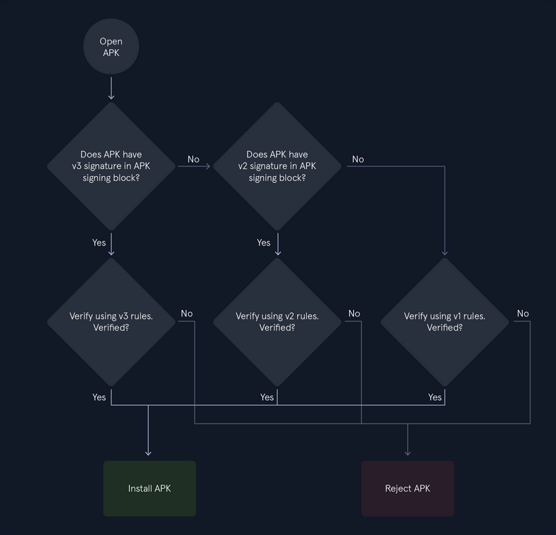

Signature v2 and v3 perform checks that invalidate the APK file if there are any modifications. This way, attacks like injecting DEX files into the APK file are prevented. Signature Scheme v1, however, is vulnerable to this kind of attack. The Janus vuln (_CVE-2017-13156_) allows malicious actors to inject DEX files into the APK - without affecting the signature - in cases where the APK is signed using the Signature Scheme v1. As a result, they can install and run the modified app.

The malicious DEX file is prepended to the APK file, and the Android runtime accepts it as a valid update made to the earlier, legitimate version of the app. Then, the Dalvik VM will load the code of the DEX file. Android devices 5.0 < 8.1 that are signed using Signature Scheme v1 are affected by Janus.

Application signing can be performed in several ways:

- Android Studio, via the `Generate Signed App Bundle / APK`
- The `jarsigner` / `apksigner` tools
- [Play App Signing](https://support.google.com/googleplay/android-developer/answer/9842756?sjid=14772812161089830777-NC#zippy=%2Cwhat-is-play-app-signing%2Cwhy-should-i-use-play-app-signing%2Chow-does-play-app-signing-work%2Cwhat-are-the-benefits-of-using-play-app-signing%2Cwhat-are-the-requirements-for-using-play-app-signing%2Chow-do-i-enroll-in-play-app-signing%2Cwhat-happens-if-i-cancel-my-play-app-signing-subscription%2Cwhat-if-i-have-questions-about-play-app-signing)

The certificates that are used to sign an application are self-signed. One can sign an APK file with `apksigner` tool using the following commands:

```bash
d41y@htb[/htb]$ echo -e "password\npassword\njohn doe\ntest\ntest\ntest\ntest\ntest\nyes" > params.txt
d41y@htb[/htb]$ cat params.txt | keytool -genkey -keystore key.keystore -validity 1000 -keyalg RSA -alias john
d41y@htb[/htb]$ zipalign -p -f -v 4 myapp.apk myapp_signed.apk
d41y@htb[/htb]$ echo password | apksigner sign --ks key.keystore myapp_signed.apk
```

These commands accomplish the following:

- Creates a file, `params.txt`, with the necessary input data for `keytool` to generate a keypair.
- Pipes the contents of `params.txt` into `keytool` to automate the key generation process, storing the key in `key.keystore`.
- `zipalign` allows uncompressed files within `myapp.apk` to be accessed directly via mmap, creating an optimized application named `myapp_signed.apk`.
- The final app is signed with `apksigner`, using the key stored in `key.keystore` and the password being echoed through the pipe.

#### Verified Boot

... is an Android security feature that ensures the integrity of the OS. This is achieved using a unique set of cryptographic keys to sign and verify the boot image and ensure that only the authorized parties can modify the system. While Android is booting up, each stage verifies the integrity and authenticity of the next stage, and if the signature is valid, then the device boots up normally. Otherwise, the device either won't boot, or it will provide the user with a message updating them that the device is tampered with. Apart from this, Verified Boot utilizes Rollback Protection to prevent exploits from becoming persistent. This is done by ensuring that Android is only updating to the newest version. The recommended boot flow for a device is as follows:

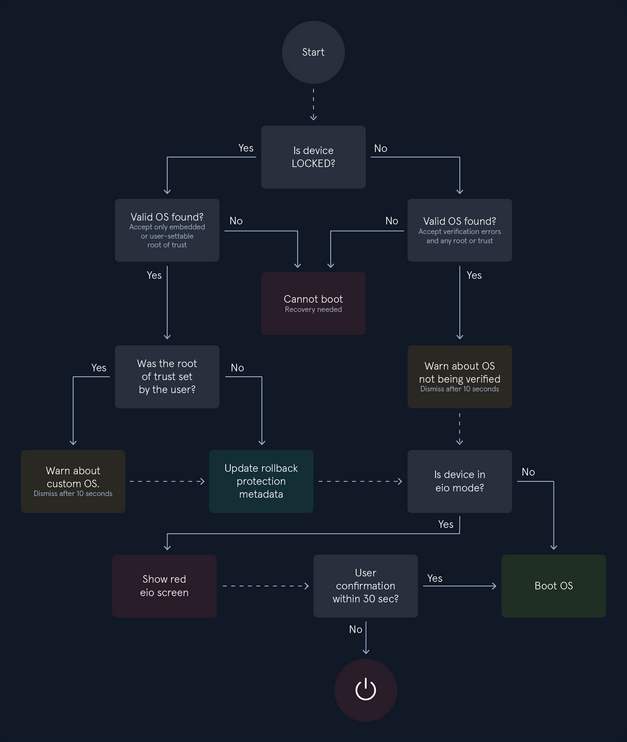

### APK Structure

The Android Package Kit file (_APK_) is the file format used by the Android OS to distribute and install applications. An APK is essentially an archive that contains all the components needed for an Android app to run. Among its contents is the application's compiled code, stored in a single DEX file. When an Android application is compiled, the Java (_or Kotlin_) source code is first converted into Java Bytecode, which is then transformed and optimized into a DEX file. These DEX files are executable and can be interpreted by the Dalvik VM or the Android Runtime, depending on the device and Android version.

In addition to compiled code, APK files include resources such as assets, images, UI layouts, and the AndroidManifest.xml file - all of which are necessary for the application to function. APK files use the `.apk` extension and, since they are ZIP-based archives, they can be unpacked with standard tools such as the `unzip` command in Linux.

```bash
d41y@htb[/htb]$ unzip myapp.apk
d41y@htb[/htb]$ ls -l

total 27584
-rw-r--r--    1 bertolis  bertolis     4220 Jan  1  1981 AndroidManifest.xml
drwxr-xr-x   49 bertolis  bertolis     1568 May 10 13:36 META-INF
drwxr-xr-x    3 bertolis  bertolis       96 May 10 13:36 assets
-rw-r--r--    1 bertolis  bertolis  8285624 Jan  1  1981 classes.dex
drwxr-xr-x    9 bertolis  bertolis      288 May 10 13:36 kotlin
drwxr-xr-x    6 bertolis  bertolis      192 May 10 13:36 lib
drwxr-xr-x  545 bertolis  bertolis    17440 May 10 13:36 res
-rw-r--r--    1 bertolis  bertolis   922940 Jan  1  1981 resources.arsc
```

The files extracted from the APK are encoded, and neither the source code nor the config files are human-readable.

```
d41y@htb[/htb]$ vim AndroidManifest.xml
```

The image below shows the unzipped structure of an APK file.

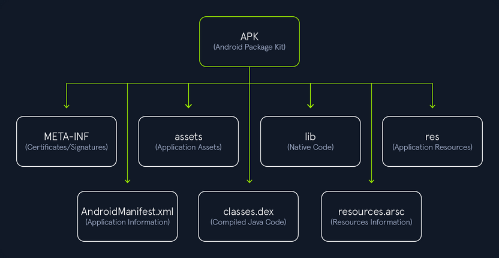

#### META-INF

This folder is generated when the application is signed, and it contains verification information. Any modification made to the APK file will lead to invalidation, and the APK will need to resigned. Listing the content of this directory reveals the following files:

```bash
d41y@htb[/htb]$ ls -l META-INF/

total 664
-rw-r--r--  1 bertolis  bertolis   1103 Jan  1  1981 CERT.RSA
-rw-r--r--  1 bertolis  bertolis  77917 Jan  1  1981 CERT.SF
-rw-r--r--  1 bertolis  bertolis  77843 Jan  1  1981 MANIFEST.MF
<SNIP>
```

|**File**|**Description**|
|---|---|
|`CERT.RSA`|Contains the public key and the signature of CERT.SF.|
|`CERT.SF`|Contains a list of names/hashes of the corresponding lines in the MANIFEST.MF file.|
|`MANIFEST.MF`|Contains a list of names/hashes (usually SHA256 in Base64) for all the files of the APK, and is used to invalidate the APK if any of the files are modified.|

#### assets

This folder contains assets that developers bundle with the application, and can be retrieved by the AssetManager. These assets can be images, videos, documents, databases, and other raw files. Xamarin, Cordova, and React-Native applications will use this folder to save code and DLL's as well.

#### lib

This folder contains native libraries with compiled code targeting different device architectures. Android applications that use the Native Development Kit may include components written in C or C++. When an app includes native libraries, they are stored in the `lib` directory as shared object files with `.so` extension. Separate SO files are generated for each supported architecture, typically organized under subdirectories following this structure:

```bash
d41y@htb[/htb]$ ls -l lib/

total 0
drwxr-xr-x  3 bertolis  bertolis  96 May 10 13:36 arm64-v8a
drwxr-xr-x  3 bertolis  bertolis  96 May 10 13:36 armeabi-v7a
drwxr-xr-x  3 bertolis  bertolis  96 May 10 13:36 x86
drwxr-xr-x  3 bertolis  bertolis  96 May 10 13:36 x86_64
```

#### res

This folder contains predefined application resources that cannot be modified by the user at runtime, unlike assets. These resources include XML files defining color state lists, UI layouts, fonts, values, configurations for OS versions, screen orientations, network settings, and more.

```bash
d41y@htb[/htb]$ ls -l res/

<SNIP>
drwxr-xr-x 1 bertolis bertolis 10762 Jan 27 16:05 color
drwxr-xr-x 1 bertolis bertolis  6624 Jan 27 16:05 drawable
drwxr-xr-× 1 bertolis bertolis    30 Jan 27 16:05 raw
drwxr-xr-× 1 bertolis bertolis   466 Jan 27 16:05 xml
```

#### AndroidManifest.xml

The manifest file contains metadata about the application. It defines essential attributes and components that the system uses to manage the app, including:

- package name
- SDK version
- build version
- permissions
- NetworkSecurityConfig
- activities
- providers
- services

#### classes.dex

This file contains all compiled Java classes in DEX format, which are executed by the Android Runtime on devices running Android 5.0 or higher, or by the Dalvik VM on earlier versions. Large applications may include multiple DEX files, named sequentially as `classes2.dex`, `classes3.dex`, and so on.

#### resources.arsc

This file contains precompiled resources that are used by the app at runtime. It maps resource identifiers in the code to their actual values, such as strings, colors, layouts, and styles. It also includes a binary representation of XML resources. In some APKs, you may also find a `kotlin/` folder, which exists in apps written in Kotlin and contains Kotlin-specific metadata used by the runtime and tooling.

## Android Apps & Development

### Android Studio

Android Studio is an Integrated Development Environment (_IDE_) based on JetBrain's IntelliJ IDEA and is the official IDE for Android application development. Familiartity with the Android Studio project structure can provide valuable insight during reverse engineering. Android Studio is available for Windows, Linux, and macOS. On Windows and macOS, you can download the `.exe` and `.dmg` installers respectively, and follow the Setup Wizard to complete the installation. For Debian based distros:

```bash
d41y@htb[/htb]$ wget https://redirector.gvt1.com/edgedl/android/studio/ide-zips/2024.3.1.14/android-studio-2024.3.1.14-linux.tar.gz
d41y@htb[/htb]$ tar xvzf android-studio-2024.3.1.14-linux.tar.gz
d41y@htb[/htb]$ sh android-studio/bin/studio.sh
```

Once the Setup Wizard starts, click "Next" on the first four windows to download the SDK and accept the License Agreement. Then, wait for the components to download and click "Finish".

On the next window, click on the "Create Project" button to create a new project.

Select "Empty Views Activity" and choose "Groovy DSL (build.gradle)" in the "Build configuration language" option, and click "Next".

Finally, you give the app a name, select the programming language and click "Finish".

After clicking "Finish", you wait for the indexing process to complete before proceeding with the following steps.

#### Project Structure

Once the project is created, you see the project structure.

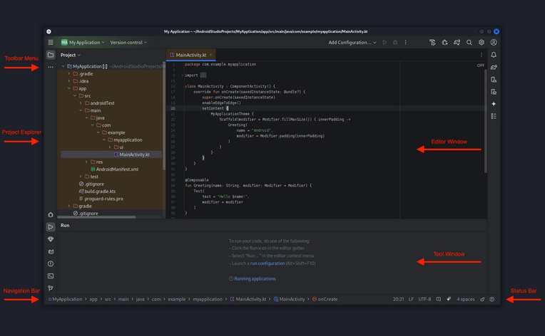

Understanding the Android Studio project structure is essential for reverse engineering, as it provides insight into how the app is organized during development.

The project contains the following folders:

##### app

|**Files**|**Description**|
|---|---|
|`manifest`|Contains essential metadata about the app, including the package name, components (activities, services, etc.), permissions, network configuration, API level, and more.|
|`java`|Contains the application's Java source code.|
|`res`|Contains app resources such as UI strings, images, layout XML files, and other static assets used by the app.|

##### Gradle Scripts

|**Files**|**Description**|
|---|---|
|`build.gradle`|Defines build configurations for the project or module, including dependencies, build types, and whether code optimization tools (such as ProGuard) are enabled.|
|`proguard-rules.pro`|Specifies custom rules for ProGuard|

#### Types of Applications

Depending on the technologies used, Mobile Apps can be categorized into three basic types.

##### Native Apps

... are built specifically for a particular OS. Android native apps are typically developed using Kotlin or Java. They are generally considered more secure than hybrid apps because they have direct access to platform-level security features and system APIs.

##### Web Apps

While similar in appearance to native apps, web apps are developed to be responsive and accessible from mobile web browsers. They are typically built using HTML, CSS, and JavaScript. Web apps can be vulnerable to web-based attacks due to their reliance on web technologies and browser security.

##### Hybrid Apps

... combine elements of both native and web apps and are designed to be cross-platform. They use WebViews to display web content within a native app container. While offering the flexibility of web apps, hybrid apps can also be vulnerable to web-based attacks, including XSS attacks, weak SSL implementations, and more.

### Native Apps

Native apps are software applications written in a specific programming language and tailored to run on a particular platform. In the context of Android, native apps are primarily developed using Java or Kotlin and built with Android Studio, typically leveraging components from the Android Software Development Kit.

Google is using Kotlin as the default programming language for app development. However, Java is still a popular choice and many users prefer it over Kotlin. In the following steps, it is shown how to create a simple application in Java.

Since you have already created a new project, examine how the app layout is created and connected with the Java code and other resources. On the left side section under `app/res/layout` you select the `activity_main.xml`.

Layouts define the structure of the user interface of the application, and Android uses XML to create such layouts. In this file, `activity_main.xml`, you can add text, buttons, images, and other things that will be displayed to the user. The following snippet will create the layout of an application that prints a message on the screen when the button is tapped.

```xml
<?xml version="1.0" encoding="utf-8"?>
<androidx.constraintlayout.widget.ConstraintLayout xmlns:android="http://schemas.android.com/apk/res/android"
    xmlns:app="http://schemas.android.com/apk/res-auto"
    xmlns:tools="http://schemas.android.com/tools"
    android:layout_width="match_parent"
    android:layout_height="match_parent"
    tools:context=".MainActivity">

    <TextView
        android:id="@+id/title"
        android:layout_width="wrap_content"
        android:layout_height="wrap_content"
        android:text="My Application"
        android:textSize="32sp"
        app:layout_constraintBottom_toBottomOf="parent"
        app:layout_constraintEnd_toEndOf="parent"
        app:layout_constraintStart_toStartOf="parent"
        app:layout_constraintTop_toTopOf="parent"
        app:layout_constraintVertical_bias="0.097" />

    <Button
        android:id="@+id/button"
        android:layout_width="wrap_content"
        android:layout_height="wrap_content"
        android:text="Button"
        app:layout_constraintBottom_toBottomOf="parent"
        app:layout_constraintEnd_toEndOf="parent"
        app:layout_constraintStart_toStartOf="parent"
        app:layout_constraintTop_toBottomOf="@+id/title"
        app:layout_constraintVertical_bias="0.403" />

    <TextView
        android:id="@+id/message"
        android:layout_width="380dp"
        android:layout_height="31dp"
        android:text="@string/message"
        android:textSize="20sp"
        android:textAlignment="center"
        android:textIsSelectable="true"
        app:layout_constraintBottom_toBottomOf="parent"
        app:layout_constraintEnd_toEndOf="parent"
        app:layout_constraintStart_toStartOf="parent"
        app:layout_constraintTop_toBottomOf="@+id/button"
        app:layout_constraintVertical_bias="0.25" />

</androidx.constraintlayout.widget.ConstraintLayout>
```

The above snippet consists of three objects: two `TextView` and one `Button`. It is worth noticing the following attributes:

|**Attribute**|**Description**|
|---|---|
|`tools:context=".MainActivity`|Defines the Activity in which the layout will be used. This is primarily used in the layout editor for preview purposes and does not affect the runtime behavior of the app.|
|`android:id`|Assigns a unique identifier to the object, allowing it to be referenced in Java code (such as`MainActivity.java`) and other resources. The `@+id` prefix indicates it will be created as a new resource, whereas `@id` would be used if the resource were already defined.|
|`android:text`|Sets the text content of the TextView or Button. The value can be a hardcoded string, like `android:text="My Application"`, or a reference to a string resource from the relative to the project file `res/values/strings.xml`. Referencing string resources is the recommended approach for localization and maintainability. The example below shows the contents of the `strings.xml` file used in this project.|

```xml
<resources>
    <string name="app_name">My Application</string>
    <string name="message">Hello World!</string>
</resources>
```

These values can also be accessed from the Java code using the `R` class. The `R` class, which is auto-generated by Android, contains the IDs of all the resources in the `res/` directory. Familiarity with these procedures will give you a better understanding of the app during the process of reverse engineering. Now see the content of the file `MainActivity.java`, which contains the Java code of the app.

```java
package com.example.myapplication;

import androidx.appcompat.app.AppCompatActivity;

import android.os.Bundle;
import android.view.View;
import android.widget.Button;
import android.widget.TextView;

public class MainActivity extends AppCompatActivity {
    TextView message;
    Button button;

    @Override
    protected void onCreate(Bundle savedInstanceState) {
        super.onCreate(savedInstanceState);
        setContentView(R.layout.activity_main);

        message = (TextView)findViewById(R.id.message);
        button = (Button)findViewById(R.id.button);

        button.setOnClickListener(new View.OnClickListener() {
            @Override
            public void onClick(View v) {
                message.setText("Hello from Java!");
            }
        });
    }
}
```

The class `MainActivity` includes the method `OnCreate()`. This method is called when the activity is starting, thus everything inside will run automatically. The line `setContentView(R.layout.activity_main);` indicates that the `activity_main.xml` file will be used to set the layout of this activity. Method `OnCreate()` is also used for initializations since it runs when the activity starts. The variables `message` and `button` are initialized to point to the corresponding objects found in the `activity_main.xml` file.

```java
message = (TextView)findViewById(R.id.message);
button = (Button)findViewById(R.id.button);
```

Using the `R.java` file, the `R.id.message` points to the `android:id0"@+id/message"` attribute in the `activity_main.xml` file you saw earlier. Finally, the line `message.setText("Hello from Java!");` will be executed as soon as the button is clicked, like the line `button.setOnClickListener` indicates. Once it's tapped, the text `Hello from Java!` will be set in the TextView.

The snippet below shows the same app written in Kotlin. To configure the project to use Kotlin as the default programming language, you must select Kotlin in the Language field on the "New Project" window while creating a new project in Android Studio. Then, optionally, you can also select Kotlin DSL (_build.gradle.kts_)  in the "Build configuration language" field to utilize Kotlin syntax for Gradle build scripts.

```kotlin
package com.example.myapplication

import androidx.appcompat.app.AppCompatActivity
import android.os.Bundle
import android.widget.Button
import android.widget.TextView

class MainActivity : AppCompatActivity() {
    override fun onCreate(savedInstanceState: Bundle?) {
        super.onCreate(savedInstanceState)
        setContentView(R.layout.activity_main)

        val message = findViewById<TextView>(R.id.message)
        val button = findViewById<Button>(R.id.button)

        button.setOnClickListener {
            message.text = "Hello from Java!"
        }
    }
}
```

Although Kotlin and Java use different syntax, most tools will generate the same pseudocode when reverse engineering the app. This means that it's not necessary for you to master both programming languages. Once the app is developed, you can export a signed APK file ready for installation. Under "Build" -> "Generate Signed Bundle / APK", you select APK and click "next".

On the next window, you click "Create new ..." to create a new key.

Then, you set the "Key store path", "password", "Alias", and "First and Last Name", and click "OK".

Once the key is created, you click "Next".

Finally, you select the option "release" and click on "Finish".

The signed APK file can be found under the directory `~/AndroidStudioProjects/MyApplication/app/release/`, with the name `app-release.apk`.

```bash
d41y@htb[/htb]$ ls -l ~/AndroidStudioProjects/MyApplication/app/release/

total 8856
-rw-r--r--@ 1 bertolis  bertolis  4527105 May  3 01:44 app-release.apk
-rw-r--r--@ 1 bertolis  bertolis      379 May  3 01:44 output-metadata.json
```

You can rename and install the exported APK file directly on the device.

### Native Code

Native code is compiled to run on a specific processor architecture, which can give apps written in native code a performance advantage on compatible hardware. Android Studio supports the inclusion of native code through the Native Development Kit, which allows developers to write portions of the app in C or C++. This is often done to reduce latency, optimize for hardware capabilities, or in some cases harden the security of an application.

Native code is typically included in the application as shared libraries (`.so` files). These libraries can then be invoked from Java or Kotlin using the Java Native Interface. JNI is a framework that defines how managed code interacts with unmanaged native code, enabling cross-language method calls and data exchange.

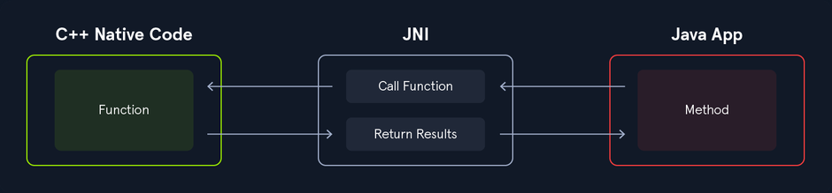

Create a Native C++ project to get more familiar with the way it works. To accomplish this, first launch Android Studio and navigate to `New Project` -> `Native C++`. Proceed to name your app, then in the following window under the `C++ Standard` section, select `Toolchain Default` from the dropdown menu. Finally, click Finish.

Once the project is created, you notice the `native-lib.cpp` file found under the `App` -> `cpp` folder in the left side section of Android Studio.

The following snippet of C++ code shows a function that returns the string `Hello from C++`.

```cpp
#include <jni.h>
#include <string>

extern "C" JNIEXPORT jstring JNICALL
Java_com_example_myapplication_MainActivity_stringFromJNI(
        JNIEnv* env,
        jobject /* this */) {
    std::string hello = "Hello from C++";
    return env->NewStringUTF(hello.c_str());
}
```

The function name `Java_com_example_myapplication_MainActivity_stringFromJNI` follows the JNI naming convention and indicates that it will be called from the `MainActivity` class. The line `return env->NewStringUTF(hello.c_str());` returns a string to the Java layer. It's important to understand how this function handles calls from Java, as this pattern frequently appears during reverse engineering. Also take a look at the `MainActivity.java` file to see how the `native-lib.cpp` library is loaded and how the native function is called.

```java
package com.example.myapplication;

import androidx.appcompat.app.AppCompatActivity;
import android.os.Bundle;
import android.view.View;
import android.widget.TextView;

public class MainActivity extends AppCompatActivity {
    TextView message;

    // Used to load the 'myapplication' library on application startup.
    static {
        System.loadLibrary("myapplication");
    }

    @Override
    protected void onCreate(Bundle savedInstanceState) {
        super.onCreate(savedInstanceState);
        setContentView(R.layout.activity_main);

        message = (TextView)findViewById(R.id.sample_text);
        message.setText(stringFromJNI());
    }

    /**
     * A native method that is implemented by the 'myapplication' native library,
     * which is packaged with this application.
     */
    public native String stringFromJNI();
}
```

Inside the `MainActivity` class you can see the line `System.loadLibrary("myapplication");`. This is where the library is loaded statically, defined by the name `myapplication`. Listing the content of the file `App` -> `cpp` -> `CMakeLists.txt` reveals the following snippet.

```cmake
add_library( # Sets the name of the library.
        myapplication

        # Sets the library as a shared library.
        SHARED

        # Provides a relative path to your source file(s).
        native-lib.cpp)
```

As you can see, the name of the file `native-lib.cpp` is set to `myapplication`. The `CMakeLists.txt` is used to describe the files of the native C++ project. Back to the `MainActivity.java` you can also see the line `public native String stringFromJNI()`, which indicates the declaration of the native method `stringFromJNI()`. This method returns the string `Hello from C++` that you saw earlier in the `native-lib.cpp` file, and it is then printed on the screen through the `TextView message` object.

You are not limited to only loading a library statically. Libraries can be loaded while the application is running as well. The following snippet of code shows a class that loads the library while the app is running.

```java
public class Update {
    // Method declaration
    public native String stringFromJNI();

    // Copy the file locally and load it
    public String update(String path_sd_card, String filesDir){
        FileOutputStream outputStream;
        FileInputStream inputStream;
      
        try {
            inputStream = new FileInputStream(new File(path_sd_card + "/Download/libupgrade.so"));
            outputStream = new FileOutputStream(new File(filesDir + "/libupgrade.so"));

            FileChannel inChannel = inputStream.getChannel();
            FileChannel outChannel = outputStream.getChannel();
            inChannel.transferTo(0, inChannel.size(), outChannel);
            inputStream.close();
            outputStream.close();
        } catch (IOException e) {
            e.printStackTrace();
        }

        System.load(filesDir + "/libupgrade.so");

        // Returns the value of the function stringFromJNI() from the libupgrade.so file
        return stringFromJNI();
    }
}
```

After the file is copied into the application's home directory, the line `System.load(filesDir + "/libupgrade.so");` loads the library. Bad code implementation could lead to remote command execution.

### JavaScript & WebViews

WebViews are components that allow developers to embed and display web content directly within an Android application. While powerful, improper use of WebView features can introduce serious security risks - a common issue in Android apps. Poor WebView implementation can expose the app to a wide range of vulns, such cross-site scripting and local file inclusion. Because of this, the official Android documentation recommends using the system's default browser to deliver web content whenever possible, instead of embedding it with a WebView.

In recent versions, the default WebView configuration has become more restrictive, mitigating many common attacks by default. However, developers often enable advanced features that must be handled with extreme care to avoid introducing vulns.

The following XML snippet will define a WebView element inside the `activity_main.xml` layout file.

```xml
<WebView
        android:id="@+id/webview"
        android:layout_width="match_parent"
        android:layout_height="match_parent" />
```

Now create a reference that points to this object, in the `MainActivity.java` file.

```java
package com.example.myapplication;

import androidx.appcompat.app.AppCompatActivity;

import android.os.Bundle;
import android.webkit.WebView;

public class MainActivity extends AppCompatActivity {

    @Override
    protected void onCreate(Bundle savedInstanceState) {
        super.onCreate(savedInstanceState);
        setContentView(R.layout.activity_main);

        WebView webview = (WebView) findViewById(R.id.webview);
        webview.getSettings().setJavaScriptEnabled(true);
        webview.loadUrl("file:///android_asset/html/index.html");
    }
}
```

The above code will create a reference to the WebView object and load the `index.html` file, which you are going to create next. The line `webview.getSettings().setJavaScriptEnabled(true);` means that the WebView is allowed to execute JavaScript code, and this is where vulns can occur. Android Studio displays the following message if this feature is used in the code.

The HTML and JavaScript files are usually placed under the folder `app/assets`. If the folder is missing, you can simply right-click on `app` and create a new folder named `assets`. The following is an example of a project structure that includes HTML, CSS, and JavaScript.

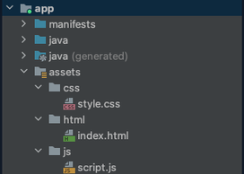

Here are the snippets of the `index.html` and the `script.js` files. The HTML code calls the JavaScript function `printMessage()` which then prints the message `Hello from JavaScript` to the screen.

```html
<html>
<head>
    <link rel="stylesheet" href="../css/style.css">
    <script src="../js/script.js"></script>
</head>
<body>
<h1>
    <script>printMessage()</script>
</h1>
</body>
</html>
```

```js
function printMessage() {
    document.write("Hello from Javascript");
}
```

WebViews can also load content from sources outside the local project. Assuming you want to load Google's home page in the app you just created, then the `webview.loadUrl("file:///android_asset/html/index.html");` will change to `webview.loadUrl("https://www.google.com/");`.

The permission `<uses-permission android:name="android.permission.INTERNET" />` also needs to be added to the `AndroidManifest.xml` file, before the `<application> </application>` tags.

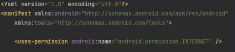

The picture below shows the Google page embedded in the app you created.


### Application Frameworks

Building Android apps from scratch can be challenging as it requires knowledge of multiple languages and tools. Consequently, Android developers often use frameworks to develop applications faster, with better code quality, and simpler maintainability. An application framework is a set of libraries that provides developers with a structured way to build applications using pre-built components and tools. These often include UI elements, security and authentication mechanisms, error handling, logging systems, and more. Different application frameworks are used across various IDEs and programming languages, which increases the overall attack surface. As a result, different methodologies are required when performing application penetration testing.

#### Flutter

... is an open-source mobile application framework developed by Google. With Flutter, developers can build applications in the Dart programming language, using customizable widgets that can be combined to create complex user interfaces. As a cross-platform application framework, development is possible for Android, iOS, web, and Desktop apps providing high performance through compiled native code.

Flutter application development can be done by downloading the Flutter SDK from the [official website](https://flutter.dev/) and setting up an IDE with the Flutter and Dart plugins. In the following example, you will see a simple app created with Flutter and disscues the project's structure, so you can better understand it while performing static analysis in later sections. The following snippet is a simple `Hello World` application written in Dart.

```dart
import 'package:flutter/material.dart';

void main() => runApp(MyApp());

class MyApp extends StatelessWidget {
  @override
  Widget build(BuildContext context) {
    return MaterialApp(
      title: 'Hello World App',
      home: Scaffold(
        appBar: AppBar(
          title: Text('My Flatter App'),
        ),
        body: Center(
          child: Text(
            'Hello from Flutter',
            style: TextStyle(fontSize: 28),
          ),
        ),
      ),
    );
  }
}
```

The above snippet of code will print the text `Hello from Flutter` in the center of the screen.

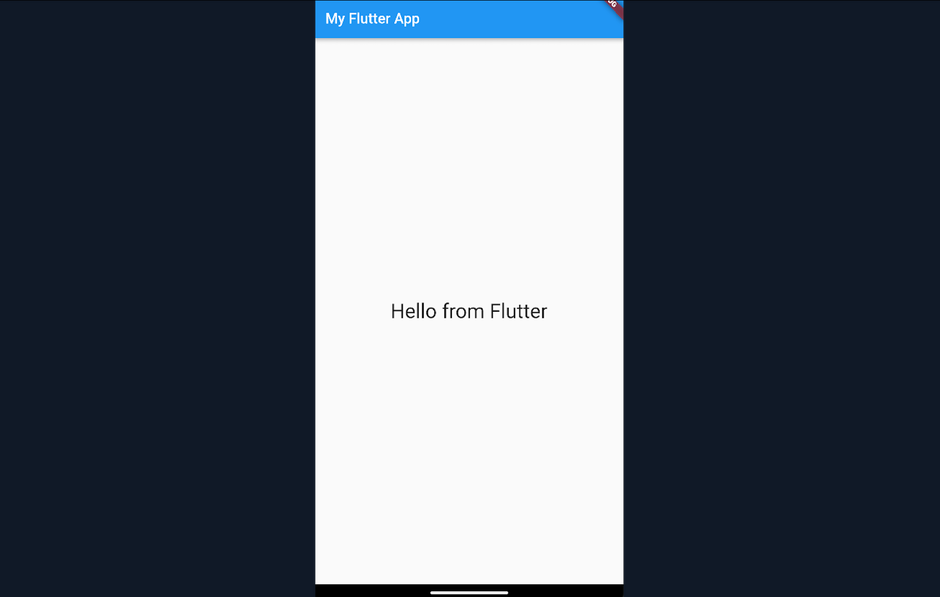

In the screenshot below, you can see that the project structure includes directories that contain data responsible for compatibility with various platforms. Alongside them, you can also see the directory `lib` that contains the file `main.dart`. This is where the code resides.


As mentioned earlier, Flutter compiles the code natively, and thus the app will store the compiled C++ code in shared libraries. However, pentesters can still decode and examine the resources during the static analysis using the appropriate tools. Incidentally, reading the code of an application that includes native components requires a different approach than analyzing a typical Android app written in Java or Kotlin. This is because the tools used to decompile Java bytecode into human-readable pseudocode are not effective for shared libraries containing compiled C or C++ code. Analyzing these native binaries requires specialized tools and techniques.

#### Xamarin

... is a cross-platform application development framework that supports building Android, iOS, and desktop applications. Owned by Microsoft, Xamarin allows developers to create Android apps using C# as the primary programming language within Visual Studio. To get started, you can install the Mobile development with .NET workload in Visual Studio. The following snippet shows a simple "Hello World" application written in C# using Xamarin.

```c#
using Android.App;
using Android.OS;
using Android.Runtime;
using Android.Widget;
using AndroidX.AppCompat.App;

namespace MyApplication
{
    [Activity(Label = "@string/app_name", Theme = "@style/AppTheme", MainLauncher = true)]
    public class MainActivity : AppCompatActivity
    {
        Button button;
        TextView message;
      
        protected override void OnCreate(Bundle savedInstanceState)
        {
            base.OnCreate(savedInstanceState);
            Xamarin.Essentials.Platform.Init(this, savedInstanceState);
            // Set our view from the "main" layout resource
            SetContentView(Resource.Layout.activity_main);
          
            message = FindViewById<TextView>(Resource.Id.message);
            button = FindViewById<Button>(Resource.Id.button);

            button.Click += (sender, args) =>
            {
                message.Text = "Hello World!";
            };
        }
        public override void OnRequestPermissionsResult(int requestCode, string[] permissions, [GeneratedEnum] Android.Content.PM.Permission[] grantResults)
        {
            Xamarin.Essentials.Platform.OnRequestPermissionsResult(requestCode, permissions, grantResults);
            base.OnRequestPermissionsResult(requestCode, permissions, grantResults);
        }
    }
}
```

The above application will print the message `Hello World!` on the screen once the button is pressed.

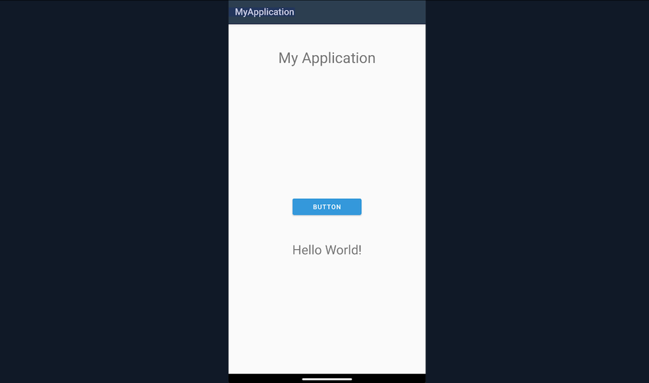

The screenshot below shows the project structure of a Xamarin application in Visual Studio.

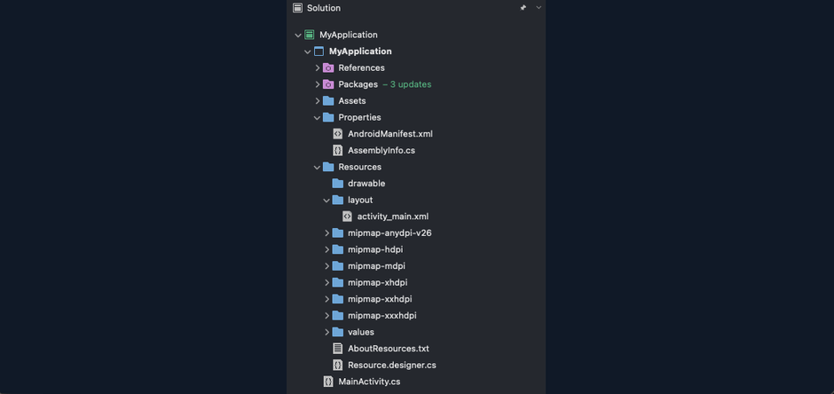

When creating a Xamarin app, the C# source code is compiled into Common Intermediate Language (_CIL_) using the .NET compiler. This intermediate code is then interpreted or just-in-time compiled into platform-specific machine code at runtime, depending on the target environment. Unlike native C++ code, which is compiled into shared libraries, Xamarin applications bundle their intermediate code as .NET assemblies, often packaged inside a sinle file like assemblies.blob.

Since Xamarin apps contain intermediate code rather than native binaries, the reverse engineering process differs from analyzing native C++ or Java/Kotlin applications. The extracted .dll files can be loaded into .NET reverse engineering tools to recover readable pseudocode.

#### Other Frameworks

More application development frameworks can be used to create Android applications, with some of them being React Native, Apache Cordova, and Ionic. These frameworks can create hybrid cross-platform applications that run on Android, iOS, and web browsers using web-based technologies like JS, HTML, and CSS. You can install these frameworks using the NPM command-line tool and start the development on Android Studio. Applications can then run on a Physical or virtual device. The following snippet is a simple `Hello World` using the React Native framework. [This page](https://reactnative.dev/docs/environment-setup) will guide you through building and running a React Native app.

```javascript
import { StatusBar } from 'expo-status-bar';
import { StyleSheet, Text, View } from 'react-native';

export default function App() {
  return (
    <View style={styles.container}>
      <Text style={styles.text}>Hello From React Native</Text>
      <StatusBar style="auto" />
    </View>
  );
}

const styles = StyleSheet.create({
  container: {
    flex: 1,
    backgroundColor: '#fff',
    alignItems: 'center',
    justifyContent: 'center',
  },
  text: {
    fontSize: 28,
  },
});
```

This snippet above will print `Hello From React Native` on the screen.

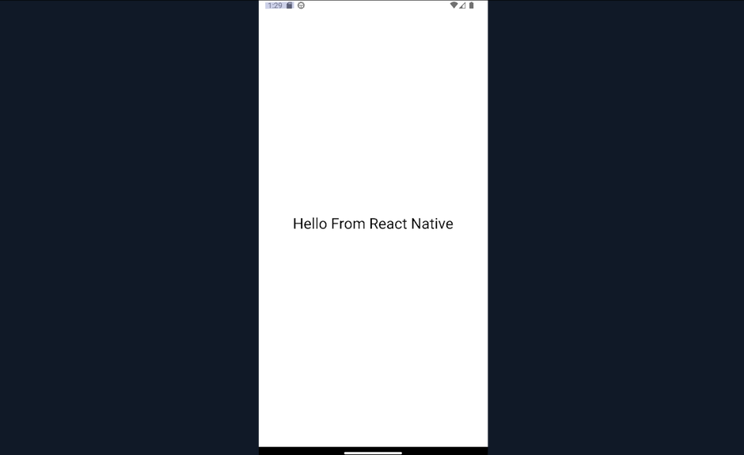

When an application is developed using React Native, the majority of the application's logic and UI are written in JavaScript. The framework will also create the MainActivity and other necessary Java classes that act as the entry point for your application. When the application is prepared for release, the JavaScript code will be bundled into a standalone file called `index.android.bundle`. This file is optimized and minified to improve performance and reduce the overall size of the application. While reversing apps created with React Native, apart from analyzing the Java code to identify the necessary entry points, testers should also analyze the JS code bundled in the `index.android.bundle` file. Another thing testers should keep in mind is that the attack surface will be different than native apps. Apps created with such frameworks may be susceptible to web vulns since they use web technologies.

On the other hand, apps created with Cordova and Ionic frameworks use a WebView component to render the user interface and execute the application code, which is HTML, CSS, and JS. When you build an app using Cordova or Ionic, the web assets are packaged within the application as part of the project structure and can be found during reverse engineering under the directories `assets/www/` and `assets/public/` accordingly.

